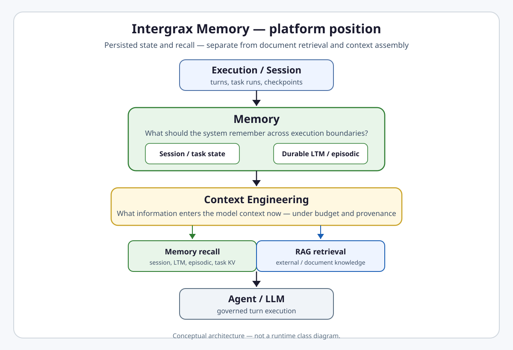

# Memory Platform Position

<picture>
  <source
    media="(prefers-color-scheme: dark)"
    srcset="../memory-platform-position-dark.svg"
  >
  <source
    media="(prefers-color-scheme: light)"
    srcset="../memory-platform-position-light.svg"
  >
  
</picture>

[Open light image](../memory-platform-position-light.svg) ·
[Open dark image](../memory-platform-position-dark.svg)
