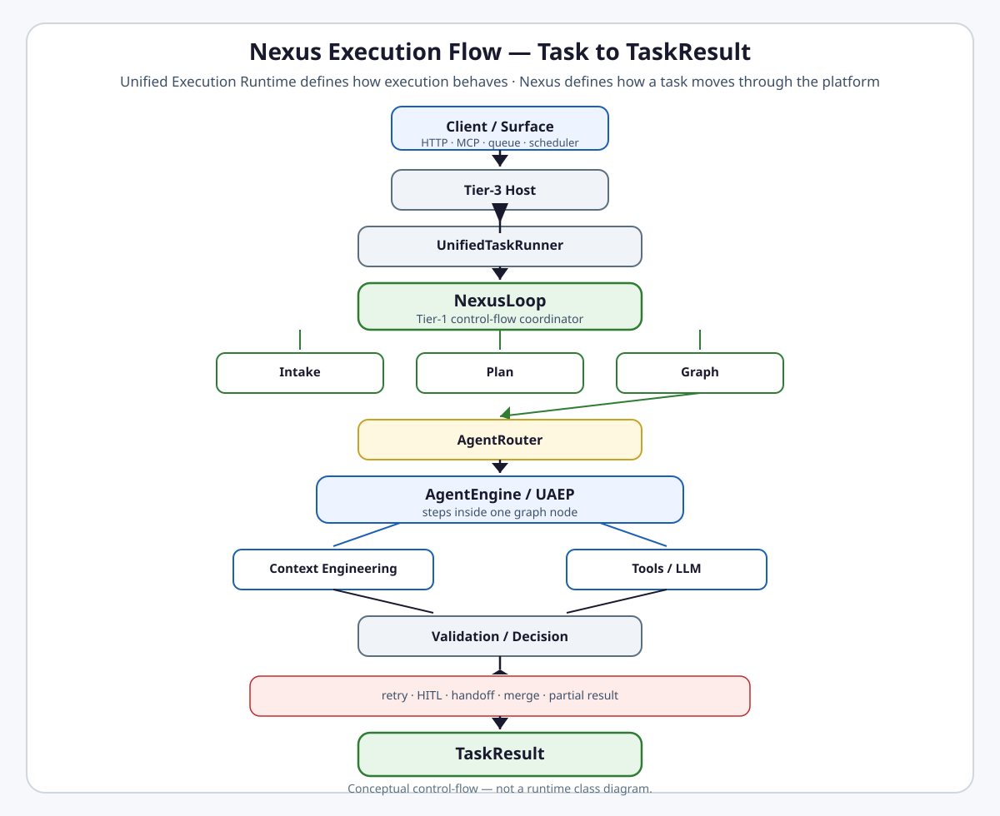

# Nexus Execution Flow

<picture>
  <source
    media="(prefers-color-scheme: dark)"
    srcset="../nexus-execution-flow-dark.svg"
  >
  <source
    media="(prefers-color-scheme: light)"
    srcset="../nexus-execution-flow-light.svg"
  >
  
</picture>

[Open light image](../nexus-execution-flow-light.svg) ·
[Open dark image](../nexus-execution-flow-dark.svg)
