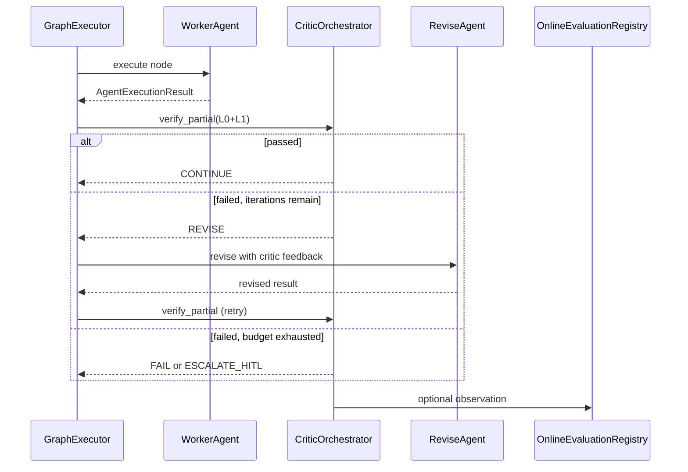

# CRITIC_VERIFICATION - §7+ extended architecture

**Parent hub:** [`CRITIC_VERIFICATION.md`](../CRITIC_VERIFICATION.md)

> [!CAUTION]
> **CURRENT IMPLEMENTATION SNAPSHOT - NOT TARGET CANON**
>
> This satellite documents the **shipped Critic / CVL runtime**. Target architecture: [`DECISION_VERIFICATION.md`](../DECISION_VERIFICATION.md) · [`DECISION_SYSTEM.md`](../DECISION_SYSTEM.md).
> Route target readers to Decision Verification satellites - not this file.


## 7. Component architecture

```text
Tier-3  ApplicationEnvironmentProfile
           ├── evaluation_profile      (existing - registry, shadow, trends)
           └── critic_profile          (new - L1/L2 toggles, thresholds, rubric refs)

Tier-1  Critic & Verification Layer (CVL)
           ├── CriticOrchestrator           ← single entry: verify_partial / verify_final
           ├── L0Gateway                    ← wraps NexusValidationEngine + schema validators
           ├── L1Gateway                    ← invokes eval.judge / eval.trajectory via ToolRuntime
           ├── EvaluatorLoopExecutor        ← critique→revise routing in GraphExecutor
           ├── CriticTraceEmitter           ← trace steps + registry observations
           └── CriticPolicyBridge           ← maps verdict → retry / HITL / fail / continue (**Done** - `policy_bridge.py`)

Tier-0  Primitives
           ├── NexusValidationEngine        (existing)
           ├── eval.judge                     (new tool)
           ├── eval.trajectory                (new tool)
           ├── eval.record_observation        (existing)
           ├── OnlineEvaluationRegistry       (existing)
           ├── ReplayEngine / metrics         (existing - trajectory input)
           └── evaluation_automation          (existing - aggregate rule + judge scores)

Tier-2  Domain
           ├── ValidatorAgent / EvaluatorAgent graph nodes
           ├── Agent.validate() overrides
           ├── Rubric packs (YAML/JSON via Prompt Registry)
           └── Domain executable tests (tools, skills)
```

### 7.1 CriticOrchestrator (Tier-1)

**Module:** `intergrax/runtime/critic/critic_orchestrator.py` (**Done** - CRIT-V-3.1)

**Responsibilities:**

- Accept `CriticRequest` (scope, artifact, context, enabled layers).
- Run L0 → L1 → L2 in order; short-circuit on hard fail.
- Return `CriticVerdict` with per-layer results and combined action.
- Never call LLM directly - delegate L1 to Tier-0 tools via `ToolRuntime`.

**Non-responsibilities:** Rubric authoring, domain revise logic, graph scheduling.

### 7.2 L0Gateway

Wraps existing validation path:

- `NexusValidationEngine.validate()`
- Optional JSON/schema validators on `AgentExecutionResult.structured_data`
- Agent-local `validate()` when invoked from UAEP completion path

### 7.3 L1Gateway

Invokes:

- `eval.judge` - semantic scoring against `RubricSpec` (LLM-as-judge via separate critic profile)
- `eval.trajectory` - **deterministic** process scoring from replayed trace slice (tool errors, duplicates, denied calls)

For **LLM-based trajectory regression** in offline eval harnesses, compose the `eval.trajectory_judge` skill (`eval.judge` + `eval.trajectory` + `eval.record_observation`) - not a separate Tier-1 gateway path.

Uses **separate** `LLMProfile` (critic profile) from producer agent for `eval.judge` only.

### 7.4 EvaluatorLoopExecutor (Tier-1)

Extends graph execution for `CoordinationPattern.EVALUATOR_LOOP`:

```text
Worker node → CriticOrchestrator.verify_partial
    → pass: continue
    → fail + budget: route to Revise node (same or dedicated agent)
    → fail + exhausted: FAILED or HITL per policy
```

Configuration: `EvaluatorLoopSpec` (max_iterations, min_score, revise_node_id).

### 7.5 CriticProfile (Tier-3 extension)

New typed profile on `ApplicationEnvironmentProfile` (alongside `EvaluationProfile`):

| Field | Purpose |
|-------|---------|
| `semantic_judge_enabled` | Enable L1 on configured scopes |
| `trajectory_eval_enabled` | Enable trajectory critic |
| `judge_threshold` | Minimum score (default 0.75) |
| `require_critic_on_completion` | Fail if L1 unavailable when enabled |
| `evaluator_loop_max_iterations` | Cap for critique-revise |
| `critic_llm_profile_ref` | Separate model for judges |
| `default_rubric_ref` | Prompt registry id for generic rubric |
| `scopes` | `node`, `graph_final`, `uaep_step` flags |

Wiring mirrors EVAL phase: `wire_application_critic()` → `RuntimeConfig` → policy bundle fragment `critic_governance`.

---

## 8. Core contracts

**Package:** `intergrax/runtime/critic/contracts.py` - **Done** (CRIT-V-1)

```python
# Conceptual - implement in CRIT-V-1

class CriticScope(str, Enum):
    NODE_PARTIAL = "node_partial"
    GRAPH_FINAL = "graph_final"
    UAEP_STEP = "uaep_step"
    OFFLINE_CASE = "offline_case"

class CriticLayer(str, Enum):
    L0_DETERMINISTIC = "l0_deterministic"
    L1_SEMANTIC = "l1_semantic"
    L1_TRAJECTORY = "l1_trajectory"
    L2_HUMAN = "l2_human"

class LayerVerdict(BaseModel):
    layer: CriticLayer
    passed: bool
    score: float | None
    errors: list[str]
    warnings: list[str]

class CriticVerdict(BaseModel):
    scope: CriticScope
    passed: bool
    layers: list[LayerVerdict]
    recommended_action: CriticAction  # CONTINUE | RETRY | REVISE | ESCALATE_HITL | FAIL

class CriticRequest(BaseModel):
    scope: CriticScope
    run_id: str
    agent_id: str
    execution: AgentExecutionResult | None
    answer: RuntimeAnswer | None
    rubric_ref: str | None
    enabled_layers: tuple[CriticLayer, ...]
    context: dict[str, Any]  # task_class, capability, plan_criteria
```

**Tool contracts (Tier-0):**

| Tool ID | Input | Output |
|---------|-------|--------|
| `eval.judge` | output text, rubric, reference context, optional golden | score 0–1, reasons, passed |
| `eval.trajectory` | run_id or trace slice, min_score threshold | score, process anomaly flags, reasons (heuristic - not LLM rubric) |

Both tools append optional `OnlineEvaluationObservation` when registry bound.

---

## 9. Execution flows

### 9.1 Partial verification (graph node)

Already partially implemented via `NexusValidationEngine` + retry. CVL extends:

```text
GraphExecutor._execute_node
  → AgentEngine.run_agent_with_result
  → CriticOrchestrator.verify_partial(scope=NODE_PARTIAL)
       → L0Gateway (existing validation_engine path)
       → L1Gateway (if critic_profile.semantic_judge_enabled)
  → on fail: RetryEngine OR EvaluatorLoopExecutor.revise route
  → CriticTraceEmitter
```

### 9.2 Final verification (graph completion)

```text
GraphRunner (post graph success)
  → lifecycle VALIDATING
  → CriticOrchestrator.verify_final(scope=GRAPH_FINAL)
  → existing final_validation merge
  → terminal state COMPLETED | PARTIALLY_COMPLETED | FAILED | WAITING_FOR_HUMAN
  → OnlineEvaluationRegistry observation (if profile enabled)
```

### 9.3 Offline verification (benchmarks)

```text
NexusEvalRunner.run_case
  → execute case
  → CriticOrchestrator.verify_final(scope=OFFLINE_CASE)
       → L0: exact match OR schema
       → L1: optional semantic equivalence via eval.judge
  → EvalResult with layer breakdown
```

### 9.4 Integration with existing evaluation hooks

CVL **feeds** existing infrastructure; does not replace it:

| Existing hook | CVL relationship |
|---------------|------------------|
| `NexusValidationEngine` | L0Gateway delegates here |
| `evaluation_automation.evaluate_automated_results` | Consumes L1 scores from registry |
| `RuntimeArchitectureGovernanceBridge.record_shadow_run_evaluation` | Shadow runs use CVL verdict |
| `VerificationLoop.check_eval_registry_trend` | Adaptive L4 consumes CVL observations |
| `NEXUS_EXECUTION_FLOW` §18 | Update hook table when CRIT-V ships |

---

## 10. Evaluator-loop pattern (critique–revise)

Aligns with [`IDEAL_HARNESS_AI_ARCHITECTURE.md`](guides/IDEAL_HARNESS_AI_ARCHITECTURE.md) §6.4 and canon §53.10.



**Selection:** `select_coordination_pattern()` may recommend `EVALUATOR_LOOP` when complexity/risk high and latency budget allows - existing V-MA catalog.

---

## Verification Safety Boundaries

CVL answers correctness questions; it does **not** silently grant authority for high-risk irreversible side effects.

**Normative rule:** Verification may block, escalate, request more evidence, request HITL, or mark a result as insufficient. Verification **MUST NOT** silently authorize high-risk irreversible side effects based only on probabilistic or LLM-based judgment.

Verification is a **Harness/runtime concern** - orchestrated through `CriticOrchestrator`, policy bridges, and HITL gates - not a private agent decision buried in narrative output.

**Cross-refs:** [`SYSTEM_INVARIANTS.md`](../guides/SYSTEM_INVARIANTS.md) §8 · [`RELIABILITY_FAILURE_AND_HITL.md`](RELIABILITY_FAILURE_AND_HITL.md#attempt-ledger) · [`NEXUS_EXECUTION_FLOW.md`](NEXUS_EXECUTION_FLOW.md) · [`UNIFIED_EXECUTION_RUNTIME.md`](UNIFIED_EXECUTION_RUNTIME.md) · [`OBSERVABILITY.md`](OBSERVABILITY.md#observability-event-spine) · [`AGENT_CONTRACTS_AND_ASSEMBLY.md`](AGENT_CONTRACTS_AND_ASSEMBLY.md) · [`TOOLS.md`](TOOLS.md) · [`MATURITY_TAXONOMY.md`](../guides/MATURITY_TAXONOMY.md) · [`ADAPTIVE_HARNESS_INTELLIGENCE.md`](ADAPTIVE_HARNESS_INTELLIGENCE.md#governance-boundary) · [`CODE_CRAFT.md`](CODE_CRAFT.md#codecraft-safety-boundary)

---

## Verification levels and authority

Normative authority model for the L0 / L1 / L2 stack (§6). Layers compose; they do not substitute for one another on high-risk paths.

### L0 - Deterministic verification

- schema validation
- contract validation
- type checks
- required fields
- policy constraints
- deterministic safety rules
- idempotency requirements
- tool result shape validation

L0 **MAY** block execution. L0 **SHOULD** run before L1 whenever possible.

### L1 - Semantic / probabilistic verification

- LLM-as-judge
- rubric-based semantic evaluation
- trajectory critique
- confidence scoring
- consistency checks
- factuality checks when evidence is available

L1 **MAY** recommend pass / fail / escalate. L1 **MUST NOT** be the only approval mechanism for irreversible high-risk side effects.

### L2 - Human / authoritative verification

- human approval
- business owner approval
- domain expert review
- external authoritative system confirmation
- legal / compliance review where required

L2 is required when policy, risk tier, or missing evidence demands human or authoritative approval.

**Combined verdict (unchanged):** `CriticVerdict.passed = L0.passed ∧ (L1.passed if enabled) ∧ (L2.passed if required)`.

---

## High-risk side effect rule

Hard rules for side effects that are irreversible, externally visible, or policy-classified as high risk:

- High-risk or irreversible side effects require policy approval and traceable verification evidence.
- LLM-as-judge alone **MUST NOT** authorize high-risk irreversible side effects.
- Semantic confidence alone **MUST NOT** override deterministic validation failure.
- Human approval boundaries must be managed by Nexus / HITL mechanisms, not ad-hoc agent messages.
- If verification cannot establish sufficient confidence, the runtime should escalate, degrade, request human review, or stop.
- Verification results must be traceable through the observability spine (`RuntimeEvent` / `CriticTraceEmitter` - [`OBSERVABILITY.md`](OBSERVABILITY.md#observability-event-spine)).

---

## Verification ownership

| Concern | Owner |
|---------|-------|
| Verification architecture and execution gateway | Harness / runtime |
| Domain rubric | Tier-2 agent / domain package |
| Product risk threshold | Tier-3 application profile / policy |
| Deterministic schema validation | Contract / runtime validators |
| Semantic judge execution | CVL / approved evaluator mechanism |
| HITL escalation | Nexus / HITL runtime |
| Final side-effect authorization | Policy + runtime + required verification level |
| Audit evidence | `RuntimeEvent` / observability spine |

---

## Disallowed verification patterns

Agents, tools, and applications **MUST NOT**:

- treat LLM judge output as unconditional truth
- bypass L0 deterministic validation when L0 is available
- perform high-risk side effects after L1-only approval
- hide verification failures inside final narrative output
- implement private human approval flows inside agents
- store verification decisions only in local logs
- bypass `RuntimeEvent` / observability spine for verification outcomes
- use semantic evaluator results without preserving evidence / provenance
- silently downgrade risk tier to avoid HITL
- describe a verification path as production-ready without maturity / evidence statement ([`MATURITY_TAXONOMY.md`](../guides/MATURITY_TAXONOMY.md))

---

## Cursor review checklist

Before adding or modifying verification behavior, Cursor must verify:

- [ ] Is there an L0 deterministic check where possible?
- [ ] Is L1 semantic evaluation clearly separated from L0 deterministic validation?
- [ ] Can L1 block / escalate without being treated as absolute truth?
- [ ] Does this path involve high-risk or irreversible side effects?
- [ ] If high-risk, is L2 / HITL or authoritative verification required?
- [ ] Are verification results traced through `RuntimeEvent` / observability spine?
- [ ] Are rubrics domain-owned and policies application / runtime-owned?
- [ ] Is the production readiness claim expressed through [`MATURITY_TAXONOMY.md`](../guides/MATURITY_TAXONOMY.md)?
- [ ] Does the change avoid private agent-local approval systems?

---

## 11. Policy and governance

`critic_governance` fragment in `RuntimePolicyBundle` (Tier-3 merge):

| Policy key | Effect |
|------------|--------|
| `require_l0_on_all_nodes` | Default true |
| `semantic_judge_min_risk` | Enable L1 only above risk tier |
| `block_complete_on_critic_fail` | Terminal gate |
| `critic_cost_budget_tokens` | Cap L1 spend per run |
| `human_review_on_borderline` | Score in [0.6, threshold) → HITL |

Integrates with existing `RuntimePolicyEngine` - no agent-specific branches.

---

## 12. Observability

| Event | Trace step | Runtime event |
|-------|------------|---------------|
| L0 fail | `critic.l0_failed` | `VALIDATION_ERROR` |
| L1 judge | `critic.l1_judge` | `LLM_CALL` (critic profile) |
| Trajectory eval | `critic.trajectory` | `STEP_COMPLETED` |
| Evaluator-loop iteration | `critic.evaluator_loop` | custom tag |
| Final verdict | `critic.final_verdict` | maps to task lifecycle |

---

## 13. Maturity model (target)

| Level | CVL capability |
|-------|----------------|
| **L0** | Structural validation only (current baseline) |
| **L1** | L0 + registry wiring (Phase EVAL - Done) |
| **L2** | L1 + `eval.judge` + `CriticProfile` + partial hooks |
| **L3** | L2 + trajectory eval + evaluator-loop executor + semantic offline runner |
| **L4** | L3 + adaptive critic threshold proposals + human-calibrated judge baseline in CI |

**Current:** **L3+** (CRIT-V-0…7 + FOLLOWUP complete, 2026-06-13 layer completion audit). **Next:** L4 adaptive critic thresholds (deferred - AHIA / product gate).

---

## 14. Non-goals (Phase CRIT-V)

- Universal mandatory LLM-judge on every production run.
- Domain rubric library in Tier-0/Tier-1.
- Replacing human compliance workflows.
- Second evaluation registry or trace system.
- FLOW-8 reference product app (remains §6.3 deferred) - CRIT-V may use lab harness only.

---

## 15. Relationship to industry patterns

| Pattern | CVL mapping |
|---------|-------------|
| **LangGraph checkpoint/validation nodes** | `CriticOrchestrator` + graph hooks |
| **LangSmith evaluators + datasets** | `OnlineEvaluationRegistry` + `NexusEvalRunner` |
| **PEV (Plan-Execute-Verify)** | CVL = Verify phase infrastructure |
| **Agent-as-judge / LLM-as-judge** | `eval.judge` + ValidatorAgent nodes |
| **Trajectory evaluation** | `eval.trajectory` + ReplayEngine |

---

## 16. Implementation tracking

See [`plan/CRITIC_VERIFICATION.md) - **Phase CRIT-V**.

| Wave | Focus | Status |
|------|-------|--------|
| CRIT-V-0 | This document, ADR-CRITIC-001, canon §55, README | **Done** |
| CRIT-V-1 | Contracts + `CriticProfile` | **Done** |
| CRIT-V-2 | Tier-0 tools `eval.judge`, `eval.trajectory` | **Done** |
| CRIT-V-3 | `CriticOrchestrator` + graph hooks + UAEP step hook | **Done** |
| CRIT-V-4 | `EvaluatorLoopExecutor` | **Done** |
| CRIT-V-5 | `NexusEvalRunner` semantic mode | **Done** |
| CRIT-V-6 | Tier-3 wiring + policy bundle + CI | **Done** |
| CRIT-V-7 | FAUDIT-EVAL.1 baseline gate + docs Appendix W | **Done** |
| CRIT-V-FOLLOWUP | L1 tool client, L2 HITL, UAEP hook, policy bridge | **Done** |

---

## 17. Forbidden patterns

- **Fat Critic Nexus** - domain rubrics or revise logic in Tier-1.
- **Self-judge** - same LLM profile for producer and critic without policy override.
- **L1-only verification** - skipping L0 for speed.
- **Silent pass** - critic disabled but terminal `COMPLETED` on high-risk tasks when `require_critic_on_completion=true`.
- **Duplicate registry** - critic scores stored outside `OnlineEvaluationRegistry`.

---

## 18. References

- Canon §29 Validation Model · §42.43 Multi-Agent Flow · §53.10 Coordination patterns
- [`architecture/NEXUS_EXECUTION_FLOW.md`](architecture/NEXUS_EXECUTION_FLOW.md) §18 Evaluation hooks
- [`guides/AGENT_CREATION_GUIDE.md`](guides/AGENT_CREATION_GUIDE.md) Appendix U (Evaluation) · Appendix W (Critic)
- [`architecture/ADAPTIVE_HARNESS_INTELLIGENCE.md`](architecture/ADAPTIVE_HARNESS_INTELLIGENCE.md) - L4 verify loop consumes CVL signals

---

*Maintainer: update this file when Phase CRIT-V deliverables land; sync canon §55 and plan register.*
