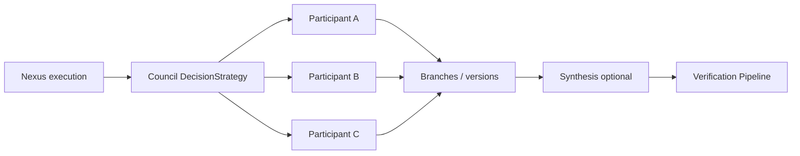
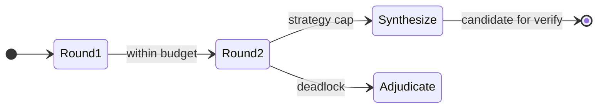

# DECISION_DELIBERATION — extended architecture

**Parent hub:** [`DECISION_DELIBERATION.md`](../DECISION_DELIBERATION.md)

> **Canon:** frozen target. **DecisionStrategy** is the extension point — **no Council Runtime**.

---

## 1. DecisionStrategy model

**DecisionStrategy** is the platform extension point for proposal and optional multi-participant deliberation. Strategies run **inside Nexus execution** under shared budget and checkpoint semantics — not a second decision runtime.

| Capability | Description |
| ---------- | ----------- |
| Single-shot proposal | Emit one or more candidate versions |
| Multi-round deliberation | Bounded rounds under shared hosting Execution budget |
| Parallel proposals | Branching candidates with preserved lineage |
| Disagreement capture | Structured artifact when participants diverge |
| Synthesis | Optional merged candidate for verification — does not erase dissent |

---

## 2. Single Model strategy

One producer emits candidate Decision Versions for verification. Minimal deliberation surface — still versioned, still verification-gated, still lifecycle-owned resolution.

---

## 3. Rule-Based strategy

Deterministic or rule-driven proposal without LLM deliberation rounds. Outputs typed Decision Artifacts bound to versions — same verification and finalization contracts as model strategies.

---

## 4. Hybrid strategy

Combines rule-based gates with model proposal (or council) under one strategy profile. Orchestration remains Nexus-owned; strategy declares which phases are rule vs model.

---

## 5. Council strategy

Council orchestrates parallel participant proposals under Nexus — **no Council Runtime**. Council is one **DecisionStrategy** implementation, not a platform scheduler.

---

## 6. Participants and roles

Participants are configured **roles** with visibility policies — not hard-coded persona names in platform core (e.g. proposer, skeptic, synthesizer) with explicit contracts.

---

## 7. Proposal branches and lineage

Each participant may emit candidates; branches remain in immutable **version lineage**. Concurrent branches preserve history — no last-write-wins at strategy layer.

---

## 8. Participant independence

Meaningful separation between participant models/providers — or explicit **non-independent** declaration in strategy profile. Independence supports audit claims about diverse critique, not cosmetic label swaps.

---

## 9. Context visibility

Per-role visibility policy controls tool-derived context, evidence surfaces, and other configured context channels - **no hidden shared chain-of-thought store**. **Tool exposure** means visibility of tool-derived context/results to a role, **not** authorization to invoke tools or execute side effects. Visibility choices are auditable configuration, not implicit platform defaults. Invariant: **decision quality != authorization != execution**.

---

## 10. Provider / model diversity

Strategies may assign distinct providers/models per participant. Diversity is configuration — platform core does not embed vendor-specific council personas.

---

## 11. Disagreement artifact

Structured capture of positions, alternatives, and evidence refs when participants diverge — preserved through synthesis and available to adjudication without private CoT persistence.

---

## 12. Evidence references in deliberation

Evidence and tool results are **attributed per participant** for audit reconstruction. Deliberation may cite Evidence Claims — strategies do not substitute diagnostics or observability as decision owners.

---

## 13. Synthesis

Produces a candidate Decision Version for verification — optional merge of participant outputs. Synthesis is proposal, not finalization.

---

## 14. Dissent preservation

Majority vote or consensus heuristics must **not erase material dissent**. Disagreement artifacts remain linked to synthesized candidates for downstream verification and adjudication.

---

## 15. Adjudication boundary

Deadlock or irresolvable conflict routes to **adjudication** or `UNRESOLVED` — not hidden tie-break inside strategy. HITL adjudication is lifecycle-invoked; strategy surfaces structured deadlock signals.

---

## 16. Bounded rounds and parallelism

Deliberation rounds are bounded by strategy configuration. **Parallel participant proposals** are allowed; finalize semantics remain lifecycle-owned.

---

## 17. Hosting Execution budget and crash / resume

Council, verification, and revision **share the hosting execution budget** — no separate Council budget engine. Resume cannot expand a previously granted hosting Execution budget ceiling.

Strategy state needed for resume persists through the **canonical hosting Execution checkpoint/persistence boundary** — not a second scheduler. Nexus may participate only when ORCHESTRATION is selected. After crash, deliberation continues from checkpoint without duplicating terminal outcomes.

---

## 18. Deliberation vs semantic revision vs technical retry

| Kind | Owner | Trigger |
| ---- | ----- | ------- |
| Deliberation continuation | DecisionStrategy | Next round within budget |
| Semantic revision | Decision Lifecycle | Challenge / adjudication revision policy |
| Technical retry | Execution / Reliability appropriate to failing operation | Provider/tool failure — not rubric insufficiency |

Private chain-of-thought is **not** persisted as authoritative evidence.

**Paired depth:** [`DECISION_SYSTEM_extended_depth.md`](DECISION_SYSTEM_extended_depth.md) · [`DECISION_VERIFICATION_extended_depth.md`](DECISION_VERIFICATION_extended_depth.md)
