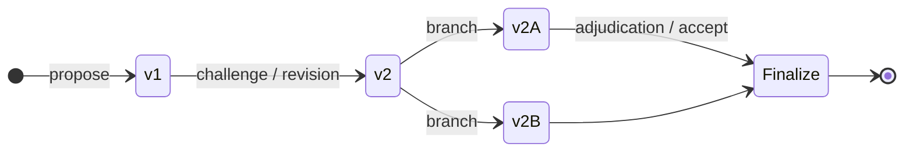
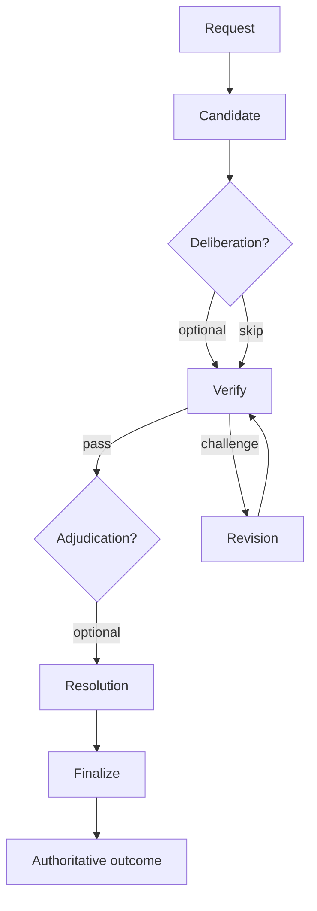
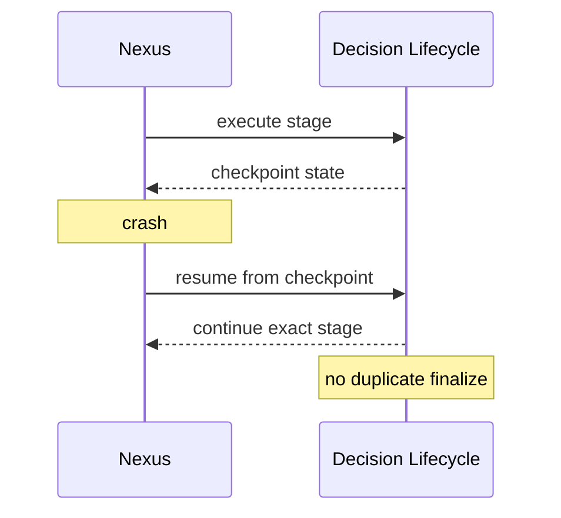

# DECISION_SYSTEM — extended architecture

**Parent hub:** [`DECISION_SYSTEM.md`](../DECISION_SYSTEM.md)

> **Canon:** frozen target. Nexus executes Decision Lifecycle — no second runtime.

---

## 1. Scope and ownership

The Decision System owns **lifecycle semantics, version lineage, resolution outcomes, and strategy orchestration contracts** for platform decisions. Nexus is the sole execution owner; Policy/Governed Execution owns authorization; HITL owns human authority records; Observability owns audit evidence; Diagnostics may inform investigation but does not own lifecycle.

| Concern | Owner |
| ------- | ----- |
| Lifecycle orchestration | Nexus |
| Strategy semantics | DecisionStrategy plugins |
| Correctness gates | Verification Pipeline |
| Execution authorization | Policy / Governed Execution |
| Human authority records | HITL (Reliability domain) |
| Audit evidence | Observability |
| Problem classification | Diagnostics (adjacent, not owner) |

---

## 2. Decision identity

**Decision ID** identifies a decision scope across the hosting execution tree. It is stable for the life of the decision thread.

Every record that can affect authority must bind:

- Decision ID
- Decision Version
- decision scope (domain-defined)
- tenant
- execution identity (`TaskId` / `RunId` / `AttemptId` / TARGET `ExecutionId`)

---

## 3. Version model

Each **Decision Version** is immutable once minted. Revisions append `v(n+1)` — they never mutate `v(n)` in place.



Parent/branch lineage is preserved for audit even after finalization.

### Stale approval protection

Human or policy approval for `v1` is **invalid** after a revision mints `v2`. Authorization records must reference exact version or fail closed.

Verification results, challenges, adjudication outcomes, and execution authorization records are all version-bound — loose context dicts are not authority identity.

---

## 4. Lifecycle model

| Stage | Owner | Persists |
| ----- | ----- | -------- |
| Proposal | Nexus lifecycle | Candidate Decision + Decision Version |
| Deliberation (optional) | DecisionStrategy via Nexus | Candidate versions + disagreement artifact |
| Verification | Verification Pipeline | Verification Result (+ Challenge) |
| Revision | Decision Lifecycle | New immutable Decision Version |
| Adjudication (optional) | Lifecycle + HITL invocation | Adjudication record |
| Resolution | Decision Lifecycle | ACCEPTED / REJECTED / UNRESOLVED |
| Finalization | Decision Lifecycle | Authoritative Accepted Decision **or** Resolution Record |



---

## 5. Resolution semantics

**Lifecycle stage** describes orchestration progress (proposal, verifying, revising, …). **Decision Resolution** describes the substantive outcome.

| Outcome | Meaning |
| ------- | ------- |
| ACCEPTED | A specific Decision Version satisfies gates — Authoritative Accepted Decision |
| REJECTED | Process completed — no version accepted as correct |
| UNRESOLVED | Insufficient basis for responsible resolution |

Execution may complete, fail, cancel, or budget-stop while Decision Resolution remains `UNRESOLVED`. Infrastructure failure does not auto-map to `REJECTED`.

Challenges and adjudication requests mint **new versions** through explicit revision — verification never mutates candidates in place.

Optional adjudication resolves competing branches, verifier conflict, deadlocked Council, or human adjudication — may end in any resolution outcome including `UNRESOLVED`.

| Resolution | Finalization artifact |
| ---------- | --------------------- |
| ACCEPTED | Authoritative Accepted Decision |
| REJECTED / UNRESOLVED | Authoritative Resolution Record (no fake accepted version) |

---

## 6. Authoritative outcome model

Candidates are proposals under test. **Authoritative** outcomes are terminal per scope — either one accepted version or one resolution record.

Finalize guard enforces **at most one** terminal authoritative lifecycle outcome per decision scope.

| Layer | Question |
| ----- | -------- |
| Decision | What did the system conclude? |
| Authorization | May this action proceed under policy? |
| Execution | What did Nexus actually do? |

---

## 7. Authority boundaries

Decision System invokes HITL; Policy/Governed Execution owns execution authorization. Correct ACCEPTED decisions may still be blocked pending human approval.

Execution authorization must cite the exact Decision Version. Post-revision approvals require re-authorization.

Finalization persists durable authoritative artifacts and closes the lifecycle for the scope — without deleting candidate history.

---

## 8. Concurrency

```text
       → v2A
v1 ─┬─
       → v2B
```

Both branches preserve immutable history. **No last-write-wins** finalization.

Concurrent finalize attempts for the same scope must be idempotent and conflict-detected — duplicate authoritative outcomes are forbidden.

Resume and retry paths must not mint duplicate terminal outcomes or duplicate side effects tied to the same decision scope.

---

## 9. Crash / recovery

Lifecycle stage, version lineage, and finalize guard state are persisted via **Nexus checkpoint** — no Decision-owned checkpoint engine.

Resume cannot expand a previously granted Nexus budget ceiling. Deliberation, verification, and revision share the hosting execution budget.

Finalize guards and idempotent persistence keys prevent double authoritative decisions after process death.



---

## 10. Policy / HITL version binding

Approval for `v1` does **not** authorize `v2`. HITL records bind Decision ID + Version + scope + tenant + execution identity.

Policy evaluates whether a specific version may execute — separate from whether the version passed verification.

---

## 11. Observability / audit reconstruction

Full decision audit trail without private chain-of-thought:

| Family | Role |
| ------ | ---- |
| Decision Artifact | Typed payload bound to a Decision Version |
| Verification Result | Stage-composed correctness verdict for one version |
| Challenge | Semantic insufficiency signal → revision (not mutation) |
| Disagreement Artifact | Structured dissent preserved through synthesis |
| Authoritative Accepted Decision | Terminal ACCEPTED binding one version |
| Authoritative Resolution Record | Terminal REJECTED / UNRESOLVED without fake acceptance |

Correlate: Decision ID, Decision Version, lifecycle events, verification events, resolution, authorization relation.

---

## 12. Platform relationships

| Neighbor | Relationship |
| -------- | ------------- |
| **Nexus** | Sole execution owner for lifecycle stages, budgets, checkpoints, technical retry, persistence |
| **Policy / Governance** | Cross-cutting execution authorization — does not determine decision correctness |
| **HITL** | Canonical human approver / adjudicator — invoked by lifecycle |
| **Reliability** | Technical retry on provider/tool failure — distinct from semantic revision |
| **Observability** | Records decision audit evidence — no private CoT |
| **Diagnostics** | May inform investigation — does not own lifecycle or rubric content |
| **Evidence Claims / Eval** | Evidence claims support evidence-backed decisions; online/shadow/offline eval remain **outside** runtime verification ownership |
| **Tools / LLM adapters** | Invoked by strategies and verification stages under governed boundaries |

---

## 13. Security invariants

```text
DS-INV-001  Candidate ≠ Authoritative — append versions, never overwrite.
DS-INV-002  Decision Resolution ≠ execution termination.
DS-INV-003  At most one terminal authoritative outcome per decision scope.
DS-INV-004  Verification checks — does not finalize or authorize alone.
DS-INV-005  Approval / authorization binds Decision ID + Version + scope + tenant + execution identity.
DS-INV-006  UNRESOLVED is a first-class auditable resolution.
```

---

## 14. Extension boundaries

| Surface | Contract |
| ------- | -------- |
| DecisionStrategy | Registered strategies (Single, Council, Rule, Hybrid, …) |
| Verification stage plugins | Ordered compositional stages |
| Decision Artifact kinds | Typed registration — not `dict[str, Any]` payloads |
| Adjudication hooks | Optional human / policy adjudication interfaces |

**Paired depth:** [`DECISION_VERIFICATION_extended_depth.md`](DECISION_VERIFICATION_extended_depth.md) · [`DECISION_DELIBERATION_extended_depth.md`](DECISION_DELIBERATION_extended_depth.md)
