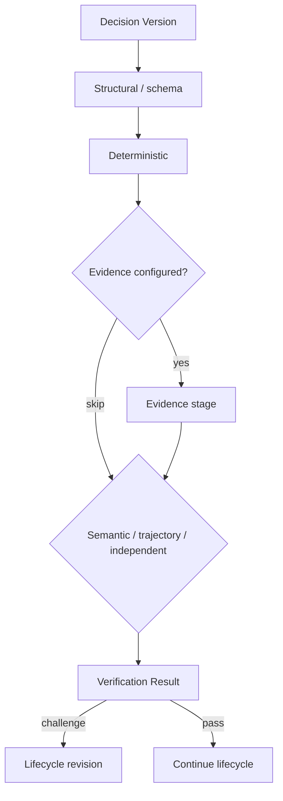
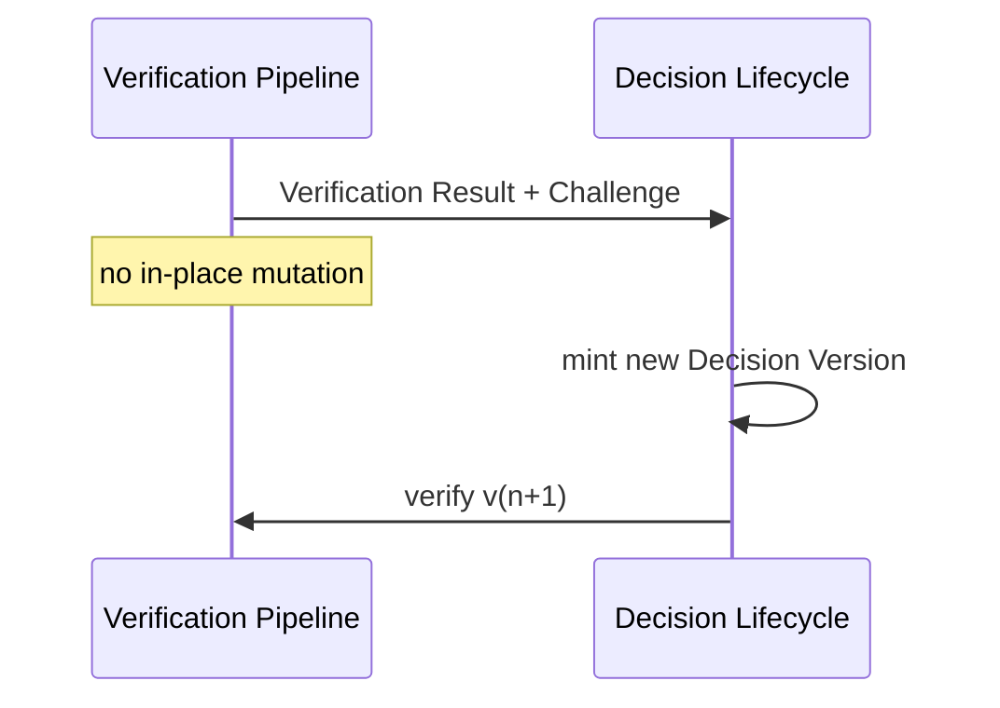

# DECISION_VERIFICATION — extended architecture

**Parent hub:** [`DECISION_VERIFICATION.md`](../DECISION_VERIFICATION.md)

> **Canon:** frozen target. Verification checks — Decision Lifecycle revises and finalizes.

---

## 1. Verification Pipeline model

The **Verification Pipeline** evaluates exactly one **Decision Version** per invocation and returns a **Verification Result** — optionally containing a **Challenge** that requests lifecycle revision. Pipelines are **declarative compositions** of registered stages, not a monolithic orchestrator class.

Verification answers whether this version satisfies configured correctness gates. It does **not** authorize execution, finalize authoritative decisions, own global retry, or invoke HITL.

| Output | Meaning |
| ------ | ------- |
| Pass | Stages satisfied for this version — lifecycle may continue |
| Challenge | Semantic insufficiency — lifecycle mints new version |
| Fail / block | Required stage failed — bounded revision or terminal resolution |

---

## 2. VerificationStage model

Each **VerificationStage** is a typed plugin with explicit **required vs optional** posture, ordering constraints, and stage-kind contract. Stages emit **typed sub-results** aggregated into the Verification Result.

Stages register through platform contracts — domain teams add structural, deterministic, evidence, semantic, trajectory, or independent verifiers without forking the pipeline kernel.

---

## 3. Structural / schema verification

First-line validation of **Decision Artifact** shape, schema version, and contract validity. Cheap rejection before probabilistic stages.

Fails closed on malformed payloads — no downstream semantic spend on structurally invalid candidates.

---

## 4. Deterministic verification

Rule-based validation, guardrails, and L0-class checks. Platform default ordering runs **deterministic before probabilistic** when both apply.

Deterministic failure blocks acceptance unless profile routes to revision with bounded iteration ceilings.

---

## 5. Evidence verification

Validates evidence references, claim admissibility, and provenance requirements for evidence-backed decisions. Integrates with Evidence Claims domain semantics — eval/shadow systems remain **outside** runtime pipeline ownership.

Missing or inadmissible evidence fails closed per profile — no synthetic pass.

---

## 6. Semantic judge

Rubric-backed LLM evaluation when configured. Requires **rubric provenance** (named, versioned criteria) before execution. Missing rubric → fail closed.

Semantic stages use **independent provider/model configuration** from the producer — or declare **non-independent** mode explicitly in profile.

---

## 7. Trajectory verification

Evaluates multi-step reasoning paths where configured — distinct from single-shot semantic rubric on final artifact. Useful for agentic trajectories without conflating trajectory critique with authorization.

---

## 8. Independent / custom review

Domain or third-party verifier plugins with explicit independence posture. Custom stages obey the same required/optional and ordering contracts as platform stages.

---

## 9. Ordered composition

Stages run in configured order. Conflicting **required** stage outcomes fail closed or route to adjudication / `UNRESOLVED` per profile — not last-stage wins.

---

## 10. Required vs optional stages

| Class | Fail-closed rule |
| ----- | ---------------- |
| Required stage | Unavailable → no synthetic pass |
| Optional stage | May be skipped when disabled — never silently substitute pass |

Optional stages never mask required-stage failure.

---

## 11. Fail-closed semantics

Missing required stage, unavailable verifier, unresolved rubric, or unresolved canonical identity → **no synthetic pass**. Profiles may route to `UNRESOLVED` or HITL — never silent acceptance.

---

## 12. Verifier unavailability

Required verifier unavailable → fail closed (profile may route to `UNRESOLVED` or HITL — never silent pass). Infrastructure outage is not automatic REJECTED — resolution semantics remain lifecycle-owned.

---

## 13. Producer / verifier separation

Semantic stages must use meaningfully independent provider/model configuration from the producer — or declare **non-independent** mode explicitly in profile. Self-judge without declaration is forbidden in regulated profiles.

---

## 14. Rubric provenance and trusted verifier context

Named rubrics resolve to versioned criteria with provenance before semantic evaluation. Judge construction isolates **trusted instructions / rubric** from **untrusted candidate content**.

Verification records bind Decision ID + Version + tenant + execution identity (`TaskId` / `RunId` / `AttemptId` / TARGET `ExecutionId`) — no default-tenant fallbacks.

---

## 15. Prompt-injection boundary

Trusted vs untrusted boundary: rubric and system instructions are trusted; candidate content and retrieved context are untrusted inputs to the judge. Posture resists indirect prompt injection in verification — without persisting private chain-of-thought as authority.

---

## 16. Challenge artifact and revision request boundary

A **Challenge** signals semantic insufficiency with structured fields consumed by revision policy. The pipeline **does not** mutate the candidate — **Decision Lifecycle** mints `v(n+1)`.

---

## 17. Stage verdict vs Decision Resolution

Passing verification stages is **necessary but not sufficient** for ACCEPTED — Lifecycle applies resolution, optional adjudication, and finalization rules. Stage pass ≠ execution allowed.

| Layer | Question |
| ----- | -------- |
| Verification | Does this version pass correctness gates? |
| Decision Resolution | ACCEPTED / REJECTED / UNRESOLVED |
| Authorization | May this exact version execute under policy? |

---

## 18. Provenance and audit evidence

Observability records per-stage outcomes, rubric refs, challenge payloads, and correlation keys — without private CoT. Reconstruct: Decision ID, Decision Version, stage sequence, challenges, and handoff to revision.

**Paired depth:** [`DECISION_SYSTEM_extended_depth.md`](DECISION_SYSTEM_extended_depth.md) · [`DECISION_DELIBERATION_extended_depth.md`](DECISION_DELIBERATION_extended_depth.md)
