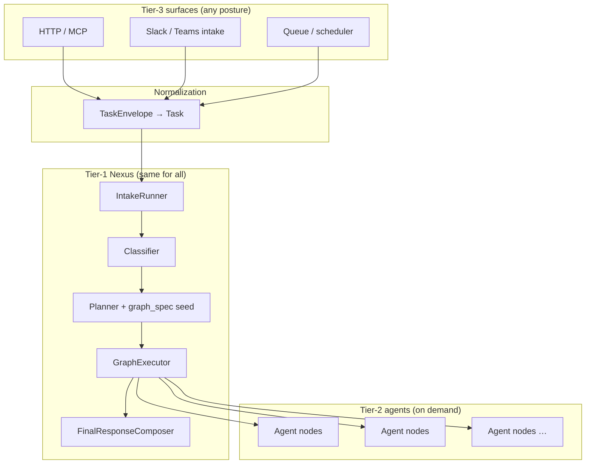
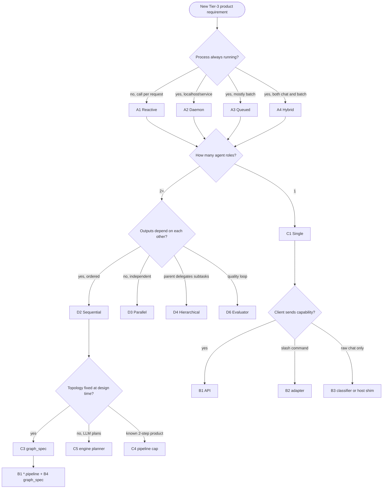
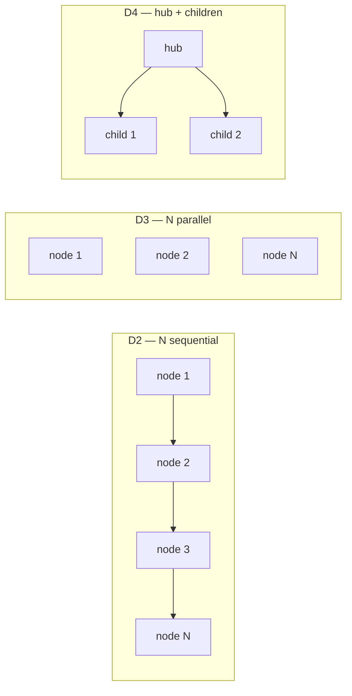

# ORCHESTRATION — production gates (§40+)

**Parent hub:** [`ORCHESTRATION.md`](../ORCHESTRATION.md)

# 47. Checklist For Nexus Changes

Before changing Nexus, answer:

```text
1. Is this change domain-agnostic?
2. Does it belong in runtime rather than an agent?
3. Does it improve orchestration, lifecycle, validation or observability?
4. Does it preserve layer boundaries?
5. Does it make agents easier to implement?
6. Does it avoid hardcoded business logic?
7. Is the behavior traceable?
8. Can it support future agents?
9. Does it emit RuntimeEvents and respect UAEP (§42)?
10. Does it integrate with HookRegistry / middleware pipeline (§42.20)?
```

If the change is domain-specific, it probably belongs in an agent.

---

---

# 48. Task Intake and TaskEnvelope

All entrypoints MUST normalize into a common intake contract before NexusLoop.

## 48.1 TaskEnvelope (minimum)

```text
TaskEnvelope:
    task_id / run_id
    tenant_id
    user_id | service_id
    source_channel          # api | cli | slack | teams | webhook | scheduler
    raw_input
    constraints             # SLA, risk class, budget caps
    correlation_ids         # trace_id parent
```

## 48.2 Intake pipeline

```text
Surface adapter -> contract validation -> TaskEnvelope -> TaskClassifier -> Planner
```

| Module | Role |
|--------|------|
| `applications/_shared/task_intake.py` | Shared intake helpers |
| `fastapi_core` | HTTP auth + request context |
| `runtime/nexus/orchestration` | Classifier, planner, graph |
| `runtime/interactions` | Slack/Teams interaction adapters |

**Audit layer:** INTEGRAX_HARNESS_AUDIT_MAP §3 (Interface and Task Intake).

---

# 49. Scheduler and Queueing

Long-running and asynchronous work uses the Tier-0 queueing plane — not ad-hoc threads in agents.

## 49.1 Components

| Module | Role |
|--------|------|
| `intergrax/queueing` | Task index, registry, worker contracts |
| `intergrax/distributed` | Rate limiting, distributed locks |
| Integration `message_bus` providers | Celery, RabbitMQ, Redis, Kafka |

## 49.2 Orchestration integration

- `OrchestrationProfile.long_running` enables checkpointed schedules.
- Graph batch concurrency caps prevent provider overload.
- Backpressure and semaphore limits are policy-aware (see [`NEXUS_EXECUTION_FLOW.md`](NEXUS_EXECUTION_FLOW.md) §9).

**Elastic capacity (replicas, workers, provisioning):** [`ELASTIC_CAPACITY_AND_SCALING.md`](ELASTIC_CAPACITY_AND_SCALING.md) — ECP consumes `GRAPH_BACKPRESSURE` and queue signals; this section covers in-process scheduling only.

**Plan:** [`plan/ORCHESTRATION.md`](../plan/ORCHESTRATION.md) Phase ORCH.

---

# 50. Orchestration Strategies Catalog

Multi-agent and multi-step execution MUST use an **explicit coordination pattern** (IDEAL §6.4, AUDIT_MAP §10). Intergrax implements patterns through **declarative graphs**, **runtime handoff**, and **CVL evaluator loops** — not ad-hoc agent-to-agent calls.

## 50.1 Pattern catalog

Canonical enum: `CoordinationPattern` in `intergrax/runtime/architecture/multi_agent_coordination.py` (Phase V-MA **Done**).

| Pattern | When to use | Harness mapping | Runtime depth |
|---------|-------------|-----------------|---------------|
| **Hierarchical** | Top-down plan; planner delegates to specialized executors | `graph_spec` + `DELEGATES_TO` ([ADR-FLOW-001](adr/entries/2026-06-07/ADR-FLOW-001.md)) | [`NEXUS_EXECUTION_FLOW.md`](NEXUS_EXECUTION_FLOW.md) §13 |
| **Orchestrator–worker** | Central Nexus plan; workers are graph nodes with capabilities | `TaskPlanner` / `graph_spec` → sequential or batched nodes | §12 UC-4, §42.43 |
| **Supervisor–worker** | Quality/policy supervision over workers; re-plan on failure | HITL + `AgentDecision.INTERRUPT` + policy hooks | UAEP §42.8, FLOW §11 |
| **Peer-to-peer** | Independent subtasks; parallel decomposition | Topological **batches** + `MergePolicy` | §51 below |
| **Swarm** | Many lightweight explorers; aggregate under budget | Parallel batch + cost/step caps (catalog + selection matrix) | **Done** — ORCH-5.1 + CFG-17 sim |
| **Evaluator-loop** | Critique–revise before finalize | `CoordinationPattern.EVALUATOR_LOOP` + `EvaluatorLoopExecutor` | [`CRITIC_VERIFICATION.md`](CRITIC_VERIFICATION.md) |

```text
Pattern selection (helper): select_coordination_pattern(constraints)
    → uses risk / latency / cost / complexity levels
    → authors SHOULD override via declarative graph_spec for production hosts
```

**Narrative flows:** [`NEXUS_EXECUTION_FLOW.md`](NEXUS_EXECUTION_FLOW.md) §12 (UC-1–UC-9), §27. **Reference product flow:** UAEP [§42.43](UNIFIED_EXECUTION_RUNTIME.md#4243-multi-agent-collaboration-flow-reference) (PM → UX → Legal → Validator → Human).

## 50.2 Collaboration vs specialization

| Concept | Mechanism | Owner |
|---------|-----------|-------|
| **Specialization** | Tier-2 agents declare **capabilities**; Nexus routes by capability match | `AgentRegistry`, `TaskClassifier`, `AgentRouter` |
| **Collaboration** | Multiple specialized agents in one **ExecutionGraph** via plan steps / edges | `NexusPlan`, `GraphExecutor` |
| **Isolation** | Delegation namespaces, tool policy on child nodes | `DelegationSpec`, `SubtaskContract` |

Agents MUST NOT call each other directly — all collaboration via **SharedTaskContext**, artifacts, and graph nodes (§53).

## 50.3 Anti-patterns

- Single mega-agent emulating multi-agent topology inside one UAEP loop.
- Hidden parallel branches without `depends_on` / graph_spec edges.
- Swarm without budget envelope (`max_delegation_depth`, cost profile).
- Pattern name in docs but undeclared in host `graph_spec` or plan metadata.

## 50.4 Tool invocation vs agent graph (boundary)

> **Tool patterns canon:** [`TOOLS.md`](TOOLS.md#tool-invocation-patterns-production-orchestration) · **Flow:** [`NEXUS_EXECUTION_FLOW.md`](NEXUS_EXECUTION_FLOW.md) §15.1 · **ADR:** [ADR-TOOL-002](adr/entries/2026-06-11/ADR-TOOL-002.md) (no tool ReAct from `GraphExecutor`).

| Layer | Domain doc | Orchestrates | Examples |
|-------|------------|--------------|----------|
| **Agent graph** | This file §50–§56 | Agents, delegation, merge, parallel **nodes** | `ExecutionGraph`, `GraphExecutor`, `MergePolicy` |
| **Tool invocation pattern** | [`TOOLS.md`](TOOLS.md) | Multi-call **tool** batches within one agent step | `ToolInvocationPattern` **Done** (TOOL-ENG-16) — single-pass, parallel batch, bounded ReAct, deterministic chain |
| **Atomic tool invoke** | [`TOOLS.md`](TOOLS.md) §42.12 | One `tool_id` call | `RuntimeToolInvoker` |

```text
ExecutionGraph node (agent A)
    └── UAEP / pipeline
            └── ToolsStep
                    └── ToolInvocationPattern  ← Plane 3 tool orchestration
                            └── RuntimeToolInvoker (per call)
```

**Rules:**

1. `GraphExecutor` MUST NOT schedule tool-plan iterations — that belongs to `ToolInvocationPattern` inside the node's agent run ([ADR-TOOL-002](adr/entries/2026-06-11/ADR-TOOL-002.md)).
2. Each graph node MAY configure `tool_invocation_pattern` on the host `RuntimeConfig` (TOOL-ENG-21/23).
3. LangGraph-style branching at **agent** granularity = `graph_spec` edges + conditions; at **tool** granularity = invocation pattern + planner loop — do not merge the two models.

---

# 51. Parallelism, Merge, and Backpressure

## 51.1 Sequential vs parallel (summary)

Full rules: §25 above. Runtime implementation: [`NEXUS_EXECUTION_FLOW.md`](NEXUS_EXECUTION_FLOW.md) §9.

| Mode | Prefer when | Harness mechanism |
|------|-------------|-------------------|
| **Sequential** | Output dependency, high risk, strict context control | `depends_on` chain in `NexusPlan` |
| **Parallel** | Independent subtasks, split research, parallel validation | `ExecutionGraph.batches()` + `asyncio.gather` |

## 51.2 Concurrency controls

| Control | Profile field | Effect |
|---------|---------------|--------|
| Parallel within batch | `max_parallel_nodes` | Semaphore on concurrent nodes in one topological batch |
| Global inflight cap | `max_inflight_nodes` | Semaphore across graph; emits `GRAPH_BACKPRESSURE` |
| Tenant cap | `AgentEngine` / host runtime concurrency policy | Cross-task fairness via harness host |
| Delegation depth | `max_delegation_depth` | Limits nested subagent expansion |

```text
GRAPH_BACKPRESSURE  →  ops:backpressure  →  optional input to ECP (infra scale)
                      →  does NOT by itself add replicas (see ELASTIC_CAPACITY)
```

## 51.3 Merge policies

After parallel or sequential multi-node runs, `FinalResponseComposer` applies `OrchestrationProfile.merge_strategy`:

| Strategy | Behavior |
|----------|----------|
| `concat` | Default — concatenate agent summaries |
| `last_wins` | Last successful node summary |
| `structured_json` | JSON payload with per-agent status |

**Future:** citation-preserving merge, LLM synthesis, conflict-aware HITL — IDEAL; not required for harness MVP.

## 51.4 Acceptance coverage

- Sequential multi-agent: `test_acceptance_02_sequential_multi_agent`
- Parallel multi-agent: `test_acceptance_03_parallel_multi_agent`
- Parallel cap: `test_graph_executor_parallel_cap.py`

---

# 52. Resilience in Orchestration

Orchestration resilience spans **three retry layers**, **checkpoints**, **alternate agents**, and **partial completion**. Full matrix: [`NEXUS_EXECUTION_FLOW.md`](NEXUS_EXECUTION_FLOW.md) §14.

## 52.1 Three retry layers (do not conflate)

| Layer | Component | Scope | Default |
|-------|-----------|-------|---------|
| **A — Graph node** | `RetryEngine` | Same node; may switch `agent_id` | `max_retries` per factory profile |
| **B — ACP agent run** | `AgentEngine`, `StepOutcome.retry` | Inside one graph node | Per host `max_run_retries` |
| **C — Whole run** | `RetryCoordinator` | Re-execute full graph | `max_run_retries=0` (opt-in) |

**Failover (agent level):** closest harness primitive is **alternate agent** on node retry (Layer A) — not active-active duplicate nodes.

**Redundancy (infra level):** multiple Nexus host **replicas** — [`ELASTIC_CAPACITY_AND_SCALING.md`](ELASTIC_CAPACITY_AND_SCALING.md); not duplicate graph nodes by default.

## 52.2 Long-running and recovery

§26 requirements implemented via:

| Mechanism | Module / event |
|-----------|----------------|
| Checkpoint store | `SQLiteTaskCheckpointStore`, long-running profile |
| Resume mid-UAEP | acceptance `05b_mid_step_uaep_resume` |
| Skip completed nodes | `GraphExecutor` + checkpoint bridge |
| Cancel | `CancellationCoordinator` → `CANCELLED` |
| Partial success | `PARTIALLY_COMPLETED` when policy allows |

## 52.3 Cross-cutting reliability (Tier-0 / ops)

Not orchestration scheduling — but required for resilient orchestration at scale:

| Mechanism | Domain |
|-----------|--------|
| Side-effect idempotency | W-OPS.1 / `IdempotentToolInvoker` |
| Integration circuit breaker | W-OPS.2 |
| HITL escalation | [`RELIABILITY_FAILURE_AND_HITL.md`](RELIABILITY_FAILURE_AND_HITL.md) |

## 52.4 Validation and evaluator resilience

| Gate | When |
|------|------|
| `NexusValidationEngine` | After each graph node |
| CVL partial / final verify | [`CRITIC_VERIFICATION.md`](CRITIC_VERIFICATION.md) |
| Evaluator-loop | Revise until budget exhausted |

---

# 53. Specialization and Agent Collaboration

## 53.1 Capability-based specialization

```text
Task.capability  →  TaskClassifier  →  CAPABILITY_ROUTED | MULTI_AGENT
                         ↓
              AgentRegistry.find_by_capability()
                         ↓
              PlanStep.agent_id assignment
```

**Multi-agent same capability:** sequential steps for all matching agents (`MULTI_AGENT`); order from `OrchestrationProfile.multi_agent_order` (FLOW-17). This is **not** cross-role pipeline cooperation — see [`REASONING_AND_COGNITION.md`](REASONING_AND_COGNITION.md) §9.4.

Planning depth: [`REASONING_AND_COGNITION.md`](REASONING_AND_COGNITION.md) §9–§10 · posture matrix §55.

## 53.2 Three collaboration mechanisms

| Mechanism | Declared | Runtime effect | Context |
|-----------|----------|----------------|---------|
| `DEPENDS_ON` | `graph_spec` / plan | Separate node; topological order | `ContextManager` |
| `DELEGATES_TO` | `graph_spec` | Child node + `DelegationSpec` on child | Isolated delegation namespace |
| `AgentDecision.HANDOFF` | Runtime | `HandoffCoordinator` inserts node | Handoff payload in shared context |

**Semantic detail:** [`NEXUS_EXECUTION_FLOW.md`](NEXUS_EXECUTION_FLOW.md) §13.

## 53.3 Shared context rules

- Cross-agent data via `SharedTaskContext` / artifacts — **never** direct agent imports.
- Nexus passes **bounded** context per node (`ContextManager`).
- Delegation budgets: optional `budget_envelope` on `SubtaskContract` (FLOW-15).

## 53.4 Authoring

- Declarative: `AgentGraph` builder — `applications/contracts/graph_builder.py`
- Profile: `OrchestrationProfile` on `ApplicationEnvironmentProfile`
- Guide: [`AGENT_CREATION_GUIDE.md` Appendix I](guides/AGENT_CREATION_GUIDE.md)

---

# 54. Maturity and Gap Register

| Area | Score (L0–L4) | Canon section | Notes |
|------|---------------|---------------|-------|
| Nexus loop / intake | L3–L4 | §9–§10, §48 | Done |
| Sequential / parallel execution | L3 | §25, §51 | Runtime in FLOW §9 |
| Coordination pattern catalog | L3 | §50 | Code + FLOW §27; ORCH canon (this update) |
| Declarative graph + delegation | L3–L4 | §50, §53 | ORCH-2, ADR-FLOW-001 |
| Merge policies | L3 | §51.3 | FLOW-7 Done |
| Backpressure | L3 | §51.2 | FLOW-13 Done |
| Retry / alternate agent | L3 | §52.1 | FLOW §14 |
| Checkpoint / long-running | L3 | §26, §52.2 | Runtime Done; scheduler optional per host (§59.2) |
| Sync / async postures | L3 harness / L2 product | §57 | ORCH-6 Done; `run_async` HTTP only on lab (§59.2) |
| Interrupt / cancel / resume API | L3 harness / L2 product | §58, FLOW §28 | FLOW-CTL Done; HTTP routes lab-only (§59.2) |
| Resilience + autonomy slider | L3 harness / L2 product | §58, REL §34–§35 | REL-ADV Done; mid-run API lab-only (§59.2) |
| Swarm pattern runtime | L3 | §50.1, D7 | ORCH-5.1 **Done**; CFG-17 sim |
| Active-active node redundancy | L0 | §52.1 | Not planned — use retry + ECP replicas |
| Infra elastic scale | L3 | cross-ref ECP | ECP-DEPTH **Done** (Band 2ao) |
| Product multi-agent demos | L2 deferred | §42.43 | FLOW-8 harness sim **Done**; product host §6.3 |
| Platform configuration canon (CFG-*) | L4 doc / L3 runtime / L3 Tier-3 | §56 | ORCH-CONFIG **11/11 Done**; reference host presets §59.2 |

**Audit alignment:** AUDIT_MAP §9 (orchestration/graph) · §10 (subagents/multi-agent) — strategy rows consolidated in §50–§53; **configuration completeness §56**; **execution-surface parity §59**.

**Plan backlog:** [Phase ORCH-STRAT](plan/ORCHESTRATION.md) (docs Done) · [Phase ORCH-CONFIG](plan/ORCHESTRATION.md) (§56 gaps) · [Phase ORCH-5](plan/ORCHESTRATION.md) (swarm depth) · [Phase H-APP-WIRING](plan/TIER3_APPLICATION_ENVIRONMENT.md) (Tier-3 surface parity).

---

# 55. Interaction Posture × Orchestration Matrix

Authors configure **how the host receives work** (Tier-3 posture) separately from **how Nexus coordinates agents** (Tier-1 pattern). This section maps both dimensions so products can mix reactive chat, background workers, and multi-agent graphs without runtime forks.

**Canonical posture catalog:** [`TIER3_APPLICATION_ENVIRONMENT.md`](TIER3_APPLICATION_ENVIRONMENT.md) §23.

## 55.1 Two configuration dimensions

| Dimension | Question | Configured on | Examples |
|-----------|----------|---------------|----------|
| **A — Interaction posture** | When does work enter the system? | Host wiring + `ReliabilityProfile` + queue | Reactive HTTP, always-on daemon, cron batch |
| **B — Coordination pattern** | How do agents cooperate on one `Task`? | `graph_spec`, `planner_kind`, `OrchestrationProfile` | Sequential chain, parallel batch, hierarchical delegate |

```text
Dimension A (intake)     →  Task appears
Dimension B (orchestration) →  NexusPlan → ExecutionGraph → agent nodes
```

Both dimensions apply to the **same** `NexusLoop.handle_task()` path.

## 55.2 Pattern selection by agent count and dependency

| Agents | Output dependency | Risk / HITL | Recommended pattern | Harness mapping |
|--------|---------------------|-------------|---------------------|-----------------|
| 1 | N/A | Low | Orchestrator–worker (single node) | `CAPABILITY_ROUTED`, 1 `PlanStep` |
| 1 | N/A | High | Supervisor–worker | HITL hooks + critic before `COMPLETED` |
| 2+ | **Yes** — B needs A's artifacts | Any | **Sequential** orchestrator–worker | `graph_spec` `DEPENDS_ON` chain or `*.pipeline` |
| 2+ | **No** — independent subtasks | Low–medium | **Peer-to-peer** parallel | Same batch in `ExecutionGraph`; set `max_parallel_nodes` |
| 2+ | Mixed | Medium | **Hierarchical** | Hub node + `DELEGATES_TO` children |
| 2+ | Quality-sensitive output | High | **Evaluator-loop** | CVL + optional extra graph node |
| N | Explore under budget | Medium | **Swarm** (partial runtime) | Parallel cap + cost envelope; ORCH-5.1 depth |

**Rule:** sequential **cooperation** (different capabilities, handoff of context) MUST use `depends_on` or pipeline plan — **not** `MULTI_AGENT` classification alone.

## 55.3 OrchestrationProfile field guide (multi-scenario)

| Field | Single reactive agent | Multi-agent sequential | Multi-agent parallel | Background long job |
|-------|----------------------|------------------------|--------------------|---------------------|
| `planner_kind` | `default` or `engine` | `default` + `graph_spec` **or** `engine` | `default` + `graph_spec` | `default`; checkpoint-friendly |
| `classifier_kind` | `default`; `engine` when COG-3 | `default` + explicit `*.pipeline` cap | same | often explicit capability per job type |
| `merge_strategy` | `last_wins` | `concat` or `structured_json` | `structured_json` recommended | `structured_json` for ops |
| `max_parallel_nodes` | `null` (unlimited batch) | `1` if strict ordering in batch | set cap (e.g. `4`) | tune for provider limits |
| `max_inflight_nodes` | optional | optional | **recommended** | **recommended** under load |
| `max_delegation_depth` | `4` default | raise if deep delegate trees | same | same |
| `long_running_enabled` | false | true for large inputs | per task size | **true** |
| `max_run_retries` | `0` | opt-in `1+` for validation retry | opt-in | opt-in for flaky integrations |

## 55.4 Edge semantics quick reference

| Edge / mechanism | Execution order | Data flow | Use when |
|------------------|-------------------|-----------|----------|
| `DEPENDS_ON` | Target after source | `ContextManager.record_node_output` → next node context | B needs A's summary/artifacts |
| `DELEGATES_TO` | Child after parent | `DelegationSpec` + isolated tool policy on child | Subagent with bounded objective |
| No edge between nodes | Same topological batch (parallel) | Merge via `FinalResponseComposer` | Independent shards |
| `AgentDecision.HANDOFF` | Dynamic node inserted | `HandoffCoordinator` | Runtime-discovered next specialist |
| UAEP multiple steps | Inside one graph node | `RuntimeExecutionContext` | Domain micro-loop (not graph replacement) |

## 55.5 Anti-patterns (platform)

| Anti-pattern | Why wrong | Correct approach |
|--------------|-----------|------------------|
| Tier-2 agent calls another agent import | Breaks tier boundaries | Nexus graph node or `HANDOFF` |
| Expect `MULTI_AGENT` for docs→web→synthesis pipeline | Label means same-capability competition | `graph_spec` or `*.pipeline` |
| Background thread in agent for scheduling | Bypasses queue/policy/trace | `queueing` + host worker |
| One host route without `capability` for production chat | Falls through to `SINGLE_AGENT_DEFAULT` | L1 explicit cap or L3 classifier (COG-3) |
| Parallel nodes without merge strategy | User gets opaque multi-block text | Set `merge_strategy`; plan ORCH-5.4 semantic merge |

**Plan:** [`plan/ORCHESTRATION.md`](../plan/ORCHESTRATION.md) ORCH-DOC.3 · full implementation register **Phase ORCH-CONFIG** (from §56.11).

---

# 56. Platform Interaction & Multi-Agent Configuration Canon

**Status:** Canonical architecture (2026-06-09) — **single source of truth** for configurable platform behaviour across postures, routing layers, agent counts, and coordination strategies.  
**Plan (1:1):** [`plan/ORCHESTRATION.md`](../plan/ORCHESTRATION.md) Phase **ORCH-CONFIG** · cross-domain: [`plan/TIER3_APPLICATION_ENVIRONMENT.md`](../plan/TIER3_APPLICATION_ENVIRONMENT.md) H-APP-DOC.* · [`plan/REASONING_AND_COGNITION.md`](../plan/REASONING_AND_COGNITION.md) COG-3.*  
**Runtime narrative:** [`NEXUS_EXECUTION_FLOW.md`](NEXUS_EXECUTION_FLOW.md) §3.1 · **Host posture summary:** [`TIER3_APPLICATION_ENVIRONMENT.md`](TIER3_APPLICATION_ENVIRONMENT.md) §23  
**ADR:** [`ADR-FLOW-004`](../../technical/adr/entries/2026-06-09/ADR-FLOW-004.md) for seed guard (ORCH-CONFIG.2); other gaps scheduled in ORCH-CONFIG.

## 56.1 Why this section lives in ORCHESTRATION (not a new doc)

| Topic | Owner doc | Rationale |
|-------|-----------|-----------|
| **When** work enters (posture, intake) | Tier-3 host + §56 posture dimension | Surfaces normalize to `Task`; orchestration owns the lifecycle after intake |
| **How** agents cooperate (pattern, graph) | **This section (ORCHESTRATION)** | Nexus graph, planner, classifier, merge — Tier-1 orchestration plane |
| **Who** routes (capability, classifier) | §56 + [`REASONING_AND_COGNITION.md`](REASONING_AND_COGNITION.md) §9 | Classification constrains planner; routing modes documented in both |
| **Step-by-step execution** | [`NEXUS_EXECUTION_FLOW.md`](NEXUS_EXECUTION_FLOW.md) | Sequence diagrams, code paths — not duplicated here |

**Do not create a parallel guide.** Product authors read **§56 first**, then Tier-3 §23 for host checklist, then FLOW for debugging.

## 56.2 Platform invariants (never violate)

```text
1. Every unit of work → Task → UnifiedTaskRunner → NexusLoop.handle_task()
2. Agents never call agents — collaboration via ExecutionGraph + SharedTaskContext
3. Tier-3 composes profiles and surfaces; Tier-1 owns global loop; Tier-2 owns UAEP steps
4. intergrax/ MUST NOT import agents/ or applications/
5. Free-text user input does NOT imply capability unless L2/L3/B1 explicitly sets it
6. MULTI_AGENT classification ≠ cross-role pipeline (see §56.4)
7. graph_spec seeding respects ``trigger_capabilities`` / ``*.pipeline`` suffix (ORCH-CONFIG.2 — ADR-FLOW-004)
```



## 56.3 Configuration dimensions (complete catalog)

Authors combine **one value per dimension** (where applicable). Dimensions are orthogonal.

### Dimension A — Interaction posture (when)

| Code | Name | Host process | Task trigger | Required host wiring |
|------|------|--------------|--------------|----------------------|
| `A1` | Reactive on-demand | Up on demand or idle daemon | Per user/API message | `POST …/run` or MCP tool |
| `A2` | Always-on daemon | Continuous | Same as A1 + maintenance jobs | uvicorn/systemd + health |
| `A3` | Scheduled / queued | Worker process | Cron, queue consumer, webhook enqueue | `queueing` consumer + optional notify |
| `A4` | Hybrid | Daemon + workers | Interactive + background `Task`s | A2 + A3 combined |

### Dimension B — Routing layer (who picks capability/agent)

| Code | Name | Owner | Input | Output on `Task` |
|------|------|-------|-------|------------------|
| `B1` | API contract | Tier-3 router / schema | Typed request | `context.capability`, optional `agent_id` |
| `B2` | Interaction adapter | `InteractionIntakeService` | Slash command / vendor JSON | `message` + mapped `capability` |
| `B3` | LLM/rules classifier | Tier-1 (`COG-3.*` + ORCH-CONFIG.1) | Raw `message` | Inferred `capability` via `IntentRoute` (**Done** — `rules` + `llm`) |
| `B4` | Declarative graph | `GraphSpecSeedingPlanner` | `graph_spec` on profile | `NexusPlan` steps from topology |

**Minimum routing by UX:**

| UX | Minimum B | Never rely on alone |
|----|-----------|---------------------|
| Typed REST | `B1` | Default agent |
| Slash command | `B2` | `SINGLE_AGENT_DEFAULT` |
| Free-text chat | `B3` (or host shim = `B1`) | Classifier off + no capability |
| Fixed multi-agent product | `B1` `*.pipeline` + `B4` | `MULTI_AGENT` label |

### Dimension C — Multi-agent composition mode

| Code | Name | Mechanism | Agent roles |
|------|------|-----------|-------------|
| `C1` | Single-agent | 1 `PlanStep` | One specialist |
| `C2` | Same-capability multi | `TaskClassification.MULTI_AGENT` | N agents, **identical** capability tag |
| `C3` | Declarative graph | `ApplicationGraphSpec` | Distinct agents, edges define order |
| `C4` | Registered pipeline | `TaskPlanner` rule for `*.pipeline` | Product-specific sequential steps |
| `C5` | Engine-planned | `planner_kind=engine` | LLM emits steps from registry |
| `C6` | Dynamic handoff | `AgentDecision.HANDOFF` | Runtime inserts graph node |

### Dimension D — Coordination pattern (how nodes cooperate)

| Code | Pattern | Graph shape | `CoordinationPattern` |
|------|---------|-------------|------------------------|
| `D1` | Orchestrator–worker | 1 node | — |
| `D2` | Sequential cooperation | `DEPENDS_ON` chain A→B→…→N | ORCHESTRATOR_WORKER chain |
| `D3` | Peer-to-peer parallel | N nodes, no inter-node `depends_on` | PEER_TO_PEER |
| `D4` | Hierarchical delegate | `DELEGATES_TO` parent→child | HIERARCHICAL |
| `D5` | Supervisor–worker | HITL + policy/critic gates | SUPERVISOR_WORKER |
| `D6` | Evaluator-loop | CVL revise before finalize | EVALUATOR_LOOP |
| `D7` | Swarm | Parallel under budget envelope | SWARM (**partial runtime**) |

### Dimension E — Governance / completion (optional overlay)

| Code | Policy | Profile / task flags |
|------|--------|----------------------|
| `E0` | Structural only | Default — `non_empty_summary` |
| `E1` | Critic L1 on graph | `CriticProfile` node_partial / graph_final |
| `E2` | HITL required | `require_human_approval`, agent `REQUEST_HUMAN` |
| `E3` | Semantic completion required | `require_critic_on_completion=true` (**strict products**) |

## 56.4 Decision tree — pick configuration in 60 seconds



**Hard rules from tree:**

1. Cross-role pipeline → `C3` or `C4` or `C5` — **never** `C2` alone.
2. `C2` only when multiple agents share one capability (load-sharing / ensemble).
3. `B4` with `graph_spec.nodes` seeds only when capability matches ``trigger_capabilities`` or ``*.pipeline`` suffix (ORCH-CONFIG.2).

## 56.5 Master matrix — agent count × coordination pattern

Cells describe **valid** platform configuration. ✅ = harness-proven · ⚠️ = mechanism exists, author wiring required · ❌ = not supported / planned.

| Agents | D1 single | D2 sequential | D3 parallel | D4 hierarchical | D5 supervisor | D6 evaluator | D7 swarm |
|--------|-----------|---------------|-------------|-----------------|---------------|--------------|----------|
| **1** | ✅ `C1+B1` | — (use UAEP steps inside node) | — | — | ⚠️ `E2` HITL | ⚠️ CVL on node | — |
| **2** | — | ✅ `C3` chain or `C4` research.pipeline | ✅ `C3` no edge | ✅ `DELEGATES_TO` | ⚠️ +HITL | ⚠️ CVL loop | ❌ ORCH-5.1 |
| **3** | — | ✅ `C3` chain | ✅ batch of 3 | ✅ hub + 2 children | ⚠️ | ⚠️ | ❌ |
| **N** | — | ✅ `C3` or `C5` | ✅ `C3` + `max_parallel_nodes` | ✅ tree | ⚠️ | ⚠️ | ❌ partial |

**UAEP note:** multi-step work **inside** one agent (gather→analyze→answer) is not multi-agent — it is one graph node with multiple UAEP steps (`D1`).

## 56.6 Master matrix — posture × intake surface

| Posture | HTTP `POST /run` | MCP | Slack/Teams intake | Queue worker | Scheduler resume |
|---------|------------------|-----|-------------------|--------------|------------------|
| `A1` | ✅ primary | ✅ | ⚠️ host must wire | optional | optional |
| `A2` | ✅ | ✅ | ⚠️ recommended | optional | optional |
| `A3` | optional trigger | rare | notify-only common | ✅ required | ✅ |
| `A4` | ✅ interactive | ✅ | ⚠️ | ✅ background | ✅ |

**Platform gap (ORCH-CONFIG.4 / H-APP-WIRING):** scaffold emits optional interaction + scheduler flags (`INCLUDE_INTERACTIONS`, `INCLUDE_SCHEDULER`), but **host adoption is inconsistent** — see §59.2 host matrix. Queue consumer (`QueuedNexusExecutionAdapter`) is **lab scaffold-default** (`INCLUDE_QUEUE_WORKER=true` on `new-application` lab preset); product hosts remain **opt-in**.

## 56.7 Configuration case register (CFG-*)

Each case is a **canonical product configuration**. Implementation plan rows map to `ORCH-CONFIG.*` / `H-APP-DOC.*` / `COG-3.*` in §56.11.

| CFG ID | Name | A | B | C | D | E | Status | Primary modules |
|--------|------|---|---|---|---|---|--------|-----------------|
| **CFG-01** | Single reactive Q&A | A1 | B1 | C1 | D1 | E0 | ✅ Done | `fastapi_router`, `TaskPlanner` |
| **CFG-02** | Daemon single agent | A2 | B1 | C1 | D1 | E0 | ✅ Done | host `main.py`, same Nexus path |
| **CFG-03** | Slack slash → one agent | A1/A2 | B2 | C1 | D1 | E0 | ✅ Done | `interaction_wiring` on all reference hosts |
| **CFG-04** | Free-text chat → auto route | A1/A2 | B3 | C1/C3/C5 | D1/D2 | E0 | ✅ Done | `classifier_kind=rules|llm` + `IntentRoute` (ORCH-CONFIG.1) |
| **CFG-05** | Two-agent pipeline (research) | A1 | B1 | C4 | D2 | E0 | ✅ Done | `research.pipeline` in `TaskPlanner` |
| **CFG-06** | Two-agent sequential graph | A1 | B1+B4 | C3 | D2 | E0 | ✅ Done | `graph_spec` + harness CFG simulation (`test_orchestration_cfg_simulation.py`) |
| **CFG-07** | N-agent sequential graph | A1/A3 | B1+B4 | C3 | D2 | E0/E1 | ✅ Done | `graph_spec_to_plan`, harness CFG-07 test |
| **CFG-08** | N-agent parallel graph | A1 | B1+B4 | C3 | D3 | E0 | ✅ Done | `ExecutionGraph.batches`, harness CFG-08 test |
| **CFG-09** | Hierarchical delegation | A1 | B1+B4 | C3+C6 | D4 | E0 | ✅ Done | ADR-FLOW-001, `DELEGATES_TO` |
| **CFG-10** | Runtime handoff insert | A1 | B1 | C6 | D4 | E0 | ✅ Done | `HandoffCoordinator` |
| **CFG-11** | LLM dynamic plan N agents | A1 | B1/B3 | C5 | D2/D3 | E0 | ✅ Done | `planner_kind=engine` on reference hosts; COG-1.* **Done** |
| **CFG-12** | Same-capability ensemble | A1 | B1 | C2 | D2 | E0 | ✅ Done | `MULTI_AGENT`, `multi_agent_order` |
| **CFG-13** | Background single job | A3 | B1 | C1 | D1 | E0 | ✅ Done | scheduler default on reference hosts; optional `INCLUDE_QUEUE_WORKER` |
| **CFG-14** | Hybrid daemon + index | A4 | B1+B2 | C1 | D1 | E0 | ⚠️ Partial | scaffold scheduler flag; LKW product incomplete |
| **CFG-15** | High-risk + HITL | A1 | B1 | C1/C3 | D5 | E2 | ✅ Done | acceptance 04, `NexusHitlRunner` |
| **CFG-16** | Critic before complete | A1 | B1 | C3 | D6 | E1/E3 | ✅ Done | multi-agent reference hosts use `with_reference_host_platform_defaults(multi_agent_critic=True)` |
| **CFG-17** | Swarm exploration | A1 | B1 | C3/C5 | D7 | E0 | ✅ Done (harness) | `swarm_policy.py` + runtime batch guard; CFG-17 sim |
| **CFG-18** | Pipeline + single-route conflict | A1 | B1+B4 | C3 | D2 | E0 | ✅ Done | `trigger_capabilities` + ADR-FLOW-004 |
| **CFG-19** | Long-running + resume | A3/A1 | B1 | any | any | E0 | ✅ Done | acceptance 05/05b, checkpoint store |
| **CFG-20** | Strict production multi-agent | A1 | B1+B4 | C3 | D2/D3 | E1+E3 | ✅ Done (harness) | `strict_multi_agent_defaults()` + CFG-20 sim gate |

### CFG-06 walkthrough (reference — two agents, sequential)

**Product example:** corporate docs agent → legal web agent.

```text
Profile:
  graph_spec.nodes = [docs_agent, legal_web_agent]
  graph_spec.edges = [DEPENDS_ON docs → legal_web]
  orchestration.merge_strategy = "last_wins" | "structured_json"
  context_profile.enable_rag = true
  context_profile.enable_websearch = true

Request (B1):
  POST /v1/my_app/run
  { "capability": "my_app.pipeline", "message": "...", "metadata": { "case_id": "…" } }

Nexus path:
  Classify → CAPABILITY_ROUTED (orchestration token; not MULTI_AGENT ensemble)
  GraphSpecSeedingPlanner → 2 PlanSteps with depends_on
  GraphExecutor: node docs → ContextManager.record → node legal_web
  FinalResponseComposer → merged answer

Orchestration capabilities (``trigger_capabilities`` / ``*.pipeline`` suffix) are routing tokens —
they need not appear on agent contracts; ``GraphSpecSeedingPlanner`` binds ``agent_id`` from the graph.

Harness proof: ``tests/integration/runtime/test_orchestration_cfg_simulation.py``.
```

## 56.8 OrchestrationProfile + related fields — per case

| CFG family | `planner_kind` | `classifier_kind` | `graph_spec` | `merge_strategy` | `max_parallel_nodes` | `long_running_enabled` | `execution_mode` |
|------------|----------------|-------------------|--------------|------------------|----------------------|------------------------|------------------|
| CFG-01/02 | `default` | `default` | — | `last_wins` | null | false | balanced/strict |
| CFG-05 | `default` | `default` | optional | `concat` | null | false | balanced |
| CFG-06–08 | `default` | `default` | **required** | `structured_json` | cap for D3 | false | strict |
| CFG-11 | `engine` | `default`/`engine` | optional | product choice | cap | false | strict |
| CFG-13/19 | `default` | `default` | optional | `structured_json` | null | **true** + scheduler | balanced |
| CFG-15/16/20 | `default`/`engine` | `default` | recommended | `structured_json` | cap | per job | **strict** |

**Task-level flags (not profile):**

| Need | Set on `Task` | Helper |
|------|---------------|--------|
| Long-running job | `options.long_running.enabled=true` | `apply_long_running_enabled()` |
| Human approval | `options.governance.require_human_approval` | API / policy |
| Resume | `options.long_running.resume_token` | scheduler / HITL resume |

**Profile `long_running_enabled` alone does not mark every Task long-running** — it enables checkpoint infrastructure when combined with `ReliabilityProfile.long_running_scheduler_enabled`.

## 56.9 Nexus phase contract (same for every CFG)

| Phase | Module | Decision owner | CFG-sensitive behaviour |
|-------|--------|----------------|-------------------------|
| Bootstrap | `build_harness_host_runtime` | Tier-3 author | Profile selects planner, graph, critic |
| Intake | `NexusIntakeRunner` | Nexus | Resume/checkpoint; same all CFG |
| Classify | `TaskClassifier` | Nexus | `C2` vs `C1` — **not** pipeline topology |
| Plan | `GraphSpecSeedingPlanner` / `TaskPlanner` / engine | Nexus | `C3`/`C4`/`C5` divergence |
| Graph build | `plan_to_execution_graph` | Nexus | `D2`/`D3`/`D4` topology |
| Execute | `GraphExecutor` | Nexus | Parallel batch vs sequential batches |
| Per-node | `AgentEngine` + UAEP | Tier-2 agent | Tools/skills from profile |
| Validate | `NexusValidationEngine` + CVL | Nexus | `E0`–`E3` |
| Complete | `NexusGraphRunner` + lifecycle | Nexus | `COMPLETED` vs HITL pause |
| Respond | `FinalResponseComposer` | Nexus | `merge_strategy` |

## 56.10 Completion matrix

| CFG | Default terminal state | Upgrade to semantic done |
|-----|------------------------|---------------------------|
| CFG-01–14 | `COMPLETED` if `non_empty_summary` | `E1` critic + `E3` on strict |
| CFG-15 | `WAITING_FOR_HUMAN` → resume → `COMPLETED` | mandatory `E2` |
| CFG-16 | CVL fail → retry or `FAILED` | `E1+E3` |
| CFG-20 | Same as CFG-07/08 with strict gates | production baseline |

## 56.11 Implementation status & plan register (ORCH-CONFIG)

Honest platform readiness derived from §56.7. **This table is the direct input for implementation planning.**

| Plan ID | CFG / gap | Deliverable | Priority | Status | Unblocks |
|---------|-----------|-------------|----------|--------|----------|
| **ORCH-CONFIG.1** | CFG-04 | Rules classifier + `IntentRoute` + orchestration tokens (§56.13) | **Critical** | **Done** | `classifier_kind=rules|llm`; `LlmTaskClassifier`; classification trace |
| **ORCH-CONFIG.2** | CFG-18 | `ApplicationGraphSpec.trigger_capabilities` + seed guard | **Critical** | **Done** | ADR-FLOW-004 · `test_graph_spec_to_plan.py` |
| **ORCH-CONFIG.3** | CFG-05 generalization | `*.pipeline` suffix → graph_spec seed (no `TaskPlanner` fork) | High | **Done** | `pipeline_capability_suffix` default `.pipeline` |
| **ORCH-CONFIG.4** | CFG-03, CFG-14 | Scaffold: optional interaction intake + queue consumer templates | High | **Done** | Product scaffold `INCLUDE_INTERACTIONS` / `INCLUDE_SCHEDULER` |
| **ORCH-CONFIG.5** | CFG-06–08, CFG-17, CFG-20 | Harness CFG simulation + optional Tier-3 product host (FLOW-8) | High | **Done** (harness) | `test_orchestration_cfg_simulation.py` CFG-04/06/07/08/17/18/20 |
| **ORCH-CONFIG.6** | CFG-13, CFG-19 | Document + helper: profile `long_running_enabled` → default task flag policy | Medium | **Done** | `apply_long_running_from_profile` |
| **ORCH-CONFIG.7** | CFG-16, CFG-20 | `strict` profile preset: critic + merge defaults for multi-agent | Medium | **Done** | `strict_multi_agent_defaults()` |
| **ORCH-CONFIG.8** | CFG-17 | Swarm runtime (extends ORCH-5.1) | Medium | **Done** | `GraphExecutor` batch guard · CFG-17 sim |
| **ORCH-CONFIG.9** | All | `scripts/maintenance/check_orchestration_config_docs.py` — CFG IDs referenced in tests | Low | **Done** | CI script |
| **ORCH-CONFIG.10** | CFG-11 | COG-1.* planner unification + production engine defaults doc | High | **Done** | `nexus_plan_bridge.py` · reference host `planner_kind=engine` |

**Cross-plan ownership:**

| ORCH-CONFIG ID | Also tracked in |
|----------------|-----------------|
| ORCH-CONFIG.1 | `plan/REASONING_AND_COGNITION.md` COG-3.* |
| ORCH-CONFIG.2 | `plan/TIER3_APPLICATION_ENVIRONMENT.md` H-APP-DOC.2 |
| ORCH-CONFIG.4 | `plan/TIER3_APPLICATION_ENVIRONMENT.md` H-APP-DOC.4 |
| ORCH-CONFIG.5 | `plan/NEXUS_EXECUTION_FLOW.md` FLOW-8 |
| ORCH-CONFIG.8 | `plan/ORCHESTRATION.md` ORCH-5.1 |

**ADR policy:** ORCH-CONFIG.2 → [`ADR-FLOW-004`](../../technical/adr/entries/2026-06-09/ADR-FLOW-004.md); ORCH-CONFIG.3 → no ADR (suffix convention only).

## 56.12 Extensibility — arbitrary agent count & strategy

Platform supports **any N ≥ 1** agents and **any valid combination** of `D2`/`D3`/`D4`/`D6` through:

```text
ApplicationGraphSpec
  nodes: [A1, A2, … AN]   # N distinct agent_ids on manifest roster
  edges:
    DEPENDS_ON   → acyclic sequential layers (D2)
    (no edge)    → parallel within batch (D3)
    DELEGATES_TO → hierarchical subtrees (D4)
```

**Constraints (platform-enforced):**

| Constraint | Field / module |
|------------|----------------|
| Max delegation depth | `max_delegation_depth` |
| Parallel cap | `max_parallel_nodes` |
| Inflight cap | `max_inflight_nodes` |
| Cycle forbidden | `ExecutionGraphCycleError` |
| Unknown agent in plan | Planner validation / registry |
| Cost / steps | `RunBudget`, UAEP limits, `DelegationSpec` envelope |

**Dynamic N (runtime-discovered count):** use `C5` engine planner or `C6` HANDOFF chains — not unbounded agent loops in Tier-2.



## 56.13 Orchestration capability tokens

Orchestration capabilities are **routing labels** for graph seeding and rules classification — **not** domain capabilities on agent contracts.

| Concept | Example | Registry lookup | Graph binding |
|---------|---------|-----------------|---------------|
| **Orchestration token** | `my_app.pipeline`, `acceptance.harness.pipeline` | **Not required** on agents | `GraphSpecSeedingPlanner` uses `graph_spec.nodes[].agent_id` |
| **Agent capability** | `evidence.analyze`, `echo.basic` | Required for single-agent routing | `AgentRouter` / `TaskPlanner` default path |

**Module:** `intergrax/runtime/nexus/orchestration_capabilities.py`  
**Classifier:** `ClassifyingTaskClassifier` accepts tokens from `trigger_capabilities` and `pipeline_capability_suffix` without `registry.find_by_capability`.  
**Profile:** `OrchestrationProfile.intent_routes` maps free text → orchestration token (`classifier_kind=rules` or `llm` with rules fallback).

```text
Free text → IntentRoute → acceptance.harness.pipeline (token)
         → classify: CAPABILITY_ROUTED (supported without agent registry hit)
         → GraphSpecSeedingPlanner → PlanStep(agent_id=evidence_agent) → PlanStep(agent_id=response_agent)
         → GraphExecutor routes by explicit agent_id on each node
```

**Harness proof:** `tests/integration/runtime/test_orchestration_cfg_simulation.py` (abstract stubs — no Tier-3 product).  
**ADR:** seed guard — [`ADR-FLOW-004`](../adr/entries/2026-06-09/ADR-FLOW-004.md).

## 56.14 Author checklist (before shipping a Tier-3 host)

1. Pick **CFG ID** from §56.7 (or combine explicitly — document in product `ARCHITECTURE.md`).
2. Set **Dimension A** posture — wire surfaces from §56.6.
3. Set **Dimension B** routing — never ship free-text without `B3` (`classifier_kind=rules` + `IntentRoute`) or explicit `B1` capability.
4. For N>1: choose **C3/C4/C5** — not `C2` unless same-capability ensemble.
5. Draw **graph_spec** for fixed topology; set `merge_strategy` for N>1.
6. Apply **E*** governance for production (`strict` + critic for CFG-20 class).
7. Verify against §56.11 — if Planned, do not claim product-ready multi-agent.

---

## Related documents

| Document | Relationship |
|----------|--------------|
| [`NEXUS_EXECUTION_FLOW.md`](NEXUS_EXECUTION_FLOW.md) | Runtime narrative §4–§18, §27 |
| [`REASONING_AND_COGNITION.md`](REASONING_AND_COGNITION.md) | Plan topology (dimension B) |
| [`ELASTIC_CAPACITY_AND_SCALING.md`](ELASTIC_CAPACITY_AND_SCALING.md) | Replica/worker scale (dimension A infra) |
| [`CRITIC_VERIFICATION.md`](CRITIC_VERIFICATION.md) | Evaluator-loop, verify nodes |
| [`UNIFIED_EXECUTION_RUNTIME.md`](UNIFIED_EXECUTION_RUNTIME.md) §42.43 | Reference collaboration flow |
| [`guides/INTEGRAX_HARNESS_AUDIT_MAP.md`](../guides/INTEGRAX_HARNESS_AUDIT_MAP.md) §9–§10 | Audit procedure |

---

# 57. Synchronous and Asynchronous Execution Postures

Orchestration MUST support both **blocking (sync)** and **deferred (async)** execution without forking the Nexus loop. Same graph rules apply; only **dispatch surface** and **client wait semantics** differ.

## 57.1 Posture catalog

| Posture | Client waits? | Task creation | Harness path | Typical scenario |
|---------|---------------|---------------|--------------|------------------|
| **Sync interactive** | Yes — HTTP/MCP blocks until terminal state | `POST …/run` → `UnifiedTaskRunner.run_task()` | Inline asyncio in request handler | Chat, Q&A, short pipelines |
| **Async deferred** | No — returns `task_id` / job handle | Queue enqueue or `message_bus.async_runner` | Worker invokes same `UnifiedTaskRunner` | Long reports, batch jobs |
| **Async long-running** | Poll / webhook / notify | Scheduler + `long_running_enabled` | Checkpoints + `TASK_PROGRESS` events | Hours/days workflows |
| **Hybrid host** | Mixed | Daemon accepts both sync routes and queue consumers | Separate capabilities per job type | S6 in [`NEXUS_EXECUTION_FLOW.md`](NEXUS_EXECUTION_FLOW.md) §3.1 |

```text
Same Nexus path:
  Task → NexusLoop.handle_task → plan → GraphExecutor → UAEP per node
Difference:
  sync  = caller awaits TaskResult in-process
  async = caller receives handle; worker/scheduler completes run
```

## 57.2 Agent contract dispatch mode

Tier-2 agents declare `AgentContract.execution_mode`:

| Value | Meaning |
|-------|---------|
| `SYNC` | Agent expects inline completion within request/worker budget |
| `ASYNC` | Agent may delegate to queue (`message_bus.enqueue`) and return pending handle |

Nexus MUST NOT block the global event loop on agent-internal polling — async agents return structured pending state; completion flows through queue status APIs (`message_bus.get_status`, `get_result`).

**Code:** `intergrax/contracts/agent_contract_meta.py` · `AgentExecutionMode`.

## 57.3 Profile fields

| Field | Sync posture | Async posture |
|-------|--------------|---------------|
| `long_running_enabled` | Usually `false` | `true` for checkpointed jobs |
| `OrchestrationProfile` queue bindings | Optional | Required for worker transport |
| Client API | Blocking `run` | `run_async` + status poll (product surface) |
| Notifications | Inline response | `notify_channel` on completion / escalation |

## 57.4 Orchestration strategy interaction

| Strategy | Sync-friendly | Async-friendly | Notes |
|----------|---------------|----------------|-------|
| Sequential chain (D2) | Yes | Yes | Async preferred for long chains |
| Parallel batch (D3) | Yes (within timeout) | Yes | Cap `max_parallel_nodes` |
| Hierarchical delegate (D4) | Yes | Yes | Depth + budget limits |
| Background batch (S5) | No | **Required** | Queue + scheduler |
| HITL pause/resume (S7) | Yes | Yes | `resume_token` works in both |

**Plan:** [`plan/ORCHESTRATION.md`](../plan/ORCHESTRATION.md) Phase ORCH-6.

## 57.5 Implementation coverage note (sync/async)

§57 catalog is **architecturally complete**. **Exposure:** `mount_harness_task_routes` (`run-async`, cancel, autonomy, resume) is mounted on lab and reference product hosts when `INCLUDE_TASK_CONTROL` is on (default on most shipped hosts) — see §59.2 matrix. **Durable async** uses `QueuedNexusExecutionAdapter` + broker plus `resolve_async_task_index()` for profile-backed SQLite/Redis index — see §59.2.

**Plan:** [Phase ORCH-6](plan/ORCHESTRATION.md) (runtime Done) · [Phase H-APP-WIRING](plan/TIER3_APPLICATION_ENVIRONMENT.md) (product surfaces).

---

# 58. Platform Runtime Capabilities Index

Cross-cutting platform capabilities span multiple domain pairs. Use this index when designing products — implementation detail lives in the cited canon.

| Capability | Primary owner | Supporting domains | Architecture § |
|------------|---------------|-------------------|------------------|
| **Fault tolerance / resilience policies** | Reliability | Orchestration §52, UAEP §42.8, ECP | [`RELIABILITY_FAILURE_AND_HITL.md`](RELIABILITY_FAILURE_AND_HITL.md) §34 |
| **Orchestration strategies** (cooperation, parallel, sequence, scale, redundancy) | Orchestration | FLOW §27, Reasoning §9, ECP | §50–§53 |
| **MVP → product evolution** | Experimentation / DX | Eval §42, AHI, Critic | [`EXPERIMENTATION_AND_DEVELOPER_EXPERIENCE.md`](EXPERIMENTATION_AND_DEVELOPER_EXPERIENCE.md) §44 |
| **Autonomy slider** (manual / ask / autonomous) | Reliability + UAEP policy | HITL §32, §35 | REL §35, UAEP §42.10.2 |
| **Sync / async postures** | Orchestration | Queueing §49, Agent contract | §57 |
| **Interrupt anywhere** | UAEP + FLOW | Reliability, Orchestration cancel | FLOW §28, UAEP §42.8 |
| **Resume from checkpoint** | UAEP + Reliability | Orchestration long-running | UAEP §42.9, REL §33.3 |

**Tier-3 wiring debt:** runtime capabilities above are **harness-proven**; HTTP task-control and async dispatch surfaces are **lab-only** unless [Phase H-APP-WIRING](plan/TIER3_APPLICATION_ENVIRONMENT.md) is executed per host — §59.

---

# 59. Platform Execution Audit — Gaps, Technical Debt, Discrepancies

**Audit date:** 2026-06-09 · **Scope:** all agent launch and interaction postures (FLOW §3.1 S1–S7, ORCH §56 CFG-*, §57 postures, §58 cross-cutting).

**Verdict:** Tier-1 Nexus **supports every documented scenario** through `UnifiedTaskRunner → NexusLoop`. Gaps are **Tier-3 wiring**, **production proof**, and **two runtime depths** (swarm, strict multi-agent E1+E3 gate).

## 59.1 Scenario coverage (architecture vs runtime vs hosts)

| Scenario | FLOW | Runtime (Tier-1) | Harness proof | Tier-3 default hosts |
|----------|------|------------------|---------------|----------------------|
| **S1** Single reactive Q&A | §3.1 | ✅ | acceptance 01 | ✅ all hosts with `/run` |
| **S2** Free-text + classifier | §3.1 | ✅ | CFG-04 sim | ✅ reference hosts `classifier_kind=rules` |
| **S3** Sequential multi-agent | §3.1 | ✅ | acceptance 02, CFG-06/07 | ✅ via `graph_spec`; product config manual |
| **S4** Parallel multi-agent | §3.1 | ✅ | acceptance 03, CFG-08 | ✅; cap `max_parallel_nodes` |
| **S5** Background batch | §3.1 | ✅ | queue J3, scheduler J4 | ✅ scheduler default on reference hosts |
| **S6** Hybrid daemon | §3.1 | ✅ partial | no product E2E | ⚠️ LKW §6.3 incomplete |
| **S7** HITL pause/resume | §3.1 | ✅ | acceptance 04, 05, 05b | ✅ runtime; resume HTTP lab-only |

## 59.2 Tier-3 host wiring matrix (as-built 2026-06-19)

Honest surface parity across shipped `applications/*/host/factory.py`. ✅ = wired when flag/default on · ⚠️ = optional/off · ❌ = not mounted.

| Host | Sync `/run` | `mount_harness_task_routes` (async/cancel/autonomy/resume) | Scheduler | Interactions | MCP | `apply_reliability_task_defaults` |
|------|-------------|--------------------------------------------------------------|-----------|--------------|-----|-----------------------------------|
| `lab_application` | ✅ | ✅ | ✅ default | ✅ default | ⚠️ | ✅ |
| `legal_application` | ✅ | ✅ `INCLUDE_TASK_CONTROL` | ✅ default | ✅ default | ⚠️ | ✅ runner enricher |
| `research_application` | ✅ | ✅ | ✅ default | ✅ default | ⚠️ | ✅ |
| `poc_template_application` | ✅ | ✅ default | ✅ default | ✅ default | ⚠️ | ✅ |
| `intergrax_assistant_application` | ✅ | ✅ `INCLUDE_TASK_CONTROL` | ✅ default | ✅ default | ⚠️ | ✅ runner enricher |
| `local_workspace_application` | ✅ | ✅ `INCLUDE_TASK_CONTROL` | ⚠️ opt-in | ⚠️ opt-in | ⚠️ | ✅ runner enricher |
| `dispute_sim_application` | ✅ | ✅ `INCLUDE_TASK_CONTROL` | ✅ default | ✅ default | ⚠️ | ✅ runner enricher |

**Note:** `mount_harness_task_routes` (async/cancel/autonomy/resume) is opt-in per host via `INCLUDE_TASK_CONTROL` (default **on** on reference product hosts). Lab remains the full debug surface; product hosts may still use sync `/run` when task control is disabled.

**Async queue:** `QueuedNexusExecutionAdapter` + Celery path is integration-tested (`test_unified_execution_entry_j3.py`). **Lab scaffold** (`new-application` lab preset) defaults `INCLUDE_QUEUE_WORKER=true`; **product hosts** keep queue worker **opt-in** (`{ENV_PREFIX}INCLUDE_QUEUE_WORKER`, default off). `run_async` task status is resolved via `resolve_async_task_index()` (`async_task_index_resolver.py`): **SQLite** (or Redis slug) for `ApplicationProfile.PRODUCT`, strict execution mode, or `features.durable_async_index_default`; **in-memory** for lab/dev unless `INTERGRAX_DURABLE_QUEUE=memory` override or integration profile sets `async_task_index_slug`.

## 59.3 CFG register — remaining gaps (honest)

| CFG | Status | Gap / debt | Plan ID |
|-----|--------|------------|---------|
| CFG-14 | ⚠️ Partial | LKW hybrid E2E deferred (product §6.3) | H-APP-WIRING.4 deferral doc |
| CFG-17 | ✅ Done (harness) | Swarm runtime + CFG-17 sim gate | ORCH-5.1 **Done** |
| CFG-20 | ✅ Done (harness) | `strict_multi_agent_defaults()` + CFG-20 sim gate | ORCH-CONFIG.5 **Done** |

CFG-01–13, 15–16, 18–19: **runtime Done** at harness + reference-host level (2026-06-09 closeout).

## 59.4 Cross-cutting capabilities — implementation vs exposure

| Capability | Runtime module | HTTP / operator surface | Debt |
|------------|----------------|-------------------------|------|
| `ResiliencePolicy` | `policy_resolver`, `retry_engine` | Profile-only on most hosts | Lab enricher only |
| `AutonomyLevel` | `autonomy_middleware` | `POST …/tasks/{id}/autonomy` | Lab + `INCLUDE_TASK_CONTROL` hosts |
| Cooperative cancel | `ActiveTaskRegistry`, UAEP | `POST …/tasks/{id}/cancel` | Lab + `INCLUDE_TASK_CONTROL` hosts |
| Checkpoint resume | `resume_planner`, scheduler | `POST …/tasks/{id}/resume` | Lab + task-control hosts; scheduler opt-in |
| `run_async` | `async_task_dispatch`, `async_task_index_resolver` | `POST …/tasks/run-async` | Lab + task-control hosts; durable index per profile (SQLite/Redis) or in-memory lab fallback |
| MVP promotion / replay | `mvp_evolution` CLI | CLI | No Tier-3 router |

## 59.5 Documentation ↔ code discrepancies (resolved here)

| Topic | Doc said | Code truth | Resolution |
|-------|----------|------------|------------|
| ORCH-CONFIG.4 | "scaffold should emit intake" | Scaffold **Done**; hosts uneven | §59.2 matrix; H-APP-WIRING |
| ORCH-6 | "async first-class" | Runtime Done; HTTP lab-only | §57.5 + §59.2 |
| FLOW-CTL | "unified cancel API" | Routes on lab host | §28.5 + §59.2 |
| FLOW §12.1 Production-ready | "Partial" without cause | Missing strict profile + host wiring | §12.1 footnotes in FLOW |
| §56.7 CFG-13/14 | ⚠️ | Mechanism exists; wiring debt | Unchanged status; §59.3 |
| ORCH-DRIFT-01 | §59.2 "not scaffold-default" / lab-only in-memory | ORCH-MAINT-01/04 **Done** | §59.2 + §59.4 synced (2026-06-19) |

## 59.6 Recommended paydown order (harness queue)

**Closed (2026-06-09):** H-APP-WIRING · ORCH-5.* · ORCH-CONFIG.* (harness) · COG-DEPTH · reference host CFG presets.

**Remaining harness-default queue:** §6.1 gate maintenance only.

**Product-gated (§6.3):** FLOW-8 product host · CFG-14 LKW hybrid daemon · GOV-PROD.1 dashboard · new `applications/<product>`.

**Not default queue:** Band 3 business agents (K.1/K.2) — [`plan/PLATFORM_FOUNDATION.md`](plan/PLATFORM_FOUNDATION.md) §6.3.

---

*End of Orchestration architecture canon (execution strategies §50–§59). Platform configuration canon: §56.*

---
