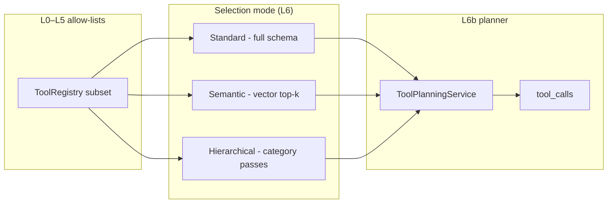
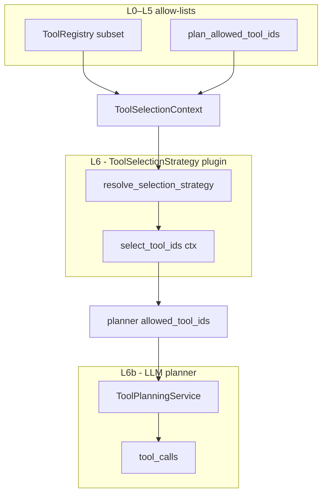

# TOOLS - selection and plugins

**Parent hub:** [`TOOLS.md`](../TOOLS.md)

## Tool selection - strategies and layers

Two orthogonal concepts - do not conflate them:

| Concept | Question | Mechanism |
|---------|----------|-----------|
| **Selection layers (L0–L7)** | Which tools *may* this run use? | Policy, profile, skills, modality, plan filter, invoker scope - [§Selection detail](.#selection-detail-layers) |
| **Selection modes (production strategies)** | How is the planner schema *narrowed* before the LLM chooses? | `ToolSelectionStrategy` + `ToolSelectionMode` - [§Production strategies](.#tool-selection-modes-production-strategies) |

Layers run **before and around** modes: e.g. `ToolProfile` may leave 80 tools in the registry; `tool_selection_mode=retrieval_top_k` may pass only 20 to the LLM.

---

## Tool selection modes (production strategies)

Production agent systems typically use one of three strategies to cope with large tool catalogs. Intergrax canon names them **standard**, **semantic**, and **hierarchical**. All three converge on the same invoke path after the LLM returns `tool_calls`.



### Mode comparison

| Mode | When to use | Pre-LLM mechanism | Typical catalog size | Failure modes |
|------|-------------|-------------------|----------------------|---------------|
| **Standard** | Small, stable allow-list; low token budget pressure | Export full narrowed registry → `generate_with_tools` | ~10–30 tools (degrades above ~50: confusion, latency, cost) | Wrong tool among many; context overflow |
| **Semantic** | Large diverse catalog; intent-driven queries | Embed `ToolContract` text → vector index → query top-k → LLM on subset | 50–500+ tools | Stale index; embedding drift; missed synonyms |
| **Hierarchical** | Natural clusters (bundle / category); interpretable routing | Multi-pass: LLM picks category → sub-schema → final tool pick | 100+ tools in deep catalogs | Extra LLM round-trips; weak taxonomy |

### Standard mode

**Definition:** Every tool in the L0–L5 allow-list is exported to the LLM (OpenAI function schema or JSON fallback). The model **alone** decides which `tool_calls` to emit.

**Implementation today:**

```text
ToolsStep → resolve_planner_allowed_tool_ids(FULL_CATALOG | STATIC with no plan ids)
         → ToolPlanningService.plan_tools(allowed_tool_ids=None | plan subset)
         → to_openai_tools(registry) → generate_with_tools
```

| `ToolSelectionMode` | Maps to standard? | Notes |
|---------------------|-------------------|-------|
| `full_catalog` | **Yes** - explicit standard | No L6 filter; full runtime registry |
| `static` | **Yes** when no `plan_allowed_tool_ids` | Returns `None` → full registry at planner |

**Mitigations without changing mode:** `ToolProfile.enabled_bundles`, `description_short` in exporters, host-level catalog subset.

### Semantic mode

**Definition:** Build a **vector index** of tool metadata (`tool_id`, `description`, `description_short`, `tags`, `category`). On each planner request, embed the user query (or planner input text), retrieve top-k similar tools, export **only that subset** to the LLM.

**Implementation today:** **Done** (TOOL-ENG-13 · ADR-TOOL-004). `ToolSelectionMode.SEMANTIC` → `SemanticToolIndexSelectionStrategy` + in-memory `ToolCatalogEmbedder` index. `RETRIEVAL_TOP_K` / `KEYWORD_TOP_K` remain keyword overlap only.

```text
bootstrap / registry change → ToolCatalogEmbedder → in-memory index
ToolsStep query → embed → cosine top-k → tool_ids → ToolPlanningService
```

Reuse Tier-0 `embedding_manager` - distinct from `rag.retrieve` document index.

**Observability:** `ToolSelectionDiagV1` (`ops:tool_selection`) with semantic scores when available (TOOL-ENG-32).

### Hierarchical mode

**Definition:** Tools are organized in a **tree** (bundle → `category` → `tool_id`). The LLM traverses the tree in bounded passes: e.g. (1) pick `category=issue_tracker`, (2) receive schema for `jira.*` + `issues.*` only, (3) emit final `tool_call`.

**Implementation today:** **Done** (TOOL-ENG-14 · ADR-TOOL-005). `ToolSelectionMode.HIERARCHICAL` → deterministic category rank → tool rank within branches (`hierarchical_tool_selector.py`). **Optional LLM category pass (TOOL-MAINT-01b):** set `RuntimeConfig.tool_selection_hierarchical_llm_pass=True` - async resolver calls `rank_categories_with_llm` on Nexus hot path; default remains deterministic.

**Audit revalidation (2026-06-19, TOOL-MAINT-DOC-01):** §6.1av TOOL-MAINT-01..04 confirmed · TOOL-MAINT-01b wired · catalog **200** tools · provider unit tests green · tool CI gates green.

**Config:** `RuntimeConfig.tool_selection_max_hierarchy_passes` bounds category branches.

### `ToolSelectionMode` → production mode mapping

| `ToolSelectionMode` | Production mode | Implementation | Status |
|---------------------|-----------------|----------------|--------|
| `full_catalog` | **Standard** | `FullCatalogSelectionStrategy` | **Done** (TOOL-ENG-5) |
| `static` | **Standard** (+ plan constraint) | `StaticAllowListSelectionStrategy` | **Done** (TOOL-ENG-4/5) |
| `skill_pack` | *Auxiliary narrowing* (not a production mode) | `SkillPackSelectionStrategy` - skill → `tool_ids` | **Done** (TOOL-ENG-5) |
| `retrieval_top_k` / `keyword_top_k` | *Keyword pre-filter* | `RetrievalTopKSelectionStrategy` - token overlap | **Done** (TOOL-ENG-5/15) |
| `semantic` | **Semantic** | `SemanticToolIndexSelectionStrategy` | **Done** TOOL-ENG-13 |
| `hierarchical` | **Hierarchical** | `HierarchicalToolSelectionStrategy` | **Done** TOOL-ENG-14 (v1 deterministic) |

**Config:** `RuntimeConfig.tool_selection_mode`, `tool_selection_top_k`; bridged from `ApplicationEnvironmentProfile` via `catalog_runtime_bridge.py`.

**Adaptive mode pick:** TOOL-ENG-10 (AHI) may select standard vs semantic vs hierarchical per run - depends on TOOL-ENG-13/14.

### Selection layer checklist (L0–L5, orthogonal to mode)

1. **Profile narrowing** - `ToolProfile.enabled` / `enabled_bundles` at bootstrap.
2. **Integration auto-enable** - `extend_tool_profile_for_integration()` when `IntegrationProfile` slots are set.
3. **Agent `allowed_tools`** - `ToolAccessPolicy` on capability plan; invoker scope via `tool_scope_policy` (TOOL-ENG-3 **Done**).
4. **Skill packs** - `SkillResolver` at bind; optional `skill_pack` selection mode.
5. **RAG/web shims** - `rag.retrieve` / `websearch.query` when enabled.
6. **Plan constraints** - `EnginePlan.tool_ids` intersected with strategy (TOOL-ENG-4 **Done**).
7. **Reasoning prompts** - `tool_planner_prompt_id` via catalog bridge (TOOL-ENG-0 **Done**).

### Scale roadmap (200-tool catalog)

| Capability | Status | Plan ID |
|------------|--------|---------|
| Keyword / skill pre-filter before LLM | **Done** | TOOL-ENG-5 |
| Plan-constrained planner allow-list | **Done** | TOOL-ENG-4 |
| Compact descriptions (`description_short`) | **Done** | Phase O |
| Semantic tool vector index | **Done** | TOOL-ENG-13 |
| Hierarchical category traversal | **Done** | TOOL-ENG-14 · optional LLM pass TOOL-MAINT-01b |
| `retrieval_top_k` naming clarity (`keyword_top_k` alias) | **Done** | TOOL-ENG-15 |
| Selection strategy plugin registry | **Done** | TOOL-ENG-26 |
| Direct strategy instance on `RuntimeConfig` | **Done** | TOOL-ENG-31 |
| Risk-based routing (`ToolRiskLevel` → HITL) | **Done** | TOOL-ENG-7 - trace + enforce block |
| AHI dynamic mode / subset | **Done** | TOOL-ENG-10 - `ToolEngineHook` + `recommend_tool_modes` |

---

## Tool selection plugin model (L6 extensibility)

**Audit basis:** Tool-selection plugin audit 2026-06-12.  
**Plan register:** TOOL-ENG-13,14,15,26,31 · **ADR:** ADR-TOOL-004 *(required before TOOL-ENG-26 merge)*.

Layer **L6** narrows which `tool_id` values reach the LLM planner **before** `ToolPlanningService` exports OpenAI function schemas. This is distinct from **L6b** (LLM picks `tool_calls`) and **2a** ([invocation patterns](.#tool-invocation-patterns-production-orchestration)).

### Design intent

| Principle | Meaning |
|-----------|---------|
| **Protocol-first** | Every selection algorithm implements `ToolSelectionStrategy` - one method, typed context |
| **Shipped defaults** | Standard, semantic, hierarchical ship as named strategy classes - not runtime branches in `run_bounded_tool_loop` / `ctx.invoke_tool` |
| **Host override** | Tier-3 MAY inject a custom strategy instance or register via entry point |
| **Compose with policy** | Strategy output is always intersected with L0–L5 allow-lists and plan `tool_ids` (TOOL-ENG-4) |
| **Observable** | Trace `tool_selection_mode`, `strategy_id`, candidate ids, scores |

### Integration point (runtime flow)



**Call site:** `ToolsStep.run` → `resolve_selection_strategy(config)` → `strategy.select_tool_ids(ctx)` → intersect with plan ids (TOOL-ENG-26/31).

### Base contract

```text
ToolSelectionContext (dataclass):
    registry: ToolRegistry          # L0 runtime catalog
    query: str                      # user / planner input text for retrieval modes
    skill_profile: SkillProfile | None
    plan_allowed_tool_ids: Sequence[str] | None   # EnginePlan / step constraint
    top_k: int                      # semantic / keyword cap

ToolSelectionStrategy (Protocol):
    strategy_id: str                # trace + config (TOOL-ENG-31)
    def select_tool_ids(self, ctx: ToolSelectionContext) -> Sequence[str] | None:
        # None → no L6 narrowing (full registry at planner)
        # ()   → empty schema (planner sees zero tools)
        # tuple → explicit allow-list for L6b
```

**Intersection rule** (`resolve_planner_allowed_tool_ids`): when both strategy and plan provide ids → **set intersection**; empty intersection → planner gets zero tools.

### Shipped production strategies

| Production mode | `ToolSelectionMode` | Strategy class | Status |
|-----------------|---------------------|----------------|--------|
| **Standard** | `full_catalog` | `FullCatalogSelectionStrategy` | **Done** |
| **Standard** (+ plan) | `static` | `StaticAllowListSelectionStrategy` | **Done** |
| **Semantic** | `semantic` | `SemanticToolIndexSelectionStrategy` | **Done** TOOL-ENG-13 |
| **Hierarchical** | `hierarchical` | `HierarchicalToolSelectionStrategy` | **Done** TOOL-ENG-14 |
| *Auxiliary* | `skill_pack` | `SkillPackSelectionStrategy` | **Done** |
| *Keyword pre-filter* | `retrieval_top_k` | `RetrievalTopKSelectionStrategy` | **Done** (not semantic) |

#### Standard - `FullCatalogSelectionStrategy` / `StaticAllowListSelectionStrategy`

Export the L0–L5 allow-list (or plan subset) directly to LLM. Model performs final tool choice.

```text
select_tool_ids → None | plan_ids
ToolPlanningService → generate_with_tools(allowed_tool_ids=…)
```

#### Semantic - `SemanticToolIndexSelectionStrategy` **Done** (TOOL-ENG-13)

Vector index of tool metadata - **not** document RAG.

```text
# Index lifecycle (TOOL-ENG-13)
catalog bootstrap / ToolPlugin register / unregister
    → ToolCatalogEmbedder.embed(contracts)
    → vector collection __harness_tool_catalog__

# Per request
query text → embed → similarity_search(top_k) → tool_ids
    → ToolPlanningService on subset only
```

| Component | Reuse from Tier-0 |
|-----------|-------------------|
| Embeddings | `embedding_manager` from `ToolWiringContext` |
| Vector store | dedicated collection - **not** `rag.retrieve` index |
| Reindex hook | `register_tool_plugin()` / profile rebuild |

**Trace payload:** `strategy_id=semantic`, `candidates=[{tool_id, score}]`, `ops:tool_selection` (TOOL-ENG-32).

#### Hierarchical - `HierarchicalToolSelectionStrategy` **Done** (TOOL-ENG-14)

Multi-pass **LLM-assisted** traversal of a category tree - not the same as `skill_pack` (declarative, no LLM category pass).

```text
Pass 1: LLM picks category / bundle from taxonomy schema (no individual tools)
Pass 2..N: narrowed sub-schema per branch (bounded by tool_selection_max_hierarchy_passes)
Final pass: ToolPlanningService on leaf tool_ids only
```

| Input | Source |
|-------|--------|
| Tree nodes | `ToolContract.category`, bundle membership, optional host `ToolCategoryTaxonomy` |
| Pass budget | `RuntimeConfig.tool_selection_max_hierarchy_passes` |

### Custom strategy - three extension surfaces

Authors MUST implement `ToolSelectionStrategy` and plug in via one of:

| Surface | When | Status | Plan ID |
|---------|------|--------|---------|
| **A - Config instance** | Host/agent wires a Python class at bootstrap (tests, bespoke hosts) | **Done** | TOOL-ENG-31 - `RuntimeConfig.tool_selection_strategy` overrides mode enum |
| **B - Entry point** | Distributable plugin package | **Done** | TOOL-ENG-26 - `intergrax.tool_selection_strategies` + `tool_selection_strategy_id` |
| **C - Custom planner** | Full control of selection + planning in one component | **Done** | inject `ToolPlannerProtocol` via `RuntimeConfig.tool_planner` - bypasses L6 narrow step |

**Rule:** Surfaces A/B affect **only L6** - execution still flows through `ToolPlanningService` (or custom planner on C) and `RuntimeToolInvoker`. Custom selection MUST NOT call handlers or integrations directly.

**Example custom strategy (sketch):**

```python
class DomainWeightedSelectionStrategy:
    strategy_id = "acme.domain_weighted"

    def select_tool_ids(self, ctx: ToolSelectionContext) -> Sequence[str] | None:
        # custom ranking over ctx.registry + ctx.query
        ...
```

### Plugin maturity (selection vs catalog vs invocation)

| Surface | Protocol | Shipped modes | Entry points | Config inject | Custom without fork |
|---------|----------|---------------|--------------|---------------|---------------------|
| Catalog (`ToolPlugin`) | **Yes** | 190 tools | **Yes** | N/A | **Yes** |
| **Selection (`ToolSelectionStrategy`)** | **Yes** | all shipped modes | **Yes** | **Yes** | **Yes** |
| Invocation (`ToolInvocationPattern`) | **Yes** | all shipped modes | **Yes** | **Yes** | **Yes** |

### Selection plugin gap register - closed (2026-06-12)

| ID | Deliverable | Status |
|----|-------------|--------|
| TOOL-ENG-13 | `SemanticToolIndexSelectionStrategy` + `ToolCatalogEmbedder` + reindex | **Done** |
| TOOL-ENG-14 | `HierarchicalToolSelectionStrategy` + taxonomy + multi-pass | **Done** v1 |
| TOOL-ENG-15 | `semantic` / `hierarchical` enum values + `keyword_top_k` alias | **Done** |
| TOOL-ENG-26 | Entry-point registry `intergrax.tool_selection_strategies` | **Done** |
| TOOL-ENG-31 | `RuntimeConfig.tool_selection_strategy` instance override | **Done** |
| TOOL-ENG-DOC.7 | Selection plugin model canon (this section) | **Done** |
| TOOL-ENG-32 | Selection trace: `strategy_id`, candidates, scores in `ToolsSummaryDiagV1` | P2 |

**ADR:** ADR-TOOL-004 - selection plugin registry, semantic index boundary vs `rag.retrieve`, hierarchical pass semantics.

### Introspection tools (builder DX)

| tool_id | Role |
|---------|------|
| `catalog.list_tools` | List registry with optional category/tag filter |
| `catalog.describe_tool` | Contract + JSON schemas |
| `skill.resolve` | Resolve skill pack → tools |

---

## §42.12 gateway surface (`ToolRequest`)

Contracts: `intergrax/contracts/tool_request.py` - `ToolRequest`, `ToolResponse`, `ToolResponseStatus`.

### `BoundToolGateway` routing (`uaep_tool_gateway.py`)

```text
ToolRequest.tool_name
    ├── sandbox.exec          → sandbox_session.execute (metadata)
    ├── runtime-bound ids     → invoke_runtime_bound_tool (see table below)
    └── else                  → RuntimeToolGateway.for_state(...)
```

### `RuntimeToolGateway` - known capability tools

| `tool_name` | Maps to |
|-------------|---------|
| `nexus.capability_plan`, `capability_plan` | `ToolInvocationPlan` from payload `tool_ids` / legacy flags |
| `nexus.rag`, `rag`, `rag.retrieve` | `use_rag` → `rag.retrieve` (catalog) |
| `nexus.websearch`, `websearch`, `websearch.query` | `use_websearch` → `websearch.query` (catalog) |
| `nexus.tools`, `tools` | `use_tools` → `run_bounded_tool_loop` / `ctx.invoke_tool` |
| **Any other catalog `tool_id`** | `catalog_dispatch` → `RuntimeToolInvoker` (TOOL-ENG-2 **Done**) |

### Runtime-bound catalog (`RUNTIME_BOUND_TOOL_IDS`) - **18 tools**

Dispatched via `invoke_runtime_bound_tool` (no `RuntimeToolInvoker`, no pipeline):

| Bundle | `tool_id` |
|--------|-----------|
| workspace (6) | `workspace.write_file`, `read_file`, `list_files`, `snapshot`, `delete_file`, `search` |
| memory (3) | `memory.read`, `memory.write`, `memory.list_keys` |
| harness (6) | `harness.get_run`, `list_runs`, `get_run_cost`, `get_run_events`, `compare_runs`, `export_run_bundle` |
| cost (3) | `cost.get_run_budget`, `cost.check_quota`, `cost.forecast_spend` |

**Not runtime-bound** (require invoker / ToolsStep / TOOL-ENG-2): `workspace.export_artifact`, `workspace.import_artifact`, all `hitl.*`, `code.exec`, `script.run`, `jira.*`, `database.*`, etc.

### Sandbox dual path

| `tool_name` | Path | Notes |
|-------------|------|-------|
| `sandbox.exec` (`SANDBOX_TOOL_NAME`) | `BoundToolGateway._invoke_sandbox` | `exec_ctx.metadata["sandbox_session"]`; not `RuntimeToolInvoker` |
| `code.exec`, `script.run`, `browser.run` | Catalog handlers → `SandboxSession` via registry invoker | `SANDBOX_REQUIRED_TOOLS` policy set |

All other **172+** catalog tools require **ToolsStep** (with wired planner), **catalog gateway** path, or direct invoker.

---

## `tool_ids` dispatch semantics (actual)

**Canonical target (Phase O.5):** explicit `tool_ids` → per-id `RuntimeToolInvoker` invoke.

**Actual behavior (2026-06-10):**

| `tool_id` in plan | `ToolInvocationPlan.normalized()` | Executed by |
|-------------------|-----------------------------------|-------------|
| `rag.retrieve` | sets `use_rag=True` | `rag.retrieve` (catalog) → `catalog_context` |
| `websearch.query` | sets `use_websearch=True` | `websearch.query` (catalog) → `catalog_context` |
| Any other id (e.g. `jira.search_tasks`) | stored in `tool_ids` | **`catalog_dispatch`** → `RuntimeToolInvoker` (TOOL-ENG-1) |
| `use_tools=True` | runs `run_bounded_tool_loop` / `ctx.invoke_tool` | LLM planner schema ⊆ plan `tool_ids` when non-empty (**TOOL-ENG-4**) |

```text
EnginePlan.tool_ids=["jira.search_tasks"]     # catalog dispatch (optional tool_inputs)
EnginePlan.tool_ids=["rag.retrieve"]          # use_rag → RagStep
ToolInvocationPlan(use_tools=True)            # ToolsStep → fresh LLM plan
```

**TOOL-ENG-6 Done:** `run_bounded_tool_loop` - multi-iteration native tool messages when `max_tool_iterations > 1`.

---

## Verification and governance

### Pre-invoke

| Control | Module | Coverage |
|---------|--------|----------|
| Plan allow-list | `ToolAccessPolicy` | `ToolInvocationPlan` only |
| Modality filter | `ToolAccessPolicy.apply_modality_profile` | `tool_ids` in plan |
| Invoker scope | `ToolScopePolicy` | Per `tool_id` (TOOL-ENG-3 **Done**) |
| Guardrails | `LlmGuardrailMiddleware` `BEFORE_TOOL_CALL` | `ApplicationSecurityProfile.scan_tool_calls` |
| Hooks | `run_tool_call_hooks` | Gateway path |
| Budget | `BudgetEnforcer` | `max_tool_calls`, wall time, tokens |

### Post-invoke

| Control | Module | Coverage |
|---------|--------|----------|
| Output schema | `RuntimeToolInvoker._validate_output` | All invoker paths |
| Trace + preview | `ToolInvocationEndDiagV1` | 300-char output preview |
| Middleware after | `AFTER_TOOL_CALL` | Gateway |
| HIGH+ verify gate | `run_post_tool_verify` | **Done** - trace + optional enforce block (**TOOL-ENG-7**) |
| Semantic verify (L1 critic) | `eval.judge`, `eval.trajectory` | Adjacent CVL path - optional via `CriticProfile` |

### Per-tool L1 critic trace contract (TOOL-MAINT-02)

High-risk tool verification emits **`ToolVerifyRequiredDiagV1`** on trace step
``tool_verify_required`` (`intergrax/runtime/nexus/tools/tool_verify_hooks.py`).
Payload fields: ``tool_id``, ``risk_level``. This is the **L0/L1 boundary signal**
before optional CVL semantic judges run on tool output.

Cross-ref: [`CRITIC_VERIFICATION.md`](CRITIC_VERIFICATION.md) ·
``CriticProfile.semantic_judge_enabled`` · ``eval.judge`` / ``eval.trajectory``.
Gate scripts: ``check_tool_injection_defense.py`` · CVL gates in
``check_reasoning_gates.py`` when critic hooks are enabled on the host.

| Agent validate | `agent.validate` | UAEP final answer - not per-tool |

### `tools_mode=required`

Raises `ToolsRequiredError` when no tool traces (**TOOL-ENG-8** **Done**).

---

## Engine gap register (canon)

Tracked in [`plan/TOOLS.md`](../plan/TOOLS.md) Phase **TOOL-ENG**. Summary (updated 2026-06-12 - invocation-pattern audit):

### Selection & planning (L6–L6b)

| ID | Gap | Priority |
|----|-----|----------|
| TOOL-ENG-0 | Wire `CatalogToolPlanner` in `RuntimeContext.build` / catalog bridge | **Done** |
| TOOL-ENG-4 | Pass `EnginePlan.tool_ids` / plan constraints into `run_bounded_tool_loop` / `ctx.invoke_tool` planner | **Done** |
| TOOL-ENG-5 | `ToolSelectionStrategy` / keyword + skill pre-filter before `generate_with_tools` | **Done** |
| TOOL-ENG-11 | Implement `tools_context_scope` in `run_bounded_tool_loop` / `ctx.invoke_tool` / planner message assembly | **Done** |
| TOOL-ENG-13 | Semantic tool index (`ToolCatalogEmbedder`, vector top-k) | **Done** |
| TOOL-ENG-14 | Hierarchical tool selection (category-tree multi-pass) | **Done** v1 |
| TOOL-ENG-15 | Clarify `retrieval_top_k` as keyword overlap; optional `keyword_top_k` alias | **Done** |
| TOOL-ENG-26 | `ToolSelectionStrategy` entry-point plugin registry | **Done** |
| TOOL-ENG-31 | `RuntimeConfig.tool_selection_strategy` instance override | **Done** |
| TOOL-ENG-32 | Selection trace: `strategy_id`, candidates, scores | **Done** |
| TOOL-ENG-DOC.7 | Selection plugin model canon | **Done** |

### Dispatch & gateway (2b)

| ID | Gap | Priority |
|----|-----|----------|
| TOOL-ENG-1 | Direct `tool_ids` catalog dispatch in `ToolRuntime.invoke` | **Done** |
| TOOL-ENG-2 | Full-catalog `ToolRequest` → `RuntimeToolInvoker` in gateway | **Done** |
| TOOL-ENG-3 | Wire `config.tool_scope_policy` → `RuntimeToolInvoker` | **Done** |

### Invocation orchestration (2a) - 2026-06-12 audit

| ID | Gap | Priority |
|----|-----|----------|
| TOOL-ENG-DOC.5 | Canon: four invocation patterns + `ToolInvocationPattern` target contract | **Done** |
| TOOL-ENG-16 | `ToolInvocationPattern` Protocol + `ToolInvocationResult` models | **Done** |
| TOOL-ENG-17 | `SinglePassPattern` - extract current single-iteration path | **Done** |
| TOOL-ENG-18 | `BoundedReactPattern` - refactor `run_bounded_tool_loop` | **Done** |
| TOOL-ENG-9 | `ParallelBatchPattern` - concurrent read-only batch invoke | **Done** |
| TOOL-ENG-20 | `DeterministicChainPattern` + `ToolChainSpec` field mapping | **Done** |
| TOOL-ENG-25 | `ParallelSemanticBatchPattern` - semantic top-k + parallel + aggregate | **Done** |
| TOOL-ENG-21 | `RuntimeConfig.tool_invocation_pattern` + `pattern_for_mode()` factory | **Done** |
| TOOL-ENG-22 | `run_bounded_tool_loop` / `ctx.invoke_tool` delegates to injected pattern (remove hardcoded loop) | **Done** |
| TOOL-ENG-23 | `ApplicationEnvironmentProfile` + `catalog_runtime_bridge` wiring | **Done** |
| TOOL-ENG-24 | Entry-point registry `intergrax.tool_invocation_patterns` | **Done** |
| TOOL-ENG-29 | `ToolInvocationAggregate` - batch result merge contract | **Done** |
| TOOL-ENG-27 | Trace telemetry: `ops:tool_invocation_pattern`, pattern_id in diag | **Done** |
| TOOL-ENG-28 | CI gate `check_tool_invocation_patterns.py` | **Done** |
| TOOL-ENG-30 | `lab_application` reference wiring for each shipped pattern | **Done** |

### Loop, governance, adaptive

| ID | Gap | Priority |
|----|-----|----------|
| TOOL-ENG-6 | Tool loop (ReAct): `max_iterations`, native tool messages | **Done** |
| TOOL-ENG-7 | Post-tool verify for `risk_level >= HIGH` | **Done** |
| TOOL-ENG-8 | `tools_mode=required` hard fail | **Done** |
| TOOL-ENG-12 | Expose `tool_choice` from `tools_mode` / host profile to `plan_tools` | **Done** |
| TOOL-ENG-10 | AHI dynamic selection + invocation mode hook | **Done** |

### Documentation

| ID | Gap | Priority |
|----|-----|----------|
| TOOL-ENG-DOC.4 | Canon: standard / semantic / hierarchical selection modes | **Done** |
| TOOL-ENG-DOC.5 | Canon: invocation patterns + plugin contract | **Done** |
| TOOL-ENG-DOC.6 | ORCHESTRATION §50.4 + FLOW §15.1 cross-refs for graph vs tool-pattern boundary | **Done** |

**ADR:** [ADR-TOOL-001](../adr/entries/2026-06-10/ADR-TOOL-001.md) · [ADR-TOOL-002](../adr/entries/2026-06-11/ADR-TOOL-002.md) · [ADR-TOOL-003](../adr/entries/2026-06-12/ADR-TOOL-003.md) · [ADR-TOOL-004](../adr/entries/2026-06-12/ADR-TOOL-004.md) · [ADR-TOOL-005](../adr/entries/2026-06-12/ADR-TOOL-005.md)

### CI / gate scripts (catalog + engine)

| Script | Role |
|--------|------|
| `check_legacy_tool_plan_booleans.py` | Deprecation audit for `use_rag`/`use_websearch` plan flags |
| `check_oversized_tool_lint.py` | AUDIT-IDEAL-11.3 tool description size |
| `check_tool_mcp_schema_export.py` | MCP schema export smoke |
| `check_tool_injection_defense.py` | Product guardrail wiring |
| `check_agent_registry_bypass.py` | Tier-2 must not import integrations/tools directly |
| `check_tool_invocation_patterns.py` | Shipped `ToolInvocationPattern` factory gate (TOOL-ENG-28) |
| `check_tool_engine_ahi_hook.py` | AHI tool mode hook wiring (TOOL-ENG-10) |

---

## Catalog summary

| Metric | Count |
|--------|------:|
| Shipped bundles (`ToolPlugin`) | **48** |
| Registered `tool_id` values | **190** |
| Stable bundles | **47** |
| Beta bundles | **1** (`openai_vector_store`) |

**Bundle index (selected):** `interaction` (3) · `workflow` (5) · `harness` (6) · `websearch` (4) · `notify` (6) · `health` (11) · `eval` (7) · `collaboration` (7) · `hitl` (5) · `platform` (8) · `rag` (11) - full list in [Full tool index](.#full-tool-index) below.

Source: `intergrax/tools/registry/shipped_plugins.py`.

---

## Catalog tools

Status legend: **Done** = registered handler in catalog. **Beta** = bundle status `ToolBundleStatus.BETA`.

### Context & retrieval

| tool_id | Status | Description | Composes |
|---------|--------|-------------|----------|
| `rag.retrieve` | **Done** | Hybrid retrieval + optional rerank via `RetrievalService` / `RagProfile` | `vectorstore_manager`, `embedding_manager`, optional `retrieval_service` |
| `rag.ingest_document` | **Done** | `IngestPipeline`: parse (catalog/handler registry) → chunk (strategy id) → embed → index | Same managers + optional `contextual_enricher` |
| `rag.delete_documents` | **Done** | Delete indexed vector chunks by document id | `vectorstore_manager` |
| `rag.describe_collection` | **Done** | Collection stats: document count + available collection names | `vectorstore_manager` |
| `websearch.query` | **Done** | Run web search and return normalized snippets | `websearch_executor` or `SearchProvider` |
| `websearch.read_url` | **Done** | Fetch a URL and return extracted title + plain text | `websearch` page fetch pipeline |
| `websearch.fetch_batch` | **Done** | Fetch multiple URLs and return combined context | `websearch` page fetch pipeline |
| `websearch.invalidate_cache` | **Done** | Invalidate cached web search query results | `WebSearchCacheBinding` on `websearch_executor` |
| `rag.list_collections` | **Done** | List vector index collection names | `vectorstore_manager` |
| `rag.list_documents` | **Done** | Paginated document id listing | `vectorstore_manager` + `VectorStoreDocumentListerBinding` |
| `rag.get_document` | **Done** | Fetch indexed document text/metadata by id | `vectorstore_manager` |
| `rag.check_index_status` | **Done** | Index readiness probe (count + collections) | `vectorstore_manager` |
| `rag.search_by_metadata` | **Done** | Metadata-only index scan (exact key/value filters) | `vectorstore_manager` + `VectorstoreIndexLifecycleBinding` |
| `rag.purge_collection` | **Done** | Controlled collection purge (dry-run + tenant scope) | `vectorstore_manager` |

**Catalog providers:** Phase O complete - all first-party tools registered; applications wire via `host/tool_wiring.py`.

**Ready-to-use hosts:** `lab_application`, `legal_application`, `research_application`, `poc_template_application` - see [`intergrax/tools/USAGE.md`](../../../../intergrax/tools/USAGE.md).

**Product env flags:** `LEGAL_ENABLE_RAG` / `LEGAL_ENABLE_RAG_INGEST`, `RESEARCH_ENABLE_RAG` / `RESEARCH_ENABLE_RAG_INGEST` - wire vectorstore + embedding managers in `host/tool_wiring.py`.

### Execution & sandbox

| tool_id | Status | Description | Composes |
|---------|--------|-------------|----------|
| `sandbox.exec` | **Done** | Execute allowlisted operation in runtime sandbox | `sandbox_session` via `ToolWiringContext`; optional `sandbox_host` integration → `HostedSandboxSession` bridge (M.6 P6) |

**Orchestrated ephemeral codegen** (`codecraft.*`) is **not** owned by this catalog - see [`architecture/CODE_CRAFT.md`](CODE_CRAFT.md) ↔ [`plan/CODE_CRAFT.md`](../plan/CODE_CRAFT.md). Low-level primitives (`code.exec`, `script.run`, `sandbox.exec`) remain substrate for ECC and direct agent use.

### Security (M.6 P6)

| tool_id | Status | Description | Composes |
|---------|--------|-------------|----------|
| `security.scan` | **Done** | Scan container image or repository path for policy violations | `security_scanner` (`trivy`, `semgrep`, `snyk`) via `ToolWiringContext` |

### Workflow orchestration (M.6 P6)

| tool_id | Status | Description | Composes |
|---------|--------|-------------|----------|
| `workflow.trigger` | **Done** | Trigger a batch eval / RAG refresh workflow run | `workflow_orchestrator` (`prefect`, `airflow`) |
| `workflow.poll` | **Done** | Poll workflow run status | `workflow_orchestrator` |
| `workflow.fetch_logs` | **Done** | Fetch tail logs for a workflow run | `workflow_orchestrator` |
| `workflow.list_runs` | **Done** | List recent orchestrator runs (optional workflow filter) | `workflow_orchestrator` |
| `workflow.cancel_run` | **Done** | Cancel a running orchestrator run | `workflow_orchestrator` |

### Issue tracker (Jira)

| tool_id | Status | Description | Composes |
|---------|--------|-------------|----------|
| `jira.get_issue` | **Done** | Fetch single issue by key | `IssueTracker` (`jira` integration) |
| `jira.add_comment` | **Done** | Add comment to issue | `IssueTracker` |
| `jira.search_tasks` | **Done** | Search issues by project, status, assignee (builds JQL internally) | `IssueTracker` |

### Wiki / knowledge

| tool_id | Status | Description | Composes |
|---------|--------|-------------|----------|
| `confluence.get_page` | **Done** | Fetch wiki page content | `WikiKnowledge` |
| `confluence.search_pages` | **Done** | Search internal documentation | `WikiKnowledge` |
| `confluence.search` | **Done** | Alias of `confluence.search_pages` (shorter tool_id for LLM catalogs) | `WikiKnowledge` |

### Notifications (side-effect tools)

| tool_id | Status | Description | Composes |
|---------|--------|-------------|----------|
| `notify.send` | **Done** | Send outbound notification message | `NotificationChannel` |
| `notify.send_batch` | **Done** | Send up to 50 notification messages in one call | `NotificationChannel` |
| `notify.schedule` | **Done** (T10) | Schedule deferred notification delivery | `ScheduledNotificationBinding` |
| `notify.list_scheduled` | **Done** (T11) | List deferred notification schedules | `ScheduledNotificationBinding` |
| `notify.cancel_scheduled` | **Done** (T11) | Cancel a pending deferred notification | `ScheduledNotificationBinding` |

### Issue tracker (GitLab)

| tool_id | Status | Description | Composes |
|---------|--------|-------------|----------|
| `gitlab.create_issue` | **Done** | Create GitLab issue | `IssueTracker` (`gitlab`) |

### Observability (bundle **beta**)

| tool_id | Status | Description | Composes |
|---------|--------|-------------|----------|
| `metrics.query_instant` | **Done** | Instant metrics query | `ObservabilityBackend` (`prometheus`) |
| `logs.search` | **Done** | Search log index | `ObservabilityBackend` (`elasticsearch`, `opensearch`) |
| `observability.query_traces` | **Done** | Query LLM/agent traces | `ObservabilityBackend` (`langfuse`, `langsmith`, …) |
| `errors.capture` | **Done** | Report error events | `ObservabilityBackend` (`sentry`) |

### Eval logging

| tool_id | Status | Description | Composes |
|---------|--------|-------------|----------|
| `braintrust.log_eval` | **Done** | Log eval score | `ObservabilityBackend` (`braintrust`, role `eval`) |

### PagerDuty

| tool_id | Status | Description | Composes |
|---------|--------|-------------|----------|
| `pagerduty.trigger_incident` | **Done** | Trigger on-call incident | `NotificationChannel` (`pagerduty`) |
| `pagerduty.acknowledge_incident` | **Done** (T10) | Acknowledge incident by dedup key | `NotificationChannel` (`pagerduty`) |

### Speech (modality - Phase W-ML)

| tool_id | Status | Description | Composes |
|---------|--------|-------------|----------|
| `speech.synthesize` | **Done** | Text-to-speech synthesis | `SpeechProviderBackend` (`deepgram`, `elevenlabs`, …) via `ToolWiringContext.speech_provider` |
| `speech.transcribe` | **Done** | Speech-to-text transcription | `SpeechProviderBackend` |

### Vision (modality - Plane C)

| tool_id | Status | Description | Composes |
|---------|--------|-------------|----------|
| `vision.detect` | **Done** | Object detection (YOLO/ONNX backends) | `intergrax/model_inference` + `ModalityInferenceExecutor` |
| `vision.segment` | **Done** | Image segmentation | `model_inference` registry |
| `vision.ocr_regions` | **Done** | OCR text regions from media | `model_inference` registry |

### Classical ML (modality)

| tool_id | Status | Description | Composes |
|---------|--------|-------------|----------|
| `ml.predict` | **Done** | Single prediction | `intergrax/model_inference` |
| `ml.explain` | **Done** | Model explainability | `model_inference` |
| `ml.batch_predict` | **Done** | Batch inference | `model_inference` |

### OpenAI managed vector store (bundle **beta**, vendor-specific)

| tool_id | Status | Description | Composes |
|---------|--------|-------------|----------|
| `openai.file_search.query` | **Beta** | Query OpenAI hosted vector store (`file_search`) | OpenAI Responses API (not harness `rag.retrieve`) |
| `openai.vector_store.upload` | **Beta** | Upload folder files to OpenAI vector store | OpenAI Files API |
| `openai.vector_store.clear` | **Beta** | Clear all files from OpenAI vector store (destructive) | OpenAI vector store API |

See [openai_vector_store USAGE](../../../../intergrax/tools/providers/openai_vector_store/USAGE.md).

### Composite observability (Phase M.10)

Harness lab uses **one primary** `observability_backend` (Sentry) plus **additional slugs** in `IntegrationProfile.options` (LangSmith). `ToolWiringContext.from_integration_profile()` builds `observability_backends`; each tool picks a backend by role (`errors`, `traces`, `logs`, `eval`) via `resolve_observability_backend()`. See [observability USAGE](../../../../intergrax/tools/providers/observability/USAGE.md).

### Runtime-bound workspace & memory (T-EXPAND T1)

| tool_id | Status | Description | Composes |
|---------|--------|-------------|----------|
| `workspace.write_file` | **Done** | Write UTF-8 text into shadow workspace | `ToolWiringContext.shadow_workspace` or UAEP `exec_ctx.metadata["shadow_workspace"]` |
| `workspace.read_file` | **Done** | Read shadow workspace file | `ShadowWorkspace` |
| `workspace.list_files` | **Done** | List workspace artifacts | `ShadowWorkspace` |
| `workspace.snapshot` | **Done** | Point-in-time workspace snapshot | `ShadowWorkspace` |
| `workspace.delete_file` | **Done** | Delete a file from shadow workspace | `ShadowWorkspace` |
| `workspace.search` | **Done** | Grep/search text across workspace files | `ShadowWorkspace` |
| `workspace.export_artifact` | **Done** (T10) | Export shadow artifact to object storage | `ShadowWorkspace` + `ObjectStorage` |
| `workspace.import_artifact` | **Done** (T10) | Import object storage blob into shadow workspace | `ShadowWorkspace` + `ObjectStorage` |
| `memory.read` | **Done** | Read task memory record | `ToolWiringContext.memory_view` (`TaskMemoryViewBinding`) |
| `memory.write` | **Done** | Write/merge task memory | `PolicyScopedMemoryView` |
| `memory.list_keys` | **Done** | List keys in namespace | `PolicyScopedMemoryView` |
| `memory.delete_key` | **Done** (T10) | Delete task memory record | `PolicyScopedMemoryView` |

UAEP agents invoke `workspace.*` / `memory.*` via `BoundToolGateway` → `runtime_bound_catalog.py` (same pattern as `sandbox.exec`).

### Provider-agnostic integration bridges (T-EXPAND T1–T3)

| Bundle | tool_ids | Composes |
|--------|----------|----------|
| `knowledge` | `knowledge.get_page`, `knowledge.search` | `WikiKnowledge` (any wiki slug) |
| `document` | `document.parse`, `document.parse_preview` | `DocumentParser` - enable explicitly in `ToolProfile` (not auto-enabled from ingest-only profiles) |
| `browser` | `browser.fetch_page` | `BrowserAutomation` |
| `storage` | `storage.get`, `storage.put`, `storage.presigned_url`, `storage.delete`, `storage.exists` | `ObjectStorage` |
| `issues` | `issues.get_issue`, `issues.add_comment`, `issues.search`, `issues.create_issue` | `IssueTracker` + `IssueCreator` (provider-agnostic; complements `jira.*` / `gitlab.*`) |
| `platform` | `platform.get_secret`, `platform.evaluate_feature_flag`, `platform.get_workflow_run`, `platform.list_check_suites`, `platform.list_workflow_runs`, `platform.cancel_workflow_run` | `SecretsStore`, `FeatureFlagBackend`, `CiCdBackend` |
| `message_bus` | `message_bus.enqueue`, `message_bus.get_status`, `message_bus.get_result`, `message_bus.list_tasks`, `message_bus.cancel`, `message_bus.purge_completed` | `MessageBus` (`TaskQueue`) |
| `graph` | `graph.run_query`, `graph.get_node` | `GraphStore` |
| `collaboration` | `collaboration.send_mail`, `collaboration.list_messages`, `collaboration.get_message`, `collaboration.list_calendar`, `collaboration.get_user`, `collaboration.reply_message`, `collaboration.create_event` | `CollaborationSuite` |
| `cache` | `cache.get`, `cache.set` | `KeyValueCache` |
| `database` | `database.query`, `database.execute`, `database.describe_schema` | `RelationalStore` |
| `records` | `records.get`, `records.put`, `records.delete`, `records.query`, `records.describe_collection`, `records.count` | `DocumentStore` |
| `hitl` | `hitl.list_pending`, `hitl.get_decision`, `hitl.summarize_queue`, `hitl.submit_response`, `hitl.list_for_task` | `HumanDecisionStoreBinding` (runtime-bound) |
| `cloud_platform` | `cloud_platform.health`, `cloud_platform.resolve` | `CloudPlatform` |
| `vector_store` | `vector_store.count`, `vector_store.delete`, `vector_store.list_collections`, `vector_store.health` | `vectorstore_manager` |
| `interaction` | `interaction.list_sessions`, `interaction.get_last_input`, `interaction.get_session_history` | `SessionStorageBinding` (runtime-bound) |

`extend_tool_profile_for_integration()` auto-appends agent-facing tool_ids when matching `IntegrationCategory` slots are configured (`integration_tool_profile.py`). Infrastructure-only slots (e.g. `document_parser` for RAG ingest) are **not** auto-enabled.

---

## Tool metadata (contract - Phase O.1 Done)

| Field | Purpose | Status |
|-------|---------|--------|
| `tool_id` | Stable registry key and `ToolRequest.tool_name` | **Done** |
| `name` | Human-readable label | **Done** |
| `description` | LLM tool-selection text (required) | **Done** |
| `description_short` | Optional compact variant for large catalogs | **Done** |
| `input_schema` / `output_schema` | Pydantic models → JSON Schema export | **Done** |
| `risk_level` | `ToolRiskLevel`: LOW \| MEDIUM \| HIGH \| CRITICAL | **Done** |
| `side_effects` | Whether invocation mutates external state | **Done** |
| `injects_context` | When true, Nexus merges output into LLM prompt (§22.1) | **Done** - catalog shim in `catalog_context.py` |
| `timeout_ms` | Runtime-enforced ceiling via `RuntimeToolInvoker` | **Done** |
| `retry_policy` | `ToolRetryPolicy` - runtime-managed retries | **Done** |
| `error_mapping` | Exception type → `RuntimeErrorCode` | **Done** |
| `category` / `tags` | Filtering for large tool sets and MCP grouping | **Done** |

---

## Unified tool model vs legacy flags

| Legacy (deprecated) | Target (canonical) |
|---------------------|--------|
| `ToolInvocationPlan.use_rag` | `tool_ids=["rag.retrieve"]` |
| `ToolInvocationPlan.use_websearch` | `tool_ids=["websearch.query"]` |
| `ToolInvocationPlan.use_tools` | `use_tools=True` (`CatalogToolPlanner` over registry) |
| `LegalToolPlan.use_rag` / `use_websearch` | `tool_ids` + legacy booleans (auto-synced) |

**Rule:** No new platform capability flags - ship as catalog tools. Legacy booleans emit deprecation trace when used without explicit `tool_ids`. See §7.1.7 and Phase O.5 (**Done**).

---

## MCP export

Each application MAY mount catalog tools on MCP (`applications/<app>/mcp/server.py`). Implemented flow (Phase O.6):

```text
ToolRegistry (from wire_*_tools)
    → exporters.to_mcp_tools(contracts)
    → mount_catalog_tools_on_mcp (list_catalog_tools, describe_catalog_tool)
    → FastMCP server (alongside list_agents, run_agent)
```

OpenAI export: `intergrax.tools.exporters.to_openai_tools(registry)` - used by `CatalogToolPlanner` / `ToolPlanningService`.

---

## Full tool index

Alphabetical reference - all **150** first-party catalog tools (Phase O + M.6 P6 + W-ML + **T-EXPAND** + **T4** + **T5** + **T6** + **T7** + **T8** + **T9** + **T10**).

| tool_id | Bundle | Category | Status | Composes / module |
|---------|--------|----------|--------|-------------------|
| `braintrust.log_eval` | braintrust | observability | **Done** | `braintrust` - [USAGE](../../../../intergrax/tools/providers/braintrust/USAGE.md) |
| `browser.fetch_page` | browser | browser | **Done** | `BrowserAutomation` |
| `cache.get` | cache | cache | **Done** | `KeyValueCache` |
| `cache.set` | cache | cache | **Done** | `KeyValueCache` |
| `cache.delete` | cache | cache | **Done** | `KeyValueCache` |
| `cache.list_keys` | cache | cache | **Done** | `KeyValueCacheListerBinding` (optional backend) |
| `cloud_platform.health` | cloud_platform | cloud_platform | **Done** (T11) | `CloudPlatform` |
| `cloud_platform.resolve` | cloud_platform | cloud_platform | **Done** (T11) | `CloudPlatform` |
| `billing.list_usage` | billing | billing | **Done** | `BillingMeterBackend` |
| `billing.record_usage` | billing | billing | **Done** | `BillingMeterBackend` |
| `cost.check_quota` | cost | cost | **Done** | V-COST quota models / runtime-bound |
| `cost.forecast_spend` | cost | cost | **Done** | V-COST.3 `build_cost_forecast_report` / runtime-bound |
| `cost.get_run_budget` | cost | cost | **Done** | `RunBudget` / runtime-bound |
| `collaboration.create_event` | collaboration | collaboration | **Done** | `CollaborationSuite` |
| `collaboration.get_message` | collaboration | collaboration | **Done** | `CollaborationSuite` |
| `collaboration.get_user` | collaboration | collaboration | **Done** | `CollaborationSuite` |
| `collaboration.list_calendar` | collaboration | collaboration | **Done** | `CollaborationSuite` |
| `collaboration.list_messages` | collaboration | collaboration | **Done** | `CollaborationSuite` |
| `collaboration.send_mail` | collaboration | collaboration | **Done** | `CollaborationSuite` |
| `collaboration.reply_message` | collaboration | collaboration | **Done** | `CollaborationSuite` |
| `crm.get_account` | crm | crm | **Done** | `CrmBackend` |
| `crm.list_contacts` | crm | crm | **Done** | `CrmBackend` |
| `crm.list_tickets` | crm | crm | **Done** | `CrmBackend` |
| `database.describe_schema` | database | database | **Done** | `RelationalStore` (sqlite introspection) |
| `database.execute` | database | database | **Done** | `RelationalStore` |
| `database.query` | database | database | **Done** | `RelationalStore` |
| `confluence.get_page` | confluence | wiki | **Done** | `confluence` - [USAGE](../../../../intergrax/tools/providers/confluence/USAGE.md) |
| `document.parse` | document | document | **Done** | `DocumentParser` |
| `document.parse_preview` | document | document | **Done** | `DocumentParser` (bounded preview) |
| `filesystem.glob` | filesystem | filesystem | **Done** | allowlisted read roots |
| `filesystem.list` | filesystem | filesystem | **Done** | allowlisted read roots |
| `filesystem.read_text` | filesystem | filesystem | **Done** | allowlisted read roots |
| `filesystem.stat` | filesystem | filesystem | **Done** | allowlisted read roots |
| `filesystem.write_text` | filesystem | filesystem | **Done** | allowlisted read roots (write) |
| `eval.compare_releases` | eval | eval | **Done** | `OnlineEvaluationRegistry` (V-EVAL) |
| `eval.list_observations` | eval | eval | **Done** | `OnlineEvaluationRegistry` (V-EVAL) |
| `eval.record_observation` | eval | eval | **Done** | `OnlineEvaluationRegistry` (V-EVAL) |
| `eval.summarize_release` | eval | eval | **Done** | `OnlineEvaluationRegistry` (V-EVAL) |
| `eval.export_observations` | eval | eval | **Done** (T10) | `OnlineEvaluationRegistry` (V-EVAL) |
| `eval.judge` | eval | eval | **Done** (T13 / CRIT-V) | LLM-as-judge semantic scoring - `CriticProfile` |
| `eval.trajectory` | eval | eval | **Done** (T13 / CRIT-V) | Trajectory/process scoring from run trace |
| `confluence.search` | confluence | wiki | **Done** | `confluence` (alias) - [USAGE](../../../../intergrax/tools/providers/confluence/USAGE.md) |
| `confluence.search_pages` | confluence | wiki | **Done** | `confluence` - [USAGE](../../../../intergrax/tools/providers/confluence/USAGE.md) |
| `errors.capture` | observability | observability | **Done** | `sentry` - [USAGE](../../../../intergrax/tools/providers/observability/USAGE.md) |
| `gitlab.create_issue` | gitlab | issue_tracker | **Done** | `gitlab` - [USAGE](../../../../intergrax/tools/providers/gitlab/USAGE.md) |
| `graph.get_node` | graph | graph | **Done** | `GraphStore` |
| `graph.run_query` | graph | graph | **Done** | `GraphStore` |
| `harness.get_run` | harness | harness | **Done** | `RunTraceReader` / `trace_reader` ctx slot |
| `harness.get_run_cost` | harness | harness | **Done** | `RunTraceReader` / V-COST stats |
| `harness.get_run_events` | harness | harness | **Done** | `RunTraceReader` |
| `harness.list_runs` | harness | harness | **Done** | `RunTraceReader` |
| `harness.compare_runs` | harness | harness | **Done** | `RunTraceReader` / runtime-bound |
| `harness.export_run_bundle` | harness | harness | **Done** | `RunTraceReader` / runtime-bound |
| `health.check_integration` | health | health | **Done** | integration catalog health probes |
| `health.check_profile` | health | health | **Done** | `IntegrationProfile` slot probes |
| `health.check_object_storage` | health | health | **Done** (T12) | category slot probe |
| `health.check_key_value_cache` | health | health | **Done** (T12) | category slot probe |
| `health.check_message_bus` | health | health | **Done** (T12) | category slot probe |
| `health.check_graph_store` | health | health | **Done** (T12) | category slot probe |
| `health.check_identity_provider` | health | health | **Done** (T12) | category slot probe |
| `health.check_relational_store` | health | health | **Done** (T12) | category slot probe |
| `health.check_wiki_knowledge` | health | health | **Done** (T12) | category slot probe |
| `health.check_search_provider` | health | health | **Done** (T12) | category slot probe |
| `health.check_notification_channel` | health | health | **Done** (T12) | category slot probe |
| `hitl.get_decision` | hitl | hitl | **Done** | `HumanDecisionStoreBinding` |
| `hitl.list_for_task` | hitl | hitl | **Done** (T11) | `HumanDecisionStoreBinding` |
| `hitl.list_pending` | hitl | hitl | **Done** | `HumanDecisionStoreBinding` |
| `hitl.submit_response` | hitl | hitl | **Done** (T11) | `HumanDecisionStoreBinding` |
| `hitl.summarize_queue` | hitl | hitl | **Done** | `HumanDecisionStoreBinding` |
| `interaction.get_last_input` | interaction | interaction | **Done** | `SessionStorageBinding` |
| `interaction.list_sessions` | interaction | interaction | **Done** | `SessionStorageBinding` |
| `interaction.get_session_history` | interaction | interaction | **Done** (T10) | `SessionStorageBinding` |
| `issues.add_comment` | issues | issues | **Done** | `IssueTracker` |
| `issues.create_issue` | issues | issues | **Done** | `IssueCreator` |
| `issues.get_issue` | issues | issues | **Done** | `IssueTracker` |
| `issues.search` | issues | issues | **Done** | `IssueTracker` |
| `identity.get_user` | identity | identity | **Done** | `IdentityProviderBackend` |
| `identity.list_tenants` | identity | identity | **Done** | `IdentityProviderBackend` |
| `identity.verify_token` | identity | identity | **Done** | `IdentityProviderBackend` |
| `knowledge.get_page` | knowledge | knowledge | **Done** | `WikiKnowledge` |
| `knowledge.search` | knowledge | knowledge | **Done** | `WikiKnowledge` |
| `jira.add_comment` | jira | issue_tracker | **Done** | `jira` - [USAGE](../../../../intergrax/tools/providers/jira/USAGE.md) |
| `jira.get_issue` | jira | issue_tracker | **Done** | `jira` - [USAGE](../../../../intergrax/tools/providers/jira/USAGE.md) |
| `jira.search_tasks` | jira | issue_tracker | **Done** | `jira` - [USAGE](../../../../intergrax/tools/providers/jira/USAGE.md) |
| `memory.list_keys` | memory | memory | **Done** | `TaskMemoryViewBinding` |
| `memory.read` | memory | memory | **Done** | `TaskMemoryViewBinding` |
| `memory.write` | memory | memory | **Done** | `TaskMemoryViewBinding` |
| `memory.delete_key` | memory | memory | **Done** (T10) | `TaskMemoryViewBinding` |
| `message_bus.cancel` | message_bus | message_bus | **Done** | `MessageBus` |
| `message_bus.enqueue` | message_bus | message_bus | **Done** | `MessageBus` |
| `message_bus.get_result` | message_bus | message_bus | **Done** | `MessageBus` |
| `message_bus.get_status` | message_bus | message_bus | **Done** | `MessageBus` |
| `message_bus.list_tasks` | message_bus | message_bus | **Done** | `MessageBus` |
| `message_bus.purge_completed` | message_bus | message_bus | **Done** (T10) | `MessageBus` (`TaskQueue.purge_completed`) |
| `logs.search` | observability | observability | **Done** | `elasticsearch` / `opensearch` - [USAGE](../../../../intergrax/tools/providers/observability/USAGE.md) |
| `logs.tail` | observability | observability | **Done** | `elasticsearch` / `opensearch` - [USAGE](../../../../intergrax/tools/providers/observability/USAGE.md) |
| `metrics.query_instant` | observability | observability | **Done** | `prometheus` - [USAGE](../../../../intergrax/tools/providers/observability/USAGE.md) |
| `metrics.query_range` | observability | observability | **Done** | `prometheus` - [USAGE](../../../../intergrax/tools/providers/observability/USAGE.md) |
| `ml.batch_predict` | ml | ml | **Done** | `intergrax/model_inference` |
| `ml.explain` | ml | ml | **Done** | `model_inference` |
| `ml.predict` | ml | ml | **Done** | `model_inference` |
| `notify.send` | notify | notification | **Done** | `notification_channel` slug - [USAGE](../../../../intergrax/tools/providers/notify/USAGE.md) |
| `notify.send_batch` | notify | notification | **Done** | `notification_channel` slug - [USAGE](../../../../intergrax/tools/providers/notify/USAGE.md) |
| `notify.schedule` | notify | notification | **Done** (T10) | `ScheduledNotificationBinding` - [USAGE](../../../../intergrax/tools/providers/notify/USAGE.md) |
| `notify.list_scheduled` | notify | notification | **Done** (T11) | `ScheduledNotificationBinding` - [USAGE](../../../../intergrax/tools/providers/notify/USAGE.md) |
| `notify.cancel_scheduled` | notify | notification | **Done** (T11) | `ScheduledNotificationBinding` - [USAGE](../../../../intergrax/tools/providers/notify/USAGE.md) |
| `notify.dispatch_due` | notify | notification | **Done** (T12) | Tier-0 scheduled notification dispatcher - [USAGE](../../../../intergrax/tools/providers/notify/USAGE.md) |
| `platform.evaluate_feature_flag` | platform | platform | **Done** | `FeatureFlagBackend` |
| `platform.get_secret` | platform | platform | **Done** | `SecretsStore` |
| `platform.put_secret` | platform | platform | **Done** | `SecretsStore` (CRITICAL risk) |
| `platform.delete_secret` | platform | platform | **Done** | `SecretsStore` (CRITICAL risk) |
| `platform.get_workflow_run` | platform | platform | **Done** | `CiCdBackend` |
| `platform.cancel_workflow_run` | platform | platform | **Done** | `CiCdBackend` |
| `platform.list_workflow_runs` | platform | platform | **Done** | `CiCdBackend` |
| `observability.query_traces` | observability | observability | **Done** | `langfuse` / observability slug - [USAGE](../../../../intergrax/tools/providers/observability/USAGE.md) |
| `openai.file_search.query` | openai_vector_store | retrieval | **Beta** | OpenAI `file_search` - [USAGE](../../../../intergrax/tools/providers/openai_vector_store/USAGE.md) |
| `openai.vector_store.clear` | openai_vector_store | retrieval | **Beta** | OpenAI vector store API - [USAGE](../../../../intergrax/tools/providers/openai_vector_store/USAGE.md) |
| `openai.vector_store.upload` | openai_vector_store | retrieval | **Beta** | OpenAI Files API - [USAGE](../../../../intergrax/tools/providers/openai_vector_store/USAGE.md) |
| `pagerduty.trigger_incident` | pagerduty | notification | **Done** | `pagerduty` - [USAGE](../../../../intergrax/tools/providers/pagerduty/USAGE.md) |
| `pagerduty.acknowledge_incident` | pagerduty | notification | **Done** (T10) | `pagerduty` adapter - [USAGE](../../../../intergrax/tools/providers/pagerduty/USAGE.md) |
| `rag.check_index_status` | rag | retrieval | **Done** | `vectorstore_manager` - [USAGE](../../../../intergrax/tools/providers/rag/USAGE.md) |
| `rag.delete_documents` | rag | retrieval | **Done** | `vectorstore_manager` - [USAGE](../../../../intergrax/tools/providers/rag/USAGE.md) |
| `rag.describe_collection` | rag | retrieval | **Done** | `vectorstore_manager` - [USAGE](../../../../intergrax/tools/providers/rag/USAGE.md) |
| `rag.get_document` | rag | retrieval | **Done** | `vectorstore_manager` - [USAGE](../../../../intergrax/tools/providers/rag/USAGE.md) |
| `rag.ingest_document` | rag | retrieval | **Done** | `vectorstore_manager`, `embedding_manager` - [USAGE](../../../../intergrax/tools/providers/rag/USAGE.md) |
| `rag.list_collections` | rag | retrieval | **Done** | `vectorstore_manager` - [USAGE](../../../../intergrax/tools/providers/rag/USAGE.md) |
| `rag.purge_collection` | rag | retrieval | **Done** | `vectorstore_manager` - [USAGE](../../../../intergrax/tools/providers/rag/USAGE.md) |
| `rag.search_by_metadata` | rag | retrieval | **Done** | `vectorstore_manager` - [USAGE](../../../../intergrax/tools/providers/rag/USAGE.md) |
| `records.describe_collection` | records | records | **Done** | `DocumentStore` |
| `records.delete` | records | records | **Done** | `DocumentStore` |
| `records.get` | records | records | **Done** | `DocumentStore` |
| `records.put` | records | records | **Done** | `DocumentStore` |
| `records.query` | records | records | **Done** | `DocumentStore` |
| `records.count` | records | records | **Done** (T10) | `DocumentStore` |
| `rag.retrieve` | rag | retrieval | **Done** | `vectorstore_manager`, `embedding_manager` - [USAGE](../../../../intergrax/tools/providers/rag/USAGE.md) |
| `rag.rerank` | rag | retrieval | **Done** | `reranker_manager` / `RerankProvider` |
| `sandbox.exec` | sandbox | sandbox | **Done** | `sandbox_session` / `sandbox_host` - [USAGE](../../../../intergrax/tools/providers/sandbox/USAGE.md) |
| `storage.delete` | storage | storage | **Done** | `ObjectStorage` |
| `storage.get` | storage | storage | **Done** | `ObjectStorage` |
| `storage.presigned_url` | storage | storage | **Done** | `ObjectStorage` |
| `storage.put` | storage | storage | **Done** | `ObjectStorage` |
| `storage.exists` | storage | storage | **Done** (T10) | `ObjectStorage` |
| `security.scan` | security | security | **Done** | `security_scanner` (`trivy`, `semgrep`, `snyk`) |
| `security.summarize_findings` | security | security | **Done** | pure aggregation (no backend) |
| `speech.synthesize` | speech | speech | **Done** | `SpeechProviderBackend` |
| `speech.transcribe` | speech | speech | **Done** | `SpeechProviderBackend` |
| `vision.detect` | vision | vision | **Done** | `model_inference` (Plane C) |
| `vision.ocr_regions` | vision | vision | **Done** | `model_inference` |
| `vision.segment` | vision | vision | **Done** | `model_inference` |
| `vector_store.count` | vector_store | vector_store | **Done** (T11) | `vectorstore_manager` |
| `vector_store.delete` | vector_store | vector_store | **Done** (T11) | `vectorstore_manager` |
| `vector_store.health` | vector_store | vector_store | **Done** (T11) | `vectorstore_manager` |
| `vector_store.list_collections` | vector_store | vector_store | **Done** (T11) | `vectorstore_manager` |
| `websearch.fetch_batch` | websearch | retrieval | **Done** | page fetch pipeline - [USAGE](../../../../intergrax/tools/providers/websearch/USAGE.md) |
| `websearch.query` | websearch | retrieval | **Done** | `websearch_executor`, `search_provider` - [USAGE](../../../../intergrax/tools/providers/websearch/USAGE.md) |
| `websearch.read_url` | websearch | retrieval | **Done** | page fetch - [USAGE](../../../../intergrax/tools/providers/websearch/USAGE.md) |
| `websearch.invalidate_cache` | websearch | retrieval | **Done** | `WebSearchCacheBinding` - [USAGE](../../../../intergrax/tools/providers/websearch/USAGE.md) |
| `workflow.cancel_run` | workflow | workflow | **Done** | `workflow_orchestrator` |
| `workflow.fetch_logs` | workflow | workflow | **Done** | `workflow_orchestrator` |
| `workflow.poll` | workflow | workflow | **Done** | `workflow_orchestrator` |
| `workflow.trigger` | workflow | workflow | **Done** | `workflow_orchestrator` |
| `workflow.list_runs` | workflow | workflow | **Done** | `workflow_orchestrator` |
| `workspace.delete_file` | workspace | workspace | **Done** | `ShadowWorkspace` |
| `workspace.list_files` | workspace | workspace | **Done** | `ShadowWorkspace` |
| `workspace.read_file` | workspace | workspace | **Done** | `ShadowWorkspace` |
| `workspace.search` | workspace | workspace | **Done** | `ShadowWorkspace` |
| `workspace.snapshot` | workspace | workspace | **Done** | `ShadowWorkspace` |
| `workspace.write_file` | workspace | workspace | **Done** | `ShadowWorkspace` |
| `workspace.export_artifact` | workspace | workspace | **Done** (T10) | `ShadowWorkspace` + `ObjectStorage` |
| `workspace.import_artifact` | workspace | workspace | **Done** (T10) | `ShadowWorkspace` + `ObjectStorage` |

### Agent builder essentials (T-EXPAND T14–T17)

| tool_id | Status | Description | Composes |
|---------|--------|-------------|----------|
| `catalog.list_tools` | **Done** (T14) | List tools in current `ToolRegistry` | `ToolRegistry` (registration-time ref) |
| `catalog.describe_tool` | **Done** (T14) | Describe one tool contract + JSON schemas | `ToolRegistry` |
| `agent.list_agents` | **Done** (T14) | List registered agent ids | `AgentRegistryBinding` |
| `agent.get_contract` | **Done** (T14) | Serialized `AgentContract` metadata | `AgentRegistryBinding` |
| `skill.resolve` | **Done** (T14) | Resolve `skill_ids` → tool/prompt/policy pack | `SkillResolverBinding` |
| `code.exec` | **Done** (T15) | Run Python in sandbox (`run_python` op) | `SandboxSession` |
| `script.run` | **Done** (T15) | Run allowlisted script in sandbox root | `SandboxSession` |
| `browser.run` | **Done** (T15) | Fetch page via `BrowserAutomation` or sandbox fallback | `BrowserAutomation` / sandbox |
| `sandbox.list_operations` | **Done** (T15) | List allowlisted sandbox operations | `SandboxSession.manifest()` |
| `ltm.search` | **Done** (T16) | Search user long-term memory | `UserProfileManagerBinding` |
| `ltm.write_fact` | **Done** (T16) | Write governed LTM fact (`MemoryKind`) | `UserProfileManagerBinding` |
| `memory.search` | **Done** (T16) | Substring search in task memory namespace | `TaskMemoryViewBinding` |
| `context.summarize` | **Done** (T16) | Trim/compress text to token budget | `ContextBudgetPolicy` |
| `context.estimate_tokens` | **Done** (T16) | Char→token estimate for budgeting | `context_budget.estimate_tokens` |
| `http.request` | **Done** (T17) | Allowlisted HTTP call | `HttpClientBackend` |
| `interaction.post_reply` | **Done** (T17) | Outbound reply with thread/session metadata | `NotificationChannel` |
| `issues.update_issue` | **Done** (T17) | Update issue status/assignee/summary | `IssueTracker` + `IssueUpdater` |
| `rag.preview_retrieval` | **Done** (T17) | Dry-run retrieval (no full context inject) | `RetrievalService` |

**Total:** 190 tools · 48 bundles.

---

## Adding a new tool

1. Add handler under `intergrax/tools/providers/<domain>` - subclass `ServiceToolHandler` (or `WiringContextToolHandler` for custom logic); put business logic in `service.py`.
2. Compose existing integration contracts - add integration provider first if missing.
3. Register in `register_default_tools()` (Phase O.2).
4. Add unit tests under `tests/unit/tools/providers/<domain>`.
5. Add `providers/<domain>/USAGE.md` (English).
6. Update this catalog and Phase O tracker in the implementation plan.
7. Wire in one Tier-3 application via `ToolProfile` + `ToolWiringContext`.

Delivery checklist: [plan/TOOLS.md) - Phase O.4 workflow.

---

## Tests

Tool runtime regression (existing):

```bash
uv run pytest tests/unit/runtime/tools/ tests/unit/tools/ -q
```

Catalog conformance (Phase O.4+):

```bash
uv run pytest tests/unit/tools/providers/ -q
```

For harness hardening streams, additionally run adversarial and governance-focused checks
when available in Phase V (`V-SEC.*`, `V-COST.*`, `V-EVAL.*`) before release cut.
