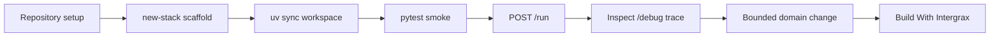

<!--
© Artur Czarnecki. All rights reserved.
Intergrax is source-available under the Intergrax Evaluation and Collaboration License 1.0.
See LICENSE for permitted evaluation, collaboration, and contribution use.
-->

# Build with Intergrax — Builder Quick Start

This is the canonical first builder entry point: a bounded, executable path from repository setup to a runnable agent + application stack. It uses current Intergrax scaffold capabilities — not a production template or stable public SDK.

## At a glance

| Item | Meaning |
|------|---------|
| Audience | AI engineers and application developers |
| You will create | Tier-2 agent (`agents/<slug>/`) + Tier-3 lab application (`applications/<slug>_application/`) |
| Primary command | `python -m intergrax.scaffold new-stack <slug> --profile lab` |
| First verification | `uv run pytest applications/<slug>_application/tests -q` |
| Deeper planning | [Build With Intergrax](BUILD_WITH_INTERGRAX.md) after this run succeeds |
| Product trial (separate) | [LKW Quick Start](../../../applications/local_workspace_application/docs/product/QUICKSTART.md) |
| Evaluation route (separate, not mandatory) | [Evaluation Guide](EVALUATION_GUIDE.md) |

## What you will build

In this quick start you will:

1. prepare the Intergrax repository
2. scaffold a minimal lab stack (`new-stack`)
3. sync the new workspace members
4. run the generated host smoke tests
5. execute one bounded `POST /run` request
6. inspect the trace on the debug API
7. make one application-owned change and verify again
8. continue to [Build With Intergrax](BUILD_WITH_INTERGRAX.md) for composition planning



## Prerequisites

- **Python 3.12** and **[uv](https://docs.astral.sh/uv/)**
- A clone of this repository on the `development` branch
- Repository baseline from the [Evaluation Guide](EVALUATION_GUIDE.md) (developer dependencies and repo confidence checks)
- **`Intergrax-ai[llm-ollama]`** for lab scaffold hosts — the generated smoke tests wire the default platform LLM profile (`ollama`). Install with `uv sync --extra llm-ollama` after scaffold (see below). A running Ollama server is **not** required for this quick start: the scaffolded agent uses an in-agent stub LLM for the reflex path exercised here.

This page does not duplicate full platform setup. For catalog variables and provider configuration, see [Platform Configuration](../technical/guides/PLATFORM_CONFIGURATION.md).

## Setup

From the **repository root**, complete the Evaluation Guide repository baseline first. Then continue here.

## Scaffold the stack

Pick one slug (example: `my_first_stack`). This creates both the agent and the lab application:

```bash
python -m intergrax.scaffold new-stack my_first_stack --profile lab
```

The command registers workspace members in the root `pyproject.toml` and prints paths for tests and HTTP start.

**Alternatives (later):** `new-agent` (Tier-2 only), `new-application` (Tier-3 only, existing agents). Prefer `new-stack` for the first coherent bundle. See [applications usage](../../../applications/USAGE.md) and the [Agent Creation Guide](../technical/guides/AGENT_CREATION_GUIDE.md) Step 4E.

## What was generated

| Location | Role |
|----------|------|
| `agents/my_first_stack/` | Tier-2 agent package (reflex cognitive pattern, stub LLM in tests) |
| `agents/my_first_stack/steps/domain_job.py` | **Product implementation point** — first bounded edit |
| `applications/my_first_stack_application/` | Tier-3 lab host (FastAPI + debug API) |
| `applications/my_first_stack_application/manifest.py` | Agent bindings and environment |
| `applications/my_first_stack_application/tests/host/test_*_host_smoke.py` | Host smoke tests (`/agents`, `/run`) |
| `applications/my_first_stack_application/.env.example` | Application settings template |

Replace `my_first_stack` with your slug in all paths below.

## Sync and verify

After scaffold, install the new workspace members and the Ollama client extra:

```bash
uv sync --extra llm-ollama
uv run pytest applications/my_first_stack_application/tests -q
```

Expected: **2 passed** (lists agents + completes one `/run`).

## Execute one request

Copy settings (optional for smoke tests; useful for HTTP):

```bash
cp applications/my_first_stack_application/.env.example applications/my_first_stack_application/.env
```

Start the lab host (from repository root; `applications/` is on the pytest `pythonpath` and is picked up the same way by `uv run`):

```bash
uv run uvicorn my_first_stack_application.host.main:app --host 127.0.0.1 --port 8091
```

In another terminal:

```bash
curl -s http://127.0.0.1:8091/v1/my_first_stack/agents
curl -s -X POST http://127.0.0.1:8091/v1/my_first_stack/run \
  -H "Content-Type: application/json" \
  -d '{"tenant_id":"lab","user_id":"builder","message":"hello","capability":"my_first_stack.basic"}'
```

**Windows (PowerShell):** use `curl.exe` with the same URL and JSON body, or `Invoke-RestMethod`.

Expected JSON: `"state": "completed"` and an `answer` containing `my_first_stack: domain job not implemented`.

## Inspect the result and trace

Note `task_id` from the `/run` response. The lab host mounts the debug API on the same process:

```bash
curl -s "http://127.0.0.1:8091/debug/tasks/<task_id>/trace?tenant=lab&include_runtime=true"
```

You should see non-empty `trace_events`. This is development observability on the scaffold host — not a production operations contract.

## Make one bounded change

Edit the **application-owned** domain step (not `intergrax/`):

`agents/my_first_stack/steps/domain_job.py` — change the `answer` string, for example:

```python
answer = "Hello from my product stack"
```

Re-run verification:

```bash
uv run pytest applications/my_first_stack_application/tests -q
```

Repeat the `POST /run` call; the `answer` field should reflect your change. The scaffolded agent package is yours; the host wiring and Nexus loop are reused platform behavior.

## Understand ownership

| Layer | Owns | In this quick start |
|-------|------|---------------------|
| **Your application** | Product workflow, domain job, UX, product settings | `agents/my_first_stack/`, `applications/my_first_stack_application/` |
| **Intergrax platform** | Harness host, Nexus loop, policy/tool mechanisms, debug/trace plumbing | `intergrax/`, `intergrax/runtime/` |
| **Reusable agent pattern** | Reflex scaffold, stub LLM for local smoke | Generated agent base — replace with real domain logic over time |

Do not move product semantics into `intergrax/` merely because they look reusable. See the [Architecture Overview](../architecture/ARCHITECTURE_OVERVIEW.md).

## After the first run — builder checkpoint

Once scaffold, smoke tests, and one `/run` succeed, use this checkpoint before broader changes:

1. **User workflow:** Define one user workflow — what outcome should change for the user?
2. **Ownership:** Product/application-specific vs reusable cross-application foundation?
3. **Starting surface:** Which existing application, guide, or capability is closest? (LKW example: [LKW architecture](../../../applications/local_workspace_application/docs/ARCHITECTURE.md))
4. **First change:** What is the smallest coherent change — stay within one ownership boundary?
5. **Verification:** Nearest existing contract (application test, proof, or gate).

**First verify the behavior at its nearest existing contract.** Setup and verification are route-owned: application behavior → application tests; the [Evaluation Guide](EVALUATION_GUIDE.md) owns bounded repository evaluation, not this builder smoke path.

## Continue building

Continue to [Build With Intergrax](BUILD_WITH_INTERGRAX.md) for deeper composition and route selection. Use the [Technical Documentation Map](../technical/DOCUMENTATION_MAP.md) when a specific module question needs routing. Use the [LKW Quick Start](../../../applications/local_workspace_application/docs/product/QUICKSTART.md) only to try the LKW product — not to begin builder onboarding.

## Current boundaries

- Scaffold output is a **generated starter structure** for development and evaluation — not production-ready.
- No generic project scaffold beyond current CLI capabilities, no universal application template, and no stable universal public SDK is promised.
- Lab profile defaults to port **8091**; product profile (`--profile product`) is a separate host shape.
- Provider credentials and live model serving are path-specific; this quick start does not claim all providers or application types work.
- Bounded tests and proofs do not imply universal production readiness.
