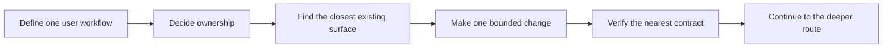

<!--
© Artur Czarnecki. All rights reserved.
Intergrax is source-available under the Intergrax Evaluation and Collaboration License 1.0.
See LICENSE for permitted evaluation, collaboration, and contribution use.
-->

# Build with Intergrax — Builder Quick Start

This is the canonical first builder entry point for AI engineers and application developers who want to build or extend something with Intergrax.

Before changing code, define one user workflow and answer five questions: what outcome should change, who owns it, which existing surface is closest, what is the smallest coherent first change, and which existing contract should verify it.

Intergrax supports specialized applications built on reusable foundations. This page is orientation, not a scaffold, SDK reference, repository-wide setup guide, or implementation manual.

## At a glance

| Item | Meaning |
|------|---------|
| Audience | AI engineers and application developers |
| First checkpoint | Workflow → ownership → closest surface → bounded change → nearest verification |
| Primary next document | [Build With Intergrax](BUILD_WITH_INTERGRAX.md), after the checkpoint is clear |
| Separate product trial | [LKW Quick Start](../../../applications/local_workspace_application/docs/product/QUICKSTART.md) |
| Separate evaluation route | [Evaluation Guide](EVALUATION_GUIDE.md) |

## The first builder decision

In plain language: start from the user outcome, not from a platform module. Decide whether the behavior is product-specific or reusable, then inspect the nearest application, guide, or capability before considering a broader foundation change.

## First builder contract

Answer these before broad platform changes:

1. **User workflow:** What does the user do from request to accepted outcome? What outcome should change?
2. **Ownership:** Is the behavior product/application-specific, or is it a reusable cross-application foundation?
3. **Starting surface:** Which existing application, guide, or capability is closest?
4. **First change:** What is the smallest coherent change that demonstrates the intended behavior?
5. **Verification:** What existing test, proof, or documented check is nearest to that behavior?

If one of these answers is missing, keep orienting rather than modifying platform core.

## Application or reusable foundation?

The application or product typically owns:

- domain workflow and product semantics;
- UX and user-visible behavior;
- product-specific configuration;
- product permission decisions and required identity context;
- product acceptance behavior.

The reusable Intergrax foundation may own:

- reusable contracts and policy/enforcement mechanisms;
- shared knowledge and context mechanisms;
- shared evidence and provenance mechanisms;
- reusable integration/tool boundaries;
- runtime and platform mechanisms.

Do not move a function into `intergrax/` merely because it looks reusable. Responsibility comes first; the path follows the architecture. A product-specific change should reuse existing foundations where possible and should not modify platform core merely to demonstrate an application workflow.

The [Architecture Overview](../architecture/ARCHITECTURE_OVERVIEW.md) explains these responsibility boundaries. The owning architecture document remains canonical for a concrete module or domain.

## Choose one starting route

| Route | Use it when | Closest canonical source |
|------|-------------|--------------------------|
| **A — Extend an existing application** | The requested behavior is specific to an existing product workflow. The current primary example is LKW. | [LKW application architecture](../../../applications/local_workspace_application/docs/ARCHITECTURE.md) |
| **B — Build a specialized application** | You are creating a distinct product workflow on reusable Intergrax foundations. | [Build With Intergrax](BUILD_WITH_INTERGRAX.md), then the [Architecture Overview](../architecture/ARCHITECTURE_OVERVIEW.md); use the [Agent Creation Guide](../technical/guides/AGENT_CREATION_GUIDE.md) or [applications usage](../../../applications/USAGE.md) only when deeper technical material is required. |
| **C — Evaluate before building** | You do not yet know whether the foundation fits the intended workflow. | [Evaluation Guide](EVALUATION_GUIDE.md) |

Route A means extending LKW's application-owned workflow, not reproducing its architecture here. Route B means planning before composing or extending reusable capabilities. Route C is a sibling evaluation route, not a mandatory step for every builder.

## Make the first change bounded

A good first change:

- represents one user-visible or contract-level behavior;
- stays within one clear ownership boundary;
- reuses existing abstractions where possible;
- has an existing or naturally adjacent verification boundary;
- does not create a new subsystem just to test Intergrax;
- does not require touching unrelated modules.

For example, if a knowledge application needs a new product-specific behavior, keep the workflow semantics in the application, reuse the existing governed knowledge and execution mechanisms, change only the application-owned behavior first, and verify the nearest application contract. Only a verified shared need should open a deeper platform question. This is a conceptual example, not an implemented tutorial.

## Verify the nearest existing contract first

**First verify the behavior at its nearest existing contract.**

- Application behavior → application-focused test or proof.
- Reusable contract → the owning contract test.
- Public claim or evidence behavior → the owning proof or document contract.
- Repository-wide gate → a broader confidence check, not automatically the first validation of every edit.

Setup and verification are route-owned. There is no universal builder setup command on this page. Follow the commands and prerequisites in the canonical documentation for the selected application, capability, or evaluation route. The [Evaluation Guide](EVALUATION_GUIDE.md) owns the bounded repository evaluation sequence; it is not a generic builder acceptance check.

## Continue when the checkpoint is clear

Once you can state the workflow, ownership boundary, starting surface, bounded first change, and verification owner, continue to [Build With Intergrax](BUILD_WITH_INTERGRAX.md). It owns deeper route selection and build planning.

For the selected route, follow its architecture or implementation guide. Use the [Technical Documentation Map](../technical/DOCUMENTATION_MAP.md) only when a deeper technical question needs routing. Use the [LKW Quick Start](../../../applications/local_workspace_application/docs/product/QUICKSTART.md) only when the goal is to try the LKW product, not to begin builder onboarding.

## Current boundaries

- No generic project scaffold, universal application template, or stable universal public SDK is promised.
- No universal builder setup or fixed onboarding duration is claimed.
- Route-specific prerequisites differ.
- Bounded tests and proofs do not imply universal production readiness.
