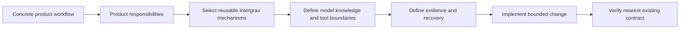

<!--
© Artur Czarnecki. All rights reserved.
Intergrax is source-available under the Intergrax Evaluation and Collaboration License 1.0.
See LICENSE for permitted evaluation, collaboration, and contribution use.
-->

# Build With Intergrax

You have completed the [Builder Quick Start](BUILDER_QUICKSTART.md) checkpoint. Now turn the workflow into a bounded application composition plan on Intergrax.

This is the deeper builder planning guide: it helps an AI engineer or application architect decide what the product owns, which reusable Intergrax responsibilities are needed, and where the nearest technical and verification owners are. It does not replace module architecture, API contracts, or evaluation execution.

> [!NOTE]
> Intergrax is source-available and under **active R&D**. This guide plans bounded composition; it does not claim universal provider support, production readiness, or a stable universal public SDK.

## At a glance

Before using this guide, be able to state:

| Builder input | Required answer |
| --- | --- |
| **User workflow** | What happens from the user's request to an accepted outcome? |
| **Ownership boundary** | Which behavior is product/application-specific, and which could be reusable across applications? |
| **Starting surface** | Which existing application, agent, or foundation is closest? |
| **Bounded first change** | What is the smallest coherent behavior to change first? |
| **Verification owner** | Which existing contract is nearest to that behavior? |

If any answer is unclear, return to [Builder Quick Start](BUILDER_QUICKSTART.md). That document owns the first builder checkpoint; this one owns composition planning after it.

## Application-first composition model

**Do not begin by extending the platform. Begin with the concrete product workflow.** Reuse existing foundations and introduce a new reusable abstraction only when:

- the need is genuinely cross-application;
- an existing abstraction cannot represent it cleanly;
- ownership is clear; and
- the change has its own verification boundary.

The [Architecture Overview](../architecture/ARCHITECTURE_OVERVIEW.md) is the responsibility model:

| Responsibility | Product composition decision |
| --- | --- |
| **Specialized product application** | Owns the workflow, UX, product semantics, business permissions, acceptance criteria, deployment, and product decisions. |
| **Intergrax application operating layer** | Provides reusable policy and approval mechanisms, context and knowledge boundaries, governed execution, tool and integration boundaries, runtime controls, recovery, observability, and evidence/provenance. |
| **Agent and model behavior** | Owns reasoning, inference, decision generation, and domain-specific model behavior within the supplied context and governed execution. |
| **Knowledge, tools, integrations, and model systems** | Provide selected data, services, business-system effects, tools, and model access behind configured boundaries. |
| **Evidence and provenance** | Records receipts, traces, provenance, and review information produced during execution. It does not certify production or commercial readiness. |

The product team defines what a business rule means and whether an outcome is acceptable. Intergrax provides mechanisms that enforce configured boundaries; the agent or model does not grant permission or bypass them.



Textual equivalent: workflow → product ownership → reusable foundations → model/context/tool boundaries → evidence/recovery → bounded implementation → nearest verification.

## Builder plan

### 1. Define the product workflow

Name the user, the trigger, the steps that matter, and the accepted result. State the product-specific success condition in terms a reviewer can observe. Fit signals may include governed knowledge, explicit identity or tenant context, controlled external actions, approval, provenance, or recovery, but no workflow needs every mechanism.

### 2. Define product ownership

Keep domain workflow, UX, business semantics, business permissions, acceptance criteria, and deployment/product decisions in the specialized application. Do not move a product decision into `intergrax/` merely because another application might eventually need a similar shape.

### 3. Choose reusable foundations

Select mechanisms because the workflow requires their responsibility:

- governed knowledge or context → inspect the relevant knowledge architecture and [Architecture Overview](../architecture/ARCHITECTURE_OVERVIEW.md);
- controlled tools or external effects → inspect the owning tool/integration boundary;
- agent behavior → [Agent Creation Guide](../technical/guides/AGENT_CREATION_GUIDE.md);
- application composition → [applications/USAGE.md](../../../applications/USAGE.md);
- deeper technical ownership → [Technical Documentation Map](../technical/DOCUMENTATION_MAP.md).

Do not choose a capability merely because it exists, and do not treat unfinished provider integrations as builder primitives. [Token Optimization](../capabilities/token_optimization/README.md) is only an optional example of a reusable capability selected when a workflow needs policy-bounded context optimization; its public status and claims remain bounded in [TOKEN_OPTIMIZATION_CLAIMS.md](../capabilities/TOKEN_OPTIMIZATION_CLAIMS.md).

### 4. Define knowledge and context

Decide:

- what may be indexed or persisted;
- what may be read live, if anything;
- which identity, workspace, or tenant context applies;
- which sources are approved;
- what must never cross a product, tenant, or authorization boundary.

The application owns source approval and user meaning. The operating layer supplies context and knowledge boundaries for selected resources.

### 5. Define tools and effects

List allowed external actions, read-only resources, write effects, and forbidden effects. State which actions are simulated, deterministic, reversible, or real. Make approval requirements explicit before implementation; the model may propose an action, but configured policy and the application’s business permission decide whether it can execute.

### 6. Define the agent/model role

Specify what the model may infer, summarize, classify, or propose, and what must remain deterministic, application-owned, or policy-controlled. Give the agent only the context and tools required by the workflow. Do not make model behavior the owner of permissions, acceptance criteria, evidence, or recovery.

### 7. Define evidence and provenance

Define what a user or reviewer must be able to inspect: citations, source identity, provenance, receipts, traces, execution decisions, approval records, or a review surface. Capture enough build evidence to reproduce a behavior—commit, environment, model/provider, configuration, observed result, limitation, and failed or skipped step.

Build evidence supports reproduction and review. It is not automatically public **PROOFS** evidence. Public claim promotion follows the accepted evidence pipeline; [PROOFS](../proofs/PROOFS.md) remains the owner of public evidence status.

### 8. Define failure and recovery

Describe expected behavior for provider failure, tool failure, policy denial, partial execution, and restart/recovery. Decide whether the product retries, falls back, pauses for review, compensates, or reports an incomplete result. Identify what evidence remains after each failure. Keep this conceptual and route implementation detail to the owning architecture.

### 9. Define verification

Name the nearest existing contract that proves the intended behavior, then identify the broader gate required by its owning module. Verify the bounded application behavior first; a platform change needs its own cross-application contract rather than an assumption based on one product.

## Reusable builder plan artifact

Copy this checklist into the design discussion or implementation issue when useful. It is a planning aid, not a submission requirement:

```text
Workflow:
User:
Accepted outcome:
Product-owned decisions:
Intergrax mechanisms needed:
Knowledge/context:
Tools/effects:
Approvals:
Agent/model role:
Evidence:
Failure/recovery:
Nearest verification:
Deeper technical owner:
```

## Concrete composition example: LKW

[LKW](../../../applications/local_workspace_application/docs/ARCHITECTURE.md) demonstrates the pattern without being a mandatory builder starting point: its workspace workflow, approved-source choice, user-facing Ask, and product acceptance are application responsibilities; ingest, knowledge boundaries, governed execution, evidence/provenance, and hosting/runtime mechanisms are shared foundations. Use the [LKW Platform Proof](../../../applications/local_workspace_application/docs/proof/LKW_PLATFORM_PROOF.md) only when that product-specific route is relevant. Do not duplicate its technical architecture here.

## Sibling routes and boundaries

- If the goal is a time-boxed evaluation rather than application composition, use the separate [Evaluation Guide](EVALUATION_GUIDE.md). It owns evaluation execution; this guide does not turn every builder into an evaluator.
- If the goal is current public evidence status, use [PROOFS](../proofs/PROOFS.md). A builder plan or local result does not promote a public claim.
- For the product trial, use [Try LKW](../../../README.md#try-lkw) or its [LKW Quick Start](../../../applications/local_workspace_application/docs/product/QUICKSTART.md).
- For public reader routing, use the [Public Documentation Map](../community/PUBLIC_DOCUMENTATION_MAP.md); for deep technical routing, use the [Technical Documentation Map](../technical/DOCUMENTATION_MAP.md).
- Collaboration routes are in [COLLABORATION.md](../community/COLLABORATION.md).

Local non-production evaluation is subject to the [LICENSE](../../../LICENSE). Evaluation or building does not imply production use, commercial use, hosting, or redistribution permission; the license is authoritative.
