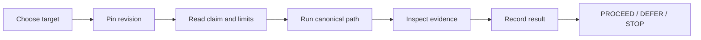

<!--
© Artur Czarnecki. All rights reserved.
Intergrax is source-available under the Intergrax Evaluation and Collaboration License 1.0.
See LICENSE for permitted evaluation, collaboration, and contribution use.
-->

# Intergrax Evaluation Guide

Intergrax is **source-available** and under **active R&D**. **LKW** is the **Primary Product Proof**, classified as **Backend Product Alpha / MVP** and **PARTIAL**. **Real-user validation** and **commercial validation** remain incomplete. The [LICENSE](../../../LICENSE) is authoritative.

This is a self-service method for one bounded technical/product evaluation. It is not a Builder Quick Start, application composition plan, proof status dashboard, external-reader validation protocol, generic test runner, or production certification procedure.

Passing a bounded evaluation ≠ production readiness ≠ commercial permission ≠ external validation ≠ certification.

## What does a bounded evaluation mean?

A bounded evaluation is a reproducible attempt to test **one stated claim or workflow** against its canonical documented path at a pinned repository revision. It produces an evidence-backed reader decision; it does not turn a passing proof into a broader status.

## At a glance



The stable flow is: **ORIENT → CHOOSE TARGET → PIN REVISION → READ CLAIM + LIMITS → RUN CANONICAL PATH → INSPECT EVIDENCE → RECORD RESULT + FRICTION → DECIDE → ROUTE NEXT**.

## 1. ORIENT

Orientation is optional when the problem and architecture are already understood. Otherwise use:

- [WHY_INTERGRAX](../overview/WHY_INTERGRAX.md) for problem and value;
- [USE_CASES](../overview/USE_CASES.md) for applicability;
- [ARCHITECTURE_OVERVIEW](../architecture/ARCHITECTURE_OVERVIEW.md) for responsibilities and boundaries.

For current evidence status, consult [PROOFS](../proofs/PROOFS.md). It owns what is currently demonstrated; this guide owns how to test one claim fairly.

## 2. CHOOSE ONE EVALUATION TARGET

Do not evaluate “Intergrax” as one undifferentiated product. Select one target:

| Target | Question | Canonical owner |
|---|---|---|
| LKW product trial | Can I run the supported bounded indexed LKW workflow? | [LKW Quick Start](../../../applications/local_workspace_application/docs/product/QUICKSTART.md) |
| LKW deep product/platform proof | Does the bounded LKW proof support the stated product/platform claim? | [LKW Platform Proof](../../../applications/local_workspace_application/docs/proof/LKW_PLATFORM_PROOF.md) |
| Token Optimization capability | Does its bounded evidence support the claim being evaluated? | [Token Optimization guide](../capabilities/token_optimization/README.md) and its owning proof |
| Architecture / builder fit | Does the responsibility model fit the application I intend to build? | [ARCHITECTURE_OVERVIEW](../architecture/ARCHITECTURE_OVERVIEW.md), [USE_CASES](../overview/USE_CASES.md), [BUILD_WITH_INTERGRAX](BUILD_WITH_INTERGRAX.md) |

These targets do not have equal maturity. Architecture fit is primarily document evaluation, not runtime proof. [BUILD_WITH_INTERGRAX](BUILD_WITH_INTERGRAX.md) is relevant for composition planning, not a prerequisite for normal LKW or capability proof execution.

## 3. PIN THE REVISION

Before running anything, record:

- exact commit SHA or immutable tag;
- operating system and environment;
- relevant runtime, model, and provider, if used;
- selected target and canonical owner/path.

Do not record a result against a moving branch state. Normal self-service evaluation does not require the machinery in the [External Reader Validation Protocol](../maintainers/public-adoption/EXTERNAL_READER_VALIDATION_PROTOCOL.md).

## 4. READ THE CLAIM AND LIMITS

Write the **CLAIM BEING TESTED** before executing commands. Also write **WHAT THE PATH DOES NOT PROVE**.

For example, an indexed LKW path may support a bounded indexed Ask result. It does not automatically prove mixed indexed + authorized live Hybrid Ask, complete live-provider access, production readiness, real-user validation, or commercial validation. Use [PROOFS](../proofs/PROOFS.md) for current boundaries; do not reproduce its status matrix here.

## 5. RUN THE CANONICAL PATH

Commands and path-specific prerequisites belong to the canonical owner:

- LKW product trial → [LKW Quick Start](../../../applications/local_workspace_application/docs/product/QUICKSTART.md);
- deeper LKW proof → [LKW Platform Proof](../../../applications/local_workspace_application/docs/proof/LKW_PLATFORM_PROOF.md);
- Token Optimization → its owning capability/proof documentation;
- architecture fit → the architecture and builder documents above.

The repository baseline may be used as a broader confidence check:

```bash
uv sync --extra dev
uv run intergrax doctor
uv run pytest -m gate -q
```

This is a **repository baseline / broader confidence check**, not proof of the selected product or capability claim. Passing `pytest -m gate` does not prove all Intergrax functionality.

## 6. INSPECT EVIDENCE

Do not stop at “the command exited 0”. Ask:

- What observable output supports the claim?
- Are citations, provenance, receipts, or persisted state present when expected?
- Were steps skipped, or was fallback/mock behavior involved?
- Did the documented environment match the evaluated environment?
- Is the outcome reproducible?

Follow the owning proof document for path-specific evidence requirements. A passing bounded evaluation is evidence for its selected boundary only.

## 7. RECORD THE RESULT

Use this compact record:

```text
Evaluation target:
Pinned revision:
Environment:
Canonical path:
Claim tested:
Expected result:
Observed result:
Evidence:
Skipped/unavailable:
Friction/blocker:
Known limitation:
Decision:
```

High-value feedback includes the exact revision, target/path, environment, expected and observed results, evidence, skipped or unavailable prerequisites, friction/blocker, and limitation. Avoid “it doesn't work” or “looks good” without evidence. Ordinary feedback can go through [COLLABORATION](../community/COLLABORATION.md).

Classify friction precisely:

- **DOCUMENTATION FRICTION** — unclear instructions, navigation, or setup;
- **ENVIRONMENT BLOCK** — a prerequisite, hardware, or service is unavailable;
- **PRODUCT/PROOF FAILURE** — the documented expected result fails under supported conditions;
- **CLAIM GAP** — implementation may exist, but evidence does not establish the public claim.

## 8. DECIDE

These are evaluation decisions, not public module statuses:

- **PROCEED** — selected bounded evidence supports deeper evaluation, build, or pilot discussion;
- **DEFER** — the workflow may fit, but required evidence/capability is incomplete or the environment cannot fairly evaluate it;
- **STOP** — the responsibility/use-case class is wrong, evidence contradicts the need, or another approach is more appropriate.

Do not use `ACCEPTED`, `READY_FOR_REVIEW`, or `DONE` as reader decisions; lifecycle and production labels are not evaluation decisions.

## 9. ROUTE NEXT

- Successful LKW trial → inspect [LKW Platform Proof](../../../applications/local_workspace_application/docs/proof/LKW_PLATFORM_PROOF.md); a Quick Start pass alone is not full technical validation.
- PROCEED to building → [Builder Quick Start](BUILDER_QUICKSTART.md), then [BUILD_WITH_INTERGRAX](BUILD_WITH_INTERGRAX.md) for composition planning.
- Architecture-fit evaluation → [ARCHITECTURE_OVERVIEW](../architecture/ARCHITECTURE_OVERVIEW.md), [USE_CASES](../overview/USE_CASES.md), and [BUILD_WITH_INTERGRAX](BUILD_WITH_INTERGRAX.md).
- Partner or pilot discussion → [PARTNERS](../community/PARTNERS.md) and [COLLABORATION](../community/COLLABORATION.md). Evaluation does not grant production permission, hosting, redistribution, or commercial permission; [LICENSE](../../../LICENSE) controls those boundaries.
- Formal external-reader methodology → [EXTERNAL_READER_VALIDATION_PROTOCOL](../maintainers/public-adoption/EXTERNAL_READER_VALIDATION_PROTOCOL.md). A self-service evaluation does not constitute external reader validation, and feedback does not complete real-user validation.

For broader orientation use [README](../../../README.md), [FAQ](../overview/FAQ.md), or [ROADMAP](../overview/ROADMAP.md). Public navigation is in [PUBLIC_DOCUMENTATION_MAP](../community/PUBLIC_DOCUMENTATION_MAP.md) and [DOCUMENTATION_MAP](../technical/DOCUMENTATION_MAP.md). Time estimates are optional orientation hints only; no validated evaluation duration is promised.
