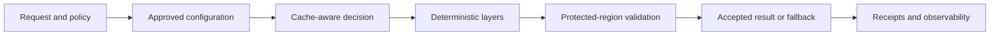

<!--
© Artur Czarnecki. All rights reserved.
Intergrax is source-available under the Intergrax Evaluation and Collaboration License 1.0.
See LICENSE for permitted evaluation, collaboration, and contribution use.
-->

# Intergrax Token Optimization Engine

Central guide for the Token Optimization platform capability: deterministic optimization layers, policy-governed routing, protected-region safety, receipts, cache-stable prompt assembly, and reproducible proofs.

**Public proof dashboard:** [`../../../../docs/project/proofs/PROOFS.md`](../../../../docs/project/proofs/PROOFS.md)

---

## At a glance

| | |
|---|---|
| **Role** | Featured platform-capability proof |
| **Overall public classification** | PARTIAL |
| **Implemented foundation** | Existing deterministic engine mechanisms |
| **Accepted bounded proof** | Bounded offline smoke proof (`RUNTIME-TOKEN-OPTIMIZATION-OFFLINE`) |
| **Manual live evidence** | vLLM prefix-cache live path (reviewer guide; not a canonical manifest proof_id) |

**Proof:** `RUNTIME-TOKEN-OPTIMIZATION-OFFLINE`

| **Bounded durable mechanism** | Durable repository, validation and CAS activation are implemented; live provider-wide proof, rollback execution and production rollout are not established |
| **Public limitations** | No provider-independent, universal or production-proven savings claim |
| **Detailed implementation roadmap** | [`../plan/TOKEN_OPTIMIZATION.md`](../plan/TOKEN_OPTIMIZATION.md) |
| **Public proof dashboard** | [`../../../../docs/project/proofs/PROOFS.md`](../../../../docs/project/proofs/PROOFS.md) |

Detailed phase, dependency and review status is maintained only
in the Token Optimization implementation plan and is not repeated here.

### Engine lifecycle



---

## Documentation map

| Document | Purpose |
| -------- | ------- |
| [Main guide](README.md) | Complete engine overview and usage |
| [Architecture](../architecture/TOKEN_OPTIMIZATION.md) | Canonical boundaries and invariants |
| [Unified Context Lifecycle](../../architecture/UNIFIED_CONTEXT_LIFECYCLE.md) | Cross-domain lifecycle, single budget authority, durable compaction foundation |
| [Plan](../plan/TOKEN_OPTIMIZATION.md) | Roadmap and implementation status |
| [Cache-prefix architecture](../architecture/TOKEN_OPTIMIZATION_CACHE_PREFIX_STABILIZATION.md) | Stable-prefix and provider-cache rules |
| [vLLM live proof](proofs/VLLM_PREFIX_CACHE_LIVE_PROOF.md) | Reviewer execution guide |
| [Public claim guardrails](../TOKEN_OPTIMIZATION_CLAIMS.md) | What can and cannot be claimed publicly |
| [Audit instruction](../../maintainers/audit/TOKEN_OPTIMIZATION.md) | Audit scope and review criteria |

---

## 1. Executive overview

The **Token Optimization Engine** is a Tier-0/runtime platform capability that reduces unnecessary prompt and context cost while preserving correctness, safety, provenance, and auditability. It is **not** a single-application shortcut or generic prompt-shortening utility.

**Why platform-level:** Applications consume public contracts under `intergrax/runtime/token_optimization`. The engine owns deterministic layer execution, policy gates, protected-region validation, receipts, and cache-aware prompt assembly. Applications must not duplicate these mechanisms locally.

**Problems solved:**

- Repeated or noisy context inflates input cost without improving answer quality.
- Tool, terminal, and log output often contains low-value repetition.
- RAG context packs can exceed practical budgets.
- Provider prefix-cache reuse requires stable prefixes and integrity-checked send payloads.

**Core guarantees:**

- Optimization is **policy-governed** and **deterministic** for a given approved configuration and input.
- An LLM router may select only **approved configuration IDs**; the platform compiles that choice deterministically.
- Validation, fallback, and rollback cannot be bypassed by router or plugin output.
- Optimization is **not** globally auto-enabled; explicit opt-in and profile selection apply.

**End-to-end flow:**

```text
input
→ classification and policy
→ approved configuration
→ deterministic layers
→ protected-region validation
→ fallback or accepted result
→ receipts and observability
```

---

## 2. Current maturity

The guide documents an implemented deterministic engine foundation, a bounded
offline smoke proof (`RUNTIME-TOKEN-OPTIMIZATION-OFFLINE`), a manual vLLM
prefix-cache live path documented separately, a bounded durable in-cache compaction
mechanism, and an overall **PARTIAL** public status. Live provider proof,
production rollout, and rollback execution remain incomplete; numeric savings
are not claimed.
Provider-independent behavior, universal savings, and production-proven
savings are not claimed.

Detailed phase, dependency and review status is maintained only
in the Token Optimization implementation plan.

---

## 3. Core concepts

| Term | Contract meaning |
| ---- | ---------------- |
| **Source type** | `TokenOptimizationSourceType` — what kind of content is optimized (prompt, tool output, RAG pack, etc.). |
| **Optimization profile** | `TokenOptimizationProfile` — operator-facing intensity (`off`, `measure_only`, `conservative`, `balanced`, `aggressive`, `experimental`). |
| **Policy** | `TokenOptimizationPolicy` — enablement, profile, lossy allowance, validation, fallback, receipt/telemetry emission. |
| **Lossy vs non-lossy** | `StrategySafetyClass` and per-layer behavior; lossy layers may omit content; lossless layers preserve semantic content subject to validation. |
| **Protected regions** | `ProtectedRegion` values that must survive optimization (`code_block`, `path`, `url`, `hash`, `exact_error`, etc.). |
| **Configuration** | `TokenOptimizationPipelineConfig` + ordered `TokenOptimizationLayerRef` entries, or router `configuration_id`. |
| **Layer reference** | `TokenOptimizationLayerRef` — `layer_id`, optional `plugin_id`/`version`, order, required flag. |
| **Pipeline mode** | `TokenOptimizationPipelineMode.DEFAULT` merges with defaults; `REPLACE` uses only explicit layers. |
| **Receipts** | `CompressionReceiptRef` and pipeline receipt metadata — hashes, savings, strategy attribution without raw content. |
| **Fallback** | On validation failure or required-layer failure, pipeline returns original content with explicit fallback status. |
| **Validation** | Central `validate_protected_regions` after content-changing layer decisions. |
| **Cache reuse** | Provider prefix-cache hit metrics — separate from tokens removed by content reduction. |
| **Content reduction** | Measured removal/compaction of prompt/context bytes or chars by optimization layers. |
| **Advisory recommendation** | `advisory.py` / evaluation helpers suggest strategies; they do not auto-apply optimization. |
| **Explicit opt-in** | `TokenOptimizationPolicy.enabled` defaults false; no silent global enablement. |

---

## 4. Engine architecture

```text
Caller / application
        │
        ▼
Token Optimization request and policy
        │
        ▼
Optional LLM configuration router
  (TokenOptimizationLLMRouter + approved catalog)
        │
        ▼
Cache-aware runtime entrypoint (TOKEN-10D-3)
  (CacheAwareTokenOptimizationRuntime)
        │
        ├─ typed adapter/cache evidence extraction
        ├─ evidence reconciliation (fail-closed on conflict)
        ├─ signal normalization (TOKEN-10D-2)
        └─ rejection boundary (no router/pipeline on reject)
        │
        ▼
Cache-aware timing gate (TOKEN-10D-1)
  (CacheAwareTokenOptimizationOrchestrator)
        ▲
        │ CacheAwareCompactionTimingInput
        │ from cache signal normalizer (TOKEN-10D-2)
        │
typed provider/adapter usage
  → PromptCacheUsageSnapshot
  → PromptCacheAttribution
  → normalize_cache_aware_compaction_signals()
        │
        ▼
Approved configuration compiler
        │
        ▼
Layer registry and catalog
  (TokenOptimizationLayerRegistry + built-in catalog)
        │
        ▼
Deterministic pipeline runner
  (TokenOptimizationPipelineRunner)
        │
        ├─ layer 1
        ├─ layer 2
        └─ layer N
        │
        ▼
Protected-region and result validation
        │
        ├─ accepted optimized result
        └─ fallback / rollback to original
        │
        ▼
Receipts, safe reporting and observability
  (receipts.py, telemetry.py, emission.py)
```

**Cache-stable send path (TOKEN-10B):** `prompt_assembly.py` and `prompt_cache.py` build stable prefix / dynamic tail; `materialize_cache_stable_send_payload` validates integrity before adapter invocation.

---

## 5. Engine execution lifecycle

1. **Caller** builds `TokenOptimizationRequest` with content, `source_type`, `policy`, optional `protected_regions`.
2. **Classification** uses `source_type` and request metadata for router eligibility and layer source gates.
3. **Policy** determines whether optimization runs, lossy allowance, validation, and receipt emission.
4. **Configuration** is supplied directly (`TokenOptimizationPipelineConfig`) or via LLM router `configuration_id` compilation.
5. **Registry** resolves each `TokenOptimizationLayerRef` to a registered `TokenOptimizationLayer` instance.
6. **Pipeline** resolves layer order (`DEFAULT` merges/replaces defaults; `REPLACE` uses only configured layers).
7. **Each layer** receives `TokenOptimizationLayerRequest` with immutable `original_content` and mutable `current_content`; returns `TokenOptimizationLayerResult`.
8. **Central validation** runs after content-changing decisions (`APPLY`, `OVERRIDE_PREVIOUS`, `FALLBACK`).
9. **Malformed results** (wrong type, mismatched `layer_id`, uncaught contract violations) are isolated; required layers trigger rollback.
10. **Required failures** revert to original content when `required=True` on a layer ref.
11. **Receipts** capture strategy attribution, savings metadata, validation status — no raw content.
12. **Reports** (regression, proof, safe summaries) expose only redaction-safe fields.
13. **Caller** receives `TokenOptimizationPipelineResult` with output, completion state, fallback flags, and receipt metadata.

### Pipeline modes

| Mode | Behavior |
| ---- | -------- |
| `DEFAULT` | Start from default layer refs; overlay matching `layer_id` entries from config; append new refs. |
| `REPLACE` | Use only `config.layers` (must be non-empty). |

There is no separate `APPEND` enum; appending in `DEFAULT` mode is achieved by supplying new layer refs that do not match existing IDs.

---

## 6. Registry and built-in catalog

**Registry** (`registry.py`): explicit map `layer_id → TokenOptimizationLayer`. Duplicate registration fails. Missing layers at resolve time are skipped or fail when `required=True`.

**Built-in catalog** (`builtin_catalog.py`): factory specs for registered built-in layers. `create_registry(selections)` builds a registry in deterministic catalog order. The catalog is not a runtime discovery mechanism — only listed `layer_id` values can be constructed.

**Identification:**

- `layer_id` — primary pipeline key (e.g. `builtin.exact_deduplication`).
- `plugin_id` / `version` — required for third-party layers; validated against descriptor on registration.
- `built_in` — `True` for catalog layers; `False` for plugins.

**Safety:** Layers not registered in the caller-provided registry cannot execute. Router catalog contains only approved built-in configuration IDs — no arbitrary plugin loading.

| Source | Path |
| ------ | ---- |
| Registry | [`intergrax/runtime/token_optimization/registry.py`](../../../../intergrax/runtime/token_optimization/registry.py) |
| Built-in catalog | [`intergrax/runtime/token_optimization/builtin_catalog.py`](../../../../intergrax/runtime/token_optimization/builtin_catalog.py) |
| Router catalog | [`intergrax/runtime/token_optimization/llm_router_catalog.py`](../../../../intergrax/runtime/token_optimization/llm_router_catalog.py) |

---

## 7. Complete built-in layer catalog

| Layer ID | Purpose | Input/source types | Lossy | Metric unit | Main safety behavior | Status |
| -------- | ------- | ------------------ | ----- | ----------- | -------------------- | ------ |
| `builtin.exact_deduplication` | Remove duplicate lines | `prompt`, `rag_context_pack`, `retrieved_evidence`, `conversation_history`, `tool_output` | No (lossless) | chars (`dedupe_saved_chars`) | Local + central protected-region validation | Implemented |
| `builtin.extractive_filtering` | Keep error/trace-relevant lines in noisy output | `tool_output`, `terminal_output`, `log_output` | Yes (lossy) | chars | Head/tail preservation; protected-region check | Implemented |
| `builtin.budget_aware_context_packing` | Priority-based fragment packing (**char-budget prototype**) | `rag_context_pack`, `retrieved_evidence` | No (lossless drops) | chars (`budget_unit: chars`) | Protected fragments must fit budget; validation on output | Implemented (prototype) |

**Not built-in layers:** `no_op` is expressed via `NO_OPTIMIZATION` router configuration or bypass decisions, not a separate registered layer.

---

## 8. Plugin system

Third-party layers implement the `TokenOptimizationLayer` protocol:

```python
from intergrax.runtime.token_optimization.contracts import (
    TokenOptimizationLayerDescriptor,
    TokenOptimizationLayerRequest,
    TokenOptimizationLayerResult,
    TokenOptimizationLayerRef,
    TokenOptimizationPipelineConfig,
    TokenOptimizationPipelineMode,
    TokenOptimizationPolicy,
    TokenOptimizationProfile,
    TokenOptimizationRequest,
    TokenOptimizationSourceType,
)
from intergrax.runtime.token_optimization.pipeline import TokenOptimizationPipelineRunner
from intergrax.runtime.token_optimization.registry import TokenOptimizationLayerRegistry

# 1. Implement protocol: descriptor property + optimize(request) -> result
# 2. Register explicitly:
registry = TokenOptimizationLayerRegistry()
registry.register(my_layer)

config = TokenOptimizationPipelineConfig(
    pipeline_id="plugin-proof",
    mode=TokenOptimizationPipelineMode.REPLACE,
    layers=(
        TokenOptimizationLayerRef(
            layer_id="third_party.synthetic.trace_filter",
            plugin_id="synthetic.third_party.trace_filter",
            version="1.0.0",
        ),
    ),
)
runner = TokenOptimizationPipelineRunner(registry=registry)
result = runner.run(
    request=TokenOptimizationRequest(
        content="...",
        source_type=TokenOptimizationSourceType.TOOL_OUTPUT,
        policy=TokenOptimizationPolicy(
            enabled=True,
            profile=TokenOptimizationProfile.BALANCED,
            allow_lossy=True,
        ),
    ),
    config=config,
)
```

**Author checklist:**

1. Implement `TokenOptimizationLayer` (`descriptor`, `optimize`).
2. Publish `TokenOptimizationPluginDescriptor` with capabilities and version.
3. Register layer instance in a `TokenOptimizationLayerRegistry` at application wiring time.
4. Reference layer via `TokenOptimizationLayerRef` (`layer_id`, `plugin_id`, `version`).
5. Run through `TokenOptimizationPipelineRunner` — same path as built-ins.
6. Respect policy gates (`enabled`, `allow_lossy`, profile).
7. Honor `supported_source_types` on descriptor.
8. Return valid `TokenOptimizationLayerResult` with matching `layer_id`.
9. Expect central protected-region validation when content changes.
10. Exceptions must not leak secrets into metadata; pipeline isolates failures.
11. Required layers trigger rollback on failure.
12. Receipt metadata must remain raw-content-safe.

**Reference proof:** [`tests/unit/runtime/token_optimization/test_third_party_plugin_adapter_contract.py`](../../../../tests/unit/runtime/token_optimization/test_third_party_plugin_adapter_contract.py) and fixture [`tests/fixtures/token_optimization/fake_third_party_plugin.py`](../../../../tests/fixtures/token_optimization/fake_third_party_plugin.py).

**Plugin system does not provide:**

- Automatic dynamic import or marketplace distribution.
- Sandboxing of untrusted Python code.
- Security guarantees for arbitrary third-party packages.
- Package authenticity verification.

---

## 9. How to use the engine

### A. Direct deterministic pipeline

```python
from intergrax.runtime.token_optimization.builtin_catalog import (
    BuiltInTokenOptimizationLayerSelection,
    create_builtin_token_optimization_layer_catalog,
)
from intergrax.runtime.token_optimization.contracts import (
    TokenOptimizationLayerRef,
    TokenOptimizationPipelineConfig,
    TokenOptimizationPipelineMode,
    TokenOptimizationPolicy,
    TokenOptimizationProfile,
    TokenOptimizationRequest,
    TokenOptimizationSourceType,
)
from intergrax.runtime.token_optimization.pipeline import TokenOptimizationPipelineRunner

catalog = create_builtin_token_optimization_layer_catalog()
registry = catalog.create_registry(
    (BuiltInTokenOptimizationLayerSelection(layer_id="builtin.exact_deduplication"),),
)
config = TokenOptimizationPipelineConfig(
    pipeline_id="exact-only",
    mode=TokenOptimizationPipelineMode.REPLACE,
    layers=(TokenOptimizationLayerRef(layer_id="builtin.exact_deduplication"),),
)
request = TokenOptimizationRequest(
    content="line one\nline one\nline two",
    source_type=TokenOptimizationSourceType.PROMPT,
    policy=TokenOptimizationPolicy(enabled=True, profile=TokenOptimizationProfile.CONSERVATIVE),
)
result = TokenOptimizationPipelineRunner(registry=registry).run(request=request, config=config)
# result.output_content, result.fallback_used, result.layer_results, result.receipt_metadata
```

### B. Built-in configuration catalog

Approved router configurations (`llm_router_catalog.py`):

- `no_optimization`
- `exact_only`
- `extractive_only`
- `packing_only`
- `exact_then_packing`
- `exact_then_extractive`
- `extractive_then_exact`

### C. LLM router

`TokenOptimizationLLMRouter` selects a `TokenOptimizationRouterConfigurationId` from the approved catalog only. The compiler builds `TokenOptimizationPipelineConfig` and registry selections deterministically.

- LLM does **not** define arbitrary layer lists or bypass policy.
- Native tool transport is preferred where implemented; structured output is a controlled fallback.
- Router output is advisory until the application applies it — **no auto-apply** in production paths by default.

### D. Reading results

| Field / area | Location |
| ------------ | -------- |
| Optimized output | `TokenOptimizationPipelineResult.output_content` |
| Completion | `completed`, `applied_layer_ids`, `bypassed_layer_ids` |
| Fallback | `fallback_used`, per-layer `fallback_used` / `bypass_reason` |
| Validation | per-layer `validation.status`, aggregate pipeline validation |
| Receipts | `receipt_metadata`, `CompressionReceiptRef` builders in `receipts.py` |
| Strategy attribution | `strategy_id`, `layer_id`, router `configuration_id` |
| Safe report fields | regression and proof serializers — no raw prompts |

### E. Integration boundary

Applications should call public contracts under `intergrax/runtime/token_optimization` and approved adapter paths. Do not reimplement protected-region parsing, pipeline sequencing, or receipt hashing locally. Do not import Token Optimization from `applications` into `intergrax`.

---

## 10. Protected regions and safety

**Detection:** `protected_regions.py` scans content for built-in patterns (fenced code, inline code, URLs, paths, hashes, dates, error strings, policy markers, evidence references, env-var terms).

**Validation:** After any content-changing layer decision, the pipeline calls `validate_protected_regions(original, optimized, regions)`.

**On violation:** Layer or pipeline sets validation failed; with `fallback_on_validation_failure=True`, output reverts to original content.

**Layer-local vs central:** Layers may perform local checks; central validation is authoritative for pipeline acceptance.

**Raw-content safety:** Reports, receipts, and proof artifacts must not include raw prompts, tool args, or customer content.

Supported kinds include: `code_block`, `inline_code`, `path`, `url`, `env_var`, `hash`, `date`, `enum_value`, `exact_error`, `policy_text`, `evidence_reference`, `identifier`, and related kinds in `ProtectedRegionKind`.

---

## 11. Receipts and observability

**Receipt:** proof of what changed — content hashes, char/token savings metadata, strategy/layer IDs, validation and fallback status.

**Must not contain:** raw content, secrets, tokens, private customer data, absolute user paths.

**Attribution:** per-layer `strategy_id`, `layer_id`, `plugin_id`; router adds `configuration_id`.

**Fallback / no-op:** explicit `bypass_reason`, `TokenOptimizationDecision.BYPASS`, or `NO_OPTIMIZATION` configuration.

**Observability boundary:** Token Optimization emits through Harness Observability Spine / approved domain signals (`telemetry.py`, `domain_events.py`). There is no private alternate telemetry bus.

| Metric family | Examples |
| ------------- | -------- |
| Content reduction | `saved_chars`, `dedupe_saved_chars`, strategy breakdown |
| Provider prefix-cache reuse | `cached_input_tokens`, `prefix_cache_hits` deltas (vLLM proof) |
| Latency | proof report timings — not standalone proof of cache |
| Quality / regression | `regression_gate.py`, evaluation packs |

---

## 12. Cache-stable prompt and provider prefix cache

**Stable prefix:** deterministic, cache-friendly leading portion of the assembled prompt.

**Dynamic tail:** per-turn varying suffix appended after the stable prefix.

**Append-only semantics:** prefix growth rules enforced by `prompt_cache.py` validators.

**Tool-envelope stability:** canonical tool order and `tool_envelope_hash` before send (`TOKEN-10B-R1/R2`).

**Integrity:** `messages_hash`, `tool_envelope_hash`, `materialize_cache_stable_send_payload` reject tampered payloads.

**Invalidation:** documented reasons in cache-stable contracts when prefix or envelope changes.

**Cache-aware compaction timing:** `decide_cache_aware_compaction_timing()` in `prompt_cache.py` — deterministic policy helper. **TOKEN-10D-1** wires it through `CacheAwareTokenOptimizationOrchestrator` before pipeline execution.

**Cache signal normalization (TOKEN-10D-2):** `prompt_cache_usage_snapshot_from_adapter_response()` and `normalize_cache_aware_compaction_signals()` compile typed adapter usage and `PromptCacheAttribution` into `CacheAwareCompactionTimingInput`. Unknown cache state stays `None` (not a miss). Explicit zero requires confirmed provider reporting. Estimated usage is not provider-reported evidence. TTL is never inferred from policy or capability defaults. Char reduction estimates are not converted to tokens. Global KV metrics are not treated as per-request hotness. The normalizer performs no provider I/O and does not execute the pipeline or in-cache compaction.

**Cache-aware runtime composition (TOKEN-10D):** `CacheAwareTokenOptimizationRuntime.run()` is the preferred cache-aware execution entrypoint. It composes typed adapter evidence extraction, reconciliation with `PromptCacheAttribution`, signal normalization, and the existing orchestrator — in that order. Reconciliation and normalization happen before router invocation. Conflicting provider/model cache evidence returns `SIGNALS_REJECTED` without calling the router, LLM, or pipeline. `PARTIAL` normalization still enters the orchestrator; unknown cache values remain unknown. The runtime does not poll providers, ingest global metrics, infer TTL, or perform in-cache compaction. Lower-level APIs (`normalize_cache_aware_compaction_signals()`, `CacheAwareTokenOptimizationOrchestrator.orchestrate()`) remain available for advanced callers.

### Cache-aware runtime public contract

`CacheAwareTokenOptimizationRuntime.run()` is the preferred public cache-aware execution entrypoint.

Applications should import TOKEN-10D contracts from:

```text
intergrax.runtime.token_optimization
```

Applications must not duplicate cache evidence reconciliation, cache signal normalization, timing policy, or router-to-pipeline orchestration. Lower-level APIs remain available for tests and advanced integrators.

**Product boundary:** TOKEN-10D closes the provider-neutral platform runtime contract. It does not add application wiring, Slack commands, UI, or LKW integration.

**Orchestration semantics (TOKEN-10D-1):**

| Timing decision | Pipeline execution |
| ---------------- | ------------------ |
| `RUN` | Execute compiled configuration once via `TokenOptimizationPipelineRunner` |
| `DEFER` | No execution; preserve timing reason (not an error) |
| `BYPASS` | No execution; no synthetic savings |
| `REQUIRE_MANUAL_REVIEW` | No execution; `review_required=True` on orchestration result |

Router terminal statuses (`BLOCKED`, `NO_OPTIMIZATION`, `REVIEW_REQUIRED`, etc.) skip the timing gate and do not execute the pipeline.

**Timing input wiring:** prefer `CacheAwareTokenOptimizationRuntime.run()` for cache-aware execution. Advanced callers may still extract typed usage from `LLMAdapterResponse`, build `PromptCacheAttribution`, call `normalize_cache_aware_compaction_signals()`, then `CacheAwareTokenOptimizationOrchestrator.orchestrate()`. `REJECTED` normalization or reconciliation must not be silently coerced into orchestration.

**Direct `route_and_execute()`:** remains compatible (routes then executes without cache-aware gate). Use `CacheAwareTokenOptimizationRuntime.run()` or `CacheAwareTokenOptimizationOrchestrator.orchestrate()` for cache-aware entry.

**TOKEN-10D-1 does not perform in-cache compaction** — `RUN` means execute the deterministic pipeline, not rewrite provider cache bytes.

**Cache hit ≠ content reduction:** prefix-cache reuse reports provider cached tokens; optimization layers report removed chars separately.

**Responsibility split:**

- Token Optimization — assembly, integrity validation, optimization layers, proof gates.
- Adapter / provider runtime — actual cache behavior, billing, Prometheus metrics.

Detail: [TOKEN_OPTIMIZATION_CACHE_PREFIX_STABILIZATION.md](../architecture/TOKEN_OPTIMIZATION_CACHE_PREFIX_STABILIZATION.md).

---

## 13. Proof catalog

| Proof | What it demonstrates | Execution type | Evidence / report | Status |
| ----- | -------------------- | -------------- | ----------------- | ------ |
| Pipeline runner contract | Sequential layers, fallback, validation | unit/contract | `test_pipeline_runner.py` | unit/contract proven |
| Built-in layer catalog | Catalog factory invariants | unit/contract | `test_builtin_layer_catalog.py` | unit/contract proven |
| Configuration evaluation pack | Router catalog configurations | synthetic evaluation | `test_pipeline_configuration_evaluation_pack.py` | synthetic evaluation |
| Third-party plugin adapter | Plugin protocol, registration, safety | unit/contract | `test_third_party_plugin_adapter_contract.py` | unit/contract proven |
| Stronger optimizer evaluation | Combined layer behavior on corpus | synthetic evaluation | `test_stronger_optimizer_evaluation_pack.py` | synthetic evaluation |
| Extractive filtering evaluation | Lossy filtering quality gates | synthetic evaluation | `test_extractive_filtering_evaluation_pack.py` | synthetic evaluation |
| Protected-region preservation | Parser + validator | unit/contract | `test_protected_regions.py` | unit/contract proven |
| Cache-prefix stability | Stable prefix / append-only rules | unit/contract | `test_prompt_cache_prefix_stability.py`, `test_cache_stable_prompt_assembly.py` | unit/contract proven |
| Durable in-cache compaction mechanism | Durable repository, validation and CAS activation contracts | unit / contract / bounded implementation evidence | `intergrax/runtime/context_lifecycle/sqlite_repository.py`, `intergrax/runtime/nexus/session/context_revision.py`, `tests/unit/runtime/token_optimization/test_durable_compaction_closeout.py` | **IMPLEMENTED (bounded)**; does not prove live provider-wide behavior, rollback execution, production rollout or general availability |
| Ollama router live E2E | Router on real Ollama models | live-verified (gated) | `tests/e2e/token_optimization/test_llm_router_ollama_live.py` | live-verified |
| vLLM prefix-cache live proof | Cold/warm/changed-prefix provider reuse | live-verified (manual) | [VLLM_PREFIX_CACHE_LIVE_PROOF.md](proofs/VLLM_PREFIX_CACHE_LIVE_PROOF.md), `vllm_prefix_cache_live.py` | live-verified |
| vLLM proof gates | Evaluation gates without live server | unit/contract | `test_vllm_prefix_cache_proof.py`, `test_vllm_prefix_cache_live.py` | unit/contract proven |
| Safe Markdown/JSON reporting | Redaction-safe proof reports | unit/contract | `proofs/vllm_prefix_cache_report.py` | unit/contract proven |
| Viktor / article-derived proof | N/A — architectural inspiration only | — | [cache-prefix architecture](../architecture/TOKEN_OPTIMIZATION_CACHE_PREFIX_STABILIZATION.md) cites Viktor research; no separate executable Viktor proof | not applicable |

---

## 14. Running proofs

| Proof area | Command | External runtime | CI safe |
| ---------- | ------- | ---------------- | ------- |
| Unit gate suite | `uv run pytest tests/unit/runtime/token_optimization -m gate -q` | No | Yes |
| Third-party plugin contract | `uv run pytest tests/unit/runtime/token_optimization/test_third_party_plugin_adapter_contract.py -q` | No | Yes |
| Evaluation packs | `uv run pytest tests/unit/runtime/token_optimization/test_pipeline_configuration_evaluation_pack.py tests/unit/runtime/token_optimization/test_extractive_filtering_evaluation_pack.py tests/unit/runtime/token_optimization/test_stronger_optimizer_evaluation_pack.py -q` | No | Yes |
| vLLM proof gates (no server) | `uv run pytest tests/unit/runtime/token_optimization/test_vllm_prefix_cache_proof.py tests/unit/runtime/token_optimization/proofs/test_vllm_prefix_cache_live.py -q` | No | Yes |
| Ollama router live E2E | `INTERGRAX_TOKEN_OPTIMIZATION_OLLAMA_E2E=1 uv run pytest tests/e2e/token_optimization/test_llm_router_ollama_live.py -m e2e -q` | Ollama | No (`no_ci`) |
| vLLM prefix-cache live | See [proofs/VLLM_PREFIX_CACHE_LIVE_PROOF.md](proofs/VLLM_PREFIX_CACHE_LIVE_PROOF.md) | Docker + NVIDIA GPU + vLLM | No (`no_ci`) |

**vLLM live entrypoint (server must already be running for manual path):**

```powershell
uv run python -m intergrax.runtime.token_optimization.proofs.vllm_prefix_cache_live `
  --model Qwen/Qwen2.5-3B-Instruct `
  --base-url http://127.0.0.1:8100/v1 `
  --runs 3 `
  --minimum-prefix-chars 4096
```

Expected: terminal summary with `final status: PASS` and reports under `build/proofs/token_optimization/vllm_prefix_cache/<timestamp>`.

---

## 15. Claim boundaries

### What can be claimed now

- Deterministic pipeline with built-in layers and plugin contract proof.
- Policy-governed LLM configuration routing with approved catalog.
- Protected-region validation, receipts, and fallback metadata.
- A bounded durable in-cache compaction mechanism exists with durable repository, validation, and CAS activation contracts; this does not establish live provider-wide behavior, rollback execution, production rollout, or general availability.
- Char-level / synthetic evaluation results with documented workload bounds.
- vLLM prefix-cache mechanism verified in documented live environment (not universal).

### What requires additional proof

- Accepted cross-provider proof over the required corpus,
  providers and workloads.
- Final public claim review with checked-in,
  independently reviewable promotion evidence.
- Accepted public proof of complete durable
  in-cache compaction behavior.
- Real-customer workload savings.

### What must not be claimed

- Universal percentage savings across models or workloads.
- Token-accurate budgets for the char-budget packing prototype.
- Equating vLLM cache metrics with Claude/OpenAI billing.
- Production-ready or live-certified universal proof.
- Mixing cache reuse metrics with content-reduction savings.

Full guardrails: [TOKEN_OPTIMIZATION_CLAIMS.md](../TOKEN_OPTIMIZATION_CLAIMS.md).

---

## 16. Current roadmap

Detailed implementation phases, dependencies and review state:
[Token Optimization implementation plan](../plan/TOKEN_OPTIMIZATION.md).

---

## 17. Limitations and non-goals

- No production auto-apply of optimization or router selections.
- No plugin sandboxing or trusted-package verification.
- No universal provider-tokenizer accuracy in char-budget prototype layers.
- Evaluation packs use synthetic corpus and char-level metrics.
- Provider cache behavior is provider-specific; vLLM proof does not prove other providers.
- Cross-provider proof, final public promotion evidence,
  and the LKW product-level Token Optimization proof
  are not established by accepted public evidence.
- Dynamic plugin loading and marketplace are out of scope.

---

## 18. Source and reference map

| Area | Source / docs |
| ---- | ------------- |
| Contracts | [`contracts.py`](../../../../intergrax/runtime/token_optimization/contracts.py) |
| Registry / catalog | [`registry.py`](../../../../intergrax/runtime/token_optimization/registry.py), [`builtin_catalog.py`](../../../../intergrax/runtime/token_optimization/builtin_catalog.py) |
| Pipeline | [`pipeline.py`](../../../../intergrax/runtime/token_optimization/pipeline.py) |
| Layers | [`layers`](../../../../intergrax/runtime/token_optimization/layers) |
| Plugin proof | [`test_third_party_plugin_adapter_contract.py`](../../../../tests/unit/runtime/token_optimization/test_third_party_plugin_adapter_contract.py) |
| Router | [`llm_router.py`](../../../../intergrax/runtime/token_optimization/llm_router.py), [`llm_router_catalog.py`](../../../../intergrax/runtime/token_optimization/llm_router_catalog.py) |
| Prompt assembly | [`prompt_assembly.py`](../../../../intergrax/runtime/token_optimization/prompt_assembly.py), [`prompt_cache.py`](../../../../intergrax/runtime/token_optimization/prompt_cache.py) |
| vLLM integration | [`vllm_prefix_cache_proof.py`](../../../../intergrax/runtime/token_optimization/vllm_prefix_cache_proof.py), [`proofs/vllm_prefix_cache_live.py`](../../../../intergrax/runtime/token_optimization/proofs/vllm_prefix_cache_live.py) |
| Unit tests | [`tests/unit/runtime/token_optimization`](../../../tests/unit/runtime/token_optimization/) |
| E2E tests | [`tests/e2e/token_optimization`](../../../tests/e2e/token_optimization/) |
| Architecture | [TOKEN_OPTIMIZATION.md](../architecture/TOKEN_OPTIMIZATION.md) |
| Plan | [TOKEN_OPTIMIZATION.md](../plan/TOKEN_OPTIMIZATION.md) |
| Claims | [TOKEN_OPTIMIZATION_CLAIMS.md](../TOKEN_OPTIMIZATION_CLAIMS.md) |
| Audit | [TOKEN_OPTIMIZATION.md](../../maintainers/audit/TOKEN_OPTIMIZATION.md) |
| Proof guide | [VLLM_PREFIX_CACHE_LIVE_PROOF.md](proofs/VLLM_PREFIX_CACHE_LIVE_PROOF.md) |
