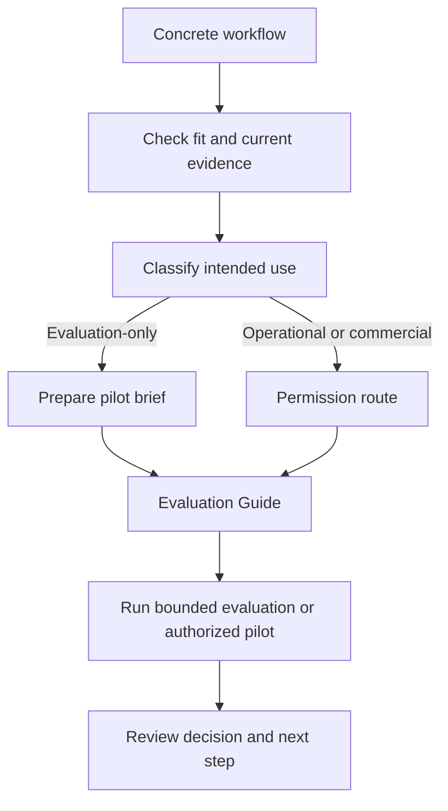

<!--
© Artur Czarnecki. All rights reserved.
Intergrax is source-available under the Intergrax Evaluation and Collaboration License 1.0.
See LICENSE for permitted evaluation, collaboration, and contribution use.
-->

# Partners and Pilots

Intergrax is **source-available** and under **active R&D**. LKW is the **Primary Product Proof**, classified as **Backend Product Alpha / MVP**, and remains **PARTIAL**.

A partner discussion or pilot name does **not** grant production, commercial, hosting, redistribution, or endorsement rights. [LICENSE](../../../LICENSE) is legally authoritative.

This guide answers whether a concrete workflow justifies a bounded pilot or design-partner discussion and what to prepare. It is not a capability catalog, provider roadmap, or generic evaluation guide.

Primary audience: a partner, integrator, or design partner with a concrete workflow to evaluate or a bounded pilot to propose.

---

## At a glance

**Primary next action:** [prepare the pilot brief](#pilot-brief) before starting a discussion.

| Question | Answer |
|----------|--------|
| Strongest current engagement | Governed private knowledge workflow using LKW |
| Partner fit | One concrete workflow, identifiable users, known data, boundaries, evidence needs, and willingness to evaluate |
| Current evidence | [PROOFS](../proofs/PROOFS.md) |
| Evaluation route | [Evaluation Guide](../builders/EVALUATION_GUIDE.md) |
| Builder route | [Builder Quick Start](../builders/BUILDER_QUICKSTART.md) |
| Permission route | [Collaboration](COLLABORATION.md) and [LICENSE](../../../LICENSE) |
| Contact | [jakbu.czarnecki.83@gmail.com](mailto:jakbu.czarnecki.83@gmail.com) |

---

## Partner qualification sequence

1. Confirm the concrete workflow and identifiable users.
2. Check workflow fit and current evidence in [USE_CASES](../overview/USE_CASES.md) and [PROOFS](../proofs/PROOFS.md).
3. Classify the intended activity as evaluation-only or operational.
4. Prepare the pilot brief.
5. Start the appropriate evaluation or permission discussion.

---

## Partner decision flow

Labels such as **pilot**, **sandbox**, **test**, or **proof of concept** do **not** determine permission status. Actual activity and the terms of [LICENSE](../../../LICENSE) control.

---

## Who is a good fit

| Partner characteristic | Stable engagement type | Starting owner |
|------------------------|------------------------|----------------|
| Controlled knowledge workflow with identifiable users | **Private governed knowledge** — strongest current product-aligned discussion | LKW path and [PROOFS](../proofs/PROOFS.md) |
| One specialized AI application to compose | **Specialized AI application** — architecture and builder-fit discussion | [Builder Quick Start](../builders/BUILDER_QUICKSTART.md), then [Build With Intergrax](../builders/BUILD_WITH_INTERGRAX.md) |
| Need for inspectable outcomes or controlled integration | **Evidence / integration workflow** — bounded technical discussion where evidence exists | [PROOFS](../proofs/PROOFS.md) and [Evaluation Guide](../builders/EVALUATION_GUIDE.md) |
| Question about one reusable capability | **Platform capability evaluation** — capability-specific evaluation | [PROOFS](../proofs/PROOFS.md) and [Evaluation Guide](../builders/EVALUATION_GUIDE.md) |

These are stable engagement types, not guaranteed active programs. Current capability truth belongs to [PROOFS](../proofs/PROOFS.md). Not every proposal will be accepted; fit depends on workflow clarity, scope, evidence, and current boundaries.

---

## Engagement types

The types above describe how to discuss a workflow, not a provider or capability status catalog. If a capability example is relevant, treat it as a bounded example and verify its current status in [PROOFS](../proofs/PROOFS.md).

---

## Evaluation or operational pilot?

### Evaluation-only pilot

An evaluation-only pilot stays **isolated and non-production** and is solely for **Evaluation** under [LICENSE](../../../LICENSE):

- synthetic or appropriately anonymized test data;
- no real customer-facing service;
- no ongoing operational business process;
- no replacement of a production tool.

**Evaluation Participants** may include employees, contractors, advisers, and technical reviewers acting solely for Evaluation. The activity remains subject to the exact terms of [LICENSE](../../../LICENSE).

### Operational or production pilot

The following normally place the activity outside the public evaluation grant:

- real operational users or real customers;
- production data;
- customer-facing output;
- ongoing business process;
- replacement of an operational tool;
- hosting or SaaS;
- paid or commercial product integration.

**Explicit written permission or a separate agreement is required before the activity starts.** Contacting the maintainer does not grant permission.

---

## Pilot workflow

1. **Check fit** — Review [USE_CASES](../overview/USE_CASES.md) and [PROOFS](../proofs/PROOFS.md).
2. **Describe the workflow** — Name users and data or knowledge sources.
3. **Classify intended use** — Evaluation-only or operational/production.
4. **Define scope and evidence** — State allowed actions, forbidden actions, approvals, and evidence.
5. **Prepare the environment** — Isolated evaluation setup or permission route.
6. **Run the bounded evaluation or authorized pilot** — Capture completed tasks and evidence.
7. **Review outcomes** — Decide whether to continue, revise, or stop.

---

## Pilot brief

Prepare a concise brief that includes:

- concrete user workflow;
- intended users and roles;
- knowledge and data sources;
- production-data status;
- allowed actions;
- forbidden actions;
- human approvals;
- required evidence and citations;
- environment and deployment assumptions;
- success criteria;
- repeated-use criteria;
- integration requirements;
- production or commercial intent;
- desired decision after the pilot.

---

## Success review

After the pilot, review:

- useful task completion;
- evidence and citation correctness;
- policy and permission behavior;
- setup repeatability;
- restart and recovery behavior where applicable;
- user trust;
- repeated use;
- blockers;
- whether further development is justified.

Do not treat a successful pilot as proof of universal performance or production readiness.

---

## What is not included automatically

A partner discussion or pilot does **not** automatically include production rights, commercial rights, hosting rights, redistribution rights, exclusivity, endorsement, SLA, support, certification, compliance approval, feature acceptance, or release-date commitment.

---

## Start a discussion

**Email:** [jakbu.czarnecki.83@gmail.com](mailto:jakbu.czarnecki.83@gmail.com)

Start the discussion with a completed or substantially prepared pilot brief. Before contacting, review:

- [docs/project/overview/USE_CASES.md](../overview/USE_CASES.md) — workflow fit;
- [docs/project/overview/ROADMAP.md](../overview/ROADMAP.md) — public outcome direction;
- [docs/project/proofs/PROOFS.md](../proofs/PROOFS.md) — current evidence status;
- [docs/project/builders/EVALUATION_GUIDE.md](../builders/EVALUATION_GUIDE.md) — bounded evaluation method;
- [docs/project/builders/BUILDER_QUICKSTART.md](../builders/BUILDER_QUICKSTART.md) — builder entry;
- [docs/project/builders/BUILD_WITH_INTERGRAX.md](../builders/BUILD_WITH_INTERGRAX.md) — composition planning;
- [docs/project/community/COLLABORATION.md](COLLABORATION.md) — permission and contribution routes;
- [LICENSE](../../../LICENSE) — legally authoritative terms.
