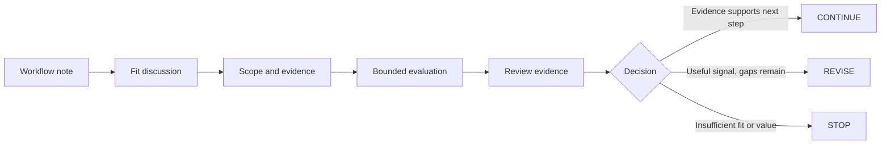

<!--
© Artur Czarnecki. All rights reserved.
Intergrax is source-available under the Intergrax Evaluation and Collaboration License 1.0.
See LICENSE for permitted evaluation, collaboration, and contribution use.
-->

# Partners and Pilots

If your team runs a **private or controlled knowledge workflow** — approved sources, grounded answers, explicit access boundaries, source and evidence traceability, reviewable execution, and repeatability where it matters — a bounded pilot can answer a concrete decision question:

**Can Intergrax make this workflow useful, controlled, and reviewable enough to justify deeper adoption or integration?**

That is the purpose of a partner or design-partner discussion: not a generic product tour, but a focused evaluation of one real workflow against current evidence and boundaries.

Intergrax is strongest today at **governed private knowledge workflows** where teams need combinations of approved knowledge, grounded results, explicit access boundaries, evidence traceability, and reviewable execution. LKW is the **Active reference product** (**Backend Product Alpha / MVP**, **PARTIAL**). Not every listed capability is fully production-qualified; a pilot is how you judge fit for your specific workflow.

Primary audience: a CTO, partner, integrator, or design partner with one concrete workflow to evaluate.

---

## Bring one real workflow

A useful starting point is simple:

- **one team** with an identifiable domain owner;
- **one concrete knowledge-intensive workflow** (not a platform wish list);
- a clear picture of what information or actions the workflow uses today; and
- a stated problem — why the current approach is insufficient.

You do not need a completed pilot brief for the first conversation. Send **3–5 sentences** covering who the user or team is, what workflow they want to improve, what information or actions are involved, why the current approach falls short, and what result would make an evaluation worthwhile.

**Email:** [jakbu.czarnecki.83@gmail.com](mailto:jakbu.czarnecki.83@gmail.com)

---

## What a pilot can help you learn

A bounded pilot is an evaluation, not a guarantee. Appropriate decision questions include:

- Do representative users get **useful grounded results** from approved sources?
- Are **expected source references and evidence** present?
- Are **forbidden or unauthorized sources excluded** as designed?
- Is the resulting behavior **reviewable** by a domain owner or reviewer?
- Is setup and execution **repeatable enough** for the evaluated workflow?
- Do users judge the result **useful enough to reuse**?
- Are **remaining gaps** clear enough to decide whether deeper investment makes sense?

Answers to these questions — with evidence — are the pilot's value. They support a decision; they do not automatically prove production readiness or universal performance.

---

## Recommended starting shape: Governed Knowledge Pilot

**Governed Knowledge Pilot** is a recommended bounded evaluation shape, not a formal commercial program, product tier, or guaranteed offer. Not every proposal will be accepted; fit depends on workflow clarity, scope, evidence, and current boundaries.

Conceptual shape:

```text
one team
+ one concrete knowledge-intensive workflow
+ one workspace / bounded environment
+ representative approved knowledge
+ explicit access and evidence requirements
+ representative questions or tasks
→ bounded evaluation
→ evidence
→ CONTINUE / REVISE / STOP
```

This aligns with Intergrax's **strongest current fit**: private governed knowledge workspaces where approved sources, grounded answers, access boundaries, and reviewability matter. Other engagement types — specialized AI applications, evidence-aware integration, platform capability evaluation — are possible; see [USE_CASES](../overview/USE_CASES.md) for fit classes.

---

## What Intergrax brings

Within current boundaries, Intergrax can provide:

- **bounded workflow and technical fit assessment** against current evidence;
- **scoped configuration or implementation** for the agreed evaluation where appropriate;
- **governed boundary definition** — allowed actions, forbidden actions, and approval points;
- **reviewable evidence and proof artifacts** where supported;
- **documented gap assessment** — what worked, what did not, and what remains missing; and
- an **end-of-pilot decision summary**.

This does not include free custom development, SLA, production support, certification, implementation timeline commitments, commercial deployment, or custom features without agreement.

---

## What the partner brings

Keep the partner side lightweight:

- **one concrete workflow** with a clear current-state description;
- **identifiable users** or a domain owner who can judge results;
- **representative authorized data, knowledge, or integration access** within agreed boundaries;
- **feedback** on fit, evidence, and gaps during the evaluation;
- **one decision owner** accountable for the pilot outcome; and
- **agreed success criteria** — what would make the evaluation worthwhile.

The first contact requires only the short workflow note above. A detailed pilot brief comes after initial fit discussion.

---

## Pilot flow

One primary path from first contact to decision:



1. **Workflow note** — Send 3–5 sentences describing users, workflow, problem, and desired result.
2. **Fit discussion** — Confirm workflow clarity, mutual interest, and current evidence fit.
3. **Scope and evidence** — Define allowed and forbidden actions, approvals, environment, and what evidence the evaluation must produce. Complete a concise pilot brief at this stage if proceeding.
4. **Bounded evaluation** — Run an evaluation-only pilot under [LICENSE](../../../LICENSE), or an authorized pilot if operational activity requires explicit permission.
5. **Review evidence** — Assess outcomes against agreed success criteria.
6. **Decision** — CONTINUE, REVISE, or STOP.

Labels such as **pilot**, **sandbox**, **test**, or **proof of concept** do **not** determine permission status. Actual activity and the terms of [LICENSE](../../../LICENSE) control.

---

## How success is judged

After the bounded evaluation, review:

- useful task completion on representative questions or tasks;
- evidence and citation correctness;
- policy and permission behavior — unauthorized sources excluded as designed;
- setup repeatability;
- restart and recovery behavior where applicable;
- user or domain-owner judgment of usefulness; and
- clarity of blockers and gaps.

Do not treat a successful pilot as proof of universal performance, commercial validation, or production readiness.

---

## CONTINUE / REVISE / STOP

A pilot ends with a **decision**, not automatic successful implementation. Valid outcomes:

| Outcome | Meaning |
|---------|---------|
| **CONTINUE** | Evidence justifies deeper productization, integration, or permission discussion |
| **REVISE** | Useful signal exists but blockers or gaps need another bounded step |
| **STOP** | Workflow fit, value, or evidence is insufficient |

A stopped pilot can still be a valid and useful result.

---

## Evaluation vs operational use

### Evaluation-only pilot

An evaluation-only pilot stays **isolated and non-production** and is solely for **Evaluation** under [LICENSE](../../../LICENSE):

- synthetic or appropriately anonymized test data;
- no real customer-facing service;
- no ongoing operational business process; and
- no replacement of a production tool.

**Evaluation Participants** may include employees, contractors, advisers, and technical reviewers acting solely for Evaluation. The activity remains subject to the exact terms of [LICENSE](../../../LICENSE).

### Operational or production pilot

The following normally place the activity **outside** the public evaluation grant:

- real operational users or real customers;
- production data;
- customer-facing output;
- ongoing business process;
- replacement of an operational tool;
- hosting or SaaS; or
- paid or commercial product integration.

**Explicit written permission or a separate agreement is required before the activity starts.** Contacting the maintainer does not grant permission.

---

## Permission and collaboration boundaries

Intergrax is **source-available** and under **active R&D**. A partner discussion or pilot name does **not** grant production, commercial, hosting, redistribution, or endorsement rights. [LICENSE](../../../LICENSE) is legally authoritative.

A partner discussion or pilot does **not** automatically include production rights, commercial rights, hosting rights, redistribution rights, exclusivity, endorsement, SLA, support, certification, compliance approval, feature acceptance, or release-date commitment.

For permission requests, contribution routes, and security reporting, see [Collaboration](COLLABORATION.md).

---

## Start a discussion

**Email:** [jakbu.czarnecki.83@gmail.com](mailto:jakbu.czarnecki.83@gmail.com)

Send **3–5 sentences** describing:

- user or team;
- workflow;
- current problem;
- information or actions involved; and
- desired result.

You may contact first. You do not need a completed pilot brief or a long document review before the initial conversation.

After mutual fit is established, a concise pilot brief should cover: concrete user workflow; intended users and roles; knowledge and data sources; production-data status; allowed and forbidden actions; human approvals; required evidence and citations; environment and deployment assumptions; success criteria; repeated-use criteria; integration requirements; production or commercial intent; and desired decision after the pilot.

---

## Optional technical due diligence

These documents support self-service evaluation and deeper technical review. None are required before first contact.

| Topic | Document |
|-------|----------|
| Workflow fit classes | [USE_CASES](../overview/USE_CASES.md) |
| Current evidence status | [PROOFS](../proofs/PROOFS.md) |
| Bounded evaluation method | [Evaluation Guide](../builders/EVALUATION_GUIDE.md) |
| Builder entry | [Builder Quick Start](../builders/BUILDER_QUICKSTART.md) |
| Composition planning | [Build With Intergrax](../builders/BUILD_WITH_INTERGRAX.md) |
| Public outcome direction | [ROADMAP](../overview/ROADMAP.md) |
| Permission and contribution | [Collaboration](COLLABORATION.md) |
| Legally authoritative terms | [LICENSE](../../../LICENSE) |

---

## At a glance

| Question | Answer |
|----------|--------|
| Strongest current engagement | Governed private knowledge workflow using LKW |
| Recommended pilot shape | Governed Knowledge Pilot (bounded evaluation, not a formal program) |
| Partner fit | One concrete workflow, identifiable users, authorized data, boundaries, evidence needs, decision owner |
| Current evidence | [PROOFS](../proofs/PROOFS.md) |
| Permission route | [Collaboration](COLLABORATION.md) and [LICENSE](../../../LICENSE) |
| Contact | [jakbu.czarnecki.83@gmail.com](mailto:jakbu.czarnecki.83@gmail.com) |
