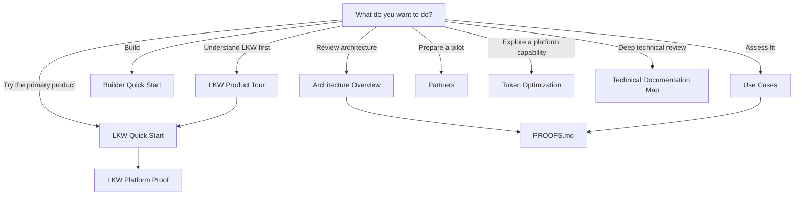

<!--
© Artur Czarnecki. All rights reserved.
Intergrax is source-available under the Intergrax Evaluation and Collaboration License 1.0.
See LICENSE for permitted evaluation, collaboration, and contribution use.
-->

# Intergrax Public Documentation Map

Start here if you want to understand Intergrax, evaluate proof paths, or find the right next document — without reading internal implementation plans or maintainer controls first.

---

## Start by what you want to do



The primary product route leads from orientation to execution
and optionally to deeper proof.
Other branches serve distinct reader intents and do not compete
with Try LKW as the repository’s primary product action.

| I want to… | Primary action |
|------------|----------------|
| Try LKW | [LKW Quick Start](../product/lkw/QUICKSTART.md) |
| Understand LKW without running it | [LKW Product Tour](../product/lkw/LKW_PRODUCT_TOUR.md) |
| Inspect bounded LKW technical evidence | [LKW Platform Proof](../proofs/LKW_PLATFORM_PROOF.md) |
| Start building with Intergrax | [Builder Quick Start](../builders/BUILDER_QUICKSTART.md) |
| Plan a deeper build | [BUILD_WITH_INTERGRAX](../builders/BUILD_WITH_INTERGRAX.md) |
| Review as an architect or platform engineer | [Architecture Overview](../architecture/ARCHITECTURE_OVERVIEW.md) |
| Assess fit as a CTO, product lead or technical buyer | [Use Cases](../overview/USE_CASES.md) |
| Explore a partner, integrator or design-partner path | [Partners](PARTNERS.md) |
| Explore Token Optimization | [Token Optimization](../capabilities/token_optimization/README.md) |
| Check current proof status | [PROOFS.md](../proofs/PROOFS.md) |
| Compare Intergrax with common approaches | [Where Intergrax fits](../overview/WHY_INTERGRAX.md#where-intergrax-fits) |
| Run an evaluation | [Evaluation Guide](../builders/EVALUATION_GUIDE.md) |
| Understand permission boundaries | [Collaboration](COLLABORATION.md) and [LICENSE](../../../LICENSE) |
| Perform deep technical review | [Technical Documentation Map](../technical/DOCUMENTATION_MAP.md) |
| Understand why Intergrax exists | [WHY_INTERGRAX](../overview/WHY_INTERGRAX.md) |
| See where the product-validation program is heading | [Roadmap](../overview/ROADMAP.md) |
| Read general first-contact questions | [FAQ](../overview/FAQ.md) |
| Contribute or provide technical feedback | [Collaboration](COLLABORATION.md) |
| Read legally authoritative terms | [LICENSE](../../../LICENSE) |

---

## Featured proof paths

### Local Knowledge Workspace

**Primary product proof**

Local Knowledge Workspace (LKW) is the current primary product-development and platform-validation program. The reader route is:

```text
Product Tour
→ Quick Start
→ Platform Proof
```

Start with the [LKW Product Tour](../product/lkw/LKW_PRODUCT_TOUR.md) to understand the experience without running anything. From there, choose the [LKW Quick Start](../product/lkw/QUICKSTART.md) to run the supported indexed path or the [LKW Platform Proof](../proofs/LKW_PLATFORM_PROOF.md) to inspect bounded technical evidence.

### Token Optimization Engine

**Featured platform-capability proof**

Intergrax includes a deterministic, policy-governed Token Optimization Engine with protected-region validation, receipts, cache-stable prompt assembly, cache-aware execution, and bounded proof paths.

[Open the Token Optimization Engine guide](../capabilities/token_optimization/README.md)

---

## Public documents

| Document | Purpose |
|----------|---------|
| [README](../../../README.md) | First-contact landing — problem, value, quick start, maturity snapshot |
| [WHY_INTERGRAX](../overview/WHY_INTERGRAX.md) | Problem, value, audience, category fit and fair comparison with common approaches |
| [ARCHITECTURE_OVERVIEW](../architecture/ARCHITECTURE_OVERVIEW.md) | Public architecture overview — responsibility boundaries and system flow |
| [Builder Quick Start](../builders/BUILDER_QUICKSTART.md) | First bounded builder orientation and progressive-disclosure route |
| [BUILD_WITH_INTERGRAX](../builders/BUILD_WITH_INTERGRAX.md) | Deeper builder route selection and planning |
| [Evaluation Guide](../builders/EVALUATION_GUIDE.md) | Bounded 5–60 minute evaluation paths |
| [Use Cases](../overview/USE_CASES.md) | Concrete fit map: current strongest use case, bounded fits, planned validation and not-fit boundaries |
| [Partners](PARTNERS.md) | Partner fit, evaluation-versus-operational pilot boundary, pilot preparation and success review |
| [FAQ](../overview/FAQ.md) | Concise first-contact questions |
| [Roadmap](../overview/ROADMAP.md) | Outcome-gated product-validation direction: now, next and later without implementation task IDs |
| [Collaboration](COLLABORATION.md) | Evaluation feedback, contribution, pilot-discussion, permission-request and security routes |
| [LICENSE](../../../LICENSE) | Legal evaluation and collaboration terms |
| [LKW Product Tour](../product/lkw/LKW_PRODUCT_TOUR.md) | Non-executable product-first walkthrough of the supported LKW experience and boundaries |
| [LKW Quick Start](../product/lkw/QUICKSTART.md) | Supported executable indexed LKW product evaluation |
| [LKW Platform Proof](../proofs/LKW_PLATFORM_PROOF.md) | Guided LKW product proof path |
| [Token Optimization guide](../capabilities/token_optimization/README.md) | Token Optimization engine overview and proof catalog |
| [Intergrax Proofs](../proofs/PROOFS.md) | Public proof dashboard — status legend and verification paths |

Maintainer contracts and claim controls are intentionally excluded
from normal reader navigation and remain indexed
from docs/project/maintainers/public-adoption/README.md.

**Proof status legend:** see [Intergrax Proofs](../proofs/PROOFS.md#status-legend) (✅ IMPLEMENTED · 🧪 BOUNDED PROOF · 🟡 PARTIAL · 🗓️ PLANNED · ⛔ NOT CLAIMABLE).

---

## Technical documentation

Developers, architects,
and deep technical reviewers should use the technical map — not this public map:

[Technical Documentation Map](../technical/DOCUMENTATION_MAP.md)

---

## Current maturity boundary

- Intergrax is **source-available** and under **active R&D**.
- LKW is **Backend Product Alpha / MVP**.
- Token Optimization has **implemented mechanisms** and **bounded proof paths**.
- Real-user and commercial validation are **incomplete**.
- Proof status and claim boundaries: [Intergrax Proofs](../proofs/PROOFS.md).
