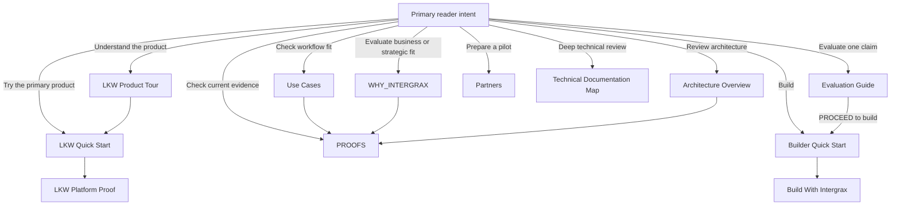

<!--
© Artur Czarnecki. All rights reserved.
Intergrax is source-available under the Intergrax Evaluation and Collaboration License 1.0.
See LICENSE for permitted evaluation, collaboration, and contribution use.
-->

# Intergrax Public Documentation Map

Use this map when you know what you want to do but not which document to open.

| Gateway | Role |
| --- | --- |
| [README](../../../README.md) | First contact — what Intergrax is, persona paths, grouped Platform Map, LKW product discovery |
| **This map** | Intent-based fallback router — find the right next document by goal |
| [Architecture Overview](../architecture/ARCHITECTURE_OVERVIEW.md) | Project-level architectural mental model |
| [Runtime architecture hub](../architecture/intergrax_runtime_architecture.md) | Complete technical index — 24 domain pairs + cross-layer feature pairs |

**First contact and platform discovery** stay in the [README](../../../README.md#explore-the-intergrax-platform) — including the grouped Platform Map and documentation-layer guide. This file routes by **reader intent**; it does not duplicate the full platform index or persona table.

---

## Start by what you want to do



The primary product route leads from orientation to execution
and optionally to deeper proof.
Other branches serve distinct reader intents and do not compete
with Try LKW as the repository’s primary product action.

| I want to… | Primary action |
|------------|----------------|
| Try LKW | [LKW Quick Start](../../../applications/local_workspace_application/docs/product/QUICKSTART.md) |
| Understand LKW without running it | [LKW Product Tour](../../../applications/local_workspace_application/docs/product/LKW_PRODUCT_TOUR.md) |
| Inspect bounded LKW technical evidence | [LKW Platform Proof](../../../applications/local_workspace_application/docs/proof/LKW_PLATFORM_PROOF.md) |
| Start building with Intergrax | [Builder Quick Start](../builders/BUILDER_QUICKSTART.md) |
| Plan a deeper build | [BUILD_WITH_INTERGRAX](../builders/BUILD_WITH_INTERGRAX.md) |
| Review as an architect or platform engineer | [Architecture Overview](../architecture/ARCHITECTURE_OVERVIEW.md) — then [Platform Map](../../../README.md#explore-the-intergrax-platform) for grouped domain exploration |
| Assess fit as a CTO, product lead or technical buyer | [Use Cases](../overview/USE_CASES.md) |
| Evaluate as an investor, business decision maker or strategic evaluator | [WHY_INTERGRAX](../overview/WHY_INTERGRAX.md) — then [PROOFS](../proofs/PROOFS.md) for evidence |
| Explore a partner, integrator or design-partner path | [Partners](PARTNERS.md) |
| Explore Governed Execution | [Governed Execution](../architecture/GOVERNED_EXECUTION.md) |
| Explore Token Optimization | [Token Optimization](../capabilities/token_optimization/README.md) |
| Explore strategic future directions | [Multiplayer AI](../capabilities/architecture/MULTIPLAYER_AI.md) · [Platform Extensibility / Plugins](../architecture/PLATFORM_PLUGINS.md) · [Agent Marketplace](../overview/AGENT_MARKETPLACE.md) — see [Strategic directions](#strategic-directions) below |
| Check current proof status | [docs/project/proofs/PROOFS.md](../proofs/PROOFS.md) |
| Compare Intergrax with common approaches | [Where Intergrax fits](../overview/WHY_INTERGRAX.md#where-intergrax-fits) |
| Compare Intergrax with modern agent/platform alternatives | [Alternatives and trade-offs](../overview/ALTERNATIVES_AND_TRADEOFFS.md) |
| Run an evaluation | [Evaluation Guide](../builders/EVALUATION_GUIDE.md) |
| Understand permission boundaries | [Collaboration](COLLABORATION.md) and [LICENSE](../../../LICENSE) |
| Perform deep technical review | [Technical Documentation Map](../technical/DOCUMENTATION_MAP.md) · [Runtime architecture hub](../architecture/intergrax_runtime_architecture.md) (24-domain index) |
| Understand why Intergrax exists | [WHY_INTERGRAX](../overview/WHY_INTERGRAX.md) |
| See where the product-validation program is heading | [Roadmap](../overview/ROADMAP.md) |
| Read general first-contact questions | [FAQ](../overview/FAQ.md) |
| Contribute or provide technical feedback | [Collaboration](COLLABORATION.md) |
| Read legally authoritative terms | [LICENSE](../../../LICENSE) |

---

## Documentation layers

Use the right layer for your question — do not start in maintainer plans, satellites, or ADRs unless you need implementation depth.

| Layer | Role | Entry |
| --- | --- | --- |
| **First contact** | Problem, paths, platform map, maturity snapshot | [README](../../../README.md) |
| **Intent routing** (this map) | Find docs by what you want to do | This file |
| **Architecture mental model** | Responsibility boundaries and governed execution flow | [Architecture Overview](../architecture/ARCHITECTURE_OVERVIEW.md) |
| **Domain architecture** | What each platform area should do | `docs/project/architecture/<DOMAIN>.md` — see [Platform Map](../../../README.md#explore-the-intergrax-platform) |
| **Feature architecture** | Cross-layer capabilities | `docs/project/capabilities/architecture/<FEATURE>.md` — index: [capabilities README](../capabilities/README.md) |
| **Satellites** | Extended engineering registers | Load on demand from domain or feature hubs — not public first-contact |
| **Technical guides** | How to configure, build, extend, or operate | [Technical guides](../technical/guides/README.md) |
| **Plans / ADR / proofs** | Implementation status, decisions, bounded evidence | [PROOFS](../proofs/PROOFS.md) · [Technical Documentation Map](../technical/DOCUMENTATION_MAP.md) |

```text
README → domain / feature architecture → optional satellite
       → guides (how-to)
       → proofs (evidence)
```

---

## Current product / proof paths

Bounded product and capability proof routes — not a second proof dashboard. For the full status legend and evidence inventory, use [PROOFS](../proofs/PROOFS.md). For first-contact LKW context, see the [README LKW section](../../../README.md#local-knowledge-workspace-lkw).

### Local Knowledge Workspace

**Primary Product Proof** — **Backend Product Alpha / MVP** — **PARTIAL**

Local Knowledge Workspace (LKW) is the current primary product-development and platform-validation program. The reader route is:

```text
Product Tour
→ Quick Start
→ Platform Proof
```

Start with the [LKW Product Tour](../../../applications/local_workspace_application/docs/product/LKW_PRODUCT_TOUR.md) to understand the experience without running anything. From there, choose the [LKW Quick Start](../../../applications/local_workspace_application/docs/product/QUICKSTART.md) to run the supported indexed path or the [LKW Platform Proof](../../../applications/local_workspace_application/docs/proof/LKW_PLATFORM_PROOF.md) to inspect bounded technical evidence.

### Governed Execution

**Platform capability — implemented mechanisms; consolidation / qualification ongoing**

Intergrax provides reusable policy and approval enforcement around agent decisions, tool and action boundaries, meaningful side effects, canonical HITL, and plugin-extensible policy rules. Meaningful enforcement slices exist on bounded paths; a dedicated accepted public Governed Execution proof is **not yet established**.

[Open the Governed Execution architecture](../architecture/GOVERNED_EXECUTION.md)

### Token Optimization Engine

**Featured platform-capability proof**

Intergrax includes a deterministic, policy-governed Token Optimization Engine with protected-region validation, receipts, cache-stable prompt assembly, cache-aware execution, and bounded proof paths.

[Open the Token Optimization Engine guide](../capabilities/token_optimization/README.md)

---

## Strategic directions

Future ecosystem and platform directions — **not** current product proofs and **not** equivalent to shipped platform domains. These remain lower priority than accepted evidence above. Compact status also appears in the [README platform capabilities table](../../../README.md#platform-capabilities-and-directions).

### Multiplayer AI

**Future collaborative-AI direction — architecture concept**

[Open the Multiplayer AI architecture concept](../capabilities/architecture/MULTIPLAYER_AI.md)

### Platform Extensibility / Plugins

**Future platform-extensibility direction — architecture concept**

[Open the Platform Extensibility / Plugins architecture](../architecture/PLATFORM_PLUGINS.md)

### Agent Marketplace

**Future ecosystem direction — product and architecture concept**

The Agent Marketplace describes a governed distribution layer for reusable
governed agents — built on Agent Distribution, trust verification, application
binding, immutable materialization, RuntimeRevision activation, AgentRegistry,
and Nexus capability routing. It is **not** a shipped public marketplace,
publisher portal, or commercial catalog today.

[Open the Agent Marketplace concept and reference architecture](../overview/AGENT_MARKETPLACE.md)

---

## Named public documents

Use the [intent table](#start-by-what-you-want-to-do) first. This quick index helps when you already know a document name.

| Document | Purpose |
|----------|---------|
| [README](../../../README.md) | First-contact landing — problem, value, quick start, maturity snapshot |
| [WHY_INTERGRAX](../overview/WHY_INTERGRAX.md) | Problem, value, audience, category fit and fair comparison with common approaches |
| [ALTERNATIVES_AND_TRADEOFFS](../overview/ALTERNATIVES_AND_TRADEOFFS.md) | Named modern agent/platform alternatives — decision trade-offs, not a feature scorecard |
| [ARCHITECTURE_OVERVIEW](../architecture/ARCHITECTURE_OVERVIEW.md) | Public architecture overview — responsibility boundaries and system flow |
| [GOVERNED_EXECUTION](../architecture/GOVERNED_EXECUTION.md) | Governed Execution platform capability — policy definition, enforcement, HITL, and maturity boundary |
| [Builder Quick Start](../builders/BUILDER_QUICKSTART.md) | First bounded builder orientation and progressive-disclosure route |
| [BUILD_WITH_INTERGRAX](../builders/BUILD_WITH_INTERGRAX.md) | Deeper application composition planning |
| [Evaluation Guide](../builders/EVALUATION_GUIDE.md) | Bounded evaluation method for one selected claim/workflow using a pinned revision, canonical path, evidence and PROCEED / DEFER / STOP decision |
| [Use Cases](../overview/USE_CASES.md) | Workflow fit using strongest current fit, bounded technical fit, not yet proven and not a fit boundaries |
| [Partners](PARTNERS.md) | Partner fit, evaluation-versus-operational pilot boundary, pilot preparation and success review |
| [FAQ](../overview/FAQ.md) | Concise first-contact questions |
| [Roadmap](../overview/ROADMAP.md) | Outcome-gated direction across repeatability, complete intended outcome, real-user validation, evidence-driven expansion and hardening/packaging |
| [Collaboration](COLLABORATION.md) | Evaluation feedback, contribution, pilot-discussion, permission-request and security routes |
| [LICENSE](../../../LICENSE) | Legal evaluation and collaboration terms |
| [LKW Product Tour](../../../applications/local_workspace_application/docs/product/LKW_PRODUCT_TOUR.md) | Non-executable product-first walkthrough of the supported LKW experience and boundaries |
| [LKW Quick Start](../../../applications/local_workspace_application/docs/product/QUICKSTART.md) | Supported executable indexed LKW product evaluation |
| [LKW Platform Proof](../../../applications/local_workspace_application/docs/proof/LKW_PLATFORM_PROOF.md) | Guided LKW product proof path |
| [Token Optimization guide](../capabilities/token_optimization/README.md) | Token Optimization engine overview and proof catalog |
| [Agent Marketplace concept](../overview/AGENT_MARKETPLACE.md) | Future ecosystem direction — governed agent distribution concept and reference architecture (not a shipped product) |
| [Intergrax Proofs](../proofs/PROOFS.md) | Current evidence status / public evidence dashboard — status legend and verification paths |

Maintainer contracts and claim controls are intentionally excluded
from normal reader navigation and remain indexed
from docs/project/maintainers/public-adoption/README.md.

**Proof status legend:** see [Intergrax Proofs](../proofs/PROOFS.md#status-legend) (✅ IMPLEMENTED · 🧪 BOUNDED PROOF · 🟡 PARTIAL · 🗓️ PLANNED · ⛔ NOT CLAIMABLE).

---

## Technical documentation

Developers, architects,
and deep technical reviewers should use the technical map — not this public map:

[Technical Documentation Map](../technical/DOCUMENTATION_MAP.md)

---

## Current maturity boundary

- Intergrax is **source-available** and under **active R&D**.
- LKW is **Backend Product Alpha / MVP**.
- Governed Execution has **implemented mechanisms** on bounded paths; **consolidation / qualification ongoing**; no dedicated accepted public proof yet.
- Token Optimization has **implemented mechanisms** and **bounded proof paths**.
- Real-user and commercial validation are **incomplete**.
- Proof status and claim boundaries: [Intergrax Proofs](../proofs/PROOFS.md).
