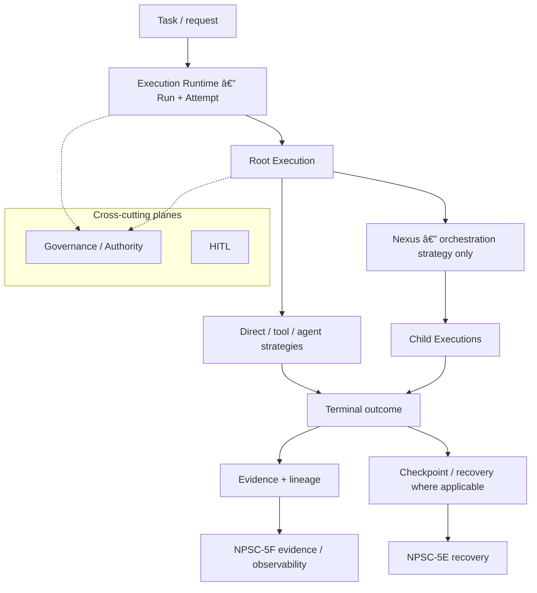

# Execution Engine — Maintainer Hub

**Classification:** `MAINTAINER_HUB`
**Status:** Enterprise-certified · frozen for current platform stage · post-freeze gap audit **PASS** ([`EXECUTION_ENGINE_POST_FREEZE_EXHAUSTIVE_GAP_AUDIT.md`](../qualification/EXECUTION_ENGINE_POST_FREEZE_EXHAUSTIVE_GAP_AUDIT.md))
**Audience:** Maintainers, qualification operators, Cursor implementation sessions
**Canonical parent:** — (hub)
**Related qualification:** [`EE_FINAL_CROSS_SESSION_ENTERPRISE_EXECUTION_ENGINE_CERTIFICATION.md`](../qualification/EE_FINAL_CROSS_SESSION_ENTERPRISE_EXECUTION_ENGINE_CERTIFICATION.md) · post-freeze reconciliation [`EXECUTION_ENGINE_AND_DECISION_DOCUMENTATION_RECONCILIATION.md`](../qualification/EXECUTION_ENGINE_AND_DECISION_DOCUMENTATION_RECONCILIATION.md)
**Last architecture reconciliation:** 2026-09-14 (EE-POST-FREEZE-FINAL)

**This document does not own detailed execution semantics.** Normative cross-domain semantics remain in [`UNIFIED_EXECUTION_ARCHITECTURE.md`](../../architecture/UNIFIED_EXECUTION_ARCHITECTURE.md) (`META_ARCHITECTURE`). Domain lifecycle, topology, recovery, evidence, and qualification proofs remain with their listed canonical owners below.

A documentation consolidation commit **does not reopen** frozen production semantics. Any change that contradicts frozen architecture or freeze records requires a separate architecture decision.

**Maintainer status (DS-E2E-15J closure):** Execution Engine architecture remains **frozen** for enterprise semantics; **canonical runtime** and **Decision System integration** are **Docker E2E qualified** via [`DS-E2E-15J-CANONICAL-EXECUTION-DOCKER-E2E-QUALIFICATION.md`](../qualification/DS-E2E-15J-CANONICAL-EXECUTION-DOCKER-E2E-QUALIFICATION.md) and combined system closure in [`DS-E2E-15J-DOCKER-E2E-SYSTEM-QUALIFICATION.md`](../qualification/DS-E2E-15J-DOCKER-E2E-SYSTEM-QUALIFICATION.md).

---

## 1. Purpose

This document is the **canonical maintainer entry point** for the Execution Engine area in Intergrax.

It answers:

| Question | Where this hub points |
| --- | --- |
| Where should I start? | Here, then the owning domain doc |
| Which document owns which part? | [Ownership map](#4-ownership-map) · [Ownership table](#5-canonical-ownership-table) |
| What is frozen / qualified? | [Qualification and freeze](#10-qualification-and-freeze) · [Freeze evidence map](#11-final-freeze--certification-evidence-map) |
| Where are the proofs? | Qualification records under `docs/project/maintainers/qualification/` |
| Where do I change configuration? | [Operator configuration](#12-operator-configuration) |

It does **not** replace implementation detail in UER, Nexus, NPSC planes, or qualification records.

### Start here (recommended reading order)

1. **This hub** — [`EXECUTION_ENGINE.md`](EXECUTION_ENGINE.md)
2. **Frozen enterprise map** — [`EXECUTION_ENGINE_FINAL_ENTERPRISE_ARCHITECTURE.md`](EXECUTION_ENGINE_FINAL_ENTERPRISE_ARCHITECTURE.md)
3. **Decision System (semantic layer inside Execution)** — [`DECISION_SYSTEM.md`](../../architecture/DECISION_SYSTEM.md)
4. **Ownership / identity / governance** — UEA, UER, [`GOVERNED_EXECUTION.md`](../../architecture/GOVERNED_EXECUTION.md), ownership model
5. **Recovery / evidence / observability** — NPSC-5E, NPSC-5F, [`OBSERVABILITY.md`](../../architecture/OBSERVABILITY.md)
6. **Qualification evidence** — EE-FINAL + [`EXECUTION_ENGINE_POST_FREEZE_EXHAUSTIVE_GAP_AUDIT.md`](../qualification/EXECUTION_ENGINE_POST_FREEZE_EXHAUSTIVE_GAP_AUDIT.md)

| Audience | Start with |
| --- | --- |
| Architect | FINAL_ENTERPRISE_ARCHITECTURE + UEA + DECISION_SYSTEM |
| Maintainer | This hub + domain owner doc for the plane you touch |
| Operator | Graceful shutdown model + production runbooks |
| Plugin developer | TOOLS + unified entry zero-bypass model |
| Auditor | Post-freeze gap audit + P0 bypass inventory + EE-FINAL certification |

### Navigation rule (do not start in the wrong place)

| Need | Start here |
| --- | --- |
| System-wide Execution orientation | **This hub** (`EXECUTION_ENGINE.md`) |
| Normative cross-domain semantics | [`UNIFIED_EXECUTION_ARCHITECTURE.md`](../../architecture/UNIFIED_EXECUTION_ARCHITECTURE.md) |
| Domain implementation contracts | Owning **canonical domain** architecture (see [documentation map](#13-canonical-documentation-map)) |
| Proof / freeze status | Relevant **qualification / freeze** record |

---

## 2. What “Execution Engine” means here

**Execution Engine** is the **maintainer-facing name** for the coordinated platform area that covers:

- Unified execution identity and tree semantics (UEA coordination)
- Run / Attempt / Execution lifecycle (UER)
- Orchestration topology scheduling when strategy requires it (Nexus)
- Governance, authority, and HITL interaction
- Child execution, multi-agent fan-out, and lineage / diagnostics
- Recovery (NPSC-5E), evidence / replay / observability (NPSC-5F)
- Tool side effects, scale / resilience mechanisms, and certification infrastructure

No single runtime class “is” the whole Engine; ownership is **partitioned by plane** (see below).

---

## 3. Canonical mental model

Compact identity hierarchy (normative detail: UEA §3):

```text
Task
  ↓
Run
  ↓
Attempt
  ↓
Execution
  ↓
Event
```

**Strategies** (how a root or child Execution is realized — do not collapse into “Nexus”):

| Strategy | Role at hub level |
| --- | --- |
| **Direct execution** | Simplest path; **does not require Nexus** (UEA-INV-008) |
| **Tool / provider execution** | Side-effect-capable work via tool plane |
| **Agent / delegated execution** | AgentEngine / UAEP below the Execution boundary |
| **Orchestration** | Validated topology; **Nexus** schedules **what Executes next** |

Normative identity, tree, and invariant semantics: [`UNIFIED_EXECUTION_ARCHITECTURE.md`](../../architecture/UNIFIED_EXECUTION_ARCHITECTURE.md).

---

## 4. Ownership map

Repository-aligned responsibility split (summary only):

```text
Decision          = WHAT
AD / Authority    = WHO
Governance        = WHETHER
Execution Runtime = lifecycle / HOW (Run, Attempt, Execution)
Nexus             = HOW / WHEN orchestration topology (when strategy is orchestration)
HITL              = human authority (decision) + lifecycle consequence (Execution / UER)
NPSC-5E           = recovery plane (retry, checkpoint, resume, partial recovery)
NPSC-5F           = evidence / durable facts, replay taxonomy, observability integration
```

Detailed MUST/MUST NOT rules live in domain owners — not duplicated here.

### Navigation / mental-model overview (not normative)

The diagram below is a **maintainer navigation aid**. For normative diagrams use [`UNIFIED_EXECUTION_ARCHITECTURE_DIAGRAMS.md`](../../architecture/UNIFIED_EXECUTION_ARCHITECTURE_DIAGRAMS.md) and domain diagram packs.



---

## 5. Canonical ownership table

| Capability | Canonical owner | What it owns | What it does not own |
| --- | --- | --- | --- |
| Unified Execution semantics (cross-domain) | [`UNIFIED_EXECUTION_ARCHITECTURE.md`](../../architecture/UNIFIED_EXECUTION_ARCHITECTURE.md) | Identity hierarchy, Execution Tree, cross-domain invariants, strategy rules | Run/Attempt API detail, Nexus algorithms, recovery policies |
| Execution Runtime | [`UNIFIED_EXECUTION_RUNTIME.md`](../../architecture/UNIFIED_EXECUTION_RUNTIME.md) | Run / Attempt lifecycle, execution coordination, boundary admission | Orchestration topology, governance policy content, durable recovery store semantics |
| Nexus | [`NEXUS_EXECUTION_FLOW.md`](../../architecture/NEXUS_EXECUTION_FLOW.md) | Orchestration control flow, scheduling child Executions, fan-out/fan-in at topology level | Universal entry for all workloads; Execution identity; governance decisions |
| Governance / approval | [`GOVERNED_EXECUTION.md`](../../architecture/GOVERNED_EXECUTION.md) · [`DECISION_APPROVAL_GOVERNANCE.md`](../../architecture/DECISION_APPROVAL_GOVERNANCE.md) | Whether actions may proceed; collaborative decision / approval semantics (domain-specific) | Execution lifecycle state machine; Nexus scheduling |
| Authority (WHO) | Governed Execution + platform authority contracts (UEA §12) | Effective authority envelope, child authority checkpoint | WHAT decision content; Nexus topology |
| Child Execution | UEA + UER + [`NPSC_5B_CROSS_SYSTEM_FANOUT_OWNERSHIP_RECONCILIATION.md`](NPSC_5B_CROSS_SYSTEM_FANOUT_OWNERSHIP_RECONCILIATION.md) | Child identity, boundary re-entry, fan-out ownership reconciliation | Agent step internals (UAEP) |
| Multi-agent / fan-out | [`NPSC_5_MULTI_AGENT_PRODUCTION_ARCHITECTURE.md`](NPSC_5_MULTI_AGENT_PRODUCTION_ARCHITECTURE.md) | NPSC-5 production planes (5A–5D) | Single-agent UAEP step loop |
| Lineage / diagnostics | [`DG_001_MULTI_AGENT_DIAGNOSTIC_LINEAGE_ARCHITECTURE_R1.md`](DG_001_MULTI_AGENT_DIAGNOSTIC_LINEAGE_ARCHITECTURE_R1.md) | Diagnostic lineage read model | Recovery mutations; evidence durability |
| Retry / checkpoint / recovery | [`NPSC_5E_RECOVERY_CHECKPOINT_RETRY_ARCHITECTURE.md`](NPSC_5E_RECOVERY_CHECKPOINT_RETRY_ARCHITECTURE.md) | Retry, checkpoint, resume, partial recovery, terminal convergence | Evidence replay; governance approval |
| HITL | [`RELIABILITY_FAILURE_AND_HITL.md`](../../architecture/RELIABILITY_FAILURE_AND_HITL.md) | Failure escalation, HITL interaction with reliability | Human decision record (Governance) |
| Observability / evidence / replay | [`OBSERVABILITY.md`](../../architecture/OBSERVABILITY.md) · [`NPSC_5F_EXECUTION_EVIDENCE_REPLAY_OBSERVABILITY_ARCHITECTURE.md`](NPSC_5F_EXECUTION_EVIDENCE_REPLAY_OBSERVABILITY_ARCHITECTURE.md) | Runtime events, export, evidence plane direction, replay taxonomy | Whether execution may run; recovery writes |
| Tools / side effects | [`TOOLS.md`](../../architecture/TOOLS.md) | Tool invocation, scopes, side-effect classification | Execution identity |
| Scale / resilience | [`ENTERPRISE_EXECUTION_SCALE_RESILIENCE_ARCHITECTURE.md`](ENTERPRISE_EXECUTION_SCALE_RESILIENCE_ARCHITECTURE.md) | Capacity, concurrency ownership, failure domains, admission (W0/W1) | Redefining Execution identity or governance semantics |
| Qualification / certification | [`EXECUTION_QUALIFICATION_ACCELERATION_ARCHITECTURE.md`](EXECUTION_QUALIFICATION_ACCELERATION_ARCHITECTURE.md) + P0/R1/R2/R3 records | Parallel qualification runner, manifest, performance-qualified defaults | Product runtime semantics |

---

## 6. Runtime flow (hub level)

```text
request / task
   ↓
governed execution entry
   ↓
run + attempt
   ↓
root execution
   ↓
direct | tool | agent | orchestration strategy
   ↓
child executions where needed (orchestration / fan-out)
   ↓
terminal outcome
   ↓
evidence + lineage + checkpoint/recovery where applicable
```

- **Direct execution** remains valid without Nexus.
- **Nexus** participates when the parent Execution uses **orchestration strategy**.

Normative flow diagrams: UEA diagram pack and [`NEXUS_EXECUTION_FLOW.md`](../../architecture/NEXUS_EXECUTION_FLOW.md).

---

## 7. Major capability planes

| Plane | Primary doc | Status (high level) |
| --- | --- | --- |
| Execution Runtime | UER | **CANONICAL** |
| Nexus | NEXUS_EXECUTION_FLOW | **CANONICAL** |
| Multi-agent production | NPSC_5_MULTI_AGENT | **CANONICAL**; 5D **FROZEN / PASS** |
| Recovery | NPSC-5E architecture + Final freeze | **FROZEN / PASS** (recovery plane) |
| Evidence | NPSC-5F + OBSERVABILITY | **ACTIVE**; 5F/R1 **FROZEN / PASS**; 5F/R2 implemented, not final-frozen |
| Scale / resilience | ENTERPRISE_EXECUTION_SCALE_RESILIENCE | **CANONICAL** maintainer architecture; W0/W1 qualification records |

---

## 8. Recovery and continuity

Owner: [`NPSC_5E_RECOVERY_CHECKPOINT_RETRY_ARCHITECTURE.md`](NPSC_5E_RECOVERY_CHECKPOINT_RETRY_ARCHITECTURE.md).

At hub level, keep mechanisms distinct:

| Mechanism | Meaning |
| --- | --- |
| **Retry** | Bounded attempt transitions within policy |
| **Checkpoint** | Durable run-scoped recovery state |
| **Resume** | Continue canonical identity after durable pause/failure |
| **Partial recovery** | Slot-/child-scoped recovery within fan-out topology |
| **Terminal convergence** | Final plane outcome after recovery exhaustion |

Policy contracts and service boundaries: NPSC-5E architecture and [`NPSC_5E_FINAL_RECOVERY_PLANE_QUALIFICATION_AND_FREEZE.md`](../qualification/NPSC_5E_FINAL_RECOVERY_PLANE_QUALIFICATION_AND_FREEZE.md).

---

## 9. Evidence, lineage, and observability

**Observability spine:** [`OBSERVABILITY.md`](../../architecture/OBSERVABILITY.md)
**Evidence plane architecture:** [`NPSC_5F_EXECUTION_EVIDENCE_REPLAY_OBSERVABILITY_ARCHITECTURE.md`](NPSC_5F_EXECUTION_EVIDENCE_REPLAY_OBSERVABILITY_ARCHITECTURE.md)

Hub-level topics:

| Topic | Owner |
| --- | --- |
| Runtime events | OBSERVABILITY + UER event model |
| Durable evidence | NPSC-5F / `RuntimeEventPersistence` contracts |
| Lineage | DG-001 + NPSC-5E lineage baseline qual |
| Replay taxonomy | NPSC-5F (reconstruction vs sandbox vs new Execution) |
| Diagnostics | DG-001 architecture + qualification read integration |
| Export / signals | OBSERVABILITY export boundary |

**Current qualified implementation note:** NPSC-5F/R1 durable commit and tenant integrity are **FROZEN / PASS**. NPSC-5F/R2 journal completeness/ordering is **implementation complete** — await R2 Final qualification/freeze (see [`NPSC_5F_R2_JOURNAL_COMPLETENESS_ORDERING.md`](../qualification/NPSC_5F_R2_JOURNAL_COMPLETENESS_ORDERING.md)).

Evidence must not decide whether execution may run or mutate recovery authority (NPSC-5F core principle).

---

## 10. Scale and resilience

Primary maintainer architecture: [`ENTERPRISE_EXECUTION_SCALE_RESILIENCE_ARCHITECTURE.md`](ENTERPRISE_EXECUTION_SCALE_RESILIENCE_ARCHITECTURE.md).

**Principle:** Execution Engine **semantics stay stable** regardless of deployment scale. Scale mechanisms (capacity admission, executor caps, fan-out bounds, scheduler leases) coordinate **host and durability behavior** — they do not redefine Execution identity, governance outcomes, or NPSC-5E recovery semantics.

Supporting qualification evidence: `ENTERPRISE_EXECUTION_SCALE_RESILIENCE_P0_INVENTORY.md`, W0 guardrails, W1 admission/deadline records under `docs/project/maintainers/qualification/`.

---

## 11. Qualification and freeze

### Qualification acceleration chain

| Phase | Purpose | Status | Primary record |
| --- | --- | --- | --- |
| **P0** | Safety inventory, isolation classes, mandatory suite labels | **INVENTORY QUALIFIED** | [`EXECUTION_CERTIFICATION_ACCELERATION_P0.md`](../qualification/EXECUTION_CERTIFICATION_ACCELERATION_P0.md) |
| **R1** | Reusable bounded parallel runner (mechanism) | **QUALIFIED** | [`EXECUTION_CERTIFICATION_ACCELERATION_R1.md`](../qualification/EXECUTION_CERTIFICATION_ACCELERATION_R1.md) |
| **R2** | Final gate integration + parity with frozen orchestration | **QUALIFIED** | [`EXECUTION_CERTIFICATION_ACCELERATION_R2.md`](../qualification/EXECUTION_CERTIFICATION_ACCELERATION_R2.md) |
| **R3** | Performance qualification; qualified default `max_parallel = 2` | **QUALIFIED** | [`EXECUTION_CERTIFICATION_ACCELERATION_R3.md`](../qualification/EXECUTION_CERTIFICATION_ACCELERATION_R3.md) |
| **R3A** | ENV-configurable parallelism (operator contract) | **QUALIFIED** (implementation + unit tests) | [`EXECUTION_QUALIFICATION_ACCELERATION_ARCHITECTURE.md`](EXECUTION_QUALIFICATION_ACCELERATION_ARCHITECTURE.md) · `testing_support/execution_qualification/configuration.py` |

Architecture supporting the runner (not a domain semantics owner): [`EXECUTION_QUALIFICATION_ACCELERATION_ARCHITECTURE.md`](EXECUTION_QUALIFICATION_ACCELERATION_ARCHITECTURE.md) — status **R3 QUALIFIED**.

### Performance facts (verified; not universal SLA)

| Fact | Detail |
| --- | --- |
| Qualified default | `max_parallel = 2` |
| Full R3 matrix at mp=2 | ~**892.31 s** wall on measured candidate run (host/load dependent) |
| mp=3 candidate | ~**868.02 s** (~**2.7%** reduction) — below change threshold |
| Decision | Production-qualified default **remained 2** |

Do not treat historical wall times as machine-independent SLAs.

### Decision System integration (Docker E2E)

| Record | Scope | Status |
| --- | --- | --- |
| [`DS-E2E-15J-DOCKER-E2E-SYSTEM-QUALIFICATION.md`](../qualification/DS-E2E-15J-DOCKER-E2E-SYSTEM-QUALIFICATION.md) | L6 matrix hosting + combined system closure | **QUALIFIED** |
| [`DS-E2E-15J-CANONICAL-EXECUTION-DOCKER-E2E-QUALIFICATION.md`](../qualification/DS-E2E-15J-CANONICAL-EXECUTION-DOCKER-E2E-QUALIFICATION.md) | Decision → `DecisionExecutionAuthorization` → `ExecutionRuntime` | **QUALIFIED** |

---

## 12. Operator configuration

### `INTERGRAX_EXECUTION_QUALIFICATION_MAX_PARALLEL`

Resolution order (fail-closed on invalid ENV):

```text
explicit max_parallel argument  >  ENV  >  qualified default (2)
```

| Source | Behavior |
| --- | --- |
| Explicit argument | Wins; must be ≥ 1 |
| `INTERGRAX_EXECUTION_QUALIFICATION_MAX_PARALLEL` | Positive integer; empty/invalid → error |
| Default | `2` (performance-qualified in R3) |

An operator override does **not** automatically become “qualified” for certification claims — only documented qualified defaults and recorded qualification runs count.

Implementation: `testing_support/execution_qualification/configuration.py` (`resolve_execution_qualification_max_parallel`).

---

## 13. Final freeze / certification evidence map

| Area | Qualification / freeze evidence | Status |
| --- | --- | --- |
| Cross-domain execution semantics | UEA (`META_ARCHITECTURE`); enterprise verification snapshot | **CANONICAL** target semantics |
| Execution lifecycle (enterprise snapshot) | [`EXECUTION_ENGINE_ENTERPRISE_VERIFICATION.md`](../qualification/EXECUTION_ENGINE_ENTERPRISE_VERIFICATION.md) | **CANONICAL** qualification record |
| Multi-agent governance (5D) | [`NPSC_5D_FINAL_MULTI_AGENT_GOVERNANCE_QUALIFICATION_AND_FREEZE.md`](../qualification/NPSC_5D_FINAL_MULTI_AGENT_GOVERNANCE_QUALIFICATION_AND_FREEZE.md) | **FROZEN / PASS** |
| Recovery plane (5E) | [`NPSC_5E_FINAL_RECOVERY_PLANE_QUALIFICATION_AND_FREEZE.md`](../qualification/NPSC_5E_FINAL_RECOVERY_PLANE_QUALIFICATION_AND_FREEZE.md) | **FROZEN / PASS** |
| Evidence durability (5F/R1) | [`NPSC_5F_R1_FINAL_DURABLE_EVIDENCE_COMMIT_TENANT_INTEGRITY_QUALIFICATION_AND_FREEZE.md`](../qualification/NPSC_5F_R1_FINAL_DURABLE_EVIDENCE_COMMIT_TENANT_INTEGRITY_QUALIFICATION_AND_FREEZE.md) | **FROZEN / PASS** |
| Evidence journal (5F/R2) | [`NPSC_5F_R2_JOURNAL_COMPLETENESS_ORDERING.md`](../qualification/NPSC_5F_R2_JOURNAL_COMPLETENESS_ORDERING.md) | **ACTIVE** (not FROZEN) |
| Diagnostic lineage (DG-001 R1) | [`DG_001_MULTI_AGENT_DIAGNOSTIC_LINEAGE_READ_INTEGRATION_R1.md`](../qualification/DG_001_MULTI_AGENT_DIAGNOSTIC_LINEAGE_READ_INTEGRATION_R1.md) | **CANONICAL** qual record |
| Qualification runner | P0 + R1 + R2 + R3 acceleration records | **QUALIFIED** chain |
| Scale / resilience | W0 / W1 qualification docs | **QUALIFIED** tranches (see scale architecture) |
| Decision System Docker E2E (L6 matrix / hosting boundary) | [`DS-E2E-15J-DOCKER-E2E-SYSTEM-QUALIFICATION.md`](../qualification/DS-E2E-15J-DOCKER-E2E-SYSTEM-QUALIFICATION.md) · `tests/integration/decision_system/test_docker_e2e_system_qualification.py` | **QUALIFIED** (Docker daemon required on qualification host) |
| Decision → canonical `ExecutionRuntime` Docker E2E | [`DS-E2E-15J-CANONICAL-EXECUTION-DOCKER-E2E-QUALIFICATION.md`](../qualification/DS-E2E-15J-CANONICAL-EXECUTION-DOCKER-E2E-QUALIFICATION.md) · `tests/integration/decision_system/test_docker_e2e_system_qualification.py` (`-k canonical`) | **QUALIFIED** (no `RecordingExecutionProvider` on success path) |

---

## 14. Canonical documentation map

| I need to understand… | Read this (PRIMARY) | Notes |
| --- | --- | --- |
| Execution identities / Execution Tree | [`UNIFIED_EXECUTION_ARCHITECTURE.md`](../../architecture/UNIFIED_EXECUTION_ARCHITECTURE.md) | **META_ARCHITECTURE** |
| Run / Attempt lifecycle | [`UNIFIED_EXECUTION_RUNTIME.md`](../../architecture/UNIFIED_EXECUTION_RUNTIME.md) | Plan pair: `maintainers/plans/UNIFIED_EXECUTION_RUNTIME.md` |
| Nexus / topology scheduling | [`NEXUS_EXECUTION_FLOW.md`](../../architecture/NEXUS_EXECUTION_FLOW.md) | Subordinate to UEA |
| Governance / whether | [`GOVERNED_EXECUTION.md`](../../architecture/GOVERNED_EXECUTION.md) | Decision/approval: `DECISION_APPROVAL_GOVERNANCE.md` |
| Agent / fan-out production | [`NPSC_5_MULTI_AGENT_PRODUCTION_ARCHITECTURE.md`](NPSC_5_MULTI_AGENT_PRODUCTION_ARCHITECTURE.md) | Freeze: 5D Final qual |
| Child / fan-out ownership | [`NPSC_5B_CROSS_SYSTEM_FANOUT_OWNERSHIP_RECONCILIATION.md`](NPSC_5B_CROSS_SYSTEM_FANOUT_OWNERSHIP_RECONCILIATION.md) | **SUPPORTING** constraint |
| Recovery | [`NPSC_5E_RECOVERY_CHECKPOINT_RETRY_ARCHITECTURE.md`](NPSC_5E_RECOVERY_CHECKPOINT_RETRY_ARCHITECTURE.md) | **QUALIFICATION EVIDENCE:** 5E Final freeze |
| Evidence / replay | [`NPSC_5F_EXECUTION_EVIDENCE_REPLAY_OBSERVABILITY_ARCHITECTURE.md`](NPSC_5F_EXECUTION_EVIDENCE_REPLAY_OBSERVABILITY_ARCHITECTURE.md) | **SUPPORTING:** `OBSERVABILITY.md` |
| Diagnostics / lineage | [`DG_001_MULTI_AGENT_DIAGNOSTIC_LINEAGE_ARCHITECTURE_R1.md`](DG_001_MULTI_AGENT_DIAGNOSTIC_LINEAGE_ARCHITECTURE_R1.md) | **QUALIFICATION EVIDENCE:** DG-001 R1 read integration |
| HITL / reliability | [`RELIABILITY_FAILURE_AND_HITL.md`](../../architecture/RELIABILITY_FAILURE_AND_HITL.md) | Plan pair available |
| Tools | [`TOOLS.md`](../../architecture/TOOLS.md) | Side-effect plane |
| Scale / resilience | [`ENTERPRISE_EXECUTION_SCALE_RESILIENCE_ARCHITECTURE.md`](ENTERPRISE_EXECUTION_SCALE_RESILIENCE_ARCHITECTURE.md) | P0 inventory qual **SUPPORTING** |
| Qualification runner | [`EXECUTION_QUALIFICATION_ACCELERATION_ARCHITECTURE.md`](EXECUTION_QUALIFICATION_ACCELERATION_ARCHITECTURE.md) | **QUALIFICATION EVIDENCE:** P0–R3 records |
| Maintainer doc inventory | [`EXECUTION_ENGINE_DOCUMENTATION_INVENTORY.md`](EXECUTION_ENGINE_DOCUMENTATION_INVENTORY.md) | Classification only |
| Final enterprise architecture | [`EXECUTION_ENGINE_FINAL_ENTERPRISE_ARCHITECTURE.md`](EXECUTION_ENGINE_FINAL_ENTERPRISE_ARCHITECTURE.md) | **CANONICAL** frozen technical map |
| Decision System | [`DECISION_SYSTEM.md`](../../architecture/DECISION_SYSTEM.md) | Semantic lifecycle hosted by Execution |
| Post-freeze gap audit | [`EXECUTION_ENGINE_POST_FREEZE_EXHAUSTIVE_GAP_AUDIT.md`](../qualification/EXECUTION_ENGINE_POST_FREEZE_EXHAUSTIVE_GAP_AUDIT.md) | **QUALIFICATION** independent PASS |
| Implementation map | [`UNIFIED_EXECUTION_IMPLEMENTATION_MAP.md`](../../architecture/UNIFIED_EXECUTION_IMPLEMENTATION_MAP.md) | **SUPPORTING** |

---

## 15. Historical / superseded documentation

These remain useful as **historical evidence** but do **not** override current canonical architecture:

- `docs/audit_results/**` — point-in-time audits and legacy snapshots
- Legacy qualification records superseded by newer Final freeze documents
- Duplicate `UNIFIED_EXECUTION_RUNTIME.md` copies under audit legacy trees

When audit narrative conflicts with UEA, **UEA wins** (documented in enterprise verification).

Do not delete or rename historical artifacts as part of hub maintenance.

---

## Execution Engine Cross-Plane Certification (EEC-1)

**Scope:** static certification gates confirming plane boundaries without changing runtime semantics.

| Plane | Owner (canonical) | EEC-1 boundary confirmed |
| --- | --- | --- |
| Execution Runtime | `intergrax/runtime/execution` (UER) | Single identity contract (`Task`→`Run`→`Attempt`→`Execution`→`Event`); core runtime does not import event store implementations |
| Evidence | `intergrax/runtime/events`, observability, `contracts/execution_evidence` | One journal / reconstruction read model; no recovery control imports; no lineage mutation from evidence roots |
| Recovery (NPSC-5E) | `execution/retry`, `attempt_lifecycle`, partial recovery contracts | Retry / checkpoint / resume only; no parallel event journal ownership |
| Scale & resilience | `contracts/*_admission`, `execution/local_execution_capacity_admission`, `runtime/resilience` handoffs | Admission before uncontrolled work; contracts do not import execution lifecycle; resilience handoff does not mint lifecycle |

**Evidence:** `tests/unit/runtime/architecture/test_eec1_execution_engine_cross_plane_certification.py` (`pytest.mark.gate`).

---

## 16. Current status (consolidated)

| Topic | Label |
| --- | --- |
| This hub | **MAINTAINER_HUB** — navigation only |
| UEA | **CANONICAL** `META_ARCHITECTURE` |
| UER / Nexus / Tools / Observability domain docs | **CANONICAL** |
| NPSC-5E recovery plane | **FROZEN / PASS** |
| NPSC-5F evidence plane | **ACTIVE**; R1 **FROZEN / PASS**; R2 pending final freeze |
| Qualification acceleration | **R3 QUALIFIED**; R3A ENV contract implemented |
| Scale / resilience | **CANONICAL** maintainer architecture + W0/W1 quals |
| EE-FINAL enterprise certification | **CLOSED / FROZEN** — [`EE_FINAL_CROSS_SESSION_ENTERPRISE_EXECUTION_ENGINE_CERTIFICATION.md`](../qualification/EE_FINAL_CROSS_SESSION_ENTERPRISE_EXECUTION_ENGINE_CERTIFICATION.md) |
| Post-freeze exhaustive gap audit | **PASS** — [`EXECUTION_ENGINE_POST_FREEZE_EXHAUSTIVE_GAP_AUDIT.md`](../qualification/EXECUTION_ENGINE_POST_FREEZE_EXHAUSTIVE_GAP_AUDIT.md) |
| Execution Engine workstream | **FINAL** — build new capabilities on canonical engine only |

---

## 17. Cursor session guidance

Before changing Execution Engine code:

1. Start from **this hub** (`EXECUTION_ENGINE.md`).
2. Identify the **owning domain** from the [ownership table](#5-canonical-ownership-table).
3. Read that domain’s **canonical architecture** (not audit snapshots).
4. Read current **qualification / freeze evidence** for the plane you touch.
5. Do **not** invent cross-domain ownership or new lifecycle identifiers in code or docs.

---

## 18. Related inventory

Full document classification list: [`EXECUTION_ENGINE_DOCUMENTATION_INVENTORY.md`](EXECUTION_ENGINE_DOCUMENTATION_INVENTORY.md).
