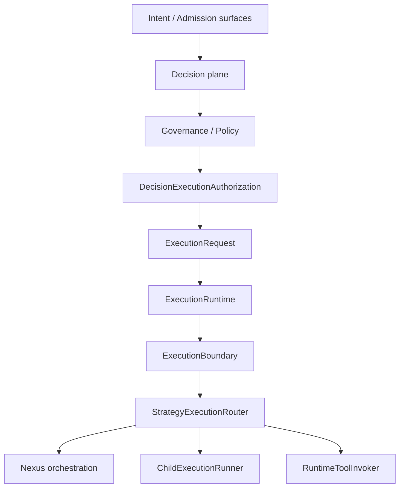
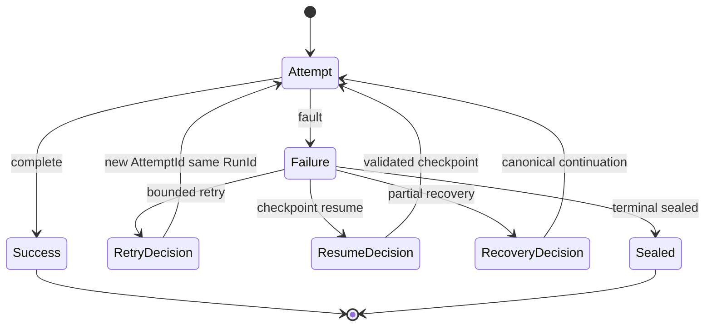

# Execution Engine — Final Enterprise Architecture (EE-FINAL)

**Classification:** `MAINTAINER_CERTIFICATION`  
**Status:** `FROZEN FOR CURRENT PLATFORM STAGE` (upon EE-FINAL PASS)  
**Audience:** Maintainers, enterprise operators, qualification auditors  

**Semantic authority:** [`EXECUTION_ENGINE_OWNERSHIP_MODEL.md`](EXECUTION_ENGINE_OWNERSHIP_MODEL.md), [`EXECUTION_ENGINE_FINAL_UNIFIED_ENTRY_PLUGINABILITY_ZERO_BYPASS_MODEL.md`](EXECUTION_ENGINE_FINAL_UNIFIED_ENTRY_PLUGINABILITY_ZERO_BYPASS_MODEL.md), [`UNIFIED_EXECUTION_ARCHITECTURE.md`](../../architecture/UNIFIED_EXECUTION_ARCHITECTURE.md).  

**Entry inventory SSOT:** [`../qualification/PLATFORM_EXECUTION_UNIFICATION_P0_BYPASS_INVENTORY.md`](../qualification/PLATFORM_EXECUTION_UNIFICATION_P0_BYPASS_INVENTORY.md).  

**Cross-session certification:** [`../qualification/EE_FINAL_CROSS_SESSION_ENTERPRISE_EXECUTION_ENGINE_CERTIFICATION.md`](../qualification/EE_FINAL_CROSS_SESSION_ENTERPRISE_EXECUTION_ENGINE_CERTIFICATION.md)

---

## 1. Executive architecture summary

INTEGRAx provides **one authoritative Execution Engine** for all **supported** platform execution flows. Multiple ingress surfaces (API, CLI, scenarios, queue workers, applications) are permitted; they must **converge** on `ExecutionRuntime` through the canonical boundary (`ExecutionBoundary`, `StrategyExecutionRouter`). Decision decides **what**; governance decides **whether**; authority decides **may act**; Nexus decides **how/when** orchestration runs; execution performs work.

Control planes (identity, authority, governance, capacity, retry/recovery, evidence, observability, diagnostics, security, shutdown, operations) surround execution without duplicating lifecycle ownership.

---

## 2. Canonical execution path



ASCII equivalent:

```text
Intent → Decision → Governance → Execution Request → ExecutionRuntime → Boundary → StrategyRouter
  → Nexus | ChildExecutionRunner | RuntimeToolInvoker
```

---

## 3. Ownership matrix

| Concern | Canonical owner | Duplicate authoritative owner |
| ------- | ----------------- | ----------------------------- |
| Lifecycle | `ExecutionRuntime` | **0** |
| Identity mint | `ExecutionIdentityAuthority` | **0** |
| Governance evaluation | Decision + policy plane | **0** implicit allow |
| Authority propagation | `ExecutionBoundary` + delegation contracts | **0** |
| Orchestration / scheduling | Nexus (`GraphExecutor`, `NexusLoop`) | **0** |
| Child execution | `ChildExecutionRunner` | **0** |
| Tools / side effects | `RuntimeToolInvoker` | **0** |
| Retry | NPSC-5E retry plane | **0** hidden retry |
| Recovery | NPSC-5E recovery plane | **0** recovery bypass |
| Evidence | NPSC-5F plane | **0** evidence-driven control |
| Capacity admission | EE-B1.2 ports | **0** unbounded root |
| Shutdown | EE-B1.1 / EE-B4-B | **0** |
| Diagnostics | Diagnostics plane (read-only) | **0** execute/retry/govern |

---

## 4. Identity model

Every meaningful execution carries `TaskId`, `RunId`, `AttemptId`, `ExecutionId`, `TenantId`, and lineage bindings. Checkpoint and evidence records reference the same identity spine; they do not mint parallel authority.

---

## 5. Authority model

Child effective authority **≤** parent. Retry, resume, recovery, and HITL continuation do not expand unrelated authority. `ExecutionBoundary` enforces propagation; security gates (EE-B3) certify adversarial resistance.

---

## 6. Governance model

Outcomes: `ALLOW`, `DENY`, `MODIFY`, `ESCALATE`, `REQUIRE_HUMAN` per decision contract. Policy/governance failure is **fail-closed** — it must not yield execution success. No implicit allow on evaluation failure.

---

## 7. Orchestration / Nexus model

Nexus is the **sole** orchestration/scheduling owner for graph/fan-out execution. It is not a second lifecycle runtime; root lifecycle remains `ExecutionRuntime`.

---

## 8. Child execution

Fan-out slots invoke **child execution** through `ChildExecutionRunner` / `ChildExecutionPort` with canonical lineage. No supported parent→specialist direct execution outside this path.

---

## 9. Tool / side-effect boundary

Mutating tools and external side effects route through `RuntimeToolInvoker` (or frozen equivalent seam). Agents do not perform ungoverned provider `invoke`/`execute` in production trees (EE-FINAL-ARCH scan gates).

---

## 10. Capacity / backpressure

Bounded capacity with `ALLOW` / `DEFER` / `REJECT` (EE-B1.2). Preview/admission is not a second execution owner. Permits release on terminal/cancel paths (chaos matrix F-02, F-10).

---

## 11. Retry / recovery

- **Retry:** same `RunId`, new canonical `AttemptId`, bounded attempts (NPSC-5E R1).  
- **Recovery:** distinct from retry and blind resume (NPSC-5E R2/R3).  
- **Sealed terminal attempt** cannot reopen.  
- Successful siblings in partial recovery are not replayed.

---

## 12. Evidence

Durable evidence for meaningful execution/failure or explicit fail-closed persistence failure (NPSC-5F). Evidence **records/reconstructs**; it does not retry, execute, or govern.

---

## 13. Reconstruction

Historical reconstruction is **read-only** (NPSC-5F R4). No active replay from evidence plane.

---

## 14. Observability

Facts flow through typed export boundaries to plugins/sinks. OTLP/export outage degrades observability only — not canonical execution correctness (EE-B2 F-05).

---

## 15. Diagnostics

Diagnostics **read, interpret, explain** — they do not execute, retry, recover, or mutate governance.

---

## 16. Security

EE-B3 threat model + adversarial abuse certification: identity spoofing, cross-tenant, authority escalation, governance bypass, tool bypass, and confused-deputy paths are blocked in representative gates.

---

## 17. Shutdown

Graceful lifecycle (EE-B4-B): `STOP_ACCEPTING` → `DRAIN` → `FLUSH EVIDENCE` → `PERSIST FINAL STATE` → `TERMINATE`.

---

## 18. Operational readiness

Health, readiness, liveness, degraded, saturation, SLI/SLO ownership (EE-B4-A). Mandatory evidence readiness hooks where qualified.

---

## 19. Runbooks

Production runbooks (EE-B4-C) contain **no** manual execution bypass, governance bypass, checkpoint mutation, evidence deletion, or blind retry guidance (`test_ee_b4_c_forbidden_operator_bypass.py`).

---

## 20. Pluginability


Plugin registration does not confer execution authority. Dynamic loading uses typed manifests and controlled registries where present (DS-PLUGIN, HARDENING-5).

---

## 21. Persistence abstraction

Execution, recovery, and evidence persist through **contracts → configured providers**. Authoritative execution core has **0** direct vendor store coupling (EE-FINAL-ARCH, EEC-1, NPSC-5F R1).

---

## 22. Scale model

Current stage closure includes: bounded concurrency, capacity/backpressure, worker isolation, Nexus fan-out, retry/recovery, chaos containment (EE-B2-FINAL).

**Explicit non-goals (current stage):**

- Distributed multi-node autoscaling as part of Execution Engine closure  
- Cluster-wide distributed scheduling unless separately implemented and qualified  

Future scale work must **consume** this engine, not fork parallel runtimes.

---

## 23. Control planes (diagram)

```text
Identity · Authority · Governance · Capacity · Recovery · Evidence · Observability · Diagnostics · Security · Shutdown · Operations
        surround ExecutionRuntime (single lifecycle owner)
```

---

## 24. Failure / recovery lifecycle (diagram)



---

## 25. Final zero-bypass statement

Supported production metrics (P0 SSOT): **BYPASS = 0**. Ingress surfaces converge on `ExecutionRuntime`; duplicate authoritative owners for lifecycle, identity, governance, scheduler, recovery, evidence, and tool execution are **0** (EE-A1, EE-FINAL-ARCH, EE-FINAL gates).

---

## Freeze and evolution

Execution Engine architecture is **frozen for the current platform stage** after EE-FINAL PASS. Changes to frozen semantics require: **drift classification → architecture reopen → implementation → requalification → re-freeze**.
