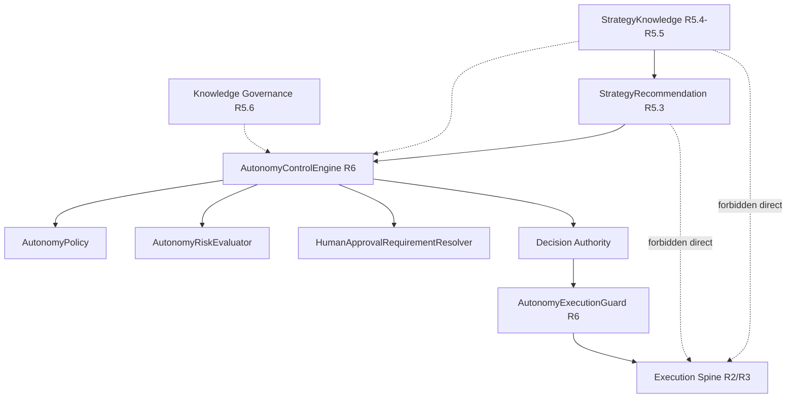

# Self-Healing Enterprise Autonomy Controls (R6)

**Status:** Architecture blueprint only — **no runtime implementation**, no execution or lifecycle changes.

## Cel R6

R6 defines a **controlled autonomy** layer that answers, for a given advisory recommendation:

> *May this action proceed automatically, or does it require additional control?*

The layer **evaluates** autonomy posture (allowed / constrained / blocked for auto-path), required control tier, and applicable limits. It does **not** execute strategies, mutate lifecycle, or enforce policies at runtime in this phase.

### Position in the R5 → R6 chain

| Phase | Question |
|-------|----------|
| R5.1–R5.2 | What happened? How good was the strategy? |
| R5.3 | Which strategy is advised for this situation? |
| R5.4–R5.5 | What derived knowledge and context support that advice? |
| R5.6 | How was knowledge changed, versioned, and audited? |
| **R6 (this doc)** | **Under enterprise rules, what autonomy tier applies before any decision to act?** |

### Fundamental rule

Autonomy is **not** freedom to execute. The only permitted high-level flow:

```text
Knowledge (R5.4–R5.6)
        |
        v
Recommendation (R5.3)
        |
        v
Autonomy Control Layer (R6)
        |
        v
Decision Authority (consumer / operator / future approval workflow)
        |
        v
Execution (R2/R3 spine — unchanged by R6 blueprint)
```

**Forbidden:**

```text
Knowledge  →  Autonomous Execution
Recommendation  →  Executor (bypassing R6 + decision authority)
```

## Granice autonomii

| In scope (R6 blueprint) | Explicitly out of scope |
|-------------------------|-------------------------|
| Contract design for autonomy evaluation | Automatic strategy execution |
| Autonomy level model and inactive `FULL_AUTONOMY` contract | Changes to execution engine or orchestrator |
| Plugin ports: policy, risk, human approval | Lifecycle or recovery automation |
| Execution **guard** contract (pre-check only) | Policy enforcement runtime |
| Audit **requirements** and decision record shape | ML decision making |
| `AutonomyRepository` persistence port | UI / approval workflow implementation |
| Alignment with R5.3 advisory output and R5.6 knowledge governance | Parallel governance system |

R6 **extends** decision authority boundaries described in [SELF_HEALING_STRATEGY_RECOMMENDATION_R5.md](./SELF_HEALING_STRATEGY_RECOMMENDATION_R5.md) and **does not replace** [SELF_HEALING_KNOWLEDGE_GOVERNANCE_R5.md](./SELF_HEALING_KNOWLEDGE_GOVERNANCE_R5.md). Knowledge governance remains about **knowledge change** audit; R6 governs **acting on recommendations** under enterprise autonomy rules.

## Model poziomów autonomii

`AutonomyLevel` (immutable enum, future contract location: `intergrax.contracts.self_healing.autonomy.level`):

| Level | Meaning | R6 blueprint default |
|-------|---------|----------------------|
| `OBSERVE_ONLY` | Collect signals; no recommendation-driven action path | Allowed as contract |
| `RECOMMEND_ONLY` | Emit/consume recommendations only; no auto-decision | **Typical enterprise default** |
| `APPROVAL_REQUIRED` | Automated path blocked until human (or external approval system) grants authority | Allowed as contract |
| `CONTROLLED_EXECUTION` | Limited auto-path only when policy + risk + guard all allow | Future implementation target |
| `FULL_AUTONOMY` | Unrestricted autonomous execution | **Contract only — MUST NOT be activatable** in any R6 implementation |

Implementation guardrails:

- Configuration and policy plugins **must not** select `FULL_AUTONOMY` as an active level.
- Registry/bootstrap may register the enum member for forward compatibility; runtime activation is a **hard error** until a future explicit program phase approves it.

## Autonomy Control Layer

### `AutonomyControlEngine`

Central orchestration port (SPI). Responsibilities:

1. Accept an **autonomy evaluation request** bound to a `StrategyRecommendation` (R5.3) and optional knowledge/governance context refs (R5.4–R5.6).
2. Invoke configured plugins: policy → risk → human-approval requirement synthesis.
3. Emit an immutable **`AutonomyControlDecision`** (not an execution command).

```text
AutonomyControlRequest
        |
        v
AutonomyControlEngine
        ├── AutonomyPolicy (plugin)
        ├── AutonomyRiskEvaluator (plugin)
        └── HumanApprovalRequirementResolver (plugin)
        |
        v
AutonomyControlDecision
```

The engine **must not**:

- call strategy executors,
- advance `SelfHealingLifecycleEngine` states,
- write knowledge revisions,
- bypass `GovernedSelfHealingOrchestrator` / spine gates described in R3.

### `AutonomyControlRequest` (conceptual)

| Field | Role |
|-------|------|
| `tenant_id`, investigation/problem refs | Isolation and correlation |
| `recommendation` | R5.3 `StrategyRecommendation` (advisory input) |
| `knowledge_revision_ref` | Optional pointer to knowledge version used |
| `governance_assessment_ref` | Optional R5.6 assessment metadata |
| `operating_context_ref` | Optional R5.5 context fingerprint |
| `requested_action_kind` | Descriptive intent (e.g. `CONSIDER_STRATEGY_FOR_EXECUTION`) — not an executor handle |

### `AutonomyControlDecision` (conceptual)

| Field | Role |
|-------|------|
| `autonomy_level` | Effective level after evaluation |
| `auto_path_allowed` | Boolean — **advisory**; execution still requires decision authority + guard |
| `constraints` | Immutable tuple of limit descriptors (rate, scope, environment, …) |
| `policy_outcome` | Policy id + rationale |
| `risk_outcome` | Risk band + evaluator id |
| `human_approval` | `HumanApprovalRequirement` |
| `audit_bundle` | See Audit requirements |
| `engine_id` | Plugin/engine attribution |

## Decision Authority Boundary

Clear separation of **who recommends, who approves autonomy posture, who decides to act, who executes**:

| Component | Authority |
|-----------|-----------|
| `StrategyRecommendationEngine` / R5.3 service | **Recommends** — counselor only |
| `StrategyKnowledgeGovernanceService` / R5.6 | **Records and assesses knowledge changes** — no execution |
| `AutonomyControlEngine` (R6) | **Classifies autonomy posture** — no execution |
| Decision authority consumer | **Decides** whether to request execution (operator, workflow, future approval adapter) |
| `AutonomyExecutionGuard` (R6 contract) | **Pre-execution gate check** — allow/deny possibility only |
| R2/R3 orchestration + External Operation Spine | **Executes** — unchanged by R6 blueprint |

```text
Recommendation          →  StrategyRecommendationEngine (R5.3)
Autonomy classification →  AutonomyControlEngine (R6)
Knowledge audit         →  StrategyKnowledgeGovernanceService (R5.6)
Act decision            →  Decision authority (outside R6 core)
Execution admission     →  Existing governance + spine (R2/R3)
Pre-executor check      →  AutonomyExecutionGuard (R6, future wire)
```

No component may hold **hidden** decision authority: every outcome must be attributable via audit fields.

## Policy architecture

### `AutonomyPolicy` (plugin)

Determines enterprise rules for autonomy tier and constraints.

```python
# Conceptual Protocol — not implemented in R6 blueprint phase
class AutonomyPolicy(Protocol):
    @property
    def policy_id(self) -> str: ...

    def evaluate(
        self,
        request: AutonomyControlRequest,
        recommendation: StrategyRecommendation,
    ) -> AutonomyPolicyOutcome: ...
```

`AutonomyPolicyOutcome`: `suggested_level`, `constraint_descriptors`, `rationale`, `policy_version`.

**Future implementations** (names only, no R6 code):

- `RiskBasedAutonomyPolicy`
- `EnvironmentBasedAutonomyPolicy`
- `EnterpriseApprovalPolicy`

Distinct from `StrategyKnowledgeGovernancePolicy` (R5.6): knowledge policy describes **change audit**; autonomy policy describes **action posture** on recommendations.

## Risk model abstraction

### `AutonomyRiskEvaluator` (plugin)

Evaluates risk of acting on a recommendation. Inputs (conceptual):

- strategy type / strategy id,
- R5.5 operating context,
- business impact descriptor (supplied by request, not scored in blueprint),
- historical performance refs (R5.1/R5.2 via ports, read-only).

Output: `AutonomyRiskAssessment` — `risk_band` (e.g. `LOW` | `MEDIUM` | `HIGH` | `CRITICAL`), `evaluator_id`, `factors` (immutable labels), `rationale`.

No production scoring algorithm in R6 blueprint — only the contract shape and plugin boundary.

## Human approval boundary

### `HumanApprovalRequirement`

Immutable value describing whether human (or enterprise approval system) involvement is required **before** decision authority may request execution.

| Field | Role |
|-------|------|
| `required` | Whether approval is mandatory |
| `reason_code` | Stable machine code |
| `rationale` | Human-readable explanation |
| `escalation_hint` | Optional routing hint (not a workflow implementation) |

### `HumanApprovalRequirementResolver` (plugin)

Combines policy outcome, risk assessment, and autonomy level into `HumanApprovalRequirement`.

Example mapping (illustrative, not hardcoded in core):

| Risk band | Typical requirement |
|-----------|---------------------|
| LOW | Approval not required for classification; `auto_path_allowed` may still be false under `RECOMMEND_ONLY` |
| HIGH / CRITICAL | `required=True` |

R6 does **not** implement UI, tickets, or approval storage — only the requirement contract.

## Execution authority separation

### `AutonomyExecutionGuard` (future contract)

Last autonomy check **before** an executor is invoked. Guard **does not execute**.

```text
Decision (to attempt execution)
        |
        v
AutonomyExecutionGuard.check(admission_context)  →  GuardVerdict
        |
        v
Executor (R2/R3 spine — existing)
```

`GuardVerdict`: `ALLOWED` | `DENIED` | `DEFERRED` (e.g. pending approval token), with audit refs.

Wiring rule: guard consumes a prior `AutonomyControlDecision` and/or fresh re-evaluation; it must not substitute for spine `ExternalOperationExecutionGate` — both layers stack.

## Diagram przepływu



## Plugin architecture

Core depends only on protocols and immutable models:

```text
AutonomyControlEngine
        |
        +-- AutonomyPolicy
        +-- AutonomyRiskEvaluator
        +-- HumanApprovalRequirementResolver
        +-- AutonomyRepository (optional persistence)
```

- **Plugin registry** (future): register policy/risk/resolver by `policy_id` / `evaluator_id`.
- **Dependency injection**: engine composed in runtime/bootstrap — no hardcoded enterprise rules in core.
- Core **must not** import vendor adapters or concrete risk models.

## Audit requirements

Every `AutonomyControlDecision` must be auditable in principle (storage via repository port):

| Audit element | Content |
|---------------|---------|
| Who decided | `engine_id`, plugin ids, future `principal_id` if supplied |
| Policy in force | `policy_id`, `policy_version`, outcome rationale |
| Autonomy level | Effective `AutonomyLevel` |
| Constraints | Full constraint descriptor tuple |
| Knowledge basis | Refs to recommendation basis, optional revision id, governance assessment id |
| Risk | `AutonomyRiskAssessment` snapshot |
| Human approval | `HumanApprovalRequirement` |
| Correlation | `tenant_id`, investigation/problem ids, timestamp |

R6 blueprint does **not** implement audit storage — see persistence.

## Persistence

When implementations need durable autonomy decisions:

```text
AutonomyRepository (domain port)
        |
        v
Configured adapter (runtime/bootstrap)
        |
        v
Vendor provider
```

Forbidden in domain: `database.save()`, ORM, vendor SDK imports.

Suggested operations (conceptual): `append_decision`, `get_by_correlation_id` — exact API left to implementation phase.

## Integration with existing components

| Existing | R6 relationship |
|----------|-----------------|
| `StrategyRecommendation` / `StrategyRecommendationEngine` | Primary input to `AutonomyControlEngine`; remains advisory |
| `StrategyKnowledgeGovernancePolicy` / audit repos | Parallel concern — supply refs; do not duplicate knowledge versioning |
| `GovernedSelfHealingOrchestrator`, R3 lifecycle | Execution authority unchanged; R6 sits **before** decision to request spine operations |
| `StrategyKnowledgeGovernanceControlLevel` | Descriptive audit tier — **not** interchangeable with `AutonomyLevel` |

Do not wire R6 into orchestrator or selectors in the blueprint phase.

## Twarde zasady architektury

**Forbidden:**

- Bypassing decision authority or spine gates
- Direct executor invocation from autonomy core
- Hidden or implicit autonomy decisions
- Hardcoded enterprise policies in core
- Vendor coupling in `intergrax.contracts`
- Activating `FULL_AUTONOMY`

**Required:**

- `Protocol` / `@runtime_checkable` SPIs where consistent with R5
- `@dataclass(frozen=True, slots=True)` immutable models
- Dependency injection and plugin registry
- Explicit contracts and validation in `__post_init__` where applicable

## Kontrola scope (quality gate)

| Check | Blueprint status |
|-------|------------------|
| No autonomous execution implementation | Yes — documentation only |
| No execution / lifecycle / orchestrator changes | Yes |
| Full abstraction via plugins | Yes |
| Enterprise governance alignment with R5.6 | Yes — complementary, not duplicate |
| Ready for future R6 implementation | Yes — contracts specified conceptually |

## Related docs

- [SELF_HEALING_STRATEGY_RECOMMENDATION_R5.md](./SELF_HEALING_STRATEGY_RECOMMENDATION_R5.md) (R5.3)
- [SELF_HEALING_KNOWLEDGE_GOVERNANCE_R5.md](./SELF_HEALING_KNOWLEDGE_GOVERNANCE_R5.md) (R5.6)
- [SELF_HEALING_CONTEXTUAL_KNOWLEDGE_OPTIMIZATION_R5.md](./SELF_HEALING_CONTEXTUAL_KNOWLEDGE_OPTIMIZATION_R5.md) (R5.5)
- [SELF_HEALING_EXECUTION_LIFECYCLE_ARCHITECTURE_R3.md](./SELF_HEALING_EXECUTION_LIFECYCLE_ARCHITECTURE_R3.md) (execution authority)

## Implementation roadmap (post-blueprint, not part of this deliverable)

1. Add `intergrax.contracts.self_healing.autonomy` package with enums and protocols above.
2. Add `AutonomyControlService` in runtime with injected plugins only.
3. Add repository adapter behind configuration.
4. Wire `AutonomyExecutionGuard` at spine admission boundary **without** replacing existing gates.
5. Enterprise policy packs as separate plugins.
