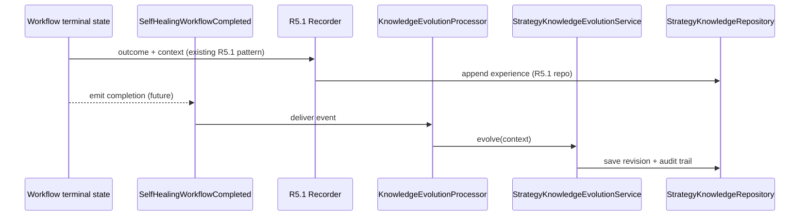

# Self-Healing Strategy Knowledge Evolution (R5.4)

**Status:** Architecture blueprint only — no runtime implementation.

**Task:** `SELF_HEALING_R5_4_STRATEGY_KNOWLEDGE_EVOLUTION_ARCHITECTURE_BLUEPRINT`

## Purpose

R5.4 defines **Strategy Knowledge Evolution**: a layer that **projects and updates derived knowledge** from self-healing experience, quality analysis, and (optionally) recommendation context — **without** acquiring execution authority, changing lifecycle, or auto-selecting strategies.

R5.1–R5.3 established a read path:

```text
Experience (R5.1) → Quality Assessment (R5.2) → Recommendation (R5.3)
```

R5.4 closes the loop on the **knowledge** side only:

```text
Experience → Quality Assessment → Recommendation
                                      |
                                      v
                            Knowledge Evolution (R5.4)
                                      |
                                      v
                         StrategyKnowledgeProfile (derived)
```

**Core principle:** *Knowledge ≠ decision.* A profile may state that strategy A historically performs well in a diagnostic context; it must never imply “always run strategy A.”

## Why R5.4 exists

| Stage | Question |
|-------|----------|
| R5.1 | What happened on each run? (source of truth) |
| R5.2 | How good was strategy X historically? (on-demand analysis) |
| R5.3 | Which candidate looks best right now? (advisory) |
| **R5.4** | **What durable knowledge should we retain from experience?** (derived, versioned, auditable) |

Future operators, analytics, human reviewers, ML pipelines, or recommendation engines may **read** knowledge profiles; only explicit upstream authority (unchanged by R5.4) may **decide** execution.

## Boundaries (explicit non-goals)

R5.4 blueprint and any later implementation **must not**:

| Forbidden | Notes |
|-----------|--------|
| Strategy learning algorithms in core | Only SPI ports; algorithms live in plugins |
| Automatic optimization / RL / ML | Extension points only |
| Wiring into strategy selector or orchestrator | No execution flow changes |
| Changes to authority model (R1–R3) | Counselor layers remain non-executing |
| Vendor storage in domain contracts | `StrategyKnowledgeRepository` port only |
| New parallel “experience” store | Facts stay in R5.1 `SelfHealingStrategyPerformanceExperience` |

## Relationship to existing abstractions

| Existing artifact | Relationship |
|-------------------|--------------|
| `SelfHealingStrategyPerformanceExperience` (R5.1) | **Source of truth** for episodic facts; knowledge evolution **reads** via `StrategyPerformanceMemoryRepository`, never replaces append-only memory |
| `StrategyQualityAssessment` (R5.2) | **Input signal** for evolution; assessments are snapshots, not persisted knowledge |
| `StrategyRecommendation` (R5.3) | **Optional contextual input** (e.g. which candidates were compared); recommendations do not mutate knowledge directly |
| `SelfHealingStrategyPerformance` (R3 selection) | Aggregated **selection feedback** profile; R5.4 `StrategyKnowledgeProfile` is a **separate derived projection** for strategy-context knowledge — do not merge into R3 aggregates without an explicit future ADR |
| `AdaptiveHealingLearningRepository` (R4 adaptive) | Tenant-level adaptive healing history; **orthogonal** to R5 strategy knowledge — extend R4 only if a future ADR unifies read models; R5.4 does not duplicate R4 ports |

No new parallel repository for experiences. Knowledge persistence is **additive** via `StrategyKnowledgeRepository`.

---

## Architecture overview

```text
┌─────────────────────────────────────────────────────────────────────────┐
│                        Authority boundary (unchanged)                    │
│  Lifecycle · Orchestrator · Strategy selector · Execution spine        │
└─────────────────────────────────────────────────────────────────────────┘
                                    │
                    (observe only — already R5.1 recorder)
                                    v
              StrategyPerformanceMemoryRepository
                                    │
         ┌──────────────────────────┼──────────────────────────┐
         v                          v                          v
 StrategyQualityEvaluation    StrategyRecommendation      (future consumers)
         (R5.2)                      (R5.3)
         │                          │
         └────────────┬─────────────┘
                      v
         ┌────────────────────────────────────────┐
         │   StrategyKnowledgeEvolutionService     │  ← composition root (future)
         │   - loads facts + optional assessments  │
         │   - invokes StrategyLearningEngine      │
         │   - persists via StrategyKnowledgeRepository
         └────────────────────────────────────────┘
                      │
         ┌────────────┼────────────┬─────────────────────┐
         v            v            v                     v
 StrategyLearning   StrategyMetric   StrategyComparison   StrategyKnowledge
     Engine         Provider          Policy              Repository
   (plugin SPI)    (plugin SPI)      (plugin SPI)         (storage port)
         │            │            │                     │
         v            v            v                     v
 Statistical /    success rate /  success>speed /    configured vendor
 Temporal /       recovery time / speed>cost /      adapter → persistence
 Contextual /     cost / stability  (per scope)      provider
 ML / human /
 external analytics
```

### Event-driven update (conceptual — not wired in R5.4)

Runtime integration is **out of scope** for this blueprint. The intended asynchronous shape:

```text
SelfHealingWorkflowCompleted  (domain event — future definition)
        │
        v
KnowledgeEvolutionProcessor   (idempotent consumer)
        │
        ├─ ensure experience already in R5.1 memory (or trigger recorder path)
        ├─ build StrategyKnowledgeEvolutionContext
        ├─ StrategyKnowledgeEvolutionService.evolve(...)
        └─ append StrategyKnowledgeRevision → StrategyKnowledgeRepository
```

Properties:

- **At-least-once** delivery tolerated; processor must be **idempotent** (same workflow completion → same revision or no-op).
- Processor runs **off** the critical execution path (queue / outbox / scheduler — adapter concern).
- Failure to evolve knowledge **must not** block workflow terminal state or repair outcome.



---

## 1. Strategy Knowledge Model

### `StrategyKnowledgeProfile`

Represents **derived** knowledge for one strategy in a **scoped context**. It is **not** authoritative history.

| Field (conceptual) | Role |
|--------------------|------|
| `profile_id` | Stable identity for this knowledge row (not the strategy id alone) |
| `tenant_id` | Tenant scope |
| `strategy_id` | Strategy the knowledge describes |
| `context_fingerprint` | Normalized diagnostic / operational context key (hash or structured ref tuple) |
| `context_refs` | Evidence refs tying context to investigations, namespaces, failure classes |
| `observation_summary` | Aggregated **references** to historical observations (counts, time windows, experience id ranges) — not a copy of all R5.1 rows |
| `quality_snapshot` | Optional embedded or referenced `StrategyQualityAssessment` fields at revision time |
| `confidence_label` | Epistemic strength (e.g. LOW / MEDIUM / HIGH) — descriptive, not authorization |
| `freshness` | `last_evidence_at`, `staleness_policy_id`, optional TTL hint for readers |
| `knowledge_version` | Monotonic version **within** `(tenant_id, strategy_id, context_fingerprint)` |
| `supersedes_version` | Previous version number or `null` for first revision |
| `derived_at` | Timestamp of projection |
| `learning_engine_id` | Which engine produced this revision |

**Invariants:**

- Profiles **must not** contain execution directives (`run`, `priority`, `auto_select`, weights for selector).
- Rebuilding a profile from R5.1 experiences + R5.2 evaluator must be possible for audit replay (engine-dependent detail stays in plugin).
- Source of truth for “what ran” remains `SelfHealingStrategyPerformanceExperience`.

### `StrategyKnowledgeContext`

Scoped key for evolution and lookup (tenant, strategy, context fingerprint, optional time horizon, optional candidate set from a recommendation request).

### `StrategyKnowledgeRevision` (audit bundle)

Immutable record appended on each successful evolution:

| Field | Role |
|-------|------|
| `revision_id` | Unique revision |
| `profile` | Full `StrategyKnowledgeProfile` after change |
| `change_summary` | Human- and machine-readable rationale |
| `trigger` | `WORKFLOW_COMPLETED` \| `SCHEDULED_REBUILD` \| `OPERATOR_REQUEST` \| `BACKFILL` |
| `trigger_refs` | `workflow_id`, event id, operator id, etc. |
| `input_experience_ids` | Experience rows that influenced this revision |
| `input_assessment_refs` | Optional R5.2 assessment evidence refs |
| `metric_snapshot_refs` | Optional refs from `StrategyMetricProvider` |
| `comparison_policy_id` | Policy used when contrasting strategies |
| `previous_knowledge_version` | For diff / replay |

Example audit narrative (stored in `change_summary`):

```text
Knowledge version 12
Changed because: 50 new successful executions for strategy X in context fingerprint diag:db_timeout:v2
```

---

## 2. Strategy Learning Contract

### `StrategyLearningEngine` (plugin SPI)

Mirrors R5.2 `StrategyQualityEvaluator` and R5.3 `StrategyRecommendationEngine` patterns.

```python
# Future location: intergrax/contracts/self_healing/knowledge_evolution/engine.py
@runtime_checkable
class StrategyLearningEngine(Protocol):
    @property
    def engine_id(self) -> str: ...

    def evolve(
        self,
        context: StrategyKnowledgeEvolutionContext,
        current_profile: StrategyKnowledgeProfile | None,
        experiences: tuple[SelfHealingStrategyPerformanceExperience, ...],
        metrics: StrategyMetricBundle,
        comparison: StrategyComparisonResult | None,
    ) -> StrategyKnowledgeEvolutionResult:
        """Produce next profile revision — no execution or selection authority."""
        ...
```

**`StrategyKnowledgeEvolutionResult`:** `proposed_profile`, `revision_metadata`, `no_change: bool` (idempotent skip).

Example future engines (not implemented in R5.4):

| `engine_id` | Intent |
|-------------|--------|
| `statistical_learning` | Frequentist updates from outcome counts |
| `temporal_learning` | Time-decay / seasonality of performance |
| `contextual_learning` | Context-clustered projections |
| `ml_learning` | External model hook |
| `human_feedback_learning` | Operator corrections as supervised signal |

Core **must not** branch on engine type; configuration selects implementation at composition time.

---

## 3. Strategy Metric Provider

### `StrategyMetricProvider` (plugin SPI)

Separates **measurement** from **learning logic**.

```python
@runtime_checkable
class StrategyMetricProvider(Protocol):
    @property
    def provider_id(self) -> str: ...

    def collect(
        self,
        scope: StrategyMetricScope,
        experiences: tuple[SelfHealingStrategyPerformanceExperience, ...],
    ) -> StrategyMetricBundle: ...
```

**`StrategyMetricBundle`:** immutable map of named metrics (`StrategyMetricValue`: name, value, unit, `evidence_refs`).

Example metric names (contract only — no implementations):

| Metric | Typical source |
|--------|----------------|
| `success_rate` | R5.1 outcomes |
| `failure_rate` | R5.1 outcomes |
| `recovery_time_p50` / `p95` | `recovery_time_seconds` |
| `cost_estimate` | External cost adapter (future) |
| `stability_index` | Variance of outcomes over window |

Providers may read R5.1 tuples only, or combine with external analytics via **their own** adapters (not embedded in core).

---

## 4. Strategy Comparison Policy

### `StrategyComparisonPolicy` (plugin SPI)

Separates **how strategies are compared** from **how knowledge is updated**.

```python
@runtime_checkable
class StrategyComparisonPolicy(Protocol):
    @property
    def policy_id(self) -> str: ...

    def compare(
        self,
        scope: StrategyComparisonScope,
        left: StrategyComparisonSubject,
        right: StrategyComparisonSubject,
    ) -> StrategyComparisonResult: ...
```

**`StrategyComparisonSubject`:** strategy id + metric bundle + optional quality assessment.

**`StrategyComparisonResult`:** ordered preference (`PREFER_LEFT` \| `PREFER_RIGHT` \| `INCONCLUSIVE`), `dimension_weights_ref`, `evidence_refs` — **no execution command**.

Example policies (future plugins):

- `success_over_speed` — prioritize success_rate over recovery_time
- `speed_over_cost` — prioritize recovery_time over cost_estimate

Learning engines **may** consume comparison results when updating contextual knowledge; they **must not** emit run directives.

---

## 5. Knowledge Persistence Abstraction

### `StrategyKnowledgeRepository` (storage port)

Same layering as R5.1 `StrategyPerformanceMemoryRepository`:

```text
StrategyKnowledgeRepository  (domain port)
        │
        v
Configured vendor adapter  (runtime — SQLite, Postgres, object store, etc.)
        │
        v
Persistence provider  (infrastructure)
```

**Port operations (conceptual):**

| Method | Semantics |
|--------|-----------|
| `append_revision(revision)` | Append-only history of `StrategyKnowledgeRevision` |
| `get_latest_profile(criteria)` | Latest `StrategyKnowledgeProfile` for scope |
| `get_profile_version(criteria, version)` | Point-in-time read for audit |
| `list_revisions(criteria, limit)` | Audit trail paging |

Domain contracts **must not** reference SQL, document stores, Redis, cloud SDKs, or event-store APIs.

**Read path for R5.2 / R5.3:** Quality and recommendation continue to use R5.1 memory directly in current foundations. Future optional **readers** may incorporate knowledge profiles as **additional context** behind new composition — not by overloading R5.2 evaluators with hidden state.

---

## 6. Composition: `StrategyKnowledgeEvolutionService`

Future runtime module (not implemented in R5.4):

```text
intergrax/runtime/self_healing/knowledge_evolution/
  service.py          # orchestrates ports
  processor.py        # event consumer (future)
  in_memory_repository.py  # test double only
```

Dependencies (constructor injection):

1. `StrategyPerformanceMemoryRepository` (R5.1)
2. `StrategyKnowledgeRepository` (R5.4)
3. `StrategyLearningEngine`
4. `StrategyMetricProvider` (optional, multi-provider registry)
5. `StrategyComparisonPolicy` (optional)
6. Optional `StrategyQualityEvaluationService` (R5.2) for assessment snapshots

**`evolve` flow:**

1. Resolve scope → query experiences from R5.1 (never from knowledge repo as SoT).
2. Load `current_profile` from knowledge repo (if any).
3. Collect metrics via provider(s).
4. Optionally run comparison when scope includes multiple strategies.
5. Delegate to `StrategyLearningEngine.evolve(...)`.
6. If `no_change`, return without append.
7. Else `append_revision` with full audit bundle.

---

## 7. Auditing and versioning

| Mechanism | Requirement |
|-----------|-------------|
| Monotonic `knowledge_version` | Per `(tenant_id, strategy_id, context_fingerprint)` |
| Append-only revisions | No silent overwrite of historical revisions |
| Provenance | Every revision records trigger, engine, policy, experience ids |
| Replay | Given R5.1 query + engine version + policy id, recompute expected profile (best-effort; ML plugins document non-determinism) |
| Correlation | `workflow_id` / `experience_id` links on workflow-triggered updates |

Align with R1 `SelfHealingAuditRecord` spirit: evidence refs required; knowledge audit is **additive** to workflow audit, not a replacement.

---

## 8. Modularity and future extensions

| Extension | Integration point |
|-----------|-------------------|
| ML-based learning | `StrategyLearningEngine` plugin |
| Probabilistic models | Same SPI; store uncertainty in `confidence_label` + metric bundle |
| Human feedback | Trigger `OPERATOR_REQUEST` + dedicated engine |
| External analytics | `StrategyMetricProvider` adapter |
| Real-time streams | Event processor + same service |
| Multi-tenant isolation | `tenant_id` on all criteria (consistent with R5.1 queries) |

Core evolution service remains a **stable orchestrator**; new behavior ships as plugins and adapters.

---

## 9. Proposed contract package layout (implementation follow-up)

Blueprint only — paths for a future PR:

```text
intergrax/contracts/self_healing/knowledge_evolution/
  profile.py          # StrategyKnowledgeProfile, Context, Revision
  engine.py           # StrategyLearningEngine
  metrics.py          # StrategyMetricProvider, Bundle, Scope
  comparison.py       # StrategyComparisonPolicy
  repository.py       # StrategyKnowledgeRepository
  evolution.py        # EvolutionContext, EvolutionResult
  query.py            # Read criteria for knowledge repo
  __init__.py
```

Export from `intergrax/contracts/self_healing/` when implemented; do not re-export learning engines from workflow or execution packages.

---

## 10. Quality gate (blueprint checklist)

| Check | Status |
|-------|--------|
| No learning algorithm implementation | Blueprint only |
| No execution authority change | Yes — explicit boundary |
| No vendor coupling in domain design | Repository port only |
| Full plugin model (engine, metrics, comparison) | Yes |
| Aligned with R5.1–R5.3 naming and ports | Yes |
| Auditable versioning and provenance | Yes |
| Enterprise scale (idempotent processor, append-only, tenant scope) | Yes |

---

## Data flow summary

```text
[R5.1] SelfHealingStrategyPerformanceExperience  ──source of truth──┐
                                                                      │
[R5.2] StrategyQualityAssessment  ──optional snapshot───────────────┤
[R5.3] StrategyRecommendation     ──optional context────────────────┤
                                                                      v
                                                        StrategyLearningEngine
                                                                      │
                                                                      v
                                                        StrategyKnowledgeProfile
                                                                      │
                                                                      v
                                                        StrategyKnowledgeRepository
                                                                      │
                                                        (adapters / providers)
```

**Knowledge ≠ decision:** Downstream execution components **must not** subscribe to knowledge repository mutations. Approved integration pattern: human dashboards, offline analytics, and **explicitly composed** advisory services that still respect R5.3’s non-executing contract.
