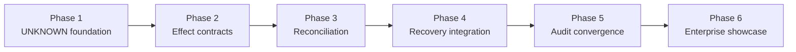

<!--
© Artur Czarnecki. All rights reserved.
Intergrax is source-available under the Intergrax Evaluation and Collaboration License 1.0.
See LICENSE for permitted evaluation, collaboration, and contribution use.
-->

# Enterprise Reliability Layer — Implementation Plan

**Architecture (1:1):** [`architecture/ENTERPRISE_RELIABILITY_LAYER.md`](../../architecture/ENTERPRISE_RELIABILITY_LAYER.md)  
**Subordinate architecture hubs:** [`UNCERTAINTY_MANAGEMENT.md`](../../architecture/UNCERTAINTY_MANAGEMENT.md) · [`RECONCILIATION.md`](../../architecture/RECONCILIATION.md) · [`EXTERNAL_EFFECT_CONTRACTS.md`](../../architecture/EXTERNAL_EFFECT_CONTRACTS.md) · [`RECOVERY_AND_COMPENSATION.md`](../../architecture/RECOVERY_AND_COMPENSATION.md)  
**Hub:** [`intergrax_runtime_architecture.md`](../../architecture/intergrax_runtime_architecture.md)  
**Strategy:** [`guides/INTERGRAX_DEVELOPMENT_STRATEGY.md`](../../technical/guides/INTERGRAX_DEVELOPMENT_STRATEGY.md)

> When implementing ERL, read **only** the architecture hub, subordinate hubs, and this plan for the domain—unless a phase row explicitly cites a neighbor domain.

**Document type:** Implementation roadmap and technical execution plan (**not** runtime delivery).  
**Architecture maturity:** TARGET (ERL not started as a dedicated layer).  
**Last updated:** 2026-09-11

---

## Cursor read scope (token budget)

**Do not read this entire file in one session** for a single implementation slice.

- **Default:** §3 phase matching your slice · §4 boundaries · §5 dependencies · §6 integration points for that slice only.
- **Architecture:** [`ENTERPRISE_RELIABILITY_LAYER.md`](../../architecture/ENTERPRISE_RELIABILITY_LAYER.md) + one subordinate hub per phase.
- **Neighbors:** open only the linked architecture section cited in the phase row (UER, Reliability, Governance, Observability, Integrations, Tools).

---

## Roadmap position

| Step | Status | Goal |
| ---- | ------ | ---- |
| Architecture audit | **Done** | Confirm ERL necessity |
| Architecture design | **Done** | Define ERL as platform layer |
| Architecture documentation | **Done** | ERL hub + subordinate docs |
| Documentation audit | **Done** | Enterprise quality |
| **Implementation roadmap** | **This document** | Safe implementation order |
| Runtime implementation | **Future** | Build ERL capabilities |
| Enterprise showcase | **Future** | Demonstrate business scenario |

---

## 1. Implementation vision

### Why ERL is implemented

Enterprise integrations routinely produce **ambiguous outcomes**: timeouts, partial responses, async acceptance, and temporary disagreement between APIs and systems of record. If the platform maps every ambiguity to success or failure—or retries mutations without evidence—workflows **double-charge**, **duplicate shipments**, and **orphan** business state. Applications then rebuild the same polling, runbooks, and compensations in isolation.

**Enterprise systems often know that something happened, but do not immediately know what exactly happened. ERL creates a safe process for discovering the truth.**

ERL is implemented to:

- treat **UNKNOWN** as a managed execution state, not a disguised failure;
- **gate** risky downstream effects until external truth is verified or governed escalation occurs;
- **reuse** one platform reliability model across tools and integrations;
- produce **audit-grade evidence** of uncertainty admission, reconciliation, and resolution.

ERL does **not** execute business logic. It **protects execution correctness** when external reality is slow, ambiguous, or unreachable—coordinated with Unified Execution Runtime (UER), Reliability, Governance, and Observability without replacing them.

### Target outcome for implementers

Future engineers can deliver ERL **incrementally**: each phase adds a coherent platform capability with explicit boundaries, existing integration points, and validation gates—**no** second runtime, **no** bypass of UER lifecycle, **no** duplicate retry or compensation ownership.

---

## 2. Implementation principles

These principles are **mandatory** for every ERL delivery slice.

| Principle | Meaning for ERL |
| --------- | ---------------- |
| **Reusable components** | UNKNOWN handling, reconciliation orchestration, and contract evaluation are platform mechanisms—not per-application loops. |
| **Full abstraction** | Provider-specific status APIs and feeds live behind Integrations; ERL orchestrates **when** and **how often** to verify, not wire formats. |
| **Modular architecture** | Uncertainty, contracts, reconciliation, and recovery compose; phases may ship separately if boundaries and contracts are honored. |
| **Plugin-friendly design** | Reconcile strategies and effect declarations attach to **integration/tool definitions** at configuration time—[`INTEGRATIONS.md`](../../architecture/INTEGRATIONS.md) · [`TOOLS.md`](../../architecture/TOOLS.md). |
| **Strong contracts** | SUCCESS, FAILURE, UNKNOWN, effect dimensions, and evidence requirements are explicit—[`EXTERNAL_EFFECT_CONTRACTS.md`](../../architecture/EXTERNAL_EFFECT_CONTRACTS.md). |
| **No duplicated logic** | Retry taxonomy (R0–R4), compensation queue execution, and HITL interrupt paths remain **Reliability / UER**—ERL adds uncertainty-before-classification, not parallel retry engines. |
| **No bypassing existing platform mechanisms** | Pause/resume, identity, journal events, governance authorization, and integration transport use canonical domains—see §4. |
| **Production-grade quality** | Bounded reconcile, fail-closed gating, durable evidence, and architecture tests before public proof routes. |

**Anti-patterns (forbidden):**

- `timeout` ⇒ automatic FAILURE or blind retry of mutating calls.
- Agent-local infinite polling or compensation without declared contracts.
- A standalone “ERL runtime” that schedules workflow topology (Nexus owns orchestration topology).
- Embedding operational truth resolution inside Decision System semantic decisions—[`DECISION_SYSTEM.md`](../../architecture/DECISION_SYSTEM.md).

---

## 3. Implementation phases

Phases are **logical capability blocks**, not micro-tasks. Complete phases in order unless a later phase’s **prerequisites** row explicitly allows parallel work (e.g. contract schema design alongside Phase 1 semantics).

### Phase 1 — Unknown State Foundation

**Goal:** Introduce controlled handling of uncertain execution outcomes.

**Business meaning:** The platform can say: *“We do not know yet what happened, so we will not guess.”*

| Aspect | Content |
| ------ | ------- |
| **Capabilities delivered** | UNKNOWN admission; lifecycle (admission → containment → resolution hook → terminalization); distinction from Reliability failure classes; gating signal to block risky dependents. |
| **Architecture authority** | [`UNCERTAINTY_MANAGEMENT.md`](../../architecture/UNCERTAINTY_MANAGEMENT.md) |
| **Prerequisites** | UER pause/resume semantics understood and callable for gated executions—[`UNIFIED_EXECUTION_RUNTIME.md`](../../architecture/UNIFIED_EXECUTION_RUNTIME.md) § Lifecycle. |
| **Integration points** | ERL classifies evidence → requests UER **pause** or equivalent gate; Observability emits UNKNOWN-entered and gating facts—[`OBSERVABILITY.md`](../../architecture/OBSERVABILITY.md). |
| **Out of scope** | Provider-specific reconcile adapters; compensation execution; new retry layers. |
| **Phase exit criteria** | UNKNOWN is representable in execution/evidence model; downstream risky steps cannot proceed on inference alone; Reliability does not auto-map UNKNOWN to `DEPENDENCY_ERROR` + mutation retry without contract. |

---

### Phase 2 — External Effect Contracts

**Goal:** Allow integrations and tools to declare safety properties for external operations.

**Business meaning:** The platform knows which operations can be safely verified or repeated—and which must never be blindly retried.

| Aspect | Content |
| ------ | ------- |
| **Capabilities delivered** | Contract dimensions (effect class, idempotency, ambiguity signals, reconcile strategies, compensation pairs, autonomy ceiling, evidence requirements); contract lookup at external-invoke boundary; contract-driven UNKNOWN vs terminal behavior. |
| **Architecture authority** | [`EXTERNAL_EFFECT_CONTRACTS.md`](../../architecture/EXTERNAL_EFFECT_CONTRACTS.md) |
| **Prerequisites** | Phase 1 UNKNOWN semantics; Tools/Integrations configuration surfaces—[`TOOLS.md`](../../architecture/TOOLS.md) · [`INTEGRATIONS.md`](../../architecture/INTEGRATIONS.md). |
| **Integration points** | Tool/integration invoke path resolves contract before/after evidence evaluation; Governance constrains what contracts allow per tenant—[`GOVERNED_EXECUTION.md`](../../architecture/GOVERNED_EXECUTION.md). |
| **Out of scope** | Implementing every provider adapter; business policy definitions (Governance/product). |
| **Phase exit criteria** | At least one reference mutating tool and one read-style probe declare contracts; UNKNOWN + non-idempotent paths enforce reconcile-only or escalate per contract rules. |

---

### Phase 3 — Reconciliation Framework

**Goal:** Create a universal mechanism for checking external reality before deciding the next step.

**Business meaning:** The platform can ask the external system of record what really happened.

| Aspect | Content |
| ------ | ------- |
| **Capabilities delivered** | Reconciliation orchestration (strategy selection from contract, bounded attempts, backoff, evidence capture); mapping external evidence to continue / compensate / escalate recommendations. |
| **Architecture authority** | [`RECONCILIATION.md`](../../architecture/RECONCILIATION.md) |
| **Prerequisites** | Phase 2 contracts with declared reconcile strategies; Integration boundary for read-only probes. |
| **Integration points** | Provider adapters implement **how** to read status; ERL owns **when** to reconcile and **how many** attempts; correlation keys tied to Execution identity—[`UNIFIED_EXECUTION_ARCHITECTURE.md`](../../architecture/UNIFIED_EXECUTION_ARCHITECTURE.md). |
| **Out of scope** | Replacing Nexus scheduling; mutating retries disguised as reconciliation. |
| **Phase exit criteria** | End-to-end UNKNOWN → reconcile → resolved SUCCESS or FAILURE for a reference integration; inconclusive reconcile escalates per bounded policy; reconcile attempts on Observability spine. |

---

### Phase 4 — Recovery Integration

**Goal:** Connect uncertainty resolution with existing recovery mechanisms.

**Business meaning:** After knowing the truth (or accepting governed escalation), the workflow continues safely—or compensates, stops, or involves a human.

| Aspect | Content |
| ------ | ------- |
| **Capabilities delivered** | Continue, compensate, escalate, and HITL paths **after** UNKNOWN resolution; orchestration with UER resume and Reliability compensation queue; governance authorization for consequential continue/compensate. |
| **Architecture authority** | [`RECOVERY_AND_COMPENSATION.md`](../../architecture/RECOVERY_AND_COMPENSATION.md) |
| **Prerequisites** | Phases 1–3; Reliability compensation queue and HITL spine—[`RELIABILITY_FAILURE_AND_HITL.md`](../../architecture/RELIABILITY_FAILURE_AND_HITL.md). |
| **Integration points** | ERL **recommends** recovery choice; Reliability **executes** bounded retry/degrade/compensation enqueue; UER **applies** pause/resume/cancel; Governance **authorizes** high-risk continue/compensate; HITL presents evidence bundle. |
| **Out of scope** | New ContinuationRuntime or duplicate HITL store; semantic decision quality (Decision System). |
| **Phase exit criteria** | Reference scenario (e.g. payment UNKNOWN → reconcile paid → resume fulfillment) completes without double mutation; compensate path uses declared compensation operations with their own effect contracts. |

---

### Phase 5 — Audit Evidence and Cross-Capability Convergence

**Goal:** Make uncertainty and resolution inspectable for operators and auditors; converge ERL facts on the canonical journal model.

**Business meaning:** *“Prove what we knew, when we verified it, and who or what resolved it.”*

| Aspect | Content |
| ------ | ------- |
| **Capabilities delivered** | Canonical semantic events (UNKNOWN entered, gated steps, reconcile attempts/outcomes, resolution, recovery choice); lineage links to Task/Run/Attempt/Execution identity; alignment with existing Reliability/Observability evidence patterns. |
| **Architecture authority** | [`ENTERPRISE_RELIABILITY_LAYER.md`](../../architecture/ENTERPRISE_RELIABILITY_LAYER.md) § Main capabilities · Audit Evidence |
| **Prerequisites** | Phases 1–4 functional on reference paths; Observability five-ID convergence on execution-scoped events—[`OBSERVABILITY.md`](../../architecture/OBSERVABILITY.md). |
| **Integration points** | ERL emits facts; Observability persists/indexes; no private ERL-only journal that bypasses `RuntimeEvent` spine. |
| **Phase exit criteria** | Auditor questions in [`UNCERTAINTY_MANAGEMENT.md`](../../architecture/UNCERTAINTY_MANAGEMENT.md) § Audit and observability answerable from persisted evidence on reference flows. |

---

### Phase 6 — Enterprise Qualification and Showcase

**Goal:** Demonstrate an enterprise-safe end-to-end scenario under architecture and proof discipline.

**Business meaning:** Stakeholders can trust a documented cross-system workflow (e.g. order → payment UNKNOWN → reconcile → fulfill) as a **qualified** platform capability—not a demo-only fork.

| Aspect | Content |
| ------ | ------- |
| **Capabilities delivered** | Curated qualification scenario; documented failure and UNKNOWN variants; maintainer qualification notes where applicable; no dedicated public proof route until architecture gates pass. |
| **Architecture authority** | [`ENTERPRISE_RELIABILITY_LAYER.md`](../../architecture/ENTERPRISE_RELIABILITY_LAYER.md) § Enterprise example |
| **Prerequisites** | Phases 1–5 exit criteria met on reference hosts; validation strategy §7 executed for the showcase scope. |
| **Out of scope** | Claiming full production qualification for all providers; implementing every integration category. |
| **Phase exit criteria** | Showcase scenario reproducible; known gaps documented against architecture TARGET vs CURRENT tables in neighbor domains. |

---

### Phase dependency overview



| Parallel-safe work (with care) | Must not start before |
| ------------------------------ | --------------------- |
| Contract schema/design reviews | — |
| Integration adapter stubs for **read-only** reconcile | Phase 2 strategy declarations exist |
| Observability event naming design | Phase 1 UNKNOWN semantics frozen |
| Qualification scenario authoring (draft) | Phase 4 recovery paths defined |

---

## 4. Architecture boundaries

Clear ownership prevents overlapping responsibilities and architectural regression.

### Execution Runtime (UER / Nexus execution lifecycle)

**Owns:**

- Execution lifecycle (Run, Attempt, Execution tree identity);
- pause, resume, cancel mechanics and checkpoint hooks;
- emitting lifecycle facts when execution state changes;
- strategy continuation after **authorized** resume.

**Does not own:**

- Classifying external payment/inventory truth;
- Selecting provider reconcile APIs;
- Declaring idempotency semantics per vendor.

### Enterprise Reliability Layer (ERL)

**Owns:**

- UNKNOWN admission and lifecycle semantics;
- reconciliation **orchestration** (timing, bounds, strategy selection from contracts);
- effect-safety gates before risky external effects proceed;
- recovery **recommendations** after external truth is known (continue vs compensate vs escalate).

**Does not own:**

- Workflow graph topology (Nexus);
- Bounded retry taxonomy execution (Reliability);
- Policy/authority decisions (Governance);
- Journal persistence (Observability);
- Transport and provider wire formats (Integrations).

### Reliability / HITL

**Owns:**

- Failure classification (dependency, policy, quality);
- retry layers R0–R4 and Attempt Ledger semantics;
- compensation **queue execution** and side-effect retry safety rules;
- escalation **mechanisms** compatible with canonical HITL interrupt.

**Does not own:**

- Treating UNKNOWN as generic failure without evidence;
- Provider status interpretation (Integrations + ERL mapping).

### Governance

**Owns:**

- Authorization of risky continue, compensate, and autonomy ceilings;
- human decision authority and policy evaluation.

**Does not own:**

- Operational discovery of whether a charge succeeded (ERL + reconciliation).

### Observability

**Owns:**

- Persistence, indexing, and export of `RuntimeEvent` / journal spine.

**Does not own:**

- Inventing execution truth or UNKNOWN semantics.

### Integrations / Tools

**Owns:**

- Provider adapters, transport, normalization of provider codes;
- implementing declared reconcile and compensation **operations**.

**Does not own:**

- Platform-wide UNKNOWN state machine or unbounded polling loops in agents.

### Agent Layer

**Owns:**

- Business steps and recovery **intent** with business identifiers.

**Does not own:**

- Final external truth, unbounded retry loops, or compensation business rules outside platform contracts—[`AGENT_CONTRACTS_AND_ASSEMBLY.md`](../../architecture/AGENT_CONTRACTS_AND_ASSEMBLY.md).

### Decision System

**Owns:**

- Semantic decision quality.

**Does not own:**

- External effect operational truth (ERL scope).

---

## 5. Required dependencies

ERL implementation **depends on** existing platform components documented in the architecture hub. **Do not** introduce new platform domains without an architecture reopen.

| Dependency | What ERL needs from it | Architecture reference |
| ---------- | ---------------------- | ------------------------ |
| **Unified Execution Runtime** | Pause/resume/cancel; Execution identity; lifecycle transitions when UNKNOWN blocks progress | [`UNIFIED_EXECUTION_RUNTIME.md`](../../architecture/UNIFIED_EXECUTION_RUNTIME.md) |
| **Unified Execution Architecture** | Cross-domain identity, Execution Tree semantics, fencing for resolution | [`UNIFIED_EXECUTION_ARCHITECTURE.md`](../../architecture/UNIFIED_EXECUTION_ARCHITECTURE.md) |
| **Reliability / HITL** | Failure model, R0–R4, idempotency keys, compensation queue, HITL interrupt path | [`RELIABILITY_FAILURE_AND_HITL.md`](../../architecture/RELIABILITY_FAILURE_AND_HITL.md) |
| **Governed Execution** | Policy and authority before consequential continue/compensate | [`GOVERNED_EXECUTION.md`](../../architecture/GOVERNED_EXECUTION.md) |
| **Observability** | Durable `RuntimeEvent` / journal spine for UNKNOWN and reconcile evidence | [`OBSERVABILITY.md`](../../architecture/OBSERVABILITY.md) |
| **Integrations** | Authoritative read paths and provider adapters for reconciliation | [`INTEGRATIONS.md`](../../architecture/INTEGRATIONS.md) |
| **Tools** | External side-effect invocations participating in effect contracts | [`TOOLS.md`](../../architecture/TOOLS.md) |
| **Decision System** | Boundary only—semantic decisions remain separate from external effect truth | [`DECISION_SYSTEM.md`](../../architecture/DECISION_SYSTEM.md) |

**Convergence dependencies (neighbor gaps, not ERL inventions):**

- UER entry-path and pause/resume convergence on all execution strategies affects ERL gating consistency.
- Observability five-ID coverage on execution-scoped events affects audit completeness (Phase 5).
- Reliability side-effect retry rules must remain the single source for **mutation retry**; ERL must hook **before** unsafe retries apply.

**Explicit non-dependencies:**

- ERL does **not** require a new orchestration engine, ContinuationRuntime, or replacement for Nexus.
- ERL does **not** require Decision System changes to resolve payment/inventory truth.

---

## 6. Integration points

Summary of **touchpoints** implementers must wire—without bypassing owners in §4.

| Touchpoint | Direction | Contract |
| ---------- | --------- | -------- |
| **External invoke boundary** | Tools/Integrations → ERL | Effect contract lookup; evidence evaluation → SUCCESS / FAILURE / UNKNOWN |
| **Gating** | ERL → UER | Request pause or block risky dependents when UNKNOWN or unresolved |
| **Reconcile reads** | ERL → Integrations | Read-only probes per declared strategy; stable correlation keys |
| **Resolution** | ERL → UER + Reliability | Resolve UNKNOWN; resume or enqueue compensation via Reliability paths |
| **Authorization** | ERL → Governance | Continue/compensate above autonomy ceiling or policy-sensitive effects |
| **Escalation** | ERL → Reliability/HITL | Inconclusive reconcile → canonical interrupt with evidence bundle |
| **Evidence** | ERL → Observability | Semantic lifecycle facts; Observability persists—no duplicate store |
| **Agent intent** | Agents → Runtime | Business ids and intent only; no agent-owned reconcile loops |

```text
Invoke → Contract → Execute (Integrations) → Evidence
  → ERL classify → [UNKNOWN] → gate (UER) → reconcile (Integrations)
  → recovery recommendation → Governance (if needed) → Reliability/UER action
  → Observability journal
```

---

## 7. Risks and safeguards

| Risk | Description | Prevention |
| ---- | ----------- | ---------- |
| **Duplicate responsibility** | ERL reimplements retry engines, HITL stores, or Nexus scheduling | Strict §4 ownership; ERL orchestrates and recommends; Reliability executes retries/compensation; UER owns pause/resume |
| **Hidden coupling** | Provider-specific logic leaks into ERL core | Reconcile **adapters** in Integrations; ERL only orchestrates declared strategies |
| **Bypassing runtime** | Applications or agents resume/shipment without UER after UNKNOWN | All continue paths require UER resume and explicit ungate; no agent-local “assume success” |
| **Unsafe retries** | UNKNOWN triggers mutation retry without idempotency | Contract-driven rules—non-idempotent UNKNOWN → reconcile-only or escalate—[`RELIABILITY_FAILURE_AND_HITL.md`](../../architecture/RELIABILITY_FAILURE_AND_HITL.md) § Side-effect retry safety |
| **Uncontrolled provider-specific logic** | Each agent polls payment APIs differently | Central reconciliation orchestration; bounded attempts; evidence on spine |
| **UNKNOWN collapsed to FAILURE** | Operators lose stuck-order safety; double mutations | Phase 1 exit criteria; tests for timeout ≠ FAILURE without evidence |
| **Governance bypass** | Auto-continue high-risk effects after reconcile | Governance gate on consequential continue/compensate per contract and policy |
| **Shadow journal** | ERL persists truth outside Observability | Phase 5—facts on `RuntimeEvent` spine only |
| **Semantic vs operational confusion** | Decision System asked to “decide if payment succeeded” | Keep operational truth in ERL; Decision System for semantic quality only |
| **Architecture drift** | Implementation invents APIs not in hubs | Changes require architecture doc update before code merge; this plan updated in same PR |

---

## 8. Validation strategy

Future implementation is verified **without** substituting ad hoc manual runbooks for architecture gates. **No test code** is specified in this document; implementers add tests in delivery PRs per phase.

### Architecture tests

- **Boundary tests:** ERL modules do not import orchestration topology owners against tier rules; no `ContinuationRuntime`-style bypass—align with UER anti-god-object rules.
- **Ownership tests:** Mutation retry paths cannot be invoked from ERL without delegating to Reliability contract surfaces.
- **State semantics:** UNKNOWN is distinct from FAILURE in classification tables and emitted events.

### Contract validation

- Reference tools/integrations declare minimal contract dimensions; invalid or missing contracts fail closed for **mutating** external effects.
- Idempotent vs non-idempotent behavior under UNKNOWN matches [`EXTERNAL_EFFECT_CONTRACTS.md`](../../architecture/EXTERNAL_EFFECT_CONTRACTS.md) tables.

### Integration scenarios

- **Payment-style flow:** invoke → ambiguous response → UNKNOWN → gate → reconcile → SUCCESS → resume downstream step (architecture flagship scenario).
- **Inventory hold:** timeout → reconcile read → SUCCESS or FAILURE with hold evidence.
- **Async job:** 202-style acceptance → UNKNOWN until job status reconcile completes.

### Failure scenarios

- Confirmed provider failure → UNKNOWN **not** entered; terminal FAILURE with evidence.
- Reconcile confirms no effect → FAILURE or alternate path without shipment/settlement.
- Governance deny after successful reconcile → terminal stop with evidence despite external success.

### UNKNOWN resolution scenarios

- Reconcile success → SUCCESS and gated steps unblock only via UER.
- Reconcile inconclusive after bounded attempts → HITL/operator escalation with correlation bundle.
- Duplicate external effect detected → compensate per contract + escalate when over autonomy ceiling.
- Partial/conflicting provider evidence → compensate or escalate, not guess.

### Phase gates

| Phase | Minimum verification |
| ----- | -------------------- |
| 1 | UNKNOWN admission + gating; no blind downstream mutation |
| 2 | Contract enforcement on reference invoke path |
| 3 | Bounded reconcile with evidence on journal |
| 4 | Continue and compensate paths use Reliability/UER/Governance owners |
| 5 | Auditor questions answerable from persisted events |
| 6 | End-to-end qualification scenario documented and repeatable |

### Proof and qualification discipline

- No public “ERL proof route” until Phases 1–5 gates pass for the claimed scope—consistent with architecture **Current maturity**.
- Regressions in neighbor domains (UER pause identity, Reliability compensation) block ERL qualification closeout.

---

## 9. Delivery notes for maintainers

- **One phase per epic** where possible; each epic updates this plan’s phase exit checklist and architecture TARGET vs CURRENT only when behavior changes.
- **Neighbor coordination:** UER or Reliability changes that touch pause, retry, or compensation require explicit cross-review against §4.
- **Documentation pair:** Keep [`ENTERPRISE_RELIABILITY_LAYER.md`](../../architecture/ENTERPRISE_RELIABILITY_LAYER.md) § Current maturity in sync when implementation starts (separate doc PR if architecture table changes).
- **Token discipline:** Implementers use architecture read-scope blocks; do not load full maintainer queues for unrelated domains.

---

## 10. Engineering canon (quick links)

| Document | Use when |
| -------- | -------- |
| [`ENTERPRISE_RELIABILITY_LAYER.md`](../../architecture/ENTERPRISE_RELIABILITY_LAYER.md) | Hub, position, state machine |
| [`UNCERTAINTY_MANAGEMENT.md`](../../architecture/UNCERTAINTY_MANAGEMENT.md) | Phase 1 |
| [`EXTERNAL_EFFECT_CONTRACTS.md`](../../architecture/EXTERNAL_EFFECT_CONTRACTS.md) | Phase 2 |
| [`RECONCILIATION.md`](../../architecture/RECONCILIATION.md) | Phase 3 |
| [`RECOVERY_AND_COMPENSATION.md`](../../architecture/RECOVERY_AND_COMPENSATION.md) | Phase 4 |
| [`RELIABILITY_FAILURE_AND_HITL.md`](../../architecture/RELIABILITY_FAILURE_AND_HITL.md) | Retry, HITL, compensation queue |
| [`UNIFIED_EXECUTION_RUNTIME.md`](../../architecture/UNIFIED_EXECUTION_RUNTIME.md) | Pause/resume, identity |
| Maintainer plan (Reliability): [`RELIABILITY_FAILURE_AND_HITL.md`](RELIABILITY_FAILURE_AND_HITL.md) | Coordination only—do not duplicate retry roadmap |
