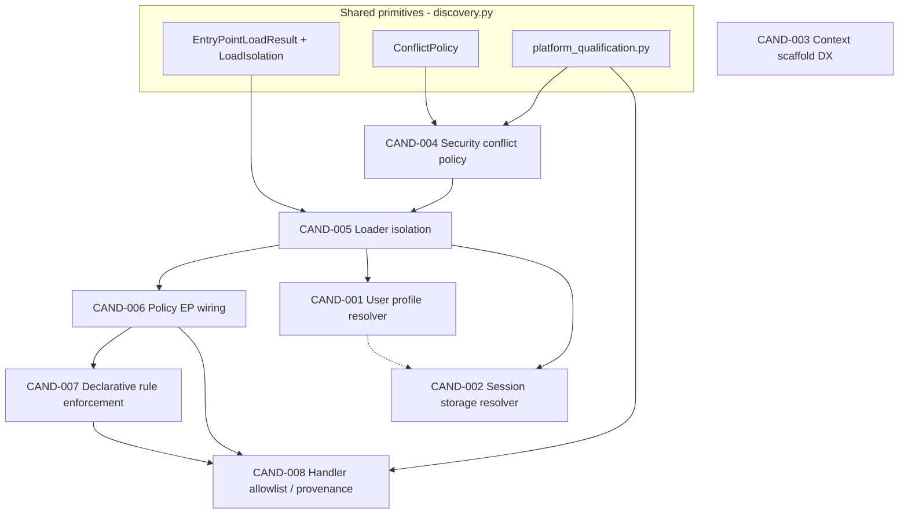

# Platform Plugin Enterprise Roadmap

**Task:** PLATFORM-PLUGIN-ENTERPRISE-1 — ENTERPRISE ARCHITECTURE, DEPENDENCY GRAPH & IMPLEMENTATION ROADMAP

**Status:** ACTIVE — ENTERPRISE-6 / BLOCK E **READY_FOR_REVIEW** (CAND-003 Context scaffold DX)

**Date:** 2026-08-12 (ENTERPRISE-1) · **ENTERPRISE-4 closeout:** 2026-08-14 · **ENTERPRISE-6 implementation:** 2026-08-15

**Branch:** `development`

**Starting HEAD / origin (ENTERPRISE-1):** `a7efcaecf8c191fa7b226e752e93a67beafa8a45`

**ENTERPRISE-4 closeout HEAD:** `c44a180bbb7c02c5f775ec26db1446d734edc4ea`

**Required ancestors verified:** PLUGIN-9 `f7b6eedf` · DOCS-7 primary `9081a49d` · DOCS-7 metadata `4c292dcc` · HARDENING-1 `06c1dad6` · HARDENING-1 review `a12aa429`

**Primary input:** [`PLATFORM_PLUGIN_DOCUMENTATION_CLOSEOUT.md`](PLATFORM_PLUGIN_DOCUMENTATION_CLOSEOUT.md)

**Invariant (all future blocks):** `NEW_DYNAMIC_ATTRIBUTE_WIRING = 0` — no `getattr`/`setattr`/loose `hasattr` capability probing in new architecture.

---

## 1. Executive verdict

Enterprise Platform Plugin work is **architecturally bounded, dependency-ordered, and implementation-ready** as **four production blocks + one DX block**, not eight microtasks.

| Verdict | Detail |
|---------|--------|
| **Candidates** | CAND-001…008 **CONFIRMED** as enterprise; CAND-009 remains **non-enterprise** (hardening, resolved) |
| **Critical path** | BLOCK C → BLOCK A → BLOCK B **CLOSED** → BLOCK D **READY_FOR_REVIEW** → BLOCK E **READY_FOR_REVIEW** |
| **Parallel track** | BLOCK D (Memory typed resolution) — **READY_FOR_REVIEW** |
| **Low priority** | BLOCK E (Context scaffold DX) — **READY_FOR_REVIEW** — no runtime architecture |
| **Not enterprise-ready today** | BLOCK D/E evidence pending independent review; production qualification and remaining exit gates still open |
| **Migration debt** | `memory_bootstrap.py` method-shape `hasattr` probing — **resolved in BLOCK D** |

**Recommended implementation order:** BLOCK C → BLOCK A → BLOCK B → BLOCK D → BLOCK E

### Global execution status (current)

| Block | Task | Status | Meaning |
|-------|------|--------|---------|
| **BLOCK C** | ENTERPRISE-2 | **CLOSED** | Plugin loading security / admission / isolation finished |
| **BLOCK A** | ENTERPRISE-3 | **CLOSED** | Policy plugin runtime wiring finished |
| **BLOCK B** | ENTERPRISE-4 | **CLOSED** | Policy enforcement + HITL governance finished |
| **BLOCK D** | ENTERPRISE-5 | **READY_FOR_REVIEW** | External Memory plugins materialize (CAND-001 + CAND-002) |
| **BLOCK E** | ENTERPRISE-6 | **READY_FOR_REVIEW** | Context plugin scaffold DX (CAND-003) |

**Qualification seam (not a BLOCK B blocker):** `QUALIFICATION_STILL_DEFERRED` — production package/version compatibility admission remains a deferred ENTERPRISE gap; BLOCK B governance requirements are closed without claiming full enterprise-ready status.

---

## 2. Scope / non-goals

### In scope (ENTERPRISE-1)

- Architecture, dependency graph, implementation blocks, acceptance gates, migration strategy
- Canonical owners, tenancy model, test/evidence strategy
- Open architectural decisions surfaced for implementation

### Out of scope

| Item | Rationale |
|------|-----------|
| Runtime implementation | ENTERPRISE-2+ |
| CAND-009 / F008 / F009 / F011 / F013 / F015 | Hardening — **resolved** (HARDENING-1) |
| CAND-009 reopen | Explicitly forbidden |
| Universal `PlatformPlugin` runtime wrapper | Architecture invariant (PLATFORM_PLUGINS.md) |
| Second plugin framework | Architecture invariant |
| Hot reload / distributed plugin inventory | Not evidenced as required |
| Full operator control plane (F006/F016 unified lifecycle) | Later enterprise; minimal per-bootstrap evidence suffices for CAND-005 |
| Cryptographic sandbox / attestation | Trust model remains trusted in-process Python (PLUGIN-7) |
| `docs/audit_results/` artifacts | Maintainer plans only |

---

## 3. Current architecture baseline

### 3.1 Shared coordination layer (reuse, do not duplicate)

| Primitive | Owner | Evidence |
|-----------|-------|----------|
| EP groups + spec cache | `intergrax/core/plugins/discovery.py` | `EP_*` constants, `iter_entry_point_specs`, `get_entry_point_spec` |
| `ConflictPolicy` | `discovery.py` | `error \| skip \| override \| warn_override` |
| `LoadIsolation` | `discovery.py` | `fail_fast \| isolate` |
| `EntryPointLoadResult` | `discovery.py` | Per-EP target or isolated error |
| `load_entry_point_targets()` | `discovery.py` | Conflict + isolation without domain registration |
| Catalog slug conflict | `intergrax/core/catalog_conflict.py` | Maps bootstrap `on_conflict` → catalog `override` |
| Production qualification | `intergrax/core/plugins/platform_qualification.py` | `evaluate_package_production_admission`, `require_production_qualification` |

**Pattern reference (domain-owned, typed, configurable conflict):** `intergrax/context/bootstrap.py` uses `register_plugins` + `catalog_conflict` + `ConflictPolicy` — **not** unconditional `override=True`.

### 3.2 Domain loaders (current gaps)

| Domain | Loader | Conflict | Isolation | Registration |
|--------|--------|----------|-----------|--------------|
| Security | `defense_plugin_loader.py` | **Always `override=True`** | **fail-fast** (no `on_load_failure`) | Instance registry `_DYNAMIC` |
| Policy handlers | `plugin_loader.py` | N/A (registry key = `rule_id`) | **fail-fast** | `PolicyRuleRegistry.register` |
| Memory stores | `memory_bootstrap.py` | Uses `load_entry_point_plugins` default `error` | **fail-fast** | **Count only — no materialization** |
| Context | `context/bootstrap.py` | Configurable `on_conflict` | Via `register_plugins` → fail-fast | Catalog registration |

### 3.3 Policy dual-track (do not conflate)

| Track | Types | Evaluator | Production use |
|-------|-------|-----------|----------------|
| **Immutable pack** | `ImmutableRuntimePolicyBundle`, `PolicyBundleRule` | `RuntimePolicyBundleEvaluator` | Governed contractor / external-work paths |
| **Declarative YAML rules** | `DeclarativePolicyRule`, `PolicyRuleHandler` | `PolicyRuleRegistry.evaluate_rule` | **Baseline (pre-BLOCK-B):** `domain_fragments` string-key carrier only — no production consumer. **Current (post ENTERPRISE-4):** typed `DeclarativePolicyRuntime` + `DeclarativePolicyEnforcer` at tool boundary — see BLOCK B closeout §22 |

Evidence: `policy_wiring.py` places `policy_rules` + fresh `PolicyRuleRegistry()` in `domain_fragments`; no module calls `PolicyRuleRegistry.evaluate_rule` outside registry definition and tests. `RuntimePolicyBundleEvaluator` does **not** read `DeclarativePolicyRule`. Enterprise target **must not** freeze this `Dict[str, Any]` wiring as the composition contract.

### 3.4 Memory resolution asymmetry

| Contract | Protocol | EP discovery | Tier-3 materialization |
|----------|----------|--------------|------------------------|
| `SessionTurnIndexStorePlugin` | `memory/contracts/session_turn_index.py` | Counted in bootstrap | **Wired** — `memory_vector_wiring.build_session_turn_index_store` |
| `UserProfileStorePlugin` | `memory/contracts/memory_store_plugin.py` | Counted via `hasattr` | **Not wired** — `resolve_memory_platform_wiring` uses integration profile only |
| `SessionStoragePlugin` | `memory/contracts/memory_store_plugin.py` | Counted via `hasattr` | **Not wired** |

Evidence: `memory_wiring.py:resolve_memory_platform_wiring` — SQLite/MongoDB/in-memory baseline + optional typed external overlay via `intergrax/memory/resolver/`; `memory_bootstrap.py` — typed `MemoryStorePluginKind` classifier (**migration debt resolved in BLOCK D**).

---

## 4. Candidate revalidation

| ID | Outcome | Gap exists? | Owner module(s) | Severity | Operator impact | Workaround | Workaround status |
|----|---------|-------------|-----------------|----------|-----------------|------------|-------------------|
| **CAND-001** | **READY_FOR_REVIEW** | No (implemented) | `memory_wiring.py`, `intergrax/memory/resolver/` | Medium | External user-profile store EPs materialize when `MemoryProfile.user_profile_store_plugin_id` set and discovery enabled | Explicit `MemoryPlatformWiring(user_profile_store=...)` | **Supported** — opt-in profile field + EP discovery |
| **CAND-002** | **READY_FOR_REVIEW** | No (implemented) | Same as CAND-001 | Medium | External session storage EPs materialize when `MemoryProfile.session_storage_plugin_id` set | Explicit `MemoryPlatformWiring(session_storage=...)` | **Supported** — opt-in profile field + EP discovery |
| **CAND-003** | **READY_FOR_REVIEW** | No (implemented) | `intergrax/scaffold/new_context_bundle.py` | Low | Context local/third-party authoring uses `new-context-bundle` | Manual `register_context_plugin()` or EP wheel | **Supported** — scaffold + CONTEXT_PLUGIN_AUTHOR_GUIDE §5 |
| **CAND-004** | **CONFIRMED** | Yes | `defense_plugin_loader.py`, `defense_registry.py` | **High** | Malicious/misconfigured EP can silently replace shipped defense (`override=True`) | Disable EP discovery; host-only registration | **Supported** — `discover_entry_points=False` default |
| **CAND-005** | **CONFIRMED** | Yes | Security + Policy loaders; primitive in `discovery.py` | Medium | One broken EP aborts entire domain load | Disable discovery; fix broken package | **Supported** — documented fail-fast |
| **CAND-006** | **CONFIRMED** | Yes | `policy_wiring.py`, `plugin_loader.py` | **High** | EP policy handlers never loaded in shipped hosts | Manual `load_policy_rule_plugins(registry)` in custom composition | **Accidental** — advanced host glue, not product path |
| **CAND-007** | **CONFIRMED** | Yes | `policy_wiring.py`, `registry.py`; enforcement **missing** | **High** | YAML `policy_rules` stored but never enforced | Use `RuntimePolicyBundle.tool_access` / immutable pack paths separately | **Partial** — different policy track |
| **CAND-008** | **CONFIRMED** | Yes | Policy domain (no implementation) | Medium | No handler allowlist; no bundle provenance gate | Operator trust + manual handler registration | **Accidental** — trust model only |

**Not applicable:** CAND-009 — **non-enterprise**, HARDENING-1 resolved.

**Merge / downgrade / resolved:** None. CAND-001/002 share one block; CAND-004/005 share admission primitives; CAND-006/007/008 form policy family with ordered dependencies.

---

## 5. Dependency graph



### Per-candidate dependencies

| Candidate | Prerequisites | Dependents | Shared abstractions | Shared runtime owner |
|-----------|---------------|------------|---------------------|----------------------|
| CAND-004 | `ConflictPolicy`, `catalog_conflict` patterns | CAND-005, CAND-006 (policy EP admission) | `discovery.load_entry_point_targets` | `defense_registry` (Security domain) |
| CAND-005 | CAND-004 (security conflict semantics defined) | CAND-006, CAND-001, CAND-002 | `EntryPointLoadResult`, `LoadIsolation` | Per-domain loaders + `catalog_bootstrap` |
| CAND-006 | CAND-005 (safe EP load) | CAND-007, CAND-008 | `PolicyRuleRegistry`, `load_policy_rule_plugins` | `policy_wiring.py` (Tier-3) |
| CAND-007 | CAND-006 | CAND-008 | `DeclarativePolicyRule`, `DeclarativePolicyRuntime`, `PolicyRuleRegistry.evaluate_rule` | New: `DeclarativePolicyEnforcer` at tool/runtime gate — consumes typed bundle field |
| CAND-008 | CAND-006, CAND-007 (enforcement path exists) | — | `platform_qualification`, handler admission DTO | Policy domain + host production profile |
| CAND-001 | CAND-005 (optional: isolated EP load for memory) | — | `UserProfileStorePlugin` Protocol | `memory_wiring.py` + new typed resolver |
| CAND-002 | CAND-001 (shared resolver infra) | — | `SessionStoragePlugin` Protocol | Same as CAND-001 |
| CAND-003 | None (scaffold only) | — | `intergrax/scaffold/new_tool_bundle.py` pattern | `intergrax/scaffold/` |

### Key dependency answers (verified)

| Question | Answer | Evidence |
|----------|--------|----------|
| Does CAND-007 require CAND-006 first? | **Yes** — EP handlers must be in registry before YAML `rule_id` resolution is meaningful | **Pre-BLOCK-B baseline:** `registry.evaluate_rule` looked up `rule.rule_id` in `_handlers`; empty registry → unknown handler → `ALLOW` (fail-open). **Current (ENTERPRISE-4):** unknown handler → `DENY` fail-closed |
| Does CAND-008 need CAND-006 admission path? | **Yes** — allowlist gates EP handler registration | No allowlist exists; `plugin_loader.py` registers all valid EPs |
| CAND-004 + CAND-005 shared API? | **Option C** — shared low-level primitive (`load_entry_point_targets`) + domain-specific policy config | Context uses shared primitive; Security is outlier |
| CAND-001/002 shared abstraction? | **Yes** — discriminated union resolver over typed Protocols, shared admission/count infra | Distinct factory methods, same wiring entry |
| CAND-003 depends on Context host composition? | **No runtime dependency** — scaffold template only | No resolver gap |

---

## 6. Target architecture principles (frozen)

1. **Domain-owned capability contracts** — `UserProfileStorePlugin`, `SecurityDefensePlugin`, `PolicyRuleHandler`, etc.
2. **No universal PlatformPlugin runtime wrapper**
3. **One shared coordination layer** — `discovery.py` + `catalog_conflict.py` + `platform_qualification.py` only
4. **No second plugin framework**
5. **Trusted in-process Python** — current trust model (PLUGIN-7)
6. **Explicit production qualification** — `require_production_qualification` at host boundary
7. **Explicit host-owned activation** — `discover_entry_points` flags, profile-driven
8. **Deterministic conflict/admission semantics** — sorted EP order, explicit policy modes
9. **Auditable failure behavior** — structured bootstrap results, no silent registry mutation
10. **Tenant/app isolation** where domain semantics require — per-bundle typed `DeclarativePolicyRuntime`, per-tenant memory materialization context
11. **Typed contracts only** — Protocol/ABC, immutable DTOs
12. **Fail-closed** for security/governance critical paths (configurable with migration)
13. **No silent registry mutation** — explicit `override` authorization
14. **Backward compatibility** — public plugin contracts unchanged unless versioned; default behavior changes require migration profile

---

## 7. Policy architecture (CAND-006, CAND-007, CAND-008)

### 7.1 End-to-end target flow

```text
PolicyRulesProfile (config, no executable code)
  → load_policy_rules_from_path / inline_rules → list[DeclarativePolicyRule]
  → build_runtime_policy_bundle:
       declarative_runtime = DeclarativePolicyRuntime(   # immutable typed DTO
         registry = PolicyRuleRegistry(),               # includes DenyToolRuleHandler
         rules = tuple[DeclarativePolicyRule, ...],
         provenance = PolicyBundleProvenance | None,
         enforcement_mode = typed enum/config,
       )
       load_policy_rule_plugins(declarative_runtime.registry, admission=...)   # CAND-006
       optional: filter registry by handler allowlist                            # CAND-008
  → RuntimePolicyBundle.declarative_policy_runtime = declarative_runtime      # additive typed field
     (domain_fragments may retain legacy keys during compatibility — not new enterprise wiring)
  → DeclarativePolicyEnforcer (new, CAND-007):
       consumes bundle.declarative_policy_runtime — no Dict[str, Any] lookup, no casts
       on tool invocation / meaningful side-effect:
         for matching rules → registry.evaluate_rule(rule, context)
         aggregate → DENY | ALLOW | REQUIRE_HITL
  → enforcement owner: tool gateway / UAEP gate (alongside tool_access)
  → evidence: PolicyEvaluationEvidence DTO on deny/HITL
```

**Typed composition contract (frozen):** declarative policy runtime state is reachable only through an explicit typed field/component on `RuntimePolicyBundle` (implementation-owned name; conceptually `DeclarativePolicyRuntime`). `domain_fragments` remains for legacy/auxiliary domain data — **not** for new enterprise live runtime capabilities.

### 7.2 Design decisions

| # | Question | Target answer |
|---|----------|---------------|
| 1 | Where should `load_policy_rule_plugins()` be called? | **`build_runtime_policy_bundle`** when `policy_rules is not None` — single Tier-3 composition point (`policy_wiring.py`) |
| 2 | Who owns `PolicyRuleRegistry` lifetime? | **Host composition** — one `DeclarativePolicyRuntime` per `RuntimePolicyBundle` via additive typed field; registry is `declarative_policy_runtime.registry`. Legacy `domain_fragments["policy_rule_registry"]` readable during compatibility only |
| 3 | Registry scope? | **Per-application bundle** (process-scoped, immutable after wire). **Not** global mutable singleton. Per-tenant variants require **per-tenant bundle** or tenant-scoped rule subsets (see §12) |
| 4 | YAML `rule_id` resolution? | `DeclarativePolicyRule.rule_id` → `PolicyRuleRegistry._handlers[rule_id]` — typed handler `evaluate()` |
| 5 | Who calls `evaluate_rule`? | **New `DeclarativePolicyEnforcer`** — not `RuntimePolicyBundleEvaluator` (different rule model) |
| 6 | Where does enforcement happen? | **Tool execution path** — integrate with `tool_policy_resolution.py` / `ToolGateway` before tool dispatch; extend to other `resource_kind` values per handler coverage |
| 7 | Deny/error/unknown-handler? | **Unknown handler: fail-closed → DENY** (change from current `ALLOW` in `registry.py:50-51`) with explicit `policy_rule_id=unknown_handler` evidence. Load failures: isolated per CAND-005 |
| 8 | Evaluation evidence? | Immutable `PolicyEvaluationEvidence` (rule_id, action, context keys, handler plugin_id, bundle digest) attached to runtime audit / HITL |
| 9 | Config vs code separation? | YAML in `PolicyRulesProfile` only; handlers from EP or explicit `register()` — never embed executable logic in YAML |
| 10 | Fail-closed surfaces? | Unknown handler, handler load rejected by allowlist, production host with unqualified handler package |
| 11 | Bundle signing required? | **Optional enterprise profile** — provenance metadata first; signing not blocking for initial BLOCK B |
| 12 | Provenance model? | `PluginQualificationResult` + `EntryPointSpec.distribution` + optional `PolicyRulesProfile.rules_path` hash → `PolicyBundleProvenance` DTO |
| 13 | Handler allowlist + production qualification? | Allowlist = admitted `rule_id` set in production profile; EP packages must pass `evaluate_package_production_admission` before `registry.register` |

### 7.3 Reuse (do not reinvent)

| Component | Reuse |
|-----------|-------|
| `PolicyRuleRegistry` | Yes — extend with `register` admission gate, change unknown-handler semantics |
| `RuntimePolicyBundle` | Yes — additive `declarative_policy_runtime` typed field; `domain_fragments` for legacy/auxiliary only, not new policy runtime wiring |
| `DeclarativePolicyRuntime` (new) | Yes — immutable DTO: `registry`, `rules`, `provenance`, `enforcement_mode` |
| `PolicyRulesProfile` | Yes |
| `load_policy_rules_from_path` | Yes |
| `RuntimePolicyBundleEvaluator` | **No** for declarative rules — parallel track for immutable packs |
| `CollaborativePolicyEvaluator` | **No** — workspace/resource policy, explicitly separate |

---

## 8. Security / admission architecture (CAND-004, CAND-005)

### 8.1 Target: Option C (shared primitive + domain policy)

```text
load_entry_point_targets(group, on_conflict=..., on_load_failure=...)
  → list[EntryPointLoadResult]
  → domain adapter:
       Security: instantiate SecurityDefensePlugin → register_security_defense_plugin(
         plugin, override=authorized_override)
       Policy: instantiate PolicyRuleHandler → registry.register(handler)  # with allowlist gate
```

### 8.2 Security conflict modes (from existing semantics)

| Mode | Behavior | Production default (recommended) |
|------|----------|----------------------------------|
| `error` | Duplicate EP name → `PluginConflictError` | **Yes** for EP name collisions |
| `skip` | Skip duplicate, log warning | Non-production only |
| `override` | Replace without extra log | Internal/bootstrap only |
| `warn_override` | Replace + warning | **Lab/dev** for shipped-id replacement attempts |

**Security-specific shipped-id collision (CAND-004):**

| Scenario | Current | Target default | Migration |
|----------|---------|----------------|-----------|
| EP `plugin_id` == shipped bundle id | Silent replace (`override=True`) | **`error`** in production profile; `warn_override` in lab | Breaking: hosts relying on EP override must set explicit `SecurityDefenseAdmissionPolicy.allow_shipped_override=true` |
| EP duplicate `plugin_id` | Last sorted EP wins | **`error`** | Same |
| Host `register_*` without override on shipped | `ValueError` | Unchanged | Compatible |

### 8.3 `SecurityDefenseAdmissionPolicy` (new immutable config)

```python
@dataclass(frozen=True)
class SecurityDefenseAdmissionPolicy:
    ep_name_conflict: ConflictPolicy = "error"
    shipped_id_override: Literal["error", "warn_override", "allow"] = "error"
    on_load_failure: LoadIsolation = "isolate"
```

Owner: `intergrax/runtime/security/` — domain-owned policy, shared loader primitive.

---

## 9. Loader isolation / operator evidence (CAND-005)

### 9.1 Reuse canonical primitive

**Yes** — `LoadIsolation` + `EntryPointLoadResult` from `discovery.py`. **Do not** create parallel result models.

### 9.2 Target bootstrap result (per domain)

```python
@dataclass(frozen=True)
class DomainPluginLoadReport:
    group: str
    accepted: tuple[EntryPointLoadResult, ...]
    failed: tuple[EntryPointLoadResult, ...]
    rejected: tuple[EntryPointLoadResult, ...]  # qualification / allowlist
    registered_count: int
```

Aggregate optional `PlatformPluginBootstrapSummary` in `catalog_bootstrap` — **minimal evidence for CAND-005**, not full F006 inventory.

### 9.3 Failure semantics

| Class | Behavior |
|-------|----------|
| Security EP load failure | **`isolate`** — register successful plugins; failed reported; production host may **fail bootstrap** if any security-critical failure |
| Policy EP load failure | **`isolate`** — shipped `DenyToolRuleHandler` remains; deny rules for failed handler ids |
| Memory EP load failure | **`isolate`** — fall back to integration-profile backends |
| Security-critical qualification rejection | **Fail-closed** — do not register; count as `rejected` |

Deterministic ordering: existing `iter_entry_point_specs` sort `(name, value)`.

Compatibility: default `on_load_failure="fail_fast"` preserved when isolation not enabled; migration via host profile flag `plugin_load_isolation="isolate"`.

### 9.4 Operator inventory boundary (Objective 9)

| Capability | Classification |
|------------|----------------|
| Per-domain `DomainPluginLoadReport` | **Prerequisite now** — part of BLOCK C (CAND-005) |
| Unified cross-domain inventory UI/API (F006) | **Later enterprise** — not blocking |
| Runtime lifecycle tracking (F016) | **Explicit non-goal** for current blocks |
| Hot reload | **Non-goal** |

**No CAND-010 allocated** — evidence does not require a separate candidate; bootstrap summary is subsumed by CAND-005.

---

## 10. Memory resolution architecture (CAND-001, CAND-002)

### 10.1 Target: typed discriminated resolver (one block)

```text
load_entry_point_plugins(EP_MEMORY_STORES) → plugin_type
  → MemoryStorePluginKind.classify(plugin_type):  # isinstance against Protocols
       USER_PROFILE | SESSION_STORAGE | SESSION_TURN_INDEX | UNKNOWN
  → MemoryStoreResolverRegistry (immutable, built at wire time):
       resolve_user_profile_store(ctx) → UserProfileStore
       resolve_session_storage(ctx) → SessionStorage
  → resolve_memory_platform_wiring:
       try plugin resolver (if profile selects external store plugin_id)
       else existing SQLite/MongoDB/in-memory path
```

### 10.2 Contracts (no method-shape probing)

| Protocol | Factory | Classification |
|----------|---------|----------------|
| `UserProfileStorePlugin` | `create_user_profile_store(**kwargs)` | `isinstance(cls, UserProfileStorePlugin)` via `runtime_checkable` + structural check in typed classifier |
| `SessionStoragePlugin` | `create_session_storage(**kwargs)` | Same |
| `SessionTurnIndexStorePlugin` | `create_session_turn_index(**kwargs)` | Migrate `memory_bootstrap` + `memory_vector_wiring` to same classifier |

**Critical:** replace `hasattr(plugin_type, "create_*")` in `memory_bootstrap.py` with explicit `MemoryStorePluginClassifier` using Protocol conformance — **zero new `hasattr` for dispatch**.

### 10.3 Materialization context (immutable DTO)

```python
@dataclass(frozen=True)
class MemoryStoreMaterializationContext:
    env: ApplicationEnvironmentProfile
    tenant_id: str | None
    integration_profile: IntegrationProfile
    rag_stack: RagStack | None  # for turn index only
    selected_plugin_id: str | None  # from MemoryProfile
```

### 10.4 Migration from historical probing

| Location | Current | Migration |
|----------|---------|-----------|
| `memory_bootstrap.py:20-35` | `hasattr` method-shape | `MemoryStorePluginClassifier` |
| `memory_vector_wiring.py:121` | Direct `discover_session_turn_index_plugin_types()` | Shared resolver registry |
| `resolve_memory_platform_wiring` | Integration-only | Add optional external store branch |

Public plugin contracts (`memory_store_plugin.py`) — **unchanged**.

---

## 11. Context DX (CAND-003)

| Aspect | Status |
|--------|--------|
| Still needed? | **Implemented** — `new-context-bundle` scaffold (`intergrax/scaffold/new_context_bundle.py`) |
| Runtime architecture impact? | **None** — template/CLI only |
| Reuse Tools scaffold? | **Yes** — thin `new_context_bundle.py` mirroring tool bundle layout |
| Priority | **P2** — lowest enterprise priority |
| Resolved by concurrent work? | **READY_FOR_REVIEW** — CONTEXT_PLUGIN_AUTHOR_GUIDE §5 documents `new-context-bundle` |

---

## 12. Tenancy / scope model

| Component | Process | Application | Tenant | Notes |
|-----------|---------|-------------|--------|-------|
| `DeclarativePolicyRuntime` | One per bundle build | **Owned by app host** — typed field on `RuntimePolicyBundle` | Rules may include `tenant_id` in `context` dict at evaluation | No global mutable registry; consumers use typed field, not `domain_fragments` |
| `PolicyRuleRegistry` | Nested in `DeclarativePolicyRuntime` | Same as parent runtime | Same | Same |
| `DeclarativePolicyRule` config | — | App env profile | Filter at evaluation via context | Per-tenant bundles = future OPEN_ARCH |
| `SecurityDefensePlugin` registry | Process-global `_DYNAMIC` | All apps in process | `inspect()` tenant scope | Document isolation limitation; multi-tenant hosts need process isolation or future scoped registry |
| Memory store instances | — | App wiring | `tenant_id` in materialization context | Resolver per wiring, stores tenant-scoped |
| EP spec cache | Per-process | Shared | N/A | HARDENING-1 resolved |

---

## 13. Compatibility / migration

| Block | API compatibility | Config | Default change | Rollout | Rollback |
|-------|-------------------|--------|----------------|--------|----------|
| BLOCK C | Additive — new policy config types | `SecurityDefenseAdmissionPolicy` optional | Production: shipped-id override **denied** unless opted in | Feature profile `enterprise_plugin_admission_v1` | Revert to `override=True` via legacy profile flag |
| BLOCK A | Additive — typed `declarative_policy_runtime` field + wiring calls loader | None | EP handlers load when `policy_rules` set **and** `INTERGRAX_DISCOVER_PLUGINS` enabled | Enable in lab hosts first | Omit loader call; typed field `None` when `policy_rules` unset |
| BLOCK B | Behavior change — YAML rules enforced via typed runtime | Handler allowlist | Unknown handler → DENY | Staged: audit-only mode then enforce | Disable enforcer flag |
| BLOCK D | Additive — optional `MemoryProfile` plugin_id | New profile fields | Default path unchanged (integration backends) | Opt-in plugin_id | Remove plugin_id from profile |
| BLOCK E | Additive CLI | None | None | Ship scaffold | N/A |

**No silent behavior flip** — Security collision and Policy enforcement require explicit profile migration.

---

## 14. Implementation blocks

### BLOCK C — Plugin admission & failure isolation

| Field | Value |
|-------|-------|
| **Purpose** | Deterministic, governable EP admission + isolated failures across Security/Policy/Memory loaders |
| **Candidates** | CAND-004, CAND-005 |
| **Prerequisites** | None (uses existing `discovery.py`) |
| **Architecture** | §8, §9 |
| **Production owners** | `intergrax/runtime/security/defense_plugin_loader.py`, `intergrax/runtime/policy/rules/plugin_loader.py`, `intergrax/core/memory_bootstrap.py`, `intergrax/core/catalog_bootstrap.py` |
| **Reusable** | `load_entry_point_targets`, `EntryPointLoadResult`, `LoadIsolation`, `ConflictPolicy`, `catalog_conflict`, `platform_qualification` |
| **Likely files** | `discovery.py` (adapter helpers only if needed), `defense_plugin_loader.py`, `defense_registry.py`, `security_bootstrap.py`, `plugin_loader.py`, `catalog_bootstrap.py`, new `intergrax/core/plugins/admission.py` (immutable DTOs only) |
| **Complexity** | **L** |
| **Order** | **1** |

**Acceptance gates:**
- [x] `NEW_DYNAMIC_ATTRIBUTE_WIRING = 0`
- [x] Security loader uses configurable `SecurityDefenseAdmissionPolicy`; production default `shipped_id_override=error`
- [x] Security + Policy loaders use `on_load_failure="isolate"` with `DomainPluginLoadReport`
- [x] No unconditional `override=True` in security EP path
- [x] Deterministic EP ordering preserved
- [x] Focused tests: collision modes, isolation, bootstrap summary
- [x] Backward compat: legacy profile restores current override behavior

**ENTERPRISE-2 implementation status (2026-08-14):**

| Item | Status |
|------|--------|
| **CAND-004** | **DONE** — EP-name, `plugin_id`, and shipped-id collisions are explicit; production default `shipped_id_override=error`; authorized override requires `SecurityDefenseAdmissionPolicy` (`allow` / `warn_override`) or `LEGACY_UNCONDITIONAL_OVERRIDE_POLICY` |
| **CAND-005** | **DONE** — Security + Policy reuse `load_entry_point_targets`; isolate mode records `failed`; invalid types are `rejected`; int wrappers preserved |
| **OAD-002** | **RESOLVED (A)** — immediate production `error`. No supported production host uses security EP override (`bootstrap_security_providers(discover_entry_points=False)` default; `INTERGRAX_DISCOVER_PLUGINS` opt-in). Lab/legacy: explicit policy only |
| **Qualification** | **DEFERRED seam** — qualification enforcement is deferred. BLOCK C does **not** expose a fake/inert `require qualification` control on `SecurityDefenseAdmissionPolicy`. `EntryPointSpec` has optional distribution name only; package version and `PlatformCompatibilityResult` are absent. Do not fabricate admission. Future BLOCK A/host admission must provide actual package/version/compatibility evidence before invoking `evaluate_package_production_admission` / platform qualification primitives |
| **Compatibility** | Report APIs: `load_security_defense_plugin_report`, `load_policy_rule_plugin_report`. Int wrappers: `load_security_defense_plugins` → production admission defaults; `load_policy_rule_plugins` → legacy `fail_fast` when `policy` omitted |
| **Not done** | CAND-001/002/003, F006/F016, hot reload, enterprise-ready |

---

### BLOCK A — Policy runtime foundation

| Field | Value |
|-------|-------|
| **Purpose** | Wire EP policy handlers into shipped Tier-3 bundle composition |
| **Candidates** | CAND-006 (+ registry ownership prerequisite for CAND-007) |
| **Prerequisites** | BLOCK C (safe policy EP load) |
| **Architecture** | §7.1–7.2 steps 1–3 |
| **Production owners** | `intergrax/applications/_shared/policy_wiring.py`, `intergrax/runtime/policy/rules/plugin_loader.py` |
| **Reusable** | `PolicyRuleRegistry`, `load_policy_rule_plugins`, `PolicyRulesProfile` |
| **Likely files** | `policy_wiring.py`, `plugin_loader.py`, `environment_profile/bundles.py` (admission config), tests for wire path |
| **Complexity** | **M** |
| **Order** | **2** |

**Acceptance gates:**
- [x] `wire_policy_bundle` / `build_runtime_policy_bundle` calls `load_policy_rule_plugin_report` when `policy_rules` present and discovery enabled
- [x] `RuntimePolicyBundle.declarative_policy_runtime` populated with typed `DeclarativePolicyRuntime` (registry + rules + load_report)
- [x] Registry in typed runtime contains EP handlers after wire (when discovery enabled)
- [x] New runtime consumers read typed field only — no `domain_fragments["policy_rule_registry"]` / `["policy_rules"]` lookup or writes
- [x] Compatibility: legacy `domain_fragments` keys removed (no direct production consumers found)
- [ ] Production qualification gate on EP handlers (when profile requires) — **DEFERRED seam** (same evidence gap as BLOCK C: no package version / `PlatformCompatibilityResult` on standard host path)
- [x] `NEW_DYNAMIC_ATTRIBUTE_WIRING = 0` — no new `Dict[str, Any]` / string-key runtime wiring
- [x] Contract test: EP handler reachable via typed composition API after standard host wire (`test_policy_wiring.py`)
- [x] No change to immutable pack evaluator behavior

**ENTERPRISE-3 implementation status (2026-08-14):**

| Item | Status |
|------|--------|
| **CAND-006** | **DONE** — `DeclarativePolicyRuntime` on `RuntimePolicyBundle`; `policy_wiring.py` resolves rules once, owns per-bundle `PolicyRuleRegistry`, calls `load_policy_rule_plugin_report` when `INTERGRAX_DISCOVER_PLUGINS` enabled; `load_report` preserved; budget reconstruction propagates typed field |
| **Discovery** | Opt-in via `discover_plugins_enabled()` / `INTERGRAX_DISCOVER_PLUGINS`; `policy_rules` without discovery → typed runtime with shipped `deny_tool` handler only + `DomainPluginLoadReport.empty` |
| **Qualification** | **DEFERRED seam** — no fake `require_production_qualification` control; host path lacks package version and `PlatformCompatibilityResult` required for `evaluate_package_production_admission` |
| **enforcement_mode / provenance** | **DONE (ENTERPRISE-4)** — `PolicyEnforcementMode`, `PolicyBundleProvenance`, handler allowlist enforced at BLOCK B closeout |
| **Not done** | CAND-001/002/003, F006/F016, enterprise-ready |

---

### BLOCK B — Policy enforcement & governance

| Field | Value |
|-------|-------|
| **Purpose** | Evaluate declarative YAML rules at runtime; govern handler admission and provenance |
| **Candidates** | CAND-007, CAND-008 |
| **Status** | **CLOSED (ENTERPRISE-4)** — independent review accepted; see closeout table §22 |
| **Prerequisites** | BLOCK A |
| **Architecture** | §7 full flow |
| **Production owners** | `intergrax/runtime/policy/declarative_enforcer.py`, `registry.py`, `tool_policy_resolution.py` / `tool_gateway.py` |
| **Reusable** | `PolicyRuleRegistry.evaluate_rule`, `DeclarativePolicyRule`, `platform_qualification` |
| **Likely files** | `declarative_enforcer.py`, `registry.py` (unknown-handler semantics), `tool_gateway.py`, `policy_wiring.py`, `PolicyRulesProfile` extensions for allowlist/provenance |
| **Complexity** | **XL** |
| **Order** | **3** |

**Acceptance gates:**
- [x] `DeclarativePolicyEnforcer` consumes `bundle.declarative_policy_runtime` — no fragment lookup or casts
- [x] `evaluate_rule` invoked on tool invocation path for matching rules from typed runtime
- [x] Unknown `rule_id` → **DENY** (fail-closed) with audit evidence
- [x] Handler allowlist enforced at registration (CAND-008)
- [x] `PolicyBundleProvenance` DTO on typed runtime (path hash + handler EP metadata)
- [x] Signing **not required** for block completion; provenance-only acceptable
- [x] `NEW_DYNAMIC_ATTRIBUTE_WIRING = 0` — no new `Dict[str, Any]` / string-key runtime wiring
- [x] E2E: YAML deny rule blocks tool call in wired host via typed composition path
- [x] Migration: `policy_enforcement_mode=audit_only|enforce` profile flag (default `audit_only`; invalid values fail profile validation)
- [x] REQUIRE_HITL declarative rule reaches canonical Nexus HITL lifecycle (`WAITING_FOR_HUMAN` / `HumanPauseCoordinator`) — per [ADR-PLATFORM-PLUGIN-001](../../technical/adr/entries/2026-08-14/ADR-PLATFORM-PLUGIN-001.md)

**ENTERPRISE-4 implementation status (CLOSED 2026-08-14):**

| Item | Status |
|------|--------|
| **CAND-007** | **DONE** — declarative YAML policy enforcement via typed `DeclarativePolicyRuntime` at standard tool invocation boundary; `PolicyEnforcementMode` on `PolicyRulesProfile`; `DeclarativePolicyEnforcer` with DENY fail-closed, `AUDIT_ONLY` non-blocking, `REQUIRE_HITL` canonical Nexus lifecycle, policy re-evaluation after approval (DENY remains authoritative) |
| **CAND-008** | **DONE** — explicit handler allowlist; shipped handler collision governance; plugin ID collision governance; `PolicyBundleProvenance` digest; no mandatory signing claim |
| **ADR-PLATFORM-PLUGIN-001** | **Accepted / Implemented** |

**CAND-007 final evidence (enforcement + HITL):**

| Surface | Evidence |
|---------|----------|
| Declarative enforcement | Typed `DeclarativePolicyRuntime`; `DeclarativePolicyEnforcer` at tool boundary; DENY fail-closed; `AUDIT_ONLY` non-blocking |
| REQUIRE_HITL lifecycle | `DeclarativePolicyHitlRequiredError` → typed bridge → `AgentDecision.REQUEST_HUMAN` → `GovernanceResolution` / `NEEDS_INPUT` → `WAITING_FOR_HUMAN` checkpoint → canonical approve/reject/escalate |
| Typed pending/grant | Scoped resume; handler executes exactly once after valid approval |
| Security | Approval grant not generic metadata; current invocation identity on `ToolExecutionRequest`; ambiguous/no-match grant resolution fail-closed; typed task identity (`metadata task_id` not authoritative); multi-tool/parallel no grant broadcast |
| Dynamic wiring | `NEW_DYNAMIC_ATTRIBUTE_WIRING = 0` |

**CAND-008 final evidence:**

| Surface | Evidence |
|---------|----------|
| Handler admission | Explicit handler allowlist at registration |
| Collision governance | Shipped handler + plugin ID collision governance |
| Provenance | `PolicyBundleProvenance` digest on typed runtime |
| Signing | **Not required** — provenance metadata only |
| Qualification | `QUALIFICATION_STILL_DEFERRED` — real package/version compatibility evidence absent; BLOCK B does not claim production qualification solved |

**Qualification:** `QUALIFICATION_STILL_DEFERRED` — BLOCK B governance requirements are **CLOSED**; production qualification / package compatibility admission remains a **DEFERRED ENTERPRISE GAP** (not a BLOCK B blocker).

### BLOCK D — Memory typed external store resolution

| Field | Value |
|-------|-------|
| **Purpose** | Materialize `UserProfileStore` and `SessionStorage` from typed EP plugins |
| **Candidates** | CAND-001, CAND-002 |
| **Prerequisites** | BLOCK C recommended (isolated memory EP load); not blocking |
| **Architecture** | §10 |
| **Production owners** | `intergrax/applications/_shared/memory_wiring.py`, new `intergrax/memory/resolver/` (typed classifier + registry) |
| **Reusable** | `UserProfileStorePlugin`, `SessionStoragePlugin`, `MemoryPlatformWiring`, `MemoryStoreMaterializationContext` |
| **Likely files** | `memory_wiring.py`, `memory_bootstrap.py`, `memory_vector_wiring.py`, `memory_store_plugin.py` (unchanged), `environment_profile` memory profile fields |
| **Complexity** | **L** |
| **Order** | **4** |
| **Status** | **READY_FOR_REVIEW** |

**Acceptance gates:**
- [x] EP `UserProfileStorePlugin` materializes via `resolve_memory_platform_wiring` when configured
- [x] EP `SessionStoragePlugin` same
- [x] `hasattr` method-shape dispatch **removed** from `memory_bootstrap.py`
- [x] `NEW_DYNAMIC_ATTRIBUTE_WIRING = 0`
- [x] Integration test with `tests/fixtures/plugin_packages/memory_store_plugin/`
- [x] Default hosts unchanged without `MemoryProfile` external plugin selection
- [x] Session turn index path uses same classifier (no regression)

---

### BLOCK E — Context scaffold DX parity

| Field | Value |
|-------|-------|
| **Purpose** | CLI/template parity with Tools for local Context authoring |
| **Candidates** | CAND-003 |
| **Prerequisites** | None |
| **Architecture** | §11 — no runtime changes |
| **Production owners** | `intergrax/scaffold/` |
| **Reusable** | `new_tool_bundle.py` patterns, `application_extension_templates.py` |
| **Likely files** | New `new_context_bundle.py`, `scaffold/cli.py`, CONTEXT_PLUGIN_AUTHOR_GUIDE update |
| **Complexity** | **S** |
| **Order** | **5** |

**Acceptance gates:**
- [x] `uv run python -m intergrax.scaffold new-context-bundle` creates valid skeleton
- [x] Generated code uses typed `register_context_plugin` / EP template only
- [x] `NEW_DYNAMIC_ATTRIBUTE_WIRING = 0`
- [x] Unit test for scaffold output structure
- [x] No runtime behavior change in Context registry

---

## 15. Priority model

| Priority | Blocks | Rationale |
|----------|--------|-----------|
| **P0** | BLOCK C | Security risk (CAND-004 silent shipped override); operator reliability (CAND-005 fail-fast blast radius) |
| **P0/P1** | BLOCK A | **DONE (ENTERPRISE-3)** — typed declarative runtime wired |
| **P1** | BLOCK B | **DONE (ENTERPRISE-4)** — declarative YAML enforcement + HITL governance closed |
| **P2** | BLOCK D | Extensibility — supported workaround exists; medium severity |
| **P2** | BLOCK E | DX only — lowest impact |

---

## 16. Test / evidence strategy

| Block | Unit | Integration | Contract / E2E |
|-------|------|-------------|----------------|
| C | Collision policy matrix, `EntryPointLoadResult` aggregation | Security bootstrap with broken + valid EP packages | Extend `test_plugin_discovery.py` patterns |
| A | `policy_wiring` loads EP handlers | Host wire with policy fixture EP | `test_platform_plugin_contract.py` policy surface |
| B | `DeclarativePolicyEnforcer`, unknown-handler deny | Tool gateway deny on YAML rule | Governed host path with `policy_rules` file |
| D | `MemoryStorePluginClassifier`, resolver | `memory_store_plugin` fixture → `MemoryPlatformWiring` | LKW/reference app memory wire smoke |
| E | Scaffold output structure | — | — |

**Evidence artifacts per block:** `DomainPluginLoadReport` snapshot tests, audit log assertions on deny, bootstrap summary JSON-serializable DTO.

**Regression suite (existing):** DOCS-7 conformance (`67 passed` at closeout) — re-run focused subsets per block, not full repo.

---

## 17. Enterprise-ready exit gates

Platform Plugin system is **enterprise-ready** when **all** are measurable:

| # | Gate | Measurement | Status (2026-08-14) |
|---|------|-------------|---------------------|
| 1 | Deterministic plugin admission | Same EP set → same registration outcome; sorted order documented | **SATISFIED** (BLOCK C) |
| 2 | Collision governance | Security shipped-id override requires explicit authorization in production profile | **SATISFIED** (BLOCK C) |
| 3 | Isolated load failures | Broken EP does not prevent siblings from loading (`DomainPluginLoadReport.failed` populated, `registered_count > 0`) | **SATISFIED** (BLOCK C) |
| 4 | Policy runtime enforcement | YAML deny rule blocks tool execution in standard wired host | **SATISFIED** (BLOCK B / CAND-007) |
| 5 | Policy provenance | `PolicyBundleProvenance` on typed `declarative_policy_runtime` when `policy_rules` configured | **SATISFIED** (BLOCK B / CAND-008) |
| 6 | Handler allowlist | Production profile rejects non-allowlisted `rule_id` at registration | **SATISFIED** (BLOCK B / CAND-008) |
| 7 | Typed Memory external resolution | EP user-profile + session plugins materialize without host manual wiring | **READY_FOR_REVIEW** — ENTERPRISE-5 / BLOCK D evidence in `tests/unit/memory/test_memory_store_resolver.py` |
| 8 | Tenant/application isolation | `DeclarativePolicyRuntime` per-bundle via typed field; memory materialization requires explicit `tenant_id` where domain requires | **PARTIAL** — policy per-bundle satisfied; memory `tenant_id` propagated via `MemoryStoreMaterializationContext` (BLOCK D evidence) |
| 9 | Operator visibility | Bootstrap summary available per domain (not necessarily unified F006 UI) | **SATISFIED** (BLOCK C) |
| 10 | Production qualification | Deferred — enforced at BLOCK A/host admission with package/version/compatibility evidence via `evaluate_package_production_admission`; not represented on BLOCK C `SecurityDefenseAdmissionPolicy` | **DEFERRED** (`QUALIFICATION_STILL_DEFERRED`) |
| 11 | Backwards compatibility | Legacy profile flags restore pre-enterprise behavior for one release cycle | **SATISFIED** (migration profiles shipped) |
| 12 | Focused E2E conformance | Extended PLATFORM_PLUGIN contract suite green | **SATISFIED** (committed contract + BLOCK B acceptance tests) |
| 13 | Zero dynamic wiring | `NEW_DYNAMIC_ATTRIBUTE_WIRING = 0` in all new/modified enterprise modules | **SATISFIED** (BLOCK B closeout) |
| 14 | Typed policy composition | Declarative policy runtime reachable through typed composition API; no new `Any`/string-key runtime wiring | **SATISFIED** (BLOCK A + B) |
| 15 | Documentation sync | Author guides reflect shipped behavior, not gaps | **NOT EVALUATED** — `POLICY_RULE_PLUGIN_AUTHOR_GUIDE.md` may still describe pre-BLOCK-B gaps; separate docs sync task |

**Not sufficient:** closing CAND IDs alone without exit gate evidence.

---

## 18. Open architectural decisions

### OPEN_ARCHITECTURAL_DECISION-001 — Policy registry tenant scope

| Field | Value |
|-------|-------|
| **Question** | Single per-app `DeclarativePolicyRuntime` vs per-tenant runtime instances in multi-tenant hosts? |
| **Options** | (A) Per-app bundle + typed field, tenant in evaluation context; (B) Per-tenant bundle fork at request boundary; (C) Per-tenant runtime map on host |
| **Tradeoffs** | A simplest and aligns with typed composition; B/C required if tenants ship different `policy_rules` files |
| **Recommended** | **A for BLOCK A/B** — one `declarative_policy_runtime` per bundle; tenant in `context` dict; revisit if LKW/multi-tenant hosts prove conflicting YAML per tenant |
| **Evidence needed** | Audit of hosts with per-tenant `policy_rules` configuration |

### OPEN_ARCHITECTURAL_DECISION-002 — Security production default for shipped-id override

| Field | Value |
|-------|-------|
| **Question** | Immediate `error` default vs phased `warn_override` → `error`? |
| **Options** | (A) Fail-closed immediately; (B) One-release warn; (C) Lab-only enforcement |
| **Tradeoffs** | A may break hosts using EP to patch shipped defenses; B reduces surprise |
| **Recommended** | **A** — production `error` immediately |
| **Resolution (ENTERPRISE-2)** | **A (error)** — no supported production host relies on security EP override. Evidence: `bootstrap_security_providers(discover_entry_points=False)` default; catalog bootstrap default off; assistant `discover_plugins` default false; `INTERGRAX_DISCOVER_PLUGINS` opt-in only; sole `override=True` was the security EP loader. Migration: `shipped_id_override="allow"` / `"warn_override"` or `LEGACY_UNCONDITIONAL_OVERRIDE_POLICY` |
| **Evidence needed** | Closed — targeted host/profile/bootstrap inspection; no production override consumer |

### OPEN_ARCHITECTURAL_DECISION-003 — Bundle signing vs provenance-only

| Field | Value |
|-------|-------|
| **Question** | Is cryptographic bundle signing required for enterprise-ready? |
| **Options** | (A) Provenance metadata only; (B) Optional signing profile; (C) Mandatory signing |
| **Tradeoffs** | C incompatible with current trusted-in-process model without new infra |
| **Recommended** | **A now, B later** — `PolicyBundleProvenance` with content hash; signing optional enterprise profile |
| **Evidence needed** | Operator security requirements from production deployments |

### OPEN_ARCHITECTURAL_DECISION-004 — Unified operator inventory (F006)

| Field | Value |
|-------|-------|
| **Question** | Does enterprise readiness require F006 unified inventory beyond per-bootstrap reports? |
| **Options** | (A) Per-domain reports sufficient; (B) New CAND-010 unified read API |
| **Tradeoffs** | B expands scope significantly |
| **Recommended** | **A** for initial enterprise-ready; defer B unless operator UX audit mandates |
| **Evidence needed** | Operator runbook feedback post BLOCK C deployment |

---

## 19. Follow-on task IDs

| Task | Scope |
|------|-------|
| **ENTERPRISE-2** | BLOCK C — Plugin admission & failure isolation |
| **ENTERPRISE-3** | BLOCK A — Policy runtime foundation |
| **ENTERPRISE-4** | BLOCK B — Policy enforcement & governance — **CLOSED** |
| **ENTERPRISE-4-CLOSEOUT** | BLOCK B evidence, status & roadmap closure — **CLOSED** |
| **ENTERPRISE-5** | BLOCK D — Memory typed external store resolution — **READY_FOR_REVIEW** |
| **ENTERPRISE-6** | BLOCK E — Context scaffold DX parity — **READY_FOR_REVIEW** |
| **ENTERPRISE-INV-1** (optional, later) | F006 unified operator inventory — only if OPEN_ARCH-004 resolves to option B |

---

## 20. Pre-BLOCK-B residual defect gate (PLATFORM-PLUGIN-CLEANUP-1)

**Task:** PLATFORM-PLUGIN-CLEANUP-1 · **Date:** 2026-08-14 · **Baseline before CLEANUP-1:** `39830db79e57e97d98add146fae7cdd7212eeea7` · **ENTERPRISE-3:** `d22969e3ce590b0f683f06329c3755afd9f1478c`

**Historical scope:** audit observations captured **before ENTERPRISE-4 (BLOCK B) closeout**. Policy enforcement / handler allowlist / provenance gaps referenced here were closed by ENTERPRISE-4 (`364a5df6`, review-fixes `1bf7d14d`, `347d4c2d`). Do not treat this table as the current policy-runtime status ledger.

Historical audit observations remain in [`PLATFORM_PLUGIN_PRODUCTION_AUDIT.md`](PLATFORM_PLUGIN_PRODUCTION_AUDIT.md) (2026-08-12).

| ID | Current status | Evidence (current development) |
|----|----------------|------------------------------|
| F001 | **DEFERRED_ENTERPRISE** | No global platform version authority; `check_platform_compatibility` still requires caller-supplied `platform_version` (`intergrax/core/plugins/platform_semantics.py`) |
| F002 | **DEFERRED_ENTERPRISE** | Host-constructed `build_qualification_result(..., PRODUCTION_QUALIFIED)`; contract `test_host_embedded_package_compatibility_not_fabricated` |
| F003 | **ACCEPTED_MODEL** | Fail-closed: `discover_plugins_enabled()` default false; `INTERGRAX_DISCOVER_PLUGINS` opt-in; enterprise policy-driven activation deferred |
| F004 | **RESOLVED** | ENTERPRISE-2: `SecurityDefenseAdmissionPolicy` / `PolicyRuleLoadPolicy` default `on_load_failure="isolate"`; standard policy wiring uses isolate (`policy_wiring.py`) |
| F005 | **RESOLVED** | ENTERPRISE-2: security defense admission policy defaults `ep_name_conflict`/`plugin_id_conflict`/`shipped_id_override` to `"error"`; `LEGACY_UNCONDITIONAL_OVERRIDE_POLICY` explicit opt-in only |
| F006 | **DEFERRED_ENTERPRISE** | No unified operator inventory API; per-domain bootstrap reports only |
| F007 | **ACCEPTED_MODEL** | Module-level catalogs; documented multi-app-per-process limitation; test `reset_*_for_tests` helpers |
| F008 | **RESOLVED** | HARDENING-1: `iter_entry_point_specs` per-process cache; `test_memory_bootstrap_reuses_cached_entry_point_specs` |
| F009 | **RESOLVED** | HARDENING-1: `load_tool_invocation_pattern` uses `get_entry_point_spec` O(1) lookup (`tool_invocation_registry.py`) |
| F010 | **RESOLVED_BY_DOCS** | `MEMORY_STORE_PLUGIN_AUTHOR_GUIDE.md` §9–§13: bootstrap discovers/classifies/counts only; does not register catalog, activate, or materialize stores |
| F011 | **RESOLVED** | HARDENING-1: typed `conflict_kind` / `result` on public exceptions (`errors.py`) |
| F012 | **READY_FOR_REVIEW** | CAND-003 Context scaffold DX — BLOCK E (`ENTERPRISE-6`); `new-context-bundle` implemented |
| F013 | **RESOLVED** | HARDENING-1: `test_plugin_catalog_counts.py` recalibrated (`MIN_FULL_INTEGRATIONS = 95`) |
| F014 | **RESOLVED** | Linux gate expanded + `platform-plugin-windows-e2e` job on `windows-latest` (PR / main / workflow_dispatch smoke+full) in `.github/workflows/unit-tests.yml` |
| F015 | **RESOLVED** | HARDENING-1: `_EP_SPECS_CACHE` / `get_entry_point_spec` in `discovery.py` |
| F016 | **DEFERRED_ENTERPRISE** | `PlatformPluginLifecycleState` enum exists; no runtime transition telemetry |
| F017 | **DOCUMENTED_NON_GOAL** | `PlatformPluginTrustModel.TRUSTED_IN_PROCESS` only; contract forbids sandbox/signing enums |
| F018 | **DOCUMENTED_ARCHITECTURE** | VK group `intergrax.vendor_knowledge.providers` excluded from Tier-0 `discovery.py` EP constants |

**Exit gate (2026-08-14):** `OPEN_NON_ENTERPRISE_DEFECTS = 0` → **NO_KNOWN_NON_ENTERPRISE_DEFECTS_REMAIN**

---

## 21. Evidence index

| Claim | Source |
|-------|--------|
| Policy wiring / typed runtime | `intergrax/applications/_shared/policy_wiring.py` — typed `DeclarativePolicyRuntime` composition |
| EP load in standard wire | `policy_wiring._build_declarative_policy_runtime` → `load_policy_rule_plugin_report` when discovery enabled |
| Typed composition target | §7 — `DeclarativePolicyRuntime` on `RuntimePolicyBundle`; not `domain_fragments` for new consumers |
| Unknown handler fail-closed DENY | `intergrax/runtime/policy/rules/registry.py` (`evaluate_rule` → `PolicyRuleAction.DENY`, `unknown_handler=True`); `test_policy_registry.py::test_unknown_handler_fail_closed` |
| Declarative enforcement at tool boundary | `intergrax/runtime/policy/declarative_enforcer.py`; `test_declarative_enforcer.py`, `test_declarative_policy_e2e.py` |
| REQUIRE_HITL canonical Nexus lifecycle | `test_declarative_policy_hitl_bridge.py`, `tests/integration/runtime/test_declarative_policy_hitl_nexus_e2e.py` |
| HITL grant coordinator / ambiguity fail-closed | `test_declarative_hitl_tool_loop_grant_resolution.py`, `test_declarative_hitl_acceptance.py` (A–P suite) |
| Handler allowlist + provenance | `PolicyBundleProvenance`, handler admission gates — BLOCK B / CAND-008 |
| Security `override=True` (baseline) | `intergrax/runtime/security/defense_plugin_loader.py:29` — **historical baseline**; resolved in BLOCK C |
| Memory typed classifier + resolver | `intergrax/memory/resolver/` — `MemoryStorePluginKind`, `discover_classified_memory_store_plugins`, `materialize_*` |
| Memory external overlay wiring | `intergrax/applications/_shared/memory_wiring.py` — `MemoryProfile.user_profile_store_plugin_id` / `session_storage_plugin_id` |
| Memory bootstrap classifier migration | `intergrax/core/memory_bootstrap.py` — zero method-shape `hasattr` |
| Memory fixture EP integration | `tests/fixtures/plugin_packages/memory_store_plugin/`, `tests/unit/memory/test_memory_store_resolver.py` |
| Session turn index wired | `intergrax/applications/_shared/memory_vector_wiring.py:121-128` |
| Shared conflict/isolation primitives | `intergrax/core/plugins/discovery.py:19-20, 61-66, 161-196` |
| Context configurable conflict (reference) | `intergrax/context/bootstrap.py:45-59` |
| Context scaffold | `intergrax/scaffold/new_context_bundle.py`; `docs/project/technical/guides/CONTEXT_PLUGIN_AUTHOR_GUIDE.md` §5 |
| Policy author guide gaps | `docs/project/technical/guides/POLICY_RULE_PLUGIN_AUTHOR_GUIDE.md:375-382` — may be stale post-BLOCK-B; gate 15 not evaluated |
| Security author guide gaps | `docs/project/technical/guides/SECURITY_DEFENSE_PLUGIN_AUTHOR_GUIDE.md:265-327` |
| Memory author guide gaps | `docs/project/technical/guides/MEMORY_STORE_PLUGIN_AUTHOR_GUIDE.md:335-339` |
| Immutable vs declarative policy split | `intergrax/runtime/policy/runtime_policy_bundle_evaluator.py` vs `registry.py` |
| F006/F016 inventory gap | `docs/project/maintainers/plans/PLATFORM_PLUGIN_DOCUMENTATION_AUDIT.md` (F006, F016) |
| Enterprise candidate ledger | `PLATFORM_PLUGIN_DOCUMENTATION_CLOSEOUT.md` §13 |

---

## 22. ENTERPRISE-4 / BLOCK B closeout evidence

| Field | Value |
|-------|-------|
| **Task** | ENTERPRISE-4 / BLOCK B |
| **Status** | **CLOSED** |
| **ADR** | [ADR-PLATFORM-PLUGIN-001](../../technical/adr/entries/2026-08-14/ADR-PLATFORM-PLUGIN-001.md) — Accepted / Implemented |
| **Primary implementation** | `364a5df6fddb11c3c0d3b0da5138f6cf7d9bf6bd` |
| **Security review fixes** | `1bf7d14d78f52d4ae0d8e852f0c84be65434299d`, `347d4c2d488bbf11adc9be3f12d1f9e18a5be410` |
| **CAND-007** | **DONE** |
| **CAND-008** | **DONE** |
| **Qualification** | `QUALIFICATION_STILL_DEFERRED` |
| **Dynamic wiring** | `NEW_DYNAMIC_ATTRIBUTE_WIRING = 0` |
| **Canonical HITL** | **PASS** |
| **Ambiguous/no-match** | **FAIL-CLOSED PASS** |
| **Typed task identity** | **PASS** |
| **Next block** | FINAL ENTERPRISE CLOSEOUT AUDIT |

**Committed test evidence (not re-run in closeout):**

| Area | Tests |
|------|-------|
| Declarative policy enforcement | `tests/unit/runtime/policy/test_declarative_enforcer.py`, `test_declarative_policy_e2e.py`, `test_policy_registry.py` |
| Nexus HITL pause/approve/resume | `tests/integration/runtime/test_declarative_policy_hitl_nexus_e2e.py` |
| Grant coordinator / candidate resolution | `tests/unit/runtime/nexus/tools/test_declarative_hitl_tool_loop_grant_resolution.py` |
| Ambiguous/no-match handler calls = 0 | `test_declarative_hitl_acceptance.py` (`test_m_parallel_sibling_resolution_ambiguous`, `test_n_zero_candidates_with_grant`, `test_o_multiple_candidates_with_grant`) |
| Typed task identity regression | `test_declarative_hitl_acceptance.py::test_p_missing_task_id_in_context_grant_does_not_satisfy` |
| A–P acceptance suite | `tests/unit/runtime/nexus/tools/test_declarative_hitl_acceptance.py` |
| Platform plugin contract | `tests/contract/core/plugins/test_platform_plugin_contract.py` |

---

*End of PLATFORM-PLUGIN enterprise roadmap (ENTERPRISE-1 + CLEANUP-1 residual gate + ENTERPRISE-4 BLOCK B closeout).*
