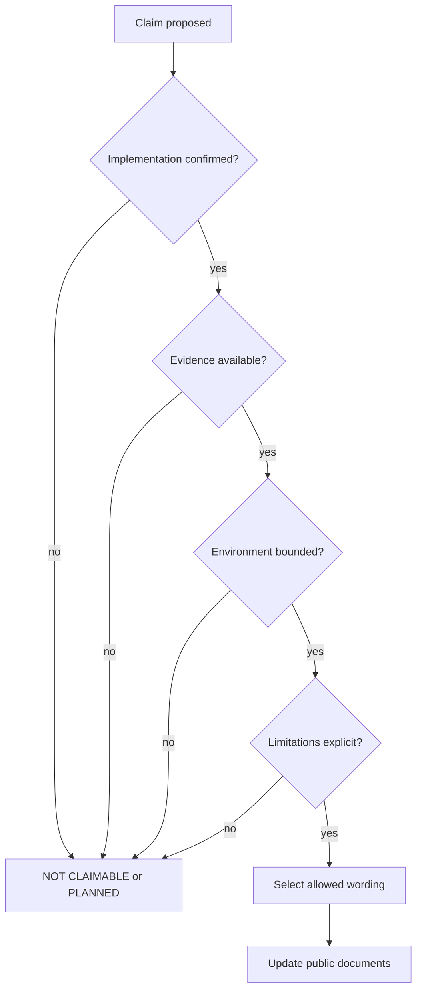

<!--
© Artur Czarnecki. All rights reserved.
Intergrax is source-available under the Intergrax Evaluation and Collaboration License 1.0.
See LICENSE for permitted evaluation, collaboration, and contribution use.
-->

# Intergrax Public Proof and Claims Model

Canonical maintainer-facing contract for public proof status, evidence requirements, claim qualification, and proof promotion rules.

**Public dashboard:** [`../../../../docs/project/proofs/PROOFS.md`](../../../../docs/project/proofs/PROOFS.md)

This document owns:

- public status vocabulary;
- evidence requirements;
- claim qualification;
- proof promotion rules;
- source ownership;
- public update rules;
- README capability-discovery rules;
- README performance-promotion rules;
- accepted-evidence propagation workflow.

It does **not** replace:

- implementation plans;
- architecture canon;
- test suites;
- proof evidence artifacts;
- current LKW implementation task status;
- current Token Optimization phase status;
- implementation dependencies;
- active review-fix state;
- next implementation task;
- a mirror of any technical roadmap;
- `LICENSE`;
- `../../community/COLLABORATION.md`.

---

## 1. Why this model exists

Public documentation must let a first-time visitor distinguish:

```text
implemented mechanism
bounded proof
partial capability
planned capability
unsupported claim
```

Without this separation, readers confuse design agreement, unit-test contracts, bounded live proof, product completeness, and market validation. Public proof information must be **truthful**, **evidence-linked**, **visually clear**, **easy to scan**, and **explicit about limitations**.

---

## 2. Five public statuses

Use exactly these labels. Visual legend may pair symbols (✅ 🧪 🟡 🗓️ ⛔); **text labels are authoritative**.

### IMPLEMENTED

Use only when:

- a concrete mechanism exists;
- relevant bounded tests or accepted implementation evidence exist;
- the claim describes only the implemented mechanism;
- no live, product, or production validation is implied.

### BOUNDED PROOF

Use only when:

- the proof was actually executed;
- the environment, provider, model, operating system, or workload is named;
- evidence is available;
- limitations are stated;
- wording does not generalize beyond the proof scope.

### PARTIAL

Use when:

- some slices are implemented;
- the end-to-end capability or product result is incomplete;
- a required dependency, integration, or validation gate remains open.

### PLANNED

Use when:

- architecture or scheduling exists;
- runtime behavior, proof, or integration is not yet available.

Accepted architecture alone does **not** make a capability implemented.

### NOT CLAIMABLE

Use when:

- no evidence supports the claim;
- wording would generalize beyond bounded evidence;
- product or commercial validation is incomplete;
- the claim is explicitly blocked by current guardrails.

---

## 3. Evidence hierarchy

```text
architecture/design
→ implementation and tests
→ bounded live proof
→ product workflow proof
→ real-user validation
→ commercial validation
```

Each level does **not** automatically imply the next.

| Level | Proves | Does not prove |
|-------|--------|----------------|
| Architecture / design | Design agreement | Runtime behavior |
| Implementation + tests | Bounded contract | Live or product validation |
| Bounded live proof | Named environment behavior | Universal or production behavior |
| Product workflow proof | End-to-end product slice | Commercial readiness |
| Real-user validation | Observed user outcomes | Universal savings or SLA |
| Commercial validation | Market and business proof | Technical mechanism correctness |

**Frozen rule:**

```text
implemented code
≠ live proof
≠ product validation
≠ commercial validation
≠ production readiness
```

An accepted commit or passing unit test proves only its bounded contract. An architecture document proves design agreement, not runtime behavior. A live proof applies only to its named environment and workload.

---

## 4. Claim anatomy

Every positive public claim must include or be traceable to:

| Dimension | Requirement |
|-----------|-------------|
| **Subject** | What component or proof path |
| **Exact capability** | What behavior is claimed |
| **Status** | One of the five canonical labels |
| **Evidence** | Test, proof artifact, or accepted implementation record |
| **Environment or workload** | Named when proof-level |
| **Limitation** | What the claim does not cover |
| **Verification path** | Link or command for independent check |
| **Prohibited generalization** | What readers must not infer |

Every canonical proof row must distinguish:

```text
implementation state
proof state
public status label
evidence
limitation
allowed public wording
```

Do not collapse all maturity into one status.

---

## 5. Proof promotion decision



When sources disagree, apply **claim audit rules** (§11): use the lower supported claim; never infer completion from architecture acceptance.

---

## 6. LKW classification rules

| Item | Contract |
|------|----------|
| Public role | LKW is the Active reference product |
| Overall public classification | PARTIAL |
| Product maturity | Backend Product Alpha / MVP |
| Accepted proof owner | `../../../../applications/local_workspace_application/docs/proof/LKW_PLATFORM_PROOF.md` and referenced evidence |
| Detailed implementation owner | `applications/local_workspace_application/docs/IMPLEMENTATION_PLAN.md` |
| Public claim snapshot | `../../../../docs/project/proofs/PROOFS.md` |
| Non-duplication rule | Current tasks, slices, dependencies and next steps remain only in the implementation plan |

**LKW product identity ≠ LKW proof/evidence paths.** The Active reference product role
describes LKW as a product entry - not a proof classification. Accepted LKW proof
documents (for example `LKW_PLATFORM_PROOF.md` and referenced bounded paths) provide
technical evidence; they do not substitute for LKW product identity.

The implementation plan may advance without changing `../../../../docs/project/proofs/PROOFS.md`.

A `../../../../docs/project/proofs/PROOFS.md` update is required only when accepted evidence
or the allowed public claim changes.

### LKW Hybrid Ask claim boundary

```text
accepted indexed Ask through production Hybrid Ask
≠
complete Hybrid Ask combining indexed + live evidence
```

The accepted indexed evidence branch of production Hybrid Ask - through the documented Web URL / real-RAG product proof - does **not** establish:

- complete live-provider access;
- Hybrid Ask combining indexed and authorized live evidence in one answer;
- complete multi-source Hybrid Ask behavior;
- production readiness;
- real-user validation;
- commercial validation.

Do not promote from architecture status alone. Contributors must not interpret the accepted indexed branch as proof of live-provider completeness, mixed-evidence completion, full multi-source behavior, or production readiness.

---

## 7. Token Optimization classification rules

| Item | Contract |
|------|----------|
| Public role | Token Optimization is the Featured platform-capability proof |
| Overall public classification | PARTIAL |
| Accepted proof owner | Token Optimization proof documents and owning guide |
| Detailed implementation owner | `docs/project/capabilities/plan/TOKEN_OPTIMIZATION.md` |
| Public claim snapshot | `../../../../docs/project/proofs/PROOFS.md` |
| Claim guardrails | `../../capabilities/TOKEN_OPTIMIZATION_CLAIMS.md` |
| Non-duplication rule | Current phases, subphases, dependencies and review states remain only in the implementation plan |

Stable public boundaries:

- A named provider proof does not establish provider-independent behavior.
- Implementation does not establish universal savings.
- Implementation does not establish production-proven savings.
- Public promotion requires accepted evidence and explicit limitations.

For a durable in-cache compaction mechanism, public wording may describe an
implemented bounded mechanism only when the evidence supports that bounded
scope. Live provider-wide proof remains incomplete, production rollout remains
incomplete, rollback execution remains incomplete, and numeric savings are not
claimed.

---

## 8. README discovery versus performance promotion

### Allowed before performance promotion

A neutral root README capability mention and main-guide link are allowed when:

- no numeric savings are used;
- no universal performance claim is used;
- current status is qualified;
- bounded-proof language is preserved;
- The bounded mechanism may be described as IMPLEMENTED only with its exact limitation.
- README must not present complete live-provider, provider-wide, rollback, production-rollout or generally available durable compaction behavior.

### Outcome-based promotion gates

Performance promotion is gated by:

- accepted cross-provider proof;
- final claim review;
- checked-in public evidence;
- explicit limitation and promotion approval.

The following remain prohibited:

- performance or savings badges;
- percentage-reduction headlines;
- universal token or cost claims;
- production-proven savings;
- promotion of universal proof results;
- provider-independent generalization from a named proof.

Frozen boundary:

```text
Bounded implementation claim
≠ BOUNDED LIVE PROOF
≠ production capability
```

Detail: [`../../capabilities/TOKEN_OPTIMIZATION_CLAIMS.md`](../../capabilities/TOKEN_OPTIMIZATION_CLAIMS.md) § README discovery and promotion boundary.

---

## 9. Public update workflow

```text
Detailed implementation change
→ update only the owning implementation roadmap

Accepted evidence change
→ update the owning proof
→ update PUBLIC_PROOF_AND_CLAIMS_MODEL.md when the allowed claim changes
→ update docs/project/proofs/PROOFS.md
→ update affected overview documents only when their summary becomes inaccurate

Roadmap or owner-link change
→ update the affected link
→ do not copy the roadmap state
```

A routine implementation-task transition does not trigger
a repository-wide public-document status update.

---

## 10. Source-of-truth boundaries

| Topic | Owner |
|-------|-------|
| Public proof dashboard | `../../../../docs/project/proofs/PROOFS.md` |
| Status vocabulary and promotion rules | this document |
| Detailed LKW implementation progress | `applications/local_workspace_application/docs/IMPLEMENTATION_PLAN.md` |
| Detailed Token Optimization implementation progress | `docs/project/capabilities/plan/TOKEN_OPTIMIZATION.md` |
| Accepted LKW proof | `../../../../applications/local_workspace_application/docs/proof/LKW_PLATFORM_PROOF.md` and referenced evidence |
| Accepted Token Optimization proof | owning proof documents and guide |
| Token Optimization guide | `docs/project/capabilities/token_optimization/README.md` |
| Token Optimization claim guardrails | `../../capabilities/TOKEN_OPTIMIZATION_CLAIMS.md` |
| Public reader navigation | `docs/project/community/PUBLIC_DOCUMENTATION_MAP.md` |
| Public documentation architecture | `PUBLIC_DOCUMENTATION_ARCHITECTURE.md` |
| Public positioning | `../../overview/INTERGRAX_PUBLIC_POSITIONING.md` |

---

## 11. Claim audit rules

When sources disagree:

1. The owning current implementation plan determines implementation phase.
2. A proof evidence artifact determines whether bounded proof exists.
3. Public docs must use the **lower** supported claim.
4. Never infer completion from architecture acceptance.
5. Never infer commercial or real-user validation from technical proof.
6. Never infer provider-independent behavior from one provider proof.
7. Never infer production readiness from unit or integration tests.
8. Record only contradictions that affect an active public claim decision.

Do not silently choose the more promotional interpretation.

### Promotion-time conflict handling

1. Inspect the current owning implementation roadmap.
2. Inspect accepted proof evidence.
3. Never promote a claim from roadmap status alone.
4. Use the lower supported public claim when sources disagree.
5. Block public promotion until the owning sources are reconciled.
6. Do not copy transient task conflicts into `../../../../docs/project/proofs/PROOFS.md`.
7. Record only contradictions that affect an active public claim decision.

---

## 12. Executable public proof binding

1. Public documentation owners own claim wording and placement.
2. The canonical manifest (`scripts/proof/intergrax_proof_manifest.py`) owns executable proof identity and execution metadata.
3. A significant public claim presented as executable evidence must reference the exact supporting `proof_id` through **`Proof:`** or **`Proofs:`**.
4. Proof semantics must cover claim wording. An existing or eligible proof is not automatically evidence for any nearby claim.
5. `public_evidence_eligible=True` means the proof may be referenced from public evidence surfaces - not that the proof automatically proves adjacent prose.
6. The capability under claim must not be replaced by a fake or mock. Deterministic fixtures are acceptable only when they do not substitute the capability being claimed.
7. Public docs do not store current execution PASS/FAIL. Current execution status belongs to the runner and receipts.
8. Commands, profiles, environment requirements, and safety metadata belong to the canonical manifest - not duplicated public prose.
9. Never invent `proof_id` in documentation. If no sufficient proof exists, narrow or remove the claim, or record the evidence gap through normal planning/review.
10. Live, external, or provider claims require evidence at the corresponding real boundary.
11. The public-proof-reference validator is **structural**. It does not validate semantic claim↔proof matching.
12. Semantic mapping remains protected through human review plus bounded contract tests for critical claims.

---

## 13. Receipt hierarchy

Two receipt families coexist by design:

| Receipt | Role | Not |
|---------|------|-----|
| **`SuiteReceipt`** (`intergrax.proof_suite_receipt.v1`) | Execution record from the canonical proof-suite runner (`.artifacts/proof/*.json`) | Public claim registry or current documentation status |
| **`ProofReceipt`** (`intergrax/proofs/receipts`) | Domain-specific evidence artifact persisted by certain platform/LKW proofs (for example MongoDB-backed workload receipts) | Canonical suite receipt or public claim status |

Do not merge these systems. Historical evidence ownership stays with the receipt type that produced it.

---

## 14. Duplicate proof references

The structural validator allows the same `proof_id` in multiple public gateway documents.

- Cross-document reuse is allowed when each reference is intentional.
- Duplicate references within one document are reported in the validator output but do **not** fail validation.
- Duplicates are informational only unless paired with a separate semantic review finding.

---

## 15. Proof suite profiles

`quick`, `full`, and `live` are **execution-selection profiles** in `scripts/proof/intergrax_proof_runner.py`. They are not evidence-strength levels (weak / medium / strong).

| Profile | Selection semantics |
|---------|---------------------|
| `quick` | Fast local proofs registered for the quick profile |
| `full` | Includes `quick` plus additional locally executable proofs for the current machine |
| `live` | Includes `full` plus external-provider and other live-profile proofs |

`live` does not mean “external provider only.” It expands the selected proof set. Missing optional credentials may yield `PASS_WITH_BLOCKED` on the `live` profile when no child proof actually failed.

---

## 16. Partial vs full proof lists

- Root `README.md` may expose a reader-oriented **subset** of proof references.
- `docs/project/proofs/PROOFS.md` may expose a fuller capability-specific evidence map.
- Neither list replaces the canonical manifest. Documents need not repeat every `proof_id`.
