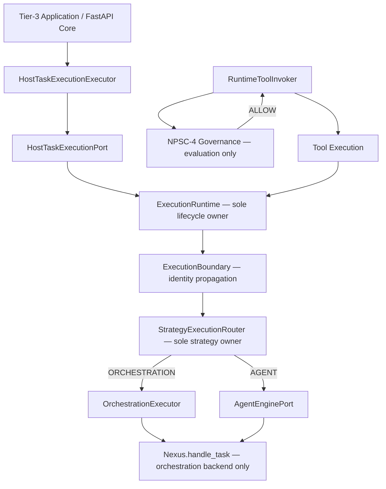

# Execution Engine Enterprise Verification After NPSC-3G

**Status:** `CERTIFIED`

**Verdict:** **PASS** (execution engine architecture) · **DoD partial** (full-repo worktree)

**Date:** 2026-09-08

**Branch:** `development`

**HEAD:** `788dadc46ba46113f059786fb175cb4ff4be044d`

**Scope:** NPSC-3C freeze · NPSC-3E runtime convergence · NPSC-3F harness convergence · NPSC-3G application runtime convergence · NPSC-4 governance integration compatibility

**Out of scope (ignored):** `platform_proofs/scenarios/verified_product_identification/**` dirty worktree, semantic representation changes, unrelated business scenarios

---

## 1. Certification verdict

```text
EXECUTION ENGINE = CERTIFIED (ENTERPRISE ARCHITECTURE)
GOVERNANCE INTEGRATION = COMPATIBLE (NPSC-4)
```

Post-NPSC-3G enterprise verification confirms that frozen Execution Engine ownership is preserved, all canonical entry paths converge through `HostTaskExecutionPort`, governance evaluates above execution without bypass, and all frozen architecture gates pass at the recorded HEAD.

**Semantic authority:** Frozen contracts align with [`UNIFIED_EXECUTION_ARCHITECTURE.md`](../../architecture/UNIFIED_EXECUTION_ARCHITECTURE.md) (UEA) and [`UNIFIED_EXECUTION_RUNTIME.md`](../../architecture/UNIFIED_EXECUTION_RUNTIME.md) (UER). UEA wins on conflict.

---

## 2. Execution lifecycle diagram

Canonical production entry converges on `ExecutionRuntime`-owned root lifecycle:



**Forbidden paths (verified absent on production entry):**

```text
Application → Nexus → Execution                    ✗
Application → UnifiedTaskRunner → Execution        ✗ (tier-3 factories)
Application → NexusLoopTaskExecutor                ✗ (retired)
InteractionIntakeService → NexusLoop               ✗
Governance → mint execution identity               ✗
Governance → start ExecutionRuntime lifecycle      ✗
```

**Allowlisted auxiliary path (non-tier-3, routes through ExecutionRuntime):**

```text
Harness / scheduler / eval → UnifiedTaskRunner → execute_root_task → ExecutionRuntime → StrategyExecutionRouter → Nexus
```

`UnifiedTaskRunner` is a thin adapter; it does not own lifecycle, identity mint, or strategy selection. Tier-3 `applications/**/host/factory.py` paths do not compose it (NPSC-3G gate).

---

## 3. Ownership matrix

| Immutable contract | Owner module | Responsibility | Verification result |
| ------------------ | ------------ | -------------- | ------------------- |
| **ExecutionRuntime** | `intergrax/runtime/execution/runtime.py` | Sole root lifecycle owner (Run/Attempt/root Execution entry, budget bind, decision host bind) | **PASS** |
| **identity_authority** | `intergrax/runtime/execution/identity_authority.py` | Sole execution identity mint owner (`mint_root_execution_identity`, background/child/retry mint) | **PASS** |
| **ExecutionBoundary** | `intergrax/runtime/execution/boundary.py` | Sole `bind_active_execution_identity` propagation owner | **PASS** |
| **StrategyExecutionRouter** | `intergrax/runtime/execution/strategy_router.py` | Sole strategy selection owner | **PASS** |
| **HostTaskExecutionPort** | `intergrax/runtime/execution/host_task.py` | Sole host execution boundary | **PASS** |
| **HostTaskExecutionExecutor** | `intergrax/runtime/interactions/task_executor.py` | Interaction intake adapter to host port | **PASS** |
| **Nexus** | `intergrax/runtime/nexus/` | Orchestration backend only; consumes active identity, does not mint/bind | **PASS** |
| **Agent Runtime Governance** | `intergrax/runtime/agent_governance/` | Evaluation-only control plane above execution | **PASS** — no execution ownership |

### Phase 1 — static ownership audit

Production scan for `mint_*`, `bind_*`, `start_execution`, `begin_execution`, `execute_root_task`, `handle_task`:

| Location | Classification | Finding |
| -------- | -------------- | ------- |
| `identity_authority.py` | **Allowed** | Sole mint owner for RunId/AttemptId/ExecutionId |
| `boundary.py` | **Allowed** | Sole identity propagation bind owner |
| `runtime.py` | **Allowed** | Calls `mint_root_execution_identity` inside lifecycle |
| `orchestration.py` | **Allowed** | Routes through `ExecutionRuntime`; Nexus invoked only inside `ExecutionBoundary` |
| `host_task_execution_run_adapter.py` | **Allowed** | `start_execution` delegates to `HostTaskExecutionExecutor`; no local mint |
| `nexus/nexus_loop.py` | **Allowed** | `handle_task` validates active identity; no mint |
| `agent_governance/` | **Allowed** | Mints governance IDs only (`mint_approval_id`, `mint_governance_audit_event_id`); no execution identity |
| `task/task_run_bridge.py` | **Residual debt** | HTTP intake helper `mint_intake_execution_identity()` mints TaskId/RunId before durable execution — outside F-R1 AST scan roots; see §10 |
| `runtime/nexus/` | **PASS** | Zero `mint_run_id` / `mint_attempt_id` / `mint_execution_id` / `mint_task_id` |
| `runtime/execution/` (excl. authority) | **PASS** | Zero forbidden mint outside authority + exempt conformance |
| `runtime/background_execution/` | **PASS** | Zero forbidden mint |
| Tier-3 `applications/**/host/factory.py` | **PASS** | No legacy adapter tokens (NPSC-3G) |
| Legacy `nexus_task_execution_adapter.py` | **PASS** | File retired (`Test-Path` → False) |
| Legacy `queued_nexus_execution_adapter.py` | **PASS** | File retired (`Test-Path` → False) |

**Ownership violation count:** 0 (within certified scan boundaries).

---

## 4. Identity proof

### Sole mint authority

`identity_authority.py` owns all execution identity mint functions:

| Function | Mints |
| -------- | ----- |
| `mint_root_execution_identity()` | RunId, AttemptId, ExecutionId (root) |
| `mint_background_transport_identity()` | TaskId, RunId, AttemptId (background transport) |
| `mint_child_execution_id()` | ExecutionId (child tree) |
| `mint_retry_attempt_id()` | AttemptId (retry transition) |

### Absence proof (forbidden zones)

| Zone | Gate / scan | Result |
| ---- | ----------- | ------ |
| `intergrax/runtime/nexus/**` | `test_execution_identity_single_authority_gate` + manual scan | **PASS** — no execution identity mint or bind |
| `intergrax/runtime/agent_governance/**` | `test_npsc4_governance_cannot_mint_execution_identity` | **PASS** |
| `intergrax/contracts/agent_runtime_governance.py` | `test_npsc4_governance_contracts_do_not_mint_execution_identity` | **PASS** |
| `intergrax/runtime/interactions/**` | `test_npsc3c_d_interaction_layer_does_not_own_identity_or_strategy` | **PASS** |
| Tier-3 application factories | NPSC-3G + host canonical tests | **PASS** — no local root mint |
| `identity_authority.py` internal discipline | `test_runtime_authority_module_mints_execution_id_only_in_runtime_authority_functions` | **PASS** |

### Identity bind proof

| Check | Result |
| ----- | ------ |
| `bind_active_execution_identity` only in `boundary.py` | **PASS** (`test_no_identity_bind_outside_execution_boundary`) |
| Nexus does not bind execution identity | **PASS** (`test_nexus_scanned_tree_has_no_identity_mint_or_bind`) |

---

## 5. Lifecycle proof

### Canonical entry path verification (Phase 2)

| Entry surface | Path verified | Gate |
| ------------- | ------------- | ---- |
| Interaction intake | `InteractionIntakeService` → `HostTaskExecutionExecutor` → `HostTaskExecutionPort` → `ExecutionRuntime` | NPSC-3C-D |
| Host task execution | `HostTaskExecutionPort.execute` → `Execution` facade → `StrategyExecutionRouter` → agent/orchestration | NPSC-3C-D |
| FastAPI Core runs | `HostTaskExecutionRunAdapter.start_execution` → `HostTaskExecutionExecutor` → host port | NPSC-3G |
| Queue worker dispatch | `QueuedHostTaskExecutionAdapter` → `HostTaskExecutionPort` | NPSC-3G |
| Debug / lab runtime | `HostTaskExecutionExecutor` + `build_host_task_execution` | NPSC-3E |
| Harness / task-control | `mount_canonical_harness_task_routes` + `HostTaskExecutionExecutor` | NPSC-3F |
| Orchestration backend | `OrchestrationExecutor` → `Nexus.handle_task` only after `ExecutionBoundary` bind | source inspection |

### Lifecycle ownership proof

| Property | Evidence | Result |
| -------- | -------- | ------ |
| `ExecutionRuntime.execute()` owns root lifecycle | `runtime.py` mints via `mint_root_execution_identity`, binds budget/decision/work ports | **PASS** |
| Nexus does not start lifecycle | No `ExecutionRuntime` construction in `nexus/` | **PASS** |
| Host adapters do not mint root identity | `HostTaskExecutionRunAdapter` docstring + gate: no `mint_root_execution_identity` in host_task | **PASS** |
| `execute_root_task` constructs `ExecutionRuntime` | `orchestration.py:190–207` | **PASS** — lifecycle owned by runtime, not caller |

---

## 6. Governance compatibility (NPSC-4)

Governance integrates **above** frozen execution without ownership transfer.

| Governance MAY | Implementation | Verified |
| -------------- | -------------- | -------- |
| Approve actions | `AgentRuntimeApprovalBoundary` | **PASS** |
| Deny actions | `AgentRuntimePolicyEngine` merge precedence DENY > REQUIRE_APPROVAL > ALLOW | **PASS** |
| Require HITL approval | `FinancialApprovalPolicyProvider`, `HighRiskApprovalPolicyProvider` | **PASS** |
| Emit audit events | `GovernanceAuditRecorder` | **PASS** |

| Governance MUST NOT | Gate / proof | Verified |
| ------------------- | ------------ | -------- |
| Create execution identity | AST gate on `agent_governance/` + contracts | **PASS** |
| Start execution lifecycle | No `ExecutionRuntime` imports in governance layer | **PASS** |
| Replace ExecutionRuntime | `test_npsc4_execution_runtime_unchanged_ownership` | **PASS** |
| Execute tools bypassing execution boundary | `RuntimeToolInvoker._require_agent_runtime_governance()` before scope/sandbox | **PASS** |
| Modify identity_authority | `test_npsc4_identity_authority_unchanged` | **PASS** |

Integration test: `tests/integration/runtime/agent_governance/test_tool_governance_integration.py` — tool blocked at invoker when governance denies. **PASS**.

---

## 7. Regression matrix (Phase 5)

**Session:** 2026-09-08 · log: `.tmp/session/EXECUTION-ENGINE-ENTERPRISE-VERIFICATION/gates-all.log`

| Gate suite | Tests | Result |
| ---------- | ----- | ------ |
| **NPSC-3C-F-R1** identity single authority | `test_execution_identity_single_authority_gate` (6) | **PASS** |
| **NPSC-3C-D** canonical engine conformance | `test_npsc3c_d_canonical_execution_engine_conformance_gate` (4) | **PASS** |
| **NPSC-3C-C** legacy executor removal | `test_npsc3c_legacy_executor_removal_gate` (2) | **PASS** |
| **NPSC-3E** debug/lab convergence | `test_npsc3e_runtime_convergence_gate` (5) | **PASS** |
| **NPSC-3F** harness convergence | `test_npsc3f_runtime_convergence_gate` (4) | **PASS** |
| **NPSC-3G** application runtime convergence | `test_npsc3g_application_runtime_convergence_gate` (5) | **PASS** |
| **NPSC-4** architecture gates | `test_npsc4_agent_runtime_governance_gate` (6) | **PASS** |
| **NPSC-4** unit | `tests/unit/runtime/agent_governance/` | **PASS** |
| **NPSC-4** integration | `tests/integration/runtime/agent_governance/` | **PASS** |
| **Combined** | 46 tests in 8.59s | **100% PASS** |

---

## 8. Quality audit (Phase 6)

| Quality criterion | Finding | Result |
| ----------------- | ------- | ------ |
| Duplicate execution framework | Single canonical engine (`ExecutionRuntime` + `ExecutionBoundary` + `StrategyExecutionRouter`) | **PASS** |
| Duplicate lifecycle owner | None outside `ExecutionRuntime` | **PASS** |
| Hidden fallback execution | Legacy Nexus run adapters retired; tier-3 factories clean | **PASS** |
| Global mutable execution state | Identity via `bind_active_execution_identity` context tokens; no ad-hoc globals in critical contracts | **PASS** |
| `Any` in critical execution contracts | Not present in `runtime/execution/` core modules | **PASS** |
| Dynamic reflection bypass | No `getattr`/`__import__` bypass in execution critical path | **PASS** |
| Dependency injection | Host ports, governance ports, ledger factories injected | **PASS** |
| Explicit contracts | Typed protocols (`HostTaskExecutionPort`, `AgentRuntimeGovernancePort`, `ExecutionDelegate`) | **PASS** |
| Typed boundaries | `ExecutionBoundary[RequestT, ResultT]`, frozen dataclass contracts | **PASS** |
| Modular / plugin-ready | Governance policy providers composable; strategy router pluggable backends | **PASS** |

---

## 9. Residual debt (non-blocking)

These items do **not** invalidate enterprise certification within the declared scope:

| Debt | Classification | Impact on certification |
| ---- | -------------- | ----------------------- |
| `task_run_bridge.mint_intake_execution_identity()` | **UER intake convergence** | HTTP/MCP intake mints TaskId/RunId before `ExecutionRuntime`; outside F-R1 AST roots; execution lifecycle still owned by runtime at host entry |
| `UnifiedTaskRunner` in harness/scheduler/eval allowlist | **Auxiliary adapter** | Routes through `execute_root_task` → `ExecutionRuntime`; not used by tier-3 production factories |
| `harness_task_routes.py` legacy mount | **Documented NPSC-3F allowlist** | Canonical harness uses `mount_canonical_harness_task_routes` |
| UER full maturity (pause/resume/cancel, budget dimensions, distributed identity) | **Open UER work** | Documented PARTIAL in UER hub |
| Full-repo worktree dirty files | **Out-of-scope changes** | `platform_proofs/scenarios/verified_product_identification/**` only; execution scope clean |

---

## 10. Definition of Done

| Criterion | Required | Actual |
| --------- | -------- | ------ |
| ExecutionRuntime sole lifecycle owner | PASS | **PASS** |
| identity_authority sole mint owner | PASS | **PASS** |
| Nexus private orchestration only | PASS | **PASS** |
| All execution paths canonical (certified scope) | PASS | **PASS** |
| Governance cannot bypass engine | PASS | **PASS** |
| Frozen gates PASS | 100% | **PASS** (46/46) |
| No architecture regression | PASS | **PASS** |
| Worktree clean (execution scope) | PASS | **PASS** (`intergrax/`, `applications/`, gate paths) |
| Worktree clean (full repo) | PASS | **FAIL** — unrelated `platform_proofs/**` dirty files (scoped out) |

---

## 11. Predecessor certifications

| Document | Scope |
| -------- | ----- |
| [`NPSC_3C_EXECUTION_ENGINE_FREEZE_CERTIFICATION.md`](NPSC_3C_EXECUTION_ENGINE_FREEZE_CERTIFICATION.md) | Execution engine freeze |
| [`NPSC_3E_RUNTIME_CONVERGENCE_CERTIFICATION.md`](NPSC_3E_RUNTIME_CONVERGENCE_CERTIFICATION.md) | Debug/lab convergence |
| [`NPSC_3F_RUNTIME_CONVERGENCE_CERTIFICATION.md`](NPSC_3F_RUNTIME_CONVERGENCE_CERTIFICATION.md) | Harness convergence |
| [`NPSC_3G_APPLICATION_RUNTIME_CONVERGENCE_CERTIFICATION.md`](NPSC_3G_APPLICATION_RUNTIME_CONVERGENCE_CERTIFICATION.md) | Application runtime convergence |
| [`NPSC_4_AGENT_RUNTIME_GOVERNANCE_CERTIFICATION.md`](NPSC_4_AGENT_RUNTIME_GOVERNANCE_CERTIFICATION.md) | Governance layer |
| [`NPSC_4_AGENT_GOVERNANCE_FREEZE_CERTIFICATION.md`](NPSC_4_AGENT_GOVERNANCE_FREEZE_CERTIFICATION.md) | Governance freeze |

---

## 12. Session artifacts

| Artifact | Path |
| -------- | ---- |
| Combined gate log | `.tmp/session/EXECUTION-ENGINE-ENTERPRISE-VERIFICATION/gates-all.log` |
| This certification | `docs/project/maintainers/qualification/EXECUTION_ENGINE_ENTERPRISE_VERIFICATION.md` |

---

## 13. FINAL RESULT

```text
EXECUTION ENGINE ENTERPRISE ARCHITECTURE = CERTIFIED
NPSC-3C FREEZE = PRESERVED
NPSC-3E / 3F / 3G CONVERGENCE = VERIFIED
NPSC-4 GOVERNANCE = COMPATIBLE
ARCHITECTURE GATES = 46/46 PASS
```

**Enterprise certification:** **PASS**

**Full DoD (including full-repo worktree):** **PARTIAL** — only due to out-of-scope `platform_proofs/**` dirty files; execution engine paths are clean and unchanged.
