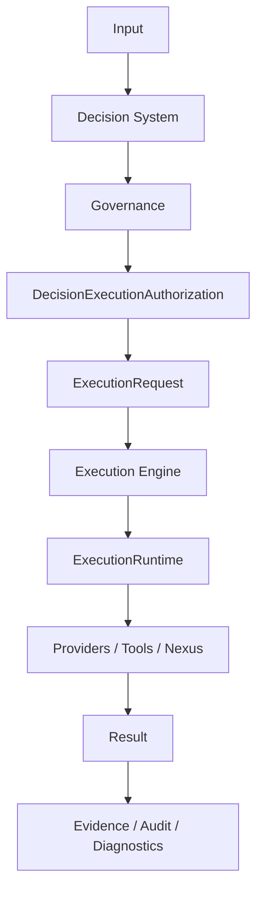

# INTEGRAx-CORE-PLATFORM-FREEZE

## Metadata

| Field | Value |
| ----- | ----- |
| **Task** | `INTEGRAx-CORE-PLATFORM-FREEZE` |
| **Date** | 2026-09-13 |
| **Branch** | `development` |
| **Frozen baseline SHA** | `009ad0c62ba6afbd07a7e4f2dbe8b4bbbab1d2c6` |
| **Parent certification closure SHA** | `ca9af5d9dd594e6cff9e6a16dcdbe2004545fa8e` (`INTEGRAx-POST-CERTIFICATION-DOCUMENTATION-CONSISTENCY-CLOSURE`) |
| **Final platform certification record** | [`INTEGRAX_FINAL_PLATFORM_CERTIFICATION.md`](INTEGRAX_FINAL_PLATFORM_CERTIFICATION.md) (anchor commit `572b49374532fb54edf25c30380cd954707e4351`) |
| **Freeze record commit** | See git log for commit with message `INTEGRAx-CORE-PLATFORM-FREEZE` (documentation only; does not alter frozen code baseline above) |

**Status:** **Certified Core Platform = FROZEN**

This record is the **single** maintainer anchor for core-platform freeze boundaries. It does not freeze the whole Integrax product roadmap—only the **certified enterprise core** (Decision + governed authorization + canonical Execution + cross-platform integration boundaries evidenced in final certification).

**Operator reconciliation note:** The last operator-named acceptance SHA before this task was `ca9af5d9…`. Commits `de575ed90b47deb9ee05a908ae41cf5b8c47d3dd` and `009ad0c62ba6afbd07a7e4f2dbe8b4bbbab1d2c6` landed on `development` after that closure. The frozen baseline SHA above is the **committed** `development` HEAD at freeze execution (excludes any uncommitted working-tree changes).

---

## Frozen scope

| Area | Frozen | Notes |
| ---- | ------ | ----- |
| **Decision System** | Yes | Canonical decision lifecycle, verification, deliberation, governance handoff, human review semantics, decision authorization boundary, decision evidence/correlation, integration boundary to Execution |
| **Governance** | Yes | Fail-closed disposition; execution blocked on DENY / REQUIRE_HUMAN |
| **Decision execution authorization** | Yes | `DecisionExecutionAuthorization` minted only on ALLOW; version-bound validation |
| **Execution Engine** | Yes | Canonical `ExecutionRuntime`, execution request boundary, lifecycle ownership, execution identity, strategy routing, execution work ports, Nexus/tool execution boundary, retry/recovery semantics (as qualified), reliability boundary (as qualified), execution evidence |
| **Cross-platform boundaries** | Yes | Decision → Governance → Authorization → ExecutionRequest → ExecutionRuntime → Providers/Tools/Nexus → Result → Evidence/Audit/Diagnostics; persistence abstraction; diagnostics vs observability ownership |
| **Platform plugins (Decision DS-PLUGIN)** | Yes | Extensibility contract; no second decision authority |
| **Composition roots (production)** | Yes | Production wiring ownership as certified; qualification roots remain non-production |

---

## Out-of-scope (evolution outside frozen core)

| Capability | Status | Reason |
| ---------- | ------ | ------ |
| **Autonomous Work / Virtual Workforce** | Not frozen as production core | Architecture/plan exist; not enterprise production-qualified as part of certified core |
| **Virtual Workforce marketplace / future marketplace** | Out of scope | Roadmap capability |
| **Incomplete knowledge / product verticals** (e.g. full LKW commercial validation) | Out of scope | Product proofs partial; separate from core freeze |
| **Future multi-host fleet topology** | Out of scope | Docker E2E qualifies containerized paths, not fleet deployment |
| **Future SaaS vendor qualifications** | Out of scope | Operator/vendor SLAs |
| **Multiplayer AI, Capability Catalog implementation breadth** | Out of scope | Strategic / planned; not certified core |
| **Whole Integrax product** | **Not** frozen | Only **Certified Core Platform** is frozen |

Future capabilities must evolve **outside** this freeze via plugins, providers, and explicit architecture tasks—without bypassing the canonical flow below.

---

## Canonical architecture (frozen flow)

```text
Input
  ↓
Decision System
  ↓
Governance
  ↓
DecisionExecutionAuthorization
  ↓
ExecutionRequest
  ↓
Execution Engine
  ↓
ExecutionRuntime
  ↓
Providers / Tools / Nexus
  ↓
Result
  ↓
Evidence / Audit / Diagnostics
```

No new capability may introduce a parallel path that skips Governance authorization or canonical Execution Engine ownership for root execution.



---

## Ownership table

| Layer | Owner |
| ----- | ----- |
| **Decision System** | Canonical decision authority |
| **Governance** | Execution authorization gate |
| **Execution Engine** | Canonical execution owner |
| **ExecutionRuntime** | Root runtime lifecycle owner |
| **Nexus / tools** | Controlled side-effect execution |
| **Persistence providers** | Storage implementations behind contracts |
| **Observability** | Records execution truth |
| **Diagnostics** | Interprets evidence |
| **Qualification code** (`testing_support/**`, qualification compositions) | Proves behavior; does **not** own production semantics |

---

## Frozen invariants

| ID | Invariant |
| -- | --------- |
| **INV-1** | **Decision/Execution separation** — Decision System does not execute workloads. |
| **INV-2** | **Governance fail-closed** — `DENY` → no authorization → no execution; `REQUIRE_HUMAN` → no final authorization → no execution. |
| **INV-3** | **Canonical execution owner** — Every root execution passes through the canonical Execution Engine. |
| **INV-4** | **No parallel runtime** — No second runtime for the same root execution responsibility. |
| **INV-5** | **Contracts first** — Core depends on contracts/protocols, not vendor implementations. |
| **INV-6** | **Plugin extensibility** — New implementations attach via plugin/provider/composition root. |
| **INV-7** | **Persistence abstraction** — `Engine → Persistence Contract → Provider → Vendor`. |
| **INV-8** | **Identity authority** — Task/Run/Attempt/Execution identities are not locally redefined by other layers. |
| **INV-9** | **Evidence is not execution control** — Observability/evidence cannot become an alternate runtime. |
| **INV-10** | **Qualification is non-production** — `testing_support/**` is not a production implementation path. |

---

## Allowed evolution (without reopening freeze)

Permitted when invariants hold and regression gates pass:

- New plugin conforming to an existing contract
- New provider behind an existing port
- New model provider
- New persistence backend
- New audit sink
- New diagnostics observer
- New strategy plugin
- Bugfix without semantic change
- Performance optimization without contract/ownership change
- Documentation aligned with this record

Classify each change per **Change classification** below.

---

## Forbidden evolution (requires architecture task + re-certification)

- Change to public Decision contract
- Change to `ExecutionRequest`
- Change to `DecisionExecutionAuthorization`
- Change to lifecycle ownership
- New execution runtime for root execution
- New bypasses of canonical execution
- Change to persistence ownership semantics
- Change to identity authority
- New hidden service locators
- Direct vendor coupling in domain engines
- Removal of fail-closed governance
- Change to retry/recovery semantics (certified behavior)
- Change to audit/evidence authority
- Change to production composition ownership

---

## Change classification

| Class | Description | Requirements |
| ----- | ----------- | ------------ |
| **A — Safe extension** | Does not change contracts or core ownership (e.g. new provider → existing contract → composition root) | Regression gates |
| **B — Core-compatible change** | Changes core implementation, not semantics | Regression tests, architecture gates, audit trail |
| **C — Architecture change** | Changes ownership, contracts, lifecycle, execution path, or governance semantics | Explicit architecture task, **re-open freeze**, full or scoped re-certification |

---

## Required re-certification triggers

Full or partial re-certification is mandatory when any of the following change in production semantics or contracts:

- Decision contract
- Governance semantics
- Authorization contract (`DecisionExecutionAuthorization`)
- `ExecutionRequest`
- `ExecutionRuntime` ownership
- Execution identity authority
- Persistence authority
- Lifecycle semantics
- Retry/recovery semantics (qualified behavior)
- Audit/evidence semantics
- Production composition ownership

---

## Freeze enforcement gates (existing; no duplicate framework)

| Gate | Path |
| ---- | ---- |
| Decision contract architecture | `tests/unit/contracts/test_decision_contract_architecture_gates.py` |
| Decision DS-PLUGIN architecture | `tests/unit/runtime/architecture/test_ds_plugin_architecture_gates.py` |
| Execution bypass / unification | `tests/unit/runtime/architecture/test_platform_execution_unification_u5_final_zero_bypass.py` |
| Legacy execution retirement / routing | `tests/unit/runtime/architecture/test_ue_9d_legacy_execution_retirement_gate.py` |
| Execution Engine ownership (EE-A1) | `tests/unit/runtime/architecture/test_ee_a1_execution_engine_ownership_certification_gate.py` |
| Evidence must not control execution | `tests/unit/runtime/architecture/test_npsc5f_p0_execution_evidence_architecture_reconciliation.py` |
| Execution identity (concurrency slice) | `tests/unit/runtime/contracts/test_execution_identity_concurrency.py` |
| Decision documentation / roadmap SSOT | `tests/unit/docs/test_decision_system_roadmap_contract.py` |

---

## Evidence (parent qualifications)

| Record | Link |
| ------ | ---- |
| Final Platform Certification | [`INTEGRAX_FINAL_PLATFORM_CERTIFICATION.md`](INTEGRAX_FINAL_PLATFORM_CERTIFICATION.md) |
| Decision System closure | [`DS-E2E-15J-DECISION-SYSTEM-FINAL-ARCHITECTURE-CLOSURE.md`](DS-E2E-15J-DECISION-SYSTEM-FINAL-ARCHITECTURE-CLOSURE.md) |
| Docker E2E system qualification | [`DS-E2E-15J-DOCKER-E2E-SYSTEM-QUALIFICATION.md`](DS-E2E-15J-DOCKER-E2E-SYSTEM-QUALIFICATION.md) |
| Canonical execution Docker E2E | [`DS-E2E-15J-CANONICAL-EXECUTION-DOCKER-E2E-QUALIFICATION.md`](DS-E2E-15J-CANONICAL-EXECUTION-DOCKER-E2E-QUALIFICATION.md) |
| Execution Engine freeze | [`NPSC_3C_EXECUTION_ENGINE_FREEZE_CERTIFICATION.md`](NPSC_3C_EXECUTION_ENGINE_FREEZE_CERTIFICATION.md) |
| Post-cert documentation closure | Commit `ca9af5d9dd594e6cff9e6a16dcdbe2004545fa8e` |

---

## Branch policy (recommended; not CI enforcement)

- Core changes → explicit task id and change class (A/B/C)
- Class C → re-certification before merge
- Production execution bypass → prohibited
- Plugin additions → architecture gates in CI slices

---

## Limitations (observations)

Carried from final platform certification and closure records (non-blocking for freeze):

- Decision production qualification: **QUALIFIED WITH OBSERVATIONS** (fleet/vendor scope).
- L6 matrix Docker plane may use reference orchestration paths distinct from canonical `ExecutionRuntime` in some scenarios (two-plane model in DS-E2E-15J).
- Residual non-SSOT architecture neighbors may lag active SSOT until explicitly synced.
- Full `tests/unit` collection may include pre-existing failures outside certification gate slices.
- **Freeze execution:** Uncommitted working-tree changes were present when this record was authored; they are **not** part of `Frozen baseline SHA` above.

---

## Active platform status (post-freeze documentation)

```text
Decision System
= CLOSED

Execution Engine
= FROZEN

Certified Core Platform
= FROZEN

Future capabilities
= EVOLUTION OUTSIDE FROZEN CORE
```
