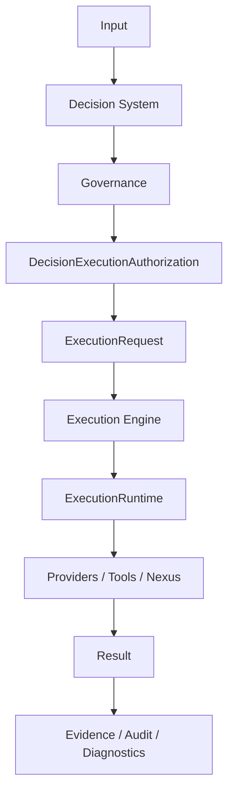

# INTEGRAx-CORE-PLATFORM-FREEZE

## Metadata

| Field | Value |
| ----- | ----- |
| **Task** | `INTEGRAx-CORE-PLATFORM-FREEZE` |
| **Date** | 2026-09-13 |
| **Branch** | `development` |
| **Frozen code baseline SHA** | `a185403d0c7524c29bea2fe09212f9508e6bccd8` (`feat(execution): EE-B1.1 reliability contracts and failure semantics`) |
| **Freeze evidence HEAD (repository tip immediately before freeze record commit)** | `8a05bb8fb87bd03894f0ae08b79a0dbdd8e6d4a4` (`certification(observability): finalize W5-H1 enterprise qualification` — qualification/docs only) |
| **Freeze record commit SHA** | `59fbf6f305b70d2b74adac7cd61dd21d352dba78` (`INTEGRAx-CORE-PLATFORM-FREEZE`, 2026-09-13) — **distinct from frozen code baseline SHA**; not the earlier prep-only record `2eb7cb463…` |
| **Freeze provenance correction** | [`INTEGRAX_CORE_PLATFORM_FREEZE_PROVENANCE_CORRECTION.md`](INTEGRAX_CORE_PLATFORM_FREEZE_PROVENANCE_CORRECTION.md) — corrected erroneous freeze evidence HEAD typo (`…e6bccd8` → `…e6d4a4`); baseline and freeze status unchanged |
| **Prior configuration-contract anchor (superseded for code baseline)** | `009ad0c62ba6afbd07a7e4f2dbe8b4bbbab1d2c6` |
| **Certified production chain** | `118798759e8a198b9a1d21ecd93293fe601fd7d9` → `fef16c3b951401e2222bc81769442f7150cad9fc` → `a185403d0c7524c29bea2fe09212f9508e6bccd8` |
| **Baseline selection** | [`INTEGRAX_FINAL_BASELINE_SELECTION.md`](INTEGRAX_FINAL_BASELINE_SELECTION.md) — **ACCEPTED** |
| **Parent certification closure SHA** | `ca9af5d9dd594e6cff9e6a16dcdbe2004545fa8e` |

**Status:** **Certified Core Platform = FROZEN**

Post-freeze evolution governed by: [`INTEGRAX_POST_FREEZE_EVOLUTION_GOVERNANCE.md`](INTEGRAX_POST_FREEZE_EVOLUTION_GOVERNANCE.md)

**Semantic distinction:**

| Term | Meaning |
| ---- | ------- |
| **Frozen code baseline SHA** | Audited production semantics frozen at `a185403d0…` — **not** repository `HEAD` unless they coincide by accident |
| **Freeze evidence / record commit SHA** | Maintainer SSOT update that **declares** freeze; may include docs-only commits after the code baseline |

This record is the **single** maintainer anchor for core-platform freeze boundaries. It does not freeze the whole Integrax product roadmap—only the **certified enterprise core** (Decision + governed authorization + canonical Execution + cross-platform integration boundaries evidenced in final certification).

---

## Certified chain (frozen body)

| SHA | Role | Verdict (SSOT) |
| --- | ---- | -------------- |
| `118798759e8a198b9a1d21ecd93293fe601fd7d9` | Tracing public contract hardening | **ACCEPT WITH OBSERVATIONS** (CLASS B) — [`INTEGRAX_POST_BASELINE_COMMITS_RECONCILIATION.md`](INTEGRAX_POST_BASELINE_COMMITS_RECONCILIATION.md) |
| `fef16c3b951401e2222bc81769442f7150cad9fc` | Nexus composition ownership | **ACCEPT WITH OBSERVATIONS** (CLASS B) — [`INTEGRAX_NEXUS_COMPOSITION_OWNERSHIP_SCOPED_AUDIT.md`](INTEGRAX_NEXUS_COMPOSITION_OWNERSHIP_SCOPED_AUDIT.md) |
| `a185403d0c7524c29bea2fe09212f9508e6bccd8` | EE-B1.1 reliability contracts | **SCOPED RECERTIFIED WITH OBSERVATIONS** (CLASS C scoped) — [`INTEGRAX_EXECUTION_RELIABILITY_CONTRACT_SCOPED_RECERTIFICATION.md`](INTEGRAX_EXECUTION_RELIABILITY_CONTRACT_SCOPED_RECERTIFICATION.md) |

Ancestry (verified at freeze execution):

```bash
git merge-base --is-ancestor a185403d0c7524c29bea2fe09212f9508e6bccd8 HEAD   # YES
git merge-base --is-ancestor 118798759e8a198b9a1d21ecd93293fe601fd7d9 a185403d0c7524c29bea2fe09212f9508e6bccd8  # YES
git merge-base --is-ancestor fef16c3b951401e2222bc81769442f7150cad9fc a185403d0c7524c29bea2fe09212f9508e6bccd8  # YES
```

---

## Post–baseline-selection commits (pre-freeze gate)

Commits after [`INTEGRAX_FINAL_BASELINE_SELECTION.md`](INTEGRAX_FINAL_BASELINE_SELECTION.md) anchor `5fb76805b58d7f4e362e841e124a7906136ceab0`:

| SHA | Type | Production semantics? | Audited? | Freeze impact |
| --- | ---- | --------------------: | -------: | ------------- |
| `8a05bb8fb87bd03894f0ae08b79a0dbdd8e6d4a4` | Qualification / evidence (W5-H1 observability) | **No** | N/A (docs-only) | Does **not** move frozen code baseline; eligible pre-freeze evidence |

**New unaudited production commit after selection:** **NONE** — formal freeze **not blocked**.

---

## Freeze scope

Formal freeze applies to:

- Decision System core
- Governance integration boundary
- `DecisionExecutionAuthorization`
- `ExecutionRequest` boundary
- Execution Engine canonical runtime (`ExecutionRuntime`)
- Plugin / DI contracts
- Persistence abstractions
- Tracing / public evidence contracts
- Reliability contract foundation (EE-B1.1 at frozen baseline)
- Nexus ownership boundaries
- Canonical Decision → Execution integration

**Excluded from freeze** (may evolve via frozen extension points): future cognitive layers, agents, new domain plugins, model/retrieval/storage providers, observability exporters, and future feature modules that attach through contracts/plugins/composition—not by rewriting frozen core ownership.

---

## Frozen scope (product areas)

| Area | Frozen | Notes |
| ---- | ------ | ----- |
| **Decision System** | Yes | Canonical decision lifecycle, verification, deliberation, governance handoff, human review semantics, decision authorization boundary, decision evidence/correlation, integration boundary to Execution |
| **Governance** | Yes | Fail-closed disposition; execution blocked on DENY / REQUIRE_HUMAN |
| **Decision execution authorization** | Yes | `DecisionExecutionAuthorization` minted only on ALLOW; version-bound validation |
| **Execution Engine** | Yes | Canonical `ExecutionRuntime`, execution request boundary, lifecycle ownership, execution identity, strategy routing, execution work ports, Nexus/tool execution boundary, retry/recovery semantics (as qualified), reliability boundary (as qualified), execution evidence |
| **Cross-platform boundaries** | Yes | Decision → Governance → Authorization → ExecutionRequest → ExecutionRuntime → Providers/Tools/Nexus → Result → Evidence/Audit/Diagnostics; persistence abstraction; diagnostics vs observability ownership |
| **Platform plugins (Decision DS-PLUGIN)** | Yes | Extensibility contract; no second decision authority |
| **Composition roots (production)** | Yes | Production wiring ownership as certified; qualification roots remain non-production |

---

## Out-of-scope (evolution outside frozen core)

| Capability | Status | Reason |
| ---------- | ------ | ------ |
| **Autonomous Work / Virtual Workforce** | Not frozen as production core | Architecture/plan exist; not enterprise production-qualified as part of certified core |
| **Virtual Workforce marketplace / future marketplace** | Out of scope | Roadmap capability |
| **Incomplete knowledge / product verticals** (e.g. full LKW commercial validation) | Out of scope | Product proofs partial; separate from core freeze |
| **Future multi-host fleet topology** | Out of scope | Docker E2E qualifies containerized paths, not fleet deployment |
| **Future SaaS vendor qualifications** | Out of scope | Operator/vendor SLAs |
| **Multiplayer AI, Capability Catalog implementation breadth** | Out of scope | Strategic / planned; not certified core |
| **Whole Integrax product** | **Not** frozen | Only **Certified Core Platform** is frozen |

Future capabilities must evolve **outside** this freeze via plugins, providers, and explicit architecture tasks—without bypassing the canonical flow below.

---

## Canonical architecture (frozen flow)

**Formal canonical Decision → Execution path (mandatory):**

```text
Decision
  → Governance
  → DecisionExecutionAuthorization
  → ExecutionRequest
  → ExecutionRuntime
```

No future extension may omit this path without **explicit architecture reopen** (Class C).

```text
Input
  ↓
Decision System
  ↓
Governance
  ↓
DecisionExecutionAuthorization
  ↓
ExecutionRequest
  ↓
Execution Engine
  ↓
ExecutionRuntime
  ↓
Providers / Tools / Nexus
  ↓
Result
  ↓
Evidence / Audit / Diagnostics
```



---

## Ownership table

| Layer | Owner |
| ----- | ----- |
| **Decision System** | Canonical decision authority |
| **Governance** | Execution authorization gate |
| **Execution Engine** | Canonical execution owner |
| **ExecutionRuntime** | Root runtime lifecycle owner |
| **Nexus / tools** | Controlled side-effect execution |
| **Persistence providers** | Storage implementations behind contracts |
| **Observability** | Records execution truth |
| **Diagnostics** | Interprets evidence |
| **Qualification code** (`testing_support/**`, qualification compositions) | Proves behavior; does **not** own production semantics |

---

## Nexus composition invariants (frozen)

| Rule | Statement |
| ---- | --------- |
| **Concrete `NexusLoop`** | Only at **true composition owners** (production roots), not shared wiring modules |
| **Shared U2/U4 wiring** | **Explicit dependencies** only — **not** a Nexus owner |
| **Residual imports** | Raw `NexusLoop` imports remain composition-owner allowlist only (NPSC-4.2 gate evidence) |

**Gate:** `tests/unit/runtime/architecture/test_npsc4_2_residual_compatibility_gate.py` — **PASS** at freeze execution.

---

## Frozen invariants (INV-1 … INV-10)

| ID | Invariant | Freeze verdict |
| -- | --------- | -------------- |
| **INV-1** | **Decision ≠ Execution** — Decision prepares and authorizes; Execution executes workloads | **PASS** |
| **INV-2** | **Governance fail-closed** — no authorization → no execution | **PASS** |
| **INV-3** | **Canonical execution owner** — `ExecutionRuntime` = root execution owner | **PASS** |
| **INV-4** | **No parallel runtime** — no second execution runtime / scheduler / loop for same root responsibility | **PASS** |
| **INV-5** | **Contracts first** — core depends on contracts/protocols, not concrete providers | **PASS** |
| **INV-6** | **Plugin extensibility** — new behavior via plugin/provider without canonical core rewrite | **PASS** |
| **INV-7** | **Persistence abstraction** — `core → persistence contract → provider → storage vendor` | **PASS** |
| **INV-8** | **Identity authority** — execution identities minted only through approved owners | **PASS** |
| **INV-9** | **Evidence ≠ control** — evidence/observability does not steer execution | **PASS** |
| **INV-10** | **Qualification ≠ production** — qualification harness is not runtime | **PASS** |

---

## Reliability invariants (REL-1 … REL-8)

Frozen with EE-B1.1 scoped recertification @ `a185403d0…`:

| ID | Invariant | Freeze verdict |
| -- | --------- | -------------- |
| **REL-1** | Reliability is **not** owner of execution | **PASS** |
| **REL-2** | Reliability is **not** a second retry engine | **PASS** |
| **REL-3** | Reliability is **not** the Recovery Plane | **PASS** |
| **REL-4** | Reliability does **not** take persistence ownership | **PASS** |
| **REL-5** | Mandatory evidence cannot silent-degrade | **PASS** |
| **REL-6** | Integrity failure = fail closed | **PASS** |
| **REL-7** | Shutdown contract does **not** create a new lifecycle owner | **PASS** |
| **REL-8** | Failure classifier is provider-neutral and replaceable | **PASS** |

---

## Persistence freeze rule (post-freeze)

Without formal architecture reopen, **forbidden**:

- Direct DB access inside engine/domain core
- Concrete vendor persistence in domain/core
- Hidden filesystem state for execution lineage
- Alternate lineage store bypass
- Alternate evidence persistence bypass

---

## Plugin rule (post-freeze)

New capability:

```text
Contract → Plugin/Provider → Composition
```

**Forbidden in core:** `if vendor == …` dispatch for behavior extension.

---

## DI rule (post-freeze)

Required:

- Explicit constructor/factory injection
- No global mutable service locator
- No hidden singleton owner of execution
- No dynamic dependency lookup for architectural dispatch

---

## Hard contract policy (post-freeze core contracts)

New or evolved **public** core contracts require:

- Typed models
- Explicit enums
- Protocols/interfaces
- Bounded values
- Deterministic serialization
- Fail-closed validation

**Forbidden** as public core contracts without documented exception:

```text
dict[str, Any]
```

---

## `getattr` / `setattr` policy (post-freeze)

```text
Reflective getattr/setattr for architectural dispatch = forbidden
```

**Allowed:** `object.__setattr__` only for internal normalization of frozen dataclass semantics when local and explicit.

---

## Change classification (post-freeze)

| Class | Description | Requirements |
| ----- | ----------- | ------------ |
| **A — Safe extension** | New plugin, provider, adapter, exporter through existing contracts; no ownership/contract change | Targeted regression gates |
| **B — Core-compatible change** | Core implementation change without public contract, ownership, canonical path, or lifecycle semantic change | Targeted tests, architecture gates, independent audit |
| **C — Architecture / contract evolution** | Changes public contract, lifecycle, identity authority, canonical execution ownership, governance, persistence authority, or Decision→Execution path | **Architecture Reopen Record** → scoped or full recertification |

---

## Architecture reopen policy

Every **Class C** change requires an **Architecture Reopen Record** containing:

- Reason and scope
- Affected invariants (INV / REL / Nexus / path)
- Migration plan
- Regression plan
- Recertification outcome

Freeze remains in force for all unaffected surfaces.

---

## Allowed evolution (Class A / B without full reopen)

Permitted when invariants hold and regression gates pass:

- New plugin conforming to an existing contract
- New provider behind an existing port
- New model / persistence / audit / diagnostics provider
- Bugfix or performance work without semantic or ownership change
- Documentation aligned with this record

---

## Forbidden evolution (Class C — reopen mandatory)

- Change to public Decision contract
- Change to `ExecutionRequest` or `DecisionExecutionAuthorization`
- Change to lifecycle or identity ownership
- New execution runtime or bypass of canonical execution
- Persistence ownership semantic change
- Hidden service locators; direct vendor coupling in domain engines
- Removal of fail-closed governance
- Change to qualified retry/recovery or audit/evidence authority
- Change to production composition ownership

---

## Freeze enforcement gates (existing; no duplicate framework)

| Gate | Path |
| ---- | ---- |
| Decision contract architecture | `tests/unit/contracts/test_decision_contract_architecture_gates.py` |
| Decision DS-PLUGIN architecture | `tests/unit/runtime/architecture/test_ds_plugin_architecture_gates.py` |
| Execution bypass / unification | `tests/unit/runtime/architecture/test_platform_execution_unification_u5_final_zero_bypass.py` |
| Legacy execution retirement / routing | `tests/unit/runtime/architecture/test_ue_9d_legacy_execution_retirement_gate.py` |
| Execution Engine ownership (EE-A1) | `tests/unit/runtime/architecture/test_ee_a1_execution_engine_ownership_certification_gate.py` |
| NPSC-4.2 Nexus import ownership | `tests/unit/runtime/architecture/test_npsc4_2_residual_compatibility_gate.py` |
| EE-B1.1 failure semantics | `tests/unit/runtime/architecture/test_ee_b1_1_failure_semantics_certification.py` |
| Public tracing contract | `tests/unit/contracts/test_tracing_public_contract.py` |
| Evidence must not control execution | `tests/unit/runtime/architecture/test_npsc5f_p0_execution_evidence_architecture_reconciliation.py` |
| Execution identity (concurrency slice) | `tests/unit/runtime/contracts/test_execution_identity_concurrency.py` |
| Decision documentation / roadmap SSOT | `tests/unit/docs/test_decision_system_roadmap_contract.py` |

---

## Freeze execution evidence (2026-09-13)

**Repository state at freeze:** branch `development`; working tree **clean**; freeze evidence HEAD (parent of freeze record commit) `8a05bb8fb87bd03894f0ae08b79a0dbdd8e6d4a4`.

**Production code changes in this task:** **NONE**

### Tests (mandatory slice)

| Command | Result |
| ------- | ------ |
| `uv run pytest tests/unit/runtime/architecture/test_ee_a1_execution_engine_ownership_certification_gate.py -q` | **PASS** |
| `uv run pytest tests/unit/runtime/architecture/test_npsc4_2_residual_compatibility_gate.py -q` | **PASS** |
| `uv run pytest tests/unit/runtime/architecture/test_ee_b1_1_failure_semantics_certification.py -q` | **PASS** |
| `uv run pytest tests/unit/contracts/test_tracing_public_contract.py -q` | **PASS** |
| `uv run pytest tests/unit/runtime/architecture/test_platform_execution_unification_u5_final_zero_bypass.py -q` | **PASS** |

**Combined batched invocation:** **53 passed**

### Static quality (freeze-relevant scope)

Scope: `intergrax/contracts/tracing`, `intergrax/contracts/execution_reliability`, `intergrax/runtime/execution/reliability`

| Gate | Result |
| ---- | ------ |
| `ruff check` | **PASS** |
| `ruff format --check` | **PASS** |
| `pyright` | **PASS** (0 errors) |

Session log: `.tmp/session/INTEGRAx-CORE-PLATFORM-FREEZE/`

---

## Evidence (parent qualifications)

| Record | Link |
| ------ | ---- |
| Final baseline selection | [`INTEGRAX_FINAL_BASELINE_SELECTION.md`](INTEGRAX_FINAL_BASELINE_SELECTION.md) |
| Post-baseline commits reconciliation | [`INTEGRAX_POST_BASELINE_COMMITS_RECONCILIATION.md`](INTEGRAX_POST_BASELINE_COMMITS_RECONCILIATION.md) |
| Nexus composition scoped audit | [`INTEGRAX_NEXUS_COMPOSITION_OWNERSHIP_SCOPED_AUDIT.md`](INTEGRAX_NEXUS_COMPOSITION_OWNERSHIP_SCOPED_AUDIT.md) |
| EE-B1.1 scoped recertification | [`INTEGRAX_EXECUTION_RELIABILITY_CONTRACT_SCOPED_RECERTIFICATION.md`](INTEGRAX_EXECUTION_RELIABILITY_CONTRACT_SCOPED_RECERTIFICATION.md) |
| Final Platform Certification | [`INTEGRAX_FINAL_PLATFORM_CERTIFICATION.md`](INTEGRAX_FINAL_PLATFORM_CERTIFICATION.md) |
| Decision System closure | [`DS-E2E-15J-DECISION-SYSTEM-FINAL-ARCHITECTURE-CLOSURE.md`](DS-E2E-15J-DECISION-SYSTEM-FINAL-ARCHITECTURE-CLOSURE.md) |
| Execution Engine freeze (NPSC-3C) | [`NPSC_3C_EXECUTION_ENGINE_FREEZE_CERTIFICATION.md`](NPSC_3C_EXECUTION_ENGINE_FREEZE_CERTIFICATION.md) |
| Plugin configuration scoped re-certification | [`INTEGRAX_PLUGIN_CONFIGURATION_CONTRACT_SCOPED_RECERTIFICATION.md`](INTEGRAX_PLUGIN_CONFIGURATION_CONTRACT_SCOPED_RECERTIFICATION.md) |

---

## Branch policy (recommended; not CI enforcement)

- Core changes → explicit task id and change class (A/B/C)
- Class C → Architecture Reopen Record + re-certification before merge
- Production execution bypass → prohibited
- Plugin additions → architecture gates in CI slices

---

## Limitations (observations)

Carried from final platform certification and scoped audits (non-blocking for freeze):

- Decision production qualification: **QUALIFIED WITH OBSERVATIONS** (fleet/vendor scope).
- L6 matrix Docker plane may use reference orchestration paths distinct from canonical `ExecutionRuntime` in some scenarios (two-plane model in DS-E2E-15J).
- EE-B1.1 runtime wiring consumption of `ExecutionFailureClassifier` deferred (documented in scoped recert).
- Full `tests/unit` collection may include pre-existing failures outside certification gate slices.
- Prior freeze-prep commit `2eb7cb463…` predates final baseline selection; **this record supersedes** its status line for certified code baseline SHA.

---

## Active platform status

```text
Decision System
= CLOSED

Execution Engine
= FROZEN (NPSC-3C qualification chain)

Certified Core Platform
= FROZEN

Frozen code baseline SHA:
a185403d0c7524c29bea2fe09212f9508e6bccd8

Future capabilities
= EVOLUTION OUTSIDE FROZEN CORE (Class A/B/C governance)
```

---

## Final verdict

```text
CORE PLATFORM FROZEN
```

**Production modifications in freeze task:** **NONE**

---

## Findings (freeze execution)

| Severity | Finding |
| -------- | ------- |
| **Observation** | Post-selection commit `8a05bb8fb87bd03894f0ae08b79a0dbdd8e6d4a4` is qualification-only; frozen **code** baseline unchanged. |
| **Observation** | Repository `HEAD` after freeze record commit advances evidence tip only. |
| **Minor** | Earlier doc-only `INTEGRAx-CORE-PLATFORM-FREEZE` commit (`2eb7cb463…`) used pre-selection baseline narrative; superseded by this record. |

No **Critical** or **Major** freeze blockers.
