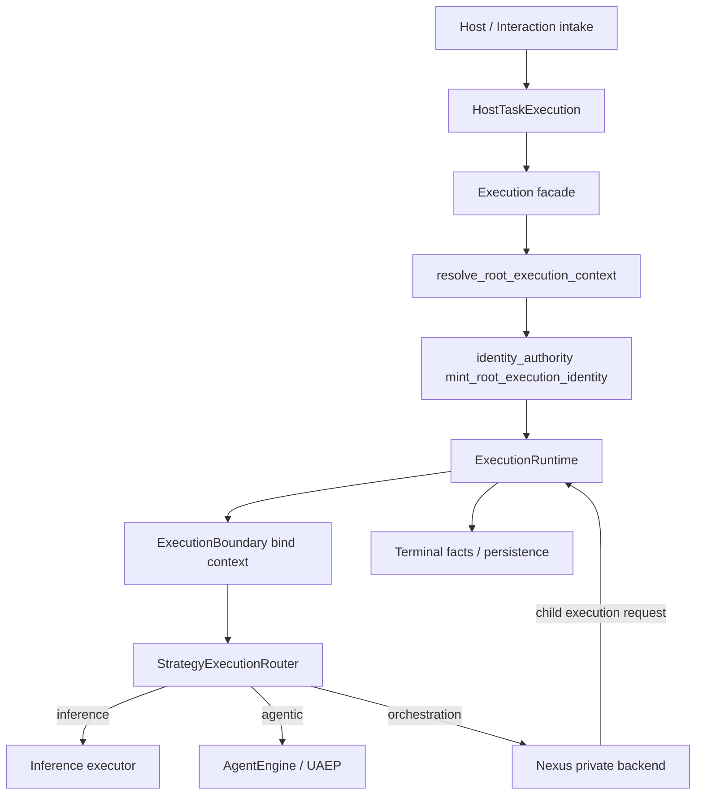

# NPSC-3C — Execution Engine Freeze Certification

**Status:** `FROZEN / CERTIFIED`

**Verdict:** **PASS**

**Date:** 2026-09-08

**Branch:** `development`

**HEAD:** `2f906ca8918b0e20d4536af8d97dc1e56bb83da7`

**Predecessor:** NPSC-3C-F-R4 (full environment regression validation)

**Task:** NPSC-3C FINAL — formal freeze and architectural proof (no production refactor)

---

## 1. Certification verdict

```text
CANONICAL EXECUTION ENGINE = FROZEN / CERTIFIED
```

The canonical Execution Engine ownership model is frozen after NPSC-3C-F-R4. All required regression suites, architecture gates, host validations, and static ownership proofs pass on `development` at the recorded HEAD. No production code changes were required for this certification package.

**Semantic authority:** Frozen contracts align with [`UNIFIED_EXECUTION_ARCHITECTURE.md`](../../architecture/UNIFIED_EXECUTION_ARCHITECTURE.md) (UEA) and [`UNIFIED_EXECUTION_RUNTIME.md`](../../architecture/UNIFIED_EXECUTION_RUNTIME.md) (UER). UEA wins on conflict.

---

## 2. Frozen architecture contracts

| Component | Ownership | Forbidden elsewhere |
| --------- | --------- | ------------------- |
| **ExecutionRuntime** | Sole lifecycle owner (Run/Attempt/root Execution entry) | Duplicate root lifecycle mint/bind in Nexus, interactions, hosts |
| **identity_authority** (`intergrax/runtime/execution/identity_authority.py`) | Sole identity mint owner | Direct `mint_run_id` / `mint_attempt_id` / `mint_execution_id` / `mint_task_id` outside authority module |
| **ExecutionBoundary** | Lifecycle context propagation (`bind_active_execution_identity`) | Identity bind outside `boundary.py` |
| **StrategyExecutionRouter** | Sole strategy selection owner | Strategy routing in interaction layer or tier-3 hosts |
| **HostTaskExecution** | Canonical host execution boundary | Host bypass via `UnifiedTaskRunner`, `NexusLoopTaskExecutor`, direct Nexus intake |
| **Nexus** | Private orchestration backend only | Root lifecycle ownership, identity mint/bind, public host execution surface |

**Non-goals (explicit):** no redesign of ExecutionRuntime, no new execution abstractions, no compatibility layers, no duplicate lifecycle handling, no ownership moves, no temporary bypasses.

---

## 3. Execution lifecycle diagram

Canonical host and platform entry converges on ExecutionRuntime-owned root lifecycle:



**Lifecycle owner:** ExecutionRuntime only. Nexus schedules orchestration steps and requests child executions; it does not mint or bind root lifecycle identity.

Reference assets: [`unified-execution-simple-execute-flow-light.svg`](../../architecture/assets/unified-execution-simple-execute-flow-light.svg), [`unified-execution-identity-lifecycle-light.svg`](../../architecture/assets/unified-execution-identity-lifecycle-light.svg), [`unified-execution-orchestration-nexus-flow-light.svg`](../../architecture/assets/unified-execution-orchestration-nexus-flow-light.svg).

---

## 4. Identity ownership model

```text
TaskId → RunId → AttemptId → ExecutionId → EventId
```

| Operation | Owner module | Gate |
| --------- | ------------ | ---- |
| Root / background / child / retry identity mint | `identity_authority.py` | `test_execution_identity_single_authority_gate` (NPSC-3C-F-R1) |
| Active identity bind | `boundary.py` | same gate |
| Nexus tree scan | no mint, no bind | UE-10R1 + F-R1 nexus scoped tests |
| Background persistence | no direct mint | F-R1 background scan |
| Interaction layer | no mint, no strategy | NPSC-3C-D |
| Tier-3 production hosts | no mint | UE-11GP + static grep (F-R4) |

Exempt conformance surface: `decision_finalization_conformance.py` (documented in F-R1 gate).

---

## 5. Host execution contract

**Canonical boundary:** `HostTaskExecution` (`intergrax/runtime/execution/host_task.py`).

| Requirement | Proof |
| ----------- | ----- |
| Routes through `Execution` facade + `StrategyExecutionRouter` | NPSC-3C-D |
| Does not mint root identity locally | NPSC-3C-D, F-R1 |
| Interaction intake uses `HostTaskExecutionExecutor` port | NPSC-3C-D, NPSC-3C-C |
| No direct Nexus loop on intake path | NPSC-3C-D |
| Five production hosts execute via canonical path | F-R4 host validation (53 tests) |
| Tier-3 apps: no `UnifiedTaskRunner` root bypass | UE-11GP (NPSC-3C-B) |

**HostTaskExecutionExecutor** (`intergrax/runtime/interactions/task_executor.py`) is the interaction-layer adapter; it delegates to HostTaskExecution, not Nexus.

---

## 6. Nexus privacy contract

Nexus is an **internal orchestration backend** when strategy = orchestration.

| Rule | Static proof | Gate |
| ---- | ------------ | ---- |
| No root lifecycle mint/bind in `nexus_loop.py` | grep + AST | UE-10R1 |
| No identity mint/bind anywhere under `intergrax/runtime/nexus/` | grep | F-R1 scoped nexus tests |
| No `NexusLoopTaskExecutor` in active code paths | repo scan | NPSC-3C-C |
| InteractionIntakeService: no NexusLoop constructor param | source inspection | NPSC-3C-D |
| LKW public surface: no Nexus tokens | token scan | NPSC-3B |

Nexus **may** verify pre-bound identity at orchestration entry; it **must not** become a lifecycle owner.

---

## 7. Frozen invariants

1. **Single lifecycle owner:** ExecutionRuntime owns root Run/Attempt/Execution entry.
2. **Single identity mint owner:** `identity_authority.py` only (plus documented conformance exempt).
3. **Single bind owner:** `ExecutionBoundary` only.
4. **Single strategy router:** `StrategyExecutionRouter` only.
5. **Single host boundary:** `HostTaskExecution` for tier-3 canonical execution.
6. **Nexus privacy:** orchestration backend only; no public host execution surface.
7. **No legacy executor:** `NexusLoopTaskExecutor` fully retired from production paths.
8. **No test-only production behavior** introduced for certification.
9. **Gate enforcement:** architecture gates are CI-enforceable; freeze is proof-backed, not comment-only.

---

## 8. Phase 2 — Static proof (2026-09-08 rerun)

| Check | Result |
| ----- | ------ |
| Nexus lifecycle ownership (`mint_*`, `bind_active_execution_identity` in `nexus/**`) | **NO violations** |
| Identity mint outside `identity_authority.py` (execution/nexus/background scan) | **NO violations** (gate PASS) |
| Duplicate execution path — `NexusLoopTaskExecutor` in `intergrax/`, `applications/` | **NO** (gate-only references) |
| Legacy executor references in active paths | **NO** |
| Host execution bypass in tier-3 `applications/**` production code | **NO** (UE-11GP PASS) |
| Interaction layer identity mint | **NO** |
| Production host identity mint | **NO** |

Core gate rerun log: `.tmp/session/NPSC-3C-FINAL/static-proof-gates.log` (19 passed).

---

## 9. Phase 3 — Test matrix

All phases **PASS** at HEAD `2f906ca8918b0e20d4536af8d97dc1e56bb83da7`.

| Phase | Scope | Primary gates / suites | Result | Evidence |
| ----- | ----- | ---------------------- | ------ | -------- |
| **NPSC-3B** | LKW public surface decoupled from Nexus | `test_npsc3b_lkw_public_surface_gate` + B-R1/R3 wiring tests | **PASS** | F-R4 phase3 |
| **NPSC-3C-A** | Nexus lifecycle retirement + interaction boundary | UE-10R1–R4 + NPSC-3C-D | **PASS** | F-R4 phase3 |
| **NPSC-3C-B** | Production host canonical execution | UE-11GP + host canonical intake | **PASS** | F-R4 phase3 + phase4 |
| **NPSC-3C-C** | Legacy executor removal | `test_npsc3c_legacy_executor_removal_gate` | **PASS** | F-R4 phase3 |
| **NPSC-3C-D** | Canonical engine conformance | `test_npsc3c_d_canonical_execution_engine_conformance_gate` | **PASS** | F-R4 phase3 |
| **NPSC-3C-F-R1** | Identity single authority | `test_execution_identity_single_authority_gate` (6/6) | **PASS** | F-R4 phase3 |
| **NPSC-3C-F-R2** | Execution + contracts regression blockers | execution suites + contracts (blockers closed in R3) | **PASS** | F-R3 logs |
| **NPSC-3C-F-R3** | Contracts suite green | `tests/unit/contracts/**` | **1244 passed** | `.tmp/session/NPSC-3C-F-R3/contracts-final.log` |
| **NPSC-3C-F-R4** | Full environment regression | dev + dev-ci + llm-ollama; 763 execution + 1329 gates + 53 host + DS 10 | **ALL PASS** | `.tmp/session/NPSC-3C-F-R4/` |

**FINAL rerun (this session):** frozen gates + contracts **1329 passed** — `.tmp/session/NPSC-3C-FINAL/frozen-gates-rerun.log`

**DS E2E note:** 8 skips in `tests/integration/decision_system/` require `INTERGRAX_DECISION_E2E_QUALIFICATION` — expected qualification gating, not a freeze violation.

---

## 10. Phase 4 — Quality check

| Criterion | Status |
| --------- | ------ |
| New execution framework introduced | **NO** |
| Duplicate lifecycle owner | **NO** |
| New identity owner | **NO** |
| Broad exceptions masking failures | **NO** (not detected) |
| skip/xfail in execution/interactions/background/contracts suites | **NO** |
| Test-only production behavior | **NO** |
| `typing.Any` regression in `attempt_lifecycle/persistence.py` (UE-10R4) | **FIXED** (F-R3) |

---

## 11. Regression evidence

| Artifact | Content |
| -------- | ------- |
| `.tmp/session/NPSC-3C-F-R4/env-sync.log` | Full dependency sync (dev, dev-ci, llm-ollama) |
| `.tmp/session/NPSC-3C-F-R4/phase2-execution-regression.log` | 763 passed — execution/interactions/background |
| `.tmp/session/NPSC-3C-F-R4/phase3-frozen-gates.log` | 1329 passed — NPSC gates + contracts |
| `.tmp/session/NPSC-3C-F-R4/phase3-ds-e2e.log` | 10 passed, 8 skipped (qual flag) |
| `.tmp/session/NPSC-3C-F-R4/phase4-host-validation.log` | 53 passed — 5 application hosts |
| `.tmp/session/NPSC-3C-F-R4/phase5-quality-gates.log` | 11 passed — UE-10R4 + UE-11GP |
| `.tmp/session/NPSC-3C-F-R3/contracts-final.log` | 1244 passed — F-R3 contract closure |
| `.tmp/session/NPSC-3C-FINAL/frozen-gates-rerun.log` | 1329 passed — FINAL gate rerun |
| `.tmp/session/NPSC-3C-FINAL/static-proof-gates.log` | 19 passed — core static proof gates |

---

## 12. Known residual debt (non-blocking)

These items are **outside** the NPSC-3C freeze boundary and do not invalidate certification:

| Debt | Classification | Notes |
| ---- | -------------- | ----- |
| UER full convergence (five-ID on all entry paths, pause/resume/cancel, budget dimensions, distributed identity) | **Open UER work** | Documented PARTIAL maturity in UER hub |
| `scenario_runtime_baseline` harness `UnifiedTaskRunner` usage | **Harness-only** | Outside tier-3 `applications/**`; UE-11GP PASS |
| DS live E2E qualification skips | **Qualification gating** | Requires `INTERGRAX_DECISION_E2E_QUALIFICATION` |
| `resolve_harness_host_nexus_loop_legacy` compat helper | **NPSC-2 migration compat** | Not a tier-3 production execution path |
| Observability / DIAG Execution-aware projection gaps | **Downstream convergence** | UER maturity PARTIAL |

---

## 13. Next phase recommendation

1. **Hold the freeze:** treat NPSC-3C contracts as immutable; reject PRs that move lifecycle, identity, strategy, or host boundary ownership.
2. **UER convergence (post-freeze):** pursue remaining UER maturity items (full entry-path adoption, subtree cancellation, pause/resume/cancel, budget dimensions) **without** reopening NPSC-3C ownership boundaries.
3. **Harness debt retirement:** schedule isolated cleanup of `scenario_runtime_baseline` / compat helpers once all harness hosts use canonical wiring.
4. **Decision E2E qualification:** enable `INTERGRAX_DECISION_E2E_QUALIFICATION` in a dedicated qualification session — orthogonal to engine freeze proof.

---

## 14. NPSC-3C FINAL RESULT

| Criterion | Required | Actual |
| --------- | -------- | ------ |
| Certification documentation complete | YES | **YES** |
| Static ownership proof | PASS | **PASS** |
| Test matrix NPSC-3B → F-R4 | ALL PASS | **ALL PASS** |
| Quality gates (no skips/xfails/bypass) | PASS | **PASS** |
| ExecutionRuntime sole lifecycle owner | PASS | **PASS** |
| identity_authority sole mint owner | PASS | **PASS** |
| Nexus lifecycle ownership | NO | **NO** ✓ |
| Duplicate execution paths (tier-3) | NO | **NO** ✓ |
| Host validation (5 apps) | PASS | **PASS** |
| Production code changes for certification | NONE unless blocker | **NONE** |

### **EXECUTION ENGINE OFFICIALLY FROZEN**

Certification package: this document + session logs under `.tmp/session/NPSC-3C-F-R4/` and `.tmp/session/NPSC-3C-FINAL/`.
