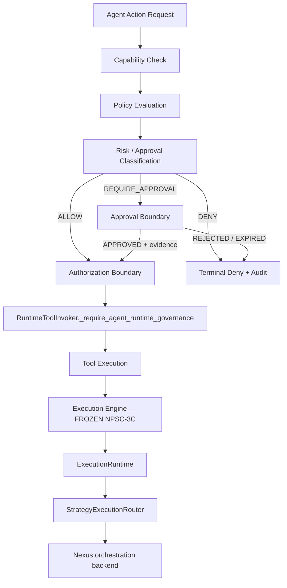

# NPSC-4-F — Agent Runtime Governance Freeze Certification

**Status:** `FROZEN / CERTIFIED`

**Verdict:** **PASS** (governance freeze) · **DoD partial** (worktree)

**Date:** 2026-09-08

**Branch:** `development`

**HEAD:** `949de8d4179153be33a718545b3a7735fafec299`

**Predecessor:** NPSC-4 (agent runtime governance layer), NPSC-3C FINAL (execution engine freeze)

**Task:** NPSC-4-F — certify Agent Governance as production-grade control plane above frozen Execution Engine

---

## 1. Certification verdict

```text
AGENT RUNTIME GOVERNANCE = FROZEN / CERTIFIED
EXECUTION ENGINE = UNCHANGED (FROZEN per NPSC-3C)
```

Governance owns **whether** an agent action is permitted. ExecutionRuntime owns **how** it runs. Nexus remains orchestration-only. No execution ownership was moved, duplicated, or bypassed.

**Semantic authority:** Governance contracts in `intergrax/contracts/agent_runtime_governance.py` are evaluation-only. Execution identity contracts remain frozen under NPSC-3C.

---

## 2. Architecture diagram



**Forbidden path (when governance configured):**

```text
Agent → Tool   ✗
```

**Required path:**

```text
Agent → Governance → (ALLOW) → Tool → ExecutionRuntime → Nexus
```

---

## 3. Ownership model

| Component | Owner | Responsibility | NPSC-4-F result |
| --------- | ----- | -------------- | --------------- |
| **Agent Runtime Governance** | `intergrax/runtime/agent_governance/` | Capability decisions, policy evaluation, approval decisions, audit events | **FROZEN owner** |
| **Governance contracts** | `intergrax/contracts/agent_runtime_governance.py` | Typed evaluation contracts | **FROZEN** |
| **ExecutionRuntime** | `intergrax/runtime/execution/runtime.py` | Lifecycle, execution identity context | **UNCHANGED** |
| **identity_authority** | `intergrax/runtime/execution/identity_authority.py` | Identity mint | **UNCHANGED** |
| **ExecutionBoundary** | `intergrax/runtime/execution/boundary.py` | Identity propagation | **UNCHANGED** |
| **HostTaskExecutionPort** | `intergrax/runtime/execution/host_task.py` | Host execution contract | **UNCHANGED** |
| **StrategyExecutionRouter** | `intergrax/runtime/execution/orchestration.py` | Strategy selection | **UNCHANGED** |
| **Nexus** | `intergrax/runtime/nexus/` | Orchestration backend only | **UNCHANGED** — no governance ownership |

### Phase 1 — ownership audit

| Check | Proof | Result |
| ----- | ----- | ------ |
| Governance owns capability decisions | `CapabilityGrantResolverPort`, `require_capability_granted()` | **PASS** |
| Governance owns policy evaluation | `AgentRuntimePolicyEngine.evaluate()` | **PASS** |
| Governance owns approval decisions | `AgentRuntimeApprovalBoundary` | **PASS** |
| Governance owns audit events | `GovernanceAuditRecorder.record_decision()` | **PASS** |
| ExecutionRuntime owns lifecycle | `test_npsc4_execution_runtime_unchanged_ownership` | **PASS** |
| ExecutionRuntime owns execution identity context | `build_tool_authorization_request()` consumes existing IDs | **PASS** |
| Nexus owns orchestration only | `test_npsc4_nexus_does_not_own_governance_contracts` | **PASS** |
| Governance does NOT mint execution identity | AST gate: no `mint_run_id` / `mint_attempt_id` / `mint_execution_id` / `mint_task_id` in `agent_governance/` | **PASS** |
| Governance does NOT start lifecycle | No lifecycle imports or ExecutionRuntime calls in governance layer | **PASS** |
| Agent cannot bypass governance (when configured) | `RuntimeToolInvoker._require_agent_runtime_governance()` before scope/sandbox/declarative checks | **PASS** |
| Tool cannot bypass authorization | Integration test blocks denied invocation at invoker boundary | **PASS** |

---

## 4. Policy model

| Property | Implementation | Proof |
| -------- | -------------- | ----- |
| Deterministic ordering | Providers evaluated in registration order | `AgentRuntimePolicyEngine.evaluate()` |
| Plugin contracts | `AgentRuntimePolicyProvider` protocol | `intergrax/contracts/agent_runtime_governance.py` |
| Explainable decisions | `PolicyEvaluationResult.reason` + merged `ToolAuthorizationDecision.reason` | Unit tests |
| Explicit deny | Empty provider list → DENY; `DenyCapabilityPolicyProvider`; merge precedence | `test_policy_evaluation_deny_wins_over_allow` |
| Merge precedence | `DENY > REQUIRE_APPROVAL > ALLOW` | `_DECISION_PRECEDENCE` in `policy_engine.py` |

Built-in providers (composable, independently deployable):

| Provider | ID | Behavior |
| -------- | -- | -------- |
| `AllowAllPolicyProvider` | `governance.allow_all` | Explicit baseline allow |
| `DenyCapabilityPolicyProvider` | `governance.deny_capability` | Deny named capabilities |
| `FinancialApprovalPolicyProvider` | `governance.financial_approval` | Financial capabilities require approval |
| `HighRiskApprovalPolicyProvider` | `governance.high_risk_approval` | HIGH/CRITICAL risk requires approval |

**Policy engine is non-blocking:** approval creation is delegated to `AgentRuntimeApprovalBoundary` after policy evaluation returns `REQUIRE_APPROVAL`; no synchronous HITL wait inside `AgentRuntimePolicyEngine`.

---

## 5. Approval model

```text
WAITING_FOR_APPROVAL → APPROVED | REJECTED | EXPIRED
```

Contract enum also defines `CREATED`; runtime creation enters directly at `WAITING_FOR_APPROVAL` (see residual debt §11).

| Transition | Method | Test |
| ---------- | ------ | ---- |
| Create pending request | `AgentRuntimeApprovalBoundary.create_approval_request()` | `test_approval_lifecycle` |
| Approve | `approve(approval_id, decided_by=...)` | `test_approval_lifecycle` |
| Reject | `reject(approval_id, decided_by=...)` | `test_approval_rejection` |
| Expire | `check_expiration()` when `now >= expires_at` | `test_approval_expiration` |
| Continuation evidence | `approval_evidence_ref` on retried `ToolAuthorizationRequest` | `test_financial_policy_allows_with_evidence` |

Pipeline attaches `approval_id=` to decision reason; `AgentRuntimeGovernanceBoundary` raises `ToolGovernanceApprovalRequiredError` — tool execution blocked until evidence present.

---

## 6. Audit model

Every pipeline decision emits `GovernanceAuditEvent`:

| Field | Source |
| ----- | ------ |
| `event_id` | `mint_governance_audit_event_id()` — audit metadata, **NOT** execution identity |
| `execution_id`, `run_id`, `attempt_id`, `task_id` | Existing execution identity from request |
| `agent_id`, `capability`, `tool_id` | Authorization request |
| `decision`, `policy_results` | Pipeline outcome |
| `timestamp` | UTC evaluation time |

Proof: `test_audit_events_generated_on_decision` — event ID prefix `governance_evt_`.

---

## 7. Contract validation (Phase 3)

Validated contracts:

| Contract | Immutable | Typed | No `Any` | No `dict[str, Any]` | No reflection |
| -------- | --------- | ----- | -------- | ------------------- | ------------- |
| `CapabilityGrant` | `frozen=True`, `extra=forbid` | Pydantic + `frozenset` | ✓ | ✓ | ✓ |
| `ToolAuthorizationRequest` | `frozen=True`, `extra=forbid` | Execution ID validators | ✓ | ✓ | ✓ |
| `ToolAuthorizationDecision` | `frozen=True`, `extra=forbid` | `ToolAuthorizationDecisionState` enum | ✓ | ✓ | ✓ |
| `ApprovalRequest` | `frozen=True`, `extra=forbid` | `ApprovalRequestStatus` enum | ✓ | ✓ | ✓ |
| `GovernanceAuditEvent` | `frozen=True`, `extra=forbid` | Full field typing | ✓ | ✓ | ✓ |

Source scan: `intergrax/contracts/agent_runtime_governance.py` — no `Any`, no `dict[str, Any]`, no `getattr`/`eval`.

---

## 8. Static security proof (Phase 2)

| Search target | Governance layer | Invoker integration |
| ------------- | ---------------- | ------------------- |
| `mint_run_id` / `mint_attempt_id` / `mint_execution_id` / `mint_task_id` | **0 hits** in `agent_governance/` | N/A |
| `invoke_tool` / `execute_tool` | **0 hits** in `agent_governance/` | Governance hook precedes execution |
| Direct Agent → Tool | Blocked when `agent_runtime_governance` configured | `test_tool_blocked_without_governance_allow` |

Architecture gates (`test_npsc4_agent_runtime_governance_gate.py`):

| Gate | Result |
| ---- | ------ |
| `test_npsc4_governance_cannot_mint_execution_identity` | **PASS** |
| `test_npsc4_governance_contracts_do_not_mint_execution_identity` | **PASS** |
| `test_npsc4_tool_invoker_integrates_governance_before_execution` | **PASS** |
| `test_npsc4_nexus_does_not_own_governance_contracts` | **PASS** |
| `test_npsc4_execution_runtime_unchanged_ownership` | **PASS** |
| `test_npsc4_identity_authority_unchanged` | **PASS** |

Log: `.tmp/session/NPSC-4-F/static-proof-gates.log` (6 passed).

---

## 9. Regression evidence (Phase 6)

**Session rerun:** 2026-09-08 · log: `.tmp/session/NPSC-4-F/regression-all.log`

| Suite | Gate / scope | Result |
| ----- | ------------ | ------ |
| **NPSC-3B** | `test_npsc3b_lkw_public_surface_gate` | **PASS** |
| **NPSC-3C** | `test_npsc3c_legacy_executor_removal_gate` + `test_npsc3c_d_*` + `test_execution_identity_single_authority_gate` | **PASS** |
| **NPSC-3E** | `test_npsc3e_runtime_convergence_gate` | **PASS** |
| **NPSC-3F** | `test_npsc3f_runtime_convergence_gate` | **PASS** |
| **NPSC-3G** | `test_npsc3g_application_runtime_convergence_gate` | **PASS** |
| **NPSC-4 unit** | `tests/unit/runtime/agent_governance/` | **PASS** |
| **NPSC-4 architecture** | `test_npsc4_agent_runtime_governance_gate` | **PASS** |
| **NPSC-4 integration** | `test_tool_governance_integration` | **PASS** |

**Total:** 73 passed (combined regression run).

Execution Engine immutables verified unchanged by architecture gates — no modifications to `ExecutionRuntime`, `ExecutionBoundary`, `identity_authority`, `HostTaskExecutionPort`, or `StrategyExecutionRouter` in NPSC-4 scope.

---

## 10. Definition of Done

| Criterion | Status |
| --------- | ------ |
| No governance bypass (when configured) | **PASS** |
| No execution ownership leak | **PASS** |
| No identity ownership leak | **PASS** |
| Tool authorization enforced | **PASS** |
| Approval lifecycle validated | **PASS** |
| Regression green | **PASS** (73/73) |
| Documentation complete | **PASS** (this document + NPSC-4 base cert) |
| `HEAD == origin/development` | **PASS** (`949de8d4179153be33a718545b3a7735fafec299`) |
| Worktree clean | **FAIL** — unrelated dirty files under `platform_proofs/scenarios/verified_product_identification/` (outside NPSC-4-F scope) |

**Overall task DoD:** governance freeze criteria **PASS**; session cleanliness **blocked** by unrelated worktree changes.

---

## 11. Residual debt

1. **Durable approval store** — `InMemoryApprovalStore` is in-process only; production needs persistent `ApprovalStorePort`.
2. **Default governance wiring** — Tier-3 hosts must explicitly inject `agent_runtime_governance`; no implicit global enablement.
3. **Capability grant source** — production resolver should bind to roster/capability catalog, not in-memory tables.
4. **Observability sink** — `InMemoryGovernanceAuditSink` for tests; production needs external audit export (SIEM / attestation bus).
5. **`CREATED` approval state** — enum present; runtime creation enters at `WAITING_FOR_APPROVAL` without persisting an intermediate `CREATED` record.
6. **Worktree hygiene** — unrelated `platform_proofs/` changes must be committed or reverted before full session DoD closure.

---

## 12. Key artifacts

| Path | Role |
| ---- | ---- |
| `intergrax/contracts/agent_runtime_governance.py` | Frozen typed contracts |
| `intergrax/runtime/agent_governance/` | Pipeline, policy engine, approval, audit, authorization boundary |
| `intergrax/runtime/nexus/tools/invoker.py` | Pre-execution governance hook (`_require_agent_runtime_governance`) |
| `tests/unit/runtime/agent_governance/test_agent_runtime_governance.py` | Unit proofs |
| `tests/unit/runtime/architecture/test_npsc4_agent_runtime_governance_gate.py` | Static ownership gates |
| `tests/integration/runtime/agent_governance/test_tool_governance_integration.py` | Invoker integration proof |
| `docs/project/maintainers/qualification/NPSC_4_AGENT_RUNTIME_GOVERNANCE_CERTIFICATION.md` | NPSC-4 base certification |
| `.tmp/session/NPSC-4-F/regression-all.log` | Combined regression log |
| `.tmp/session/NPSC-4-F/static-proof-gates.log` | Architecture gate log |

---

## 13. NPSC-4-F FINAL RESULT

```text
AGENT RUNTIME GOVERNANCE FREEZE = CERTIFIED
EXECUTION ENGINE FREEZE (NPSC-3C) = PRESERVED
```

Hold the freeze: reject PRs that move capability/policy/approval/audit ownership out of `agent_governance/`, mint execution identity in governance, or allow Agent → Tool paths when governance is configured.

Certification package: this document + session logs under `.tmp/session/NPSC-4-F/`.
