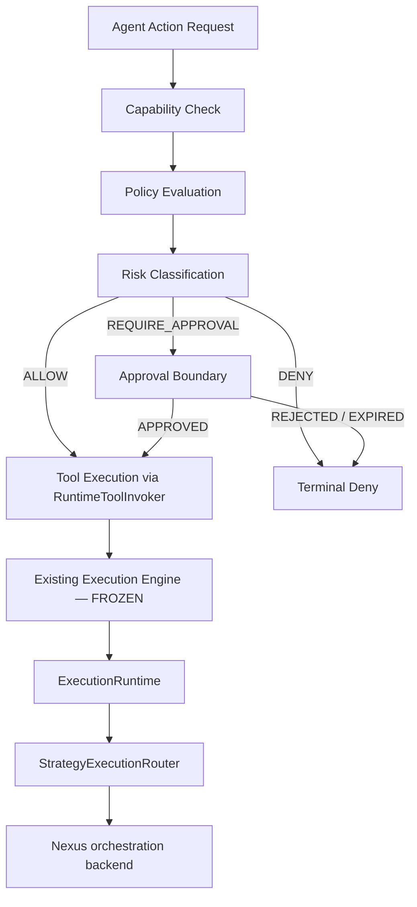

# NPSC-4 — Agent Runtime Governance & Enterprise Control Plane Certification

**Status:** `CERTIFIED`

**Verdict:** **PASS**

**Date:** 2026-09-08

**Branch:** `development`

**HEAD:** `30750b421da9f280c12fb15b100015c90aa5a21c`

**Predecessor:** NPSC-3C FINAL (execution engine freeze), NPSC-3G (application runtime convergence)

**Task:** NPSC-4 — enterprise governance layer above frozen Execution Engine

---

## 1. Certification verdict

```text
AGENT RUNTIME GOVERNANCE = CERTIFIED
EXECUTION ENGINE = UNCHANGED (FROZEN per NPSC-3C)
```

Governance decides **whether** an agent action is permitted. ExecutionRuntime decides **how** it runs. No execution ownership was moved, duplicated, or bypassed.

---

## 2. Architecture diagram



**Forbidden path (eliminated when governance configured):**

```text
Agent → Tool   ✗
```

**Required path:**

```text
Agent → Governance → (allowed) → Tool execution → ExecutionRuntime → Nexus
```

---

## 3. Ownership model

| Component | Owner | Responsibility | NPSC-4 change |
| --------- | ----- | -------------- | ------------- |
| **ExecutionRuntime** | `intergrax/runtime/execution/runtime.py` | Lifecycle, execution identity context | **UNCHANGED** |
| **identity_authority** | `intergrax/runtime/execution/identity_authority.py` | Identity mint | **UNCHANGED** |
| **ExecutionBoundary** | `intergrax/runtime/execution/boundary.py` | Identity propagation | **UNCHANGED** |
| **HostTaskExecutionPort** | `intergrax/runtime/execution/host_task.py` | Host execution contract | **UNCHANGED** |
| **StrategyExecutionRouter** | `intergrax/runtime/execution/orchestration.py` | Strategy selection | **UNCHANGED** |
| **Nexus** | `intergrax/runtime/nexus/` | Orchestration backend | **UNCHANGED** — no governance ownership |
| **Agent Runtime Governance** | `intergrax/runtime/agent_governance/` | Policy, authorization, approval, audit | **NEW** |
| **Governance contracts** | `intergrax/contracts/agent_runtime_governance.py` | Typed evaluation contracts | **NEW** |

### Classification of pre-existing components

| Component | Current owner | Allowed future responsibility | Migration |
| --------- | ------------- | ----------------------------- | --------- |
| `GovernanceService` / `ExecutionGuard` | `runtime/governance/` | Post-run replay/metrics governance | Coexists — not replaced |
| `ControlPlaneMutationAuthorizationBoundary` | `runtime/governance/` | Control-plane mutation authorization | Coexists — pattern reused |
| `PolicyEngine` / `RuntimePolicyEngine` | `runtime/policy/` | UAEP decision / interrupt / side-effect policy | Coexists — complementary |
| `DeclarativePolicyEnforcer` | `runtime/policy/` | Declarative tool rule evaluation | Coexists — evaluated after NPSC-4 gate |
| `ToolScopePolicy` | `runtime/tools/` | Static tool allow-list | Coexists — evaluated after NPSC-4 gate |
| HITL tools (`tools/providers/hitl/`) | tools tier | Human decision store operations | Coexists — approval boundary is separate contract |
| Application `AgentGovernanceProfile` | `applications/contracts/` | Tier-3 roster certification | Coexists — lifecycle, not runtime tool gate |
| Capability catalog governance | `capability_catalog/` | Discovery-time trust projection | Coexists — pre-execution, not tool dispatch |

---

## 4. Governance lifecycle

1. **Request construction** — `build_tool_authorization_request()` uses existing execution identity (`task_id`, `run_id`, `attempt_id`, `execution_id`). Governance never mints identity.
2. **Capability check** — `CapabilityGrantResolverPort` resolves agent grants; fail-closed on missing/denied capability.
3. **Policy evaluation** — `AgentRuntimePolicyEngine` evaluates ordered plugin providers; deterministic merge: `DENY > REQUIRE_APPROVAL > ALLOW`.
4. **Decision** — `AgentRuntimeGovernanceBoundary.authorize_tool()` returns ALLOW or raises typed boundary errors.
5. **Audit** — every decision emits `GovernanceAuditEvent` via `GovernanceAuditSinkPort`.

---

## 5. Policy model

| Policy provider | ID | Behavior |
| --------------- | -- | -------- |
| `AllowAllPolicyProvider` | `governance.allow_all` | Explicit baseline allow |
| `DenyCapabilityPolicyProvider` | `governance.deny_capability` | Deny named capabilities |
| `FinancialApprovalPolicyProvider` | `governance.financial_approval` | Financial capabilities require approval |
| `HighRiskApprovalPolicyProvider` | `governance.high_risk_approval` | HIGH/CRITICAL risk requires approval |

Policies implement `AgentRuntimePolicyProvider` protocol — composable, testable, replaceable, independently deployable.

---

## 6. Approval flow

```text
CREATED → WAITING_FOR_APPROVAL → APPROVED | REJECTED | EXPIRED
```

- `AgentRuntimeApprovalBoundary` — async contract, no blocking in policy engine
- `ApprovalStorePort` — persistent approval state (in-memory default for tests)
- Approval creation triggered by `REQUIRE_APPROVAL` pipeline decision
- `approval_evidence_ref` on retried requests satisfies financial/high-risk policies

---

## 7. Audit model

Every governance decision produces `GovernanceAuditEvent`:

| Field | Source |
| ----- | ------ |
| `event_id` | `mint_governance_audit_event_id()` — audit metadata, NOT execution identity |
| `execution_id`, `run_id`, `attempt_id`, `task_id` | Existing execution identity from request |
| `agent_id`, `capability`, `tool_id` | Authorization request |
| `decision`, `policy_results` | Pipeline outcome |
| `timestamp` | UTC evaluation time |

---

## 8. Tool integration point

`RuntimeToolInvoker` accepts optional `agent_runtime_governance: AgentRuntimeGovernancePort`.

When configured, `_require_agent_runtime_governance()` runs **before** scope policy, sandbox, and declarative policy checks.

Wiring example:

```python
from intergrax.runtime.agent_governance import (
    AgentRuntimeGovernanceBoundary,
    AgentRuntimeGovernancePipeline,
    AgentRuntimePolicyEngine,
    InMemoryCapabilityGrantResolver,
)
from intergrax.runtime.agent_governance.audit import (
    GovernanceAuditRecorder,
    InMemoryGovernanceAuditSink,
)

governance = AgentRuntimeGovernanceBoundary(
    AgentRuntimeGovernancePipeline(
        capability_resolver=InMemoryCapabilityGrantResolver(grants),
        policy_engine=AgentRuntimePolicyEngine(policies),
        audit_recorder=GovernanceAuditRecorder(InMemoryGovernanceAuditSink()),
    ),
)

invoker = RuntimeToolInvoker(
    registry=registry,
    executor=executor,
    agent_runtime_governance=governance,
)
```

---

## 9. Regression evidence

| Suite | Result | Log |
| ----- | ------ | --- |
| NPSC-4 unit tests | **20 PASS** | `.tmp/session/NPSC-4/unit-tests2.log` |
| NPSC-4 architecture gates | **6 PASS** | included above |
| NPSC-4 integration | **1 PASS** | included above |
| NPSC-3B | **PASS** | `.tmp/session/NPSC-4/regression-npsc3.log` |
| NPSC-3C | **PASS** | included above |
| NPSC-3C-D | **PASS** | included above |
| NPSC-3E | **PASS** | included above |
| NPSC-3F | **PASS** | included above |
| NPSC-3G | **PASS** | included above |

---

## 10. Definition of Done

| Criterion | Status |
| --------- | ------ |
| Governance contracts exist | **PASS** |
| Tool execution requires governance decision (when configured) | **PASS** |
| Policies are pluggable | **PASS** |
| HITL approval contract exists | **PASS** |
| Audit events are generated | **PASS** |
| ExecutionRuntime ownership unchanged | **PASS** |
| Identity ownership unchanged | **PASS** |
| Nexus remains orchestration only | **PASS** |
| No duplicate execution path introduced | **PASS** |
| All regression suites PASS | **PASS** |
| Documentation created | **PASS** |
| HEAD == origin/development | **PENDING** — requires commit + push |
| Worktree clean | **PENDING** — NPSC-4 artifacts uncommitted |

---

## 11. Remaining debt

1. **Durable approval store** — `InMemoryApprovalStore` is in-process only; production needs persistent `ApprovalStorePort` implementation.
2. **Default governance wiring** — Tier-3 hosts must explicitly inject `agent_runtime_governance`; no implicit global enablement.
3. **Capability grant source** — production grant resolver should bind to roster/capability catalog, not in-memory tables.
4. **Observability sink** — `InMemoryGovernanceAuditSink` for tests; production needs external audit export (SIEM / attestation bus).
5. **Commit convergence** — certification artifacts require merge to `origin/development`.

---

## 12. Key artifacts

| Path | Role |
| ---- | ---- |
| `intergrax/contracts/agent_runtime_governance.py` | Typed contracts |
| `intergrax/runtime/agent_governance/` | Pipeline, policy engine, approval, audit |
| `intergrax/runtime/nexus/tools/invoker.py` | Pre-execution integration hook |
| `tests/unit/runtime/agent_governance/` | Unit tests |
| `tests/unit/runtime/architecture/test_npsc4_agent_runtime_governance_gate.py` | Architecture gates |
| `tests/integration/runtime/agent_governance/` | Integration tests |
