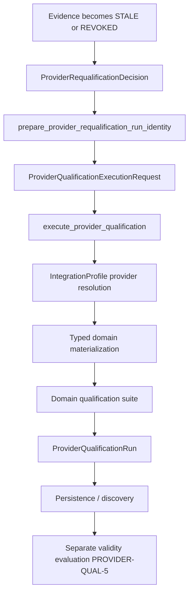

# PROVIDER-QUAL-7 — Shared Provider Qualification Execution Runner

**Status:** `READY_FOR_REVIEW` (PROVIDER-QUAL-7-R1)

## Scope

Synchronous, provider-neutral qualification execution coordinator:

- `execute_provider_qualification(request, dependencies)` → `ProviderQualificationRun`
- No scheduler, worker queue, or CI framework
- No vendor-specific central dispatch in qualification core
- Reuses Integrations provider resolution and PROVIDER-QUAL-3B typed domain materialization
- Reuses PROVIDER-QUAL-3C persistence (`DocumentStore` / `ProofReceipt`)
- Reuses platform non-execution observability (`PlatformObservabilityExportSource`) and problem plane (`PlatformProblemSignal`)

## Lifecycle



## PLATFORM REUSE

| Mechanism | Reused |
|-----------|--------|
| Integrations provider resolution | YES |
| PROVIDER-QUAL-3B materialization (`resolve_collaborative_work_repositories`) | YES |
| PROVIDER-QUAL-3C persistence (`DocumentStoreProviderQualificationPersistence`) | YES |
| HOS non-execution platform observability (`PlatformObservabilityExportSource`) | YES |
| Platform problem plane (`PlatformProblemSignal` via export envelope) | YES |
| Second registry / telemetry pipeline | NO |

## OBSERVABILITY / DIAGNOSTICS

**Classification:** `REUSE_EXISTING_PLATFORM_SIGNAL_OBSERVABILITY`

Qualification execution is not Task/Run/Attempt lifecycle. Lifecycle facts emit through:

```text
ProviderQualificationExecutionEvent
  → PlatformObservabilityExportSource
  → ObservabilityExportEnvelope (PLATFORM_SIGNAL)
```

Infrastructure failures emit through the existing problem export path:

```text
build_qualification_infrastructure_problem_envelope
  → PlatformProblemSignal
  → ObservabilityExportEnvelope (PROBLEM_SIGNAL)
```

Observability is best-effort via optional `ProviderQualificationExecutionObservabilityPort`; observability failure does not alter qualification truth.

## VENDOR ABSTRACTION

- Qualification runner has no vendor-specific materialization code.
- Collaborative Work qualification binding delegates materialization to `resolve_collaborative_work_repositories(profile)`.
- Provider mechanics (including isolated PostgreSQL `schema_name`) live in Integrations/provider binders (`PostgreSQLRelationalStoreFactory.bind_collaborative_work_materialization`).
- Domain suite uses explicit semantic checks — no authoritative `assert` usage.

## IDEMPOTENCY / CONCURRENCY

- Compatible persisted run (`subject`, `source_revision`, `executor`) → safe idempotent return + `execution.recovered` observability.
- Incompatible request for same `qualification_run_id` → `ProviderQualificationRequestIncompatibleError`.
- Persistence conflict with different stored fact → `ProviderQualificationExecutionConflictError` (fail closed).
- Identical duplicate after conditional persist conflict → safe recovery when `stored == run`.

## REAL PROVIDER PROOF

Canonical path:

```text
IntegrationProfile (+ provider options such as schema_name)
  → resolve_integration_provider_id
  → CollaborativeWorkRepositoryQualificationBinding.materialize
  → resolve_collaborative_work_repositories
  → PROVIDER-QUAL-3B binder/factory
  → Collaborative Work suite
  → ProviderQualificationRun
  → DocumentStore persistence
```

```bash
uv run pytest tests/unit/core/qualification/test_provider_qualification_execution_runner.py -q
uv run pytest tests/integration/core/qualification/test_provider_qualification_execution_postgresql.py -m "integration and network" -q
```

PostgreSQL integration proof requires Docker PostgreSQL and `INTERGRAX_COLLABORATIVE_WORK_POSTGRESQL_DSN` or equivalent `INTERGRAX_POSTGRESQL_*` settings. Isolated qualification schema is supplied through provider profile options (`schema_name`), not domain qualification code.

## Ownership

| Layer | Owns |
|-------|------|
| Platform qualification core | execution coordination, run identity, executor metadata, canonical run construction, persistence coordination, infrastructure failure semantics, optional platform observability port |
| Domain suite | semantic checks, suite identity/version, outcome mapping |
| Provider / Integrations | config, credentials, materialization, backend mechanics |

## First concrete domain

Collaborative Work repository qualification (`intergrax/collaborative_work/repository_qualification_suite.py`) proves PostgreSQL and SQLite execution through injected `ProviderQualificationDomainBinding` — qualification core contains no vendor branches.
