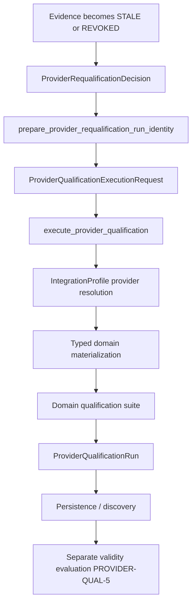

# PROVIDER-QUAL-7 — Shared Provider Qualification Execution Runner

**Status:** `READY_FOR_REVIEW`

## Scope

Synchronous, provider-neutral qualification execution coordinator:

- `execute_provider_qualification(request, dependencies)` → `ProviderQualificationRun`
- No scheduler, worker queue, or CI framework
- No vendor-specific central dispatch in qualification core
- Reuses Integrations provider resolution and PROVIDER-QUAL-3B typed domain materialization
- Reuses PROVIDER-QUAL-3C persistence (`DocumentStore` / `ProofReceipt`)

## Lifecycle



## Ownership

| Layer | Owns |
|-------|------|
| Platform qualification core | execution coordination, run identity, executor metadata, canonical run construction, persistence coordination, infrastructure failure semantics |
| Domain suite | semantic checks, suite identity/version, outcome mapping |
| Provider / Integrations | config, credentials, materialization, backend mechanics |

## First concrete domain

Collaborative Work repository qualification (`intergrax/collaborative_work/repository_qualification_suite.py`) proves PostgreSQL and SQLite execution through injected `ProviderQualificationDomainBinding` — qualification core contains no vendor branches.

## Proof commands

```bash
uv run pytest tests/unit/core/qualification/test_provider_qualification_execution_runner.py -q
uv run pytest tests/integration/core/qualification/test_provider_qualification_execution_postgresql.py -m "integration and network" -q
```

PostgreSQL integration proof requires Docker PostgreSQL (`infra/docker/postgresql/docker-compose.yml`) and `INTERGRAX_COLLABORATIVE_WORK_POSTGRESQL_DSN` or equivalent `INTERGRAX_POSTGRESQL_*` settings passed through profile options.
