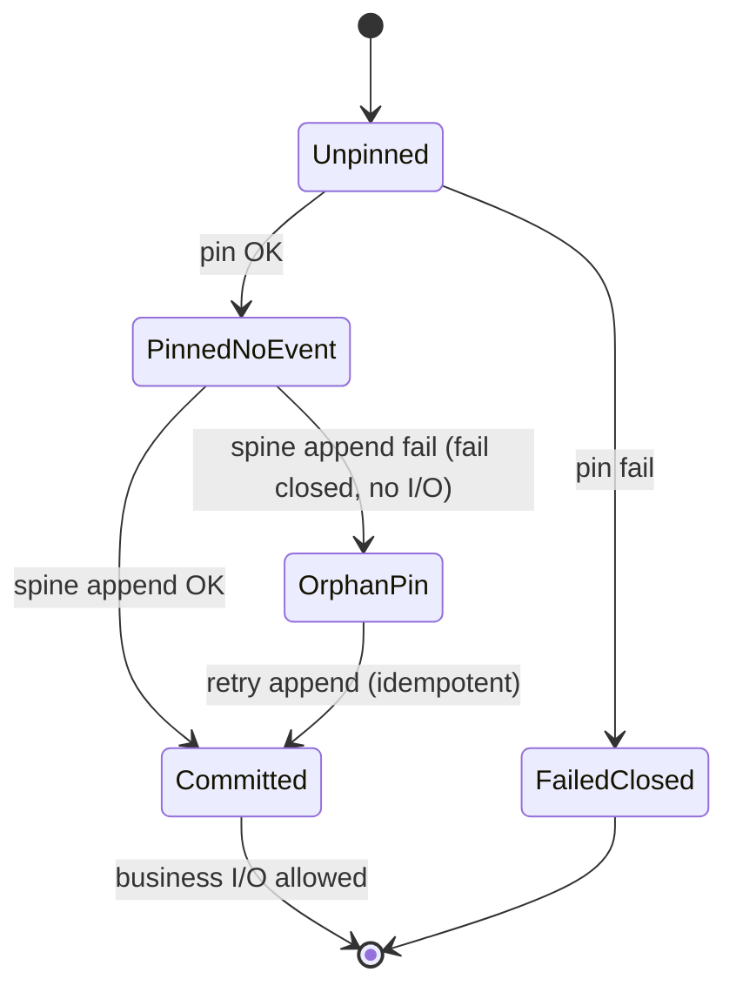

# TRACE-X-P5-R2-P4-R1-R1 — Requirement Evidence Emission Boundary & Dual-Write Semantics

| Field | Value |
|---|---|
| **Status** | **READY FOR AUDIT** |
| **Production delta** | **0** |
| **Rejected R1 baseline** | `fe56e1801bbf14c4ca75ec8c8a41a2ed02d5e42e` (emitter-in-Integrations claim — **superseded here**) |
| **Parent** | [`TRACE_X_P5_R2_P4_R1_RECONSTRUCTION_REQUIREMENT_AUTHORITY_AS_OF_RECONCILIATION.md`](TRACE_X_P5_R2_P4_R1_RECONSTRUCTION_REQUIREMENT_AUTHORITY_AS_OF_RECONCILIATION.md) |
| **Grandparent** | **TRACE-X-P5-R2-P4** = **BLOCKED** (implementation) |
| **FRZ-TRC-11** | **OPEN** |
| **P5 / CERT** | **NOT ENTERED** |

## Preserved R1 decisions (not reopened)

- Typed spine requirement fact (authority for reconstruction obligation).
- Magic payload `execution_integration_configuration_provenance_required` **authority = 0**.
- Option B for `execution_as_of` → `UNAVAILABLE_AT_EXECUTION_BOUNDARY`; no temporal provenance store.
- `UNAVAILABLE_AT_EXECUTION_BOUNDARY` status extension (P4 implementation).
- Docker durable restart E2E remains mandatory in corrected P4 (sequence updated §12).

---

## Blockers addressed

| Blocker | ID | R1-R1 disposition |
|---|---|---|
| Integrations-owned runtime spine emit | `R2-P4-REQUIREMENT-EVIDENCE-EMITTER-BOUNDARY-26` | **RESOLVED IN DESIGN** — semantic source vs physical emitter split; Integrations **forbidden** from `RuntimeEventBus` / `EvidencePersistencePort` / observability persistence |
| Pin → requirement event failure protocol | `R2-P4-PIN-REQUIREMENT-EVIDENCE-DUAL-WRITE-27` | **RESOLVED IN DESIGN** — explicit dual-write state machine + fail-closed sequencing |

---

## 1. Semantic source vs physical emitter

### 1.1 Semantic source (factual, Integrations-owned)

Successful configured provenance pin:

```text
ExecutionBoundIntegrationResolution.materialize_validate_and_pin
  → ExecutionIntegrationConfigurationProvenance (mode = CONFIGURED_ADOPTED)
  → IntegrationConfigurationSubject
```

This triple is the **only** factual basis the requirement spine event may reflect. Integrations owns materialize → validate → **P2 pin**; it does **not** own runtime evidence persistence.

**Production locus today:** `intergrax/integrations/execution_bound_integration_resolution.py` (`materialize_validate_and_pin`, `ExecutionBoundIntegrationMaterializedResult`).

### 1.2 Physical emitter (runtime-owned)

The **existing** execution runtime surface that already holds canonical `tenant_id`, `task_id`, `run_id`, `attempt_id`, `ExecutionId`, and append-only positioned spine persistence must emit and persist the typed requirement fact.

**Selected sanctioned publisher (inventory §2):** new recorder parallel to `RuntimeEventExecutionFailureEvidenceRecorder`, invoking the **same** `RuntimeEventBus.record` → `RuntimeEventPersistence.append` chain already wired for execution failure evidence — **no second bus, no second Evidence Plane owner**.

**Forbidden in Integrations:** direct import or use of `RuntimeEventBus`, `EvidencePersistencePort`, observability emitters, or runtime event store implementations.

---

## 2. Emitter ownership inventory (production @ `fe56e180…`)

| Pattern | Class / module | Role | Reuse for requirement spine |
|---|---|---|---|
| Execution failure spine | `RuntimeEventExecutionFailureEvidenceRecorder` · `intergrax/runtime/execution/failure_evidence/runtime_event_recorder.py` | Maps typed contract → `RuntimeEvent` + `runtime_event_with_payload` → `RuntimeEventBus.record` | **Template** for new requirement recorder |
| Bus + mandatory durability | `RuntimeEventBus.record` · `intergrax/runtime/events/event_bus.py` | Single runtime event bus; fail-closed when evidence required | **Reuse** |
| Spine payload validation | `validating_evidence_persistence_port` · `prepare_canonical_production_write_event` | Canonical production write path | **Reuse** |
| Append + idempotent `event_id` | `RuntimeEventPersistence.append` · `reconcile_idempotent_event_acceptance` · `document_backed_runtime_event_store` / `sqlite_runtime_event_store` | Idempotent on `event_id`; content mismatch → integrity error | **Reuse** for retry (crash matrix D) |
| Governance fact projection | `RuntimeEventGovernanceEvidencePersistence` · `deterministic_runtime_event_id_for_governance_fact` | Deterministic `EventId` from stable fact digest | **Pattern** for requirement `EventId` (§8) |
| Trace + bus facade | `ObservabilityEmitter` · `intergrax/runtime/observability/emitter.py` | Broader observability; not execution-boundary-specific | **Not selected** (failure recorder is closer seam) |
| Reconstruction read | `integration_configuration_provenance_projection.py` | Consumes positioned history only | **Consumer** (P4); no emit |

**Named implementation delta (corrected P4 — not this commit):**

| Action | Symbol |
|---|---|
| **Add** | `RuntimeEventIntegrationConfigurationProvenanceRequirementRecorder` (or equivalent name) in `intergrax/runtime/execution/` |
| **Add** | `ExecutionIntegrationConfigurationProvenanceRequirementCommitPort` (`intergrax/contracts/`) — commit handoff only |
| **Add** | Runtime adapter implementing commit port → recorder |
| **Extend** | `ExecutionBoundConfiguredRelationalStorePort._initialize_adapter` — pin handoff → commit port → **then** `RelationalStoreExecutionAdapter` |
| **Wire** | `uca6c_marketplace_qualified_execution_composition.py` / tools binding composition — inject commit port |
| **Unchanged emit** | `ExecutionBoundIntegrationResolution` — **pin only**; **no** spine append |
| **P4** | Contracts spine type + projection per P4-R1 |

---

## 3. Handoff (minimum factual surface)

Reuse **`ExecutionBoundIntegrationMaterializedResult`** (or `ExecutionBoundIntegrationResolutionResult` when materialized handle not needed) as the Integrations → runtime handoff. No new semantic authority DTO.

Commit port input (contracts-level, derived from result — not reconstructed from config stores):

| Field | Source on handoff |
|---|---|
| `tenant_id` | `provenance.tenant_id` |
| `execution_id` | `provenance.execution_id` |
| `subject` | `subject` |
| `mode` | `provenance.mode` (must be `CONFIGURED_ADOPTED` to commit) |

Runtime recorder adds **active execution correlation** from `require_active_execution_identity()` / `peek_active_execution_id()` (`task_id`, `run_id`, `attempt_id`) — same discipline as `ExecutionFailureEvidenceRequest`.

**Forbidden:** runtime emitter re-deriving provider/configuration semantics from catalog, profile, or adoption binding beyond the handoff fields.

---

## 4. Event meaning (locked)

Typed spine fact means:

> For this `tenant_id` + `ExecutionId` + `IntegrationConfigurationSubject`, configured provenance was **required** and **successfully pinned** before execution continued.

It does **not** mean: authorization, configuration truth ownership, provider activation, or business success.

**Payload minimum (reconstruction-only dimensions):** `tenant_id`, `execution_id`, `IntegrationConfigurationSubject` (typed fields), schema version. **Do not** embed full `ExecutionIntegrationConfigurationProvenance` or configuration payload (P2 owns pin content). Fingerprint only if required for integrity linkage to P2 pin (defer to implementation; default **omit** from spine).

---

## 5. Mandatory sequencing (configured-adopted)

```text
materialize
  → validate
  → pin provenance (P2)
  → persist typed requirement spine event (runtime recorder)
  → ONLY THEN provider business I/O / downstream configured execution
```

**Requirement-event persistence failure = FAIL CLOSED** before any provider business I/O.

**Production sequencing join today:** first business call on `ExecutionBoundConfiguredRelationalStorePort` (`query` / `execute`) enters `_initialize_adapter`, which currently pins then immediately constructs `RelationalStoreExecutionAdapter`. Corrected P4 must insert **commit port** between pin return and adapter construction (and equivalent category paths).

---

## 6. Dual-write state machine (blocker 27)

States are **per** `(tenant_id, execution_id, subject)` configured-adopted obligation.



| Transition | Pin store | Spine event | Business I/O |
|---|---|---|---|
| materialize/validate only | — | — | **blocked** |
| pin OK | durable | — | **blocked** |
| pin OK + spine OK | durable | durable | **allowed** |
| pin OK + spine fail | durable (orphan) | — | **blocked** (fail closed) |
| pin fail | — | — | **blocked** |

**Not** “same failure domain”: pin and spine are **two durable writes**. Integrity is defined by **sequencing + fail-closed gate**, not atomic cross-store transaction (unless a future sanctioned unit-of-work appears — **not** assumed).

---

## 7. Crash matrix (locked)

| Case | Pin | Requirement event | Business I/O | Retry |
|---|---|---|---|---|
| **A** Crash before pin | No | No | No | Normal materialize/pin/commit path |
| **B** Pin fails | No | No | Fail closed | Fix cause; full path |
| **C** Pin OK, append fails | May exist (orphan) | No | **Fail closed** | Same pin (idempotent) → append event → continue |
| **D** Pin + event OK, crash before I/O | Yes | Yes | No | Append idempotent success; **no duplicate semantic fact** |
| **E** After pin + event | Yes | Yes | Normal | — |

---

## 8. Retry / idempotency / evidence identity

**Logical exactly-once key:**

```text
tenant_id + ExecutionId + IntegrationConfigurationSubject
```

(`IntegrationConfigurationSubject` is `order=True` in contracts — canonical tuple identity.)

**Mechanism (reuse — STOP not invoked):**

1. Deterministic `EventId` from stable digest of tenant + execution_id + subject + schema kind (mirror `deterministic_runtime_event_id_for_governance_fact` / `stable_payload_hash` discipline in `intergrax/contracts/governed_execution_governance_evidence.py`).
2. On retry, append same `event_id` + canonical payload → `reconcile_idempotent_event_acceptance` returns original position (`RuntimeEventPersistence.append` contract).

**Duplicate semantic facts:** forbidden. Conflicting reuse of `event_id` raises `RuntimeEventPersistenceIntegrityError` (fail closed).

---

## 9. Orphan pin classification

A P2 pin without matching requirement spine event after interrupted dual-write:

| Property | Classification |
|---|---|
| Durable state | **Yes** — factual P2 content |
| Reconstruction requirement authority | **No** |
| Proves configured-required obligation alone | **No** |
| Repair | Idempotent retry: pin no-op / idempotent success → append spine |
| Permits business execution alone | **No** — fail closed until spine committed |

**Qualification / diagnostics:** may **detect** orphan pins (pin present, no spine fact for identity) as **repair hints** — read-only, non-authoritative. Not required for R1-R1 production delta.

**Reconstruction authority (locked):** `requirement spine event` + `missing pin` → **fail closed** (full reconstruction only). Pin without event → treat as **not satisfying** requirement obligation.

---

## 10. As-of (Option B — unchanged)

When `execution_as_of != None`: do not call P2 current-state `ExecutionIntegrationConfigurationProvenanceReader.read_all` for enrichment; surface `UNAVAILABLE_AT_EXECUTION_BOUNDARY` per P4-R1. Requirement classification from **truncated positioned history** only.

---

## 11. Layer dependency matrix

| Layer | May own | Must not |
|---|---|---|
| `intergrax/integrations` | materialize, validate, P2 pin; handoff result | `RuntimeEventBus`, `EvidencePersistencePort`, spine append |
| `intergrax/runtime/execution` | commit port impl, spine recorder, sequencing gate | configured provenance semantics, P2 pin content rules |
| `intergrax/contracts` | typed spine payload, commit port protocol, status enum | persistence implementation |
| `intergrax/applications` | composition wiring (bus + resolution + commit port) | second emitter on shared ingress |
| `intergrax/runtime/observability/reconstruction` | read positioned history | emit requirement facts |
| Diagnostics | read-only injection | truth ownership |

**Audit targets:** no Integrations → runtime event implementation edge; no circular dependency; single Evidence Plane append owner (`RuntimeEventBus` / shared persistence).

---

## 12. Corrected implementation graph

```text
configured execution runtime (handler / worker qualified path)
    ↓
ExecutionBoundIntegrationResolution.materialize_validate_and_pin
    ↓
ExecutionBoundIntegrationMaterializedResult (provenance + subject)
    ↓
ExecutionIntegrationConfigurationProvenanceRequirementCommitPort.commit (runtime adapter)
    ↓
RuntimeEventIntegrationConfigurationProvenanceRequirementRecorder
    ↓
RuntimeEventBus.record → RuntimeEventPersistence.append
    ↓
typed requirement spine fact durable
    ↓
RelationalStoreExecutionAdapter / category business I/O
```

**Exact production classes/methods expected to change (P4 wave):**

- `ExecutionBoundIntegrationResolution.materialize_validate_and_pin` — **behavior unchanged** (pin only); remains semantic source.
- `ExecutionBoundConfiguredRelationalStorePort._initialize_adapter` — **sequencing** + commit port call.
- **New** runtime recorder + contracts commit port + composition wiring (see §2).
- `integration_configuration_provenance_projection` — consume typed spine; Option B branch (P4-R1).
- **Not** `QualifiedCapabilityExecutionRuntimeDelegate` as emitter (delegate has identity but no pin handoff today); emit stays at **configured port init** or shared coordinator extracted from that seam.

---

## 13. Docker E2E plan (corrected sequence — P4)

| Scenario | Assertions |
|---|---|
| Happy path | pin → requirement evidence on disk/journal → business execution → process destroy → fresh composition → reconstruction sees requirement + pins |
| Negative | pin succeeds → **forced** spine persistence failure → `business_call_count = 0` |
| Retry | existing pin → spine append succeeds → execution continues; no duplicate semantic requirement rows |

Reuse production pinning backends per P4-R1 §10; forbid in-memory-only proof.

---

## 14. Supersession of P4-R1 §2.1 / §7 / §9 emitter rows

Sections of [`TRACE_X_P5_R2_P4_R1_RECONSTRUCTION_REQUIREMENT_AUTHORITY_AS_OF_RECONCILIATION.md`](TRACE_X_P5_R2_P4_R1_RECONSTRUCTION_REQUIREMENT_AUTHORITY_AS_OF_RECONCILIATION.md) that name `ExecutionBoundIntegrationResolution.materialize_validate_and_pin` as **single production emitter** for the spine are **superseded** by this document. P4-R1 authority **choices** (typed spine, magic payload = 0, Option B) remain valid.

---

## 15. Tracker sync

| ID | Status after R1-R1 push |
|---|---|
| TRACE-X-P5-R2-P4 | **BLOCKED** (await corrected implementation) |
| TRACE-X-P5-R2-P4-R1 | **BLOCKED ON R1-R1** (emitter boundary superseded; audit ordering) |
| TRACE-X-P5-R2-P4-R1-R1 | **READY FOR AUDIT** @ `FINAL_COMMIT` |
| FRZ-TRC-11 | **OPEN** |
| P5 | **NOT ENTERED** |
| CERT | **NOT ENTERED** |

---

## 16. Independent audit notice

Wprowadzone zmiany muszą zostać niezależnie zaudytowane na podstawie kodu z commitu znajdującego się na GitHubie. Raport Cursor AI nie jest podstawą do finalnego zamknięcia zadania.
