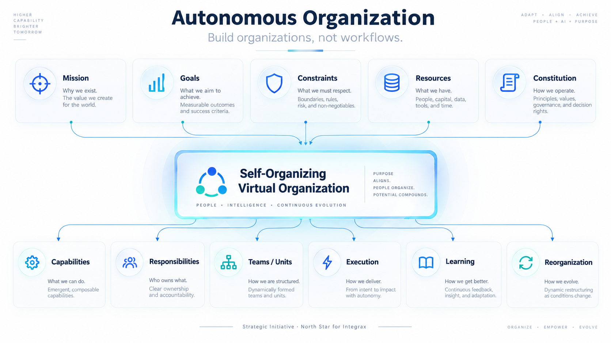
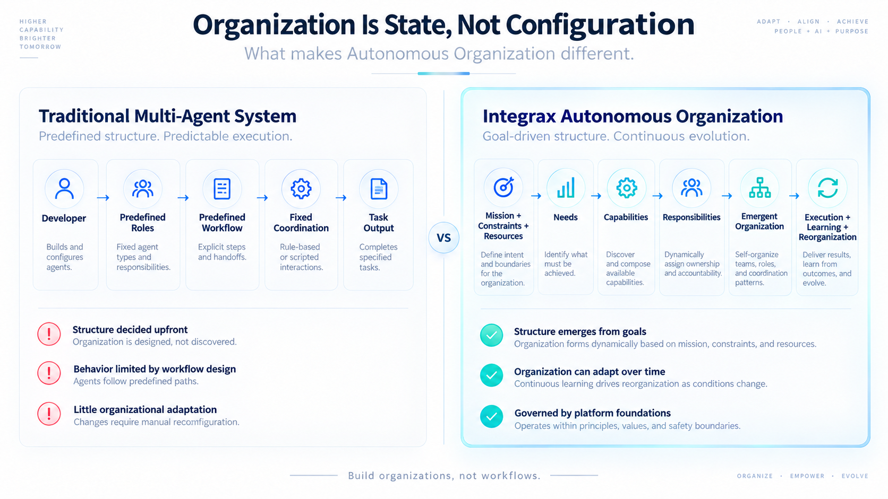
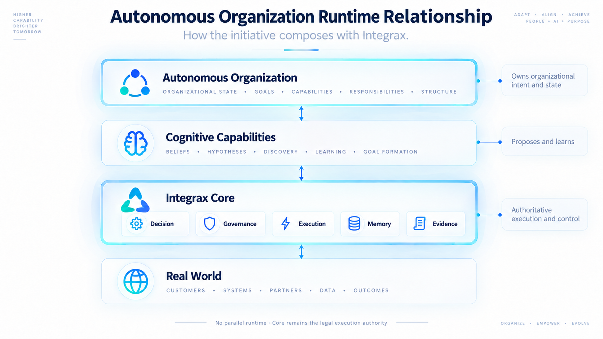
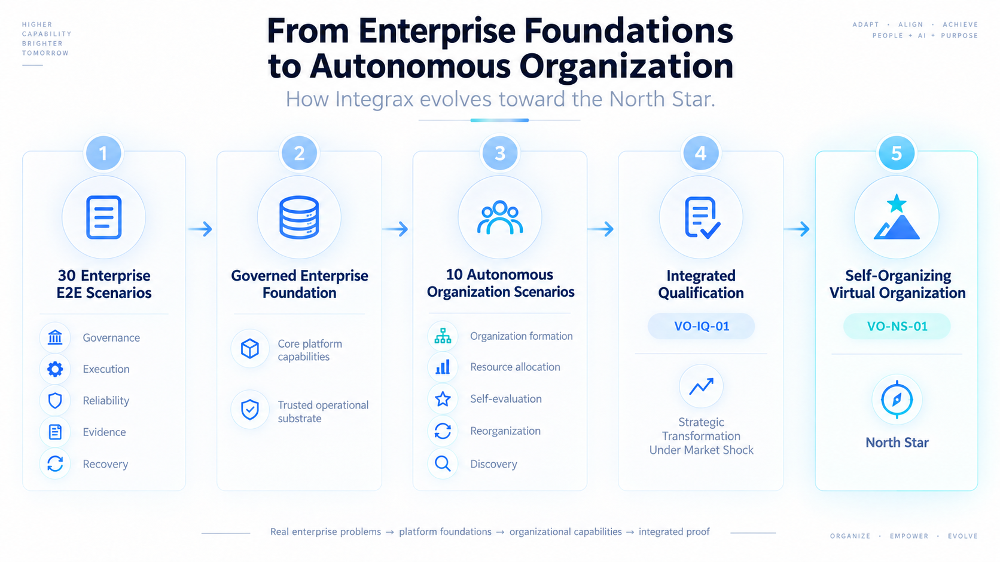
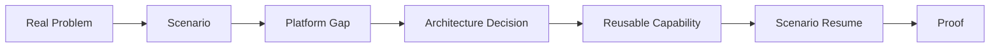
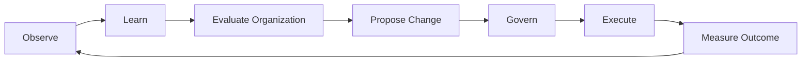

# Autonomous Organization

**Status:** Strategic initiative / North Star program — **not** a shipped product, platform domain, or runtime  
**Program SSOT (maintainers):** [`AUTONOMOUS_ORGANIZATION_INITIATIVE.md`](../maintainers/plans/AUTONOMOUS_ORGANIZATION_INITIATIVE.md)

## North Star

> **Governed Self-Organizing Virtual Organization**

A governed system receives **mission, goals, constraints, resources, and constitution** — not a predefined org chart — and can discover capabilities, assign responsibilities and authority, compose execution resources, evaluate organizational fitness, and change internal structure over time while preserving commitments, memory, governance, and auditability.

<picture>
  <source
    media="(prefers-color-scheme: dark)"
    srcset="../assets/public/autonomous-organization/autonomous-organization-hero-dark.png"
  >
  <source
    media="(prefers-color-scheme: light)"
    srcset="../assets/public/autonomous-organization/autonomous-organization-hero-light.png"
  >
  
</picture>

> **Strategic Initiative / North Star — not an implemented autonomous organization runtime.**

---

## Why this matters

Enterprise operations need more than task-level agents. They need systems that can **reorganize** when missions, markets, constraints, or capabilities change — without abandoning governance, evidence, or commitments.

Autonomous Organization names a **strategic program** on Intergrax: how the platform could eventually support organizations that **form and transform themselves** under human constitution and existing execution substrate — not a parallel stack or “AI company already running.”

**Platform principle (non-negotiable):** the platform operates on **contracts, not implementations**. Mechanisms from this program must be pluggable, governable, replaceable, and reachable through explicit platform contracts.

---

## Organization is state, not configuration

Traditional multi-agent setups often fix structure up front:

```text
developer → predefined roles → predefined workflow
```

Autonomous Organization explores a different shape:

```text
mission → needs → capabilities → responsibilities → emergent organization
```

<picture>
  <source
    media="(prefers-color-scheme: dark)"
    srcset="../assets/public/autonomous-organization/organization-is-state-not-configuration-dark.png"
  >
  <source
    media="(prefers-color-scheme: light)"
    srcset="../assets/public/autonomous-organization/organization-is-state-not-configuration-light.png"
  >
  
</picture>

This initiative is **not** a feature SKU, a new runtime, an “AI CEO plus predefined workers” pattern, or a second scenario catalog. It advances through **real enterprise Scenario Proofs** on the existing Intergrax platform.

---

## How it fits in Intergrax

| Layer | Role |
|-------|------|
| **Virtual Worker** | Persistent holder of one business responsibility |
| **Virtual Workforce** | Fleet of Virtual Workers |
| **Autonomous Organization** | System that can determine which capabilities, responsibilities, units, workers, teams, and allocations should exist — and how they should change |

Autonomous Organization **may use** Virtual Workers; it does **not** replace [Virtual Workforce](VIRTUAL_WORKFORCE.md) or [Autonomous Work](../architecture/AUTONOMOUS_WORK.md) domain ownership. Organizational vs worker goal contracts remain a **future boundary** to be tested through scenarios.

| Portfolio | Role |
|-----------|------|
| **[Enterprise E2E Scenario Portfolio](../maintainers/plans/ENTERPRISE_E2E_SCENARIO_CATALOG.md)** | Enterprise safety + execution substrate (v1 Frozen-30 + v2 addendum; current **34** identities) |
| **Autonomous Organization Scenario Portfolio v1** | Goal → Capability → Organization → Learning → Reorganization — see [scenario portfolio](../maintainers/plans/AUTONOMOUS_ORGANIZATION_SCENARIO_PORTFOLIO.md) |

The enterprise portfolio’s **v1 Frozen-30** record is **not rewritten** by this initiative; VO **VO-S01–VO-S10** remains a **separate** portfolio — **no** merged mega-catalog.

---

## Relationship to execution and cognition

Autonomous Organization **owns organizational intent and state**. Cognitive capabilities (beliefs, hypotheses, discovery, learning, goal formation) **propose and learn** — as compositional support, not as owner of the whole organization. Cognitive Layer direction is **not** a claim of full implementation.

```text
Autonomous Organization     → owns organizational intent/state
Cognitive capabilities    → propose and learn
Intergrax Core            → governs and executes
Real World                → provides outcomes and consequences
```

<picture>
  <source
    media="(prefers-color-scheme: dark)"
    srcset="../assets/public/autonomous-organization/autonomous-organization-runtime-relationship-dark.png"
  >
  <source
    media="(prefers-color-scheme: light)"
    srcset="../assets/public/autonomous-organization/autonomous-organization-runtime-relationship-light.png"
  >
  
</picture>

> **No parallel runtime. Execution Engine remains the legal execution authority.** Governance remains the owner of control; cognition may propose organizational changes but does not seize execution authority.

---

## How the program advances

<picture>
  <source
    media="(prefers-color-scheme: dark)"
    srcset="../assets/public/autonomous-organization/autonomous-organization-evolution-dark.png"
  >
  <source
    media="(prefers-color-scheme: light)"
    srcset="../assets/public/autonomous-organization/autonomous-organization-evolution-light.png"
  >
  
</picture>

| Stage | Meaning |
|-------|---------|
| **Frozen-30** | Governed enterprise execution foundation |
| **VO scenario portfolio (10)** | Organizational capabilities proven scenario-by-scenario |
| **VO-IQ-01** | Integrated qualification across capabilities |
| **VO-NS-01** | Future North Star integrative challenge (not in frozen ten) |

Progress is **scenario-first** on normal Intergrax proof rails: frozen problem identity, authoring gates, platform-gap stops, adversarial proof — not architecture demos.

---

## Scenario-driven evolution

Each scenario exists to solve a **real enterprise E2E problem**, not to showcase a pre-drawn architecture.



**Organizational adaptation loop** (conceptual — governed at every step):



Implementation epochs and gates: [`AUTONOMOUS_ORGANIZATION_ROADMAP.md`](../maintainers/plans/AUTONOMOUS_ORGANIZATION_ROADMAP.md)  
Capability direction and gaps: [`AUTONOMOUS_ORGANIZATION_CAPABILITY_MODEL.md`](../maintainers/plans/AUTONOMOUS_ORGANIZATION_CAPABILITY_MODEL.md)

---

## Maturity and current status

| Claim | Allowed? |
|-------|----------|
| Strategic initiative with frozen scenario portfolio v1 | Yes |
| Runtime / OrganizationEngine / production organizational autonomy | **No** |
| Individual VO scenarios executable or verified | Only when per-package lifecycle says so |

North Star challenge **VO-NS-01** is a **future** integrative test outside the frozen ten-scenario v1 portfolio.

---

## Go deeper

| Topic | Document |
|-------|----------|
| Program governance | [Initiative SSOT](../maintainers/plans/AUTONOMOUS_ORGANIZATION_INITIATIVE.md) |
| Frozen scenario identities | [Scenario Portfolio](../maintainers/plans/AUTONOMOUS_ORGANIZATION_SCENARIO_PORTFOLIO.md) |
| Capability domains & gaps | [Capability Model](../maintainers/plans/AUTONOMOUS_ORGANIZATION_CAPABILITY_MODEL.md) |
| Outcome epochs | [Program Roadmap](../maintainers/plans/AUTONOMOUS_ORGANIZATION_ROADMAP.md) |
| Executable evidence | [Proof Library](../proofs/PROOF_LIBRARY.md) · [platform proofs](../../../platform_proofs/README.md) |
| Worker substrate | [Autonomous Work](../architecture/AUTONOMOUS_WORK.md) · [Virtual Workforce](VIRTUAL_WORKFORCE.md) |
| Platform mental model | [Architecture Overview](../architecture/ARCHITECTURE_OVERVIEW.md) |
| Public product outcomes | [Roadmap](ROADMAP.md) |
