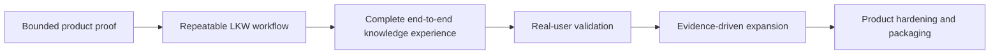

<!--
© Artur Czarnecki. All rights reserved.
Intergrax is source-available under the Intergrax Evaluation and Collaboration License 1.0.
See LICENSE for permitted evaluation, collaboration, and contribution use.
-->

# Intergrax Public Roadmap

This roadmap explains how Intergrax progresses from bounded product proof to real-user validation and evidence-driven expansion — without implementation task IDs or release-date promises.

> [!WARNING]
> Intergrax is **source-available** and under active R&D. LKW is **Backend Product Alpha / MVP** and remains **PARTIAL**. This roadmap is **outcome-gated**, not a release-date commitment. **Real-user validation incomplete**. **Commercial validation incomplete**.

## At a glance

| Question | Answer |
|----------|--------|
| Primary product focus | Local Knowledge Workspace (LKW) |
| Current public proof | Bounded LKW product/platform proof |
| Current development objective | Make the core LKW workflow repeatable and durable |
| Next validation gate | Complete end-to-end workflow and test it with real users |
| How progress is verified | [PROOFS.md](../proofs/PROOFS.md) and named proof paths |
| Release dates | No public date commitment |

## How to read this roadmap

This document describes **user and validation outcomes**, not internal implementation queues. Detailed technical sequencing belongs to owning implementation plans — for example, the [LKW implementation plan](../technical/applications/local_workspace_application/IMPLEMENTATION_PLAN.md) (technical detail, not the public roadmap).

[PROOFS.md](../proofs/PROOFS.md) owns current proof status and claim boundaries. Moving to a later phase requires evidence — bounded verification, repeated use, or real-user feedback — not only completed code.

If you need to decide whether Intergrax fits your problem today, start with [USE_CASES.md](USE_CASES.md) and [BUILD_WITH_INTERGRAX.md](../builders/BUILD_WITH_INTERGRAX.md).

The sequence above is conceptual. Each step requires named evidence before the next is treated as achieved.

## Now — Make LKW repeatable

Focus: user-visible outcomes that make LKW dependable enough for external evaluation and design-partner trials.

| User result | Why it matters | Proof required before calling it complete |
|-------------|----------------|-------------------------------------------|
| Durable workspace configuration | Users should not lose setup on restart | Documented create/configure/restart path with persisted state |
| Predictable indexed sources | Approved sources can be added, indexed, disabled and recovered | Bounded lifecycle proof across documented source types |
| Grounded Ask over indexed knowledge | Answers cite indexed evidence | Repeatable Ask with citations and evidence in named environment |
| Durable Slack DM interaction | Slack should not depend on temporary in-memory state | Restart-safe conversational path for documented Slack DM scope |
| Setup, restart and recovery | Evaluators should not need ad hoc developer reconstruction | Repeatable setup guide and recovery without manual repair |
| Reproducible public proof path | External readers can verify claims | [LKW Platform Proof](../proofs/LKW_PLATFORM_PROOF.md) remains runnable in documented environment |

Not every outcome above is complete today. See [PROOFS.md](../proofs/PROOFS.md) for current status.

## Next — Validate the complete knowledge workflow

These are **target outcomes** for the next validation gate. None are claimed as finished.

| Target outcome | Evidence required |
|----------------|-------------------|
| Complete connected Slack knowledge workflow | End-to-end proof: Slack as interaction surface and approved knowledge source with grounded answers |
| Hybrid Ask combining indexed and live evidence | Authorized live evidence joins indexed RAG in one grounded answer with unified provenance — **Hybrid Ask is not complete** |
| First governed Google Workspace LKW proof | Bounded Google Workspace knowledge inside LKW after prerequisite product proof — **not complete** |
| Repeatable design-partner setup | A real user can start and try LKW without ad hoc developer reconstruction |
| Initial real-user validation | Structured trials with knowledge workers — **real-user validation incomplete** |
| Usefulness and trust metrics | Measure citation correctness, repeated use, trust and blockers — not yet baselined |

## Supporting platform track

Shared platform work is justified by real product requirements from LKW — not by abstract platform expansion.

**Token Optimization** remains a **Featured platform-capability proof** with **PARTIAL** status. It demonstrates deterministic prompt and context optimization with bounded evidence. Performance promotion requires bounded evidence and approved claim gates. **Universal savings are not claimed**; production-proven savings are not claimed.

Platform expansion does not override the primary LKW workflow. See [Token Optimization guide](../capabilities/token_optimization/README.md).

## Later — Expand from evidence

Future directions depend on validated demand and evidence — not preset commitments:

- Additional knowledge providers when a concrete user workflow justifies integration breadth
- Another conversational frontend when user demand justifies it
- Improved self-hosted installation, diagnostics and recovery
- Product security and operational hardening
- Production-oriented packaging for explicitly authorized partners
- Long-term commercial or source-available packaging decisions after validation

Not every direction above will be pursued. Demand and evidence gate each decision.

## Decision principles

- **Application first** — product workflow drives platform work
- **Evidence before promotion** — proof paths and claim gates before broader public wording
- **Demand before integration breadth** — providers follow validated workflows
- **Explicit permission and responsibility boundaries** — see [LICENSE](../../../LICENSE) and [COLLABORATION.md](../community/COLLABORATION.md)
- **No expansion without a concrete user workflow**
- **No release-date promises without a validated delivery basis**

## What is not promised

- No finished hosted SaaS
- No claim that Hybrid Ask is complete
- No claim of a complete provider catalog
- No completed real-user validation
- No completed commercial validation
- No claim of universal production readiness
- No universal token-savings claim
- No fixed release-date commitment

## Follow progress

| Need | Document |
|------|----------|
| Current proof status | [PROOFS.md](../proofs/PROOFS.md) |
| LKW guided proof | [LKW Platform Proof](../proofs/LKW_PLATFORM_PROOF.md) |
| Use-case fit | [USE_CASES.md](USE_CASES.md) |
| Build or evaluate | [BUILD_WITH_INTERGRAX.md](../builders/BUILD_WITH_INTERGRAX.md) |
| Public navigation | [Public documentation map](../community/PUBLIC_DOCUMENTATION_MAP.md) |
| Technical implementation detail | [LKW implementation plan](../technical/applications/local_workspace_application/IMPLEMENTATION_PLAN.md) |
