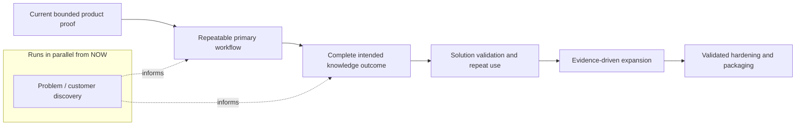

<!--
© Artur Czarnecki. All rights reserved.
Intergrax is source-available under the Intergrax Evaluation and Collaboration License 1.0.
See LICENSE for permitted evaluation, collaboration, and contribution use.
-->

# Intergrax Public Roadmap

This is the canonical public product roadmap for Intergrax. It describes what user and product outcomes must become true next, how those outcomes are evidenced, and when broader claims or expansion are justified.

> [!WARNING]
> Outcome-gated roadmap - not a release-date commitment. LKW is the **Active reference product**, **Backend Product Alpha / MVP**, **PARTIAL**. Real-user and commercial validation remain open; see [PROOFS.md](../proofs/PROOFS.md).

## At a glance

| Question | Answer |
|----------|--------|
| Primary product focus | Local Knowledge Workspace (LKW) |
| Current maturity | Backend Product Alpha / MVP - PARTIAL |
| What is being established now | A repeatable supported LKW workflow **and** parallel problem/customer discovery |
| Roadmap model | Outcome gates, not an implementation queue |
| Discovery status | Problem/customer discovery in progress; not yet completed |
| Release dates | No public date commitment |

## How to read this roadmap

This document describes **user and validation outcomes**, not internal implementation queues. Detailed technical and module sequencing belongs to the [Technical Documentation Map](../technical/DOCUMENTATION_MAP.md) and the owning module sources of truth.

The canonical cross-domain architecture implementation sequence is maintained separately in the [Harness Architecture Evolution Roadmap](HARNESS_ARCHITECTURE_EVOLUTION_ROADMAP.md). It defines architecture migration order, invariants, CURRENT/PARTIAL/GAP/TARGET boundaries, dependencies, and proof gates; it does not replace this public outcome roadmap.

[PROOFS.md](../proofs/PROOFS.md) owns what is currently demonstrated and the related claim boundaries. Moving to a later phase requires evidence - bounded verification, repeated use, or real-user feedback - not only implementation completion.

If you need to decide whether Intergrax fits your problem today, start with [USE_CASES.md](USE_CASES.md).



The sequence is conceptual and has no dates. Each product transition requires evidence before the next stage is treated as achieved.

**Parallel discovery** runs alongside product and proof work from NOW. Discovery informs what gets built; it does not wait for a complete intended LKW workflow. The formal **solution-validation** gate (VALIDATE) begins only once the intended workflow is usable end to end.

```text
problem discovery
↔ product hypothesis
↔ smallest valuable workflow
↔ implementation / proof
→ usable workflow
→ solution validation
→ repeated use / pilot evidence
→ evidence-driven expansion
```

This loop supports rapid evidence-driven product decisions - not endless research or process overhead.

## Three evidence classes

Intergrax distinguishes three evidence classes. They must not be conflated.

| Class | What it establishes | When it applies |
|-------|---------------------|-----------------|
| **Problem / customer discovery** | Target people experience a recurring problem; current alternatives have meaningful friction; the workflow is worth investigating | **Now** - in parallel with product development |
| **Solution / real-user validation** | Users can complete the workflow; results are useful and trusted; users reuse it; Intergrax improves the target workflow | **Later** - after a usable end-to-end workflow exists (VALIDATE gate) |
| **Commercial validation** | Genuine commercial commitment, buying behavior, or authorized commercial engagement | **Separate later boundary** - not established by problem interviews |

Problem interviews and discovery conversations are **not** commercial validation. None of these classes is complete today; problem/customer discovery is in progress, not finished.

## NOW - Make the primary workflow repeatable (and learn from users in parallel)

**User / product outcome:** LKW becomes a dependable supported workflow that an evaluator can run, repeat, restart, and recover without ad hoc developer reconstruction.

**Parallel discovery outcome:** learn who experiences the problem, what real workflow causes it, what users do today, where time/trust/risk/manual effort concentrates, which alternatives or workarounds they use, how often the problem occurs, what outcome matters, who owns or decides around the problem, and which workflows deserve deeper product evaluation.

Discovery does **not** require a complete LKW workflow. It informs product hypotheses while implementation and proof proceed.

| User / product outcome | Evidence required before calling it achieved |
|-------------------------|-----------------------------------------------|
| Persistent workspace and configuration | A documented create, configure, restart, and resume path preserves the required state |
| Predictable approved-source lifecycle | A bounded source lifecycle can be repeated for documented sources, including disable and recovery |
| Repeatable grounded indexed Ask | A supported Ask run returns reviewable citations and evidence from indexed knowledge |
| Setup, restart, and recovery | A non-maintainer evaluator can follow the documented path without manual repair or reconstruction |
| Runnable public proof | The [LKW Platform Proof](../../../applications/local_workspace_application/docs/proof/LKW_PLATFORM_PROOF.md) is reproducible in its documented environment |

The stage is achieved only when the documented workflow is repeatable as a user-facing proof, not merely when its implementation exists. See [PROOFS.md](../proofs/PROOFS.md) for current evidence.

## NEXT - Prove the complete intended knowledge outcome

**User / product outcome:** a user can combine indexed knowledge with authorized live evidence and receive a grounded answer with coherent, reviewable provenance.

**Current precise boundary:** A bounded indexed Ask path exists. Mixed indexed + authorized live Hybrid Ask remains incomplete. Complete external live-provider access remains incomplete.

| User / product outcome | Evidence required before calling it achieved |
|-------------------------|-----------------------------------------------|
| Complete intended knowledge outcome | A bounded end-to-end proof shows indexed and authorized live evidence used together with reviewable provenance |
| Repeatable evaluator setup | A non-maintainer evaluator can set up and use the workflow without developer reconstruction |
| Coherent evidence and provenance | Users and reviewers can inspect which evidence supports the answer and how authorization applies |
| End-to-end product workflow | The supported workflow can be completed from setup through answer and recovery without an open product gap |

The next stage is a product outcome, not a commitment to a particular provider, interaction surface, or engineering order.

## VALIDATE - Establish real-user value and repeat use

**Solution / real-user validation** is a distinct gate from problem/customer discovery and from commercial validation. Internal tests, maintainers, and technical evaluators do not by themselves constitute external validation.

**User / product outcomes to learn:**

- Can target users complete the supported workflow?
- Do the answers and evidence meet their needs?
- Do users return to the workflow?
- Where does trust break?
- Where do setup or recovery block users?
- What would users actually continue using?

| User / product outcome | Evidence required before calling it achieved |
|-------------------------|-----------------------------------------------|
| Users can complete the workflow | Observed real-user evaluation and documented feedback on completion, setup, and recovery |
| Answers and evidence are useful and trusted | User feedback identifies whether answers, provenance, and boundaries meet the intended need |
| Repeat use is meaningful | Evidence shows whether users return and what they would continue using |
| Friction and trust failures are understood | Observed blockers and trust breaks are recorded well enough to choose the next product decision |

The **formal solution-validation gate** begins only after the intended workflow is usable end-to-end. That boundary applies to **solution validation**, not to problem/customer discovery - discovery starts earlier and runs in parallel. No internal testing result or discovery interview is presented as real-user validation or commercial validation.

## EXPAND - Evidence-driven expansion

Expansion follows this decision path:

**validated workflow → observed demand → accepted evidence → expansion decision**

Potential expansion outcomes are deliberately generic:

- additional knowledge providers when a validated workflow requires them;
- additional interaction surfaces when users demonstrate demand;
- better deployment, diagnostics, and recovery;
- additional reusable platform capabilities when a product need drives them.

| User / product outcome | Evidence required before calling it achieved |
|-------------------------|-----------------------------------------------|
| Broader capability serves a validated workflow | Observed demand and an explicit outcome-based reason to expand |
| Expansion is safe to claim publicly | Accepted evidence, stated limitations, and a decision that the breadth improves the supported workflow |

No provider, surface, or breadth item is promised in advance.

## HARDEN / PACKAGE - Improve operations after validated use

**User / product outcome:** recurring validated use justifies improvements to operational reliability, deployment, diagnostics, permissions, supportability, or product packaging.

**Evidence required:** real-user or partner use has exposed a concrete recurring need, and bounded evidence supports the proposed hardening or packaging decision.

## Supporting platform work

Product need drives platform work. **Token Optimization** remains a **Featured platform-capability proof** with **PARTIAL** status and bounded evidence. It is a supporting reusable capability, not a separate public roadmap phase.

See the [Token Optimization guide](../capabilities/token_optimization/README.md) for its bounded proof and limitations.

**Multiplayer AI** is a separate **strategic platform capability** at **architecture / roadmap stage**. A canonical architecture and implementation roadmap exists; runtime proof is **not yet established**. The capability is intended to support governed multi-principal collaboration - shared work, durable artifacts, decisions, delegated authority, principal-scoped context, and provenance - among humans, agents, services, and eventually external agents. Future promotion into public proof follows accepted implementation and evidence, not architecture alone.

See the [Multiplayer AI architecture](../capabilities/architecture/MULTIPLAYER_AI.md) for the strategic direction and current boundaries.

**Platform Extensibility / Plugins** is another **strategic platform capability**. Extension mechanisms already exist across multiple domains; the canonical cross-cutting architecture is **frozen**. Multiple extension-platform implementation slices exist and the core program is **closed**; residual Protocol v2 and breadth work remain **planned**. Public proof promotion requires accepted executable third-party E2E evidence - a complete install-to-runtime path without modifying Intergrax core is **not yet established**.

See the [Platform Plugins architecture](../architecture/PLATFORM_PLUGINS.md) for the strategic direction and current boundaries.

## Discovery signals and decision discipline

Use discovery to inform product decisions - not to substitute for building or for later solution validation.

**Strong signals** may include:

- the problem is described without prompting from Intergrax;
- it occurs repeatedly;
- users already perform manual workarounds;
- existing solutions are insufficient for a concrete reason;
- the organization spends meaningful time or effort addressing it;
- the participant wants to continue into evaluation;
- a domain owner or decision owner joins;
- representative workflow or data is offered for a bounded evaluation.

**Weak signals** include generic praise, "interesting," GitHub stars, likes, or hypothetical willingness without concrete workflow behavior.

**Discovery decisions** (no rigid numerical thresholds):

| Outcome | When |
|---------|------|
| **CONTINUE** | Recurring pain, credible workflow, and a reason to proceed |
| **REVISE** | A real problem exists but the user, workflow, or value hypothesis needs adjustment |
| **STOP** | Evidence does not justify continued investment in that hypothesis |

## Target participant hypotheses

Target participant categories are **hypotheses**, not validated ICPs. Useful starting hypotheses may include:

- AI / engineering leaders building internal AI applications;
- CTO / Heads of Engineering introducing AI into organizational workflows;
- knowledge-intensive teams with controlled documentation and workflows;
- enterprise AI / automation teams combining multiple systems with access and evidence requirements.

No category is claimed as a proven buyer or ICP. See [Partners](../community/PARTNERS.md) for governed pilot routes when evaluation deepens.

## Decision principles

- **Application first** - product workflow drives platform work.
- **Discovery informs build** - problem/customer discovery runs in parallel; it does not wait for product completion.
- **Evidence before promotion** - bounded proof and claim boundaries precede broader wording.
- **Demand before integration breadth** - breadth follows a validated workflow.
- **Explicit permission and responsibility boundaries** - see [LICENSE](../../../LICENSE) and [COLLABORATION.md](../community/COLLABORATION.md).
- **No expansion without a concrete user workflow.**
- **No release-date promises without a validated basis.**

## What is not promised

- No finished hosted SaaS.
- No claim that mixed indexed + authorized live Hybrid Ask is complete.
- No claim of complete external live-provider access or a complete provider catalog.
- No completed problem/customer discovery, real-user validation, validated ICP, product-market fit, or commercial validation.
- No claim of universal production readiness or universal token savings.
- No fixed release-date commitment.

Authoritative evidence boundaries: [PROOFS.md](../proofs/PROOFS.md).

## Reader routes

| Reader need | Start here |
|-------------|------------|
| Current evidence | [PROOFS.md](../proofs/PROOFS.md) |
| Verify the bounded LKW proof | [LKW Platform Proof](../../../applications/local_workspace_application/docs/proof/LKW_PLATFORM_PROOF.md) |
| Current workflow fit | [USE_CASES.md](USE_CASES.md) |
| Cross-domain architecture implementation sequence | [Harness Architecture Evolution Roadmap](HARNESS_ARCHITECTURE_EVOLUTION_ROADMAP.md) |
| Build or inspect a bounded workflow | [BUILD_WITH_INTERGRAX.md](../builders/BUILD_WITH_INTERGRAX.md) |
| Bounded evaluation | [Evaluation Guide](../builders/EVALUATION_GUIDE.md) |
| Pilot or partner route | [Partners](../community/PARTNERS.md) |
| Public navigation | [Public Documentation Map](../community/PUBLIC_DOCUMENTATION_MAP.md) |
| Deep technical sequencing (secondary route) | [Technical Documentation Map](../technical/DOCUMENTATION_MAP.md) and the owning module documentation |
