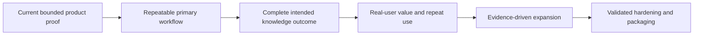

<!--
© Artur Czarnecki. All rights reserved.
Intergrax is source-available under the Intergrax Evaluation and Collaboration License 1.0.
See LICENSE for permitted evaluation, collaboration, and contribution use.
-->

# Intergrax Public Roadmap

This is the canonical public product roadmap for Intergrax. It describes what user and product outcomes must become true next, how those outcomes are evidenced, and when broader claims or expansion are justified.

> [!WARNING]
> Intergrax is **source-available** and under active R&D. LKW is the **Primary product proof**, **Backend Product Alpha / MVP**, and remains **PARTIAL**. This roadmap is **outcome-gated**, not a release-date commitment. **Real-user validation incomplete**. **Commercial validation incomplete**.

## At a glance

| Question | Answer |
|----------|--------|
| Primary product focus | Local Knowledge Workspace (LKW) |
| Current maturity | Backend Product Alpha / MVP — PARTIAL |
| What is being established now | A repeatable supported LKW workflow |
| Roadmap model | Outcome gates, not an implementation queue |
| Current validation boundary | Real-user validation incomplete; commercial validation incomplete |
| Release dates | No public date commitment |

## How to read this roadmap

This document describes **user and validation outcomes**, not internal implementation queues. Detailed technical and module sequencing belongs to the [Technical Documentation Map](../technical/DOCUMENTATION_MAP.md) and the owning module sources of truth.

[PROOFS.md](../proofs/PROOFS.md) owns what is currently demonstrated and the related claim boundaries. Moving to a later phase requires evidence — bounded verification, repeated use, or real-user feedback — not only implementation completion.

If you need to decide whether Intergrax fits your problem today, start with [USE_CASES.md](USE_CASES.md).

The sequence is conceptual and has no dates. Each transition requires evidence before the next stage is treated as achieved.

## NOW — Make the primary workflow repeatable

**User / product outcome:** LKW becomes a dependable supported workflow that an evaluator can run, repeat, restart, and recover without ad hoc developer reconstruction.

| User / product outcome | Evidence required before calling it achieved |
|-------------------------|-----------------------------------------------|
| Persistent workspace and configuration | A documented create, configure, restart, and resume path preserves the required state |
| Predictable approved-source lifecycle | A bounded source lifecycle can be repeated for documented sources, including disable and recovery |
| Repeatable grounded indexed Ask | A supported Ask run returns reviewable citations and evidence from indexed knowledge |
| Setup, restart, and recovery | A non-maintainer evaluator can follow the documented path without manual repair or reconstruction |
| Runnable public proof | The [LKW Platform Proof](../proofs/LKW_PLATFORM_PROOF.md) is reproducible in its documented environment |

The stage is achieved only when the documented workflow is repeatable as a user-facing proof, not merely when its implementation exists. See [PROOFS.md](../proofs/PROOFS.md) for current evidence.

## NEXT — Prove the complete intended knowledge outcome

**User / product outcome:** a user can combine indexed knowledge with authorized live evidence and receive a grounded answer with coherent, reviewable provenance.

**Current precise boundary:** A bounded indexed Ask path exists. Mixed indexed + authorized live Hybrid Ask remains incomplete. Complete live-provider access remains incomplete.

| User / product outcome | Evidence required before calling it achieved |
|-------------------------|-----------------------------------------------|
| Complete intended knowledge outcome | A bounded end-to-end proof shows indexed and authorized live evidence used together with reviewable provenance |
| Repeatable evaluator setup | A non-maintainer evaluator can set up and use the workflow without developer reconstruction |
| Coherent evidence and provenance | Users and reviewers can inspect which evidence supports the answer and how authorization applies |
| End-to-end product workflow | The supported workflow can be completed from setup through answer and recovery without an open product gap |

The next stage is a product outcome, not a commitment to a particular provider, interaction surface, or engineering order.

## VALIDATE — Establish real-user value and repeat use

Real-user validation is a distinct gate. Internal tests, maintainers, and technical evaluators do not by themselves constitute external validation.

**User / product outcomes to learn:**

- Can target users complete the supported workflow?
- Do the answers and evidence meet their needs?
- Do users return to the workflow?
- Where does trust break?
- Where do setup or recovery block users?
- What would users actually continue using?

| User / product outcome | Evidence required before calling it achieved |
|-------------------------|-----------------------------------------------|
| Users can complete the workflow | Observed real-user evaluation and documented feedback on completion, setup, and recovery |
| Answers and evidence are useful and trusted | User feedback identifies whether answers, provenance, and boundaries meet the intended need |
| Repeat use is meaningful | Evidence shows whether users return and what they would continue using |
| Friction and trust failures are understood | Observed blockers and trust breaks are recorded well enough to choose the next product decision |

This gate begins only after the intended workflow is usable end-to-end. No internal testing result is presented as real-user validation.

## EXPAND — Evidence-driven expansion

Expansion follows this decision path:

**validated workflow → observed demand → accepted evidence → expansion decision**

Potential expansion outcomes are deliberately generic:

- additional knowledge providers when a validated workflow requires them;
- additional interaction surfaces when users demonstrate demand;
- better deployment, diagnostics, and recovery;
- additional reusable platform capabilities when a product need drives them.

| User / product outcome | Evidence required before calling it achieved |
|-------------------------|-----------------------------------------------|
| Broader capability serves a validated workflow | Observed demand and an explicit outcome-based reason to expand |
| Expansion is safe to claim publicly | Accepted evidence, stated limitations, and a decision that the breadth improves the supported workflow |

No provider, surface, or breadth item is promised in advance.

## HARDEN / PACKAGE — Improve operations after validated use

**User / product outcome:** recurring validated use justifies improvements to operational reliability, deployment, diagnostics, permissions, supportability, or product packaging.

**Evidence required:** real-user or partner use has exposed a concrete recurring need, and bounded evidence supports the proposed hardening or packaging decision. This stage does not create a general production-ready claim.

## Supporting platform work

Product need drives platform work. **Token Optimization** remains a **Featured platform-capability proof** with **PARTIAL** status and bounded evidence. It is a supporting reusable capability, not a separate public roadmap phase. **Universal savings are not claimed**.

See the [Token Optimization guide](../capabilities/token_optimization/README.md) for its bounded proof and limitations.

**Multiplayer AI** is a separate **strategic platform capability** at **architecture / roadmap stage**. A canonical architecture and implementation roadmap exists; runtime proof is **not yet established**. The capability is intended to support governed multi-principal collaboration — shared work, durable artifacts, decisions, delegated authority, principal-scoped context, and provenance — among humans, agents, services, and eventually external agents. Future promotion into public proof follows accepted implementation and evidence, not architecture alone.

See the [Multiplayer AI architecture](../capabilities/architecture/MULTIPLAYER_AI.md) for the strategic direction and current boundaries.

**Platform Extensibility / Plugins** is another **strategic platform capability**. Extension mechanisms already exist across multiple domains; the canonical cross-cutting architecture is **frozen**. Implementation stages for harmonization, trust and qualification, and developer experience remain **planned**. Public proof promotion requires accepted executable third-party E2E evidence — a complete install-to-runtime path without modifying Intergrax core is **not yet established**.

See the [Platform Plugins architecture](../architecture/PLATFORM_PLUGINS.md) for the strategic direction and current boundaries.

## Decision principles

- **Application first** — product workflow drives platform work.
- **Evidence before promotion** — bounded proof and claim boundaries precede broader wording.
- **Demand before integration breadth** — breadth follows a validated workflow.
- **Explicit permission and responsibility boundaries** — see [LICENSE](../../../LICENSE) and [COLLABORATION.md](../community/COLLABORATION.md).
- **No expansion without a concrete user workflow.**
- **No release-date promises without a validated basis.**

## What is not promised

- No finished hosted SaaS.
- No claim that mixed indexed + authorized live Hybrid Ask is complete.
- No claim of complete live-provider access or a complete provider catalog.
- No completed real-user validation.
- No completed commercial validation.
- No claim of universal production readiness.
- No universal token-savings claim.
- No fixed release-date commitment.

## Reader routes

| Reader need | Start here |
|-------------|------------|
| Current evidence | [PROOFS.md](../proofs/PROOFS.md) |
| Verify the bounded LKW proof | [LKW Platform Proof](../proofs/LKW_PLATFORM_PROOF.md) |
| Current workflow fit | [USE_CASES.md](USE_CASES.md) |
| Build or inspect a bounded workflow | [BUILD_WITH_INTERGRAX.md](../builders/BUILD_WITH_INTERGRAX.md) |
| Bounded evaluation | [Evaluation Guide](../builders/EVALUATION_GUIDE.md) |
| Pilot or partner route | [Partners](../community/PARTNERS.md) |
| Public navigation | [Public Documentation Map](../community/PUBLIC_DOCUMENTATION_MAP.md) |
| Deep technical sequencing (secondary route) | [Technical Documentation Map](../technical/DOCUMENTATION_MAP.md) and the owning module documentation |
