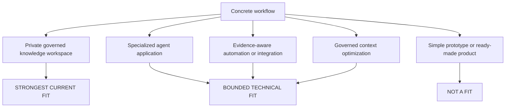

<!--
© Artur Czarnecki. All rights reserved.
Intergrax is source-available under the Intergrax Evaluation and Collaboration License 1.0.
See LICENSE for permitted evaluation, collaboration, and contribution use.
-->

# Intergrax Use Cases

This is the canonical decision guide for a concrete question: **does Intergrax fit my workflow?** It evaluates stable user problems and responsibility fit. It does not replace the proof record, an outcome roadmap, or a product-specific evaluation.

Intergrax is source-available and in active R&D. Current evidence is bounded; it is not a universal production-readiness, real-user, commercial-validation, or finished-SaaS claim.

## At a glance

| Decision question | Current answer |
|-------------------|----------------|
| Strongest current fit | Private governed knowledge workspace — **Primary product proof**, **Backend Product Alpha / MVP**, **PARTIAL** |
| Bounded technical fit | Specialized governed applications and context workflows; a **Reasonable technical evaluation** may be appropriate |
| Not a fit today | Finished SaaS immediately, no-code automation, retrieval primitives only, or unrestricted OSS — another approach may fit better |
| Primary next action | Review [PROOFS](../proofs/PROOFS.md) before evaluation or partner discussion |

## Start with your workflow

Intergrax is more likely to fit when the workflow needs several of these responsibilities:

- explicit identity, permissions, or tenant context;
- governed knowledge access and grounded results;
- controlled tool or integration execution;
- human approval boundaries;
- evidence, provenance, receipts, or trace;
- recovery and observability;
- reusable foundations across more than one workflow.

These are fit signals, not a requirement that every workflow use every mechanism. Ask:

1. What does a person do from the first request to the accepted outcome?
2. Which knowledge and external actions are allowed, and which are forbidden?
3. What must a reviewer be able to inspect afterward?
4. Can the product team own the domain workflow and validate the result in a bounded evaluation?

Use this stable vocabulary:

- **STRONGEST CURRENT FIT** — current product proof directly represents a similar workflow.
- **BOUNDED TECHNICAL FIT** — architecture and supporting mechanisms are plausible, but product-specific validation remains necessary.
- **NOT YET PROVEN** — the user outcome is structurally plausible, but the required end-to-end outcome is not established.
- **NOT A FIT** — another class of solution is more appropriate.

The diagram is a responsibility-based evaluation route, not a list of completed products. The textual sections below are the authoritative explanation.

## Strongest current fit

### Private governed knowledge workspace

**User problem:** private or controlled knowledge is distributed across approved sources. People need grounded answers with source references, while access boundaries, persistence, and reviewability remain explicit.

**Responsibility fit:** Intergrax can provide reusable mechanisms around approved indexed sources, grounded Ask execution, evidence and provenance, controlled access context, persistence, and reviewable execution. The product team still defines the workspace workflow, source approval, user experience, business permissions, deployment, and acceptance criteria.

**Current evidence class:** **STRONGEST CURRENT FIT**

LKW is the **Primary Product Proof**, **Backend Product Alpha / MVP**, with **PARTIAL** proof status. Bounded indexed Ask evidence exists, including the indexed path through production Hybrid Ask. Indexed Ask through production Hybrid Ask is boundedly demonstrated; authorized live evidence combined with indexed evidence is not yet established. Mixed indexed + authorized live Hybrid Ask remains incomplete, and complete live-provider access is incomplete. This is not a finished SaaS claim.

Canonical verification route: [LKW Platform Proof](../../../applications/local_workspace_application/docs/proof/LKW_PLATFORM_PROOF.md) via [PROOFS — LKW Primary Product Proof](../proofs/PROOFS.md#lkw--primary-product-proof).

## Other bounded technical fits

### Governed knowledge application

**Need:** controlled sources, grounded answers, evidence, and explicit access boundaries in a specialized application.

**Fit:** **BOUNDED TECHNICAL FIT** when the product team can validate its own sources, permissions, user workflow, and acceptance criteria. The LKW evidence is the closest current product reference, but it does not automatically validate another product.

### Specialized agent application

**Need:** reusable policy, tool boundaries, knowledge and context controls, human approval, and evidence or provenance around model-driven behavior.

**Fit:** **BOUNDED TECHNICAL FIT**. Intergrax supplies reusable application operating mechanisms; the adopting team builds and validates the specialized product. Start with [Build With Intergrax](../builders/BUILD_WITH_INTERGRAX.md).

### Evidence-aware automation or integration workflow

**Need:** controlled external actions, receipts, trace, reviewability, and clear failure or recovery boundaries.

**Fit:** **BOUNDED TECHNICAL FIT** for a bounded technical evaluation. Supporting evidence does not amount to certification, compliance approval, legal attestation, or universal operational readiness. See the [Architecture Overview](../architecture/ARCHITECTURE_OVERVIEW.md) for the responsibility boundary.

Supporting verification route: [BoundaryAttest case study](case-studies/BOUNDARYATTEST_ATTESTATION_POC.md).

### Governed context and prompt optimization

**Need:** deterministic, policy-bounded optimization with receipts or evidence and protected regions.

**Fit:** **BOUNDED TECHNICAL FIT**. Token Optimization is a **Featured platform-capability proof**, **PARTIAL**, with bounded evidence; universal token or cost reduction is not claimed. See the [Token Optimization guide](../capabilities/token_optimization/README.md).

## Not yet proven

The stable outcome **“combine indexed knowledge with authorized live evidence”** is **NOT YET PROVEN**. Bounded indexed Ask evidence exists, but mixed indexed + authorized live Hybrid Ask with unified provenance remains incomplete. Complete live-provider access also remains incomplete.

This distinction is about evidence, not whether the problem is meaningful. Real-user validation and commercial validation are incomplete. Universal production readiness is not claimed.

## When another approach is better

Another approach may fit better if the team only needs:

- a simple prototype or prompt demonstration;
- a finished SaaS immediately, without owning a custom application;
- no-code automation;
- retrieval primitives only;
- an unrestricted open-source framework;
- no responsibility for product-specific validation, deployment, or business outcomes.

Intergrax is a reusable foundation, not a universal replacement for a finished product, an automation platform, a retrieval toolkit, or an unrestricted framework.

## Fit matrix

| Workflow need | Fit class | Decision implication |
|--------------|-----------|----------------------|
| Private governed knowledge workspace | **STRONGEST CURRENT FIT** | Inspect the LKW proof and its limits |
| Specialized governed application | **BOUNDED TECHNICAL FIT** | A reasonable technical evaluation may be appropriate |
| Shared foundations across multiple applications | **BOUNDED TECHNICAL FIT** | Product-specific validation remains required |
| Indexed knowledge combined with authorized live evidence | **NOT YET PROVEN** | Defer unless the bounded evidence is sufficient for evaluation |
| Generic prototype or finished SaaS needed immediately | **NOT A FIT** | Another approach may fit better |

## What Intergrax does not currently offer

- No finished hosted SaaS
- No complete Hybrid Ask combining indexed and authorized live evidence
- No complete multi-provider live access
- No universal production certification
- No compliance certification
- No unrestricted open-source rights
- No universal token or cost reduction
- No automatic acceptance of every proposed use case

## Responsibility check

Intergrax helps centralize reusable mechanisms for:

- policy and approval boundaries;
- knowledge, context, identity, and tool-access controls;
- governed execution, recovery, and observability;
- evidence, provenance, receipts, and review surfaces.

The product team remains responsible for:

- domain workflow and business semantics;
- UX and product behavior;
- permission decisions and required identity context;
- deployment and operating choices;
- product-specific validation and acceptance;
- business responsibility for the product and its outcomes.

Fit therefore means that Intergrax can reduce repeated foundation-building. It does not transfer ownership of the product or its risk decisions.

## Define a useful evaluation

Before proceeding, define one bounded workflow:

- **Workflow:** what a person does from request to accepted outcome.
- **Data:** which sources may be read, indexed, or used live.
- **Allowed actions:** what the system may do autonomously.
- **Forbidden actions:** what must never happen without approval.
- **Approvals:** where a person must confirm or reject.
- **Evidence:** citations, receipts, trace, provenance, and review surfaces required.
- **Success:** the measurable result that makes the evaluation worthwhile.
- **Repeat use:** what would make the team return to the workflow.

## Evidence separation and decision

Each document answers a different question:

- **USE_CASES:** conceptual and current workflow fit.
- **[PROOFS](../proofs/PROOFS.md):** current evidence status and claim limits.
- **[ROADMAP](ROADMAP.md):** outcome direction, not a provider or module tracker here.
- **[Evaluation Guide](../builders/EVALUATION_GUIDE.md):** how to run a bounded evaluation.
- **[Partners](../community/PARTNERS.md):** pilot or operational discussion route.

After apparent fit, the primary next action is **PROOFS**: [review the current evidence status](../proofs/PROOFS.md).

1. If relevant evidence exists, use the [Evaluation Guide](../builders/EVALUATION_GUIDE.md).
2. If a pilot or operational discussion is appropriate, use [Partners](../community/PARTNERS.md) and review [Collaboration](../community/COLLABORATION.md) as needed.
3. If evidence is insufficient, defer.
4. If the responsibility class is wrong, stop and choose another approach.
