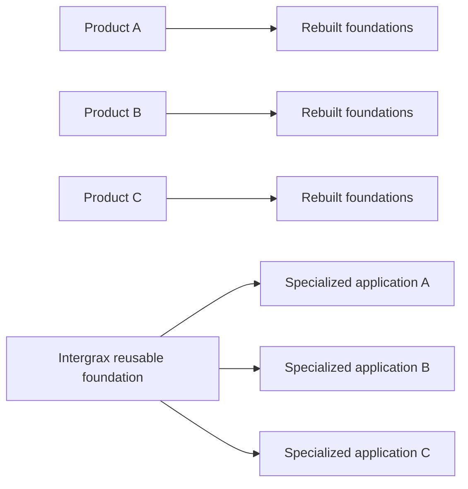
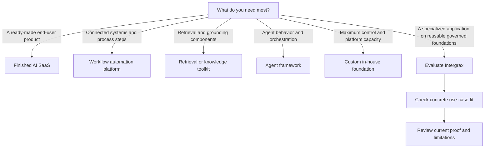

<!--
© Artur Czarnecki. All rights reserved.
Intergrax is source-available under the Intergrax Evaluation and Collaboration License 1.0.
See LICENSE for permitted evaluation, collaboration, and contribution use.
-->

# Why Intergrax

Intergrax exists for teams building specialized agent applications that would otherwise rebuild controlled knowledge access, policy, tools, evidence, context, approvals, recovery, and observability around every model-driven workflow. It is a reusable governed foundation for those application operating boundaries; the project is source-available and in active R&D, with bounded current evidence rather than a universal production-readiness claim.

> [!NOTE]
> This page explains the problem category and evaluation boundary. See [PROOFS.md](../proofs/PROOFS.md) for detailed evidence and claim limits.

---

## At a glance

| Question | Answer |
| -------- | ------ |
| What is Intergrax? | A reusable governed foundation for specialized AI applications. |
| What problem does it address? | Each product otherwise assembles its own control and execution infrastructure around model behavior. |
| Who is it for? | Teams building specialized agent-backed applications, platform engineers evaluating reusable infrastructure, and technical design partners with a concrete workflow to validate. |
| What remains with the product team? | Workflow semantics, UX, deployment choices, required permissions, product-specific validation, and business responsibility. |
| Where does it fit? | Around model or agent behavior, as reusable governed application infrastructure. |

---

## The repeated problem

Model calls and agent behavior are only one part of a specialized application. A product also commonly needs:

- identity and permissions;
- controlled knowledge access;
- policy and human approval;
- tool and integration boundaries;
- context and runtime controls;
- evidence and provenance;
- failure handling and recovery; and
- observability.

These are recurring engineering responsibilities, not a claim that every mechanism above is universally production-proven. Without a reusable operating foundation, each application rebuilds substantial control and execution infrastructure, with the resulting inconsistency and maintenance burden spread across products.

---

## What Intergrax is

Intergrax is a reusable governed foundation, or application operating layer, for specialized AI applications. It concentrates repeatable boundaries around knowledge, policy, tools, evidence, context, and execution so product teams can focus on the concrete domain workflow.

Some teams use **Harness AI** to describe this category: an operating layer around model or agent behavior that constrains, coordinates, records, and recovers execution. The term is useful shorthand, not a universal industry taxonomy.

| Layer | Primary responsibility |
| ----- | ---------------------- |
| Model or agent framework | Model access, agent behavior, and reasoning or orchestration primitives. |
| Intergrax | Reusable application operating boundaries around knowledge, policy, tools, evidence, context, and governed execution. |
| Product application | Domain workflow, UX, deployment, required permissions, and product-specific validation. |

An agent framework or model API can help an application reason and act, but it does not by itself settle how knowledge is bounded, which tools may execute, what evidence is retained, when a person must approve an action, or how failures are recovered and reviewed.

The diagram contrasts rebuilding foundations per product with reusing one governed foundation. It does not imply that every future product is already implemented.

---

## Responsibility boundary

Intergrax aims to centralize reusable application foundations:

- policy and governance mechanisms;
- knowledge, context, and evidence boundaries;
- integration and tool-execution boundaries; and
- runtime controls for governed execution.

The adopting product team still owns:

- workflow and product semantics;
- UX and deployment choices;
- required identity, tenant, and product permissions;
- product-specific validation and acceptance criteria; and
- business responsibility for the product and its outcomes.

Intergrax does not remove those responsibilities. It is intended to reduce repeated foundation-building, not to make a domain product or its risk decisions automatic.

---

## Who it is for

Intergrax is for:

1. Teams building specialized agent-backed applications that need governance, evidence, knowledge access, or controlled tool execution.
2. Platform or AI engineers evaluating reusable application infrastructure.
3. Architects who need controlled execution and evidence boundaries.
4. Technical design partners with a concrete workflow worth validating.

---

## Where Intergrax fits

These approaches are not mutually exclusive. A real system may combine several of them, and the comparison is about primary responsibility rather than a feature scorecard or superiority claim.

The question is: which layer of responsibility are you trying to buy or build?

<picture>
  <source
    media="(prefers-color-scheme: dark)"
    srcset="../assets/public/intergrax-category-map-dark.svg"
  >
  <source
    media="(prefers-color-scheme: light)"
    srcset="../assets/public/intergrax-category-map-light.svg"
  >
  
</picture>

This neutral map explains primary responsibility. Categories overlap, and no universal superiority or feature parity is claimed.

### Choose by your primary need

| Approach | Primary value | Your team still owns | Consider it when |
| -------- | ------------- | -------------------- | ---------------- |
| Finished AI SaaS | Ready-made end-user product | Adoption and workflow fit | You need a ready-made end-user product |
| Workflow automation platform | Connect systems and process steps | AI-specific behavior and evidence semantics | You need process and system automation |
| Retrieval or knowledge toolkit | Retrieval, indexing and grounding components | Product, orchestration, policy and operations | You need retrieval and grounding components |
| Agent framework | Compose agent behavior and orchestration | Product controls, runtime governance and evidence | You need agent behavior and orchestration |
| Custom in-house foundation | Maximum design control | Every shared layer and its maintenance | You need complete design control and can maintain the platform |
| Intergrax | Reusable governed foundation for specialized AI applications | Product workflow, UX, deployment choices, required permissions, product-specific validation, and business responsibility | You need to build a specialized governed AI application on reusable policy, knowledge, integration, execution, and evidence foundations |

### A simple decision flow

### Fit summary

| Intergrax may fit when | Another approach may fit better when |
| ---------------------- | ------------------------------------ |
| You need governed execution, evidence, and knowledge access in a specialized product | Finished SaaS needed immediately — not building your own application |
| You want reusable platform foundations instead of a new runtime per product | You want a simple prompt prototype only |
| You are evaluating infrastructure for multiple agent-backed applications | You expect a no-code workflow builder |
| You can accept bounded proof and active R&D | You require an unrestricted open-source license |
| Governance, policy, and evidence matter to your reviewers | You have no governance or evidence requirements |
| You want to own a specialized application while reusing its operating foundation | You do not want to own an application or its product-specific validation |

Other frameworks and tools may suit different needs. This guide does not dismiss them.

Intergrax may coexist with model providers, retrieval systems, integration tools and application-specific components. The category map does not claim that these approaches are mutually exclusive.

---

## Current evidence and limits

| Area | Classification | Status | Notes |
| ---- | -------------- | ------ | ----- |
| **LKW** | **Primary product proof** | **PARTIAL** | **Backend Product Alpha / MVP** — bounded application and platform proof. |
| **Token Optimization** | **Featured platform-capability proof** | **PARTIAL** | Implemented deterministic mechanisms; bounded executable offline smoke proof. Manual vLLM prefix-cache evidence is separate — no public_evidence_eligible vLLM proof_id today. |

**Evidence and detail:** [LKW Platform Proof](../../../applications/local_workspace_application/docs/proof/LKW_PLATFORM_PROOF.md) · [Token Optimization guide](../capabilities/token_optimization/README.md) · [PROOFS.md](../proofs/PROOFS.md)

The bounded indexed Hybrid Ask path is not the same as a completed mixed indexed + authorized live workflow: **mixed indexed + authorized live Hybrid Ask remains incomplete**. Real-user validation and commercial validation are incomplete. Universal production readiness and universal token savings are not claimed.

Detailed evidence and claim boundaries belong in [docs/project/proofs/PROOFS.md](../proofs/PROOFS.md), not in this category overview.

---

## What to read next

**Primary next action:** [Check your concrete workflow in Use Cases](USE_CASES.md).

If the category appears relevant:

| Route | Use it for |
|-------|------------|
| [docs/project/proofs/PROOFS.md](../proofs/PROOFS.md) | Reviewing current evidence |
| [docs/project/architecture/ARCHITECTURE_OVERVIEW.md](../architecture/ARCHITECTURE_OVERVIEW.md) | Understanding technical boundaries |
| [docs/project/builders/BUILDER_QUICKSTART.md](../builders/BUILDER_QUICKSTART.md) | Beginning a bounded build |
| [docs/project/builders/BUILD_WITH_INTERGRAX.md](../builders/BUILD_WITH_INTERGRAX.md) | Planning deeper application composition |
| [docs/project/community/PARTNERS.md](../community/PARTNERS.md) | Discussing a bounded pilot |
