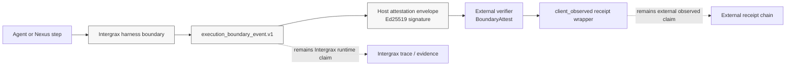

# BoundaryAttest Attestation PoC — External Validation Case Study

## Summary

Intergrax Attestation Demo demonstrates how a Tier-3 application can emit host-signed execution boundary events. [BoundaryAttest](https://github.com/cullenmeyers/BoundaryAttest), an external attestation project, validated the integration pattern by verifying Intergrax host-signed boundary events and preserving them in a separate `client_observed` receipt wrapper.

This is a technical integration validation, not production certification or compliance attestation.

## Problem

Agent and tool systems often lack durable evidence at execution boundaries. When an agent invokes a tool or the harness advances a step, downstream reviewers need to know what happened at those boundaries — not only what the model planned.

A harness platform should expose boundary events that external systems can verify or preserve without re-implementing the full runtime. Without that surface, attestation, audit, and partner receipt systems must scrape logs or trust opaque application responses.

## What Intergrax emits

The [Attestation Demo](../../../../applications/attestation_demo/README.md) implements Execution Boundary Export (EBE):

- Each record uses schema `execution_boundary_event.v1`.
- **One host-signed boundary event per tool/harness claim** — not one composite run receipt.
- Boundary types include `tool_execution` and `harness_step`.
- **Default (EBE-9):** each event carries an Ed25519 **host attestation** envelope (`host_attestation_envelope.v1`) that an external verifier can validate against a pinned public key.
- Tool execution and harness-step claims remain **separate events** with distinct sequence numbers within a run.

## What BoundaryAttest validated

BoundaryAttest is an external open-source project for portable signed attestations of consequential agent/tool boundary events. It is not part of Intergrax and is not maintained by Intergrax.

The validated EBE-9 flow confirmed:

- BoundaryAttest **verified the Intergrax host signature** using a pinned public key.
- BoundaryAttest **preserved boundary evidence** with its own `client_observed` receipt wrapper.
- Intergrax **host/runtime claim** and BoundaryAttest **partner/client observed claim** remain **separate** — two signatures, two roles.
- The mapping pattern for external receipt systems is confirmed (event fields → partner receipt; Intergrax does not ship or sign partner receipts).
- Unsigned v2 compatibility remains supported for integrators that do not require host signing.

This validation does not imply that BoundaryAttest certifies Intergrax, bundles with Intergrax, or replaces a full audit/compliance product.

## Why this matters

Intergrax is not only agent authoring. It exposes **governed execution surfaces**: policy-bound tool invocation, harness step progression, trace capture, and exportable boundary evidence.

In the Harness AI model, **agents decide**; the **harness executes and records evidence**; **external systems consume those evidence surfaces** on their own terms. When a partner verifies host-signed boundary events and wraps them in a separate client-observed receipt, the durable substrate — not any single agent — is what survives agent churn and external review.

This supports the Intergrax thesis that **the harness is the durable product; agents are replaceable**. Technical partners evaluate portable execution infrastructure and proof artifacts, not a demo-specific prompt stack.

## Validation flow

The PoC keeps Intergrax runtime evidence and external receipt evidence separate. Intergrax emits and signs boundary events; BoundaryAttest verifies those events and preserves them in its own client-observed wrapper.

The diagram is intentionally split into two evidence paths:

- Intergrax owns the runtime boundary event and optional host attestation envelope.
- BoundaryAttest verifies the host-signed event using the agreed trust material.
- BoundaryAttest keeps its own `client_observed` wrapper separate from the Intergrax runtime claim.
- The two claims are complementary, not interchangeable.
- The flow is an integration validation pattern, not a certification or compliance guarantee.

## What this does not claim

- **BoundaryAttest is not bundled with Intergrax** and is not required to use Intergrax.
- **BoundaryAttest is not maintained by Intergrax** and is referenced only as an external validation example.
- **This is not production certification** or a guarantee of production readiness for any deployment.
- **This is not compliance or legal attestation** — no regulatory, security, or legal approval is implied.
- **This is not a general guarantee** that every Intergrax deployment is secure or correctly configured.
- **This does not grant production or commercial use rights** — see [LICENSE](../../../../LICENSE) and [COLLABORATION.md](../../community/COLLABORATION.md).

## How to inspect the demo

Start with the application documentation:

| Document | Purpose |
|----------|---------|
| [Attestation Demo README](../../../../applications/attestation_demo/README.md) | Quickstart, PoC endpoint, trust model |
| [ARCHITECTURE.md](../../technical/applications/attestation_demo/ARCHITECTURE.md) | Host design, EBE contract, trust model |
| [EBE-9_HOST_SIGNING.md](../../../../applications/attestation_demo/partner_handoff/EBE-9_HOST_SIGNING.md) | Host signing verifier spec |
| [BUILD_AND_DEPLOY.md](../../technical/applications/attestation_demo/BUILD_AND_DEPLOY.md) | Local run, Docker, deploy runbook |

**Suggested path:**

1. Read the [Attestation Demo README](../../../../applications/attestation_demo/README.md) for scope, disclaimers, and the primary PoC endpoint.
2. Run the local demo if consistent with [LICENSE](../../../../LICENSE) and [COLLABORATION.md](../../community/COLLABORATION.md) (see [BUILD_AND_DEPLOY.md](../../technical/applications/attestation_demo/BUILD_AND_DEPLOY.md)).
3. Inspect `boundary_events[]` and the `trust_model` response from `POST /v1/attestation_demo/poc/run`; compare host attestation envelopes with the EBE-9 golden vector in `partner_handoff/`.

## Acknowledgement

This PoC was validated through external integration work with the [BoundaryAttest](https://github.com/cullenmeyers/BoundaryAttest) project. The external feedback helped verify the mapping between Intergrax host-signed `execution_boundary_event.v1` records and a separate `client_observed` receipt wrapper.

This acknowledgement does not imply formal certification, bundling, ownership, partnership, or maintenance responsibility by either project. BoundaryAttest remains an external project and Intergrax remains independently maintained.

## Related documents

- [README.md](../../../../README.md) — project overview and proof paths
- [ROADMAP.md](../ROADMAP.md) — public adoption roadmap and collaboration tracks
- [COLLABORATION.md](../../community/COLLABORATION.md) — collaboration model and permitted use
- [LICENSE](../../../../LICENSE) — proprietary terms
- [INTERGRAX_HARNESS_NARRATIVE.md](../../technical/guides/INTERGRAX_HARNESS_NARRATIVE.md) — harness narrative for external readers
- [Attestation Demo README](../../../../applications/attestation_demo/README.md) — full PoC documentation and partner mapping
