<!--
© Artur Czarnecki. All rights reserved.
Intergrax is source-available under the Intergrax Evaluation and Collaboration License 1.0.
See LICENSE for permitted evaluation, collaboration, and contribution use.
-->

# Intergrax Agent Marketplace — Concept and Reference Architecture

> **Document type:** Public product and architecture concept  
> **Audience:** CTOs, principal/staff engineers, AI architects, agent developers, enterprise platform teams, technical evaluators, product decision makers  
> **Status legend used throughout this document:**
>
> | Label | Meaning |
> |-------|---------|
> | **AVAILABLE TODAY** | Implemented and inspectable in the current repository |
> | **ARCHITECTURE FROZEN** | Canonical design accepted; not a product claim |
> | **UNDER IMPLEMENTATION** | Active engineering against frozen architecture |
> | **FUTURE PRODUCT** | Planned marketplace or distribution product capability — not shipped |

> [!IMPORTANT]
> **Truthfulness contract:** This document describes a **future governed distribution ecosystem** built on Intergrax's existing agent platform. It does **not** claim that a public marketplace website, publisher portal, billing, or LKW marketplace UI exists today. Where examples name agents (Research Agent, Legal Agent, etc.), they illustrate **reusable capability patterns** — not guaranteed catalog listings.

---

## Executive concept

**Intergrax Agent Marketplace** is envisioned as a **governed distribution ecosystem** for reusable **Tier-2 AI agents** that applications can install, bind, configure, and enable **without changing** the Intergrax execution architecture.

The familiar analogy helps:

| Analogy | What it suggests |
|---------|------------------|
| **VS Code extensions** | Discoverable packages that extend a host application |
| **App stores / package ecosystems** | Publishers, versions, trust signals, installation |

The **enterprise difference** is immediate: installing an AI agent can grant access to **tools**, **company data**, **APIs**, **memory**, **integrations**, and **compute/budgets**. Agent installation therefore requires **stronger trust, policy, and runtime controls** than installing a UI theme or syntax highlighter.

### Central product mental model

```text
Apps install capabilities.
Nexus routes work.
Intergrax governs execution.
```

Applications compose **governed agent capabilities**. **Nexus** routes tasks by **capability**, not by marketplace origin. **Intergrax** owns verification, materialization, activation, and runtime enforcement — the marketplace is a **catalog and discovery layer**, not a second execution engine.

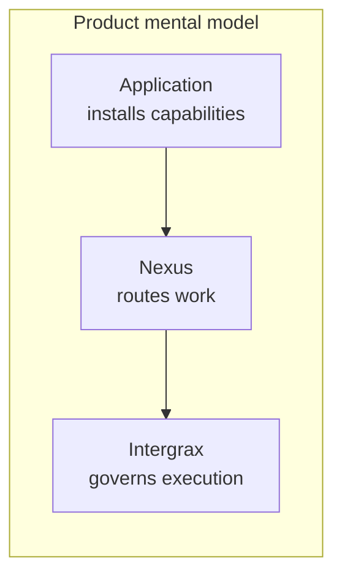

---

## Why an agent marketplace

### The economic and engineering problem

Without reusable agents, every product team rebuilds the same roles:

```text
Company A  → ResearchAgent
Company B  → ResearchAgent
Product X  → ResearchAgent
Product Y  → ResearchAgent
```

Each copy diverges in prompts, tools, policy, upgrades, and security review. Maintenance cost scales with the number of products, not the number of distinct capabilities.

### The Intergrax answer

One **reusable, governed capability** can serve many **Tier-3 applications**:

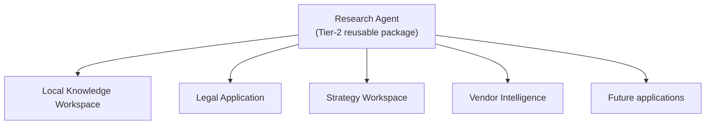

The marketplace is the **discovery and distribution network** for that reuse — not a replacement for Agent Distribution, AgentRegistry, or Nexus.

---

## Where the marketplace fits in Intergrax

Intergrax organizes work across four tiers:

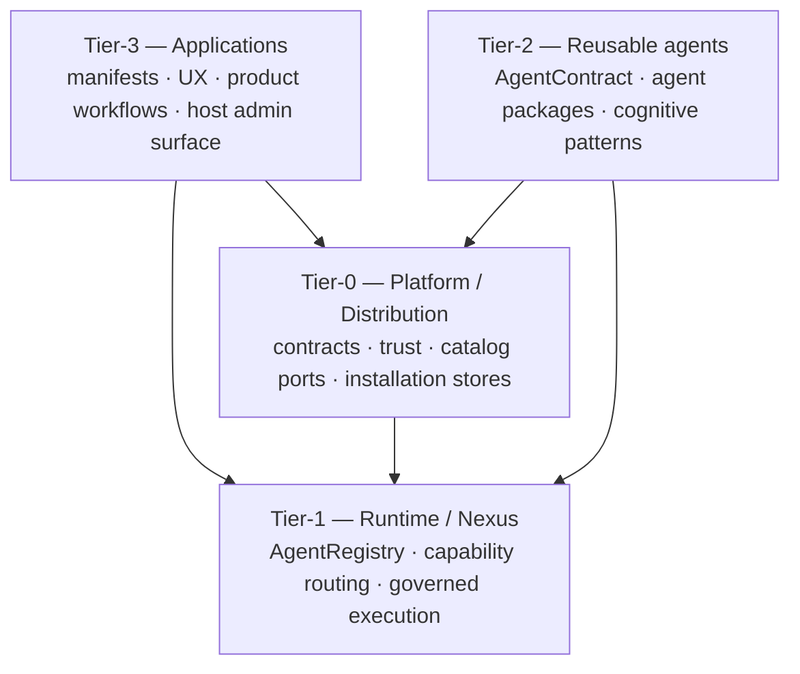

| Tier | Marketplace relationship |
|------|---------------------------|
| **Tier-0** | Owns `CatalogSourceProvider`, installation, binding, trust, dependency lock, activation |
| **Tier-1** | **Unchanged** — AgentRegistry and Nexus do not become marketplace-aware |
| **Tier-2** | What publishers build and distribute |
| **Tier-3** | What binds, configures, and enables agents for a product |

> **ARCHITECTURE FROZEN:** The marketplace is explicitly **one future `CatalogSourceProvider` implementation** plus product/discovery/commercial layers. It is **not** a second Nexus, a second AgentRegistry, a special marketplace runtime, hot arbitrary Python installation, an LKW-specific subsystem, or a replacement for [Agent Distribution](../architecture/AGENT_DISTRIBUTION.md).

### Mandatory execution chain

All catalog sources — built-in, local developer, enterprise private, official marketplace, governed third party — converge into the **same** pipeline:

```text
Marketplace / private catalog / builtin / local developer source
        ↓
CatalogSourceProvider
        ↓
Agent Distribution
        ↓
trust + package verification
        ↓
installation
        ↓
application binding
        ↓
effective roster
        ↓
deterministic dependency resolution
        ↓
MaterializedRuntimeLock
        ↓
immutable runtime materialization
        ↓
RuntimeRevision activation
        ↓
AgentRegistry
        ↓
Nexus capability routing
```

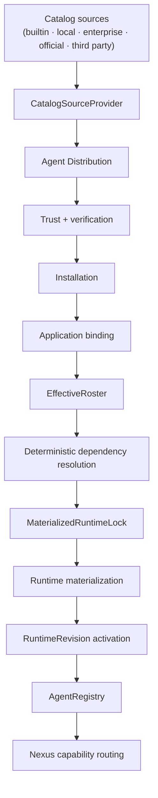

---

## Marketplace ecosystem

Seven actor groups interact across discovery, governance, installation, and execution:

| Actor | Primary concern |
|-------|-----------------|
| **Agent developer / publisher** | Builds Tier-2 agents, packages artifacts, publishes to catalogs |
| **Marketplace / catalog operator** | Indexes listings, qualification signals, discovery UX **(FUTURE PRODUCT)** |
| **Enterprise organization** | Private catalogs, org policy, approved publishers |
| **Application owner** | Selects agents, binds configuration, enables for a product |
| **Security / governance administrator** | Trust tiers, certification, revocation, risk limits |
| **End user** | Uses product workflows; may discover/install **(product-dependent UX)** |
| **Intergrax platform** | Distribution, materialization, runtime enforcement |

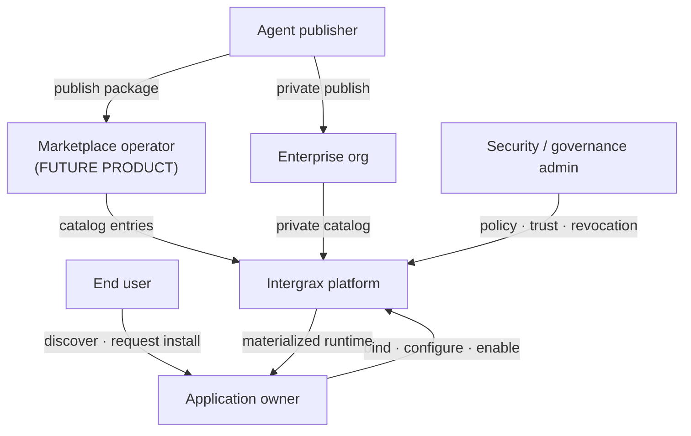

### Separation of responsibilities

```text
Agent author          builds agent
Marketplace           helps discover and distribute agent
Enterprise governance decides whether agent may be installed/enabled
Application           binds/configures agent
Agent Distribution    materializes deterministic runtime
AgentRegistry         exposes materialized agent
Nexus                 routes tasks by capability
Agent itself          executes through Intergrax governed runtime
```

---

## Agent sources

**AVAILABLE TODAY / ARCHITECTURE FROZEN:** Catalog architecture defines neutral `CatalogSourceProvider` implementations. The port exists in `intergrax/agent_distribution/`; not every provider is productized yet.

| Source | Provider kind | Typical use |
|--------|---------------|-------------|
| **Built-in Intergrax** | `builtin` | First-party monorepo agents shipped with the platform |
| **Local developer** | `local_developer` | Workspace/path packages during agent authoring |
| **Enterprise private catalog** | `enterprise_private` | Org registry, air-gapped bundles, approved vendors |
| **Official Intergrax marketplace** | `official_catalog` | **FUTURE PRODUCT** — public discovery index |
| **Governed third party** | `governed_third_party` | Partner catalogs under enterprise trust policy |

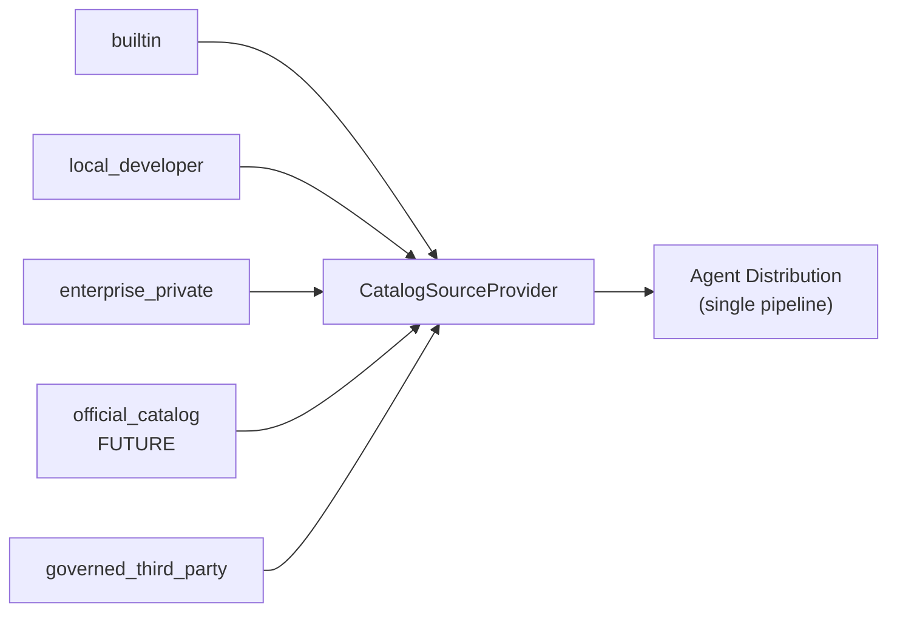

> **Key message:** Execution runtime does **not** branch on provider type after installation. Only digest-pinned installation records, bindings, and active `RuntimeRevision` matter for routing.

---

## What is a marketplace agent

A marketplace listing is **not** the running agent. Architecturally, several layers stay distinct:

| Layer | Role | Stable vs revision |
|-------|------|-------------------|
| **Logical agent** | Product/roster identity in an application | Stable slot |
| **AgentContract** | Declared capabilities, tools, governance metadata | Tied to package |
| **Agent package** | Tier-2 installable distribution artifact | Versioned line |
| **Package version** | Human-readable PEP 440 label | Revision label |
| **Package digest** | Content-addressed artifact hash | **Immutable authority** |
| **Catalog entry** | Provider-indexed discovery metadata | Not execution truth |
| **Publisher** | Provenance and trust subject | Stable org identity |
| **Installation** | Verified, persisted artifact on host | Digest-pinned record |
| **Application binding** | App-scoped link: slot → installation + config | Durable |
| **Runtime revision** | Activated materialized application runtime | Immutable when active |

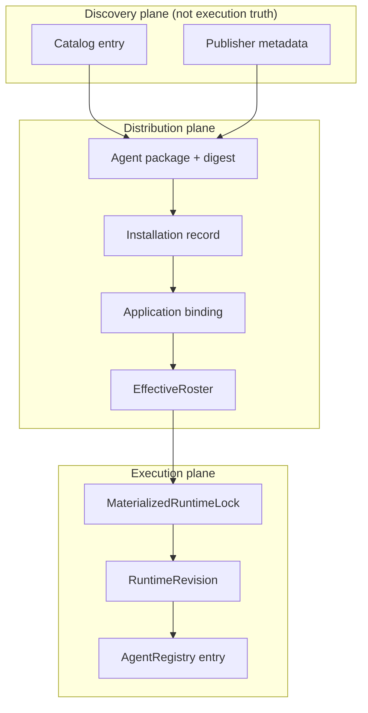

**AVAILABLE TODAY:** Tier-2 agent packages and `AgentContract` are implemented under `agents/`. **UNDER IMPLEMENTATION:** Tier-0 distribution contracts and store ports. **FUTURE PRODUCT:** Marketplace catalog entries as a user-facing index.

---

## Conceptual marketplace listing

The following card is a **conceptual UI sketch only** — not a screenshot of implemented frontend.

```text
┌─────────────────────────────────────────────────────────┐
│  Research Agent                                         │
│  Publisher: Example Labs                                │
│  Capability: research.deep · research.citation          │
│  Trust: Enterprise Qualified                            │
│  Risk: Medium — reads documents, web search, models     │
│  Version: 2.3.1  ·  Digest-pinned install               │
│  Intergrax: ≥ 0.9  ·  Integrations: web, workspace docs │
│  [ Inspect permissions ]  [ Request install ]           │
└─────────────────────────────────────────────────────────┘
```

### Listing metadata (conceptual)

| Field | Purpose |
|-------|---------|
| Name, description | Discovery |
| Publisher | Trust and support provenance |
| Capabilities | Nexus routing expectations |
| Supported Intergrax versions | Compatibility gate |
| Required integrations / tools | Pre-install transparency |
| Permission profile | Security review input |
| Risk classification | Org policy matching |
| Qualification / certification status | Governance signal |
| Version, release notes | Upgrade decisions |
| Trust source | Signature / org attestation chain |
| Enterprise compatibility | Deployment topology hints |
| Installation availability | Public / private / licensed **(FUTURE)** |

Catalog metadata **never** stores application secrets or tenant credentials.

---

## Discovery experience

**FUTURE PRODUCT:** Discovery UX and search index are not shipped. The experience below describes the **target product shape** on top of frozen distribution architecture.

### Example search

**Query:** `project management`

| Result (examples) | Capability focus |
|-------------------|------------------|
| Project Manager Agent | `pm.planning`, `pm.status` |
| Agile Delivery Agent | `pm.agile`, `pm.sprint` |
| Risk Radar Agent | `pm.risk`, `pm.dependencies` |
| Meeting Coordination Agent | `pm.meetings`, `pm.actions` |

### Filters (conceptual)

| Filter dimension | Why it matters |
|----------------|----------------|
| Capability | Match task routing needs |
| Publisher | Trust and support |
| Trust level / certification | Enterprise gate |
| Price / commercial model | **FUTURE PRODUCT** |
| Required integrations | Feasibility in your environment |
| Data access class | Privacy and compliance |
| Deployment support | OCI, venv bundle, airgap |
| Public / private / enterprise | Catalog scope |

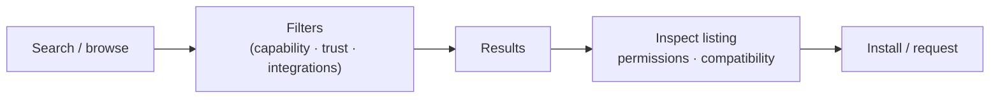

---

## Installation journey

From the user's perspective, one **Install** action may suffice. Underneath, the platform runs a governed pipeline:

```text
Discover
  → inspect
  → request / install
  → trust check
  → compatibility check
  → dependency resolution
  → certification / policy
  → materialize immutable runtime
  → health validation
  → activate
  → bind to application
  → configure
  → enable
  → use
```

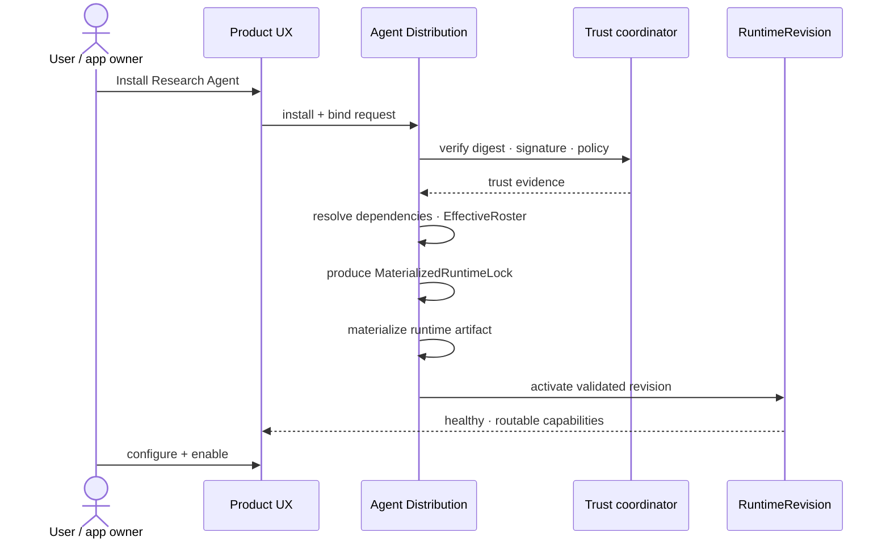

| Stage | User-visible | Platform responsibility |
|-------|--------------|-------------------------|
| Trust / compatibility | May show blocker or approval | Fail-closed before `INSTALLED` |
| Dependency resolution | Often hidden | Deterministic closure → lock |
| Materialization | Progress / validation | No hot `pip install` in live process |
| Activation | "Ready" or rollback message | Single active revision per environment |
| Configure / enable | App-specific forms | Secrets stay in app config stores |

---

## Agent lifecycle

**ARCHITECTURE FROZEN:** Canonical lifecycle from [Agent Distribution](../architecture/AGENT_DISTRIBUTION.md):

```text
AVAILABLE
  → INSTALLED
  → BOUND_TO_APPLICATION
  → CONFIGURED
  → ENABLED
  → REGISTERED_IN_RUNTIME
  → ROUTABLE
```

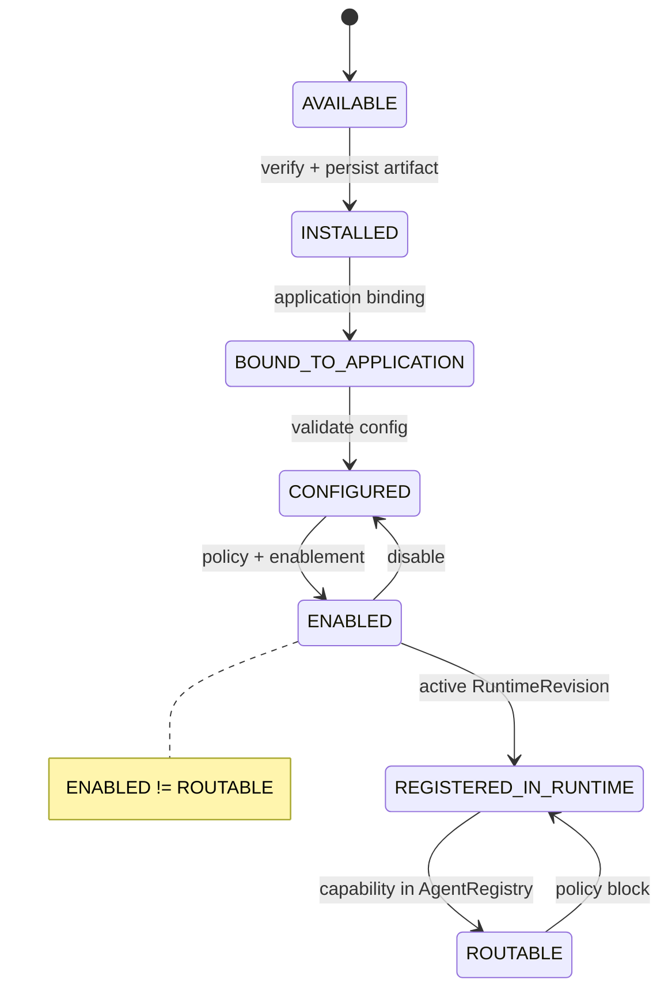

### ENABLED ≠ ROUTABLE

An agent may be enabled in application configuration but **not routable** at runtime when, for example:

| Condition | Effect |
|-----------|--------|
| Certification revoked | Block activation / routing |
| Production policy denies | Fail-closed |
| Required integration unhealthy | Capability unavailable |
| Lifecycle deprecated | Warn or block new enables |
| Trust revoked on digest | Block enable / force disable on next materialization |

Installation (`INSTALLED`) and activation (`REGISTERED_IN_RUNTIME` / `ROUTABLE`) are **separate** steps: a host may hold a verified package that no application has activated.

---

## Application composition

One application composes many agents from different sources into **one deterministic roster**:

```text
Local Knowledge Workspace (example)
├── local_indexer          (built-in / default)
├── local_search             (built-in / default)
├── local_synthesizer        (built-in / default)
├── Research Agent           (marketplace — FUTURE PRODUCT path)
├── Project Manager Agent    (enterprise private catalog — FUTURE)
└── Legal Agent              (official catalog — FUTURE)
```

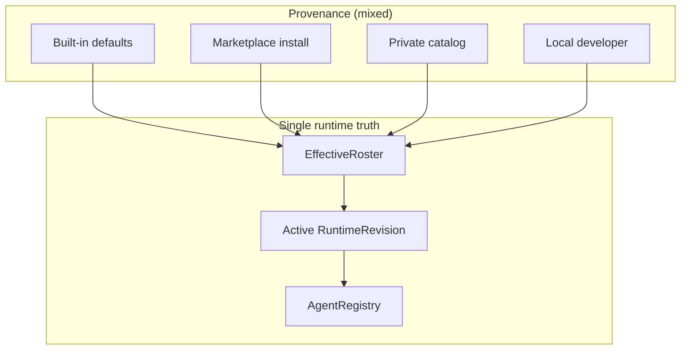

| Source type | How it appears to the application |
|-------------|-----------------------------------|
| Built-in defaults | Manifest template + builtin provider |
| Marketplace | Installation + binding **(FUTURE PRODUCT UX)** |
| Enterprise private | Same distribution pipeline, different catalog |
| Locally developed | `local_developer` provider |

**EffectiveRoster** merges manifest defaults and durable bindings into **one** roster per application environment — the runtime never sees conflicting "marketplace" and "builtin" branches.

---

## Configuration model

Configuration splits cleanly between **catalog/listing metadata** and **application-specific binding configuration**:

| Concern | Owned by | Stored in listing? |
|---------|----------|-------------------|
| Display name, categories | Catalog entry | Yes |
| Default capability declarations | Package / contract | Summarized in listing |
| Application configuration | Application binding | **No** |
| Secret references | Application secret store | **Never in catalog** |
| Tool enablement | Binding + policy | Partial hints only |
| Integration access | Binding + org policy | Requirements only |
| Memory scope | Application policy | No |
| Budgets / quotas | Org / app policy | No |
| Enablement flag | Binding | No |

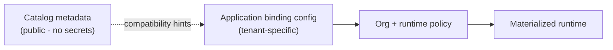

Marketplace listings describe **what an agent may require**; applications decide **what this deployment grants**.

---

## Permissions and security model

Agent installation is **security-sensitive** because agents are not passive libraries — they are **autonomous capability packages** that can invoke tools and access data through governed runtime boundaries.

### Example permission classes

| Permission class | Example capability |
|------------------|-------------------|
| Read internal documents | Workspace / RAG sources |
| Search web | External research |
| Call Jira / CRM | Operational integrations |
| Send email | Outbound communications |
| Write documents | Artifact mutation |
| Invoke models | LLM spend |
| Use compute | Sandboxed execution |
| Access memory | Scoped retention |

### Trust gates (fail-closed)

```text
Publisher identity
  → package digest
  → signature / attestation
  → source trust tier
  → qualification / certification
  → platform compatibility
  → organization policy
  → application policy
  → runtime policy
  → activation
```

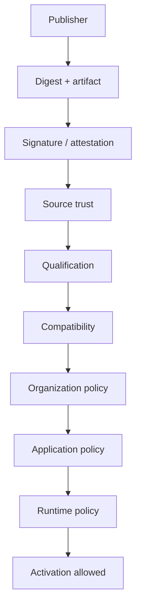

**ARCHITECTURE FROZEN:** Trust patterns reuse evidence pipeline concepts from platform plugins — but agent packages are a **distinct trust subject** from plugins.

### Revocation semantics

| Event | Architectural behavior |
|-------|------------------------|
| Publisher revoked | Block new installs; flag existing; policy may force disable |
| Digest vulnerable | Block new enables; org may pin or rollback |
| Certification withdrawn | `ENABLED` may persist until next materialization gate |
| Catalog entry removed | **No effect** on digest-pinned active runtime reproducibility |

---

## Enterprise private marketplace

Enterprises need the **same platform interfaces** as a public marketplace — with a **private catalog boundary**:

```text
ACME Private Agent Catalog
├── Procurement Analyst
├── Internal Legal Reviewer
├── SAP Support Agent
├── Intranet Research Agent
└── Corporate PM Agent
```

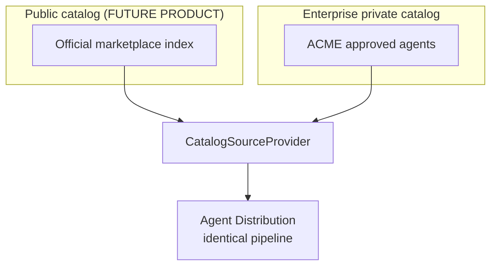

| Dimension | Public marketplace | Private catalog |
|-----------|-------------------|-----------------|
| Visibility | Broad discovery **(FUTURE)** | Org-scoped |
| Trust policy | Platform + publisher qualification | Org-defined allowlists |
| Typical agents | ISV and community **(FUTURE)** | Internal, approved vendor, customized |
| Execution | Same materialization chain | Same materialization chain |

---

## Publisher and developer journey

**AVAILABLE TODAY:** Developers can author Tier-2 agents with `AgentContract`, package metadata, and Nexus-compatible capabilities in the monorepo.

**FUTURE PRODUCT:** Publisher portal, automated qualification, and public listing submission are not shipped.

```text
Build Tier-2 agent
  → define AgentContract
  → package (wheel / sdist / future OCI)
  → test in local_developer catalog
  → produce immutable artifact + digest
  → submit / publish (FUTURE PRODUCT)
  → qualification (FUTURE PRODUCT)
  → catalog listing + versions
  → upgrade lifecycle
  → deprecate → retire
```

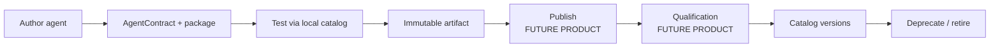

Publishing product features sit **above** frozen distribution — they do not introduce a parallel runtime.

---

## Versioning, upgrades, and rollback

### Binding anchors upgrades

| Concept | Behavior |
|---------|----------|
| **Installation slot** | Stable identity per environment + package line |
| **Active digest** | Production authority — not floating `latest` |
| **Previous digest** | Retained for rollback when policy allows |

**Upgrade:**

```text
installation_slot_id: research-agent
  v1 → digest A  (superseded, retained)
  v2 → digest B  (active)
```

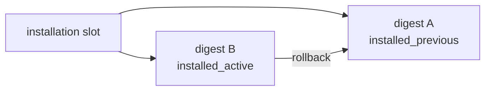

New versions must re-run:

- trust verification  
- compatibility checks  
- dependency graph resolution  
- certification / org policy  
- configuration validation  

**Rollback** restores the **exact** previous `RuntimeRevision` and lock digest — not an ambiguous "older latest" label.

**ARCHITECTURE FROZEN / UNDER IMPLEMENTATION:** Activation and rollback orchestration are specified; durable services are AP-4+ work.

---

## Immutable runtime materialization

This is a core differentiator from casual "install extension" models.

### What marketplace installation is **not**

| Anti-pattern | Intergrax stance |
|--------------|------------------|
| `pip install unknown-agent` into live production process | **Forbidden** |
| Floating `latest` as production authority | **Rejected** |
| Marketplace-specific execution fork | **Forbidden** |

### What happens instead

```text
catalog selection
  → verified artifact
  → deterministic dependency closure
  → MaterializedRuntimeLock
  → CandidateApplicationRuntimeGraph
  → immutable runtime artifact
  → validation
  → atomic RuntimeRevision activation
```

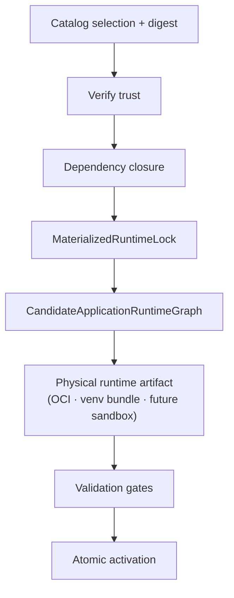

### Benefits

| Benefit | Mechanism |
|---------|-----------|
| Reproducibility | Digest-pinned lock + revision |
| Rollback | Prior revision + lock retained |
| Auditing | Trust evidence + revision history |
| Supply-chain safety | Verification before persistence |
| Horizontal consistency | Same lock across replicas |
| Deterministic deployments | Single active revision per environment |

**UNDER IMPLEMENTATION:** `MaterializedRuntimeLock` contracts exist; lock **producer** and activation orchestration are planned AP-7–AP-9.

---

## Control plane vs execution plane

Separating planes is central to scaling from local dev agents to a global marketplace **without** forking runtime code.

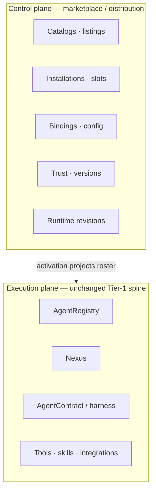

| Plane | Examples | Mutates during user chat? |
|-------|----------|---------------------------|
| **Control** | Install, upgrade, bind, enable, revoke | Admin / lifecycle operations |
| **Execution** | Route task, invoke tool, record evidence | Per-request |

---

## Marketplace and Nexus

**Does Nexus know the agent came from the marketplace?**

**Architectural answer: No routing branch is required.**

Once safely materialized and activated:

```text
AgentRegistry
  → capability match
  → Nexus routing
```

Marketplace source remains **provenance and audit metadata** — not execution routing logic. Nexus continues to resolve **`required_capability`** → registry entries by **`capabilities[]`**, as defined in [Agent Contracts and Assembly](../architecture/AGENT_CONTRACTS_AND_ASSEMBLY.md).

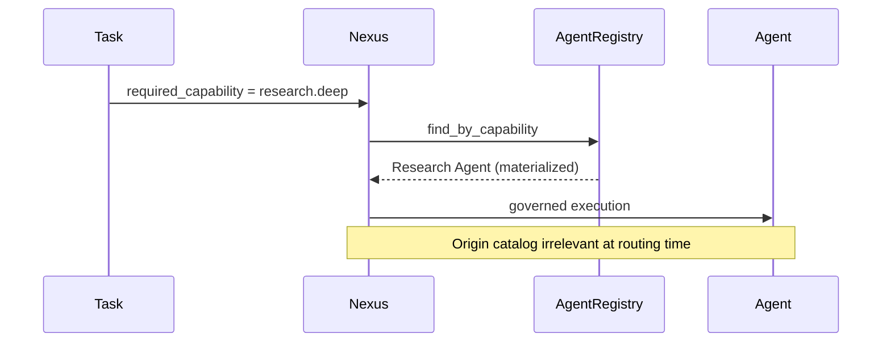

**AVAILABLE TODAY:** Nexus capability routing and AgentRegistry are implemented.

---

## Marketplace and Local Knowledge Workspace

LKW illustrates the **target platform proof** without claiming marketplace UI exists today.

**FUTURE PRODUCT / TARGET:** User opens Agents in LKW → browses available agents → selects Research Agent → Install → grants allowed integrations → configures workspace scope → Enable → asks a research question → Nexus sees `research.*` capability → Research Agent participates.

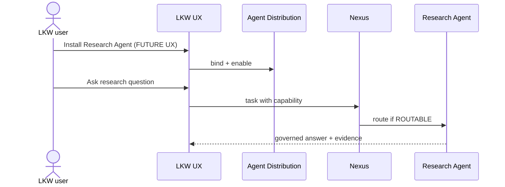

**AVAILABLE TODAY:** LKW uses built-in local agents (`local_indexer`, `local_search`, `local_synthesizer`) via application manifest and registry wiring — not marketplace installation UX.

---

## Use case examples

Short scenarios illustrating the model. Agents named are **examples**, not confirmed listings.

### A — Legal team installs Legal Research Agent into LKW

Legal ops discovers a qualified agent, requests install through org policy, binds matter-scoped integrations, enables for the workspace. Nexus routes legal research tasks without embedding legal logic in LKW application code.

### B — Product team composes UX Research + Project Manager agents

A strategy workspace installs two agents from different publishers (future public + private catalogs). EffectiveRoster merges both into one runtime revision; Nexus routes UX vs planning capabilities independently.

### C — Enterprise publishes private SAP Support Agent

ACME packages an internal agent into their private catalog. Only ACME environments resolve the catalog entry; execution still flows through Agent Distribution and digest-pinned materialization.

### D — SaaS vendor embeds marketplace agents

A vertical SaaS application built on Intergrax binds ISV agents alongside its own Tier-3 code. Customers receive governed capabilities without the vendor maintaining duplicate agent implementations.

### E — Organization revokes compromised third-party agent

Security revokes publisher trust. New enables block immediately; policy triggers disable on next materialization attempt; active digest-pinned revision remains reproducible for forensic rollback until replaced.

### F — Developer upgrades agent, retains configuration

Installation slot moves from digest A → B. Binding-level configuration survives where schema-compatible. Trust, dependencies, and certification re-validate before activation swaps.

---

## Public vs private vs local comparison

| Dimension | Built-in | Local developer | Enterprise private | Public marketplace |
|-----------|----------|-----------------|--------------------|--------------------|
| **Who publishes** | Intergrax | Developer workstation | Enterprise | ISV / community **(FUTURE)** |
| **Who can see** | All adopters | Developer | Org members | Public **(FUTURE)** |
| **Trust policy** | First-party defaults | Dev profile | Org allowlists | Platform + qualification **(FUTURE)** |
| **Typical use** | Default product agents | Authoring loop | Regulated internal agents | Ecosystem scale **(FUTURE)** |
| **Distribution** | `builtin` provider | `local_developer` | `enterprise_private` | `official_catalog` **(FUTURE)** |
| **Execution model** | Identical pipeline | Identical pipeline | Identical pipeline | Identical pipeline |

---

## Commercial and ecosystem model — future only

> **FUTURE PRODUCT POSSIBILITY** — pricing, billing, and revenue share are **not** architecturally finalized and **not** implemented.

Conceptual models that may exist in a mature marketplace:

| Model | Description |
|-------|-------------|
| Free agents | Community or first-party entries |
| Paid agents | One-time or usage-based **(undecided)** |
| Subscription agents | Capability bundles **(undecided)** |
| Enterprise licensed agents | Private catalog entitlements |
| Publisher revenue share | Commercial layer above distribution **(undecided)** |

No payment system design is implied here. Commercial features must not bypass trust, materialization, or org policy gates.

---

## Marketplace quality signals

**FUTURE PRODUCT:** Signals below are conceptual discovery aids — distinct from security qualification.

| Signal | Type | Purpose |
|--------|------|---------|
| Publisher verification | Trust | Authentic publisher identity |
| Qualification badge | Security / quality | Passed technical review |
| Enterprise-ready badge | Compatibility | Supported deployment patterns |
| Compatibility matrix | Technical | Intergrax + integration versions |
| Support policy | Operational | SLA expectations |
| Maintenance status | Operational | Active vs deprecated |
| Vulnerability status | Security | Known CVE response |
| Install / adoption count | Popularity | Discovery hint only |
| Reviews / ratings | Community | **Not** a security substitute |

> **Security qualification ≠ popularity rating.** An agent may be popular yet fail enterprise policy; conversely, a low-visibility internal agent may be fully qualified for a regulated catalog.

---

## Governance at scale

Organizations need **control-plane policy** that applies uniformly regardless of catalog source:

| Control | Example |
|---------|---------|
| Allowed publishers | Only `Example Labs` + internal |
| Approved catalogs | Private + official; block third party |
| Denied agents | Explicit blocklist by digest or package line |
| Max risk level | Medium or lower in production |
| Required certification | `enterprise_qualified` minimum |
| Deployment topology | OCI-only in prod |
| Tool / integration restrictions | No outbound email in prod |
| Version pinning | Digest pin for regulated workloads |
| Emergency revocation | Global disable + rollback |

```mermaid
flowchart TB
    ORG["Organization policy"]
    CAT["Catalog allowlist"]
    TR["Trust + certification gates"]
    APP["Application policy"]
    RT["Runtime policy"]
    ACT["Activation"]

    ORG --> CAT --> TR --> APP --> RT --> ACT
```

---

## Failure and revocation experience

| Failure | Platform behavior |
|---------|-------------------|
| Package disappears from marketplace | Active digest-pinned runtime **unchanged**; new installs blocked if unresolved |
| Publisher revoked | New installs blocked; existing flagged |
| Installed agent becomes vulnerable | Block enable / force remediation path |
| Dependency conflict | Candidate graph fails closed — no partial activation |
| New version fails validation | Prior revision remains active |
| Runtime activation fails | Failed activation; automatic rollback to `rollback_target_revision_id` when configured |

**Key property:** Existing active digest-pinned runtime is **reproducible independently** of floating catalog state.

```mermaid
flowchart LR
    CAT["Catalog outage\nor listing removed"]
    ACT["Active RuntimeRevision\n(digest-pinned)"]
    CAT -.->|does not invalidate| ACT
```

---

## Agent marketplace vs plugin store

| Dimension | Typical plugin store | Intergrax Agent Marketplace |
|-----------|---------------------|----------------------------|
| Executable autonomy | Limited host API surface | Full agent cognitive loop + tools |
| Enterprise data access | Usually none | Document, CRM, workspace data **(policy-bound)** |
| Tool invocation | Constrained | Governed harness tool loop |
| Memory | Rare | Scoped agent memory policies |
| Model spend | N/A | Budget / quota policies |
| Policy enforcement | Basic permissions | Org + app + runtime fail-closed gates |
| Runtime materialization | Often in-process load | Digest-pinned lock + revision |
| Trust / certification | Signing optional | Qualification + revocation semantics |
| Rollback | Version downgrade | Exact prior RuntimeRevision + digest |
| Capability routing | N/A | Nexus `capabilities[]` routing |
| Organization governance | Store allowlist | Catalog + publisher + risk policy |

The UX may feel familiar — the **architecture is intentionally stronger** because agents are not passive UI extensions.

---

## Current state and roadmap

Conservative maturity assessment verified against repository evidence (2026-08-12). Status labels reflect **engineering and architecture truth**, not marketing readiness.

| Capability | Status |
|------------|--------|
| Reusable Tier-2 agent packages (`agents/`) | **AVAILABLE TODAY** |
| `AgentContract` + ACP authoring model | **AVAILABLE TODAY** |
| `AgentRegistry` + Nexus capability routing | **AVAILABLE TODAY** |
| Agent lifecycle / governance metadata | **AVAILABLE TODAY** |
| Canonical Agent Distribution architecture (AGENT-PLATFORM-2) | **ARCHITECTURE FROZEN** |
| [ADR-AGENT-004](../technical/adr/entries/2026-08-12/ADR-AGENT-004.md) decisions | **ARCHITECTURE FROZEN** (accepted) |
| Tier-0 distribution contracts (`intergrax/agent_distribution/`, AP-3) | **AVAILABLE TODAY** (contracts + store ports) |
| Durable installation / binding transactional services (AP-4+) | **UNDER IMPLEMENTATION / PLANNED** |
| Dependency lock producer + activation orchestration (AP-7–AP-9) | **PLANNED** |
| Generic Tier-3 harness admin API (AP-11) | **PLANNED** |
| LKW marketplace-style agent management UI (AP-12) | **PLANNED** |
| Official public marketplace product | **FUTURE PRODUCT** |
| Publisher portal, billing, reviews | **FUTURE PRODUCT** |

```mermaid
flowchart LR
    F["Platform foundation\nAVAILABLE TODAY"]
    A["Distribution architecture\nFROZEN"]
    I["Distribution services\nUNDER IMPLEMENTATION"]
    P["Marketplace product\nFUTURE"]

    F --> A --> I --> P
```

> Intergrax is **source-available** and under active R&D. See the [public roadmap](../overview/ROADMAP.md) for outcome-gated product sequencing — marketplace delivery follows distribution implementation, not the reverse.

---

## Why this matters for Intergrax

Intergrax applications become **compositions of reusable governed capabilities**, not isolated monoliths that reimplement every AI role.

```mermaid
flowchart TB
    DEV["Developers build agents"]
    GOV["Organizations govern them"]
    APP["Applications compose them"]
    NEX["Nexus orchestrates them"]
    USR["Users consume outcomes"]

    DEV --> GOV --> APP --> NEX --> USR
```

The marketplace is a **distribution network for the Agent layer** — not a new execution system. Long term, it extends the same Tier model that already separates:

- **what** agents are (Tier-2),  
- **how** they run (Tier-1), and  
- **who** may install them (Tier-0 + enterprise policy).

That separation is what allows the model to scale from **local private agents** to a **global marketplace** without rewriting Nexus or AgentRegistry for each catalog source.

---

## Related documentation

| Document | Why read it |
|----------|-------------|
| [Agent Distribution](../architecture/AGENT_DISTRIBUTION.md) | Canonical distribution, trust, roster, lock, activation |
| [ADR-AGENT-004](../technical/adr/entries/2026-08-12/ADR-AGENT-004.md) | Accepted architecture decisions (AGENT-PLATFORM-1) |
| [Agent Contracts and Assembly](../architecture/AGENT_CONTRACTS_AND_ASSEMBLY.md) | AgentContract, AgentRegistry, Nexus routing |
| [Application Runtime Graph Model](../architecture/APPLICATION_RUNTIME_GRAPH_MODEL.md) | Minimal transitive runtime graph |
| [Architecture Overview](../architecture/ARCHITECTURE_OVERVIEW.md) | Public responsibility boundaries |
| [Agent Distribution plan](../maintainers/plans/AGENT_DISTRIBUTION.md) | Implementation waves AP-3+ (maintainers) |
| [Public roadmap](../overview/ROADMAP.md) | Outcome-gated product sequencing |

---

## Document metadata

| Item | Value |
|------|-------|
| Path | `docs/project/product/AGENT_MARKETPLACE.md` |
| Intended future link target | Repository README / public product index (separate session) |
| Canonical architecture conflicts | **None identified** — concept aligns with frozen Agent Distribution model |
| README modified | **No** |
