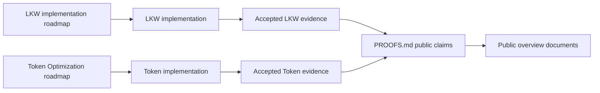
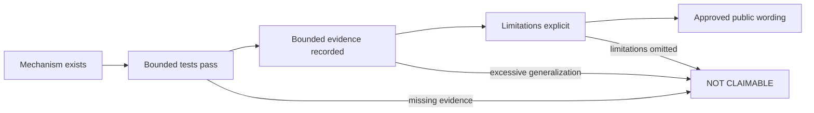

<!--
© Artur Czarnecki. All rights reserved.
Intergrax is source-available under the Intergrax Evaluation and Collaboration License 1.0.
See LICENSE for permitted evaluation, collaboration, and contribution use.
-->

# Intergrax Proofs

**Evidence before promises.**

Intergrax separates **implemented mechanisms**, **bounded verification**, **partial product capability**, **planned work**, and **claims that are not currently supported**. This page is the public proof dashboard — no internal task IDs required.

> [!NOTE]
> Intergrax is **source-available** and under **active R&D**. Technical proof does not imply finished SaaS, production readiness, real-user validation, or commercial validation.

> [!NOTE]
> This page reports public claims and accepted evidence.
> It does not mirror implementation roadmaps.
> For current tasks, dependencies and next implementation steps,
> follow the detailed roadmap linked for each product or capability.

## Status legend

| Label | Meaning |
|-------|---------|
| ✅ **IMPLEMENTED** | A concrete mechanism exists with bounded tests or accepted implementation evidence; no live, product, or production validation is implied. |
| 🧪 **BOUNDED PROOF** | Proof was executed in a named environment with available evidence and stated limitations; wording must not generalize beyond that scope. |
| 🟡 **PARTIAL** | Some slices are implemented; end-to-end capability, dependency, or validation gate remains open. |
| 🗓️ **PLANNED** | Architecture or scheduling exists; runtime behavior, proof, or integration is not yet available. |
| ⛔ **NOT CLAIMABLE** | No evidence supports the claim, or guardrails explicitly block public wording. |

Text labels are authoritative; symbols are visual support only.

## Proof landscape

Roadmaps own changing implementation progress.
Accepted evidence determines public claims.
Overview documents summarize those claims
without copying either roadmap.

## At a glance

| Proof path | Public classification | Current public status | What it demonstrates | Verify | Detailed roadmap |
|------------|------------------------|----------------------|----------------------|--------|------------------|
| **LKW** | Primary product proof | 🟡 **PARTIAL** (Backend Product Alpha / MVP) | Bounded end-to-end application and platform behavior, indexed knowledge, background ingest, hosting, observability | [LKW Platform Proof](LKW_PLATFORM_PROOF.md) | [LKW implementation plan](../technical/applications/local_workspace_application/IMPLEMENTATION_PLAN.md) |
| **Token Optimization** | Featured platform-capability proof | 🟡 **PARTIAL** | Deterministic optimization pipeline, cache-aware execution, bounded vLLM prefix-cache proof | [Token Optimization guide](../capabilities/token_optimization/README.md) | [Token Optimization plan](../capabilities/plan/TOKEN_OPTIMIZATION.md) |

`Verify` answers **what has been demonstrated?**
`Detailed roadmap` answers **what is being implemented and what comes next?**

Supporting-foundation evidence is capability-specific. The LKW proof exercises
only the reusable mechanisms named in its accepted evidence; other reusable
foundations do not inherit a blanket platform-wide **IMPLEMENTED** status.

---

## LKW — Primary product proof

**Role:** Primary product proof · **Product status:** Backend Product Alpha / MVP

The bounded indexed path is demonstrated through the production Hybrid Ask
indexed-evidence path. Mixed indexed + authorized live Hybrid Ask remains
incomplete, and complete live-provider access remains incomplete.

| Capability | Status | What it demonstrates | Limitation |
|------------|--------|----------------------|------------|
| Core application and platform proof | 🧪 **BOUNDED PROOF** | Real application startup, observability, ingest, hosting, persisted execution evidence | Bounded to documented certification profiles; not full live platform proof |
| Web URL knowledge intake | 🧪 **BOUNDED PROOF** | End-to-end WEB_URL intake, real RAG ingest, exact tenant/workspace vector scope, production indexed Ask path through Hybrid Ask over documented indexed evidence, grounded Ask with citation/evidence | Not live external-website certification; mixed indexed + authorized live Hybrid Ask remains incomplete; complete live-provider access remains incomplete |
| Ollama / vLLM model runtime portability | 🧪 **BOUNDED PROOF** | Same workspace workflows on Ollama and vLLM without reindexing | Not complete product parity across all features |

### Not established by the accepted public proof

- Mixed indexed + authorized live Hybrid Ask remains incomplete.
- Complete live-provider access remains incomplete.
- Complete multi-source live capability remains incomplete.
- Real-user validation is not established.
- Commercial validation is not established.

Detailed implementation roadmap:
[docs/project/technical/applications/local_workspace_application/IMPLEMENTATION_PLAN.md](../technical/applications/local_workspace_application/IMPLEMENTATION_PLAN.md)

Accepted technical proof:
[LKW Platform Proof](LKW_PLATFORM_PROOF.md)

---

## Token Optimization — Featured platform-capability proof

**Role:** Featured platform-capability proof

| Capability | Status | What it demonstrates | Limitation |
|------------|--------|----------------------|------------|
| Deterministic optimization pipeline | ✅ **IMPLEMENTED** | Layer registry, pipeline runner, built-in catalog, plugin contract | Not globally auto-enabled |
| Approved-configuration LLM routing | ✅ **IMPLEMENTED** | Policy-governed router with approved catalog only | Router output is advisory until application applies it |
| Protected-region validation | ✅ **IMPLEMENTED** | Central validation after content-changing layers | Does not guarantee semantic equivalence for all lossy paths |
| Receipts and fallback | ✅ **IMPLEMENTED** | Attribution, savings metadata, safe fallback on validation failure | Receipts exclude raw content |
| Cache-stable prompt assembly | ✅ **IMPLEMENTED** | Stable prefix, dynamic tail, append-only rules | Does not prove provider cache behavior alone |
| Exact-send integrity | ✅ **IMPLEMENTED** | Message and tool-schema integrity before adapter send | Provider-specific cache behavior varies |
| Cache-aware execution gate | ✅ **IMPLEMENTED** | Only `RUN` executes pipeline; conflicting evidence rejected | Does not perform in-cache compaction |
| Durable in-cache compaction mechanism | ✅ **IMPLEMENTED (BOUNDED)** | Durable SQLite repository, validation and CAS activation exist | Live provider proof, rollback execution and production rollout remain incomplete; numeric savings are not claimed |
| Bounded vLLM prefix-cache proof | 🧪 **BOUNDED PROOF** | Cold/warm/changed-prefix reuse in documented vLLM environment | Named version, model, and workload only |
| Universal token reduction | ⛔ **NOT CLAIMABLE** | — | No universal savings evidence |
| Production-proven savings | ⛔ **NOT CLAIMABLE** | — | Required proof and promotion gates are incomplete. |

### Not established by the accepted public proof

- Durable in-cache compaction is implemented as a bounded mechanism; an accepted public live proof of complete provider-wide behavior is not established.
- Cross-provider behavior is not established by the named vLLM proof.
- Provider-independent cache behavior is not established.
- Universal token reduction is not established.
- Production-proven savings are not established.

Detailed implementation roadmap:
[docs/project/capabilities/plan/TOKEN_OPTIMIZATION.md](../capabilities/plan/TOKEN_OPTIMIZATION.md)

Verification and claim routes:
[Token Optimization guide](../capabilities/token_optimization/README.md) · [Claim guardrails](../capabilities/TOKEN_OPTIMIZATION_CLAIMS.md)

---

## Claim-to-proof lifecycle

**Remember:** implemented code ≠ live proof ≠ product validation ≠ commercial validation ≠ production readiness.

---

## What Intergrax does not currently claim

> [!WARNING]
> The following are **not** current public claims:
>
> - finished SaaS product
> - completed commercial validation
> - universal production readiness
> - universal token or cost savings
> - completed Hybrid Ask combining indexed and authorized live evidence
> - complete vendor integration catalog
> - production-proven durable compaction rollout
> - real-user validation at scale

Real-user and commercial validation remain **incomplete**.

---

## Verification paths

| Document | Purpose |
|----------|---------|
| [LKW Platform Proof](LKW_PLATFORM_PROOF.md) | Guided LKW reviewer proof path |
| [LKW Implementation Plan](../technical/applications/local_workspace_application/IMPLEMENTATION_PLAN.md) | Detailed LKW implementation roadmap |
| [Token Optimization guide](../capabilities/token_optimization/README.md) | Engine overview and proof catalog |
| [Token Optimization plan](../capabilities/plan/TOKEN_OPTIMIZATION.md) | Detailed Token Optimization implementation roadmap |
| [Token Optimization claim guardrails](../capabilities/TOKEN_OPTIMIZATION_CLAIMS.md) | Safe public wording boundaries |
| [Public documentation map](../community/PUBLIC_DOCUMENTATION_MAP.md) | Reader-intent navigation |
| [Technical documentation map](../technical/DOCUMENTATION_MAP.md) | Deep technical review entry |

Maintainer status and wording rules: [Public Proof and Claims Model](../maintainers/public-adoption/PUBLIC_PROOF_AND_CLAIMS_MODEL.md)
