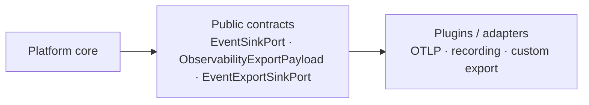

# ADR-OBS-005: Runtime event delivery failure contract (EventSinkPort)

| Field | Value |
|-------|-------|
| **Status** | Proposed — design freeze for P1B-R3 (D1-R1 plugin-boundary correction; GitHub audit required before implementation) |
| **Date** | 2026-09-14 (revised D1-R1) |
| **Deciders** | Platform observability / VPI platform evolution |
| **Related** | `intergrax/contracts/event_delivery.py` · ADR-OBS-001 · VPI-PLATFORM-EVOLUTION-P1B-D1 · P1B-D1-R1 · P1B-R3 |

## Context

W5-A introduced `EventSinkPort.publish(...) -> EventDeliveryResult` with dispositions `ACCEPTED`, `DROPPED`, `REJECTED`, `DEFERRED`. Durable evidence (Plane A) uses `EvidencePersistencePort` and `MandatoryEvidencePersistenceError`. Observability delivery (Plane B) and subscriber handlers (Plane C) are separate.

P1B wired stage signals through `RuntimeEventBus` → optional `EventSinkPort`. Post P1B-R2 audit identified a contract gap: infrastructure failures before a controlled `EventDeliveryResult` are not standardized; vendor exceptions can escape plugin boundaries. A follow-up D1-R1 audit identified **three design blockers** before P1B-R3:

| ID | Blocker |
|----|---------|
| **A** | `BoundedEventSink` uses `isinstance(..., RuntimeEventExportSink)` and a non-port `source_event` side channel instead of a vendor-neutral contract. |
| **B** | `CriticalEventDeliveryError` is forbidden on external `EventSinkPort` plugins but permitted on `BoundedEventSink` — violates one behavioral contract per port. |
| **C** | `EventExportSinkPort.export(event: object)` is not an enterprise-complete transport contract. |

VPI / Scenario 3 must use this platform path without bespoke side channels; gaps are fixed here, not in scenario code.

### Target path (contract-pure)

```text
RuntimeEvent
  -> RuntimeEventBus (persist Plane A)
  -> map to DeliverableEvent (+ embedded export payload)   [producer]
  -> EventSinkPort.publish(DeliverableEvent, priority=...)
       -> BoundedEventSink (buffer only; same port contract)
       -> RuntimeEventExportSink (bridge; EventSinkPort)
       -> EventExportSinkPort.export(ObservabilityExportPayload)
  -> subscribers (Plane C)
```



**Boundary data (vendor-neutral):**

| Datum | Created by | Consumed by |
|-------|------------|-------------|
| `EventPriority` | Platform (`delivery_priority_for_runtime_event` / kind rules) | `RuntimeEventBus`, every `EventSinkPort` |
| `DeliverableEvent` (transport envelope + embedded `ObservabilityExportPayload`) | Platform mapper at bus edge (`runtime_event_to_deliverable` extended in R3) | `BoundedEventSink`, `RuntimeEventExportSink`, any `EventSinkPort` |
| `EventDeliveryResult` | Every `EventSinkPort` implementation | `RuntimeEventBus` (policy), metrics |
| `EventDeliveryBoundaryError` | `EventSinkPort` / bridge when mechanism cannot honor the port | `RuntimeEventBus` (policy translation) |
| `ExportError` family | `EventExportSinkPort` plugins after vendor translation | `RuntimeEventExportSink` (maps to `EventDeliveryResult`, never bus) |
| `CriticalEventDeliveryError` | **Only** `RuntimeEventBus` | Execution / stage emitters (fail-closed policy) |

### Implementation inventory (pre-R3)

| Implementation | Contract | R3 migration |
|----------------|----------|--------------|
| AcceptingObservabilityEventSink | EventSinkPort | Document unified behavioral contract |
| InMemoryEventSink | EventSinkPort | Same |
| BoundedEventSink | EventSinkPort | Remove `RuntimeEventExportSink` isinstance branch; remove `source_event` kwarg; never raise `CriticalEventDeliveryError` |
| RuntimeEventExportSink | EventSinkPort bridge | Consume `DeliverableEvent.export_payload`; deprecate `deliver_bounded`; narrow exception mapping |
| RuntimeEventBus | orchestrator | Remove `isinstance(..., BoundedEventSink)`; sole owner of `CriticalEventDeliveryError` |
| *EventExportSinkPort plugins* | EventExportSinkPort | `export(ObservabilityExportPayload)` |

## Problems

1. No public typed sink failure on `EventSinkPort` (unchanged from D1).
2. `RuntimeEventBus._deliver_through_event_sink` does not handle `EventDeliveryBoundaryError` (unchanged from D1).
3. **A:** Side channel (`source_event`, `deliver_bounded`, isinstance) couples core buffering to one bridge class.
4. **B:** Split rules for `CriticalEventDeliveryError` across bus and `BoundedEventSink`.
5. **C:** Export transport accepts `object` — no structure, invariants, or plugin expectations.

## Decision 1 — Plugin boundary (D1-R1): Option C (enriched neutral envelope at producer)

Evaluated:

| Option | Verdict |
|--------|---------|
| **A** — widen `EventSinkPort.publish` with parallel envelope parameters | Rejected: duplicates `DeliverableEvent`; encourages ad-hoc parameters per caller. |
| **B** — second port (source-aware delivery) | Rejected: forces composition root and bus to know stack shape; duplicates buffering entry semantics. |
| **C** — embed required export data in the neutral model **before** any sink | **Accepted** — one `EventSinkPort` call shape; `BoundedEventSink` stays a pure decorator; any downstream `EventSinkPort` (including export bridge) is substitutable. |

### Contract changes (P1B-R3 — design only here)

1. Add **`ObservabilityExportPayload`** to `intergrax/contracts/event_delivery.py` (frozen dataclass): vendor-neutral, redacted-by-default fields required for observability export (identity, kind, correlation ids, safe attribute bag, `schema_version`). **No** `RuntimeEvent` type on the port surface.
2. Extend **`DeliverableEvent`** with required `export_payload: ObservabilityExportPayload` (transport fields `event_id`, `kind`, `sequence` remain; must stay consistent with payload).
3. **Producer ownership:** `runtime_event_to_deliverable` (runtime module) is the only place that reads `RuntimeEvent` to build both transport and export payload. `RuntimeEventBus` always calls `sink.publish(deliverable, priority=...)` — **no** `isinstance` on sink implementation, **no** extra keyword arguments.
4. **Consumer ownership:** `BoundedEventSink` drain loop calls only `downstream.publish(item.event, priority=..., deadline=None)`. `RuntimeEventExportSink` reads `deliverable.export_payload` and passes it to `EventExportSinkPort.export(...)`.

### Re-use note (no scope creep)

Runtime tier already defines **`ObservabilityExportEnvelope`** (`export_boundary.py`, schema `observability_export_envelope.v1`) for other export routes. **Do not** widen that runtime type into `EventSinkPort`. P1B-R3 adds a **contracts-layer** `ObservabilityExportPayload` aligned with the RUNTIME_EVENT subset of that schema and a single mapper `RuntimeEvent → ObservabilityExportPayload` (may delegate to existing sanitization helpers in runtime). Promoting the full Pydantic envelope into contracts is **out of scope** for P1B-R3 unless a separate ADR mandates it.

### Vendor neutrality

External plugins implement `EventSinkPort` and/or `EventExportSinkPort` using only `intergrax/contracts/*`. They never import `RuntimeEventExportSink`, never receive private `deliver_bounded`, and never depend on buffer internals.

## Decision 2 — Failure taxonomy on `EventSinkPort` (D1, retained)

Adopt **Option A**: `EventDeliveryFailureKind` (`TRANSPORT`, `UNAVAILABLE`, `SINK_INTERNAL`) and `EventDeliveryBoundaryError` in `intergrax/contracts/event_delivery.py`.

Rejected: Option B (hierarchy without distinct policy), Option C (result-only — cannot express broken mechanism vs policy outcome).

## Decision 3 — `CriticalEventDeliveryError` ownership (D1-R1)

**Single behavioral contract:** every `EventSinkPort` implementation (including `BoundedEventSink` and `RuntimeEventExportSink`) behaves identically:

- Return `EventDeliveryResult` for policy-complete outcomes (`ACCEPTED`, `DROPPED`, `REJECTED`, `DEFERRED`).
- Raise **`EventDeliveryBoundaryError`** only when the port cannot complete `publish` / `close` as specified (after internal normalization).
- **Never** raise `CriticalEventDeliveryError`.

**`CriticalEventDeliveryError` is exclusively a platform policy exception** raised by **`RuntimeEventBus`** when delivery priority is `CRITICAL` and:

- `EventDeliveryResult.disposition` is `DROPPED` or `REJECTED`, or
- `EventDeliveryBoundaryError` escapes the sink call (chained as `__cause__`).

Including buffer saturation: `BoundedEventSink` returns `REJECTED` for `CRITICAL` when the buffer is full or sink is closed; the bus elevates to `CriticalEventDeliveryError`. **No special case** for bounded vs plugin sinks.

`BEST_EFFORT` / `IMPORTANT`: bus tolerates or records per existing disposition rules; boundary errors on `BEST_EFFORT` do not fail the execution plane.

### Error ownership table

| Situation | Who detects | Public result / error | Who decides execution impact |
|-----------|-------------|------------------------|------------------------------|
| Normal accept | Any `EventSinkPort` | `ACCEPTED` | Bus — continue |
| Policy drop (best effort) | Any `EventSinkPort` | `DROPPED` | Bus — tolerate |
| Policy reject | Any `EventSinkPort` | `REJECTED` | Bus — CRITICAL → `CriticalEventDeliveryError`; else metrics |
| Policy defer | Any `EventSinkPort` | `DEFERRED` | Bus — continue |
| Buffer full (CRITICAL) | `BoundedEventSink` | `REJECTED` | Bus → `CriticalEventDeliveryError` |
| Buffer full (BEST_EFFORT) | `BoundedEventSink` | `DROPPED` | Bus — tolerate |
| Sink closed with pending CRITICAL | `BoundedEventSink` | `REJECTED` | Bus → `CriticalEventDeliveryError` |
| Downstream `EventSinkPort` unavailable / internal | Plugin or bridge | `EventDeliveryBoundaryError` | Bus — policy by priority |
| Vendor transport failure | `EventExportSinkPort` plugin | `ExportError` / `OtlpTransportError` (not bus) | `RuntimeEventExportSink` → `EventDeliveryResult` (`DROPPED` or `REJECTED`) |
| CRITICAL + bad disposition after export bridge | `RuntimeEventExportSink` | `REJECTED` / `DROPPED` | Bus → `CriticalEventDeliveryError` if CRITICAL |
| CRITICAL + boundary at `EventSinkPort` | Any `EventSinkPort` | `EventDeliveryBoundaryError` | Bus → `CriticalEventDeliveryError` |
| BEST_EFFORT + boundary at `EventSinkPort` | Any `EventSinkPort` | `EventDeliveryBoundaryError` | Bus — tolerate + metrics |

## Decision 4 — `EventExportSinkPort.export(event: object)` (D1-R1)

**Path 1 — fix in P1B-R3 (required for enterprise-complete delivery boundary).**

`EventExportSinkPort` must accept **`ObservabilityExportPayload`** (same type embedded in `DeliverableEvent`). `object`, `dict[str, Any]`, reflection, and `RuntimeEvent` on the port are **forbidden** at end of R3.

`OtlpTransportPort.export(event: object)` remains **separate contract debt** (documented finding below); R3 may narrow the bridge adapter only — not a substitute for fixing `EventExportSinkPort`.

### Export layer vs delivery boundary

- `EventExportSinkPort` failures → `ExportError` / `OtlpTransportError` → `RuntimeEventExportSink` maps to `EventDeliveryResult`.
- Do **not** merge export errors with `EventDeliveryBoundaryError` or persistence errors.
- Normalization: vendor SDK → plugin → public platform error; never vendor SDK → `RuntimeEventBus`.

## Pluginability and composition

- `RuntimeEventBus` depends only on `EventSinkPort` (constructor injection).
- Composition: `runtime_event_delivery_wiring.py`, `EventExportSinkFactoryPort`.
- Core MUST NOT: `isinstance` concrete adapters, `getattr`/`setattr` for delivery, Scenario 3 branches, or imports of application/agent plugins to alter delivery behavior.

## Lifecycle

`publish` + `close` remain sufficient — no change.

## Concern ownership (summary)

| Concern | Owner |
|---------|--------|
| Delivery contract & payload types | Platform contracts |
| `DeliverableEvent` + `ObservabilityExportPayload` construction | Runtime mapper at bus edge |
| `EventDeliveryResult` / `EventDeliveryBoundaryError` | Platform contracts; raised only by sinks |
| `CriticalEventDeliveryError` | **`RuntimeEventBus` only** |
| Priority & fail-closed policy | `RuntimeEventBus` |
| Vendor translation | Export / sink plugins |
| Buffering semantics | `BoundedEventSink` (as plain `EventSinkPort`) |
| Retry | FUTURE — not `EventSinkPort` |
| Persistence | Evidence subsystem |
| Business reaction (VPI) | `ApplicationExecutionStageSignalEmissionError` |

## Migration boundary (P1B-R3)

**In scope:**

- Contract types in `event_delivery.py` (`ObservabilityExportPayload`, boundary error types).
- `DeliverableEvent` shape; mapper; `EventExportSinkPort` signature.
- Remove isinstance / `source_event` / `deliver_bounded` public seam from delivery path.
- Unified `CriticalEventDeliveryError` ownership in `event_bus.py`.
- Tests listed under contract tests.

**Out of scope / do not touch without new design:**

- Retry framework, plugin registry governance, Kafka, full OTLP stack rewrite.
- Promoting full `ObservabilityExportEnvelope` Pydantic model to contracts.
- Scenario 3 business logic; Data Pack; RRF.
- `OtlpTransportPort.export(object)` — **separate follow-up** (same hygiene rules; optional small adapter typing in R3 only if zero semantic creep).

**Legacy removal (R3 implementation, not D1-R1):**

- `BoundedEventSink.publish(..., source_event=...)` — delete.
- `RuntimeEventExportSink.deliver_bounded` — delete or make private dead code until removed.
- `RuntimeEventBus` `isinstance(sink, BoundedEventSink)` — delete.

If a sink has no production consumer after R3, prefer removal over compatibility shims.

## Contract tests (P1B-R3)

- SUCCESS, DROPPED, REJECTED, DEFERRED dispositions.
- `EventDeliveryBoundaryError` propagation and bus policy.
- No vendor exception leak to bus.
- CRITICAL → `CriticalEventDeliveryError` only from bus.
- BEST_EFFORT boundary tolerance.
- Plugin swap without core changes.
- **No** `isinstance` on `RuntimeEventExportSink` / `BoundedEventSink` in delivery path modules.
- Export plugins receive `ObservabilityExportPayload` only.
- VPI boundary still sees only `ApplicationExecutionStageSignalEmissionError`.

## External plugin contract

- Implement `publish` / `close` on `EventSinkPort`.
- Use `DeliverableEvent.export_payload` for export plugins via `EventExportSinkPort`.
- Return `EventDeliveryResult` for policy-complete outcomes.
- Raise only `EventDeliveryBoundaryError` (sinks) or `ExportError` family (export port).
- Never raise `CriticalEventDeliveryError` or raw vendor exceptions.
- No secrets in public messages; document thread-safety if shared.

## Non-goals

Implementation in D1/D1-R1; retry; governance registry; VPI adoption code; Kafka/OTLP feature work beyond contract typing.

## Consequences

- Contract-pure, substitutable delivery stack; R3 carries mapper + signature migration.
- Slight expansion of `DeliverableEvent` (intentional, bounded).

## Rollback

Remove new contract fields and bus policy handling; restore prior behavior only via explicit revert (not recommended).

## Compliance

Tier boundaries preserved (`intergrax/` does not import `applications/` or `agents/`). Persistence ≠ delivery. Scenario-neutral.

## Enterprise design review (D1-R1)

| # | Criterion | Answer |
|---|-----------|--------|
| 1 | Core depends only on contracts | YES (after R3 removes isinstance side channels) |
| 2 | External plugin without core change | YES |
| 3 | `BoundedEventSink` without downstream concrete type | YES (Option C) |
| 4 | Same `EventSinkPort` behavioral contract | YES |
| 5 | Who raises `CriticalEventDeliveryError` | `RuntimeEventBus` only |
| 6 | Vendor failure contained | YES (`ExportError` / boundary error) |
| 7 | Failure contract typed | YES (`EventDeliveryBoundaryError`, `ExportError`) |
| 8 | `EventExportSinkPort` `object` decided | YES — Path 1 in P1B-R3 |
| 9 | Persistence vs observability delivery separate | YES |
| 10 | Scenario-neutral | YES |
| 11 | Scenario 3 uses platform mechanism | YES (no side channel) |
| 12 | Future strategy without core edit | YES (injection + contracts) |
| 13 | No gratuitous abstraction | YES (one payload type, one port shape) |
| 14 | Scope limited to audit blockers | YES |

**Verdict:** Design PASS for P1B-R3 entry — pending independent GitHub audit of this revision.

## Separate finding (not D1-R1 scope)

`OtlpTransportPort.export(event: object)` in `intergrax/contracts/observability_export.py` mirrors the same weakness. Track as **OBS-EXPORT transport contract debt**; do not block P1B-R3 on full OTLP port redesign if `EventExportSinkPort` and bridge are typed.