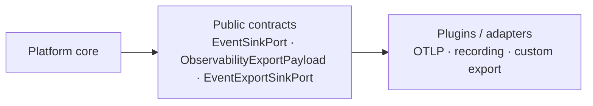
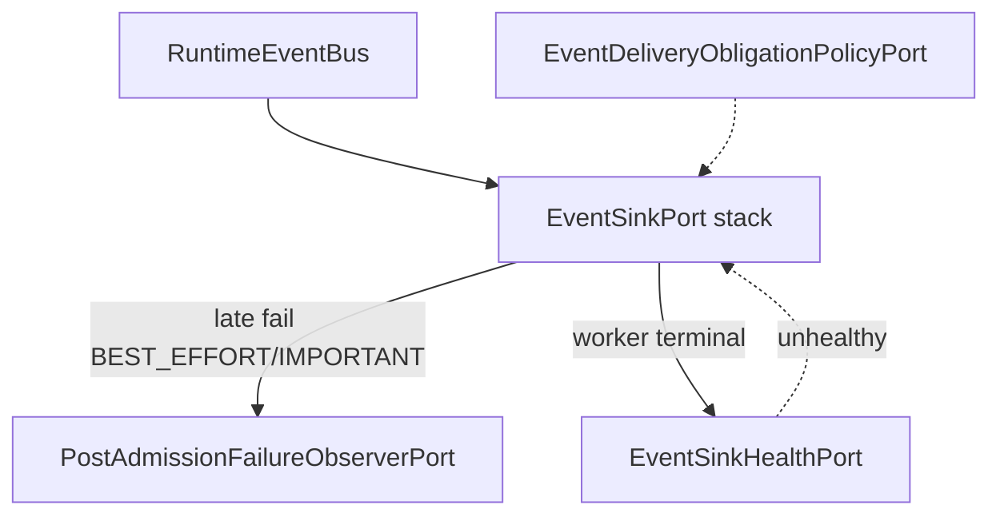

# ADR-OBS-005: Runtime event delivery failure contract (EventSinkPort)

| Field | Value |
|-------|-------|
| **Status** | Proposed — design freeze for P1B-R3 (D1-R2 contract invariants + policy extension; GitHub audit required before implementation) |
| **Date** | 2026-09-14 (revised D1-R2) |
| **Deciders** | Platform observability / VPI platform evolution |
| **Related** | `intergrax/contracts/event_delivery.py` · ADR-OBS-001 · VPI-PLATFORM-EVOLUTION-P1B-D1 · P1B-D1-R1 · P1B-D1-R2 · P1B-R3 · **P1B-R3-D1** · OBS-EXPORT-TRANSPORT-CONTRACT-D1 |

## Context

W5-A introduced `EventSinkPort.publish(...) -> EventDeliveryResult` with dispositions `ACCEPTED`, `DROPPED`, `REJECTED`, `DEFERRED`. Durable evidence (Plane A) uses `EvidencePersistencePort` and `MandatoryEvidencePersistenceError`. Observability delivery (Plane B) and subscriber handlers (Plane C) are separate.

P1B wired stage signals through `RuntimeEventBus` → optional `EventSinkPort`. Post P1B-R2 audit identified a contract gap: infrastructure failures before a controlled `EventDeliveryResult` are not standardized; vendor exceptions can escape plugin boundaries. A follow-up D1-R1 audit identified **three design blockers** before P1B-R3:

| ID | Blocker |
|----|---------|
| **A** | `BoundedEventSink` uses `isinstance(..., RuntimeEventExportSink)` and a non-port `source_event` side channel instead of a vendor-neutral contract. |
| **B** | `CriticalEventDeliveryError` is forbidden on external `EventSinkPort` plugins but permitted on `BoundedEventSink` — violates one behavioral contract per port. |
| **C** | `EventExportSinkPort.export(event: object)` is not an enterprise-complete transport contract. |

VPI / Scenario 3 must use this platform path without bespoke side channels; gaps are fixed here, not in scenario code.

A follow-up **D1-R2** audit closed three remaining ambiguities before P1B-R3:

| ID | Blocker |
|----|---------|
| **D** | Duplicate identity/kind on `DeliverableEvent` and embedded `ObservabilityExportPayload` with documentation-only consistency rules. |
| **E** | Fail-closed vs tolerate reactions are hardcoded in `RuntimeEventBus` with no minimal public strategy extension point. |
| **F** | `RuntimeEventExportSink.deliver_bounded` described as optional private dead code instead of explicit R3 removal. |


### Target path (contract-pure)

```text
RuntimeEvent
  -> RuntimeEventBus (persist Plane A)
  -> map to DeliverableEvent (export_payload + sequence)   [producer]
  -> EventSinkPort.publish(DeliverableEvent, priority=...)
       -> BoundedEventSink (buffer only; same port contract)
       -> RuntimeEventExportSink (bridge; EventSinkPort)
       -> EventExportSinkPort.export(ObservabilityExportPayload)
  -> subscribers (Plane C)
```



**Boundary data (vendor-neutral):**

| Datum | Created by | Consumed by |
|-------|------------|-------------|
| `EventPriority` | Platform (`delivery_priority_for_runtime_event` / kind rules) | `RuntimeEventBus`, every `EventSinkPort` |
| `DeliverableEvent` (`export_payload` + `sequence`; identity/kind via payload only) | Platform mapper at bus edge (`runtime_event_to_deliverable` extended in R3) | `BoundedEventSink`, `RuntimeEventExportSink`, any `EventSinkPort` |
| `EventDeliveryResult` | Every `EventSinkPort` implementation | `RuntimeEventBus` (policy), metrics |
| `EventDeliveryBoundaryError` | `EventSinkPort` / bridge when mechanism cannot honor the port | `RuntimeEventBus` (policy translation) |
| `ExportError` family | `EventExportSinkPort` plugins after vendor translation | `RuntimeEventExportSink` (maps to `EventDeliveryResult`, never bus) |
| `CriticalEventDeliveryError` | **Only** `RuntimeEventBus` | Execution / stage emitters (fail-closed policy) |

### Implementation inventory (pre-R3)

| Implementation | Contract | R3 migration |
|----------------|----------|--------------|
| AcceptingObservabilityEventSink | EventSinkPort | Document unified behavioral contract |
| InMemoryEventSink | EventSinkPort | Same |
| BoundedEventSink | EventSinkPort | Remove `RuntimeEventExportSink` isinstance branch; remove `source_event` kwarg; never raise `CriticalEventDeliveryError` |
| RuntimeEventExportSink | EventSinkPort bridge | Consume `DeliverableEvent.export_payload`; **delete** `deliver_bounded` in R3; narrow exception mapping |
| RuntimeEventBus | orchestrator | Remove `isinstance(..., BoundedEventSink)`; sole owner of `CriticalEventDeliveryError` |
| *EventExportSinkPort plugins* | EventExportSinkPort | `export(ObservabilityExportPayload)` |

## Problems

1. No public typed sink failure on `EventSinkPort` (unchanged from D1).
2. `RuntimeEventBus._deliver_through_event_sink` does not handle `EventDeliveryBoundaryError` (unchanged from D1).
3. **A:** Side channel (`source_event`, `deliver_bounded`, isinstance) couples core buffering to one bridge class.
4. **B:** Split rules for `CriticalEventDeliveryError` across bus and `BoundedEventSink`.
5. **C:** Export transport accepts `object` — no structure, invariants, or plugin expectations.
6. **D:** Two stores for `event_id` / `kind` invite illegal or drifted envelopes unless construction is constrained.
7. **E:** Bus reaction rules are not injectable without editing `RuntimeEventBus`.
8. **F:** Legacy `deliver_bounded` seam still documented as tolerable dead code.

## Decision 1 — Plugin boundary (D1-R1): Option C (enriched neutral envelope at producer)

Evaluated:

| Option | Verdict |
|--------|---------|
| **A** — widen `EventSinkPort.publish` with parallel envelope parameters | Rejected: duplicates `DeliverableEvent`; encourages ad-hoc parameters per caller. |
| **B** — second port (source-aware delivery) | Rejected: forces composition root and bus to know stack shape; duplicates buffering entry semantics. |
| **C** — embed required export data in the neutral model **before** any sink | **Accepted** — one `EventSinkPort` call shape; `BoundedEventSink` stays a pure decorator; any downstream `EventSinkPort` (including export bridge) is substitutable. |

### Contract changes (P1B-R3 — design only here)

1. Add **`ObservabilityExportPayload`** to `intergrax/contracts/event_delivery.py` (frozen dataclass): vendor-neutral, redacted-by-default fields required for observability export (**canonical** `event_id`, `kind`, correlation ids, safe attribute bag, `schema_version`). **No** `RuntimeEvent` type on the port surface.
2. Reshape **`DeliverableEvent`** to **single source of truth** for identity/kind:
   - **Stored fields:** `export_payload: ObservabilityExportPayload` and `sequence: int` (bounded-buffer ordering only).
   - **No** independent stored `event_id` / `kind` on the envelope. P1B-R3 may expose `event_id` and `kind` as read-only delegating accessors (`deliverable.event_id` → `deliverable.export_payload.event_id`) for stable call sites — not a second mutable source.
   - **Illegal inconsistent construction** is prevented by a **single public factory** in contracts, e.g. `make_deliverable_event(export_payload, *, sequence=0) -> DeliverableEvent`. Producers and tests must use this factory (or a runtime helper that delegates to it). Ad-hoc construction that could diverge payload vs envelope is **not** part of the supported public API.
3. **Producer ownership:** `runtime_event_to_deliverable` (runtime module) is the **only** place that reads `RuntimeEvent`. It builds `ObservabilityExportPayload` first, then `make_deliverable_event(...)`. `RuntimeEventBus` always calls `sink.publish(deliverable, priority=...)` — **no** `isinstance` on sink implementation, **no** extra keyword arguments.
4. **Consumer ownership:** `BoundedEventSink` drain loop calls only `downstream.publish(item.event, priority=..., deadline=None)`. `RuntimeEventExportSink` reads `deliverable.export_payload` only. Plugins **must not** synchronize duplicate identity fields — there are none to sync.

### Decision 1b — Data ownership (D1-R2)

| Field / concern | Canonical owner | Notes |
|-----------------|-----------------|-------|
| `event_id`, `kind`, export correlation | `ObservabilityExportPayload` | Only write path is the runtime mapper → factory |
| `sequence` | `DeliverableEvent` | Transport ordering for bounded delivery; not a second identity |
| Envelope accessors `event_id` / `kind` | Delegation to `export_payload` | Ergonomics only; no separate storage |

**Transport duplication:** If a future wire format requires repeating identity outside the payload blob, the **same factory** must populate both from one `ObservabilityExportPayload` instance in one call — consumers still treat payload as canonical; wire duplicates are encoder concerns, not a second platform truth for plugins.

### Re-use note (no scope creep)

Runtime tier already defines **`ObservabilityExportEnvelope`** (`export_boundary.py`, schema `observability_export_envelope.v1`) for other export routes. **Do not** widen that runtime type into `EventSinkPort`. P1B-R3 adds a **contracts-layer** `ObservabilityExportPayload` aligned with the RUNTIME_EVENT subset of that schema and a single mapper `RuntimeEvent → ObservabilityExportPayload` (may delegate to existing sanitization helpers in runtime). Promoting the full Pydantic envelope into contracts is **out of scope** for P1B-R3 unless a separate ADR mandates it.

### Vendor neutrality

External plugins implement `EventSinkPort` and/or `EventExportSinkPort` using only `intergrax/contracts/*`. They never import `RuntimeEventExportSink`, never call `deliver_bounded` (removed in R3), and never depend on buffer internals.

## Decision 2 — Failure taxonomy on `EventSinkPort` (D1, retained)

Adopt **Option A**: `EventDeliveryFailureKind` (`TRANSPORT`, `UNAVAILABLE`, `SINK_INTERNAL`) and `EventDeliveryBoundaryError` in `intergrax/contracts/event_delivery.py`.

Rejected: Option B (hierarchy without distinct policy), Option C (result-only — cannot express broken mechanism vs policy outcome).

## Decision 3 — `CriticalEventDeliveryError` ownership (D1-R1)

**Single behavioral contract:** every `EventSinkPort` implementation (including `BoundedEventSink` and `RuntimeEventExportSink`) behaves identically:

- Return `EventDeliveryResult` for policy-complete outcomes (`ACCEPTED`, `DROPPED`, `REJECTED`, `DEFERRED`).
- Raise **`EventDeliveryBoundaryError`** only when the port cannot complete `publish` / `close` as specified (after internal normalization).
- **Never** raise `CriticalEventDeliveryError`.

**`CriticalEventDeliveryError` is exclusively a platform policy exception** raised by **`RuntimeEventBus`** when delivery priority is `CRITICAL` and:

- `EventDeliveryResult.disposition` is `DROPPED` or `REJECTED`, or
- `EventDeliveryBoundaryError` escapes the sink call (chained as `__cause__`).

Including buffer saturation: `BoundedEventSink` returns `REJECTED` for `CRITICAL` when the buffer is full or sink is closed; the bus elevates to `CriticalEventDeliveryError`. **No special case** for bounded vs plugin sinks.

`BEST_EFFORT` / `IMPORTANT`: bus tolerates or records per existing disposition rules; boundary errors on `BEST_EFFORT` do not fail the execution plane.

## Decision 3b — Delivery failure reaction policy (D1-R2)

`RuntimeEventBus` remains the **sole** component that may **raise** `CriticalEventDeliveryError`. Reaction rules must not be permanently hardcoded in the bus implementation body; they must be supplied by a **minimal injectable strategy** without `isinstance` on sink classes.

### Re-use first

- **`EventDeliveryPolicy`** (buffer capacity, important wait timeout) — **unchanged**; it is not a failure-reaction policy. Do not overload it.
- No policy registry, no plugin framework, no governance catalog in P1B-R3.

### New minimal contract (`intergrax/contracts/event_delivery.py`)

| Type | Role |
|------|------|
| `EventDeliveryReaction` (`StrEnum`) | `CONTINUE` — execution plane proceeds (metrics/logging as today); `FAIL_EXECUTION` — bus must fail closed |
| `EventSinkDeliveryReactionPort` (`Protocol`) | `reaction_for_result(priority, result: EventDeliveryResult) -> EventDeliveryReaction`; `reaction_for_boundary_error(priority, error: EventDeliveryBoundaryError) -> EventDeliveryReaction` |
| `EnterpriseDefaultEventSinkDeliveryReaction` | Frozen default strategy matching current enterprise bus behavior (drop-in when injection omitted) |

**Wiring:** `RuntimeEventBus` constructor accepts optional `delivery_reaction: EventSinkDeliveryReactionPort | None` (default = enterprise implementation). Composition root (`runtime_event_delivery_wiring` or tests) may substitute a custom strategy; **bus applies platform invariants below before acting**.

### Platform invariants (not configurable by strategy)

| ID | Invariant |
|----|-----------|
| **PI-1** | Only `RuntimeEventBus` may raise `CriticalEventDeliveryError`. |
| **PI-2** | Strategies return `EventDeliveryReaction` only; they **never** raise `CriticalEventDeliveryError`. |
| **PI-3** | For `EventPriority.CRITICAL`, `EventDeliveryResult` disposition `DROPPED` or `REJECTED` → effective reaction is always `FAIL_EXECUTION` (bus enforces floor if strategy returns `CONTINUE`). |
| **PI-4** | For `EventPriority.CRITICAL`, any `EventDeliveryBoundaryError` from `EventSinkPort.publish` / `close` → effective reaction is always `FAIL_EXECUTION` (bus enforces floor). |
| **PI-5** | Every `EventSinkPort` implementation (including `BoundedEventSink`, `RuntimeEventExportSink`) — unchanged port behavior from Decision 3. |

### Configurable strategy surface (examples)

| Input | Typical enterprise default | May vary (non-CRITICAL) |
|-------|---------------------------|-------------------------|
| `BEST_EFFORT` + `DROPPED` / `REJECTED` | `CONTINUE` | Metrics detail only |
| `BEST_EFFORT` + `EventDeliveryBoundaryError` | `CONTINUE` | Alternate logging |
| `IMPORTANT` + `REJECTED` | `CONTINUE` (metrics) | Future stricter product policy via injected strategy |
| `CRITICAL` + bad disposition or boundary | `FAIL_EXECUTION` | **Not** overridable (PI-3, PI-4) |

Bus mapping: `FAIL_EXECUTION` → raise `CriticalEventDeliveryError` (with `EventDeliveryBoundaryError` chained when applicable); `CONTINUE` → no execution-plane failure.


### Error ownership table

| Situation | Who detects | Public result / error | Who decides execution impact |
|-----------|-------------|------------------------|------------------------------|
| Normal accept | Any `EventSinkPort` | `ACCEPTED` | Bus — continue |
| Policy drop (best effort) | Any `EventSinkPort` | `DROPPED` | Bus — tolerate |
| Policy reject | Any `EventSinkPort` | `REJECTED` | Bus — CRITICAL → `CriticalEventDeliveryError`; else metrics |
| Policy defer | Any `EventSinkPort` | `DEFERRED` | Bus — continue |
| Buffer full (CRITICAL) | `BoundedEventSink` | `REJECTED` | Bus → `CriticalEventDeliveryError` |
| Buffer full (BEST_EFFORT) | `BoundedEventSink` | `DROPPED` | Bus — tolerate |
| Sink closed with pending CRITICAL | `BoundedEventSink` | `REJECTED` | Bus → `CriticalEventDeliveryError` |
| Downstream `EventSinkPort` unavailable / internal | Plugin or bridge | `EventDeliveryBoundaryError` | Bus — policy by priority |
| Vendor transport failure | `EventExportSinkPort` plugin | `ExportError` / `OtlpTransportError` (not bus) | `RuntimeEventExportSink` → `EventDeliveryResult` (`DROPPED` or `REJECTED`) |
| CRITICAL + bad disposition after export bridge | `RuntimeEventExportSink` | `REJECTED` / `DROPPED` | Bus → `CriticalEventDeliveryError` if CRITICAL |
| CRITICAL + boundary at `EventSinkPort` | Any `EventSinkPort` | `EventDeliveryBoundaryError` | Bus → `CriticalEventDeliveryError` |
| BEST_EFFORT + boundary at `EventSinkPort` | Any `EventSinkPort` | `EventDeliveryBoundaryError` | Bus — tolerate + metrics |

## Decision 4 — `EventExportSinkPort.export(event: object)` (D1-R1)

**Path 1 — fix in P1B-R3 (required for enterprise-complete delivery boundary).**

`EventExportSinkPort` must accept **`ObservabilityExportPayload`** (same type embedded in `DeliverableEvent`). `object`, `dict[str, Any]`, reflection, and `RuntimeEvent` on the port are **forbidden** at end of R3.

`OtlpTransportPort.export(event: object)` remains **separate contract debt** — formal design task **OBS-EXPORT-TRANSPORT-CONTRACT-D1** (see below); R3 may narrow the bridge adapter only — not a substitute for fixing `EventExportSinkPort`.

### Export layer vs delivery boundary

- `EventExportSinkPort` failures → `ExportError` / `OtlpTransportError` → `RuntimeEventExportSink` maps to `EventDeliveryResult`.
- Do **not** merge export errors with `EventDeliveryBoundaryError` or persistence errors.
- Normalization: vendor SDK → plugin → public platform error; never vendor SDK → `RuntimeEventBus`.

## Pluginability and composition

- `RuntimeEventBus` depends only on `EventSinkPort` (constructor injection).
- Composition: `runtime_event_delivery_wiring.py`, `EventExportSinkFactoryPort`.
- Core MUST NOT: `isinstance` concrete adapters, `getattr`/`setattr` for delivery, Scenario 3 branches, or imports of application/agent plugins to alter delivery behavior.

## Lifecycle

`publish` + `close` remain sufficient — no change.

## Concern ownership (summary)

| Concern | Owner |
|---------|--------|
| Delivery contract & payload types | Platform contracts |
| `DeliverableEvent` + `ObservabilityExportPayload` construction | Runtime mapper at bus edge |
| `EventDeliveryResult` / `EventDeliveryBoundaryError` | Platform contracts; raised only by sinks |
| `CriticalEventDeliveryError` | **`RuntimeEventBus` only** |
| Priority assignment | `RuntimeEventBus` / kind rules |
| Fail-closed reaction (CRITICAL) | `RuntimeEventBus` applies `EventSinkDeliveryReactionPort` under PI-1…PI-4 |
| `EventSinkDeliveryReactionPort` implementation | Injectable; default `EnterpriseDefaultEventSinkDeliveryReaction` |
| Vendor translation | Export / sink plugins |
| Buffering semantics | `BoundedEventSink` (as plain `EventSinkPort`) |
| Retry | FUTURE — not `EventSinkPort` |
| Persistence | Evidence subsystem |
| Business reaction (VPI) | `ApplicationExecutionStageSignalEmissionError` |

## Migration boundary (P1B-R3)

**In scope:**

- Contract types in `event_delivery.py` (`ObservabilityExportPayload`, boundary error types).
- `DeliverableEvent` shape (payload + sequence, factory); mapper; `EventExportSinkPort` signature.
- `EventSinkDeliveryReactionPort` + bus injection; `EnterpriseDefaultEventSinkDeliveryReaction`.
- Remove isinstance / `source_event` / `deliver_bounded` public seam from delivery path.
- Unified `CriticalEventDeliveryError` ownership in `event_bus.py`.
- Tests listed under contract tests.

**Out of scope / do not touch without new design:**

- Retry framework, plugin registry governance, Kafka, full OTLP stack rewrite.
- Promoting full `ObservabilityExportEnvelope` Pydantic model to contracts.
- Scenario 3 business logic; Data Pack; RRF.
- Full OTLP transport typing — **OBS-EXPORT-TRANSPORT-CONTRACT-D1** only (not P1B-R3 scope beyond bridge isolation).

**Legacy removal (R3 implementation — mandatory, no dead-code retention):**

- `BoundedEventSink.publish(..., source_event=...)` — **delete**.
- `RuntimeEventBus` `isinstance(sink, BoundedEventSink)` — **delete**.
- `RuntimeEventExportSink.deliver_bounded` — **delete** (not private, not deprecated shim).

**Production consumer audit (pre-R3):** `deliver_bounded` is referenced only from `BoundedEventSink` drain (`bounded_event_sink.py`) and from `RuntimeEventExportSink` itself. No composition root, application, or agent calls it directly. After R3, drain uses `downstream.publish(deliverable, priority=..., deadline=None)` only — same as every other `EventSinkPort` decorator.

If any additional caller appears during R3 implementation, migrate it to `publish` in the same change set; do not retain `deliver_bounded`.

## Contract tests (P1B-R3)

- SUCCESS, DROPPED, REJECTED, DEFERRED dispositions.
- `EventDeliveryBoundaryError` propagation and bus policy.
- No vendor exception leak to bus.
- CRITICAL → `CriticalEventDeliveryError` only from bus.
- BEST_EFFORT boundary tolerance.
- Plugin swap without core changes.
- **No** `isinstance` on `RuntimeEventExportSink` / `BoundedEventSink` in delivery path modules.
- Export plugins receive `ObservabilityExportPayload` only.
- VPI boundary still sees only `ApplicationExecutionStageSignalEmissionError`.

## External plugin contract

- Implement `publish` / `close` on `EventSinkPort`.
- Use `DeliverableEvent.export_payload` for export plugins via `EventExportSinkPort`.
- Return `EventDeliveryResult` for policy-complete outcomes.
- Raise only `EventDeliveryBoundaryError` (sinks) or `ExportError` family (export port).
- Never raise `CriticalEventDeliveryError` or raw vendor exceptions.
- No secrets in public messages; document thread-safety if shared.

## Non-goals

Implementation in D1/D1-R1; retry; governance registry; VPI adoption code; Kafka/OTLP feature work beyond contract typing.

## Consequences

- Contract-pure, substitutable delivery stack; R3 carries mapper + signature migration.
- Slight expansion of `DeliverableEvent` (intentional, bounded).

## Rollback

Remove new contract fields and bus policy handling; restore prior behavior only via explicit revert (not recommended).

## Compliance

Tier boundaries preserved (`intergrax/` does not import `applications/` or `agents/`). Persistence ≠ delivery. Scenario-neutral.

## Enterprise design review (D1-R1 + D1-R2)

| # | Criterion | Answer |
|---|-----------|--------|
| 1 | Core depends only on contracts | YES (after R3 removes isinstance side channels) |
| 2 | External plugin without core change | YES |
| 3 | `BoundedEventSink` without downstream concrete type | YES (Option C) |
| 4 | Same `EventSinkPort` behavioral contract | YES |
| 5 | Who raises `CriticalEventDeliveryError` | `RuntimeEventBus` only |
| 6 | Vendor failure contained | YES (`ExportError` / boundary error) |
| 7 | Failure contract typed | YES (`EventDeliveryBoundaryError`, `ExportError`) |
| 8 | `EventExportSinkPort` `object` decided | YES — Path 1 in P1B-R3 |
| 9 | Persistence vs observability delivery separate | YES |
| 10 | Scenario-neutral | YES |
| 11 | Scenario 3 uses platform mechanism | YES (no side channel) |
| 12 | Future strategy without core edit | YES (`EventSinkDeliveryReactionPort` injection) |
| 13 | No gratuitous abstraction | YES (one payload type, one port shape) |
| 14 | Scope limited to audit blockers | YES |
| 15 | Single source of truth identity/kind | YES (`ObservabilityExportPayload` + factory-only `DeliverableEvent`) |
| 16 | Delivery failure policy extension | YES (`EventSinkDeliveryReactionPort` + PI-1…PI-4) |
| 17 | No `deliver_bounded` dead code | YES (explicit R3 deletion) |
| 18 | OTLP `object` debt owned | YES (OBS-EXPORT-TRANSPORT-CONTRACT-D1) |


**Verdict:** Design PASS for P1B-R3 entry (D1-R2) — pending independent GitHub audit of this revision.

---

## Decision 5 — Bounded delivery completion & failure semantics (P1B-R3-D1)

| Field | Value |
|-------|-------|
| **Task** | VPI-PLATFORM-EVOLUTION-P1B-R3-D1 |
| **Status** | Design extension (supersedes ambiguous `ACCEPTED` / CRITICAL wording in Decision 3 for async stacks) |
| **Blocks** | P1B-R3-R1 implementation correction |
| **Does not implement** | Runtime changes, Scenario 3 hooks, retry, DLQ |

### D1 context — audit gap (post P1B-R3 @ `29d6dd660cc45d954c9490faef0cb926652bd7a8`)

Production wiring (`runtime_event_delivery_wiring.py`) exposes **`BoundedEventSink`** as the bus-facing `EventSinkPort`. That sink returns `ACCEPTED` when an item is **enqueued**, while `RuntimeEventBus` applies the CRITICAL floor to the **synchronous** `publish()` return only. Downstream export outcomes in `RuntimeEventExportSink` occur later in the drain worker and are **not** visible to the bus. `BoundedEventSink._drain_loop` does not normalize downstream exceptions; an unexpected raise can **terminate the worker** while the bus already observed `ACCEPTED` for CRITICAL events.

This is an architectural contract gap, not a Scenario 3 defect. Fixes belong in platform contracts + sink obligations, not scenario code.

### Target flow (post P1B-R3-R1)

```text
RuntimeEventBus
  -> EventSinkPort.publish (obligation-aware; deadline-bounded)
       -> [optional] BoundedEventSink (buffer + worker; honors obligation policy)
       -> RuntimeEventExportSink (export bridge; normalizes vendor/export failures)
       -> EventExportSinkPort (plugin transport)
  -> EventSinkDeliveryReactionPort + platform invariants (CRITICAL floor)
  -> [async only] EventDeliveryPostAdmissionFailureObserverPort (ADMISSION-met, later failure)
  -> [buffering sinks] EventSinkHealthPort (terminal worker / subsystem loss)
```



### Problem A — single meaning of `ACCEPTED`

**Decision:** `EventDeliveryDisposition.ACCEPTED` on `EventSinkPort.publish()` means:

> **The sink has fulfilled the configured delivery obligation for this `priority` on this call** (see `EventDeliveryObligation` below). It does **not** mean “vendor ACK on the wire” unless the configured obligation for that priority is `COMPLETION` and the sink’s completion boundary is defined to include that transport hop.

Every `EventSinkPort` implementation MUST use the same rule: read obligation from injected **`EventDeliveryObligationPolicyPort`** (or equivalent constructor-injected policy). Implementations MUST NOT invent private interpretations (no `isinstance`, no per-class semantics).

### Problem B — admission vs completion (explicit, not hidden)

Two lifecycle stages exist; they MUST NOT be conflated inside buffer implementations.

| Stage | Meaning |
|-------|---------|
| **Admission** | Event accepted into the sink’s controlled delivery mechanism (e.g. bounded queue). |
| **Completion** | Required downstream work for this priority/obligations has finished with a terminal disposition at the sink’s **completion boundary** (for the default stack: export bridge finished `EventExportSinkPort.export` for that payload). |

**Contract shape (P1B-R3-R1 — design only here):**

| Type | Role |
|------|------|
| `EventDeliveryObligation` (`StrEnum`) | `ADMISSION` · `COMPLETION` — what `publish()` must achieve before returning `ACCEPTED` |
| `EventDeliveryObligationPolicyPort` (`Protocol`) | `obligation_for(priority: EventPriority) -> EventDeliveryObligation` |
| `EnterpriseDefaultEventDeliveryObligationPolicy` | `CRITICAL` → `COMPLETION`; `IMPORTANT` / `BEST_EFFORT` → `ADMISSION` (baseline) |
| `EventDeliveryResult` (extended) | Adds `obligation: EventDeliveryObligation` — documents which obligation was evaluated to produce this result |

`EventDeliveryResult` remains the **single synchronous return** from `publish()`. For `COMPLETION` obligations, `ACCEPTED`/`REJECTED`/`DROPPED`/`DEFERRED` describe **completion-stage** outcomes. For `ADMISSION` obligations, the same dispositions describe **admission-stage** outcomes; completion may still fail later.

**No second parallel “publish completion” API** unless a future ADR adds one; late completion for `ADMISSION` priorities uses the observer below (minimal Model C).

### Problem C — CRITICAL guarantee (selected model)

#### Model comparison (enterprise)

| Criterion | A — admission only | B — sync completion (all priorities) | C — obligation policy + late-failure observer (selected) |
|-----------|-------------------|--------------------------------------|----------------------------------------------------------|
| Execution latency | Excellent | Poor for BEST_EFFORT | CRITICAL bounded wait; others low |
| Backpressure | Simple | Propagates to producers | CRITICAL wait uses queue + deadline; BE drops |
| Failure propagation | CRITICAL gap after queue | Strong synchronous | Strong for CRITICAL; explicit async path for BE/IMPORTANT |
| Pluginability | High | High | High (policy + observer injectable) |
| Distributed transport | Easy | Hard (long blocking) | COMPLETION bounded; transport stays in export plugin |
| Shutdown semantics | Weak for pending CRITICAL | Strong | Explicit drain + fail-closed rules |
| Worker failure | Hidden today | Less likely if sync | Health port + reject subsequent publishes |
| Observability | Misleading ACCEPTED | Clear | Clear via obligation field + observer |
| Retries | N/A (future hook at export) | Same | Same |
| Enterprise reliability | Insufficient for CRITICAL | Strong but costly | Strong where required |
| Implementation complexity | Low | Medium | Medium (no receipt framework) |
| Compatibility | Breaks stated CRITICAL floor intent | Matches floor literally | Extends ADR without Scenario hooks |
| Scenario 3 needs | Fails real export guarantee | Satisfies | Satisfies via platform path |
| Future vendors | OK | OK | OK |

**Selected model:** **C (minimal)** — priority-conditioned **obligation policy** on the existing `publish()` contract, plus a **post-admission failure observer** for priorities that stop at `ADMISSION`. Not a general receipt/future framework.

**CRITICAL guarantee (one sentence):** For `EventPriority.CRITICAL`, `publish()` MUST NOT return `ACCEPTED` until `EventDeliveryObligation.COMPLETION` is satisfied through the configured sink chain (default production stack: export bridge terminal disposition), subject to the caller `deadline`; admission-only `ACCEPTED` for CRITICAL is **forbidden**.

**Refines Decision 3 / PI-3 / PI-4:** PI-3 and PI-4 apply to the **terminal disposition returned by `publish()` for the configured obligation**. Post-admission failures apply only when obligation was `ADMISSION` (non-CRITICAL default).

### Problem D — failure after admission (`ADMISSION` obligation)

When obligation is `ADMISSION` and `publish()` returned `ACCEPTED`, downstream may still fail in a worker.

| Mechanism | Owner |
|-----------|--------|
| `EventDeliveryPostAdmissionFailureObserverPort` | Pluggable; default implementation records metrics + diagnostic state (no execution fail) |
| Notification payload | Normalized `EventDeliveryLateFailure` (frozen dataclass): `deliverable`, `priority`, `terminal_disposition` or `EventDeliveryBoundaryError` kind, `stage=LATE_COMPLETION` |
| Execution impact | **None** for BEST_EFFORT / IMPORTANT unless a future governance ADR ties observer to execution (out of scope) |

For `COMPLETION` obligation (CRITICAL), late failure MUST NOT occur after `ACCEPTED`; the worker must surface failure as the synchronous `publish()` result (`REJECTED` / `DROPPED`) or `EventDeliveryBoundaryError` before returning.

### Problem E — worker resilience (`BoundedEventSink`)

| Rule | Design |
|------|--------|
| Legal downstream outcomes | `EventDeliveryResult` or `EventDeliveryBoundaryError` from downstream `publish`; no raw vendor exceptions |
| Exception in drain loop | Catch, normalize to late-failure observer + metrics; **do not** exit loop for per-event failures |
| Terminal worker failure | Only after unrecoverable subsystem errors (e.g. repeated internal invariant violation); set `EventSinkHealthPort` to `UNHEALTHY` |
| Subsequent `publish` while unhealthy | `REJECTED` or `EventDeliveryBoundaryError(SINK_UNAVAILABLE)` — never silent `ACCEPTED` |
| `close()` | See shutdown below; drain thread must not die on single-event export failure |

**Enterprise invariant (new):** **PI-7** — A single event failure MUST NOT silently terminate the delivery worker.

### Problem F — `CriticalEventDeliveryError` causal chain

When the bus raises `CriticalEventDeliveryError` because `EventDeliveryBoundaryError` escaped `publish()`:

- MUST set `raise CriticalEventDeliveryError(...) from boundary_error`.
- MUST NOT attach raw vendor exceptions; export bridge MUST normalize vendor faults to `EventDeliveryBoundaryError` or `EventDeliveryResult` before the bus boundary.

### Problem G — controlled vs unexpected export failure

`RuntimeEventExportSink` (and export plugins) MUST distinguish:

| Class | Handling |
|-------|----------|
| Controlled export failure | Known transport/unavailable/timeout → map to `EventDeliveryResult` (`DROPPED`/`REJECTED`) per priority |
| Unexpected plugin defect | `except Exception` → **`EventDeliveryBoundaryError(INTERNAL_ERROR)`** with safe message; preserve `__cause__` for logs only (not bus surface) |

Unexpected failures are **not** policy-complete `REJECTED` outcomes.

### Policy vs mechanism

| Layer | Examples |
|-------|----------|
| Mechanism | Queue, worker, completion wait, health flag, observer callback |
| Policy | `EventDeliveryObligationPolicyPort`, `EventSinkDeliveryReactionPort`, `deadline` from bus, profile caps on max wait |

Concrete sinks MUST NOT hardcode CRITICAL blocking; they consult obligation policy.

### Governance (reuse + follow-up)

| Control | Reuse |
|---------|--------|
| Buffer capacity / IMPORTANT wait | `EventDeliveryPolicy` + `ApplicationEnvironmentProfile` (existing) |
| CRITICAL completion max wait | **Follow-up:** profile field `bounded_event_delivery_critical_completion_timeout_seconds` capped by governance (design task **OBS-DELIVERY-GOV-BOUNDS-D1**, not implemented here) |
| Allowed obligation overrides | Non-CRITICAL only; **PI-8** — `CRITICAL` obligation MUST remain `COMPLETION` (non-overridable) |

### Diagnostics (minimal contract states)

Expose via observer + health + existing `InternalDeliveryMetrics` (no new backend):

`admitted`, `completed`, `rejected`, `dropped`, `deferred`, `late_completion_failed`, `worker_unhealthy`, `completion_timed_out`.

### Shutdown semantics (`close()`)

| Question | Decision |
|----------|----------|
| Drain pending? | **Yes** — bounded sink enqueues shutdown sentinel; worker drains until empty or **drain deadline** |
| Downstream failures during drain | Normalize per Problem G; CRITICAL pending items that fail completion → fail `close()` with `EventDeliveryBoundaryError` or composition-root error type (not `CriticalEventDeliveryError` — bus already finished) |
| CRITICAL still pending | Must be driven to `COMPLETION` outcome or explicit failure before worker exit |
| `close()` failure owner | Composition root / lifecycle (`close_application_runtime_event_delivery`); logs + health `UNHEALTHY` |
| Deadline | `EventDeliveryPolicy` extension or profile: `drain_timeout_seconds` (follow-up field in R1) |

### Deadline / timeout semantics

- `RuntimeEventBus` MUST pass a monotonic `deadline` into `publish()` for CRITICAL (and MAY for IMPORTANT).
- Sinks MUST NOT block unbounded on COMPLETION waits.
- On timeout: return `REJECTED` (CRITICAL → bus `FAIL_EXECUTION`) or `EventDeliveryBoundaryError(TRANSPORT_FAILURE)` if mechanism broken.

### Retry

Retry belongs **after** export normalization (export plugin or future reliability layer). Not part of `EventSinkPort.publish()` semantics. P1B-R3-D1 only notes the hook: `EventExportSinkPort` / ERL, not bus.

### Re-use first (D1)

| Candidate | Verdict |
|-----------|---------|
| `EventDeliveryPolicy` | Reuse for buffer; extend for drain/critical caps in R1 |
| `EventSinkDeliveryReactionPort` | Reuse |
| `InternalDeliveryMetrics` | Reuse for late failures |
| Evidence `ProofReceipt` / wake-up receipts | **Not** reused — different domain (§21) |
| New receipt framework | **Rejected** — observer + obligation on `publish()` suffices |

### Required ownership matrix

| Concern | Owner |
|---------|--------|
| Admission | Buffering `EventSinkPort` (e.g. `BoundedEventSink`) |
| Queue / backpressure | `BoundedEventSink` + `EventDeliveryPolicy` |
| Downstream completion | Terminal sink in chain (`RuntimeEventExportSink` + `EventExportSinkPort`) |
| Downstream failure (sync / COMPLETION path) | Chain of `EventSinkPort` implementations (normalize to result/boundary) |
| Downstream failure (post-admission) | `EventDeliveryPostAdmissionFailureObserverPort` |
| Critical execution decision | `RuntimeEventBus` (PI-3, PI-4, PI-6, PI-8) |
| Worker health | `EventSinkHealthPort` (buffering sinks) |
| Retry | FUTURE |
| Metrics / diagnostics | `InternalDeliveryMetrics` + observer + health |
| Persistence | Evidence subsystem |
| Vendor normalization | Export / transport plugins |
| Governance bounds | Profile + future OBS-DELIVERY-GOV-BOUNDS-D1 |

### Required state transition matrix

Effective outcome = execution plane (`RuntimeEventBus`) after invariants.

| Priority | Admission / obligation | Downstream | Effective outcome |
|----------|------------------------|------------|-------------------|
| BEST_EFFORT | `ADMISSION` accepted | success (late) | CONTINUE |
| BEST_EFFORT | `ADMISSION` accepted | fail (late) | CONTINUE; observer + metrics |
| IMPORTANT | `ADMISSION` accepted | fail (late) | CONTINUE (default strategy); observer + metrics |
| CRITICAL | rejected at admission (`REJECTED`/`DROPPED`/full buffer) | n/a | FAIL_EXECUTION |
| CRITICAL | `COMPLETION` success | success | CONTINUE |
| CRITICAL | `COMPLETION` | downstream `REJECTED`/`DROPPED` | FAIL_EXECUTION (`publish` returns bad disposition) |
| CRITICAL | `COMPLETION` | `EventDeliveryBoundaryError` | FAIL_EXECUTION (chained cause) |
| CRITICAL | `COMPLETION` in flight | worker terminal | `publish` → `UNHEALTHY` / boundary; FAIL_EXECUTION if CRITICAL |
| CRITICAL | `COMPLETION` | completion timeout | FAIL_EXECUTION (`REJECTED` or boundary) |

### Required contract matrix (after P1B-R3-R1)

| Contract | Responsibility | Pluginable? |
|----------|----------------|-------------|
| `EventSinkPort` | Obligation-aware synchronous delivery boundary | YES |
| `EventDeliveryResult` | Terminal disposition for evaluated obligation + metadata | n/a |
| `EventDeliveryObligation` / `EventDeliveryObligationPolicyPort` | Maps priority → admission vs completion requirement | YES (CRITICAL fixed by PI-8) |
| `EventSinkDeliveryReactionPort` | Non-invariant reactions for non-CRITICAL | YES |
| `EventDeliveryPostAdmissionFailureObserverPort` | Late failure signal for `ADMISSION` obligations | YES |
| `EventSinkHealthPort` | Subsystem availability after terminal worker failure | YES |
| `EventExportSinkPort` | Transport export / flush / close | YES |
| Completion receipt / future API | **Not needed** — obligation on `publish()` + observer |

### Platform invariants (additions)

| ID | Invariant |
|----|-----------|
| **PI-6** | `ACCEPTED` means obligation configured for `priority` is satisfied on this `publish()` call. |
| **PI-7** | Per-event downstream failure MUST NOT silently kill the bounded delivery worker. |
| **PI-8** | `EventPriority.CRITICAL` obligation MUST be `COMPLETION` (not overridable by plugins). |
| **PI-9** | Unexpected export/plugin defects MUST surface as `EventDeliveryBoundaryError(INTERNAL_ERROR)`, not as policy `REJECTED`/`DROPPED`. |
| **PI-10** | `CriticalEventDeliveryError` MUST chain `EventDeliveryBoundaryError` via `__cause__` when applicable. |

### P1B-R3-R1 migration notes (implementation — out of scope for D1)

- Extend contracts (`EventDeliveryObligation*`, observer, health).
- `BoundedEventSink`: obligation-aware `publish`; resilient drain; health.
- `RuntimeEventExportSink`: narrow `except Exception` mapping.
- `RuntimeEventBus`: pass `deadline` for CRITICAL; `raise ... from boundary_error`.
- Tests: bounded stack CRITICAL cannot `ACCEPTED` before export outcome; worker survives export failure; unhealthy sink rejects.

### Enterprise gates (P1B-R3-D1)

| # | Criterion | Answer |
|---|-----------|--------|
| 1 | Single `ACCEPTED` meaning | YES (obligation-based) |
| 2 | Admission vs completion separated | YES (obligation + observer) |
| 3 | CRITICAL guarantee explicit | YES (COMPLETION) |
| 4 | Bounded production stack honors CRITICAL | YES (after R1) |
| 5 | Post-admission failure not lost | YES (observer) |
| 6 | Worker exception cannot silently kill delivery | YES (PI-7) |
| 7 | Worker health explicit | YES (`EventSinkHealthPort`) |
| 8 | `CriticalEventDeliveryError` ownership | YES (bus only) |
| 9 | Causal chain | YES (PI-10) |
| 10 | Unexpected plugin failure normalized | YES (PI-9) |
| 11 | Pluginability | YES |
| 12 | Core avoids concrete types | YES |
| 13 | Scenario 3 neutral | YES |
| 14 | Persistence separate | YES |
| 15 | Shutdown explicit | YES |
| 16 | Deadline explicit | YES |
| 17 | No gratuitous framework | YES |
| 18 | Design-only scope | YES |

**Verdict:** Design **PASS** for P1B-R3-D1 — pending independent GitHub audit; unblocks P1B-R3-R1 planning.

### Findings / follow-ups (out of scope)

| ID | Item |
|----|------|
| OBS-EXPORT-TRANSPORT-CONTRACT-D1 | OTLP `object` transport (unchanged) |
| OBS-DELIVERY-GOV-BOUNDS-D1 | Governance caps for critical completion / drain timeouts |
| ERL | Retry / uncertainty recovery integration with export (separate reliability layer) |


## Follow-up design task — OBS-EXPORT-TRANSPORT-CONTRACT-D1

| Field | Value |
|-------|-------|
| **Task** | OBS-EXPORT-TRANSPORT-CONTRACT-D1 |
| **Goal** | Remove the pseudo-contract `OtlpTransportPort.export(event: object)` from the OTLP transport boundary; replace with a typed carrier aligned with the export bridge output (post-`ObservabilityExportPayload` mapping). |
| **Owner** | Platform observability / contracts (`intergrax/contracts/observability_export.py` + OTLP adapters) |
| **Blocks** | Marking the **full** observability export path (delivery + OTLP wire) as enterprise-complete |
| **Does not block** | P1B-R3 implementation when this ADR's isolation holds |

**P1B-R3 isolation (required for unblock):** Typed `EventExportSinkPort.export(ObservabilityExportPayload)` and `RuntimeEventExportSink` must confine `object` to the OTLP adapter seam only — `RuntimeEventBus` and `EventSinkPort` plugins never accept or forward untyped export blobs. Until OBS-EXPORT-TRANSPORT-CONTRACT-D1 closes, documentation and qualification must state: **enterprise-complete delivery boundary** (P1B-R3) ≠ **enterprise-complete OTLP transport contract**.

Related inventory: `docs/project/maintainers/qualification/ENTERPRISE_EXECUTION_SCALE_RESILIENCE_W5_E_OTLP_TRANSPORT_INVENTORY.md`, ADR_ENTERPRISE_OTLP_TRANSPORT_ADAPTER.