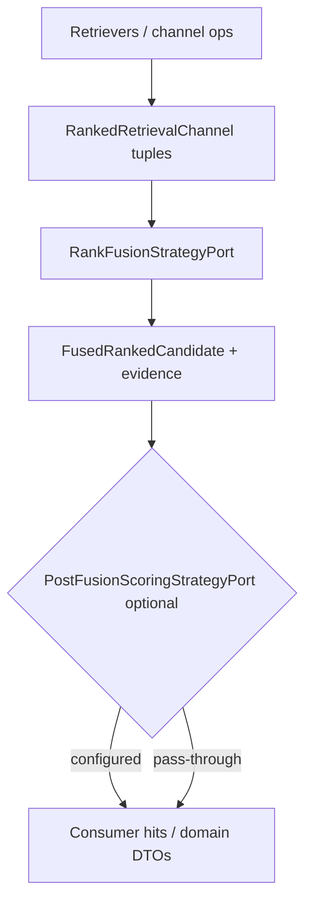

# ADR-RAG-002: Canonical rank fusion semantics (P1C-D1)

| Field | Value |
|-------|-------|
| **Status** | Accepted (design) |
| **Date** | 2026-09-15 |
| **Deciders** | Platform RAG / VPI platform evolution |
| **Related** | [ADR-RAG-001](../2026-09-13/ADR-RAG-001.md) · [`multichannel_retrieval_coordination.md`](../../platform/multichannel_retrieval_coordination.md) · commit `3bf79bbba79b287a1ca96afc98e1d05dfc27b4bf` (P1C initial) |

## Context

P1C introduced `intergrax.rag.retrieval.fusion` (`RankFusionStrategyPort`, `ReciprocalRankFusionStrategy`, `reciprocal_rank_fusion`, `FusionRetriever` wiring). Independent audit of that consolidation returned **FAIL — DESIGN REQUIRED** because several public surfaces encode **conflicting semantics** (rank authority, duplicate handling, score-space mixing, default strategy ownership).

This ADR is **design-only** (task **VPI-PLATFORM-EVOLUTION-P1C-D1**). Implementation is **P1C-R1**, blocked until this document is accepted.

Scenario 3 (Product Identification) requires genuine multi-channel retrieval (exact, lexical, structured, vector) → ranked channels → **deterministic fusion** → optional further scoring → governance. The platform must expose **contracts**, not concrete strategy classes, at composition boundaries.

### Existing state (as-built at P1C)

| Surface | Role | Notes |
| --- | --- | --- |
| `RankFusionStrategyPort` / `ReciprocalRankFusionStrategy` | Platform canonical typed fusion | Uses `candidate.rank`; tie-break: fusion_score ↓, best_channel_rank ↑, candidate_id ↑ |
| `reciprocal_rank_fusion()` | Doc-id list primitive | Uses **list index** as rank; duplicate id in one list → **best-rank dedupe** |
| `reciprocal_rank_contribution()` | Shared math term | Public stable primitive |
| `FusionRetriever` | Multi-retriever consumer | Default-instantiates `ReciprocalRankFusionStrategy`; exposes `rrf_k` on retriever |
| `LexicalHybridSupport.query_hybrid` | Dense + BM25 in vector store mixin | RRF via primitive, then **alpha blend** of dense `similarity_score` and `rrf_score` |
| VPI `OfferCandidateFusionStrategy` | Domain offer-grain fusion | Fail-fast duplicates; tie-break includes `supporting_channel_count`; uses platform math import target |
| Qdrant `Fusion.RRF` | Vendor-native hybrid | Adapter capability; not rewritten in P1C |
| `RRFReranker` | Reranker stage | 1-based rank semantics on reranker candidates; **out of scope** for P1C-D1 |

### Hard boundaries (unchanged)

```text
platform contracts
  → retrieval / fusion mechanisms
  → composition / factory
  → adapters / vendors / scenarios
```

Fusion **must not** perform retrieval, **must not** own governance, and **must not** embed scenario-specific math in Tier-0 core.

```text
rank fusion  ≠  reranking  ≠  post-fusion scoring
```

---

## Decision summary

| Topic | Decision |
| --- | --- |
| Rank authority | **Model C** — fusion math uses zero-based **list index**; `candidate.rank` must equal that index (contract validation) |
| Duplicate candidate in one channel | **Fail-fast** (`RankFusionContractError`) — single canonical semantics for strategy and primitive |
| `reciprocal_rank_fusion()` role | **Internal helper** of `ReciprocalRankFusionStrategy` (and transitional LexicalHybrid); **not** a consumer-facing API |
| Lexical hybrid path | **Model B** — RRF via `RankFusionStrategyPort`, then **`PostFusionScoringStrategyPort`** for alpha / score blending (legacy behavior isolated) |
| Default fusion strategy selection | **Composition / bootstrap factory** — not inside `FusionRetriever` |
| `rrf_k` ownership | **`RankFusionConfiguration` on concrete strategy** — not on `FusionRetriever` |
| Payload mismatch (same `candidate_id`) | **Contract violation** (fail-fast) |
| Duplicate `channel_key` in one fuse call | **Contract violation** (fail-fast) |
| VPI offer fusion | **Domain strategy (A)** — keeps `OfferCandidateFusionPort`; shares **`reciprocal_rank_contribution`** only; no forced `RankFusionStrategyPort` adapter |
| Vendor-native RRF | Stays in vendor adapter; platform maps results to retrieval contracts; equivalence owned by adapter |
| `RRFReranker` | Unchanged; follow-up **RRF-RERANKER-SEMANTICS-D1** if needed |

---

## Decision — rank authority (Model C)

**Chosen: Model C** — tuple order defines the rank used in fusion; `RankedRetrievalCandidate.rank` is **not** an independent upstream rank carrier at the fusion boundary.

**Rules:**

1. For each `RankedRetrievalChannel`, fusion uses rank `r = 0 .. len(candidates)-1` in **tuple iteration order**.
2. Before fusion math, strategy **validates** `candidate.rank == r` for each position; mismatch → `RankFusionContractError`.
3. Callers that filter or truncate lists **must renumber** (contiguous from 0) before calling `fuse()`. Preserving sparse upstream ranks is **not** a platform fusion concern; it belongs to channel assembly / coordinator policy upstream.
4. `RankFusionChannelEvidence.channel_rank` records the validated rank used in the formula.

**Rejected:**

- **Model A (order-only, drop `rank`)** — correct semantics but unnecessary breaking churn before P1C-R1; field remains for evidence echo and migration.
- **Model B (explicit rank authoritative, order ignored)** — enables silent divergence (already observed between primitive index vs strategy field).

---

## Decision — duplicate semantics

**Chosen: fail-fast (Option A).**

Duplicate `candidate_id` within the same `channel_key` in one `fuse()` call is a **contract violation**.

**Primitive alignment:** `reciprocal_rank_fusion()` must stop deduping duplicates and raise the same contract error (or delegate to strategy-only path and become non-public).

**Rejected:** best-rank dedupe (Option B) — masks upstream list construction bugs; conflicts with VPI offer fusion and existing strategy tests.

**Rejected:** configurable dedupe policy (Option C) — no product use-case requiring divergent policies.

---

## Decision — primitive vs strategy

| API | Role after P1C-R1 |
| --- | --- |
| `reciprocal_rank_contribution(rank, rrf_k)` | **Public** math primitive (stable, vendor-neutral) |
| `reciprocal_rank_fusion(...)` | **Internal** — implementation detail of `ReciprocalRankFusionStrategy`; same semantics as strategy (rank Model C, fail-fast duplicates, canonical tie-break) |
| `ReciprocalRankFusionStrategy` | **Public** default platform implementation of `RankFusionStrategyPort` |
| `RankFusionStrategyPort` | **Public** consumer boundary |

**Tie-break (platform RRF):** part of strategy semantics — `reciprocal-rank-fusion.v1` ordering key:

```text
fusion_score DESC
→ best_channel_rank ASC
→ candidate_id ASC
```

Domain strategies (e.g. VPI offer fusion) **may** define different tie-break keys under their own ports; they must not silently claim to be `reciprocal-rank-fusion.v1`.

---

## Decision — lexical hybrid (Model B)

**Chosen: Model B — fusion then optional post-fusion scoring.**

`LexicalHybridSupport.query_hybrid` today:

```text
dense ranked ids + lexical ranked ids
  → reciprocal_rank_fusion
  → alpha * dense_similarity + (1-alpha) * rrf_score   ← incompatible score spaces
```

**Target:**

```text
dense hits + lexical hits
  → assemble RankedRetrievalChannel[VectorStoreHit] (2 channels)
  → RankFusionStrategyPort (default RRF from composition)
  → FusedRankedCandidate list (fusion_score + fused_rank)
  → PostFusionScoringStrategyPort (optional; LexicalHybrid legacy = explicit strategy)
  → VectorStoreHit list for caller
```

**New port (design sketch):**

```python
class PostFusionScoringStrategyPort(Protocol[TPayload]):
    @property
    def strategy_id(self) -> str: ...

    def score(
        self,
        fused: RankFusionResult[TPayload],
        *,
        channel_context: ...,  # strategy-specific typed context, not Any
        limit: int | None = None,
    ) -> RankFusionResult[TPayload] | tuple[...]: ...
```

P1C-R1 defines concrete DTOs; D1 fixes **separation of concerns** only.

**Lexical hybrid comparison (mandated)**

| Criterion | A — pure RRF | B — RRF + post-fusion | C — specialized hybrid only |
| --- | --- | --- | --- |
| Correctness | High (rank-only) | High if post-fusion documented | Medium (hides fusion) |
| Explainability | Best | Good (two named stages) | Poor (opaque mixin) |
| Pluginability | Best | Best | Poor (mixin lock-in) |
| Backward compat | **Behavior change** vs today | Preserves alpha via legacy post-fusion strategy | Preserves today but wrong architecture |
| Score comparability | N/A (rank order) | Requires normalized post-fusion contract | Currently **invalid** mix |
| Scenario 3 usefulness | Aligns with N-channel fusion | Same + explicit rerank hook | Blocks platform reuse |
| Vendor neutrality | Yes | Yes | No (mixin on store) |
| Maintenance | Lowest | Medium (two ports) | Highest |

**Single recommendation:** **Model B.** Pure RRF ordering remains available by injecting a **pass-through** post-fusion strategy (final order = fusion order). Alpha blend moves to **`legacy_alpha_dense_rrf.v1`** (or successor) with **mandatory regression benchmark** — not silent mixin math.

---

## Decision — composition ownership

1. **`FusionRetriever` must require `fusion_strategy: RankFusionStrategyPort`** — no `None` default inside the retriever class.
2. **Default RRF** is constructed in **`retriever_bootstrap` / composition factory** (same layer that registers `FusionRetriever` today).
3. **Remove `rrf_k` from `FusionRetriever.__init__`** — configure via `ReciprocalRankFusionStrategy(configuration=RankFusionConfiguration(...))` at bootstrap.
4. **No** global fusion service locator or string-based strategy discovery.

**Scenario 3 alignment:**

```text
composition factory
  → RankFusionStrategyPort (RRF or replacement)
  → FusionRetriever / application fusion service
  → optional PostFusionScoringStrategyPort
  → scenario policy & governance
```

Consumers depend on **`RankFusionStrategyPort`**, never `ReciprocalRankFusionStrategy()` at call sites outside factories.

---

## Decision — payload and channel identity

**Candidate identity:** fusion aggregates **only** by `candidate_id` (stable platform identity). Never by payload equality, object identity, or raw retrieval score.

**Payload consistency:** if the same `candidate_id` appears in multiple channels with **non-equal** payloads (per strategy-defined equality on `TPayload`), `fuse()` → **`RankFusionContractError`**. Equal payloads: any channel’s payload may be retained; strategy documents **first channel in input tuple order** wins for deterministic replay.

**Channel uniqueness:** duplicate `channel_key` within one `fuse()` input → **`RankFusionContractError`**. Evidence maps must not overwrite silently.

**Empty semantics:** `channels=()` → empty result; all channels empty → empty result; **no exception**.

**Limit:** `limit` applies to **final fused output count** only; does not alter per-channel retrieval or full fusion score computation before truncation (truncate after sort).

**Determinism:** sort keys and channel iteration order only — no reliance on dict/set iteration order or vendor ordering.

---

## Decision — VPI offer-level fusion

**Chosen: A — domain-level `OfferCandidateFusionStrategy` (plugin), sharing platform math primitive only.**

Mapping every offer to `RankedRetrievalCandidate` / `RankFusionStrategyPort` would lose or complicate `SourceRecordRef`, channel enum provenance, and VPI-specific tie-break (`supporting_channel_count`, `source_ref_sort_key`). VPI remains on **`OfferCandidateFusionPort`** with **`reciprocal_rank_contribution`** imported from platform fusion module.

P1C-R1 may dedupe VPI-local duplicate math; D1 does **not** mandate port adapter migration.

---

## Decision — vendor-native RRF (Qdrant)

Use vendor-native fusion **inside integration adapters** when the backend executes hybrid retrieval. Adapter **must** map hits to platform retrieval DTOs (`VectorStoreHit`, ranks, ids). **Semantic equivalence** to platform RRF is the **adapter owner’s** responsibility; formal equivalence checklist is follow-up only if operators require bit-identical fusion across native vs platform paths.

---

## Target architecture



When post-fusion is not used (default multi-retriever fusion path), diagram collapses to retrievers → channels → `RankFusionStrategyPort` → consumer.

---

## Ownership matrix

| Concern | Owner |
| --- | --- |
| Retrieval | Retriever / channel operation |
| Channel ordering within list | Retriever / coordinator assembling channel |
| Fusion math | Concrete `RankFusionStrategyPort` |
| Fusion config (`rrf_k`, etc.) | Concrete strategy configuration |
| Strategy selection | Composition / bootstrap factory |
| Post-fusion scoring | `PostFusionScoringStrategyPort` if configured |
| Domain provenance | Domain adapter / domain fusion strategy (VPI) |
| Governance bounds | Future governance (follow-up) |
| Vendor-native fusion | Vendor adapter |

---

## Contract matrix

| Contract | Responsibility | Pluginable |
| --- | --- | --- |
| `RankFusionStrategyPort` | Rank-based fusion | YES |
| `RankedRetrievalChannel` | Input channel | n/a |
| `RankedRetrievalCandidate` | Ranked input row | n/a |
| `RankFusionResult` / `FusedRankedCandidate` | Fusion output | n/a |
| `PostFusionScoringStrategyPort` | Order/score after fusion | YES (LexicalHybrid legacy) |

---

## Semantics matrix

| Concern | Platform RRF | Lexical hybrid (target) | VPI offer fusion | RRFReranker |
| --- | --- | --- | --- | --- |
| Rank base | 0-based validated index (Model C) | Same via port | 0-based explicit on `ProductCandidate` | 1-based reranker positions |
| Identity | `candidate_id` | `VectorStoreHit.id` | `SourceRecordRef` | Reranker candidate object id |
| Score formula | Σ 1/(k+r+1) | Fusion: same; post-fusion: separate strategy | Same RRF term | RRF on reranker lists |
| Tie-break | score, best rank, id | Fusion: platform; post-fusion: strategy-specific | score, channel count, best rank, source key | reranker-specific |
| Duplicates / channel | Fail-fast | Fail-fast | Fail-fast | validate at reranker layer |
| Payload / provenance | Evidence tuple | Hit payload; mismatch fail-fast | Offer evidence channels | N/A |
| Owner | Platform strategy | Store composition + ports | VPI plugin | Reranker pipeline |

---

## Design compatibility / behavior change

| Area | P1C-R1 expectation |
| --- | --- |
| LexicalHybrid ordering | **Likely change** when alpha moves to explicit post-fusion strategy or when switching to pure RRF — requires **regression benchmark + golden vectors** |
| Primitive duplicate handling | **Breaking** for callers relying on dedupe — intentional |
| FusionRetriever defaults | **Behavior-neutral** if bootstrap injects same RRF config as today |

---

## P1C-R1 test plan (mandatory)

| Test | Intent |
| --- | --- |
| Rank authority invariant | Mismatch `rank` vs index → contract error |
| Duplicate candidate in channel | Fail-fast strategy + aligned primitive |
| Duplicate `channel_key` | Contract error |
| Payload mismatch | Contract error across channels |
| Deterministic tie | Equal fusion scores → tie-break order stable |
| Custom strategy injection | `FusionRetriever` uses injected port |
| No concrete default in consumer | Architecture gate: no `ReciprocalRankFusionStrategy()` in retriever module default path |
| Lexical hybrid | Two-stage fusion + post-fusion; legacy equivalence or documented delta |
| Bootstrap factory | Default RRF wired only in composition |

---

## P1C-R1 architecture gates

- No `ReciprocalRankFusionStrategy()` instantiation inside `FusionRetriever` (factory/bootstrap only).
- No direct `reciprocal_rank_fusion()` in Tier-2+ consumers if primitive is internal (LexicalHybrid uses strategy or shared internal module).
- No vendor / scenario imports in platform fusion core.
- No `Any` on new fusion / post-fusion port boundaries.

---

## Observability (minimal)

Fusion implementations should expose for diagnostics (no new telemetry layer in D1): `strategy_id`, input channel count, input candidate count, fused output count, configuration identity snapshot when available.

---

## Follow-ups

| ID | Topic |
| --- | --- |
| RRF-RERANKER-SEMANTICS-D1 | Align 1-based reranker RRF with platform rank contract |
| Vendor-native equivalence | Optional checklist for Qdrant `Fusion.RRF` vs platform RRF |
| Governance fusion allowlist | Allowed strategies / config bounds at execution boundary |

---

## Consequences

### Positive

- Single canonical semantics for audit closure.
- Clear split: fusion vs post-fusion vs reranking vs domain fusion.
- Scenario 3 can compose N channels without importing concrete RRF class.

### Negative

- P1C-R1 is a deliberate correction pass (not a hotfix).
- LexicalHybrid may need benchmark-backed migration.

## Compliance

- Tier boundaries preserved — no scenario imports in platform fusion; VPI stays domain plugin.
- [`multichannel_retrieval_coordination.md`](../../platform/multichannel_retrieval_coordination.md) updated as hub pointer.
- Implementation deferred to **P1C-R1**.

## Implementation notes

- Blocked until operator accepts this ADR.
- Verification: `python scripts/maintenance/check_harness_adr.py` after index update.
