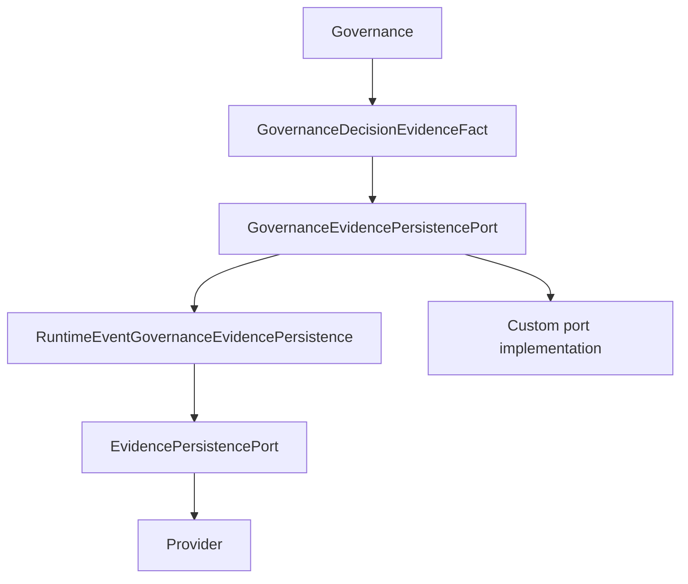

# ADR-GR-8-001 — Canonical Governance Evidence Public Contract and Persistence Boundary

| Field | Value |
| ----- | ----- |
| **Status** | Accepted |
| **Date** | 2026-09-17 |
| **Deciders** | Governance / Evidence architecture |
| **Related** | [`GOVERNED_EXECUTION.md`](../../../../architecture/GOVERNED_EXECUTION.md) · GR-8 spine qualification |

---

## Context

GR-8-R1 delivered a typed Governance Evidence spine. Independent GitHub audit confirmed **technical implementation PASS** but blocked formal GR-8 closure until an explicit **public contract freeze** exists.

Platform principle: **the platform operates on contracts, not implementations.**

## Problem

Public Governance Evidence API exists without a dedicated ADR that freezes contract shape, versioning, non-authoritative persistence, correlation rules, and honest GR-8 scope.

## Decision

**Accept and freeze** existing contracts in `intergrax/contracts/governed_execution_governance_evidence.py` and persistence boundary in `intergrax/runtime/governance/governance_evidence_*.py` **without runtime semantic changes.**

GR-8 after this ADR: **CANDIDATE CLOSED — PUBLIC CONTRACT FROZEN** (independent final audit before **CLOSED**).

## Public contracts

| Contract | Frozen? | Breaking-change rule |
| -------- | ------: | -------------------- |
| `GovernanceDecisionEvidenceFact` | Yes | New schema version for breaking changes |
| `GovernanceEvidencePersistenceOutcome` | Yes | Additive optional fields only |
| `GovernanceEvidencePersistencePort` | Yes | Must never return policy authority |
| `GovernedExecutionEvaluationPoint` | Yes | Additive enum values; semantic change → ADR/schema |
| `SCHEMA_GOVERNED_EXECUTION_GOVERNANCE_DECISION_FACT_V1` | Yes | Do not redefine V1 |
| `build_governance_fact_from_policy_decision` | Yes | Additive-only without version policy |
| `governance_evidence_id_from_idempotency` | Yes | Stable identity semantic |
| `deterministic_runtime_event_id_for_governance_fact` | Yes | Adapter implementation helper |

## Ownership

- `PolicyDecision` = authoritative Governance result.
- `GovernanceDecisionEvidenceFact` = immutable projection (append-oriented, provider-neutral, **non-authoritative**).
- Evidence must not ALLOW/DENY/REQUIRE_HUMAN, resume execution, or retry providers.

## Persistence boundary

- `RuntimeEventGovernanceEvidencePersistence` = **default adapter**, not mandatory concrete type.
- No Governance → DB / concrete `RuntimeEventStore` as platform contract.

`GovernanceEvidencePersistencePort.persist(fact) -> GovernanceEvidencePersistenceOutcome` is the canonical plugin boundary.

**Port MUST NOT** return `PolicyDecision`, return `PolicyAction` as authorization, or mutate Governance decisions.

Outcome fields: `persisted`, `evidence_id`, `error_code` — acknowledgment only.

## Failure semantics

Persistence failure does not modify an already-made Governance decision (ALLOW/DENY/REQUIRE_HUMAN/ESCALATE unchanged).

This ADR does **not** freeze global ordering “evidence before every side effect” unless another SSOT defines it.

## GR-8-001-AMENDMENT-ESCALATE (2026-09-21) — V1 additive PolicyAction.ESCALATE

**Classification:** additive-compatible evolution of governed_execution_governance_decision_fact.v1 (no new schema version).

**Rationale:** GovernanceDecisionEvidenceFact.decision is typed as PolicyAction without enumerating a closed subset in the V1 schema shape. Recording ESCALATE does not add/remove required fields, alter persistence port semantics, or grant authority. MODIFY remains excluded from automatic canonical fact projection unless a future ADR defines semantics.

**Canonical fact decisions (V1):** ALLOW, DENY, REQUIRE_HUMAN, ESCALATE.

**Non-authority:** Evidence including ESCALATE MUST NOT authorize execution, resume, or convert ESCALATE to ALLOW/REQUIRE_HUMAN.

**Persistence failure:** When Governance already decided ESCALATE, persistence failure leaves ESCALATE unchanged (same non-authoritative rule as ALLOW/DENY/REQUIRE_HUMAN).

**Emission:** Root execution admission and meaningful side effect (MSE) orchestration paths MAY emit ESCALATE facts when policy evaluation returns ESCALATE.

**Human review correlation:** human_review_evidence_ref on fresh ALLOW remains correlation-only (grant provenance), never permission.

## Schema / versioning

- V1: `governed_execution_governance_decision_fact.v1`
- Breaking change → new schema version; V1 meaning preserved for backward compatibility.

Policy provenance: `policy_bundle_id`, `policy_bundle_version`, `policy_bundle_digest`, `policy_rule_id` — partial bundle identity invalid.

`DecisionGovernanceMaterialRef | None` = reference only. `human_review_evidence_ref` = correlation only. `request_digest` = `sha256:` provenance.

`idempotency_key` → deterministic `evidence_id` (stable identity semantic; hash algorithm is implementation detail unless superseded).

## Correlation

Always required on fact: `tenant_id`, `workspace_id`, `principal_id`.

Optional on fact: `task_id`, `run_id`, `attempt_id`, `execution_id` — governance fact may exist before full Execution identity.

`RuntimeEventGovernanceEvidencePersistence` requires full four-ID correlation; otherwise `GovernanceEvidenceIncompleteCorrelation`.

**Forbidden:** minting fake execution IDs for durable adapter convenience.

`RootExecutionAuthorityAdmissionRequest` optional execution IDs: backward compatible; canonical production paths **SHOULD** supply full correlation when durable evidence is required.

Contract evolution: additive optional field → compatible; required field or semantic change → breaking / version decision.

## Evaluation point taxonomy

Canonical for evidence facts: `GovernedExecutionEvaluationPoint`. Taxonomy completeness ≠ runtime adoption completeness.

`GovernanceEvaluationPoint` (control-plane **request** contracts, GR-12) is not a competing evidence taxonomy; evidence uses `GovernedExecutionEvaluationPoint.CONTROL_PLANE_MUTATION` when wired under GR-12+.

## GR-8 scope freeze

GR-8 = Governance Evidence **SPINE** (typed fact, port, default adapter, root + MSE emission, durability proof, this freeze).

Excluded adoption: AGENT_DECISION, INTERRUPT, PRE_MODEL, TOOL_*, PRE_OUTPUT, POST_RUN, fresh post-human re-evaluation → **GR-10 / GR-13**. CONTROL_PLANE_MUTATION enforcement → **GR-12**.

**Scope honesty:** infrastructure frozen; **runtime adoption remains partial** outside root + MSE. Do not claim full Governance evidence coverage.

## Rejected alternatives

- Governance persists RuntimeEvent or DB directly
- Evidence returns `PolicyDecision`
- Global mutable Evidence registry / service locator (`get_global` persistence lookup)
- `audit_payload` as canonical evidence
- GR-7 reliability fact as governance evidence
- Governance core imports `InMemoryRuntimeEventStore`, SQL, Kafka producers

## Consequences

Auditors and regression gates anchor on this ADR; GR-10/12/13 still required for coverage claims.

## Migration / compatibility

No runtime migration. `RootExecutionAuthorityAdmissionRequest` callers without execution IDs remain valid.

## Qualification evidence

`test_gr8_governance_evidence_spine.py`, `test_gr8_governance_evidence_architecture_gates.py`, `test_gr8_adr1_governance_evidence_contract_freeze.py`

## Scope exclusions

GR-10, GR-11, GR-12, GR-13, GOVERNANCE-FINAL enterprise certification unchanged; historical **GOVERNANCE-FINAL = NOT CERTIFIED** preserved.

## Compliance

Tier boundaries preserved; architecture/plan/gap ledger link to this ADR.
