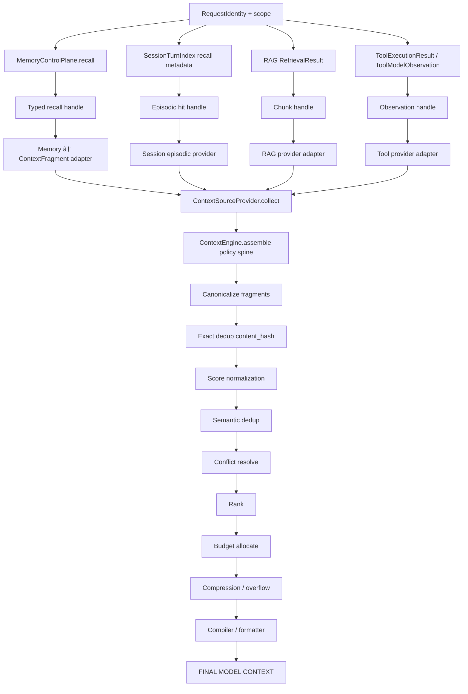
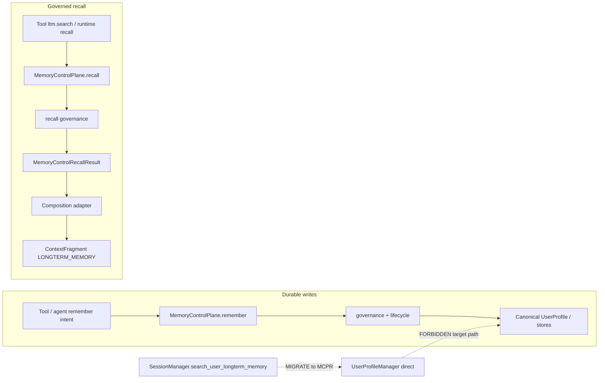
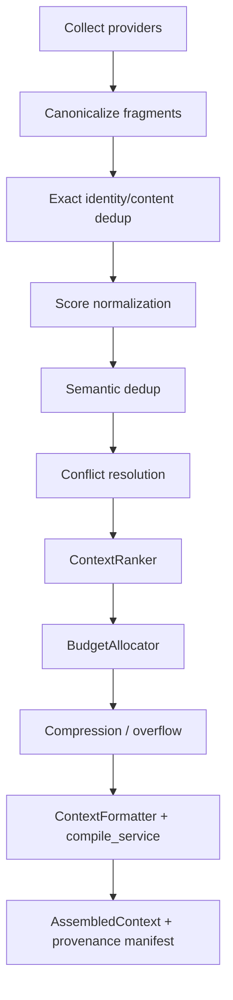

# ADR-MEM-XINT-002: Unified Information & Context Authority (Memory × CE × RAG × Tools)

| Field | Value |
|-------|-------|
| **Status** | Accepted (architecture) |
| **Date** | 2026-09-17 |
| **Deciders** | Platform / Memory × Context integration |
| **Related** | [`MEMORY_ARCHITECTURE.md`](../../../../architecture/MEMORY_ARCHITECTURE.md) · [`CONTEXT_ENGINEERING.md`](../../../../architecture/CONTEXT_ENGINEERING.md) · [`ADR-UCL-001`](../../2026-08-01/ADR-UCL-001.md) · MEM-XINT-1 audit (HEAD `60ba65bb86e5a74a821f90c8d6a2881e5ea2c83e`) · Memory baseline `4e92d14c58f02200518786c59c9128b3068e4bc5` |

## Context

MEM-XINT-1 confirmed cross-layer ownership gaps:

| ID | Finding |
|----|---------|
| MXINT-01 | Runtime recall bypasses `MemoryControlPlane.recall` via `SessionManager.search_user_longterm_memory` → `UserProfileManager.search_longterm_memory` |
| MXINT-02 | `ltm.write_fact` / `ltm.search` fall back to direct `UserProfileManager` when the control plane is absent |
| MXINT-03 | Parallel pipelines: CE `ContextEngine.assemble` **and** legacy `ChatMessage` injection (`insert_context_before_last_user`, prompt builders) |
| MXINT-04…09 | Duplicate LTM injection, missing cross-source conflict policy, missing score normalization, weak legacy provenance, SessionTurnIndex E2E gaps, `ltm.search` keyword fallback |

Enterprise Memory (MEM-ENT-1…16) established **`MemoryControlPlane`** as the semantic mutation/recall boundary for durable user memory. Context Engineering (CE) already owns **`ContextEngine.assemble`** as the composition gate on graph/UAEP paths, but Nexus tool loops still inject RAG/LTM/tool traces outside that gate.

This ADR defines the **target authority model** and **migration boundaries**. It does **not** implement enforcement (MXINT-3…6).

## Problem

Without a single durable-memory authority and a single final-context authority:

- Governance diverges (plane vs manager vs prompt builder).
- Token budget is split (CE compiler vs legacy injected messages).
- Provenance cannot answer “which Memory entry / RAG chunk / tool output reached the model?�
- Cross-source conflicts (e.g. Memory says Warsaw, live tool says Kraków) have no deterministic policy stage.

## Current state (code-aligned snapshot)

**Memory read (MXINT-01):** `populate_request_memory_recall_metadata` and `run_longterm_memory_context` call `SessionManager.search_user_longterm_memory`, not `MemoryControlPlane.recall`. CE consumes LTM via handles (`LTM_ENTRIES_HANDLE` / metadata keys) populated from that path.

**Memory write (MXINT-02):** `intergrax/tools/providers/ltm/service.py` uses the plane when wired; otherwise `manager.add_memory_entry` / `search_longterm_memory` / keyword scan.

**Context (MXINT-03):** `DefaultNexusContextEngine.assemble` collects providers, hash-dedups, ranks, compiles budget. In parallel, `memory_context_invocation.run_longterm_memory_context`, `plan_context_invocation` (RAG), and `catalog_context` / `inject_tool_traces_system_context` inject `ChatMessage` blocks directly.

**Session episodic:** `SessionSemanticRecallProvider` reads `session_vector_hits` handles filled by `SessionManager.search_session_semantic_recall` (SessionTurnIndex store). Session **turn log** authority remains `SessionStorage` behind `SessionManager`.

### Diagram 1 — Current split architecture

```mermaid
flowchart TB
    subgraph Runtime["Nexus runtime"]
        RR[RuntimeRequest / RuntimeState]
        SM[SessionManager]
        UPM[UserProfileManager.search_longterm_memory]
        POP[populate_request_memory_recall_metadata]
        LEG[run_longterm_memory_context + prompt builders]
        INS[insert_context_before_last_user]
        RAGB[rag_prompt_builder]
        TOOL[inject_tool_traces_system_context]
    end
    subgraph CE["Context Engineering"]
        CEgate[ContextEngine.assemble]
        PROV[builtin.* providers + legacy_bridge handles]
        COMP[ContextCompiler budget]
    end
    subgraph Mem["Memory domain"]
        MCP[MemoryControlPlane recall/remember]
    end
    RR --> POP
    POP --> SM --> UPM
    RR --> LEG --> SM
    LEG --> INS
    RR --> RAGB --> INS
    RR --> TOOL
    POP --> PROV
    PROV --> CEgate --> COMP
    LEG -.->|duplicate LTM| INS
    MCP -.->|ltm.tools when wired| Tools
    MCP -.x bypassed on runtime recall| SM
```

## Decision

### Formal ownership answers

| Question | Owner |
|----------|--------|
| Who owns **final model context**? | **Context Engineering** — `ContextEngine.assemble` → `AssembledContext.messages` (single composition gate after migration) |
| Who is **semantic authority for durable user memory**? | **`MemoryControlPlane`** (`remember` / `recall` / governed lifecycle) |
| Who owns **recall governance** for user durable memory? | **`MemoryControlPlane`** (before any CE fragment emission) |
| Can runtime fetch canonical LTM via manager directly? | **NO** (target). Only typed Memory capability / control plane contract |
| Who owns **token budget** for model-facing context? | **Context Engineering** (`ContextBudgetSnapshot`, `ContextCompiler`, unified accounting) |
| Who owns **cross-source conflict resolution**? | **Context Engineering** — pluggable **`ContextConflictResolver`** stage (MXINT-5); must not mutate Memory |
| Who owns **cross-source score normalization**? | **Context Engineering** — pluggable **`ContextScoreNormalizer`** (MXINT-5) |
| Where do **adapters** live? | **Application / runtime composition** (`intergrax/runtime/nexus/context/*`, `intergrax/applications/_shared/*`) — bridge typed domain results → `ContextFragment`, not CE → concrete stores |

**No god object:** reject `UnifiedInformationManager`, `SuperContextMemoryService`, or monolithic knowledge services.

**CE is not storage:** CE must not write UserProfile, RAG stores, tool state, or canonical session logs.

**Memory is not a compiler:** recall returns **`MemoryControlRecallResult`** (typed items), not `ChatMessage` or prompt blocks.

**RAG is not Memory:** retrieval yields evidence; durable memory only via explicit `remember`.

**Tool output is ephemeral** until an explicit `remember` path.

### Diagram 2 — Target information flow



### Diagram 3 — Memory read/write authority



### Canonical ownership table

| Concern | Canonical owner | Replaceable contract | Forbidden bypass |
|--------|-----------------|----------------------|------------------|
| Durable memory write | `MemoryControlPlane.remember` | Memory capability / projection plugins | `UserProfileManager.add_memory_entry` from tools/runtime fallback |
| Memory recall | `MemoryControlPlane.recall` | Recall strategies behind plane | `SessionManager.search_user_longterm_memory` as semantic boundary |
| Session episodic recall | SessionTurnIndex + plane-adjacent metadata APIs | Index store / recall metadata builders | Treating index as canonical session history |
| Session history (turn log) | `SessionStorage` via `SessionManager` | Storage backends | CE mutating session store |
| RAG retrieval | RAG integration / retrieval service | Rank fusion, retrievers | `rag_prompt_builder` → direct model messages (target) |
| Tool execution | Tool runtime + governance | Tool catalog | Tool output → durable memory without `remember` |
| Final context assembly | `ContextEngine.assemble` | Engine id, provider registry | Parallel legacy `insert_context_before_last_user` for same sources |
| Token budget | CE `ContextCompiler` + budget policy | `ContextBudgetAllocator`, UCL artifacts | Legacy injected tokens outside CE accounting |
| Cross-source conflict | CE pipeline stage | `ContextConflictResolver` (MXINT-5) | Ad-hoc merge in prompt builders |
| Score normalization | CE pipeline stage | `ContextScoreNormalizer` (MXINT-5) | Raw vector score == memory score assumptions |

### Data flow table

| Source | Source contract | Governance before CE | CE adapter/provider | Final authority |
|--------|-----------------|----------------------|---------------------|-----------------|
| User LTM | `MemoryControlRecallResult` | Plane recall governance | `builtin.longterm_memory` (+ composition adapter from plane output) | CE assembly |
| Session turns | `SessionStorage` messages / revision | Session scope | `builtin.session_history` | CE assembly |
| SessionTurnIndex | Recall metadata rows | Index scope + identity | `SessionSemanticRecallProvider` | CE assembly |
| RAG | `RetrievalResult` / chunk records | RAG scope/disclosure | `builtin.rag` / `fragments_from_rag_chunks` | CE assembly |
| Tools | `ToolExecutionResult`, `IterativeToolOutputBlock` | Tool governance + untrusted boundary | `builtin.tool_output` | CE assembly |
| System instructions | Policy / harness | Policy gate | `builtin.system_instructions` | CE assembly |

### Mutation flow table

| Mutation | Allowed boundary | Forbidden boundary |
|----------|------------------|-------------------|
| Remember user fact | `MemoryControlPlane.remember` | CE, RAG indexer, tool handler → profile store |
| Forget / supersede | Plane lifecycle APIs | Direct store delete from CE |
| Session turn append | `SessionManager` / `SessionStorage` | CE |
| RAG index update | RAG pipeline | Automatic from tool output |
| Tool state | Tool runtime | Memory plane without explicit remember |

### Diagram 4 — Cross-source policy pipeline (normative CE inner pipeline)



**Ordering invariant (normative, single canonical sequence):** collect → canonicalize → exact identity/content dedup → score normalization → semantic dedup → conflict resolution → ranking → budget allocation → compression/overflow → compile. No alternate conceptual ordering.

**Deterministic** tie-break after normalization: `normalized_relevance_score`, `authority_class` policy weight, `source_priority`, `freshness_score`, `confidence_score`, `source_id`, `fragment_id`.

**Raw vs normalized scores:** provider/domain adapters set `raw_relevance_signal` (and existing `freshness_score` / `confidence_score` where applicable). The **Score normalization** stage writes `normalized_relevance_score` and updates ranking input; raw signals are retained on the fragment contract and are not dropped into unbounded metadata as the canonical store.

### Diagram 5 — Migration phases


Each phase: reversible flags, working runtime, **no permanent dual-path**; removal condition documented per flag.

### MXINT-01/02/03 — current vs target vs migration

**MXINT-01**

| | Flow |
|---|------|
| CURRENT | Runtime → `SessionManager.search_user_longterm_memory` → `UserProfileManager.search_longterm_memory` → metadata handles + legacy injection |
| TARGET | Runtime/tool → `MemoryControlPlane.recall` → `MemoryControlRecallResult` → composition adapter → `ContextProviderSourceInputs.memory` → `builtin.longterm_memory` → CE only |
| MIGRATION | MXINT-3: rewire `populate_request_memory_recall_metadata` / deprecate semantic gateway on `SessionManager`; thin adapter keeps API surface if needed |

**MXINT-02**

| | Flow |
|---|------|
| CURRENT | `ltm.write_fact` / `ltm.search` → plane **or** manager/keyword fallback |
| TARGET | Tools require plane + `RequestIdentity`; fail closed if missing |
| MIGRATION | MXINT-3: remove fallback branches; host wiring must inject plane |

**MXINT-03**

| | Flow |
|---|------|
| CURRENT | CE assemble **+** `user_longterm_memory_prompt_builder`, `rag_prompt_builder`, `insert_context_before_last_user`, tool system injection |
| TARGET | All sources → handles/fragments → **`ContextEngine.assemble` only** |
| MIGRATION | MXINT-4: feature-flag legacy injection off; route RAG/LTM/tool traces through providers; unified budget |

### Legacy path classification

| Path | State | Action | Migration target |
|------|-------|--------|------------------|
| `MemoryControlPlane.recall/remember` | ACTIVE | KEEP | Canonical |
| `ContextEngine.assemble` | ACTIVE | KEEP | Single gate |
| `ContextSourceProvider` + `ContextPluginRegistry` | ACTIVE | KEEP | Pluggable providers |
| `legacy_bridge` handle adapters | ACTIVE | MIGRATE | Typed handles from plane/RAG/tools (not raw manager dicts) |
| `populate_request_memory_recall_metadata` | ACTIVE | MIGRATE | Plane-backed recall population |
| `SessionManager.search_user_longterm_memory` | ACTIVE | DEPRECATE (semantic) | Thin adapter → `MemoryControlPlane.recall` (internal) |
| `run_longterm_memory_context` + LTM prompt builder | ACTIVE | DEPRECATE | CE provider only |
| `DefaultRagPromptBuilder` + plan RAG inject | ACTIVE | DEPRECATE | `RAG_CHUNKS_HANDLE` → CE |
| `insert_context_before_last_user` | ACTIVE | DEPRECATE | CE formatter output |
| `inject_tool_traces_system_context` | ACTIVE | MIGRATE | CE tool channel policy; untrusted by default |
| `ltm.search` / `ltm.write_fact` manager fallback | ACTIVE | REMOVE (target) | Plane required |
| `_keyword_hits` in ltm.search | ACTIVE | REMOVE | Plane recall only |
| `tools/providers/memory/service.py` manager search | ACTIVE | MIGRATE | Plane recall |

Deprecation states: **ACTIVE → MIGRATION (flag) → DEPRECATED → REMOVE**.

### MEM-XINT-2-R — Typed source boundary (closure)

**Formal answer:** `ContextProviderContext.handles: dict[str, Any]` is **not** the canonical cross-layer semantic transport for new enterprise paths. It remains **legacy/internal compatibility envelope** until MXINT-4/6 migration completes.

**Target transport model (minimal core evolution):**

| Layer | Contract | Role |
|-------|----------|------|
| Domain | `MemoryControlRecallResult`, RAG `RetrievalResult` / chunk records, `ToolExecutionResult` / `IterativeToolOutputBlock`, session episodic hit rows, `RequestIdentity` | Semantic authority stays in bounded domains |
| Composition (Tier-1 Nexus) | **`ContextProviderSourceInputs`** (new Tier-0 carrier) + **`ContextSourceAccess`** (new provider-facing accessor) | Typed bridge built by `intergrax/runtime/nexus/context/*`; adapters translate domain results → `ContextFragment` |
| CE collect | `ContextSourceProvider.collect(request, ctx)` | Provider receives **only** the typed slice for its `supported_sources` via `ContextSourceAccess` — not the full cross-source bag |

**`ContextProviderSourceInputs` (design — MXINT-4 implements):** frozen, runtime-only, non-serialized dataclass with optional typed slots (not a growing union god-type):

- `identity: RequestIdentity | None` — trusted scope spine (tenant / user / session / workspace refs); **not** `handles["request_identity"]` on target paths
- `memory: MemoryContextSourceInput | None` — wraps `MemoryControlRecallResult | None`
- `rag: RagContextSourceInput | None` — wraps domain `RetrievalResult` or normalized chunk tuple per RAG contract
- `tools: ToolContextSourceInput | None` — wraps `tuple[IterativeToolOutputBlock, ...]` plus tool observation contracts when wired
- `session_semantic: SessionSemanticContextSourceInput | None` — wraps typed episodic hit records (replacing ad-hoc `session_vector_hits` dict rows at the boundary)
- `legacy_handles: dict[str, Any] | None` — **compatibility only**; populated during migration from today's `ContextProviderContext.handles`

**`ContextProviderContext` (target shape):** retains `engine_id`, `plugin_ids`; adds `sources: ContextProviderSourceInputs`; keeps `handles` as deprecated alias to `legacy_handles` during migration.

**Custom / external `ContextSourceProvider` plugins:** register a **`RegisteredContextSourceDescriptor`** (source id + payload type + adapter protocol) in the plugin catalog — not string→`Any`. CE dispatches typed payload to the registered adapter; escape hatch stays typed.

**Provider isolation (hard):** `builtin.longterm_memory` sees memory slot only; `builtin.rag` sees RAG slot only; `builtin.tool_output` sees tool slot only; `SessionSemanticRecallProvider` sees session semantic slot only. Composition layer enforces segregation; providers **consume** scope and **do not establish** authority/trust.

**Removal condition for `handles`:** after all builtin providers + reference Nexus hosts read inputs via `ContextProviderSourceInputs` / `ContextSourceAccess`, legacy_bridge is MIGRATE→DEPRECATE, and **MXINT-6** certification proves no production dependency on raw handle keys for semantic data.

### MEM-XINT-2-R — Source origin vs authority

**`ContextFragmentSource` = origin/category only** (where the fragment entered CE: `LONGTERM_MEMORY`, `RAG`, `TOOL_OUTPUT`, `SESSION_HISTORY_SEMANTIC`, etc.). It does **not** imply authority, trust, or sensitivity.

**Authority classification (separate typed contract — MXINT-5 fields on `ContextFragment`):**

| `ContextAuthorityClass` (new enum) | Typical `ContextFragmentSource` | Assigned by |
|-----------------------------------|---------------------------------|-------------|
| `CANONICAL_MEMORY` | `LONGTERM_MEMORY` | Composition after `MemoryControlPlane.recall` governance |
| `DERIVED_MEMORY` | `LONGTERM_MEMORY` | Composition when recall is derived/summary path (policy-defined) |
| `RAG_EVIDENCE` | `RAG` / `WEBSEARCH` | RAG integration adapter |
| `TOOL_OBSERVATION` | `TOOL_OUTPUT` | Tool runtime adapter (untrusted by default) |
| `SESSION_EPISODIC` | `SESSION_HISTORY_SEMANTIC` | SessionTurnIndex recall adapter |
| `SYSTEM_CONTEXT` | `SYSTEM_INSTRUCTIONS` / `POLICY_OVERLAY` | Policy/harness composition only |

Providers **must not** self-elevate to `CANONICAL_MEMORY`, `SYSTEM_CONTEXT`, or privileged trust. Domain/composition assigns `authority_class`, `trust_tier`, and `sensitivity` before or during adapter emission; CE may apply inclusion policy but **cannot** reclassify RAG evidence as canonical memory.

### Normative Cross-Source Pipeline

| Stage | Owner | Hard / strategy | Replaceable implementation |
|-------|-------|-----------------|---------------------------|
| Collect | CE engine + `ContextSourceProvider` registry | Hard semantics (scoped collect) | Per-provider collect logic |
| Canonicalize | CE platform | Hard | Default normalizes ids, hashes, provider provenance attachment |
| Exact dedup | CE platform | Hard deterministic semantics | Pluggable mechanism under fixed semantics |
| Score normalization | CE policy layer | Strategy | `ContextScoreNormalizer` plugin (MXINT-5); default deterministic identity map |
| Semantic dedup | CE policy layer | Strategy | `ContextSemanticDeduper` plugin (MXINT-5); default no-op |
| Conflict resolution | CE policy layer | Strategy | `ContextConflictResolver` plugin (MXINT-5); default pass-through |
| Ranking | CE policy layer | Strategy | `ContextRanker` (existing); consumes post-conflict fragments |
| Budget allocation | CE policy layer | Strategy | `ContextBudgetAllocator` / compiler integration |
| Compression / overflow | CE policy layer | Strategy | Separate stage after budget; may drop optional / truncate allowed types |
| Compile / format | CE platform | Contract-driven | `ContextFormatter` + compile service — **no semantic authority decisions** |

Default implementations for strategy stages: **deterministic, LLM-free**. Optional semantic LLM strategies are external plugins only.

### Scoring and metadata policy (MXINT-5 target fields)

| Field | Storage | Owner |
|-------|---------|-------|
| `raw_relevance_signal` | Typed `ContextFragment` field (new) | Domain adapter at collect |
| `normalized_relevance_score` | Typed `ContextFragment` field (new) | Score normalization stage |
| `relevance_score` | Existing `[0,1]` field | Becomes ranking-facing normalized score after MXINT-5 (migration alias during transition) |
| `freshness_score`, `confidence_score` | Existing typed fields | Domain adapter; normalization may adjust per policy |
| `authority_class`, `trust_tier`, `sensitivity`, `scope_ref` | Typed `ContextFragment` fields (new) | Composition/domain assignment — **not** `metadata[...]` |
| `metadata` | `dict[str, Any]` | Provider-specific auxiliary data only — not central enterprise invariants |

`ContextFragment.metadata` and `ContextProviderContext.handles` remain in CE-1.x code; **future hard semantics must not be added only via metadata keys.**

### Contracts

#### Core contract evolution decision

**MINIMAL CORE CONTRACT EVOLUTION REQUIRED** (Tier-0 `intergrax/context/contracts.py` + protocols, implemented MXINT-4/5 — not in MEM-XINT-2-R):

| New / extended contract | Purpose |
|-------------------------|---------|
| `ContextProviderSourceInputs` + per-source input wrappers | Typed cross-layer carrier replacing canonical `dict[str, Any]` handles |
| `ContextSourceAccess` (protocol) | Provider-scoped typed accessors over `ContextProviderContext` |
| `ContextAuthorityClass` (+ `trust_tier` / `sensitivity` models as needed) | Authority separate from `ContextFragmentSource` |
| `ContextFragment` fields: `authority_class`, `trust_tier`, `sensitivity`, `scope_ref`, `raw_relevance_signal`, `normalized_relevance_score` | Policy pipeline inputs without metadata smuggling |
| `RegisteredContextSourceDescriptor` | Typed custom plugin source registration |
| `ContextScoreNormalizer`, `ContextConflictResolver`, `ContextSemanticDeduper` | MXINT-5 strategy protocols |

Reuse unchanged semantics:

| Contract | Role |
|----------|------|
| `ContextFragment` | Universal CE candidate; `source` = origin only |
| `ContextFragmentSource` | **Origin/category only** — not authority |
| `ContextAssemblyRequest` | Scoped assembly input (`tenant_id`, trace/run/task ids) |
| `ContextProviderContext.handles` | **Legacy compatibility envelope** during migration — not canonical transport |
| `ContextSourceProvider` | Provider plugin boundary |
| `ContextAssemblyProvenance` / `AssembledContext.provenance` | Lineage v2 |
| `MemoryControlRecallResult` / `MemoryControlRememberRequest` | Memory recall/write semantics |
| `RequestIdentity` | Typed identity spine on `ContextProviderSourceInputs.identity` |

#### Contract impact matrix

| Contract | Keep | Extend | Deprecate | New |
|----------|------|--------|-----------|-----|
| `ContextProviderContext` | ✓ | `sources: ContextProviderSourceInputs` | `handles` as canonical API | `ContextSourceAccess` |
| `ContextFragment` | ✓ | authority + raw/normalized score fields | metadata for hard invariants | |
| `ContextAssemblyProvenance` | ✓ | optional transformation steps | | |
| `AssembledContext` | ✓ | optional decision manifest | | |
| `ContextRanker` | ✓ | consume `normalized_relevance_score` | | |
| `ContextBudgetAllocator` | ✓ | post-rank budget + handoff to overflow stage | | |
| `ContextSourceProvider` | ✓ | collect via `ContextSourceAccess` | raw `handles[...]` in new providers | |
| `MemoryControlPlane` | ✓ | | | |
| `legacy_bridge` handle adapters | ✓ | | direct semantic use | typed composition builders |
| `SessionManager.search_user_longterm_memory` | | adapter-only | public semantic use | |
| RAG/tool prompt builders | | | direct model injection | |
| | | | | `ContextProviderSourceInputs` (MXINT-4) |
| | | | | `ContextAuthorityClass` + trust/sensitivity (MXINT-5) |
| | | | | `ContextScoreNormalizer` (MXINT-5) |
| | | | | `ContextConflictResolver` (MXINT-5) |
| | | | | `ContextSemanticDeduper` (MXINT-5) |

### Pluginability map

| Mechanism | Contract | Default strategy | Replaceable |
|-----------|----------|------------------|-------------|
| Memory source provider | `ContextSourceProvider` (`builtin.longterm_memory`) | Handle rows from plane adapter | ✓ registry |
| RAG source provider | `ContextSourceProvider` (`builtin.rag`) | `fragments_from_rag_chunks` | ✓ |
| Tool observation provider | `ContextSourceProvider` (`builtin.tool_output`) | `IterativeToolOutputBlock` | ✓ |
| Session episodic provider | `SessionSemanticRecallProvider` | vector hits handle | ✓ |
| Ranker | `ContextRanker` | `DefaultContextRanker` | ✓ |
| Budget allocator | `ContextBudgetAllocator` / compiler | `ContextCompiler` | ✓ |
| Deduper | hash + future semantic | `dedup_fragments_by_hash` | ✓ MXINT-5 |
| Conflict resolver | `ContextConflictResolver` | none (pass-through) | ✓ MXINT-5 |
| Score normalizer | `ContextScoreNormalizer` | identity mapping initially | ✓ MXINT-5 |
| Compiler | `compile_service` / formatter | Nexus defaults | ✓ |

### Governance boundaries

Memory governance before recall handles; RAG/tool governance before CE; CE inclusion policy for sensitivity/channel/budget/injection.

**Trust authority:** domains propose trust; CE policy finalizes model-facing trust. Providers must not self-elevate to privileged system channels.

### Layer diagram

```text
Tier-0 domain contracts (Memory, Context, RAG, Tools)
        ↑
Tier-1 implementations (plane, stores, retrievers, tool runtime)
        ↑
Application / Nexus composition adapters (recall → fragment, retrieval → fragment)
        ↑
ContextEngine.assemble (final authority)
```

**Import rule:** CE imports source **contracts**, not `UserProfileManager` concrete types. Memory must not import CE.

### SessionTurnIndex

Derived episodic source for CE; **not** canonical session history. Canonical turn log = **`SessionStorage`** via **`SessionManager`**.

### Observability

Reuse runtime event bus / CE recording hooks; reuse `run_id`, `step_id`, `session_id`, `trace_id`.

### Security

Untrusted RAG/tool content defaults non-privileged; no control of memory authority or tool permissions.

### Compatibility

Legacy APIs as thin adapters to plane; no dual governance; migration-only feature flags with removal conditions.

**`ContextProviderContext.handles`:** legacy compatibility surface during MXINT-4 migration. New enterprise paths **must not** depend on raw handle keys for semantic payloads. Composition builds `ContextProviderSourceInputs` from plane/RAG/tool/session adapters; `legacy_bridge` → **MIGRATE** (MXINT-4) → **DEPRECATE** → **REMOVE** (MXINT-6 after certification).

**`RequestIdentity`:** must flow via `ContextProviderSourceInputs.identity` on target paths, not as an arbitrary string key in `handles`.

## Rejected alternatives

1. **Keep manager fallback for resilience** — resilience ≠ authority bypass.
2. **ToolRuntime as final composition owner** — duplicates CE.
3. **Monolithic UnifiedInformationService** — breaks bounded contexts.
4. **Simple numeric scale normalization** — incomparable scores.
5. **Automatic tool output → Memory** — governance drift.

## Consequences

### Positive

Single audit story; MXINT-3…6 independently certifiable; aligns MEM-ENT + CE providers.

### Negative

Hot-path Nexus migration; MXINT-5 pipeline must stay deterministic and LLM-free by default.

## Implementation roadmap

| Phase | Scope |
|-------|--------|
| **MXINT-3** | Plane-only LTM read/write; SessionManager adapter to plane. |
| **MXINT-4** | Remove duplicate ChatMessage injection; CE-only composition. |
| **MXINT-5** | Normalizer, dedup, conflict, unified budget, provenance manifest. |
| **MXINT-6** | E2E certification all sources. |

## Hard invariants (target)

Memory persistent authority = Control Plane; final context = CE; no synthetic identity; CE never writes Memory; Memory never imports CE; scope preserved; external data not privileged by default.

## Strategy points (pluginable)

Ranking, budget, source priority, normalization, dedup, conflict, compression, optional semantic judge.

## Certification plan

MXINT-3 plane enforcement tests; MXINT-4 single assemble path; MXINT-5 deterministic fixtures; MXINT-6 integration suite.

## Compliance

Tier boundaries preserved; MEM-ENT invariants authoritative; aligns with ADR-UCL-001 single-budget direction.

## Implementation notes

MEM-XINT-2: documentation only. **MEM-XINT-2-R:** typed source boundary + normative policy pipeline ordering closure (this revision). Bounded regression: `.tmp/session/MEM-XINT-2-R/pytest.log`. Production code unchanged in MEM-XINT-2-R.

**MEM-XINT-4-R (UE-9D):** MXINT-4 closed for iterative ReAct — multi-round bounded tool loops require `run_bounded_tool_loop_async` with wired `ContextEngine`; sync `BoundedReactPattern` no longer appends native tool messages for model-facing feedback.

## MEM-XINT-5 / MEM-XINT-5-R implementation status (2026-09-17)

**Status:** MEM-XINT-5 **CLOSED** (authority ownership + policy replaceability closure).

### Authority

- ContextFragmentSource is **origin only**; CE policy pipeline does **not** infer authority from source.
- Trusted authority is bound on ContextProviderDescriptor.trusted_authority_class / llowed_authority_classes, populated for shipped builtins via intergrax/context/trusted_provider_bindings.py and uild_provider_descriptor.
- Collection boundary validation: enforce_provider_authority in intergrax/context/policy/authority.py (fail-closed for privileged self-assignment).
- Engine hard post-gate: ilter_fragments_by_authority_contract after replaceable pipeline execution.

### Policy replaceability

- Protocol: ContextPolicyPipeline in intergrax/context/protocols.py.
- Default implementation: ContextCrossSourcePolicyPipeline with execute(..., strategies=...).
- DefaultNexusContextEngine uses injected self._policy_pipeline (no concrete recreation in _assemble_inner).

### Semantic dedup default

- Default DefaultContextSemanticDeduper performs **deterministic normalized fingerprint** grouping (not embedding similarity). Custom ContextSemanticDeduper plugins may implement true semantic similarity.

### Scope isolation

- Hard gate: isolate_assembly_scope (intergrax/context/policy/scope_isolation.py) enforces tenant match, optional ContextAssemblyRequest.user_id, and execution scope key 
un_id:task_id.

### Replaceable vs hard invariants

| Mechanism | Hard / pluginable | Owner |
| --- | --- | --- |
| Scope isolation (pre/post) | Hard | CE engine + shared scope module |
| Authority contract validation | Hard | Collection + engine post-gate |
| Cross-source normalize/dedup/conflict/rank/budget | Pluginable strategies | ContextPolicyPipeline |
| Entire pipeline orchestration | Replaceable (wrapped by hard gates) | Injected ContextPolicyPipeline |
