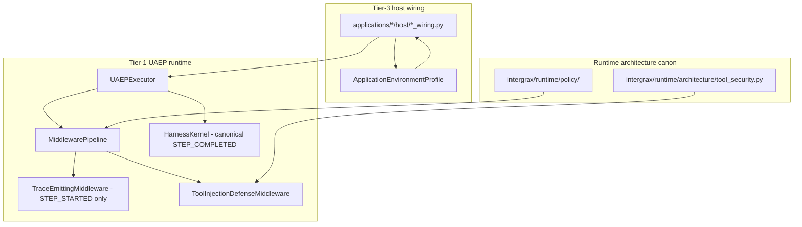

# Intergrax - Agent Creation Guide

> **Application dependencies:** each Tier-3 host owns applications/<app>/pyproject.toml (Intergrax workspace package + selected extras). Sync with uv sync --project applications/<app>. Canon: [docs/project/architecture/APPLICATION_DEPENDENCY_MODEL.md](../../architecture/APPLICATION_DEPENDENCY_MODEL.md).

**The single canonical guide for creating, registering, running, and evaluating agents.**

This is the **only** step-by-step workflow document. Do not duplicate this process elsewhere.
Architecture canon: [`intergrax_runtime_architecture.md`](intergrax_runtime_architecture.md)  
Cross-domain invariants: [`SYSTEM_INVARIANTS.md`](SYSTEM_INVARIANTS.md) - skim before agent work (P2-ARCH-01)  
Implementation status: [`intergrax_runtime_architecture.md`](intergrax_runtime_architecture.md)

**Audience:** human developers, GPT, Claude, Gemini, Cursor agents.

**Success metric:** from idea to first `agent.run()` smoke test in **under one hour**, with **zero changes** to `intergrax/runtime`.

---


## Package metadata (Tier-2)

Every reusable agent owns `agents/<agent>/pyproject.toml` as a uv workspace member
(`intergrax-<slug>-agent`). Declare only the Intergrax platform dependency (and
agent-specific third-party runtime deps). Never depend on a Tier-3 application.

Applications select agents by distribution name in `applications/<app>/pyproject.toml`.
Canon: [APPLICATION_RUNTIME_GRAPH_MODEL.md](../../architecture/APPLICATION_RUNTIME_GRAPH_MODEL.md).


## Table of contents

1. [Mental model](.#1-mental-model)
2. [End-to-end workflow](.#2-end-to-end-workflow)
3. [Prerequisites](.#3-prerequisites)
4. [Step 1 - Hypothesis and capability](.#step-1--hypothesis-and-capability)
5. [Step 2 - Scaffold the agent](.#step-2--scaffold-the-agent)
6. [Step 3 - Implement domain logic](.#step-3--implement-domain-logic)
7. [Step 4 - Register the agent](.#step-4--register-the-agent)
8. [Step 5 - Run the agent](.#step-5--run-the-agent)
9. [Step 6 - Inspect traces and runtime events](.#step-6--inspect-traces-and-runtime-events)
10. [Step 7 - Record experiment and decision](.#step-7--record-experiment-and-decision)
11. [Step 8 - Test and gate](.#step-8--test-and-gate)
12. [Step 9 - Sign-off before business agents](.#step-9--sign-off-before-business-agents)
13. [Appendix A - Human-in-the-loop](.#appendix-a--human-in-the-loop)
14. [Appendix B - Shadow workspace and sandbox](.#appendix-b--shadow-workspace-and-sandbox)
15. [Appendix C - Multi-agent graphs](.#appendix-c--multi-agent-graphs)
16. [Appendix D - Advanced execution paths](.#appendix-d--advanced-execution-paths)
17. [Appendix E - Integrations and Tier-0 wiring](.#appendix-e--integrations-and-tier-0-wiring)
18. [Appendix F - Tier-3 application environment](.#appendix-f--tier-3-application-environment)
19. [Appendix G - Memory & RAG naming](.#appendix-g--memory--rag-naming-phase-q)
20. [Appendix H - Governance, policy & observability](.#appendix-h--governance-policy--observability-control-plane)
21. [Appendix I - Orchestration control plane](.#appendix-i--orchestration-control-plane)
22. [Appendix J - Tools & skills control plane](.#appendix-j--tools--skills-control-plane)
23. [Appendix K - Integration & RAG control plane](.#appendix-k--integration--rag-control-plane)
24. [Appendix L - Context engineering control plane](.#appendix-l--context-engineering-control-plane)
25. [Appendix M - Prompt registry control plane](.#appendix-m--prompt-registry-control-plane)
26. [Appendix N - Agent assembly control plane](.#appendix-n--agent-assembly-control-plane)
27. [Appendix O - Registry architecture control plane](.#appendix-o--registry-architecture-control-plane)
28. [Appendix P - Capability graph control plane](.#appendix-p--capability-graph-control-plane)
29. [Appendix Q - Observability control plane closeout](.#appendix-q--observability-control-plane-closeout)
30. [Appendix R - Reliability control plane closeout](.#appendix-r--reliability-control-plane-closeout)
31. [Appendix S - Security control plane closeout](.#appendix-s--security-control-plane-closeout)
32. [Appendix T - Cost governance control plane closeout](.#appendix-t--cost-governance-control-plane-closeout)
33. [Appendix U - Evaluation control plane closeout](.#appendix-u--evaluation-control-plane-closeout)
34. [Appendix W - Critic & Verification control plane closeout](.#appendix-w--critic--verification-control-plane-closeout)
35. [Appendix V - Adaptive Harness control plane closeout](.#appendix-v--adaptive-harness-control-plane-closeout)
36. [Appendix X - MVP-to-product evolution playbook](.#appendix-x--mvp-to-product-evolution-playbook)
37. [Appendix AC - Agent `run()`, patterns, environment (ACP)](.#appendix-ac--agent-run-cognitive-patterns-and-environment-acp)
38. [Anti-patterns](.#anti-patterns)
37. [Instructions for LLM coding agents](.#instructions-for-llm-coding-agents)

---

## 1. Mental model

```text
Tier-0  intergrax/           Platform + Agent Distribution (lifecycle authority)
Tier-1  intergrax/runtime/   Execution boundary, projections, internal Nexus orchestration
Tier-2  agents/              Reusable agent capabilities
Tier-3  applications/        Host wiring only (no lifecycle ownership)
```

```text
Agent Distribution    = lifecycle authority (install, bind, revision, activation)
Execution (Tier-1)    = public execution boundary for Tier-3 consumers
AgentRegistry         = derived runtime projection (read-only at serving boundary)
Nexus (Tier-1)        = internal orchestration strategy/runtime — not Tier-3 public API
Agents (Tier-2)       = domain logic (decisions, prompts, tools, workflows)
Applications (Tier-3) = host composition (manifest, routes, integrations)
```

When you create an agent you work **only** on Tier-2:

| You implement | Nexus owns (do not touch for one agent) |
|---------------|----------------------------------------|
| decisions, rules, workflows | orchestration |
| prompts, tools, outputs | lifecycle, tracing, memory |
| `AgentContract`, `on_next_step` + typed state | checkpointing, retries, HITL, graphs |

**Integration rule:** agent packages integrate through **Agent Distribution lifecycle** and Tier-3 `AgentBinding` roster entries — never through local `AgentRegistry.register()` on production, lab, product, or scenario serving paths. Unit tests may use `agent.run()` only.

### Author terminology canon (single entry - ACP-CLOSE-PAT-3)

**Normative definitions** for session/run/step vocabulary live in architecture [**§29 - Author-facing `run()` facade**](../../architecture/AGENT_CONTRACTS_AND_ASSEMBLY.md#29-author-facing-run-facade) (through §29.6). This guide **links** to §29; Appendix AC adds worked examples only - **do not** treat appendices as alternate definitions. Tier/plane terms: architecture §22–§23.

| Author term | Canon (§29) | Not this |
|-------------|-------------|----------|
| `await agent.run(AgentRunRequest(...))` | One **session** per graph node or pytest | Many external `run()` calls per internal reasoning step |
| `on_next_step(step_ctx) → StepOutcome` | One **domain iteration**; primary hook | Author `get_steps` / `run_step` / `decide_after_step` (UAEP - harness-internal §13.3) |
| `AgentRuntime.advance_step` | Inside framework `run()` loop | Author override |
| `HarnessKernel.execute_step` | Policy, trace, gateways after decision | Domain logic |
| Tier-3 `host_execution.execute(...)` | Production / lab HTTP serving | Direct `NexusLoop` from Tier-3 |
| UAEP | Framework bridge for pattern bases | Author implementation path |

---

## 2. End-to-end workflow

```text
idea
  → hypothesis
  → capability id
  → scaffold                    (python -m intergrax.scaffold new-agent …)
  → implement domain logic      (steps/, prompts/, contract.py)
  → integrate                   (unit test: agent.run · lab/product: Agent Distribution → projection)
  → run                         (pytest / host_execution.execute / lab HTTP)
  → inspect                     (debug API / CLI)
  → evaluate
  → decision: keep | improve | pause | delete
```

---

## 3. Prerequisites

- Repository root with `uv` / Python 3.12
- `agents` and `applications` on import path (configured in `pyproject.toml` → `pythonpath`)
- No external network required for smoke tests and gate

Verify platform health:

```bash
uv run pytest tests/acceptance/agent_os -m agent_os -q
```

---

## Step 1 - Hypothesis and capability

Write one sentence:

> When **&lt;trigger&gt;**, agent **&lt;name&gt;** should **&lt;outcome&gt;** using **&lt;tools/data&gt;**.

Define a **capability id** - stable routing key used by Nexus classifier and `TaskContext`:

```text
documents.automation
vendor.discovery.basic
signoff.probe
```

Convention: lowercase, dot-separated namespace (`<domain>.<action>`).

---

## Step 2 - Scaffold the agent

```bash
python -m intergrax.scaffold new-agent document_automation \
    --capability documents.automation
```

For agents that run inside **lab** or **product** hosts with injected integrations (echo, legal, research pattern):

```bash
python -m intergrax.scaffold new-agent my_probe \
    --capability my_probe.basic \
    --reference
```

`--reference` emits `HarnessReferenceAgent` + `LabHarnessContext` wiring - Tier-3 `host/agent_builders.py` injects the harness; the agent package must **not** import `applications.*`.

Repeat `--capability` for multiple capabilities. Default if omitted: `<slug>.basic`.

**DX shortcuts (no Nexus edits):**

```bash
uv run intergrax doctor
uv run intergrax run applications.poc_template_application.host.main:app --reload
uv run python -m intergrax.scaffold new-stack my_lab --profile lab --capability my_lab.basic
```

**Generated layout:**

```text
agents/document_automation/
    document_automation_agent.py   # Agent class (ACP entry - run / on_next_step)
    contract.py                    # AgentContract builder
    capabilities.py                # capability id list
    `on_next_step` / cognitive pattern hooks              # domain execution (start here)
    schemas/                       # Pydantic I/O models
    prompts/system.md              # prompt assets
    tests/test_document_automation_agent.py   # smoke test (includes registration)
    notebooks/01_document_automation_experiment.ipynb
    README.md
```

**Canonical (ACP - shipped):** scaffold emits **`on_next_step` + typed `AcpSessionState` subclass** via `--pattern` (architecture §32.0 · ACP-8 · ACP-LEG-4). Structure domain logic as **READ → UPDATE → DECIDE** (Appendix AC.3b).

**UAEP is harness-internal only:** `get_steps` / `run_step` / `decide_after_step` exist as a **framework bridge** inside Tier-0/Tier-1 (`uaep_linear_bridge.py`, pattern bases). **Authors do not implement or document UAEP as a primary path** - use `on_next_step` or a cognitive pattern base (Appendix AC).

**Important:** scaffold creates files only. It does **not** register the agent globally or in any application.

---

## Step 3 - Implement domain logic

| File | Responsibility |
|------|----------------|
| `capabilities.py` | Public capability ids |
| `contract.py` | `AgentContract` - id, description, tools, risk, max_steps |
| `state.py` (target) | **Typed** `AcpSessionState` subclass - `extra=forbid` §32.0 |
| `steps` or `on_next_step` | Domain logic - **READ → UPDATE → DECIDE** per step (Appendix AC.3b) |
| `prompts` | System/user prompt templates |
| `schemas` | Request/response models |

**Canonical implementation path (ACP):** override **`on_next_step`** → return **`StepOutcome`** factories; use **`load_session_state`** and **`state_delta`** only - never mutate state in place. Full wave plan: [`plan/AGENT_CONTRACTS_AND_ASSEMBLY.md`](../../maintainers/plans/AGENT_CONTRACTS_AND_ASSEMBLY.md) §6.1aw.

**Reuse Tier-0** (LLM adapters, tools, RAG helpers). Do not duplicate platform infrastructure inside the agent folder. For **which database, cache, or Slack backend** the host uses, see [Appendix E - Integrations](.#appendix-e--integrations-and-tier-0-wiring) - agents declare **tools and capabilities**, applications wire **integration slugs**.

**Tool access (gateways - immediate mode §32.8):**

```python
from intergrax.contracts.tool_request import ToolRequest

response = await ctx.invoke_tool(
    ToolRequest(
        tool_name="sandbox.exec",
        agent_id=ctx.agent_id,
        step_id=step.step_id,
        input={"operation": "write_file", "payload": {"path": "out.txt", "content": "…"}},
    )
)
```

Never import Nexus runtime steps from agent code.

---

## Step 4 - Integrate the agent (lifecycle + host roster)

**Canonical rule:** production, lab, product, and scenario hosts **do not** own agent lifecycle. Agents enter runtime through **Agent Distribution** (catalog → install → bind → revision → materialization → activation → **registry projection** → **Execution**). Tier-3 hosts consume `AgentRegistryRead` and `HostTaskExecutionPort` — they never construct mutable `AgentRegistry` instances or call `registry.register()` for serving paths.

**Unit-test / isolated authoring** is the only context where you exercise an agent without the distribution lifecycle:

```python
from intergrax.contracts.agent_run import AgentRunRequest, RequestIdentity
from intergrax.contracts.agent_run_enums import AgentRunStatus
from document_automation.document_automation_agent import DocumentAutomationAgent

agent = DocumentAutomationAgent()
result = await agent.run(
    AgentRunRequest(
        input="hello",
        identity=RequestIdentity(tenant_id="t1", user_id="u1"),
        agent_id=agent.contract_id,
    )
)
assert result.status == AgentRunStatus.SUCCEEDED
```

Canon: [`AGENT_DISTRIBUTION.md`](../../architecture/AGENT_DISTRIBUTION.md) · [`APPLICATION_RUNTIME_GRAPH_MODEL.md`](../../architecture/APPLICATION_RUNTIME_GRAPH_MODEL.md)

### Choose an integration context

| Context | When to use | Canonical path |
|---------|-------------|----------------|
| **A - Smoke test** | Fastest first run; CI for the agent package | `agent.run(AgentRunRequest(...))` in `agents/<slug>/tests` (generated) |
| **B - Script / notebook** | Offline experiments only — **not** production quickstart | `agent.run()`; notebooks are historical/non-canonical unless refreshed |
| **C - Lab application** | HTTP experimentation via scaffolded lab host | `AgentBinding.mount(...)` in manifest → revision-bound host factory → `host_execution.execute(...)` |
| **D - Product application** | Existing or new product host | Same lifecycle as C; production uses reference composition + activation |
| **E - Dedicated application (scaffold)** | New deployable host (env, Docker, HTTP API) | `python -m intergrax.scaffold new-application` → § [Step 4E](.#e--dedicated-application-scaffold) |


| Context | When to use | Where to register |
|---------|-------------|-------------------|
| **A - Smoke test** | Fastest first run; CI for the agent | Already in `agents/<slug>/tests` (generated) |
| **B - Script / notebook** | Offline experiments only | `agent.run(AgentRunRequest(...))` — not lifecycle registration |
| **C - Lab application** | HTTP experimentation via `/v1/lab/run` | `applications/lab_application/manifest.py` + `host/wiring.py` |
| **D - Product application** | Existing product host (Legal, Research, …) | `applications/<product>/manifest.py` + `host/wiring.py` |
| **E - Dedicated application (scaffold)** | New deployable host (env, Docker, HTTP API) | `python -m intergrax.scaffold new-application` → § [Step 4E](.#e--dedicated-application-scaffold) |

### Production lifecycle governance note (Phase V)

When an agent is intended for production eligibility, registration and runtime success are not sufficient.
The agent must satisfy lifecycle governance gates tracked in implementation plan **Phase V (V-ALG.\*)**:

- certification evidence (quality/policy/security),
- promotion path evidence (dev -> staging -> production),
- explicit owner/on-call metadata,
- deprecation/retirement policy metadata.

Use this guide for creation workflow, and use Phase V governance streams for production lifecycle readiness.

There is **no auto-discovery**. Lab/product/scenario hosts require explicit `AgentBinding.mount` entries and Agent Distribution lifecycle materialization — not ad-hoc `registry.register()`.

### A - Smoke test (recommended first run)

Generated by scaffold — no Tier-3 host required:

```bash
uv run pytest agents/document_automation/tests -q
```

The generated test calls `await agent.run(AgentRunRequest(...))` — **not** `AgentRegistry()` or `NexusLoop`.

### B - Script or notebook (historical / offline only)

For one-off exploration, prefer the author contract:

```python
import asyncio

from intergrax.contracts.agent_run import AgentRunRequest, RequestIdentity
from document_automation.document_automation_agent import DocumentAutomationAgent

async def main() -> None:
    agent = DocumentAutomationAgent()
    result = await agent.run(
        AgentRunRequest(
            input="hello",
            identity=RequestIdentity(tenant_id="lab", user_id="dev"),
            agent_id=agent.contract_id,
        )
    )
    print(result.status, result.output)

asyncio.run(main())
```

Notebook templates under `agents/<slug>/notebooks/` are **historical experiments** unless linked from this guide or scaffold. Do **not** treat `NexusLoop` notebook stubs as canonical production quickstarts.

### C - Lab application (HTTP)

**Step C.1 - Add agent to lab roster**

Edit `applications/<lab_pkg>/manifest.py` (and `host/agent_builders.py` when the agent needs a custom factory). The canonical lab host factory materializes **registry projection** and **Execution** — do **not** call `registry.register()` by hand.

Example binding:

Example binding:

```python
from document_automation.document_automation_agent import DocumentAutomationAgent
# inside build_lab_manifest() agents=[ ... ]
AgentBinding.mount(DocumentAutomationAgent, capabilities=["documents.automation"]),
```

Add a zero-arg builder in `host/agent_builders.py` when needed:

```python
DocumentAutomationAgent: lambda ctx, binding: DocumentAutomationAgent(),
```

**Step C.2 - Start lab host**

```bash
uv run uvicorn lab_application.host.main:app --host 127.0.0.1 --port 8090
```

**Step C.3 - Verify registration**

```bash
curl http://127.0.0.1:8090/v1/lab/agents
```

**Step C.4 - Run**

```bash
curl -X POST http://127.0.0.1:8090/v1/lab/run \
  -H "Content-Type: application/json" \
  -d '{
    "tenant_id": "lab",
    "user_id": "dev",
    "message": "process this document",
    "capability": "documents.automation"
  }'
```

Lab app also exposes `/debug/*` for trace, events, checkpoints, experiments, and HITL.

### D - Product application (Tier-3)

Use this path when extending an **existing** product host (Legal, Research, …). For a **new** host, prefer **Step 4E** (scaffold).

Manual / reference pattern:

1. Keep agent logic in `agents/<slug>`
2. Define roster in `applications/<product>/manifest.py` - `AgentBinding.mount(AgentClass, factory=...)`
3. Implement factories in `host/agent_factories.py` or `host/agent_builders.py`
4. In `host/wiring.py` - `build_application_registry(manifest, ctx, builders=...)`
5. In `host/factory.py` - materialized registry projection → canonical **Execution** (internal Nexus orchestration is composed by the platform host — not wired by Tier-3 authors)

**Usage guides (define / invoke / run):**

- Composition engine API: [`intergrax/applications/USAGE.md`](../../../../applications/USAGE.md)
- Application folder layout: [`applications/USAGE.md`](../../../../applications/USAGE.md)

Example references:

- `applications/legal_application/manifest.py` + `host/agent_factories.py`
- `applications/lab_application/manifest.py` + `host/agent_builders.py`
- `applications/research_application` - product-style host

Applications contain **wiring only** - never agent business logic.

### E - Dedicated application (scaffold)

**When to use:** you need a **separate** Tier-3 host with its own `.env`, HTTP API, optional Docker image, and stable package name - not only the shared lab. Typical after agent smoke tests (Step 4A) pass.

**Canon:** `docs/project/architecture/intergrax_runtime_architecture.md` §7.4.8–§7.4.10
**Phase N status:** [`intergrax_runtime_architecture.md`](intergrax_runtime_architecture.md) (Phase N table)  
**Reference tree:** `applications/poc_template_application` (committed scaffold example)

#### E.0 - 15-minute minimal path (Phase DX-3.6)

From repository root - fastest harness loop (no Docker/MCP until you promote):

```bash
# 1. Agent + lab host (minimal factory)
python -m intergrax.scaffold new-stack my_feature --profile lab --minimal \
  --capability my_feature.basic

# 2. Agent smoke test
uv run pytest agents/my_feature/tests -q

# 3. Run HTTP host (prints route + sample curl)
uv run intergrax run my_feature_application.host.main:app

# 4. Invoke (replace port/prefix from CLI output)
curl -s -X POST http://127.0.0.1:8091/v1/my_feature/run \
  -H "Content-Type: application/json" \
  -d '{"message":"hello","capability":"my_feature.basic"}'
```

**Progressive disclosure (Phase DX-0.4):**

| Stage | Command / artifact | What you get |
|-------|-------------------|--------------|
| **Minimal** | `new-stack --minimal` | Lab host via `build_harness_host_runtime` + `create_lab_fastapi_from_runtime`; agent under `agents/<slug>` |
| **Standard** | `new-stack` (no `--minimal`) | Docker, MCP, `BUILD_AND_DEPLOY.md`, full factory + debug scheduler |
| **Promote** | `python -m intergrax.scaffold expand <app_slug>` | Adds standard files to an existing minimal lab application |

See also [`applications/USAGE.md`](../../../../applications/USAGE.md) § Progressive disclosure.

#### E.1 - Choose scaffold profile

| Profile | CLI | Host style | Default port |
|---------|-----|------------|--------------|
| `lab` | `--profile lab` | Debug API + `POST <prefix>/run` + `/debug/*` | 8091 |
| `product` | `--profile product` | FastAPI Core (`/health`, `/v1/*`) + auth env stubs | 8000 |

**Full stack (agent + application):**

```bash
python -m intergrax.scaffold new-stack my_feature \
  --profile lab \
  --capability my_feature.basic
```

Creates `agents/my_feature` and `applications/my_feature_application` in one step.

```bash
# From repository root - lab host for experimentation
python -m intergrax.scaffold new-application my_lab \
  --profile lab \
  --agents echo,my_agent \
  --port 8091 \
  --prefix /v1/my_lab

# Product-style host (Legal-like factory layout)
python -m intergrax.scaffold new-application my_product \
  --profile product \
  --agents echo \
  --port 8000
```

`--agents` accepts built-in slugs (`echo`, `research`, `signoff_probe`) or your scaffolded agent slug under `agents/<slug>`.

The CLI prints package name, uvicorn command, pytest path, MCP mount, and Docker script paths.

#### E.2 - Generated layout

Creates `applications/<name>_application` (package suffix is automatic):

```text
applications/my_lab_application/
  manifest.py                 # ApplicationManifest.lab | .product
  README.md                   # Three-command quickstart
  BUILD_AND_DEPLOY.md         # Runbook: local, verify, Docker, prod checklist
  .env.example                # MY_LAB_* (copy to .env, gitignored)
  host/                       # factory, settings, wiring, integration_wiring
  serving/                    # fastapi_router (+ schemas.py for product)
  mcp/server.py               # FastMCP on same uvicorn process (/mcp)
  docker/
    Dockerfile, .dockerignore, docker-compose.yml
    build-docker.sh, build-docker.bat
  my_lab_application_tests/   # host smoke tests
```

Import as `my_lab_application.host.main:app` (folder `applications` is on `pythonpath`).

#### E.3 - Register your agent in the new host

Scaffold pre-registers agents from `--agents`. To add or change the roster after creation:

1. **Manifest** - `applications/<pkg>/manifest.py`:

   ```python
   AgentBinding.mount(MyAgent, capabilities=["my_domain.action"], default=True),  # product: one default
   ```

2. **Builders** (zero-arg agents) - `host/agent_builders.py`:

   ```python
   MyAgent: lambda ctx, binding: MyAgent(),
   ```

3. **Factories** (settings-driven agents, product profile) - `host/agent_factories.py` + typed factory callable.

4. **Host factory** - canonical scaffold emits revision-bound `host_execution` + `AgentRegistryRead`; do not add local `AgentRegistry()` construction in serving routes.

Re-run host smoke tests after edits.

#### E.4 - Configure environment

```bash
cp applications/my_lab_application/.env.example applications/my_lab_application/.env
```

Variables use the application prefix (`MY_LAB_`, `MY_PRODUCT_`, …). Do not put app-only secrets in the repository-root `.env` only.

Product profile: optional dev API key via `*_BACKEND_BOOTSTRAP_API_KEY` (+ tenant/user); production requires keys or explicit `*_BACKEND_ALLOW_UNAUTHENTICATED=true` (see generated `host/settings.py`).

**Lab / scaffold harness defaults (Phase Q-N.10, DX-6.1):** Tier-2 agents and lab hosts use `intergrax.agents.defaults.harness_production_mode()` (returns `False`) on `RuntimeConfig` so governance and shadow policies stay relaxed during local iteration. Product profiles set `production_mode=True` explicitly in `host/factory.py`. Tier-3 may re-export via `intergrax.applications._shared.runtime_defaults`.

#### E.5 - Three-command quickstart

From **repository root**:

```bash
# 1. Verify
uv run pytest applications/my_lab_application/my_lab_application_tests -q

# 2. Run locally
uv run uvicorn my_lab_application.host.main:app --host 127.0.0.1 --port 8091

# 3. Container image (monorepo root context)
applications/my_lab_application/docker/build-docker.sh
# Windows: applications\my_lab_application\docker\build-docker.bat
```

Product profile: also `curl http:/127.0.0.1:8000/health` before `POST <route_prefix>/run`.

Operational detail: `../applications/<pkg>/BUILD_AND_DEPLOY.md`.

#### E.6 - HTTP verification

**Lab profile:**

```bash
curl -s http://127.0.0.1:8091/v1/my_lab/agents
curl -s -X POST http://127.0.0.1:8091/v1/my_lab/run \
  -H "Content-Type: application/json" \
  -d '{"message":"hello","capability":"echo.basic"}'
```

**Product profile:**

```bash
curl -s http://127.0.0.1:8000/health
curl -s -X POST http://127.0.0.1:8000/v1/my_product/run \
  -H "Content-Type: application/json" \
  -d '{"message":"hello","capability":"echo.basic"}'
```

**MCP (both profiles):** FastMCP on `/mcp` by default - tools `list_agents`, `run_agent` (same Nexus loop as HTTP). Toggle with `<PREFIX>_INCLUDE_MCP` / `<PREFIX>_MCP_MOUNT_PATH`.

#### E.7 - Integrations and deploy

- **Integrations:** edit `host/integration_wiring.py` - lab scaffold uses `IntegrationProfile.lab()`; product uses `wire_nexus_observability()`. Agents still declare tools only; see [Appendix E](.#appendix-e--integrations-and-tier-0-wiring).
- **Docker:** scripts `cd` to monorepo root and build with `applications/<pkg>/docker/Dockerfile`. Override tag: `IMAGE_TAG=my-registry/my_lab:1.0.0` (sh) or `build-docker.bat my-registry/my_lab:1.0.0` (bat).
- **Gate:** after application smoke tests, run `uv run pytest -m gate -q`.

#### E.8 - Further reading

| Topic | Document |
|-------|----------|
| Composition engine API | [`intergrax/applications/USAGE.md`](../../../../applications/USAGE.md) |
| Application folder conventions | [`applications/USAGE.md`](../../../../applications/USAGE.md) |
| Tier-3 summary (manifest snippet) | [Appendix F](.#appendix-f--tier-3-application-environment) |

---

## Step 5 - Run the agent

Every run uses the same contract:

```python
Task(
    tenant_id="…",
    user_id="…",
    message="user input or instruction",
    context=TaskContext(capability="<capability from capabilities.py>"),
)
```

| Method | Command / entry point |
|--------|----------------------|
| Smoke test | `uv run pytest agents/<slug>/tests -q` |
| Host execution | `host_execution.execute(task)` (canonical Tier-3 boundary) |
| Lab HTTP | `POST /v1/lab/run` |
| Debug-only API | `uv run uvicorn intergrax.debug.app:create_debug_app --factory --port 8099` |
| Legal host | `uv run uvicorn legal_application.host.main:app --port 8000` |
| Research host | `uv run uvicorn research_application.host.main:app --port 8010` |

**Capability routing:** Execution reads `task.context.capability` and selects the agent whose `AgentContract.capabilities` includes that id from the **materialized registry projection**.

---

## Step 6 - Inspect traces and runtime events

After a run, inspect via **Lab Application** or **Debug API** (both mount `/debug/*`).

### HTTP endpoints

| Endpoint | Purpose |
|----------|---------|
| `GET /debug/tasks?tenant=<t>` | List recent runs |
| `GET /debug/tasks/{task_id}?tenant=<t>` | Run metadata and trace |
| `GET /debug/tasks/{task_id}/trace?tenant=<t>` | Full trace payload |
| `GET /debug/tasks/{task_id}/events?tenant=<t>` | Runtime events |
| `GET /debug/tasks/{task_id}/checkpoints?tenant=<t>` | Checkpoint history |
| `GET /debug/tasks/{task_id}/progress?tenant=<t>` | Partial results (long-running) |
| `POST /debug/human-response` | HITL approve / reject / escalate |
| `POST /debug/interactions/intake?execute=true` | Interaction → task → Nexus |

### CLI

```bash
python -m intergrax.debug tasks list --tenant lab --limit 20
python -m intergrax.debug tasks trace TASK_ID --tenant lab --format json --runtime
```

Environment variables:

| Variable | Default | Purpose |
|----------|---------|---------|
| `INTERGRAX_TRACE_DB` | `build/intergrax_trace.db` | Trace persistence |
| `INTERGRAX_EXPERIMENTS_DB` | `build/intergrax_experiments.db` | Experiment registry |
| `INTERGRAX_TASK_CHECKPOINTS_DB` | `build/intergrax_checkpoints.db` | Checkpoints |
| `INTERGRAX_RUNTIME_EVENTS_DB` | `build/intergrax_runtime_events.db` | Runtime events |

---

## Step 7 - Record experiment and decision

Before running, register the hypothesis. After inspecting results, record the verdict.

### HTTP

```bash
curl -X POST http://127.0.0.1:8090/debug/experiments \
  -H "Content-Type: application/json" \
  -d '{
    "hypothesis": "Document automation returns prefixed stub answer",
    "capability": "documents.automation",
    "agent_id": "document_automation",
    "expected_output": "document_automation: …",
    "validation_criteria": "non-empty answer with agent prefix"
  }'

curl -X POST http://127.0.0.1:8090/debug/experiments/EXPERIMENT_ID/runs/TASK_ID
curl -X POST http://127.0.0.1:8090/debug/experiments/EXPERIMENT_ID/decision \
  -H "Content-Type: application/json" \
  -d '{"decision": "keep"}'
```

### CLI

```bash
python -m intergrax.debug experiments register \
  --hypothesis "…" \
  --capability documents.automation \
  --agent-id document_automation

python -m intergrax.debug experiments link-run EXPERIMENT_ID TASK_ID
python -m intergrax.debug experiments decide EXPERIMENT_ID --decision keep
```

**Decisions:** `keep` · `improve` · `pause` · `delete`

---

## Step 8 - Test and gate

```bash
# Agent smoke test
uv run pytest agents/document_automation/tests -q

# Platform acceptance (10 Agent OS scenarios)
uv run pytest tests/acceptance/agent_os -m agent_os -q

# Full regression gate
uv run pytest tests/ -m gate -q
```

### Pre-merge checklist

- [ ] Capability id defined in `capabilities.py`
- [ ] `AgentContract` complete (description, tools, risk, max_steps)
- [ ] `on_next_step` (or pattern base) with typed `AcpSessionState` implemented
- [ ] Registered in chosen context (test / lab / product wiring)
- [ ] **Zero** changes to `intergrax/runtime`
- [ ] Smoke test passes
- [ ] Trace inspectable via debug API
- [ ] No duplicated Tier-0 infrastructure
- [ ] No integration slug imports under `agents` (see Appendix E)
- [ ] Agent `README.md` present (generated by scaffold)

---

## Step 9 - Sign-off before business agents

Before starting Problem Radar, Vendor Discovery, or other business agents, complete one **live exercise**:

1. Scaffold a **new** agent (not Echo / not an existing mock)
2. Implement minimal domain change in `steps`
3. Register and run (smoke test or lab app)
4. Confirm **no runtime files** were modified
5. Record result in implementation plan **Appendix A** sign-off template

```text
Date:
Agent exercise: <slug>
Time to first run:
Runtime files modified: none
Acceptance suite: pass
Gate suite: pass
Decision: GO Phase K / HOLD
```

---

## Appendix A - Human-in-the-loop

Agents return `StepOutcome.pause_hitl(...)` from `on_next_step` (or pattern base). Nexus pauses in `WAITING_FOR_HUMAN`.

Resume via task metadata:

```python
Task(
    tenant_id="t1",
    user_id="u1",
    message="sensitive action",
    context=TaskContext(capability="…"),
    task_id=original_task_id,
    metadata={"human_response": "approve"},  # or "reject" / "escalate"
)
```

Or HTTP: `POST /debug/human-response`.

---

## Appendix B - Shadow workspace and sandbox

**Shadow workspace** - isolated file artifacts:

```python
Task(..., metadata={"shadow_workspace": True})
```

Inside `on_next_step`: `workspace = step_ctx.metadata.get("shadow_workspace")`.

**Sandbox** - permission-controlled tool execution:

```python
Task(..., metadata={"sandbox": True})
```

Add `"sandbox.exec"` to `AgentContract.allowed_tools`. Use `ctx.invoke_tool(ToolRequest(tool_name="sandbox.exec", …))`.

Result metadata includes `shadow_workspace_id` or `sandbox_session_id`.

---

## Appendix C - Multi-agent graphs

**Full orchestration map:** [Appendix I](.#appendix-i--orchestration-control-plane) (control plane, contracts, hooks, customization).

Register multiple agents through **Agent Distribution** and manifest `AgentBinding` entries, then execute via the public **Execution** boundary (`HostTaskExecutionPort` / `execution.execute`). The host materializes roster projection and selects orchestration strategy; **Nexus** remains internal Tier-1 orchestration — application authors do not construct `NexusLoop` or call `handle_task` directly.

```python
# Tier-3 application host (conceptual)
result = await host_execution.execute(
    execution_request_for(
        tenant_id="t1",
        user_id="u1",
        message="AI logistics partners in Poland",
        capability="research.pipeline",
        intent="research_summarize",
    )
)
```

Agents share context via `SharedTaskContext` and `MemoryView` through the selected orchestration strategy — not via ad-hoc agent-to-agent calls in `agents/`.

**Declarative topology (Tier-3):** `AgentGraph` fluent builder → `ApplicationGraphSpec` on `ApplicationEnvironmentProfile.graph_spec` (roster validation, DX round-trip). Runtime bridge via `GraphSpecSeedingPlanner` when the task has no pre-built plan id - see Appendix I §I.4.

---

## Appendix D - Advanced execution paths

These are platform features consumed by applications - not agent-creation steps.

| Feature | Entry point |
|---------|-------------|
| Unified run API | `POST /runs` via FastAPI Core + `UnifiedTaskRunner` |
| Worker queue | `QueuedNexusExecutionAdapter` + `create_nexus_celery_worker_app` |
| Long-running scheduler | `LongRunningScheduler` + checkpoint store |
| Partial results | `GET /debug/tasks/{id}/progress` |

See [`intergrax_runtime_architecture.md`](intergrax_runtime_architecture.md) for phase tracking.

---

## Appendix E - Integrations and Tier-0 wiring

**Canon:** [`intergrax_runtime_architecture.md`](intergrax_runtime_architecture.md) §7.1  
**Catalog:** `intergrax/integrations` (Phase M)

### Separation of concerns

```text
Tier-2  agents/           WHAT the agent needs     → capabilities, allowed_tools, ToolRequest
Tier-3  applications/     WHICH vendor/backend     → IntegrationProfile, ToolProfile, factory wiring
Tier-0  integrations/     HOW to talk to backend   → providers/<slug>/, contracts
Tier-0  tools/              WHAT the LLM invokes     → providers/<domain>/, ToolContract (see architecture/TOOLS.md)
```

| Layer | Declares | Example |
|-------|----------|---------|
| **Agent** (`AgentContract`) | Routing + tool policy | `capabilities=["research.web_search"]`, `allowed_tools=["websearch.query", "rag.retrieve"]` |
| **Application** (`factory.py`) | Provider + tool selection | `IntegrationProfile`, `ToolProfile`, `ToolWiringContext` |
| **Integration provider** | Adapter implementation | `create_jira_issue_tracker()`, `create_google_cse_search_provider()` |
| **Tool provider** | LLM-facing operation | `jira.search_tasks`, `websearch.query` - composes integrations |

Agents **never** import `intergrax.integrations.providers.*` or choose integration slugs. That belongs in Tier-3 composition roots (`factory.py`, `integration_wiring.py`).

### What agents declare

In `contract.py`, describe **behavior**, not infrastructure:

```python
AgentContract(
    id="research",
    capabilities=["research.web_search", "research.pipeline"],
    allowed_tools=["websearch.query", "sandbox.exec"],  # enforced by ToolAccessPolicy
    risk_level=AgentRiskLevel.MEDIUM,
    max_steps=20,
)
```

| Field | Purpose |
|-------|---------|
| `capabilities` | Nexus routing - which tasks this agent handles |
| `allowed_tools` | Tool gateway allow-list - which `ToolRequest.tool_name` values are permitted |
| `required_adapters` | Optional documentation hint for operators (not auto-wired today) |

When the agent needs external data or side effects, call tools via **`step_ctx.invoke_tool`** (ToolRuntime policy) - do not open Redis, Postgres, or Slack clients inside `agents`:

```python
response = await ctx.invoke_tool(
    ToolRequest(tool_name="websearch.query", agent_id=ctx.agent_id, step_id=step.step_id, input={...})
)
```

The application ensures the tool runtime is backed by the correct Tier-0 provider (e.g. Google CSE vs Bing via host config, not agent code). See [architecture/TOOLS.md](architecture/TOOLS.md) for catalog tool_ids and Phase O wiring (`ToolProfile`, `ToolWiringContext`).

#### Tool catalog wiring (Phase O.8 - unified model)

Applications enable catalog tools via `ToolProfile` and inject dependencies via `ToolWiringContext`. Reference implementations:

| Application | `host/tool_wiring.py` |
|-------------|----------------------|
| Lab | `wire_lab_tools()` - RAG, websearch, sandbox |
| Legal | `wire_legal_tools()` - env-driven RAG/websearch |
| Research | `wire_research_tools()` - websearch by default |
| POC template | `wire_poc_template_tools()` - lab-like defaults |

```python
from intergrax.applications._shared.tool_wiring import build_application_tool_wiring
from intergrax.tools.registry.profile import ToolProfile
from intergrax.tools.registry.bootstrap import register_default_tools

register_default_tools()
tool_wiring = build_application_tool_wiring(
    ToolProfile(enabled=["rag.retrieve", "websearch.query", "jira.search_tasks"]),
    integration_profile=integration_profile,
)

# Pass into RuntimeConfig when building agent runtime:
RuntimeConfig(
    llm_adapter=...,
    tool_profile=tool_wiring.profile,
    tool_wiring_context=tool_wiring.wiring_context,
    enable_rag=True,
    enable_websearch=True,
)
```

**Unified tool model (Phase O.5):** agents and legal tool-decision SHOULD prefer explicit `tool_ids` (`rag.retrieve`, `websearch.query`) over legacy `use_rag` / `use_websearch` booleans. Booleans still work - they map to catalog tool_ids and emit a deprecation trace.

```python
# Canonical plan surface (Tier-1 / legal bridge)
ToolRequest(
    tool_name="nexus.capability_plan",
    input={
        "tool_ids": ["rag.retrieve", "websearch.query"],
        "use_tools": False,
    },
)
```

MCP hosts may expose catalog schemas via `list_catalog_tools` / `describe_catalog_tool` (see `intergrax/applications/_shared/mcp_catalog_tools.py`).

### What applications wire

Tier-3 factories compose integrations once and pass concrete adapters into `NexusLoop`, schedulers, and debug services.

**Laboratory default** - `IntegrationProfile.lab()` (no external vendors):

| Category | Default slug |
|----------|--------------|
| `relational_store` | `sqlite` |
| `notification_channel` | `log` |
| `interaction_surface` | `lab_json` |

Reference implementation: `applications/lab_application/host/integration_wiring.py` → `wire_lab_integrations()`.

```python
from intergrax.integrations import IntegrationCategory, IntegrationProfile, register_default_integrations
from lab_application.host.integration_wiring import wire_lab_integrations

register_default_integrations()
integrations = wire_lab_integrations(settings=settings, db_path=trace_db_path)

# Tier-3 host factory composes Execution + internal Nexus from environment profile.
# Authors pass integration adapters via ApplicationEnvironmentProfile / host wiring —
# do not construct NexusLoop in application routes or agent packages.
host_bundle = build_lab_application_host(...)  # see lab_application/host/factory.py
await host_bundle.host_execution.execute(execution_request)
```

**Custom product profile** - pick slugs per category:

```python
from intergrax.integrations import (
    IntegrationCategory,
    IntegrationProfile,
    register_default_integrations,
)

register_default_integrations()
profile = IntegrationProfile(
    relational_store="postgresql",
    key_value_cache="redis",
    notification_channel="slack",
    interaction_surface="slack",
    options={
        "sqlite": {"data_dir": "build/my_app"},
        "redis": {"url": "redis://localhost:6379/0"},
    },
)

notifier = profile.resolve(IntegrationCategory.NOTIFICATION_CHANNEL)
db_bundle = profile.resolve(IntegrationCategory.RELATIONAL_STORE)
```

**Cloud-hosted profile** - platform defaults for object storage, message bus, etc.:

```python
profile = IntegrationProfile.with_cloud_platform("aws")
cache = profile.resolve(IntegrationCategory.KEY_VALUE_CACHE)  # inherits cloud default slug
```

### Environment overrides

Applications may override profile fields without code changes:

```text
INTERGRAX_INTEGRATION_RELATIONAL_STORE=sqlite
INTERGRAX_INTEGRATION_NOTIFICATION_CHANNEL=log
INTERGRAX_INTEGRATION_KEY_VALUE_CACHE=redis
```

Pattern: `INTERGRAX_INTEGRATION_<CATEGORY>` where `<CATEGORY>` is the uppercase enum name (e.g. `MESSAGE_BUS=kafka`).

Use `build_profile_from_env(defaults=IntegrationProfile.lab())` to merge env overrides onto lab defaults.

Provider-specific secrets and paths use each slug's own env prefix (e.g. `INTERGRAX_SQLITE_*`, `INTERGRAX_SLACK_*`) - see `intergrax/integrations/providers/<slug>`.

### P0 catalog (available today)

| Slug | Category | Typical Tier-3 use |
|------|----------|-------------------|
| `sqlite` | relational_store | Trace, checkpoints, runtime events, HITL (lab) |
| `postgresql` | relational_store | Production SQL facade (`RelationalStore` via `create_postgresql_relational_store()` only) |
| `mysql` | relational_store | Production SQL facade (`RelationalStore` via `create_mysql_relational_store()` only) |
| `jira` | issue_tracker | Jira Cloud REST (`create_jira_issue_tracker()` only) |
| `confluence` | wiki_knowledge | Confluence REST (`create_confluence_wiki_knowledge()` only) |
| `prometheus` | observability_backend | PromQL queries (`create_prometheus_observability_backend()` only) |
| `ms365_graph` | collaboration_suite | Microsoft Graph mail/calendar (`create_ms365_graph_collaboration_suite()` only) |
| `cassandra` | document_store | Cassandra CQL store (`create_cassandra_document_store()` only) |
| `aws` | cloud_platform | AWS facade (`create_aws_cloud_platform()` only) |
| `azure` | cloud_platform | Azure facade (`create_azure_cloud_platform()` only) |
| `gcp` | cloud_platform | GCP facade (`create_gcp_cloud_platform()` only) |
| `elasticsearch` | observability_backend | Log search / aggregations (`create_elasticsearch_observability_backend()` only) |
| `databricks` | relational_store | SQL Warehouse / Unity Catalog (`create_databricks_relational_store()` only) |
| `mongodb` | document_store | Flexible JSON store (`create_mongodb_document_store()` only) |
| `pinecone` | vector_store | RAG index bridge (`create_pinecone_vector_store()` only) |
| `qdrant` | vector_store | RAG index bridge (`create_qdrant_vector_store()` only) |
| `chroma` | vector_store | RAG index bridge (`create_chroma_vector_store()` only) |
| `s3` | object_storage | Blob storage (`create_s3_object_storage()` only) |
| `redis` | key_value_cache | Idempotency, rate limits, distributed locks |
| `kafka`, `rabbitmq`, `celery` | message_bus | Worker queues, async Nexus execution |
| `google_cse`, `bing`, `brave`, `serpapi` | search_provider | Research / web tools |
| `slack`, `teams`, `webhook`, `log`, `email_smtp` | notification_channel | Long-running progress, HITL alerts, SMTP mail |
| `lab_json`, `slack`, `teams` | interaction_surface | Inbound webhooks / lab JSON intake |
| `playwright` | browser_automation | JS-heavy pages via headless browser |

### Extended integrations (M.6 P2/P3 - registered in default bootstrap, beta)

| Slug | Category | Notes |
|------|----------|-------|
| `azure_blob`, `gcs`, `s3` | object_storage | Blob put/get/delete/presigned URL |
| `dynamodb`, `mongodb`, `cassandra` | document_store | Partition-scoped document CRUD |
| `sqs`, `service_bus`, `pubsub` | message_bus | Cloud-native queues (also via platform facades) |
| `memcached`, `elasticache`, `redis` | key_value_cache | Cache tiers |
| `oracle`, `mssql`, `azure_sql`, `cloud_sql` | relational_store | Enterprise SQL backends |
| `notion`, `sharepoint`, `confluence` | wiki_knowledge | Internal docs / runbooks |
| `github`, `linear`, `azure_devops`, `jira` | issue_tracker | ALM / dev workflow sources |
| `google_workspace`, `ms365_graph` | collaboration_suite | Mail / calendar / directory |
| `otel`, `prometheus`, `elasticsearch` | observability_backend | Metrics and log search |

Full catalog (167 providers, each with English `USAGE.md`): [`architecture/INTEGRATIONS.md`](architecture/INTEGRATIONS.md). Per-slug examples: `intergrax/integrations/providers/<category>/<slug>/USAGE.md`.

LLM adapters (`intergrax/llm_adapters`) are **not** part of the Integration Library - configure them via **`LLMProfile`** and [`intergrax/llm_adapters/USAGE.md`](../../../../intergrax/llm_adapters/USAGE.md). Architecture: [`docs/project/architecture/LLM_ADAPTERS.md`](../../architecture/LLM_ADAPTERS.md). Active uplift: **Phase M-LLM-X** (ModelCatalog, routing, DX).

### Decision checklist

When building a new agent or application:

1. **Agent author:** list capabilities and `allowed_tools` only; implement domain logic in `steps`.
2. **Application author:** choose `IntegrationProfile`, call `register_default_integrations()`, resolve categories in `factory.py`.
3. **Platform author:** add missing backends under `integrations/providers/<slug>` - never inside `agents`.
4. **Verify:** agent smoke tests use minimal wiring (in-memory / defaults); application acceptance tests exercise the chosen profile.

Further detail: [`intergrax_runtime_architecture.md`](intergrax_runtime_architecture.md) Phase M, migration map M.5.

Each provider under `intergrax/integrations/providers/<slug>` includes an English **`USAGE.md`** with factory + `IntegrationProfile` wiring and a minimal contract API example.

---

## Appendix F - Tier-3 application environment

When an agent needs a **dedicated host** (env, Docker, stable HTTP API) - not only the shared lab - use the Tier-3 stack under `applications/<app>`.

**Canonical application guide:** [`APPLICATION_CREATION_GUIDE.md`](APPLICATION_CREATION_GUIDE.md) - mental model (§47), author workflow (§31), new-application checklist (§45), ops CLI.

**Primary workflow:** [Step 4E - Dedicated application (scaffold)](.#e--dedicated-application-scaffold) (CLI, three-command quickstart, Docker scripts).

| Topic | Document |
|-------|----------|
| **Scaffold CLI** - `new-application`, lab vs product profile | [Step 4E](.#e--dedicated-application-scaffold) |
| **Composition engine** - `ApplicationManifest`, `AgentBinding.mount()`, `build_application_registry()` | [`intergrax/applications/USAGE.md`](../../../../applications/USAGE.md) |
| **Application layout** - manifest, host, serving, `.env.example`, docker | [`applications/USAGE.md`](../../../../applications/USAGE.md) |
| **Deploy runbook** - per-app `BUILD_AND_DEPLOY.md` | Generated by scaffold; see `applications/poc_template_application` |
| Architecture rules | `docs/project/architecture/intergrax_runtime_architecture.md` §7.4.8–§7.4.10 |
| Implementation plan | [`intergrax_runtime_architecture.md`](intergrax_runtime_architecture.md) Phase N |

Minimal pattern (hand-written manifest):

```python
from echo.echo_agent import EchoAgent
from intergrax.applications.contracts.build_context import ApplicationBuildContext
from intergrax.applications.contracts.manifest import AgentBinding, ApplicationManifest
from intergrax.applications._shared.wiring import build_application_registry

manifest = ApplicationManifest.lab(app_id="my_lab", name="My Lab", agents=[AgentBinding.mount(EchoAgent)])
ctx = ApplicationBuildContext.for_manifest(manifest, settings=settings)
registry = build_application_registry(manifest, ctx, builders=MY_BUILDERS)
```

Prefer `python -m intergrax.scaffold new-application <name> --profile lab|product --agents <slug>` over copying folders by hand.

---

## Appendix G - Memory & RAG naming (Phase Q)

> **Full architecture:** [`architecture/MEMORY.md`](architecture/MEMORY.md) - canonical deep dive (stores, lifecycle, context compiler, strategy matrix). This appendix is the **author control plane** summary.

### Four memory stores (canon §27 mapping)

Canon §27 defines five memory **types**; runtime implements **four operational stores** plus trace and RAG:

| Canon type | Runtime store | Module |
|------------|---------------|--------|
| Task memory | Task KV (`TaskMemory` + `MemoryView`) | `runtime/task_memory` |
| Agent local memory | Same task KV namespaces (per-step session) | `PolicyScopedMemoryView` |
| User / org memory | `UserProfileManager` + `OrganizationProfileManager` | `intergrax/memory`, `runtime/organization` |
| Long-term knowledge | RAG vectorstore (not agent-mutable memory) | `rag` |
| Execution trace | `RunTraceWriter` / `RuntimeEvent` (immutable) | `runtime/nexus/tracing` |

Short-term session history uses `SessionManager` + `SessionStorage` (SQLite when `relational_store=sqlite` on `IntegrationProfile`).

**MemoryKind tags** (`USER_FACT`, `PREFERENCE`, `SESSION_SUMMARY`, `ORG_FACT`, `POLICY`) classify LTM **entries** - not a full episodic/semantic/procedural taxonomy (IDEAL vision only).

### Session vs checkpoint vs task KV (LangGraph thread analogy)

| Concept | Intergrax | Persists when |
|---------|-----------|---------------|
| Thread / session | `SessionManager` + `session_id` | `INTERGRAX_SESSION_DB` / sqlite bundle |
| Checkpointer | `SQLiteTaskCheckpointStore` (long-running ACP sessions) | `INTERGRAX_TASK_CHECKPOINTS_DB` |
| Scoped KV / store | `TaskMemory` + `MemoryView` namespaces | `INTERGRAX_TASK_MEMORY_DB` |

Use **session** for turn-by-turn chat; **task KV** for per-run agent scratch state; **checkpoints** for resumable `on_next_step` loops - do not mix them.

### Persistence backends (Appendix G matrix)

| Layer | In-memory | SQLite (lab default) | Notes |
|-------|-----------|----------------------|-------|
| Task KV | tests | `INTERGRAX_TASK_MEMORY_DB` | `wire_task_memory_from_profile` |
| Session | fallback | sqlite bundle | `memory_wiring.resolve_memory_platform_wiring` |
| User LTM | tests | `intergrax_user_profile.db` in bundle | `SQLiteUserProfileStore`; optional Mongo `DocumentStoreUserProfileStore` |
| Org profile | tests | sqlite bundle | `SQLiteOrganizationProfileStore` |
| Redis | - | - | **Integration cache only** - not session/LTM |

### Context compression strategy (§28.1)

| Mechanism | Location | Strategy |
|-----------|----------|----------|
| Context budget | `ContextBudgetPolicy` on `ContextProfile` | char + token-estimate trim |
| Summary tiers | `TaskContextAssemblyOptions` | FULL / SUMMARY_ONLY / STRUCTURED_ONLY / MINIMAL |
| History layer | `engine_history_layer.py` | `SUMMARIZE_OLDEST`, truncate fallback |
| LTM limits | `RuntimeConfig` | `max_longterm_entries_per_query`, `max_longterm_tokens` |

Configure via `ApplicationEnvironmentProfile.context_profile` - mapped by `materialize_runtime_config` (Phase MEM).

### Org memory scope

Organization memory in Intergrax is **profile + instructions** (`OrganizationProfileManager`) - not a full shared episodic or team knowledge product. Use RAG / document stores for org-wide knowledge bases; use org profile for tone, constraints, and system instructions.

### Task memory wiring vs Nexus LTM steps

`wire_task_memory_from_profile` enables the **task KV database** when `MemoryProfile.enable_task_memory` (or user/org/LTM flags) is set. It does **not** auto-register Nexus runtime steps for user/org LTM - those flow through `SessionManager` profile managers when `enable_user_memory` / `enable_org_memory` are true on the environment profile.

### MemoryView namespaces + delegation

- Default namespaces: agent-specific keys under `PolicyScopedMemoryView`
- Delegation: `task_id/delegation/{node_id}` (see `delegation_memory.py`)
- Shared handoff: `shared_task_context` metadata bridge

### Recovery semantics

| Layer | Key | Survives restart (sqlite lab) |
|-------|-----|------------------------------|
| Task KV | `tenant_id` + `task_id` + namespace | Yes |
| Session | `session_id` | Yes |
| User LTM | `tenant_id` + `user_id` | Yes (sqlite bundle) |
| Checkpoint | `task_id` + step cursor | Yes |

### Four memory stores (legacy table)

| Store | Module | When to use |
|-------|--------|-------------|
| Session history | `SessionManager` / `HistoryStep` | Turn-by-turn chat in one session |
| User LTM | `UserProfileManager` + vector index | Stable user facts across sessions |
| Task KV | `TaskMemory` (`INTERGRAX_TASK_MEMORY_DB`) | Per-task scratch state, ACP step session |
| Shared graph context | `shared_task_context` metadata | Multi-agent handoff on one Nexus task |

Enable SQLite task memory in Tier-3 via `wire_task_memory_from_profile` and `memory_wiring` (Phase MEM). Lab, `poc_template`, `legal_application`, and `research_application` reference hosts call `ApplicationEnvironmentProfile.with_harness_memory()` (or `lab_defaults`) so `MemoryProfile` drives `RuntimeConfig`.

### Three “context builders”

| Name | Location | Role |
|------|----------|------|
| Nexus `ContextBuilder` | `runtime/nexus/context/context_builder.py` | Assembles RAG/history/web for one runtime turn |
| `ContextManager` | `runtime/nexus/context/context_manager.py` | Nexus task-level context orchestration |
| `DefaultContextBuilder` | `rag/context` (ingest/index) | Document chunking for index pipelines |

Use `tool_ids` including `rag.retrieve` instead of legacy plan boolean `use_rag` (shim emits deprecation event).

### Context engineering (Harness AI)

Nexus owns **what the LLM sees** per step (`ContextManager`, `TaskContextAssemblyOptions`, `MemoryView`). See architecture §28.1. `ContextBudgetPolicy` provides central trim + `CONTEXT_ASSEMBLED` / `CONTEXT_TRIMMED` events (R-Context **Done**).

### Integration → Tool → Skill → Agent

| Layer | Declare in agent | Wire in Tier-3 |
|-------|------------------|----------------|
| Integration | - | `IntegrationProfile` |
| Tool | `allowed_tools` | `ToolProfile` |
| Skill | `skill_ids` on contract | `SkillProfile` |

Do **not** register markdown instruction packs as `ToolContract`. Import external skills via `CursorSkillImporter` - see [architecture/SKILLS.md](architecture/SKILLS.md). Canon: §7.1.8.

---

## Appendix H - Governance, policy & observability (control plane)

**Audience:** Tier-3 application authors, platform engineers, operators.  
**Audit alignment:** [`INTEGRAX_HARNESS_AUDIT_MAP.md`](guides/INTEGRAX_HARNESS_AUDIT_MAP.md) §5 (Policy), §21 (Observability); [`IDEAL_HARNESS_AI_ARCHITECTURE.md`](guides/IDEAL_HARNESS_AI_ARCHITECTURE.md) §3.3, §3.9.

Intergrax is **policy-first** and **event-first**. Governance and observability are **modular, composable layers** - not a single monolithic dashboard. Authors configure them through typed profiles, bundles, hooks, and integration slugs; Nexus enforces them on every run.

### H.1 Design principles (Harness audit)

| Principle | Meaning in Intergrax |
|-----------|----------------------|
| Policy-first | No tool/LLM path without `ToolRuntime`, `PolicyEngine`, or `ApplicationSecurityProfile` middleware |
| Trace-everything | `RuntimeEvent` + Nexus trace DB; canon §42.1, §42.1.5 |
| Composable-by-default | `RuntimePolicyBundle`, `SkillResolver`, `HookRegistry`, plugin entry points |
| Tier separation | Agents declare capabilities; **Tier-3** composes policy and observability |

### H.2 Control plane map (where to customize)

```text
ApplicationEnvironmentProfile (Tier-3 umbrella - single root)
  ├── meta (HostMeta)             → profile_id, execution_mode, features  [§22.6 target]
  ├── security (SecurityEnvelope) → identity, security_profile, guardrails, org envelope
  ├── capabilities (CapabilityBundle) → tools, skills, integrations, LLM, context, memory, prompt
  ├── cognition (CognitionBundle) → reasoning, orchestration, critic, adaptive, evaluation, codecraft
  ├── governance (GovernanceBundle) → reliability, observability, cost, scaling, deploy, EBE
  ├── topology (TopologyBundle)   → ApplicationGraphSpec
  └── isolation (IsolationBundle) → shadow workspace, sandbox

Flat accessors (current wire - until APP-EVOL-8 M1):
  ├── security_profile          → V-SEC toggles (prompt/tool/retrieval/tenant) → application_security_wiring.py
  ├── guardrail_profile         → vendor LLM scan toggles (M.12) + `integration_profile.llm_guardrail` slug
  ├── integration_profile.llm_guardrail → NeMo / LLM Guard / Presidio / … (Tier-0 catalog - agents never import SDKs)
  ├── policy_rules              → YAML declarative rules (lab: harness_lab.yaml) → policy_wiring.py
  ├── identity_profile          → API key, tenant_required, service identities
  ├── context_profile           → budget, RAG/web flags → RuntimeConfig + CONTEXT_* events
  ├── memory_profile            → STM/LTM/task flags → memory_wiring.py (Appendix G)
  ├── observability_profile     → trace SQLite, OTEL, metrics plugins
  ├── reliability_profile       → idempotency, circuit breaker, checkpoints, scheduler
  ├── adaptive_profile          → L4 runtime loops, stores, canary traffic (Appendix V)
  ├── execution_mode            → strict | balanced | exploratory → runtime_policies
  └── integration_profile       → observability_backend slug (prometheus, otel, elasticsearch, …)

Canon: architecture/TIER3_APPLICATION_ENVIRONMENT.md §22.6 · ADR-APP-003.

RuntimePolicyBundle (composed once per host)
  ├── tool_access / tool_scope  → allowed_tools intersection with AgentContract
  ├── budget / plan_loop        → token/cost ceilings, plan iteration limits
  ├── hitl                        → human approval requirements
  └── domain_fragments          → skill policy_fragment_id + app-specific keys

Skill layer
  └── SkillManifest.policy_fragment_id → merges into domain_fragments (never bypasses ToolRuntime)

Hook layer (Tier-1)
  └── HookPoint (BEFORE_TOOL_CALL, BEFORE_MEMORY_WRITE, …) → middleware + trace

Plugin extension (Tier-0)
  ├── intergrax.policy_rules     → custom PolicyEngine rule handlers (DX-5.8)
  ├── intergrax.integrations/tools/skills/memory_stores → catalog plugins (P-Ext, MEM)
  └── RuntimePlugin              → Nexus metrics/persistence middleware (not catalog EP)
```

**Rule:** compose policy **once** at Tier-3 startup (`build_runtime_policy_bundle`, `wire_application_environment`). Agents MUST NOT construct parallel policy objects.

#### H.2.1 Security middleware layout (UAEP-MAINT-03)



Authors customize security through **Tier-3** `*_wiring.py` + `ApplicationEnvironmentProfile.security_profile` - not by forking `intergrax/runtime/middleware`.

### H.3 Security profile (per application)

`ApplicationEnvironmentProfile.security_profile` (`ApplicationSecurityProfile`) maps to Phase V-SEC / V-REM wiring:

| Field | Effect when enabled |
|-------|---------------------|
| `prompt_defense_enabled` | Prompt injection defense on LLM path |
| `tool_injection_defense_enabled` | `ToolInjectionDefenseMiddleware` on `BEFORE_TOOL_CALL` |
| `retrieval_poisoning_defense_enabled` | Trust-score / quarantine on RAG retrieval |
| `tenant_security_verify_enabled` | Tenant boundary checks at task intake |
| `defense_plugin_ids` | Custom S2 plugins via `intergrax.security_defenses` EP |
| `defense_bundle_ids` | Shipped bundles (e.g. `harness.strict_injection`) |
| `encryption_enforcement_enabled` | `EncryptionEnforcementMiddleware` on memory/tool paths |
| `require_secrets_store_for_encryption` | Strict assembly requires `integration_profile.secrets_store` |

Wiring: `intergrax/applications/_shared/application_security_wiring.py`. Gate tests under `tests/unit/runtime/architecture` and integration paths.

### H.3.1 Security & Trust Planes (operator index)

| Plane | Question | Primary controls |
|-------|----------|------------------|
| **S1 Trust** | Who acts? Secrets? Signing? | `IdentityProfile`, `secrets_store` integration, `critical_action_signing` |
| **S2 Defense** | Is payload/tool/chunk safe? | `ApplicationSecurityProfile` toggles, `defense_bundle_ids`, vendor `llm_guardrail` |
| **S3 Governance** | Is execution allowed? | `PolicyRulesProfile`, `RuntimePolicyBundle`, HITL, budgets |

**Presets:** `SecurityEnvelope.lab()` · `SecurityEnvelope.strict()` · `SecurityEnvelope.production()` · `harness_defense_stack()` integration preset.

**Enterprise checklist (SEC-PLANES-EVOL):**

| Check | Operator action |
|-------|-----------------|
| Catalog bootstrap | Ensure host calls `bootstrap_catalogs()` - loads `intergrax.security_defenses` EP automatically |
| Production encryption | Use `SecurityEnvelope.production()` + `harness_defense_stack()` so `secrets_store` resolves |
| Defense plugin tenant scope | Custom S2 plugins MUST read `tenant_id` from `HookContext.runtime_state` - never bypass `PolicyEngine` |
| Observability | Subscribe to `platform.security.defense_blocked` and `platform.security.encryption_denied` on the runtime bus |
| RESTRICTED payloads | With `secrets_store` configured, middleware encrypts inline secrets before memory/tool paths |
| SIEM / ops | Use `kind_prefix="platform.security."` bus subscription; in-process counters via `SecuritySpineCounters` |

Canon: [UAEP §42.45](architecture/UNIFIED_EXECUTION_RUNTIME.md#4245-security-and-data-governance) · [§42.45.11](architecture/UNIFIED_EXECUTION_RUNTIME.md#424511-enterprise-production-readiness) · ADR: [ADR-SEC-001](../adr/entries/2026-06-19/ADR-SEC-001.md).

### H.4 Policy bundle - operator read order

Canonical operator checklist: architecture [§42.11.5](architecture/UNIFIED_EXECUTION_RUNTIME.md#42115-how-to-read-policy-for-a-run-operator).

| Step | Inspect | Location |
|------|---------|----------|
| 1 | Composed bundle | `ApplicationBuildContext.policy_bundle` |
| 2 | Agent + skills | `AgentContract.skill_ids` → `SKILL_RESOLVED` event |
| 3 | Tool enforcement | `ToolRuntime` + `resolve_allowed_tools_from_config` |
| 4 | Domain overlays | `domain_fragments` / `policy_rules` YAML |
| 5 | Human gates | `PolicyDecision.REQUIRE_HUMAN` → HITL queue |

Lab example: `applications/lab_application/policy/rules/harness_lab.yaml` referenced from `build_lab_environment_profile()`.

### H.5 Observability - what is mandatory vs optional

| Signal | Mechanism | Mandatory in harness? |
|--------|-----------|------------------------|
| Lifecycle events | `RuntimeEventBus` → SQLite / trace store | **Yes** - gate + §42.1 rules |
| Event catalog + ops filters | `EVENT_OPS_FILTER_HINTS` (§42.1.5) | **Yes** - `test_all_runtime_event_types_have_ops_filter_hint` |
| LLM/RAG metrics | `TASK_COMPLETED` payload + plugins | **Yes** when env flags set |
| External observability backend | `IntegrationProfile.observability_backend` | **Optional** - prometheus, otel, elasticsearch |
| Lab debug APIs | `GET /debug/tasks/{id}/trace`, `/events`, `/metrics` | **Lab default** |
| Unified product dashboard | - | **Not shipped** - integrate via observability_backend or scrape debug APIs |

**Inspect a run (lab):**

```bash
uv run uvicorn lab_application.host.main:app --host 127.0.0.1 --port 8090
# POST /v1/lab/run  →  GET /debug/tasks/{id}/trace?include_runtime=true
# GET /debug/tasks/{id}/events  →  GET /debug/tasks/{id}/metrics
```

Operator SLO catalog, runbooks, release cycles: [`guides/HARNESS_ENVIRONMENT.md`](guides/HARNESS_ENVIRONMENT.md).

### H.6 Policy rule plugins

Entry point group: `intergrax.policy_rules` (mirror P-Ext pattern).

- Loader: `intergrax/runtime/policy/rules/plugin_loader.py`
- Declarative YAML: `load_policy_rules_from_path` + `PolicyRulesProfile.rules_path`
- Author guide: [`guides/EXTENSION_AUTHOR_GUIDE.md`](guides/EXTENSION_AUTHOR_GUIDE.md) §10

### H.7 What agents (Tier-2) must not do

| Do not | Do instead |
|--------|------------|
| Import vendor SDKs or integration slugs | Declare `allowed_tools`; wire `IntegrationProfile` in Tier-3 |
| Build custom `PolicyEngine` per agent | Use `RuntimePolicyBundle` + `skill_ids` |
| Bypass `ToolRuntime` | All tool calls through gateway |
| Assume observability is automatic in tests | Assert `RuntimeEvent` types in integration tests |

### H.8 Verification (audit evidence)

| Concern | Command / artifact |
|---------|-------------------|
| Policy + memory bridge | `pytest tests/unit/applications/test_reference_hosts_memory_bridge.py -m gate` |
| W-OPS memory platform | `python scripts/release/phase_w_ops_evidence.py` |
| Event catalog completeness | `pytest tests/unit/runtime/events/ -m gate -k ops_filter` |
| Harness getattr hygiene | `python scripts/maintenance/check_harness_no_getattr.py` |
| Operational L3 | `release_cycles.json` ≥2 + `phase_w_ops_evidence.py --enforce` |

Full audit procedure: [`guides/HARNESS_IMPLEMENTATION_AUDIT_PROMPT.md`](guides/HARNESS_IMPLEMENTATION_AUDIT_PROMPT.md) · layer checklists: [`INTEGRAX_HARNESS_AUDIT_MAP.md`](guides/INTEGRAX_HARNESS_AUDIT_MAP.md).

---

## Appendix I - Orchestration control plane
> **Stage 17 terminology (appendices I–O):** **Execution** = public application execution boundary (`HostTaskExecutionPort` / `execution.execute`). **Nexus** = internal Tier-1 orchestration runtime (not a Tier-3 integration quickstart). **Agent Distribution** = lifecycle authority (install → bind → revision → materialization → activation). **AgentRegistry** = derived runtime projection (`AgentRegistryRead`) — not an author registration API.


**Audience:** Tier-3 application authors, platform engineers, operators.  
**Audit alignment:** [`INTEGRAX_HARNESS_AUDIT_MAP.md`](guides/INTEGRAX_HARNESS_AUDIT_MAP.md) §7 (Reasoning/planning), §8 (Agent OS), §9 (Orchestration/graph), §10 (Subagents); canon [§42.3](architecture/UNIFIED_EXECUTION_RUNTIME.md#423-hook-system)–[§42.15](architecture/UNIFIED_EXECUTION_RUNTIME.md#4215-agent-handoff-contracts), [§42.43](architecture/UNIFIED_EXECUTION_RUNTIME.md#4243-multi-agent-collaboration-flow-reference).

**Full execution flow (diagrams, data flow, edge cases, evaluation hooks, plan traceability):** [`architecture/NEXUS_EXECUTION_FLOW.md`](architecture/NEXUS_EXECUTION_FLOW.md) - read this for end-to-end narrative; Appendix I is the **configuration control plane** map. Delegation target semantics: [`adr/entries/2026-06-07/ADR-FLOW-001.md`](adr/entries/2026-06-07/ADR-FLOW-001.md).

Intergrax orchestration is **centralized in Tier-1 (Nexus)** - agents own **local** `on_next_step` iterations only. Planning, scheduling, graph execution, handoff, retry, HITL, and trace are **composable runtime responsibilities** with typed contracts and hook extension points.

### I.1 Design principles (Harness audit)

| Principle | Meaning in Intergrax |
|-----------|----------------------|
| Single execution stack | `NexusLoop` → `GraphExecutor` → `AgentEngine` → `acp_run` (UAEP shim internal) - no parallel OS per agent |
| Policy-first orchestration | Graph steps still pass `ToolRuntime`, `PolicyEngine`, security middleware |
| Composable-by-default | Inject planners, classifiers, retry policy, middleware via Nexus/bootstrap - not agent code |
| Graph-native delegation | Subagents = `ExecutionGraph` nodes + `DelegationSpec` - not nested harness instances |
| Trace-everything | `RuntimeEvent` per phase; graph callbacks; `ops:handoff` / `ops:planning` filter hints |

### I.2 Orchestration control plane map

```text
Task intake
  └── NexusIntakeRunner          resume · long-running restore · early HITL
        └── NexusPlanningRunner  classify → plan → pre-graph HITL
              └── plan_to_execution_graph(NexusPlan) → ExecutionGraph
                    └── NexusGraphRunner
                          └── GraphExecutor (batches · parallel within batch)
                                ├── AgentRouter (capability / contract routing)
                                ├── ContextManager (SharedTaskContext · assembly options)
                                ├── HandoffCoordinator (§42.15 - graph mutation)
                                ├── RetryEngine + RetryCoordinator
                                └── AgentEngine → `acp_run` / UAEPExecutor (internal) | AgentEngine pipeline

ApplicationEnvironmentProfile (Tier-3)
  ├── orchestration_profile     planner_kind · classifier_kind · retry_policy_name · max_parallel_nodes · max_inflight_nodes
  │                             max_delegation_depth · max_run_retries · merge_strategy · multi_agent_order
  ├── graph_spec                ApplicationGraphSpec → GraphSpecSeedingPlanner (`graph_spec_to_plan.py`)
  ├── execution_mode            strict | balanced | exploratory → Nexus production_mode + policies
  ├── reliability_profile       checkpoint store · scheduler · idempotency
  └── context_profile           assembly budget · RAG flags → per-node AgentContextBundle

Hook layer (Tier-1) - full lifecycle
  └── HookPoint BEFORE/AFTER: intake · classification · planning · agent_selection ·
      context_build · step · tool · validation · decision · interrupt · human · retry ·
      handoff · finalization · trace_persist · memory_write
      → MiddlewarePipeline (priority-ordered handlers; ALLOW | BLOCK | MODIFY | ESCALATE)

Coordination patterns (Phase V-MA)
  └── multi_agent_coordination.py - catalog + select_coordination_pattern(constraints)
      → RuntimeArchitectureGovernanceBridge metadata on runs
```

**Rule:** integrate agents via Agent Distribution + manifest bindings - **never** edit `NexusLoop` / `GraphExecutor` for one agent. Extend via hooks, injected collaborators, or Tier-3 profile wiring.

### I.3 Core contracts (typed, inspectable)

| Contract | Module | Role |
|----------|--------|------|
| `NexusPlan` / `PlanStep` | `planning/task_planner.py` | Structured plan before execution |
| `ExecutionGraph` / `ExecutionNode` | `execution/execution_graph.py` | Typed nodes, `depends_on`, `DelegationSpec` |
| `DelegationSpec` | `contracts/delegation.py` | Child agent, isolated memory namespace, context assembly |
| `AgentHandoff` | `contracts/agent_handoff.py` | Nexus-mediated transfer (never direct agent calls) |
| `TaskContextAssemblyOptions` | `contracts/context_assembly.py` | Bounded child context (FULL / SUMMARY_ONLY / …) |
| `AgentExecutionResult` | `contracts/agent_execution_result.py` | Status, decision, artifacts for merge |
| `AgentDecision` | `contracts/agent_decision.py` | COMPLETE · RETRY · INTERRUPT · MODIFY_PLAN · HANDOFF (`MODIFY_PLAN` without handoff → `MODIFY_PLAN_NOT_SUPPORTED` per [ADR-FLOW-003](adr/entries/2026-06-07/ADR-FLOW-003.md)) |
| `ValidationResult` | `contracts/validation.py` | Step/node/task validation gates |
| `ApplicationGraphSpec` | `applications/contracts/graph_spec.py` | Declarative multi-agent topology on manifest roster |

Canon reference flow (PM → UX → Legal → Validator → Human): [§42.43](architecture/UNIFIED_EXECUTION_RUNTIME.md#4243-multi-agent-collaboration-flow-reference).

### I.4 Planning strategies (explicit, customizable)

| Strategy | Entry | When used |
|----------|-------|-----------|
| No planner (single agent) | `TaskClassification.SINGLE_AGENT_DEFAULT` | Default lab path |
| Deterministic multi-step | `TaskPlanner._multi_agent_plan`, `_research_pipeline_plan` | Known capability pipelines |
| LLM step planner | `step_planner` + `RuntimeConfig.step_planner_cfg` | Agent-local tool loops |
| LLM engine planner | `EngineBackedNexusPlanner` + `nexus_llm_plan_builder.py` | Nexus-level plan from LLM JSON parse; falls back to `TaskPlanner` on parse failure |
| Graph from plan | `plan_to_execution_graph()` | Every Nexus run after planning |

`OrchestrationProfile.planner_kind` / `classifier_kind` resolve via `orchestration_wiring.py` → `build_nexus_loop_from_environment` (ORCH-1 **Done**). Also wired (Phase FLOW): `retry_policy_name`, `long_running_enabled`, `max_parallel_nodes`, `max_inflight_nodes`, `max_delegation_depth`, `max_run_retries`, `merge_strategy`, `multi_agent_order`, `allow_dynamic_replan`. Planner kinds: `default` | `engine` (`engine` requires `llm_adapter` at factory; uses `build_nexus_plan_from_llm`). Unknown kinds fail fast at bootstrap.

#### Appendix - planner prompt authoring (COG-2.4)

| Plane | Profile field | Registry prompt id | Wiring helper |
|-------|---------------|-------------------|---------------|
| Nexus LLM planner | `ReasoningProfile.planner_prompt_id` | `prompts/nexus_task_planner` | `EngineBackedNexusPlanner` via `orchestration_wiring.py` |
| Tool catalog planner | `ReasoningProfile.tool_planner_prompt_id` | `tools_agent_planner` (default) | `resolve_tool_planning_config()` in `reasoning_wiring.py` |
| Engine step planner | `ReasoningProfile.engine_planner_prompt_id` | `planner_default`, `planner_replan_default`, … | `resolve_engine_planner_prompt_config()` |

Authoring rules:

1. Add or version prompts under `intergrax/prompts` - never inline hot-path strings (`check_reasoning_gates.py` CI).
2. Set ids on `ApplicationEnvironmentProfile.reasoning_profile` in the host manifest or environment builder.
3. `denied_planner_model_ids` blocks planning-phase LLM selection via policy (`COG-5.3`).
4. `allow_dynamic_replan=True` enables engine-loop replan boundary only - committed `NexusPlan` on the task is not mutated mid-flight (`COG-1.4` / ADR-FLOW-003).

### I.5 Graph execution and merge

| Mechanism | Behavior |
|-----------|----------|
| Topological batches | `ExecutionGraph.batches()` - parallel `asyncio.gather` within batch |
| Sequential failure | First failed node stops graph (unless retry recovers) |
| Retry | `RetryEngine` at node level; `RetryCoordinator` at run level; hooks `BEFORE_RETRY` / `AFTER_RETRY` |
| Handoff | `AgentDecision` / `resolve_handoff_from_execution` → `HandoffCoordinator` inserts node |
| Delegation | `ExecutionNode.delegation: DelegationSpec` → isolated `MemoryView` namespace |
| Merge | `FinalResponseComposer.compose_summary(executions)` - profile-driven `MergeStrategy` (`concat` \| `last_wins` \| `structured_json`) |
| Checkpoint skip | `apply_runtime_checkpoint_to_graph` - resume long runs |
| Cancel | `CancellationCoordinator` - marks pending nodes cancelled |

**Concurrency:** `OrchestrationProfile.max_parallel_nodes` caps parallel nodes per graph batch; `max_inflight_nodes` caps total in-flight executions (`GRAPH_BACKPRESSURE` event when saturated). Tenant-level cap remains on `AgentEngine` (`max_parallel_per_tenant`).

### I.6 Subagent / delegation semantics (R-Delegate - Done)

| Harness subagent | Intergrax |
|------------------|-----------|
| Spawn child with own context | `ExecutionGraph` node + `DelegationSpec` |
| Isolated memory | `task_id/delegation/{node_id}` via `delegation_memory.py` |
| Parent tool policy | `inherit_tool_policy=True` → intersect with child `AgentContract.allowed_tools` |
| Trace | `parent_run_id`, `parent_node_id` on delegation metadata; `ops:handoff` events |

**Forbidden:** Tier-2 agent importing and calling another agent. **Required:** Nexus schedules child after plan edge or handoff.

### I.7 Customization surfaces (full control without forking Nexus)

| Surface | How to customize |
|---------|------------------|
| **Hooks** | Register `MiddlewarePipeline` handlers on any `HookPoint` at Tier-3 bootstrap |
| **Runtime plugins** | `RuntimePlugin.register(bus, hooks, policy)` - metrics/persistence middleware (not catalog EP) |
| **Planner / classifier kinds** | `OrchestrationProfile.planner_kind` / `classifier_kind` via `orchestration_wiring.py` → `build_nexus_loop_from_environment` |
| **Planner (direct inject)** | Pass custom planner/classifier implementing `NexusTaskPlannerProtocol` / `NexusTaskClassifierProtocol` to `NexusLoop(...)` |
| **Graph executor** | Inject `GraphExecutor` with custom `AgentEngine`, `HandoffCoordinator`, `ContextManager` |
| **Coordination pattern** | `select_coordination_pattern(PlanningConstraints)` - metadata + planning guidance (V-MA) |
| **Application graph** | `AgentGraph().add(...).edge(...).delegates_to(...).build()` → `graph_spec` on env profile |
| **Execution mode** | `ExecutionMode.STRICT` → `production_mode=True` on Nexus + stricter agent routability |
| **Agent contract** | `capabilities`, `max_steps`, `allowed_tools` - routing and tool scope per agent |

Agent-local tool orchestration: `RuntimeConfig.tool_planner` (`ToolPlannerProtocol`) + `CatalogToolPlanner` - separate from Nexus graph, still through `ToolRuntime`.

### I.8 Observability for orchestration runs

| Signal | Event / trace |
|--------|----------------|
| Plan created | `PLAN_CREATED` · `ops:planning` |
| Plan failed | `PLAN_FAILED` (engine planner parse/LLM) |
| Node start/complete | Graph trace callbacks → Nexus trace DB |
| Handoff | `HANDOFF_INITIATED` / `HANDOFF_COMPLETED` · `ops:handoff` |
| Retry | `RETRY_SCHEDULED` · `ops:retry` |
| HITL pause | `HUMAN_APPROVAL_REQUESTED` · `ops:hitl` |

**Inspect (lab):** `GET /debug/tasks/{id}/trace?include_runtime=true` · event stream §42.1.5 filter hints.

### I.9 What agents (Tier-2) must not do

| Do not | Do instead |
|--------|------------|
| Call another agent directly | Return `StepOutcome` with handoff metadata; let Nexus route |
| Build private execution graphs | Declare `capabilities`; let `TaskPlanner` + registry route |
| Implement retry loops over adapters | Let runtime `RetryEngine` execute; avoid private retry loops |
| Own global task lifecycle | `on_next_step` iterations only; Nexus owns `TaskLifecycle` |
| Spawn nested Nexus / harness | Use `DelegationSpec` on graph node |

### I.10 Verification (audit evidence)

| Concern | Command / test |
|---------|----------------|
| Graph executor (handoff, retry) | `pytest tests/integration/runtime/test_graph_executor_handoff_retry.py -m gate` |
| Graph coverage | `pytest tests/unit/runtime/execution/ -m gate` |
| Delegation memory | `pytest tests/unit/runtime/task_memory/ -m gate -k delegation` |
| Multi-agent patterns (V-MA) | `pytest tests/unit/runtime/architecture/test_multi_agent_coordination.py -m gate` |
| Nexus decomposition | `pytest tests/unit/runtime/nexus/ -m gate` |
| No agent branches in NexusLoop | `python scripts/maintenance/check_harness_no_getattr.py` + code review |
| Full gate | `uv run pytest -m gate -q` |

Full audit procedure: [`guides/HARNESS_IMPLEMENTATION_AUDIT_PROMPT.md`](guides/HARNESS_IMPLEMENTATION_AUDIT_PROMPT.md) · layers §7–§10: [`INTEGRAX_HARNESS_AUDIT_MAP.md`](guides/INTEGRAX_HARNESS_AUDIT_MAP.md).

---

## Appendix J - Tools & skills control plane
> **Stage 17 terminology (appendices I–O):** **Execution** = public application execution boundary (`HostTaskExecutionPort` / `execution.execute`). **Nexus** = internal Tier-1 orchestration runtime (not a Tier-3 integration quickstart). **Agent Distribution** = lifecycle authority (install → bind → revision → materialization → activation). **AgentRegistry** = derived runtime projection (`AgentRegistryRead`) — not an author registration API.


**Audience:** Tier-3 application authors, extension authors, platform engineers.  
**Audit alignment:** [`INTEGRAX_HARNESS_AUDIT_MAP.md`](guides/INTEGRAX_HARNESS_AUDIT_MAP.md) §11 (Tool layer), §12 (Skill layer); canon [§7.1.6](architecture/PLATFORM_FOUNDATION.md#716-tool-catalog)–[§7.1.8](architecture/PLATFORM_FOUNDATION.md#718-skill-catalog).

Intergrax separates **Integration → Tool → Skill → Agent** (Tier-0 → Tier-2). Tools are atomic, policy-governed operations; skills are composable capability packs (tool_ids + prompt instructions + policy fragments). Agents declare `skills: list[SkillManifest]` on `AgentContract` - never copy tool lists or vendor SDK calls into agent steps.

### J.1 Design principles (Harness audit)

| Principle | Meaning in Intergrax |
|-----------|----------------------|
| Atomic tools | One `ToolContract` = one operation; no workflow-sized tools |
| Policy-first invocation | Every call through `ToolRuntime` + `ToolScopePolicy` + security middleware |
| Composable skills | `SkillManifest` merges tool allow-lists and prompt fragments - not agents |
| Tier separation | Agents never import `integrations/providers`; Tier-3 wires slugs via profiles |
| Typed wiring | `ToolProfile`, `SkillProfile`, `SkillResolverProtocol` - no `getattr`/`setattr` on harness paths |

### J.2 Tools & skills control plane map

```text
ApplicationEnvironmentProfile (Tier-3)
  ├── tool_profile              enabled tool_ids / bundles · sandbox flags
  ├── skill_profile             enabled skill bundles
  └── integration_profile       backend slugs → ToolWiringContext

wire_application_environment()
  ├── build_application_tool_wiring()   → ToolRegistry + ToolWiringContext
  ├── build_application_skill_wiring()    → SkillRegistry
  ├── EnvironmentSkillToolConsistencyCheck (roster vs env profiles)
  └── ApplicationBuildContext             tool/skill profiles + registries

materialize_runtime_config() / build_runtime_context_from_environment()
  ├── catalog_runtime_bridge.py           tool_profile · skill_profile · tool_wiring_context
  └── memory_runtime_bridge.py            context/memory toggles (MEM)

Agent execution (Tier-1)
  ├── AgentRegistry + SkillResolver         contract.skills → allowed_tools merge
  ├── CatalogToolPlanner + ToolRuntime    policy-checked invocation
  └── RuntimeEvent bus                      tool/skill telemetry

build_harness_host_runtime()
  └── build_nexus_loop_from_environment() + resolve_llm_adapter() (engine planner)
```

**Rule:** register tools/skills in Tier-0 catalogs and enable them on `ApplicationEnvironmentProfile` - **never** create agent-local tool registries.

**Runtime pipeline (select → orchestrate → invoke → log):** [`architecture/TOOLS.md`](architecture/TOOLS.md#tool-execution-pipeline) · invocation patterns [`architecture/TOOLS.md`](architecture/TOOLS.md#tool-invocation-patterns-production-orchestration) · enforcement [`architecture/UNIFIED_EXECUTION_RUNTIME.md`](architecture/UNIFIED_EXECUTION_RUNTIME.md) §42.12 · flow narrative [`architecture/NEXUS_EXECUTION_FLOW.md`](architecture/NEXUS_EXECUTION_FLOW.md) §15–§17.

### J.3 Core contracts (typed, inspectable)

| Contract | Module | Role |
|----------|--------|------|
| `ToolContract` | `tools/core/contracts.py` | Atomic tool schema, risk, timeout |
| `ToolProfile` | `tools/registry/profile.py` | Enabled tools/bundles for a host |
| `ToolWiringContext` | `tools/registry/wiring.py` | Integration slug → provider wiring |
| `ToolPlannerProtocol` | `runtime/nexus/tools/tool_planner_protocol.py` | Agent-local tool loop planning |
| `ToolInvocationPattern` **Done** (TOOL-ENG-16) | `runtime/nexus/tools/tool_invocation_pattern.py` | Multi-call orchestration plugin |
| `SkillManifest` | `skills/core/contracts.py` | skill_id, tool_ids, prompts, policy fragment |
| `SkillProfile` | `skills/registry/profile.py` | Enabled skill bundles for a host |
| `SkillResolverProtocol` | `skills/resolver.py` | Resolve skill_ids → `ResolvedSkillPack` |
| `RuntimeConfig.tool_profile` / `skill_profile` | `runtime/nexus/config.py` | Runtime catalog snapshot (TS-1) |

### J.4 Customization surfaces (full control without forking runtime)

| Surface | How to customize |
|---------|------------------|
| **Tool profile** | `ApplicationEnvironmentProfile.tool_profile` - enable tool_ids or bundles |
| **Skill profile** | `ApplicationEnvironmentProfile.skill_profile` - enable skill bundles |
| **Integration backends** | `IntegrationProfile` + `ToolWiringContext.from_integration_profile()` |
| **Tool scope policy** | `RuntimePolicyBundle.tool_access` → `RuntimeConfig.tool_scope_policy` |
| **Sandbox / shadow** | `tool_profile_with_sandbox()` + `wire_sandbox_sessions()` at bootstrap |
| **Plugin catalogs** | `ToolPlugin` / `SkillPlugin` entry points (Phase P-Ext **Done**) |
| **Agent contract** | `skills: list[SkillManifest]` + `extra_tools` - merged at registry bind time |
| **Tool selection mode** | `ApplicationEnvironmentProfile.tool_selection_mode` → `RuntimeConfig` - standard (`full_catalog`), keyword top-k (`retrieval_top_k`), `skill_pack`, semantic, hierarchical **Done** (TOOL-ENG-13/14) - [`architecture/TOOLS.md`](architecture/TOOLS.md#tool-selection-modes-production-strategies) · plugin model [`§selection plugin`](architecture/TOOLS.md#tool-selection-plugin-model-l6-extensibility) |
| **Custom selection strategy** **Done** (TOOL-ENG-26/31) | Implement `ToolSelectionStrategy`; inject via `RuntimeConfig.tool_selection_strategy` or entry point `intergrax.tool_selection_strategies` - alternative: custom `ToolPlannerProtocol` (full L6+L6b) |
| **Tool invocation pattern** **Done** (TOOL-ENG-21/23/24) | `ApplicationEnvironmentProfile.tool_invocation_mode` → `RuntimeConfig.tool_invocation_pattern` - `single_pass`, `parallel_batch`, `bounded_react`, `deterministic_chain`, `parallel_semantic_batch`; custom via entry point `intergrax.tool_invocation_patterns` - [`architecture/TOOLS.md`](architecture/TOOLS.md#tool-invocation-patterns-production-orchestration) |
| **Conformance** | `EnvironmentSkillToolConsistencyCheck` - roster tools/skills ⊆ environment |

Agent-local tool orchestration: `RuntimeConfig.tool_planner` (`CatalogToolPlanner`) + `tools_mode` + `tool_selection_mode` + `tool_invocation_pattern` - `ToolSelectionStrategy` narrows the planner schema (L6); `ToolInvocationPattern` orchestrates multi-call execution (2a); atomic calls still through `RuntimeToolInvoker` / `ToolRuntime`. Separate from Nexus agent graph planning (Appendix I · [`ORCHESTRATION.md`](architecture/ORCHESTRATION.md)).

### J.5 Runtime bridge (TS-1 - Done)

| Bridge | Module | Maps |
|--------|--------|------|
| Catalog → RuntimeConfig | `catalog_runtime_bridge.py` | `tool_profile`, `skill_profile`, `tool_wiring_context` |
| Environment → RuntimeConfig | `memory_runtime_bridge.py` | memory/context toggles |
| Host → Nexus LLM | `harness_host_runtime.py` + `llm_resolver.py` | `resolve_llm_adapter(env)` for `planner_kind=engine` (TS-2) |

Wired `ApplicationBuildContext` profiles **override** raw environment defaults (sandbox-adjusted tools).

### J.6 What agents (Tier-2) must not do

| Do not | Do instead |
|--------|------------|
| Import vendor SDKs in `agents` | Declare `allowed_tools`; wire integration in Tier-3 |
| Register tools inside agent package | Add `ToolPlugin` or catalog bundle; enable in `tool_profile` |
| Model workflows as one giant tool | Create **Skill** pack + `on_next_step` workflow |
| Copy prompt + tool lists per agent | Reuse `skill_ids` from [Skill Library](architecture/SKILLS.md) |
| Bypass `ToolRuntime` | Return `ToolRequest`; runtime invokes with policy + trace |
| Use `use_rag` / `use_websearch` booleans | Pass explicit `tool_ids` (`rag.retrieve`, `websearch.query`) |

### J.7 Verification (audit evidence)

| Concern | Command / test |
|---------|----------------|
| Catalog runtime bridge | `pytest tests/unit/applications/test_catalog_runtime_bridge.py -m gate` |
| Harness host LLM wiring | `pytest tests/unit/applications/test_harness_host_runtime_llm.py -m gate` |
| Skill resolver | `pytest tests/unit/skills/test_skill_resolver.py -m gate` |
| Tool runtime / policy | `pytest tests/unit/runtime/nexus/tools/ -m gate` |
| Environment conformance | `pytest tests/unit/applications/ -m gate -k conformance` |
| Plugin catalogs | `python scripts/maintenance/check_plugin_catalog.py` |
| Legacy boolean flags | `python scripts/maintenance/check_legacy_tool_plan_booleans.py` |
| Full gate | `uv run pytest -m gate -q` |

Full audit procedure: [`guides/HARNESS_IMPLEMENTATION_AUDIT_PROMPT.md`](guides/HARNESS_IMPLEMENTATION_AUDIT_PROMPT.md) · layers §11–§12: [`INTEGRAX_HARNESS_AUDIT_MAP.md`](guides/INTEGRAX_HARNESS_AUDIT_MAP.md).

---

## Appendix K - Integration & RAG control plane
> **Stage 17 terminology (appendices I–O):** **Execution** = public application execution boundary (`HostTaskExecutionPort` / `execution.execute`). **Nexus** = internal Tier-1 orchestration runtime (not a Tier-3 integration quickstart). **Agent Distribution** = lifecycle authority (install → bind → revision → materialization → activation). **AgentRegistry** = derived runtime projection (`AgentRegistryRead`) — not an author registration API.


**Audience:** Tier-3 application authors, extension authors, platform engineers.  
**Audit alignment:** [`INTEGRAX_HARNESS_AUDIT_MAP.md`](guides/INTEGRAX_HARNESS_AUDIT_MAP.md) §13 (Integration), §14 (RAG); canon [§7.1](architecture/PLATFORM_FOUNDATION.md#71-integration-library)–[§7.1.5](architecture/PLATFORM_FOUNDATION.md#715-integration-profile); memory/RAG naming: [Appendix G](.#appendix-g--memory--rag-naming-phase-q).

Integrations are **backend/provider adapters** (Tier-0). RAG is a **full retrieval layer** ([`architecture/RAG.md`](architecture/RAG.md) ↔ [`plan/RAG.md`](plan/RAG.md)) composed from integration vector stores + embedding/rerank managers - not agent-local vector queries. Agents stay vendor-agnostic; Tier-3 selects providers via `IntegrationProfile`.

### K.1 Design principles (Harness audit)

| Principle | Meaning in Intergrax |
|-----------|----------------------|
| Category contracts | Every integration slot maps to `IntegrationCategory` + stable contract |
| Vendor isolation | SDK imports only in `integrations/providers` boundary modules |
| Profile-first wiring | Tier-3 resolves providers via `IntegrationProfile.resolve(category)` |
| Single retrieval path | `RetrievalService` + `rag.retrieve` tool - no agent `vectorstore.query` |
| Health at bootstrap | `probe_integration_profile_health` on environment wire |
| Typed bridges | `integration_runtime_bridge`, `rag_runtime_bridge` - no dynamic attribute access |

### K.2 Integration & RAG control plane map

```text
ApplicationEnvironmentProfile (Tier-3)
  └── integration_profile          category slots (relational_store, vector_store, …)

wire_application_environment()
  ├── bootstrap_application_integration_catalog()
  ├── probe_integration_profile_health()     → ApplicationEnvironmentWiring.integration_health
  ├── resolve_rag_stack_for_environment()    when context_profile.enable_rag
  ├── ToolWiringContext.from_integration_profile()
  └── build_application_tool_wiring()          RAG managers injected into tool context

materialize_runtime_config() / build_runtime_context_from_environment()
  ├── integration_runtime_bridge.py          integration_profile on RuntimeConfig
  ├── rag_runtime_bridge.py                  vectorstore / retrieval_service / RagProfile
  ├── memory_runtime_bridge.py               context toggles (MEM)
  └── catalog_runtime_bridge.py              tool/skill profiles (TS)

Agent execution (Tier-1)
  ├── RuntimeConfig.integration_profile      memory backends, notifications, vector store
  ├── Nexus ContextBuilder + RetrievalService canonical RAG path
  └── Catalog tool rag.retrieve              policy-checked retrieval
```

**Rule:** declare integrations on `IntegrationProfile` in Tier-3 - **never** import `integrations/providers` from `agents`.

### K.3 Core contracts (typed, inspectable)

| Contract | Module | Role |
|----------|--------|------|
| `IntegrationProfile` | `integrations/registry/profile.py` | Typed provider selection per category |
| `IntegrationCategory` | `integrations/contracts/base.py` | Category enum + profile field map |
| `IntegrationHealthProbe` | `integrations/contracts/health_probe.py` | Optional provider health() |
| `HealthStatus` | `integrations/contracts/base.py` | Bootstrap probe result |
| `RagStack` | `rag/bootstrap/rag_stack_bootstrap.py` | Composed RAG managers + `RetrievalService` |
| `RagProfile` | `rag/profiles/rag_profile.py` | Retrieval modes, top-k, rerank toggles |
| `RetrievalService` | `rag/retrieval/retrieval_service.py` | Canonical retrieval orchestration |
| `RuntimeConfig.integration_profile` | `runtime/nexus/config.py` | Runtime integration snapshot (INT-1) |

### K.4 Customization surfaces

| Surface | How to customize |
|---------|------------------|
| **Integration profile** | `ApplicationEnvironmentProfile.integration_profile` or manifest default |
| **Presets** | `IntegrationProfile.lab_harness_preset()`, `legal_stack()`, `research_stack()` |
| **Per-slug options** | `IntegrationProfile.options` dict (e.g. sqlite `data_dir`) |
| **RAG enable** | `ContextProfile.enable_rag` on environment → stack bootstrap |
| **RAG tuning** | `RagProfile` env vars or explicit profile passed to `create_default_rag_stack` |
| **Vector store** | `vector_store` slot on profile (falls back to in-memory when unset) |
| **Plugin catalogs** | Integration entry points (Phase P-Ext **Done**) |
| **Health probes** | Implement `IntegrationHealthProbe` on provider; run via `probe_integration_profile_health` |

### K.5 Runtime bridges (INT + RAG - Done)

| Bridge | Module | Maps |
|--------|--------|------|
| Integration → RuntimeConfig | `integration_runtime_bridge.py` | `integration_profile` |
| Integration health | `integration_health_wiring.py` | bootstrap `HealthStatus` tuple |
| RAG → RuntimeConfig | `rag_runtime_bridge.py` | managers + `RetrievalService` + `RagProfile` |
| Memory backends | `memory_wiring.py` | sqlite/mongo session + LTM from `integration_profile` |

Wired `ApplicationBuildContext.integration_profile` **overrides** raw environment defaults.

### K.6 What agents (Tier-2) must not do

| Do not | Do instead |
|--------|------------|
| Import `redis`, `boto3`, `psycopg` in agents | Declare tools; wire integration in Tier-3 profile |
| Call `vectorstore.query` directly | Use `rag.retrieve` tool or Nexus `ContextBuilder` |
| Store integration config in agent dir | `IntegrationProfile` on environment/manifest |
| Treat LLM provider as Integration slug | Use `LLMProfile` / `resolve_llm_adapter` (LLM Adapter layer) |
| Use legacy `use_rag` plan booleans | Explicit `tool_ids` (`rag.retrieve`) - gateway uses `tool_invocation_plan_from_capability_payload` (Phase LEG **Done**) |

### K.7 Verification (audit evidence)

| Concern | Command / test |
|---------|----------------|
| Integration runtime bridge | `pytest tests/unit/applications/test_integration_runtime_bridge.py -m gate` |
| Integration health wiring | `pytest tests/unit/applications/test_integration_health_wiring.py -m gate` |
| RAG runtime bridge | `pytest tests/unit/applications/test_rag_runtime_bridge.py -m gate` |
| Harness lab health | `pytest tests/unit/integrations/test_harness_lab_health.py -m gate` |
| RAG tool catalog | `pytest tests/unit/tools/providers/rag/ -m gate` |
| Vendor import gates | `python scripts/maintenance/check_agents_vendor_imports.py` |
| Full gate | `uv run pytest -m gate -q` |

Full audit procedure: [`guides/HARNESS_IMPLEMENTATION_AUDIT_PROMPT.md`](guides/HARNESS_IMPLEMENTATION_AUDIT_PROMPT.md) · layers §13–§14: [`INTEGRAX_HARNESS_AUDIT_MAP.md`](guides/INTEGRAX_HARNESS_AUDIT_MAP.md).

---

## Appendix L - Context engineering control plane
> **Stage 17 terminology (appendices I–O):** **Execution** = public application execution boundary (`HostTaskExecutionPort` / `execution.execute`). **Nexus** = internal Tier-1 orchestration runtime (not a Tier-3 integration quickstart). **Agent Distribution** = lifecycle authority (install → bind → revision → materialization → activation). **AgentRegistry** = derived runtime projection (`AgentRegistryRead`) — not an author registration API.


**Audience:** Tier-3 application authors, platform engineers.  
**Audit alignment:** [`INTEGRAX_HARNESS_AUDIT_MAP.md`](guides/INTEGRAX_HARNESS_AUDIT_MAP.md) §16; canon [`architecture/CONTEXT_ENGINEERING.md`](../../architecture/CONTEXT_ENGINEERING.md) · [`plan/CONTEXT_ENGINEERING.md`](../../maintainers/plans/CONTEXT_ENGINEERING.md); memory stores: [Appendix G](.#appendix-g--memory--rag-naming-phase-q).

Context engineering is a **first-class Nexus concern** - budgeted assembly, provenance, trimming telemetry, and deterministic pipelines. Agents do not hand-build prompts; `ContextManager` + `ContextBuilder` assemble bounded context from task, memory, RAG, tools, and graph outputs.

### L.1 Design principles (Harness audit)

| Principle | Meaning in Intergrax |
|-----------|----------------------|
| Central assembly | `ContextManager` (graph nodes) + `ContextBuilder` (runtime turns) |
| Budget-first | `ContextBudgetPolicy` on `ContextProfile` → trim + `CONTEXT_TRIMMED` events |
| Provenance | `ContextProvenance` on `AgentContextBundle` - source lineage per fragment |
| Environment-driven | `ContextProfile` on `ApplicationEnvironmentProfile` - not agent code |
| Typed bridges | `context_runtime_bridge`, `context_wiring` - explicit Tier-3 → Tier-1 mapping |

### L.2 Context control plane map

```text
ApplicationEnvironmentProfile (Tier-3)
  └── context_profile            budget_policy · assembly_options · decision · RAG flags

materialize_runtime_config()
  ├── context_runtime_bridge.py   → RuntimeConfig.context_budget_policy
  │                                 task_context_assembly_options · run_budget
  └── memory_runtime_bridge.py    memory toggles (MEM)

wire_application_environment() / build_harness_host_runtime()
  └── context_wiring.py           resolve_context_manager_from_environment()
        └── build_nexus_loop_from_environment() → NexusLoop.context_manager

Task intake (Tier-3 hosts)
  └── merge_task_context_options_from_environment()   overlay assembly_options on TaskExecutionOptions

Nexus graph execution (Tier-1)
  └── ContextManager.build_agent_context()   provenance · summary tiers · budget trim
        └── record_context_assembly() on RuntimeEventBus
```

### L.3 Core contracts

| Contract | Module | Role |
|----------|--------|------|
| `ContextProfile` | `environment_profile.py` | Tier-3 context defaults |
| `ContextBudgetPolicy` | `context/context_budget.py` | Char/token limits + trim |
| `TaskContextAssemblyOptions` | `contracts/context_assembly.py` | Per-task assembly rules |
| `ContextManager` | `context/context_manager.py` | Graph-node context bundles |
| `AgentContextBundle` | `context/context_manager.py` | Bounded message + provenance |
| `ContextProvenance` | `context/context_models.py` | Source lineage metadata |

### L.4 Customization surfaces

| Surface | How to customize |
|---------|------------------|
| **Context profile** | `ApplicationEnvironmentProfile.context_profile` |
| **Budget** | `ContextProfile.budget_policy` → `RunBudget` via bridge |
| **Assembly tier** | `ContextProfile.assembly_options.summary_tier` (FULL / SUMMARY_ONLY / …) |
| **Memory in context** | `ContextDecisionProfile.max_memory_entries_in_context` |
| **RAG/web flags** | `ContextProfile.enable_rag` / `enable_websearch` |
| **Graph context** | `ContextManager` injected via `build_nexus_loop_from_environment` |
| **Task intake** | `merge_task_context_options_from_environment()` at host boundary |

### L.5 Runtime bridges (CTX - Done)

| Bridge | Module | Maps |
|--------|--------|------|
| Context → RuntimeConfig | `context_runtime_bridge.py` | budget, assembly, decision, run_budget |
| Context → Nexus | `context_wiring.py` | `ContextManager` + task option merge |
| Memory → RuntimeConfig | `memory_runtime_bridge.py` | memory toggles only |

### L.6 Verification (audit evidence)

| Concern | Command / test |
|---------|----------------|
| Context runtime bridge | `pytest tests/unit/applications/test_context_runtime_bridge.py -m gate` |
| Context wiring | `pytest tests/unit/applications/test_context_wiring.py -m gate` |
| ContextManager v2 | `pytest tests/unit/runtime/nexus/context/ -m gate` |
| Memory + context round-trip | `pytest tests/unit/applications/test_memory_profile_runtime_bridge.py -m gate` |
| Full gate | `uv run pytest -m gate -q` |

Full audit procedure: [`guides/HARNESS_IMPLEMENTATION_AUDIT_PROMPT.md`](guides/HARNESS_IMPLEMENTATION_AUDIT_PROMPT.md) · layer §16: [`INTEGRAX_HARNESS_AUDIT_MAP.md`](guides/INTEGRAX_HARNESS_AUDIT_MAP.md).

---

## Appendix M - Prompt registry control plane
> **Stage 17 terminology (appendices I–O):** **Execution** = public application execution boundary (`HostTaskExecutionPort` / `execution.execute`). **Nexus** = internal Tier-1 orchestration runtime (not a Tier-3 integration quickstart). **Agent Distribution** = lifecycle authority (install → bind → revision → materialization → activation). **AgentRegistry** = derived runtime projection (`AgentRegistryRead`) — not an author registration API.


**Audience:** Tier-3 application authors, platform engineers.  
**Audit alignment:** [`INTEGRAX_HARNESS_AUDIT_MAP.md`](guides/INTEGRAX_HARNESS_AUDIT_MAP.md) §17; governance schema: V-REM-PE.1/PE.2 (**Done**).

Prompts are **versioned YAML assets** - not inline strings in agent code. Tier-3 hosts declare catalog location via `PromptProfile`; Nexus prompt builders resolve through `YamlPromptRegistry`.

### M.1 Design principles (Harness audit)

| Principle | Meaning in Intergrax |
|-----------|----------------------|
| Asset-first | Prompts live under versioned YAML catalogs (`prompt_id/1.yaml`, `stable.yaml`) |
| Governance metadata | `PromptMeta` carries `owner_team`, `risk_tier`, version fields - validated on load |
| Environment-driven | `PromptProfile` on `ApplicationEnvironmentProfile` - not agent imports |
| Typed bridges | `prompt_runtime_bridge`, `prompt_wiring` - explicit Tier-3 → Tier-1 mapping |
| Injectable registry | `RuntimeContext.build(prompt_registry=…)` - builders share one registry instance |

### M.2 Prompt control plane map

```text
ApplicationEnvironmentProfile (Tier-3)
  └── prompt_profile              catalog_path · load_on_startup

materialize_runtime_config()
  └── prompt_runtime_bridge.py    → RuntimeConfig.prompt_catalog_path

wire_application_environment() / build_runtime_context_from_environment()
  └── prompt_wiring.py            resolve_prompt_registry()
        ├── ApplicationBuildContext.prompt_registry
        └── RuntimeContext.build(prompt_registry=…)

Nexus prompt builders (Tier-1)
  └── DefaultRagPromptBuilder · DefaultUserLongTermMemoryPromptBuilder · …
        └── prompt_registry.resolve() / resolve_localized()
```

### M.3 Core contracts

| Contract | Module | Role |
|----------|--------|------|
| `PromptProfile` | `environment_profile.py` | Tier-3 catalog selection |
| `PromptRegistryProtocol` | `prompts/registry/prompt_registry_protocol.py` | Typed resolve surface |
| `YamlPromptRegistry` | `prompts/registry/yaml_registry.py` | Production YAML catalog loader |
| `PromptMeta` | `prompts/schema/prompt_schema.py` | Owner/risk/version governance |

### M.4 Customization surfaces

| Surface | How to customize |
|---------|------------------|
| **Catalog path** | `ApplicationEnvironmentProfile.prompt_profile.catalog_path` (default: `prompts`) |
| **Eager load** | `PromptProfile.load_on_startup` - passed to `YamlPromptRegistry.create_default(load=…)` |
| **Runtime fallback** | `RuntimeConfig.prompt_catalog_path` when `prompt_registry` not injected explicitly |
| **Pin / version** | `PromptPinConfig` on `registry.resolve(prompt_id, pin=…)` |

### M.5 Runtime bridges (PE - Done)

| Bridge | Module | Maps |
|--------|--------|------|
| Prompt → RuntimeConfig | `prompt_runtime_bridge.py` | `catalog_path` → `prompt_catalog_path` |
| Prompt → registry | `prompt_wiring.py` | `PromptProfile` → `YamlPromptRegistry` |
| Environment wire | `environment_wiring.py` | `ApplicationBuildContext.prompt_registry` |

### M.6 Verification (audit evidence)

| Concern | Command / test |
|---------|----------------|
| Prompt runtime bridge | `pytest tests/unit/applications/test_prompt_runtime_bridge.py -m gate` |
| Prompt wiring | `pytest tests/unit/applications/test_prompt_wiring.py -m gate` |
| Nexus registry injection | `pytest tests/unit/applications/test_prompt_wiring.py -m gate` |
| PromptMeta governance | `pytest tests/unit/prompts/test_prompt_governance_meta.py -m gate` |
| Full gate | `uv run pytest -m gate -q` |

Full audit procedure: [`guides/HARNESS_IMPLEMENTATION_AUDIT_PROMPT.md`](guides/HARNESS_IMPLEMENTATION_AUDIT_PROMPT.md) · layer §17: [`INTEGRAX_HARNESS_AUDIT_MAP.md`](guides/INTEGRAX_HARNESS_AUDIT_MAP.md).

---

## Appendix N - Agent assembly control plane
> **Stage 17 terminology (appendices I–O):** **Execution** = public application execution boundary (`HostTaskExecutionPort` / `execution.execute`). **Nexus** = internal Tier-1 orchestration runtime (not a Tier-3 integration quickstart). **Agent Distribution** = lifecycle authority (install → bind → revision → materialization → activation). **AgentRegistry** = derived runtime projection (`AgentRegistryRead`) — not an author registration API.


**Audience:** Tier-2 agent authors, platform engineers.  
**Audit alignment:** [`INTEGRAX_HARNESS_AUDIT_MAP.md`](guides/INTEGRAX_HARNESS_AUDIT_MAP.md) §18; ideal model §17 in [`IDEAL_HARNESS_AI_ARCHITECTURE.md`](guides/IDEAL_HARNESS_AI_ARCHITECTURE.md).

Agents are **composable capability units** - not monolithic orchestrators. Assembly happens through declarative `AgentContract` metadata, skill packs, and registry-time resolution into `allowed_tools`.

### N.1 Design principles (Harness audit)

| Principle | Meaning in Intergrax |
|-----------|----------------------|
| Contract-first | `AgentContract` carries id, capabilities, skills, lifecycle - no runtime edits |
| Skill composition | Authors declare `skills` (`SkillManifest`) + optional `extra_tools` (`ToolContract`) |
| Registry resolution | materialized projection merges skills → `allowed_tools`; authors keep `allowed_tools=[]` |
| Bounded local loop | `on_next_step` on agent; Nexus owns global orchestration |
| Lifecycle governance | `AgentLifecycleState` + `evaluate_agent_routing` gate production selection |
| Register-time validation | `agent_assembly_resolver` fails fast on incomplete contracts |

### N.2 Agent assembly map

```text
agents/<slug>/contract.py (Tier-2)
  └── AgentContract
        ├── capabilities[]          routing / discovery ids
        ├── skills[]                SkillManifest packs from catalog
        ├── extra_tools[]           optional ToolContract references
        └── lifecycle_state         development → staging → production → deprecated → retired

AgentRegistry.register (Tier-1)
  └── agent_assembly_resolver       metadata + lifecycle validation
  └── resolve_contract_tools        SkillResolver → allowed_tools
  └── evaluate_agent_routing        production / deprecated / retired gating
```

### N.3 Lifecycle state mapping

Audit vocabulary maps to the canonical enum in `agent_lifecycle_state.py`:

| Audit term | `AgentLifecycleState` | Routing notes |
|------------|----------------------|---------------|
| draft | `development` | Lab / non-production routing |
| experimental | `staging` | Allowed in production_mode selection |
| certified | `production` | Default for GA agents; set `production_eligible` + owner metadata when shipping |
| deprecated | `deprecated` | Not routable |
| retired | `retired` | Not routable; may remain registered for introspection |

### N.4 Core contracts

| Contract | Module | Role |
|----------|--------|------|
| `AgentContract` | `contracts/agent_contract_meta.py` | Declarative agent metadata |
| `AgentLifecycleState` | `contracts/agent_lifecycle_state.py` | Lifecycle enum |
| `SkillManifest` | `skills/core/contracts.py` | Skill pack declaration |
| `SkillResolverProtocol` | `skills/resolver.py` | Typed skill → tool resolution |
| `AgentAssemblyValidationResult` | `runtime/registry/agent_assembly_resolver.py` | Register-time validation outcome |
| `AgentRoutingDecision` | `runtime/registry/agent_routing_policy.py` | Nexus selection gating |

### N.5 Authoring rules

| Rule | Enforcement |
|------|-------------|
| Declare `capabilities` | `validate_contract_metadata` at register |
| Use `skills` / `extra_tools` for tools | Do not set author-time `allowed_tools` |
| `production_eligible=True` | Requires `owner_team`, `owner_contact`, `runbook_ref` |
| Reuse across applications | Agent logic in `agents`; wiring in Tier-3 `manifest.py` |
| No private tool registry | Tools from catalog + `ToolProfile` on application host |

### N.6 Verification (audit evidence)

| Concern | Command / test |
|---------|----------------|
| Assembly resolver | `pytest tests/unit/runtime/registry/test_agent_assembly_resolver.py -m gate` |
| Skill → allowed_tools | `pytest tests/unit/runtime/registry/test_agent_registry_skills.py -m gate` |
| Author-time allowed_tools ban | `python scripts/maintenance/check_agent_skill_resolution.py` |
| Lifecycle routing | `pytest tests/unit/runtime/architecture/test_agent_routing_policy.py -m gate` |
| Reference agent lifecycle metadata | `uv run python scripts/maintenance/check_agents_lifecycle_metadata.py` |
| Golden prompt regression | `uv run python scripts/maintenance/check_harness_prompt_golden_catalog.py` |
| Full gate | `uv run pytest -m gate -q` |

Full audit procedure: [`guides/HARNESS_IMPLEMENTATION_AUDIT_PROMPT.md`](guides/HARNESS_IMPLEMENTATION_AUDIT_PROMPT.md) · layer §18: [`INTEGRAX_HARNESS_AUDIT_MAP.md`](guides/INTEGRAX_HARNESS_AUDIT_MAP.md).

---

## Appendix O - Registry architecture control plane
> **Stage 17 terminology (appendices I–O):** **Execution** = public application execution boundary (`HostTaskExecutionPort` / `execution.execute`). **Nexus** = internal Tier-1 orchestration runtime (not a Tier-3 integration quickstart). **Agent Distribution** = lifecycle authority (install → bind → revision → materialization → activation). **AgentRegistry** = derived runtime projection (`AgentRegistryRead`) — not an author registration API.


**Audience:** Tier-3 application authors, platform engineers.  
**Audit alignment:** [`INTEGRAX_HARNESS_AUDIT_MAP.md`](guides/INTEGRAX_HARNESS_AUDIT_MAP.md) §19; capability graph: canon §53.2 · Phase V-CG **Done**.

Registries are **runtime primitives** - not optional documentation. Tier-3 hosts materialize catalog registries through `wire_application_environment`; Nexus and `AgentRegistry` resolve artifacts from typed snapshots.

### O.1 Design principles (Harness audit)

| Principle | Meaning in Intergrax |
|-----------|----------------------|
| Registry-first | Tools, skills, prompts, policies resolve through registries - not ad-hoc imports |
| Environment-driven | `ToolProfile` / `SkillProfile` / `PromptProfile` on `ApplicationEnvironmentProfile` |
| Typed snapshot | `HarnessRegistrySnapshot` captures wired handles for conformance audits |
| Register-time validation | `registry_assembly_resolver` fails fast when profiles require missing registries |
| Capability graph | `CapabilityGraph` links integration → tool → skill → agent → application (V-CG) |
| Plugin catalogs | `bootstrap_catalogs()` + entry points (Phase P-Ext **Done**) |

### O.2 Registry control plane map

```text
ApplicationEnvironmentProfile (Tier-3)
  ├── integration_profile         Integration catalog selection
  ├── tool_profile                ToolRegistry materialization
  ├── skill_profile               SkillRegistry materialization
  ├── prompt_profile              YamlPromptRegistry materialization
  └── policy_rules_profile        RuntimePolicyBundle composition

wire_application_environment()
  ├── tool_wiring.py              build_application_tool_wiring → ToolRegistry
  ├── skill_wiring.py             build_application_skill_wiring → SkillRegistry
  ├── prompt_wiring.py            resolve_prompt_registry → YamlPromptRegistry
  ├── policy_wiring.py            wire_policy_bundle → RuntimePolicyBundle
  └── registry_wiring.py          resolve_registry_snapshot → HarnessRegistrySnapshot
        └── registry_assembly_resolver.py   profile ↔ registry conformance

AgentRegistry.register (Tier-1)
  └── SkillResolver + resolve_contract_tools → allowed_tools
```

### O.3 Core contracts

| Contract | Module | Role |
|----------|--------|------|
| `ToolRegistry` | `tools/registry/runtime.py` | Runtime tool catalog |
| `SkillRegistry` | `skills/registry/runtime.py` | Runtime skill catalog |
| `PromptRegistryProtocol` | `prompts/registry/prompt_registry_protocol.py` | Typed prompt resolve |
| `AgentRegistry` | `runtime/registry/agent_registry.py` | Agent discovery + contracts |
| `RuntimePolicyBundle` | `runtime/policy/policy_bundle.py` | Policy composition |
| `HarnessRegistrySnapshot` | `applications/_shared/registry_snapshot.py` | Wired registry handles |
| `RegistrySnapshotProtocol` | `applications/_shared/registry_snapshot_protocol.py` | Snapshot audit surface |
| `CapabilityGraph` | `runtime/architecture/capability_graph.py` | Dependency / impact graph |

### O.4 Artifact coverage (audit §19)

| Artifact | Registry / profile | Resolution path |
|----------|-------------------|-----------------|
| Agent | `AgentRegistry` | `build_application_registry` |
| Tool | `ToolRegistry` | `build_application_tool_wiring` |
| Skill | `SkillRegistry` | `build_application_skill_wiring` |
| Policy | `RuntimePolicyBundle` | `wire_policy_bundle` |
| Prompt | `YamlPromptRegistry` | `resolve_prompt_registry` |
| Integration | `IntegrationProfile` | `bootstrap_application_integration_catalog` |
| Evaluation | `OnlineEvaluationRegistry` | Phase W-OPS / V-EVAL |

### O.5 Verification (audit evidence)

| Concern | Command / test |
|---------|----------------|
| Registry snapshot wiring | `pytest tests/unit/applications/test_registry_wiring.py -m gate` |
| Agent skill resolution | `python scripts/maintenance/check_agent_skill_resolution.py` |
| Host registry resolution | `python scripts/maintenance/check_harness_registry_resolution.py` |
| Capability graph guard | `uv run python scripts/release/phase_v_capability_graph_guard.py --enforce` |
| Full gate | `uv run pytest -m gate -q` |

Full audit procedure: [`guides/HARNESS_IMPLEMENTATION_AUDIT_PROMPT.md`](guides/HARNESS_IMPLEMENTATION_AUDIT_PROMPT.md) · layer §19: [`INTEGRAX_HARNESS_AUDIT_MAP.md`](guides/INTEGRAX_HARNESS_AUDIT_MAP.md).

---

## Appendix P - Capability graph control plane

**Audience:** Tier-3 application authors, platform engineers, release/ops.  
**Audit alignment:** [`INTEGRAX_HARNESS_AUDIT_MAP.md`](guides/INTEGRAX_HARNESS_AUDIT_MAP.md) §20; Phase V-CG **Done**; environment closeout Phase CG.

Dependencies between integrations, tools, skills, policies, agents, and applications must be **explicit, typed, and analyzable** for blast-radius and compatibility checks.

### P.1 Design principles (Harness audit)

| Principle | Meaning in Intergrax |
|-----------|----------------------|
| Typed graph | `CapabilityNodeType` + `CapabilityEdgeType` on `CapabilityGraph` |
| Catalog baseline | `build_catalog_capability_graph()` from registries + reference manifests |
| Environment slice | `resolve_environment_capability_graph()` - host-scoped subgraph |
| Blast radius | `build_capability_impact_report()` - downstream node sets |
| Compatibility | `evaluate_capability_graph_compatibility()` - release guard |
| Wire-time validation | `capability_graph_assembly_resolver` at `wire_application_environment` |

### P.2 Capability graph map

```text
Catalog baseline (Tier-0/1)
  └── build_catalog_capability_graph()
        ├── integration:*  → tool:*  (depends_on)
        ├── skill:*        → tool:*  (depends_on)
        ├── agent:*        → skill:* / tool:*  (depends_on)
        └── application:*  → agent:*  (depends_on)

wire_application_environment() (Tier-3)
  └── capability_graph_wiring.py
        ├── resolve_environment_capability_graph()
        └── capability_graph_assembly_resolver.py

Release / CI
  └── phase_v_capability_graph_guard.py --enforce
  └── check_harness_capability_graph_wiring.py
```

### P.3 Core contracts

| Contract | Module | Role |
|----------|--------|------|
| `CapabilityGraph` | `runtime/architecture/capability_graph.py` | Typed nodes + edges |
| `CapabilityGraphViewProtocol` | `applications/_shared/capability_graph_protocol.py` | Environment graph audit surface |
| `EnvironmentCapabilityGraphView` | `applications/_shared/capability_graph_wiring.py` | Host-scoped subgraph |
| `build_capability_lineage_report` | `capability_graph_lineage.py` | Upstream/downstream lineage |
| `build_capability_impact_report` | `capability_graph_lineage.py` | Blast-radius analysis |
| `evaluate_capability_graph_compatibility` | `capability_graph_compatibility.py` | Baseline diff guard |

### P.4 Verification (audit evidence)

| Concern | Command / test |
|---------|----------------|
| Environment graph wiring | `pytest tests/unit/applications/test_capability_graph_wiring.py -m gate` |
| Host graph materialization | `python scripts/maintenance/check_harness_capability_graph_wiring.py` |
| Catalog compatibility guard | `uv run python scripts/release/phase_v_capability_graph_guard.py --enforce` |
| Lineage / impact reports | `build/architecture_hardening/capability_*_report.json` |
| Full gate | `uv run pytest -m gate -q` |

Full audit procedure: [`guides/HARNESS_IMPLEMENTATION_AUDIT_PROMPT.md`](guides/HARNESS_IMPLEMENTATION_AUDIT_PROMPT.md) · layer §20: [`INTEGRAX_HARNESS_AUDIT_MAP.md`](guides/INTEGRAX_HARNESS_AUDIT_MAP.md).

---

## Appendix Q - Observability control plane closeout

**Audience:** Tier-3 application authors, platform engineers, release/ops.  
**Audit alignment:** [`INTEGRAX_HARNESS_AUDIT_MAP.md`](guides/INTEGRAX_HARNESS_AUDIT_MAP.md) §21; Phase OBS **Done**; complements [Appendix H §H.5](.#h5-observability--what-is-mandatory-vs-optional) (mandatory vs optional signals).

Tier-3 hosts must materialize Nexus trace stores, runtime event journals, and integration observability backends from typed `ObservabilityProfile` - not ad-hoc `wire_nexus_observability()` calls in host factories.

### Q.1 Design principles (Harness audit)

| Principle | Meaning in Intergrax |
|-----------|----------------------|
| Profile-driven | `ObservabilityProfile` on `ApplicationEnvironmentProfile` |
| Wire-time validation | `observability_assembly_resolver` at `build_harness_host_runtime` |
| Typed bridge | `ObservabilityWiringOptions` maps profile → `wire_nexus_observability` flags |
| Integration coupling | `otel_enabled` requires `IntegrationProfile.observability_backend` |
| Single host path | `wire_application_observability` + `assert_observability_assembly_valid` |

### Q.2 Observability wiring map

```text
ApplicationEnvironmentProfile (Tier-3)
  └── observability_profile
        ├── trace_sqlite_enabled  → SQLite trace + runtime event journal
        ├── otel_enabled          → IntegrationProfile.observability_backend (otel, prometheus, …)
        ├── metrics_plugins_enabled → platform_wiring LLM/RAG plugins (lab default)
        └── debug_surface_override  → Tier-3 debug API posture

wire_application_observability() (Tier-3)
  └── observability_runtime_bridge.py
        ├── resolve_observability_wiring_options()
        └── apply_observability_profiles_from_environment() → RuntimeConfig

build_harness_host_runtime() (Tier-3)
  └── observability_wiring.py + observability_assembly_resolver.py
        └── NexusObservabilityStores → NexusLoop(trace_store, runtime_events_db_path)

Release / CI
  └── check_harness_observability_wiring.py
  └── test_harness_observability_wiring.py
```

### Q.3 Core contracts

| Contract | Module | Role |
|----------|--------|------|
| `ObservabilityProfile` | `contracts/environment_profile.py` | Author-facing observability flags |
| `ObservabilityWiringOptions` | `observability_runtime_bridge.py` | Profile → wiring flags |
| `ApplicationObservabilityWiring` | `observability_wiring.py` | Resolved stores + options |
| `ObservabilityAssemblyValidationResult` | `observability_assembly_resolver.py` | Wire-time conformance |
| `NexusObservabilityStores` | `runtime/nexus/observability_wiring.py` | Trace + event journal handles |

### Q.4 Verification (audit evidence)

| Concern | Command / test |
|---------|----------------|
| Profile → wiring bridge | `pytest tests/unit/applications/test_harness_observability_wiring.py -m gate` |
| Host observability materialization | `python scripts/maintenance/check_harness_observability_wiring.py` |
| Lab OTLP / debug APIs | [`guides/HARNESS_ENVIRONMENT.md`](guides/HARNESS_ENVIRONMENT.md#otlp--observability-s-ops2) |
| Mandatory vs optional signals | [Appendix H §H.5](.#h5-observability--what-is-mandatory-vs-optional) |
| Full gate | `uv run pytest -m gate -q` |

Full audit procedure: [`guides/HARNESS_IMPLEMENTATION_AUDIT_PROMPT.md`](guides/HARNESS_IMPLEMENTATION_AUDIT_PROMPT.md) · layer §21: [`INTEGRAX_HARNESS_AUDIT_MAP.md`](guides/INTEGRAX_HARNESS_AUDIT_MAP.md).

### Q.5 Domain runtime signals (`event_kind` · OBS-EVOL-9)

**Audience:** Tier-2 agent authors · **ADR:** [`ADR-OBS-003`](../adr/entries/2026-06-17/ADR-OBS-003.md)

Agents and applications **must not** add members to `RuntimeEventType`. Use layered identity:

| Need | API | Example |
|------|-----|---------|
| Debug / step detail | `DiagnosticPayload` via `AgentEngine` | `agents.legal.diag.clause_parse` |
| Operator-visible domain fact | `emit_domain_signal(kind, payload)` | `agents.legal.clause_flagged` |
| Platform lifecycle | Platform only - `emit_platform_event` | `TOOL_COMPLETED` |

```python
from intergrax.runtime.events.signals import emit_domain_signal

emit_domain_signal(
    ctx,
    kind="agents.my_agent.risk_flagged",
    payload=MyRiskFlaggedPayloadV1(...),
)
```

Register `payload_schema_id` via extension SDK (`register_payload_schema(..., extension=True)`). Document `event_kind` in agent `ARCHITECTURE.md`. Tier-3 hooks subscribe with `kind_prefix="agents.my_agent."`.

**Do not** import `RuntimeEventBus` or trace stores from Tier-2 agents.

---

## Appendix R - Reliability control plane closeout

**Audience:** Tier-3 application authors, platform engineers, release/ops.  
**Audit alignment:** [`INTEGRAX_HARNESS_AUDIT_MAP.md`](guides/INTEGRAX_HARNESS_AUDIT_MAP.md) §22; Phase REL **Done**; complements H-APP `ReliabilityProfile` (§H.2).

Tier-3 hosts must materialize idempotency stores, circuit breaker thresholds, and long-running coherence from typed `ReliabilityProfile` - not ad-hoc store construction in host factories.

### R.1 Design principles (Harness audit)

| Principle | Meaning in Intergrax |
|-----------|----------------------|
| Profile-driven | `ReliabilityProfile` on `ApplicationEnvironmentProfile` |
| Wire-time validation | `reliability_assembly_resolver` at `build_harness_host_runtime` |
| Typed bridge | `ReliabilityWiringOptions` maps profile → stores and breaker config |
| Orchestration coupling | `long_running_scheduler_enabled` requires `orchestration_profile.long_running_enabled` |
| Integration resilience | `circuit_breaker_failure_threshold` drives `IntegrationCircuitBreakerConfig` on health probes |

### R.2 Reliability wiring map

```text
ApplicationEnvironmentProfile (Tier-3)
  └── reliability_profile
        ├── idempotency_enabled        → SQLite or in-memory IdempotencyStore
        ├── circuit_breaker_failure_threshold → IntegrationCircuitBreakerConfig
        ├── checkpoint_interval_steps  → long-running checkpoint cadence (Nexus)
        └── long_running_scheduler_enabled → requires orchestration long_running + checkpoint store

wire_application_reliability() (Tier-3)
  └── reliability_runtime_bridge.py
        ├── resolve_reliability_wiring_options()
        └── apply_reliability_profiles_from_environment() → RuntimeConfig.idempotency_store

wire_application_environment() (Tier-3)
  └── probe_integration_profile_health(circuit_breaker_config=…)

build_harness_host_runtime() (Tier-3)
  └── reliability_wiring.py + reliability_assembly_resolver.py

Release / CI
  └── check_harness_reliability_wiring.py
  └── test_harness_reliability_wiring.py
```

### R.3 Core contracts

| Contract | Module | Role |
|----------|--------|------|
| `ReliabilityProfile` | `contracts/environment_profile.py` | Author-facing reliability flags |
| `ReliabilityWiringOptions` | `reliability_runtime_bridge.py` | Profile → wiring flags |
| `ApplicationReliabilityWiring` | `reliability_wiring.py` | Resolved store + breaker config |
| `ReliabilityAssemblyValidationResult` | `reliability_assembly_resolver.py` | Wire-time conformance |
| `IdempotencyStore` | `contracts/idempotency_store.py` | Tool side-effect deduplication port |

### R.4 Verification (audit evidence)

| Concern | Command / test |
|---------|----------------|
| Profile → wiring bridge | `pytest tests/unit/applications/test_harness_reliability_wiring.py -m gate` |
| Host reliability materialization | `python scripts/maintenance/check_harness_reliability_wiring.py` |
| Long-running via environment | `pytest tests/unit/applications/test_reliability_profile.py -m gate` |
| Integration circuit breaker | `pytest tests/unit/integrations/test_integration_circuit_breaker.py -m gate` |
| Full gate | `uv run pytest -m gate -q` |

Full audit procedure: [`guides/HARNESS_IMPLEMENTATION_AUDIT_PROMPT.md`](guides/HARNESS_IMPLEMENTATION_AUDIT_PROMPT.md) · layer §22: [`INTEGRAX_HARNESS_AUDIT_MAP.md`](guides/INTEGRAX_HARNESS_AUDIT_MAP.md).

---

## Appendix S - Security control plane closeout

**Audience:** Tier-3 application authors, platform engineers, security reviewers.  
**Audit alignment:** [`INTEGRAX_HARNESS_AUDIT_MAP.md`](guides/INTEGRAX_HARNESS_AUDIT_MAP.md) §23; Phase SEC **Done**; complements [Appendix H §H.3](.#h3-security-profile-per-application) (V-SEC toggles).

Tier-3 hosts must materialize V-SEC middleware and `RuntimeConfig.security_profile` from typed `ApplicationSecurityProfile` - not ad-hoc middleware registration in host factories.

### S.1 Design principles (Harness audit)

| Principle | Meaning in Intergrax |
|-----------|----------------------|
| Profile-driven | `ApplicationSecurityProfile` on `ApplicationEnvironmentProfile` |
| Wire-time validation | `security_assembly_resolver` at `build_harness_host_runtime` |
| Typed bridge | `SecurityWiringOptions` maps profile → middleware set |
| Identity coupling | `identity_profile.tenant_required` requires `tenant_security_verify_enabled` |
| Single host path | `wire_application_security` + `apply_application_security_wiring` |

### S.2 Security wiring map

```text
ApplicationEnvironmentProfile (Tier-3)
  └── security_profile
        ├── prompt_defense_enabled           → PromptDefenseMiddleware
        ├── tool_injection_defense_enabled   → ToolInjectionDefenseMiddleware
        ├── retrieval_poisoning_defense_enabled → RagStep trust-score path (RuntimeConfig)
        └── tenant_security_verify_enabled   → TenantSecurityMiddleware

wire_application_security() (Tier-3)
  └── security_runtime_bridge.py
        ├── resolve_security_wiring_options()
        └── apply_security_profiles_from_environment() → RuntimeConfig.security_profile

build_nexus_loop_from_environment() (Tier-3)
  └── security_wiring.py + application_security_wiring.py
        └── apply_application_security_wiring() → NexusLoop middleware

Release / CI
  └── check_harness_security_wiring.py
  └── test_harness_security_wiring.py
```

### S.3 Core contracts

| Contract | Module | Role |
|----------|--------|------|
| `ApplicationSecurityProfile` | `contracts/environment_profile.py` | Author-facing V-SEC toggles |
| `SecurityWiringOptions` | `security_runtime_bridge.py` | Profile → wiring flags |
| `ApplicationSecurityWiring` | `security_wiring.py` | Resolved profile + middleware names |
| `SecurityAssemblyValidationResult` | `security_assembly_resolver.py` | Wire-time conformance |
| V-SEC middleware | `application_security_wiring.py` | Prompt/tool/tenant defenses |

### S.4 Verification (audit evidence)

| Concern | Command / test |
|---------|----------------|
| Profile → wiring bridge | `pytest tests/unit/applications/test_harness_security_wiring.py -m gate` |
| Host security materialization | `python scripts/maintenance/check_harness_security_wiring.py` |
| V-SEC STABLE promote gate (M.6 P6) | `python scripts/gates/check_harness_security_promote_gate.py` |
| Middleware behavior | `pytest tests/unit/applications/test_application_security_wiring.py -m gate` |
| Integration security path | `pytest tests/integration/runtime/test_nexus_loop_security_wiring.py -m gate` |
| Full gate | `uv run pytest -m gate -q` |

Full audit procedure: [`guides/HARNESS_IMPLEMENTATION_AUDIT_PROMPT.md`](guides/HARNESS_IMPLEMENTATION_AUDIT_PROMPT.md) · layer §23: [`INTEGRAX_HARNESS_AUDIT_MAP.md`](guides/INTEGRAX_HARNESS_AUDIT_MAP.md).

---

## Appendix T - Cost governance control plane closeout

**Audience:** Tier-3 application authors, platform engineers, FinOps.  
**Audit alignment:** [`INTEGRAX_HARNESS_AUDIT_MAP.md`](guides/INTEGRAX_HARNESS_AUDIT_MAP.md) §24; V-COST **Done**; complements [Appendix H §H.2](.#h2-control-plane-map-where-to-customize) (`RuntimePolicyBundle.budget`).

Tier-3 hosts must materialize `BudgetPolicy`, `RunBudget`, and quota domain fragments from typed `CostProfile` - not ad-hoc budget objects in host factories.

### T.1 Design principles (Harness audit)

| Principle | Meaning in Intergrax |
|-----------|----------------------|
| Profile-driven | `CostProfile` on `ApplicationEnvironmentProfile` |
| Wire-time validation | `cost_assembly_resolver` at `build_harness_host_runtime` |
| Typed bridge | `CostWiringOptions` maps profile → Nexus budget config |
| Policy bundle merge | `wire_policy_bundle` attaches `BudgetPolicy` + `cost_governance` fragment |
| Context fallback | Explicit cost limits or `ContextProfile.budget_policy` when enforcement enabled |

### T.2 Cost wiring map

```text
ApplicationEnvironmentProfile (Tier-3)
  └── cost_profile
        ├── budget_enforcement_enabled  → BudgetPolicy
        ├── max_* limits                → RunBudget
        └── quota_degrade_threshold_ratio → domain_fragments.cost_governance

wire_application_cost() (Tier-3)
  └── cost_runtime_bridge.py
        ├── resolve_cost_wiring_options()
        └── apply_cost_profiles_from_environment() → RuntimeConfig

wire_policy_bundle() (Tier-3)
  └── policy_wiring.py + cost_wiring.py

build_harness_host_runtime() (Tier-3)
  └── cost_assembly_resolver.py

Release / CI
  └── check_harness_cost_wiring.py
  └── test_harness_cost_wiring.py
```

### T.3 Core contracts

| Contract | Module | Role |
|----------|--------|------|
| `CostProfile` | `contracts/environment_profile.py` | Author-facing budget/quota flags |
| `CostWiringOptions` | `cost_runtime_bridge.py` | Profile → wiring flags |
| `ApplicationCostWiring` | `cost_wiring.py` | Resolved budget policy + run budget |
| `CostAssemblyValidationResult` | `cost_assembly_resolver.py` | Wire-time conformance |
| `BudgetPolicy` / `RunBudget` | `runtime/nexus/budget/budget_models.py` | Nexus enforcement |

### T.4 Verification (audit evidence)

| Concern | Command / test |
|---------|----------------|
| Profile → wiring bridge | `pytest tests/unit/applications/test_harness_cost_wiring.py -m gate` |
| Host cost materialization | `python scripts/maintenance/check_harness_cost_wiring.py` |
| V-COST envelope/quota logic | `pytest tests/unit/runtime/architecture/test_cost_budget.py tests/unit/runtime/architecture/test_cost_quota.py -m gate` |
| Runtime config bridge | `pytest tests/unit/applications/test_runtime_config_bridge.py -m gate` |
| Full gate | `uv run pytest -m gate -q` |

Full audit procedure: [`guides/HARNESS_IMPLEMENTATION_AUDIT_PROMPT.md`](guides/HARNESS_IMPLEMENTATION_AUDIT_PROMPT.md) · layer §24: [`INTEGRAX_HARNESS_AUDIT_MAP.md`](guides/INTEGRAX_HARNESS_AUDIT_MAP.md).

---

## Appendix U - Evaluation control plane closeout

**Audience:** Tier-3 application authors, platform engineers, quality engineers.  
**Audit alignment:** [`INTEGRAX_HARNESS_AUDIT_MAP.md`](guides/INTEGRAX_HARNESS_AUDIT_MAP.md) §25; V-EVAL **Done**; complements [Appendix H §H.2](.#h2-control-plane-map-where-to-customize) (shadow evaluation metadata on `RuntimeRequest`).

Tier-3 hosts must materialize online evaluation registry, governance bridge, and policy domain fragments from typed `EvaluationProfile` - not ad-hoc registry singletons in host factories.

### U.1 Design principles (Harness audit)

| Principle | Meaning in Intergrax |
|-----------|----------------------|
| Profile-driven | `EvaluationProfile` on `ApplicationEnvironmentProfile` |
| Wire-time validation | `evaluation_assembly_resolver` at `build_harness_host_runtime` |
| Typed bridge | `EvaluationWiringOptions` maps profile → registry + runtime config |
| Policy bundle merge | `wire_policy_bundle` attaches `evaluation_governance` fragment |
| Runtime propagation | `RuntimeConfig.evaluation_registry` feeds shadow eval recording |

### U.2 Evaluation wiring map

```text
ApplicationEnvironmentProfile (Tier-3)
  └── evaluation_profile
        ├── shadow_eval_enabled           → AgentEngine shadow metadata path
        ├── online_registry_enabled       → OnlineEvaluationRegistry
        ├── offline_eval_runner_enabled   → NexusEvalRunner (host runtime)
        └── trend_comparison_enabled      → registry trend reports

wire_application_evaluation() (Tier-3)
  └── evaluation_runtime_bridge.py
        ├── resolve_evaluation_wiring_options()
        └── apply_evaluation_profiles_from_environment() → RuntimeConfig

wire_policy_bundle() (Tier-3)
  └── policy_wiring.py + evaluation_wiring.py

build_harness_host_runtime() (Tier-3)
  └── evaluation_assembly_resolver.py

Release / CI
  └── check_harness_evaluation_wiring.py
  └── test_harness_evaluation_wiring.py
```

### U.3 Core contracts

| Contract | Module | Role |
|----------|--------|------|
| `EvaluationProfile` | `contracts/environment_profile.py` | Author-facing eval/benchmark flags |
| `EvaluationWiringOptions` | `evaluation_runtime_bridge.py` | Profile → wiring flags |
| `ApplicationEvaluationWiring` | `evaluation_wiring.py` | Resolved registry + governance bridge |
| `EvaluationAssemblyValidationResult` | `evaluation_assembly_resolver.py` | Wire-time conformance |
| `OnlineEvaluationRegistry` | `runtime/architecture/online_evaluation_registry.py` | Shadow/online observation store |
| `NexusEvalRunner` | `eval/nexus_eval_runner.py` | Offline benchmark runner |

### U.4 Verification (audit evidence)

| Concern | Command / test |
|---------|----------------|
| Profile → wiring bridge | `pytest tests/unit/applications/test_harness_evaluation_wiring.py -m gate` |
| Host evaluation materialization | `python scripts/maintenance/check_harness_evaluation_wiring.py` |
| V-EVAL shadow/online contracts | `pytest tests/unit/runtime/architecture/test_online_evaluation.py tests/unit/runtime/architecture/test_online_evaluation_registry.py -m gate` |
| Offline eval runner | `pytest tests/integration/eval/test_nexus_eval_runner.py -m gate` |
| Runtime config bridge | `pytest tests/unit/applications/test_runtime_config_bridge.py -m gate` |
| Full gate | `uv run pytest -m gate -q` |

Full audit procedure: [`guides/HARNESS_IMPLEMENTATION_AUDIT_PROMPT.md`](guides/HARNESS_IMPLEMENTATION_AUDIT_PROMPT.md) · layer §25: [`INTEGRAX_HARNESS_AUDIT_MAP.md`](guides/INTEGRAX_HARNESS_AUDIT_MAP.md).

---

## Appendix W - Critic & Verification control plane closeout

**Audience:** Tier-3 application authors, platform engineers, quality engineers.  
**Audit alignment:** [`INTEGRAX_HARNESS_AUDIT_MAP.md`](guides/INTEGRAX_HARNESS_AUDIT_MAP.md) §25; Phase CRIT-V **Done**; canon [§55](architecture/CRITIC_VERIFICATION.md#55-critic--verification-layer-cvl--pev-verify-addendum); architecture [`architecture/CRITIC_VERIFICATION.md`](architecture/CRITIC_VERIFICATION.md).

Tier-3 hosts materialize critic graph hooks, policy fragments, and assembly validation from typed `CriticProfile` - not ad-hoc `CriticOrchestrator` construction in host factories.

### W.1 Design principles

| Principle | Meaning in Intergrax |
|-----------|------------------------|
| Profile-driven | `CriticProfile` on `ApplicationEnvironmentProfile` |
| Wire-time validation | `critic_assembly_resolver` at `build_harness_host_runtime` |
| Typed bridge | `CriticWiringOptions` maps profile → `CriticHookConfig` |
| Policy bundle merge | `wire_policy_bundle` attaches `critic_governance` fragment |
| Opt-in L1 | `semantic_judge_enabled` requires `default_rubric_ref` + `CriticEvalToolClient` at wire time |
| PEV separation | Tier-1 orchestrates; Tier-2 supplies rubrics; Tier-3 selects scopes |

### W.2 Critic wiring map

```text
ApplicationEnvironmentProfile (Tier-3)
  └── critic_profile
        ├── scopes.node_partial / graph_final   → CriticHookConfig
        ├── semantic_judge_enabled              → L1Gateway via eval.judge
        └── evaluator_loop_max_iterations       → EvaluatorLoopSpec budget

wire_application_critic() (Tier-3)
  └── critic_runtime_bridge.py + critic_wiring.py
        ├── resolve_critic_wiring_options()
        └── build_critic_graph_hooks() → NexusLoop.apply_critic_graph_hooks()

wire_policy_bundle() (Tier-3)
  └── critic_governance domain fragment

build_harness_host_runtime() (Tier-3)
  └── critic_assembly_resolver.py

Release / CI
  └── check_harness_critic_wiring.py
  └── phase_v_closeout_gate.py (includes critic wiring audit)
```

### W.3 Verification (audit evidence)

| Concern | Command / test |
|---------|----------------|
| CVL contracts + orchestrator | `pytest tests/unit/runtime/critic/ -m gate` |
| Evaluator-loop graph | `pytest tests/unit/runtime/critic/test_critic_evaluator_loop_graph.py -m gate` |
| Tier-3 assembly | `pytest tests/unit/applications/test_critic_assembly_resolver.py -m gate` |
| Semantic offline eval | `pytest tests/unit/eval/test_nexus_eval_runner_semantic.py -m gate` |
| Harness critic wiring | `python scripts/maintenance/check_harness_critic_wiring.py` |
| Full gate | `uv run pytest -m gate -q` |

---

## Appendix V - Adaptive Harness control plane closeout

**Audience:** Tier-3 application authors, platform engineers, harness operators.  
**Audit alignment:** [`INTEGRAX_HARNESS_AUDIT_MAP.md`](guides/INTEGRAX_HARNESS_AUDIT_MAP.md) · Phase W-ADAPT **Done**; complements [Appendix H §H.2](.#h2-control-plane-map-where-to-customize).

Tier-3 hosts configure adaptive closed-loop behavior exclusively through typed `AdaptiveProfile` on `ApplicationEnvironmentProfile`.

### V.1 Design principles

| Principle | Meaning in Intergrax |
|-----------|------------------------|
| Profile-driven | `AdaptiveProfile` on `ApplicationEnvironmentProfile` |
| Default safe | Lab: `enabled=True`, `mode=observe` (`LAB_ADAPTIVE_OBSERVE`, default on). Product reference hosts: `enabled=False`, `mode=observe` |
| Rollout gate | Modes beyond `observe` require `IntegrationProfile.feature_flag` + enabled `rollout_flag_key` (`adaptive_feature_flag_gate.py`); gated mode flows through `wire_adaptive_profile()` → `apply_adaptive_profiles_from_environment()` |
| Store isolation | Signal/proposal/profile stores under `build/adaptive_harness` (gitignored) |
| Governance first | Recommend/shadow/apply gated by `AdaptiveLoopEnvelope` + HITL for policy learning |
| Verify before trust | `VerificationLoop` + runtime L4 evidence before production auto-apply |

### V.2 Adaptive wiring map

```text
ApplicationEnvironmentProfile (Tier-3)
  └── adaptive_profile
        ├── enabled / mode                 → wire_adaptive_profile()
        ├── utility_weights                → SignalCollector U function
        ├── canary_tenant_allowlist          → canary_traffic.py
        ├── signal_store_path              → SQLiteSignalStore
        ├── profile_versions_db_path       → ProfileVersionStore
        ├── debug_readonly_routes          → /debug/adaptive/* (lab only)
        └── business_outcome_webhook         → optional signed business_outcome signal

wire_adaptive_profile() (Tier-3)
  └── adaptive_wiring.py → ApplicationAdaptiveWiring

Runtime loop (Tier-1)
  └── SignalCollector → AdaptationEngine → AdaptationExecutor → VerificationLoop

Ops / CI
  └── scripts/release/phase_w_adapt_report.py
  └── scripts/release/phase_w_adapt_closeout_gate.py --enforce-l4-runtime
```

### V.3 Core contracts

| Contract | Module | Role |
|----------|--------|------|
| `AdaptiveProfile` | `contracts/environment_profile.py` | Author-facing adaptive flags |
| `HarnessOutcomeSignal` | `runtime/adaptive/contracts.py` | Post-run observation (L4-O) |
| `AdaptationEngine` | `runtime/adaptive/adaptation_engine.py` | Recommend-only proposal cycles |
| `AdaptationExecutor` | `runtime/adaptive/adaptation_executor.py` | Shadow/canary/apply/rollback |
| `VerificationLoop` | `runtime/adaptive/verification_loop.py` | Post-apply verify + auto-rollback |
| `ProcessPatternMiner` | `runtime/adaptive/process_pattern_miner.py` | Offline trace pattern intelligence |
| `BusinessOutcomeWebhookPayload` | `contracts/business_outcome_webhook.py` | Optional Tier-3 business outcome ingest |

### V.4 Verification (audit evidence)

| Concern | Command / test |
|---------|----------------|
| Adaptive package contracts | `pytest tests/unit/runtime/adaptive/ -m gate` |
| Observe→recommend E2E | `pytest tests/acceptance/adaptive/ -m gate` |
| Runtime L4 closeout | `python scripts/release/phase_w_adapt_closeout_gate.py --enforce-l4-runtime` |
| Pattern report export | `python scripts/release/phase_w_adapt_report.py --patterns-output build/adaptive_harness/process_patterns.json` |
| Full gate | `uv run pytest -m gate -q` |

Runbooks: [`runbook/adaptive`](../runbook/adaptive/) · architecture: [`architecture/ADAPTIVE_HARNESS_INTELLIGENCE.md`](architecture/ADAPTIVE_HARNESS_INTELLIGENCE.md).

---

## Appendix X - MVP-to-product evolution playbook

**Audience:** product engineers shipping prototypes on Intergrax.  
**Canon:** [`architecture/EXPERIMENTATION_AND_DEVELOPER_EXPERIENCE.md`](architecture/EXPERIMENTATION_AND_DEVELOPER_EXPERIENCE.md) §44.

### X.1 Fast path

1. `python -m intergrax.scaffold new-stack <name> --minimal`
2. `uv run intergrax doctor`
3. `uv run intergrax run` or lab `POST /v1/lab/run`
4. Register offline eval baseline (`EvaluationProfile.offline_eval_runner_enabled`)
5. Promote when G0–G2 pass: `python scripts/gates/check_mvp_promotion_gates.py`

### X.2 CLI tools

| Command | Purpose |
|---------|---------|
| `uv run intergrax mvp simulate` | Orchestration CFG harness simulation (pytest) |
| `uv run intergrax mvp replay --trace-db <db> --tenant-id … --run-id …` | Trace reconstruction for regression |

### X.3 KPI and satisfaction

- Product KPI definitions: `intergrax/runtime/architecture/product_kpi_registry.py`
- User satisfaction → online eval: `intergrax/runtime/architecture/user_satisfaction.py`

### X.4 Sync vs async and task control

- Async dispatch helper: `intergrax/applications/_shared/async_task_dispatch.py` (`run_async`)
- Harness routes: `POST /v1/tasks/run-async`, `POST /v1/tasks/{id}/cancel`, `POST /v1/tasks/{id}/autonomy`
- Preset: `ApplicationEnvironmentProfile.async_batch_defaults()`

### X.5 Autonomy and resilience

- Set `ReliabilityProfile.default_autonomy_level` on environment
- Per-task override: `TaskExecutionOptions.governance.autonomy_level`
- Resilience policy: `ReliabilityProfile.resilience_policy` (`intergrax/contracts/resilience_policy.py`)

---

## Appendix AC - Agent `run()`, cognitive patterns, and environment (ACP)

**Canon:** [`architecture/AGENT_CONTRACTS_AND_ASSEMBLY.md`](../../architecture/AGENT_CONTRACTS_AND_ASSEMBLY.md) §13 · §21–§40 · **§32.0** (readability & typed-only) · **ADR:** [ADR-AGENT-001](../adr/entries/2026-06-11/ADR-AGENT-001.md) · [ADR-AGENT-002](../adr/entries/2026-06-11/ADR-AGENT-002.md) · [ADR-AGENT-003](../adr/entries/2026-06-11/ADR-AGENT-003.md) · **Plan:** [`plan/AGENT_CONTRACTS_AND_ASSEMBLY.md`](../../maintainers/plans/AGENT_CONTRACTS_AND_ASSEMBLY.md) Phase **ACP** - waves §6.1aw

### AC.1 Mental model - canonical §29 (do not duplicate)

**Normative vocabulary:** architecture [**§29**](../../architecture/AGENT_CONTRACTS_AND_ASSEMBLY.md#29-author-facing-run-facade) · rejected alternatives [**§29.6**](../../architecture/AGENT_CONTRACTS_AND_ASSEMBLY.md#296-mapping-author-mental-model--rejected-alternatives). Guide §1 terminology table links here.

```text
YOU IMPLEMENT:  on_next_step → StepOutcome   (or pattern base / @step - maps to on_next_step)
YOU CALL:       result = await agent.run(AgentRunRequest(...))     # §29.3 two postures
INSIDE run():   advance_step → on_next_step → HarnessKernel.execute_step   # §38 - not your code
PROD:           Task → Nexus graph node → same agent.run() inside node
```

| Layer | Your responsibility |
|-------|---------------------|
| Tier-3 application | Profiles, roster, pass `metadata` / overrides per request |
| Tier-2 agent | Contract, **`on_next_step`** / pattern hooks - **not** harness plumbing |
| Framework `run()` + `AgentRuntime.advance_step` + `HarnessKernel` | Harness execution - do not override except in tests |

### AC.2 `AgentRunRequest` - external parameters from application

```python
# Shipped API (ACP-DX-1) - see architecture §29.2
request = AgentRunRequest(
    input="Review clause 14.2",
    identity=RequestIdentity(
        tenant_id="acme",
        user_id="user-42",              # from authenticated intake - required for memory_scope=user
        principal_type="user",
    ),
    session_id="chat-42",
    metadata={
        "matter_id": "M-100",           # from HTTP / Slack / queue
        "locale": "pl",
        "document_ids": ["d1", "d2"],
    },
    environment_overrides={
        "memory_namespace": "legal/acme/M-100",
        "rag_collection": "legal_clauses",
    },
    state=prior_state,                  # resume multi-turn
)
result = await legal_agent.run(request)
assert result.trace.steps  # AgentRunTrace on result (ACP-OBS-1)
```

Application maps surface payload → `metadata` + optional `environment_overrides`. Agent reads them in `merge_environment` / `on_next_step` - never `os.environ`.

### AC.3 Per-agent memory, tools, knowledge - and org policy

Declare on **`AgentContract`** (defaults); narrow per host via **`AgentBinding`**; org-wide rules via **`OrganizationalPolicyEnvelope`** §39 (channels, SOP, conduct - not in agent code). Override per run via `AgentRunRequest.environment_overrides` §29.2.

| Resource | Declare | Runtime access |
|----------|---------|----------------|
| Tools / skills | `skill_ids`, `extra_tools` on contract | `await ctx.invoke_tool(...)` |
| Memory | `memory_namespace_template` + **`memory_scope`** on contract | `ctx.memory_view` - **user-scoped by default** §30.9; org agents use `memory_scope=org` |
| RAG / knowledge | `default_rag_collection` + tool `rag.retrieve` | collection in tool args / metadata |
| LLM | Host `LLMProfile`; per-step hint via `StepLLMRouter` §33 | `ctx.llm_router` in `on_next_step` - converges on `LLMAdapter` ([M-LLM-X.5](../../maintainers/plans/LLM_ADAPTERS.md)) |
| Database | `required_integration_slugs` + tools | integration tools only |

Same agent in **lab** vs **prod**: different Tier-3 profile - **no code fork**.

### AC.3b READ → UPDATE → DECIDE (normative - architecture §32.0)

Every step iteration MUST make three operations **visible in source**:

| Step | Author action | Forbidden |
|------|---------------|-----------|
| **READ** | `state = ResearchAgentState.model_validate(self.load_session_state(step_ctx))` | `state.get("plan_cursor")`, `step_ctx.state["x"]` |
| **UPDATE** | `StepOutcome.continue_with(state_delta={"plan_cursor": n})` from typed fields | In-place `state.plan_cursor += 1` without delta return |
| **DECIDE** | Final line: `return StepOutcome.complete(...)` / `.fail(...)` / `.continue_with(...)` | Implicit continue; free-text `terminal_reason` |

**Reviewer rule:** read only the **final `return StepOutcome.*`** to know if the environment continues, succeeds, fails, pauses for HITL, or requests replan.

### AC.4 Subclass flexibility hooks

| Hook | When to override |
|------|------------------|
| **`on_next_step`** | **Primary** - one reasoning/action iteration; return `StepOutcome` |
| `perceive` / `reason` / `act` / `evaluate` | Pattern decomposition (often called from `on_next_step`) |
| `merge_environment(base, request)` | Custom namespace / collection per `matter_id`, etc. |
| `configure_run(merged_env)` | Thresholds, prompt id selection |
| `@step` | Linear pipelines - framework drives sequential `on_next_step` |
| `on_run_start` / `on_run_end` | Non-blocking diagnostics only |

Do **not** override `run()`, **`AgentRuntime.advance_step`**, or **`HarnessKernel.execute_step`** unless maintaining framework code. Do **not** implement author `get_steps` / `run_step` / `decide_after_step` - UAEP is harness-internal (§13.3). **Do not** use `nexus.run()` for agent logic - `NexusLoop` is Task orchestration only (§38).

### AC.5 Pattern selection

| Pattern | Scaffold (when ACP-8 Done) | Implement |
|---------|---------------------------|-----------|
| **Reflex** | `--pattern reflex` | `perceive` → `act` → `COMPLETE` |
| **ReAct** | `--pattern react` | reason → `ctx.invoke_tool` loop with budget |
| **Plan-execute** | `--pattern plan_execute` | `@step` chain or phased plan in typed state |
| **Decomposition** | `--pattern decomposition` | sub-question queue in `acp.state.v1` |
| **Reflection** | `--pattern reflection` | draft → CVL critic → revise |

For custom agents without `--pattern`: inherit a base from `intergrax/agents/authoring/patterns` or use `IntergraxAgent` + `@step` for linear pipelines.

### AC.6 Author checklist

1. Pick pattern or **`on_next_step`** style per architecture §26.1 / §32.
2. Declare contract: capabilities, `skill_ids`, memory/RAG templates, optional `state_schema`.
3. Define **typed state subclass** (`extra=forbid`) - §32.0.2.
4. Implement **`on_next_step`**: READ → domain work → UPDATE (`state_delta`) → DECIDE (`StepOutcome` factory).
5. Call **`await self.run(AgentRunRequest(...))`** from tests - not raw `NexusLoop` unless testing graph.
6. Tools/memory/RAG/LLM only through step context gateways - no vendor SDK.
7. Multi-agent → `graph_spec` + `SharedContextView` (Appendix C/I), not nested external `run()` per step.
8. Host passes `identity` + `metadata` / `environment_overrides` - agents do not invent `tenant_id`.
9. Inspect **`result.trace`**; prod ops uses `ApplicationRunSummary` §31.
10. Org rules → **host envelope** §39 - not customer branches in agent code.
11. Follow implementation waves in plan §6.1aw - do not skip typed contracts for “speed”.
12. **`AgentContract` complete at register** - `input_schema`, `output_schema`, `risk_level`, `validation_rules`, `failure_modes` (§12 · **ACP-CON-4**).

### AC.7 Minimal `on_next_step` skeleton (target API - §32.0)

```python
from intergrax.agents.authoring.base import IntergraxAgent
from intergrax.contracts.agent_run import AgentRunRequest, AgentRunError
from intergrax.contracts.agent_run import AgentRunErrorCode, TerminalReason
from intergrax.agents.authoring.step_outcome import StepOutcome  # ACP-DX-6

class AnalystState(AcpSessionState):  # ACP-0 - extra=forbid
    plan_steps: list[str] = []
    plan_cursor: int = 0
    root_question: str | None = None

class AnalystAgent(IntergraxAgent):
    contract_id = "analyst"
    capabilities = ("research.deep",)

    async def on_next_step(self, step_ctx):
        state = AnalystState.model_validate(self.load_session_state(step_ctx))

        if not state.root_question:
            return StepOutcome.fail(
                errors=[AgentRunError(code=AgentRunErrorCode.VALIDATION_FAILED, message="missing query")],
                terminal_reason=TerminalReason.VALIDATION_FAILED,
            )

        if step_ctx.step_index == 0:
            steps = await self._build_plan(step_ctx, state)
            return StepOutcome.continue_with(
                state_delta={"phase": "execute", "plan_steps": steps, "plan_cursor": 0},
            )

        if state.plan_cursor >= len(state.plan_steps):
            return StepOutcome.complete(
                output=await self._synthesize(step_ctx, state),
                terminal_reason=TerminalReason.GOAL_MET,
            )

        result = await self._run_plan_item(step_ctx, state)
        if result.policy_denied:
            return StepOutcome.fail(
                errors=[result.error],
                terminal_reason=TerminalReason.POLICY_DENIED,
            )

        return StepOutcome.continue_with(
            state_delta={"plan_cursor": state.plan_cursor + 1},
        )
```

### AC.7b Pattern-based skeleton (DecompositionAgent)

```python
from intergrax.agents.authoring.patterns.decomposition import DecompositionAgent

class AnalystAgent(DecompositionAgent):
    contract_id = "analyst"
    capabilities = ("research.deep",)

    async def perceive(self, ctx):
        return {"question": ctx.request.metadata.get("query", "")}

    async def reason(self, ctx, observation):
        # LLM: split question / answer sub-question - domain logic here
        ...

    async def act(self, ctx, reasoning):
        # optional: await ctx.invoke_tool(...)
        ...

    def evaluate(self, ctx, output):
        # return AgentEvaluation → pattern base maps to StepOutcome
        ...
```

### AC.8 Step loop vs session (do not confuse)

| Call | When | Count |
|------|------|-------|
| `agent.run(request)` | Session start (test or graph node) | **Once** per node |
| `on_next_step(ctx)` | Inside `run()` loop | **Many** until terminal |

**Anti-pattern:** application calling `run()` repeatedly for each internal reasoning step - use `on_next_step` inside one `run()` instead.

### AC.9 Use-case quick map

See architecture §35: UC-1 chat · UC-2 multi-agent graph · UC-3 super-agent · UC-5 HITL · UC-6 per-step LLM · **UC-11 simulated organization / virtual employees** §39.

### AC.10 Verification

```bash
uv run pytest agents/<slug>/tests -q
uv run pytest tests/acceptance/agent_os -m agent_os -q
python scripts/maintenance/check_agents_vendor_imports.py
```

---

## Anti-patterns

| Do not | Do instead |
|--------|------------|
| Absorb Nexus into agent base class | ACP pattern library + `on_next_step`; Nexus stays Agent OS (ADR-AGENT-001) |
| Multi-agent workflow entirely in `on_next_step` private graph | Nexus `graph_spec` + Appendix C |
| Import `intergrax.chat_agent` / `ChatAgent` | Nexus `AgentEngine` / `on_next_step` |
| Import `intergrax.rag.answers` from runtime | `RetrievalService` |
| Put agent logic in `applications` | Logic in `agents`, wiring in application |
| Modify `NexusLoop` for one agent | manifest `AgentBinding` + distribution lifecycle |
| Expect lab app to auto-load new agents | Add `AgentBinding.mount(...)` in `lab_application/manifest.py` + builder |
| Use string `import_path` / `factory_path` in Python manifests | `AgentBinding.mount(AgentClass, factory=callable)` - see `intergrax/applications/USAGE.md` |
| Duplicate LLM/trace/queue stacks | Extend Tier-0 platform |
| Import `integrations/providers` from `agents` | Declare `allowed_tools`; wire slugs in Tier-3 `factory.py` |
| Hardcode Slack/Postgres/Redis in agent steps | `ToolRequest` + application `IntegrationProfile` |
| Model a business workflow as one giant `ToolContract` | **Skill** pack (tool_ids + prompts) + `on_next_step` on agent |
| Copy prompt + tool lists into every new agent | Reuse `skill_ids` from [Skill Library](architecture/SKILLS.md) |
| Tie agent to one product | Reusable capability in `agents` |
| Document this workflow in multiple files | Update **this guide only** |
| Use `getattr` / `setattr` on harness paths (`runtime/nexus`, `agents`) | Explicit `Protocol` / typed fields; CI `scripts/maintenance/check_harness_no_getattr.py` |
| Import legacy `tools_agent` or `chat_router` modules | `CatalogToolPlanner` + `ToolRuntime` + `allowed_tools` on contract |
| Rely on flat `Task.metadata` keys for options | Typed `Task.options` / `Task.runtime`; opt-in hydrate via `metadata_needs_hydration` |
| Raw `dict` session state in `on_next_step` (`state["key"]`) | Typed `AcpSessionState` subclass + `load_session_state` §32.0 |
| Mutate `step_ctx.state` in place | `StepOutcome.continue_with(state_delta=...)` only |
| Free-text `terminal_reason` or unstructured errors | `TerminalReason` + `AgentRunError` enums §37.4–§37.5 |
| God-method `on_next_step` without phase helpers | Delegate to `_step_*`; keep ≤ ~40 lines control flow §32.0.5 |
| Implement author `get_steps` / `run_step` / `decide_after_step` | `on_next_step` + typed `AcpSessionState` (§32.0 · ACP-CLOSE-LEG-4) |

### CI and import gates (§5.2 reuse)

Run before opening a harness PR (see `scripts`):

| Script | Enforces |
|--------|----------|
| `check_harness_no_getattr.py` | No new `getattr`/`setattr` under `runtime/nexus` and `agents` |
| `check_legacy_modules_removed.py` | Removed modules (`tools_agent`, `chat_router`, `chains`) stay absent; no production imports |
| `check_agent_skill_resolution.py` | Tier-2 agents do not pre-populate `allowed_tools`; skills resolve at register |
| `check_agent_typed_state.py` (ACP-DX-6) | No raw dict state access in `agents` - typed session only §32.0 |
| `check_agent_step_security.py` (ACP-CON-7) | Gateway-only I/O; STRICT profile widen deny |
| `check_agent_pattern_conformance.py` (ACP-13) | Contract `cognitive_pattern` matches class MRO |
| `check_harness_registry_resolution.py` | Tier-3 hosts wire catalogs via `wire_application_environment` / `build_harness_host_runtime` |
| `check_harness_capability_graph_wiring.py` | Hosts materialize environment capability graph at wire time |
| `check_harness_observability_wiring.py` | Hosts wire observability stores from `ObservabilityProfile` |
| `check_harness_reliability_wiring.py` | Hosts wire reliability stores from `ReliabilityProfile` |
| `check_harness_resilience_policy.py` | Resilience policy + autonomy middleware on lab host |
| `check_mvp_promotion_gates.py` | MVP promotion gates G0–G2 (runnable, eval, policy) |
| `check_harness_security_wiring.py` | Hosts wire V-SEC middleware from `ApplicationSecurityProfile` |
| `check_harness_security_promote_gate.py` | Validates `harness_security_stack()` wiring (`trivy` + `semgrep`); optional live scan via `INTERGRAX_SECURITY_PROMOTE_RUN_SCAN=true`; release uses `INTERGRAX_SECURITY_PROMOTE_SCAN_BACKEND=cli` |
| `check_p6_infra_health.py` | Optional P6 Docker stack probe (Keycloak :8088, Typesense :8108, Airflow :8086) when `INTERGRAX_P6_INFRA_E2E=true` |
| `check_harness_cost_wiring.py` | Hosts wire budget policy from `CostProfile` |
| `check_harness_evaluation_wiring.py` | Hosts wire evaluation registry from `EvaluationProfile` |
| `check_harness_critic_wiring.py` | Hosts wire critic hooks from `CriticProfile` (CRIT-V-6.2) |
| `check_agents_vendor_imports.py` | Agents do not import `integrations/providers` |
| `check_integration_vendor_imports.py` | Tier-0 does not import application/agent trees incorrectly |
| `check_production_chat_agent_imports.py` | No `ChatAgent` on production paths |
| `check_legacy_package_boundaries.py` | Supervisor not pulled into runtime/applications |

---

## Instructions for LLM coding agents

When asked to create a new Intergrax agent:

0. Skim [`SYSTEM_INVARIANTS.md`](SYSTEM_INVARIANTS.md) - cross-domain rules (`SYS-INV-*`) that apply to every agent.
1. Read this guide end-to-end.
2. Run `python -m intergrax.scaffold new-agent <slug> --capability <id>`.
3. Edit only `agents/<slug>` - primarily `steps`, `prompts`, `schemas`, `contract.py`.
4. Register in the appropriate context (§ Step 4). New deployable host: Step **4E** (`new-application`). Shared lab: Step **4C** (`lab_application/manifest.py`).
5. Verify: `uv run pytest agents/<slug>/tests -q` then `uv run pytest -m gate -q`; optionally `python scripts/maintenance/check_agents_vendor_imports.py`, `python scripts/maintenance/check_integration_vendor_imports.py`, and `python scripts/maintenance/check_production_chat_agent_imports.py` (no `ChatAgent` in production paths).
6. Do **not** modify `intergrax/runtime` unless a reusable Tier-0 gap is proven and approved.
7. Do **not** import `intergrax.integrations.providers.*` from agent code - wire integrations in Tier-3 only (Appendix E).
8. For Tier-3 hosts, configure governance via `ApplicationEnvironmentProfile` + `RuntimePolicyBundle` - see [Appendix H](.#appendix-h--governance-policy--observability-control-plane).
9. For multi-agent / graph / delegation behavior, read [Appendix I](.#appendix-i--orchestration-control-plane) - never wire cross-agent calls inside `agents`.
10. For tool/skill catalogs and runtime bridge, read [Appendix J](.#appendix-j--tools--skills-control-plane) - enable profiles on environment, not in agent code.
11. For integration backends and RAG retrieval, read [Appendix K](.#appendix-k--integration--rag-control-plane) - wire `IntegrationProfile` in Tier-3 only.
12. For context budget and assembly, read [Appendix L](.#appendix-l--context-engineering-control-plane) - configure `ContextProfile`, not ad-hoc prompt stitching.
13. For YAML prompt catalogs and registry wiring, read [Appendix M](.#appendix-m--prompt-registry-control-plane) - configure `PromptProfile`, not inline prompt strings.
14. For agent contract assembly, skills, and lifecycle, read [Appendix N](.#appendix-n--agent-assembly-control-plane) - declare `skills` on `AgentContract`, not raw `allowed_tools`.
15. For registry wiring and catalog resolution, read [Appendix O](.#appendix-o--registry-architecture-control-plane) - enable profiles on environment, not direct `ToolRegistry()` in hosts.
16. For capability graph lineage and blast-radius, read [Appendix P](.#appendix-p--capability-graph-control-plane) - environment graph is built at wire time from catalog baseline.
17. For observability wiring and assembly validation, read [Appendix Q](.#appendix-q--observability-control-plane-closeout) - configure `ObservabilityProfile`, not direct `wire_nexus_observability()` in hosts.
18. For reliability wiring and idempotency/circuit breaker assembly, read [Appendix R](.#appendix-r--reliability-control-plane-closeout) - configure `ReliabilityProfile`, not ad-hoc `IdempotencyStore` in hosts.
19. For security wiring and V-SEC middleware assembly, read [Appendix S](.#appendix-s--security-control-plane-closeout) - configure `ApplicationSecurityProfile`, not direct middleware in host factories.
20. For cost governance wiring and budget assembly, read [Appendix T](.#appendix-t--cost-governance-control-plane-closeout) - configure `CostProfile`, not ad-hoc `BudgetPolicy` in hosts.
21. For evaluation wiring and shadow/online registry assembly, read [Appendix U](.#appendix-u--evaluation-control-plane-closeout) - configure `EvaluationProfile`, not ad-hoc `OnlineEvaluationRegistry` in hosts.
22. For critic / PEV verify wiring, read [Appendix W](.#appendix-w--critic--verification-control-plane-closeout) - configure `CriticProfile`, not ad-hoc `CriticOrchestrator` in hosts.
23. For `agent.run()`, **`on_next_step`**, cognitive patterns, trace, and per-agent environment binding, read [Appendix AC](.#appendix-ac--agent-run-cognitive-patterns-and-environment-acp) - hooks only; Nexus stays for `Task` orchestration.
24. Do **not** create duplicate workflow documentation - update this file if the process changes.
