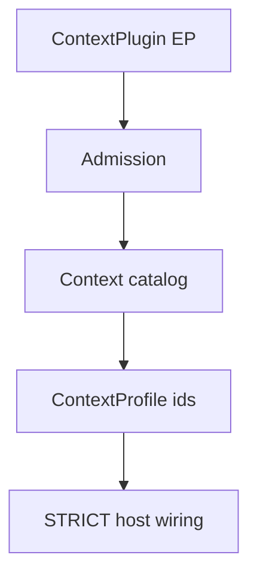

# Context Plugin Author Guide

**Status:** canonical developer guide · **PLATFORM-PLUGIN-DOCS-4**
**Architecture owner:** [`docs/project/architecture/CONTEXT_ENGINEERING.md`](../../architecture/CONTEXT_ENGINEERING.md)
**Platform catalog:** [`EXTENSION_AUTHOR_GUIDE.md`](EXTENSION_AUTHOR_GUIDE.md) · [`PLATFORM_PLUGINS.md`](../../architecture/PLATFORM_PLUGINS.md)

This guide is the **implementation workflow** for third-party Context plugins. [`CONTEXT_ENGINEERING.md`](../../architecture/CONTEXT_ENGINEERING.md) remains authoritative for assembly semantics, budgets, and degradation.

---

## Developer journey (D1–D16)

| D | Topic | Status | Section |
|---|-------|--------|---------|
| D1 | Purpose | COMPLETE | §1 |
| D2 | Public contract | COMPLETE | §2 |
| D3 | Minimal implementation | COMPLETE | §3 |
| D4 | External package | COMPLETE | §4 |
| D5 | Local / host path | COMPLETE | §5 |
| D6 | Configuration | COMPLETE | §6 |
| D7 | Secrets / credentials | N/A | §7 |
| D8 | DI / composition | COMPLETE | §8 |
| D9 | Registration / discovery | COMPLETE | §9 |
| D10 | Qualification | COMPLETE | §10 |
| D11 | Runtime use | COMPLETE | §11 |
| D12 | Lifecycle / cleanup | N/A | §12 |
| D13 | Failure behavior | COMPLETE | §13 |
| D14 | Testing | COMPLETE | §14 |
| D15 | Production checklist | COMPLETE | §15 |
| D16 | Troubleshooting | COMPLETE | §16 |

**Overall:** **COMPLETE** for the external-EP author path. Local registration uses `register_context_plugin()`; scaffold CLI is `new-context-bundle` (§5).

---

## 1. Purpose - Context vs RAG and adjacent surfaces

Context plugins contribute **candidate fragments** to the Context Engineering (CE) assembly pipeline. They register `ContextSourceProvider` instances (and optional ranker, allocator, formatter, or validator overrides) into a per-request `ContextPluginRegistry`.

Context plugins are **not**:

| Surface | Role |
|---------|------|
| **RAG chunker** | Index-time document splitting (`BaseChunkingStrategy`) |
| **RAG retriever** | Candidate retrieval from vector/graph stores (`BaseRetriever`) |
| **RAG reranker** | Post-retrieval scoring (`BaseReranker`) |
| **Tool** | LLM-invokable operations (`ToolPlugin`) |
| **Memory store** | Durable session/profile storage factories (`UserProfileStorePlugin`, …) |

### Where Context fits in the pipeline

```text
ContextProfile.context_plugin_ids
  → bootstrap_context_catalog()          # catalog: plugin_id → register fn
  → materialize_context_plugin_registry() # enabled plugins → ContextPluginRegistry
  → ContextEngine.assemble(request)       # collect → rank → budget → format → validate
  → AssembledContext → LLM messages
```

RAG retrieval runs **upstream** of CE: retrieved chunks arrive as runtime handles (for example `RAG_CHUNKS_HANDLE`) consumed by builtin providers such as `builtin.rag`. A Context plugin may add **additional** fragments; it does not replace the RAG stack.

**Shared truths (all Platform Plugin surfaces):**

- `installed` ≠ `discovered` ≠ `enabled` ≠ `production-qualified`
- Third-party plugins run as **trusted in-process Python**
- Qualification is **host-owned semantic approval**, not cryptographic attestation
- Secrets do not belong in plugin metadata or entry-point values
- There is **no universal Platform Plugin lifecycle/unload manager**

---

## 2. Public contract

Import from `intergrax.context`:

| Symbol | Module | Role |
|--------|--------|------|
| `ContextPlugin` | `intergrax.context.plugin` | Class protocol: `plugin_id`, `plugin_version`, `plugin_description`, `register(registry)` |
| `register_context_plugin()` | `intergrax.context.plugin` | Register a `ContextPlugin` class in the **global catalog** |
| `ContextPluginRegistry` | `intergrax.context.registry` | Mutable per-engine registry of providers and pipeline overrides |
| `ContextPluginEntry` | `intergrax.context.registry` | Catalog entry: `plugin_id`, `version`, `description`, `register` callable |
| `register_context_plugin_entry()` | `intergrax.context.registry` | Low-level catalog registration |
| `get_context_plugin()` / `list_context_plugin_ids()` | `intergrax.context.registry` | Catalog introspection |
| `UnknownContextPluginError` | `intergrax.context.registry` | Raised for unknown plugin ids |
| `ContextSourceProvider` | `intergrax.context.protocols` | Provider protocol: `provider_id`, `supported_sources`, `collect(...)` |
| `bootstrap_context_catalog()` | `intergrax.context.bootstrap` | Register shipped + optional EP/explicit plugins |
| `materialize_context_plugin_registry()` | `intergrax.context.bootstrap` | Build `ContextPluginRegistry` from enabled plugin ids |

Entry point group (setuptools):

```text
intergrax.context
```

Shipped builtin target (reference only):

```toml
[project.entry-points."intergrax.context"]
builtin = "intergrax.context.providers.builtin:BuiltinContextPlugin"
```

### ContextProfile (Tier-3 enablement)

`ContextProfile` on `ApplicationEnvironmentProfile` selects which catalog plugins are materialized:

| Field | Role |
|-------|------|
| `context_plugin_ids` | Enabled plugin ids (normalized to lowercase). Empty → defaults to `["intergrax.builtin"]` at wiring time |
| `engine_preset` | `default`, `codebase`, `regulated_minimal`, `explore_child`, or `custom` |
| `engine_ref` | Custom engine import path when `engine_preset == "custom"` |
| `assembly_options` | `TaskContextAssemblyOptions` (budget, history inclusion, …) |
| `budget_policy` | Optional `ContextBudgetPolicy` override |
| `decision` | `ContextDecisionProfile` (RAG/LTM preference flags) |
| `enable_rag` / `enable_websearch` | Feature toggles consumed by builtin providers |

`context_plugin_ids` controls **which plugins register providers**, not individual provider ids inside a plugin.

---

## 3. Minimal implementation

A Context plugin registers one or more `ContextSourceProvider` instances. Minimal copyable example (documentation pattern - same shape as `tests/unit/context/test_context_plugin_registry.py`):

```python
from intergrax.context.contracts import (
    ContextAssemblyRequest,
    ContextFragment,
    ContextFragmentSource,
    ContextProviderContext,
)
from intergrax.context.plugin import ContextPlugin
from intergrax.context.registry import ContextPluginRegistry


class _AcmeStubProvider:
    @property
    def provider_id(self) -> str:
        return "acme.stub"

    @property
    def supported_sources(self) -> frozenset[ContextFragmentSource]:
        return frozenset({ContextFragmentSource.CUSTOM})

    async def collect(
        self,
        request: ContextAssemblyRequest,
        ctx: ContextProviderContext,
    ) -> list[ContextFragment]:
        return [
            ContextFragment(
                fragment_id="acme-stub-1",
                source=ContextFragmentSource.CUSTOM,
                source_id="acme",
                content="Acme context contribution",
                token_estimate=8,
                relevance_score=0.5,
                freshness_score=0.5,
                confidence_score=0.5,
                mandatory=False,
            )
        ]


class AcmeContextPlugin:
    @classmethod
    def plugin_id(cls) -> str:
        return "acme.context"

    @classmethod
    def plugin_version(cls) -> str:
        return "0.1.0"

    @classmethod
    def plugin_description(cls) -> str:
        return "Acme custom context source"

    @classmethod
    def register(cls, registry: ContextPluginRegistry) -> None:
        registry.add_provider(_AcmeStubProvider())
```

**Provider rules:**

- `provider_id` must be unique within the materialized registry (duplicate → `ValueError`)
- `collect` must return valid `ContextFragment` values with correct `ContextFragmentSource`
- Use `ContextFragmentSource.CUSTOM` for third-party material unless your plugin intentionally mirrors a builtin source enum
- Optional: `registry.set_ranker(...)`, `set_allocator(...)`, `set_formatter(...)`, `set_validator(...)`

---

## 4. External package

```text
my-intergrax-context-plugin/
├── pyproject.toml
└── src/
    └── my_intergrax_context_plugin/
        ├── __init__.py
        └── plugin.py          # AcmeContextPlugin from §3
```

```toml
[build-system]
requires = ["hatchling"]
build-backend = "hatchling.build"

[project]
name = "my-intergrax-context-plugin"
version = "0.1.0"
requires-python = ">=3.12,<3.13"
dependencies = ["Intergrax-ai==0.1.0"]

[tool.hatch.build.targets.wheel]
packages = ["src/my_intergrax_context_plugin"]

[project.entry-points."intergrax.context"]
acme = "my_intergrax_context_plugin.plugin:AcmeContextPlugin"
```

**Discovery is opt-in by default.** Installing the wheel makes the plugin `installed` only. The host must enable discovery (`discover_entry_points=True` on `bootstrap_context_catalog`, `INTERGRAX_DISCOVER_PLUGINS=true`, or application wiring that calls `bootstrap_application_context_catalog(discover_entry_points=True)`).

Enable the plugin on the host profile:

```python
from intergrax.applications.contracts.environment_profile import ContextProfile

context_profile = ContextProfile(
    context_plugin_ids=["acme.context", "intergrax.builtin"],
)
```

**Installable reference:** [`examples/platform_plugins/intergrax_reference_enterprise_plugin/`](../../../../examples/platform_plugins/intergrax_reference_enterprise_plugin/) - Context EP `reference_enterprise` (multi-capability package; proof: `tests/unit/platform_plugins/test_reference_enterprise_plugin.py`).

---

## 5. Local / host path

Context supports **explicit in-process registration** without a separate wheel. Scaffold a repository-local plugin (same public `ContextPlugin` contract as an external wheel):

```text
uv run python -m intergrax.scaffold new-context-bundle acme_context
```

Output: `intergrax/context/providers/acme_context/` (`plugin.py`, `bundle.py`, `USAGE.md`).

**Canonical local registration** (generated helper uses this path):

```python
from intergrax.context.plugin import register_context_plugin
from intergrax.context.providers.acme_context.plugin import AcmeContextContextPlugin

register_context_plugin(AcmeContextContextPlugin)
```

**Entry-point delivery** is optional packaging, not a second contract. Wheel install does not enable the plugin. Example:

```toml
[project.entry-points."intergrax.context"]
acme_context = "intergrax.context.providers.acme_context.plugin:AcmeContextContextPlugin"
```

For EP mode: install the package, enable discovery (`discover_entry_points=True` / `INTERGRAX_DISCOVER_PLUGINS=true`), **and** list the plugin id on `ContextProfile`. `installed` ≠ `enabled`.

Manual composition below remains valid for hosts that do not use the scaffold.

### Option A - register before bootstrap

```python
from intergrax.context.bootstrap import bootstrap_context_catalog
from intergrax.context.plugin import register_context_plugin

from my_host.extensions.acme_context import AcmeContextPlugin

register_context_plugin(AcmeContextPlugin)
bootstrap_context_catalog(discover_entry_points=False)
```

### Option B - pass explicit classes to bootstrap

```python
bootstrap_context_catalog(
    context_plugins=[AcmeContextPlugin],
    discover_entry_points=False,
)
```

### Option C - application wiring (Tier-3)

`intergrax.applications._shared.context_wiring` resolves the registry from `ApplicationEnvironmentProfile`:

```python
from intergrax.applications._shared.context_wiring import (
    bootstrap_application_context_catalog,
    resolve_context_plugin_registry_from_environment,
)

bootstrap_application_context_catalog(discover_entry_points=True)
registry = resolve_context_plugin_registry_from_environment(env)
```

Local Context authoring is host-composition: scaffold with `new-context-bundle`, then call `register_context_plugin()` or pass `context_plugins=` explicitly. There is no separate local plugin contract and no `extensions/` runtime mechanism.

---

## 6. Configuration

```text
ApplicationEnvironmentProfile.context_profile (ContextProfile)
  → context_plugin_ids select catalog entries
  → resolve_context_plugin_registry_from_environment(env)
  → materialize_context_plugin_registry(plugin_ids)
  → resolve_context_engine_from_environment(env)  # DefaultNexusContextEngine, presets, …
  → ContextManager on task/graph hot path
```

| Stage | API |
|-------|-----|
| Catalog bootstrap | `bootstrap_context_catalog(register_shipped=True, discover_entry_points=…)` |
| Validation | `validate_context_plugin_ids(env, production_mode=…)` - lab fails closed on unknown ids; production warns |
| Registry materialization | `materialize_context_plugin_registry(plugin_ids)` |
| Engine | `resolve_context_engine_from_environment(env)` |

Default when `context_plugin_ids` is empty: wiring uses `["intergrax.builtin"]`.

---

## 7. Secrets and credentials

Context plugins typically consume **runtime handles** on `ContextProviderContext` (session history, RAG chunks, tool outputs, …). They should not read arbitrary environment variables for secrets.

If a provider needs backend access, receive dependencies through constructor injection when the host registers the provider - not via hidden globals. Credentials belong in host/domain configuration (`IntegrationProfile`, application settings), not in entry-point metadata.

---

## 8. DI and composition

`ContextPlugin.register(registry)` receives a fresh `ContextPluginRegistry` per materialization. The host/engine owns:

- `ContextAssemblyRequest` (task, step, scope)
- `ContextProviderContext` handles populated by Nexus/runtime bridges
- Budget policy and LLM adapter (for token counting / formatting)

The plugin owns:

- Provider implementation and any plugin-local client state
- Optional pipeline overrides registered on the same registry instance

There is no generic service locator. Providers must not import Tier-3 application modules.

---

## 9. Registration and discovery

Context plugins flow through catalog admission and profile selection (D9):



*Interpretation:* admission populates the catalog; `ContextProfile.context_plugin_ids` selects materialized plugins; `ApplicationEnvironmentWiring` does **not** expose a final public context registry/engine artifact - that is a documented maturity boundary, not a bootstrap bug.

```python
from intergrax.context.bootstrap import bootstrap_context_catalog

result = bootstrap_context_catalog(
    register_shipped=True,           # idempotent BuiltinContextPlugin
    discover_entry_points=True,      # opt-in EP scan
    context_plugins=(),              # explicit classes
    on_conflict="error",             # "skip" | "override"
)
# result.context_plugins - count registered this call
# result.catalog_plugin_ids - all ids in catalog
```

| Concern | Behavior |
|---------|----------|
| Duplicate `plugin_id` in catalog | `ValueError` unless `override=True` on `register_context_plugin` |
| EP name conflict | `PluginConflictError` (via `register_plugins`) |
| EP discovery default | **Off** - requires explicit flag or `INTERGRAX_DISCOVER_PLUGINS=true` |
| Shipped builtin | Always `intergrax.builtin` via `BuiltinContextPlugin` |

---

## 10. Qualification

| Layer | Status |
|-------|--------|
| Public EP (`intergrax.context`) | **Exists** |
| Platform qualification primitives | **Exist** (`check_platform_compatibility`, production gate hooks) |
| Domain-specific Context production qualification | **Varies by host** - CE rollout is domain-owned; not every host enforces Context-specific production qualification today |

Compatible metadata ≠ production-qualified. Hosts may warn on unknown plugin ids in production without blocking (see `validate_context_plugin_ids`).

---

## 11. Runtime use

End-to-end path for a custom plugin:

```text
1. pip install my-intergrax-context-plugin          # installed
2. host enables discovery                           # discovered → catalog
3. ContextProfile(context_plugin_ids=["acme.context"])
4. resolve_context_plugin_registry_from_environment(env)
5. AcmeContextPlugin.register(registry) adds providers
6. ContextEngine.assemble() calls provider.collect()
7. Fragments ranked, budgeted, formatted → model context
```

Builtin `builtin.rag` collects RAG chunks from runtime handles when `enable_rag=True` on `ContextProfile`. Custom plugins add parallel fragment sources; they do not hook into RAG bootstrap.

---

## 12. Lifecycle and cleanup

No universal Platform Plugin unload API. Catalog state is process-global (`register_context_plugin_entry`). Tests use `reset_context_catalog_bootstrap_for_tests()` and `clear_context_plugin_catalog()`.

Provider instances live for the lifetime of the materialized `ContextPluginRegistry` attached to the context engine. Hosts recreate engines on profile change.

---

## 13. Failure behavior

| Failure | Result |
|---------|--------|
| EP discovery disabled | Plugin stays `installed` but not in catalog |
| Duplicate `plugin_id` | `ValueError` at registration |
| Unknown id in `context_plugin_ids` (lab) | `ValueError` from `validate_context_plugin_ids` |
| Unknown id in `context_plugin_ids` (production) | Warning logged; assembly may proceed |
| Invalid `ContextFragment` | Validator/engine error on assemble |
| Provider raises in `collect` | Propagates to engine assemble (observable failure) |
| Plugin in catalog but not in `context_plugin_ids` | Not materialized - absent from assembled context |

---

## 14. Testing

| Test | Path |
|------|------|
| Catalog bootstrap | `tests/unit/context/test_context_catalog_bootstrap.py` |
| Registry + `register_context_plugin` | `tests/unit/context/test_context_plugin_registry.py` |
| Tier-3 wiring validation | `tests/unit/applications/test_context_plugin_wiring.py` |
| ContextProfile bridge | `tests/unit/applications/test_context_runtime_bridge.py` |

Minimal author test pattern:

```python
from intergrax.context.bootstrap import (
    bootstrap_context_catalog,
    materialize_context_plugin_registry,
    reset_context_catalog_bootstrap_for_tests,
)
from intergrax.context.plugin import register_context_plugin

def test_acme_plugin_materializes_provider():
    reset_context_catalog_bootstrap_for_tests()
    register_context_plugin(AcmeContextPlugin)
    registry = materialize_context_plugin_registry(["acme.context"])
    assert registry.get_provider("acme.stub") is not None
```

---

## 15. Production checklist

- [ ] Stable lowercase `plugin_id` and unique `provider_id` values
- [ ] Discovery enabled in host bootstrap when using external wheels
- [ ] `context_plugin_ids` lists every required plugin (include `intergrax.builtin` when builtins are needed)
- [ ] `collect` is async-safe and bounded (no unbounded memory or network without timeouts)
- [ ] Fragments use correct `ContextFragmentSource` and token estimates
- [ ] No secrets in fragment content or metadata
- [ ] Contract tests for fragment shape and idempotency
- [ ] Production host validates unknown plugin ids per your policy

---

## 16. Troubleshooting

| Symptom | Check |
|---------|-------|
| Plugin not in catalog | EP discovery off? Package installed in same venv as host? |
| `Unknown context plugin id` | Call `bootstrap_context_catalog` before validation; verify `plugin_id` spelling (lowercase) |
| Provider missing from assembled context | Plugin id not in `context_plugin_ids`; or `collect` returned `[]`; or budget/ranker excluded fragments |
| `Context provider '…' is already registered` | Duplicate `provider_id` across plugins materialized together - use unique ids or single plugin |
| Builtin providers missing | Ensure `intergrax.builtin` is in `context_plugin_ids` when overriding defaults |
| RAG content missing | `enable_rag=False` on `ContextProfile`, or RAG stack not wired - this is not fixed by a Context plugin alone |

---

**Next:** [`EXTENSION_AUTHOR_GUIDE.md`](EXTENSION_AUTHOR_GUIDE.md) · [`CONTEXT_ENGINEERING.md`](../../architecture/CONTEXT_ENGINEERING.md)
