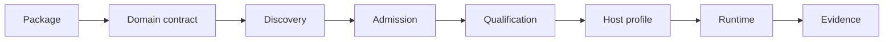
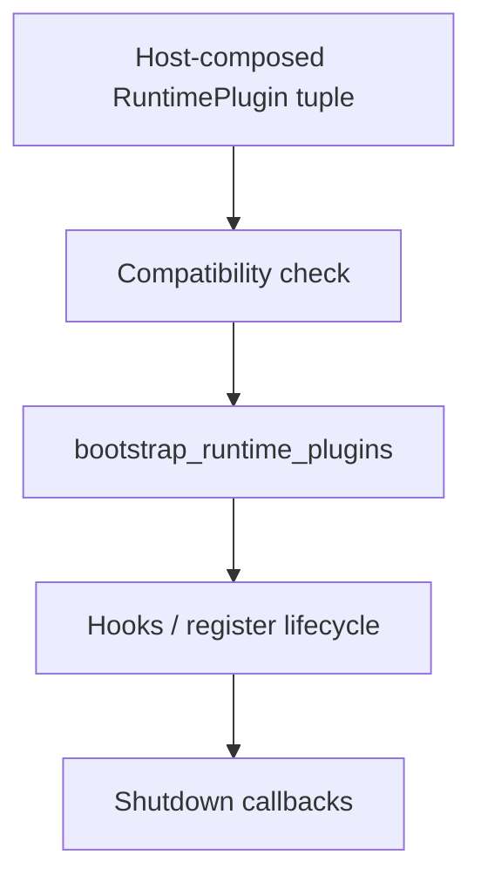
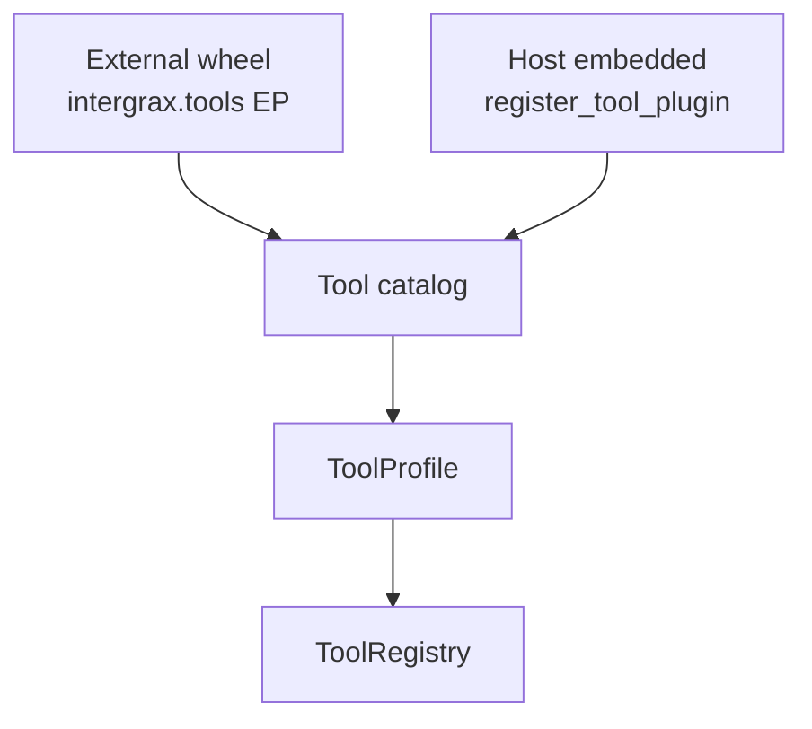

# Extension Author Guide (Tier-0 Plugin Catalogs)

> **Application dependencies:** each Tier-3 host owns applications/<app>/pyproject.toml (Intergrax workspace package + selected extras). Sync with uv sync --project applications/<app>. Canon: [docs/project/architecture/APPLICATION_DEPENDENCY_MODEL.md](../../architecture/APPLICATION_DEPENDENCY_MODEL.md).

**Last updated:** 2026-09-02 · PLUGIN-PLATFORM-DOCUMENTATION-FINALIZATION-1

Intergrax exposes four **core plugin catalogs** plus opt-in RAG component entry points. Shipped providers and third-party pip packages register through the same discovery protocol.

| Layer | Entry point group | Protocol | Register function | Status |
|-------|-------------------|----------|-------------------|--------|
| Integration | `intergrax.integrations` | `IntegrationPlugin` | `register_integration_plugin()` | **Done** |
| Tool | `intergrax.tools` | `ToolPlugin` | `register_tool_plugin()` | **Done** |
| Skill | `intergrax.skills` | `SkillPlugin` | `register_skill_plugin()` | **Done** |
| Context | `intergrax.context` | `ContextPlugin` | `register_context_plugin()` | **Public EP** - qualification rollout domain-owned ([CE-2](../../maintainers/plans/CONTEXT_ENGINEERING.md)) |
| RAG chunker | `intergrax.rag.chunkers` | `BaseChunkingStrategy` | RAG bootstrap registry | **Done** |
| RAG retriever | `intergrax.rag.retrievers` | `BaseRetriever` | RAG bootstrap registry | **Done** |
| RAG reranker | `intergrax.rag.rerankers` | `BaseReranker` | RAG bootstrap registry | **Done** |

**Architecture:** Integration → Tool → Skill → Agent; **Context Engineering** assembles LLM windows from all sources - see [`architecture/CONTEXT_ENGINEERING.md`](../../architecture/CONTEXT_ENGINEERING.md) · [plan CE-EXT](../../maintainers/plans/CONTEXT_ENGINEERING.md). **Invariants:** [`SYSTEM_INVARIANTS.md`](SYSTEM_INVARIANTS.md) - Tier-0/Tier-2 boundaries (`SYS-INV-*`).

**Platform design (advanced):** [`architecture/PLATFORM_PLUGINS.md`](../../architecture/PLATFORM_PLUGINS.md) - taxonomy, trust model, §20.3 matrix. You do not need PLUGIN program history to pick a surface below.

---

## Start here - choose your extension surface

> **I want to extend Intergrax. Where do I start?**
> 1. Pick what you want to add or replace (below).
> 2. [Choose a delivery model](#choose-delivery-model--external-package-vs-host-embedded).
> 3. Open the **Next guide** from the [canonical 12-surface matrix](#canonical-12-surface-author-matrix).

### What do you want to add or replace?

| I need to… | Extension surface | Not this (adjacent concept) |
|------------|-------------------|-----------------------------|
| Connect a new database, service, or backend | **Integration** | **Tool** - integrations are infrastructure providers; tools are LLM-callable operations that may *consume* integrations via DI |
| Expose a new LLM-callable operation | **Tool** | **Integration** - backend wiring, not the agent-facing operation; **Skill** - a reusable capability *bundle*, not a single executable handler |
| Package reusable tool / prompt / policy capability for agents | **Skill** | **Tool** - skills describe requirements and bundles; tools are invoked at runtime |
| Contribute information to prompt / context construction | **Context** | **RAG** - context plugins assemble model windows; RAG surfaces customize retrieval-pipeline components |
| Replace or profile memory / session storage | **Memory store** | **Integration** vector store - memory plugins swap store adapters; host still owns integration backends |
| Customize document chunking | **RAG chunker** | **Context** - chunking is an indexing-time RAG component |
| Customize retrieval | **RAG retriever** | **Context** - retrievers fetch ranked candidates; context plugins merge sources into the window |
| Customize reranking | **RAG reranker** | **RAG retriever** - reranking is a post-retrieval scoring step |
| Contribute vendor / domain knowledge sources | **Vendor Knowledge provider** | **RAG component** - VK is a host-composed knowledge-source facade, not a chunker/retriever/reranker EP |
| Inspect or block runtime operations at security hook points | **Security defense** | **Policy rule** - defenses run at `HookPoint`s in the security middleware path |
| Add declarative or runtime policy rule handling | **Policy rule handler** | **Security defense** - policy rules are evaluated by `PolicyEngine`; they do not replace hook middleware |
| Define a new tool invocation execution pattern / mode | **Tool invocation pattern** | **Tool** - patterns orchestrate *how* tool batches execute; tools define *what* runs |

---

## Choose delivery model - external package vs host-embedded

### Discovery and activation (read before packaging)

> **`installed` ≠ `discovered` ≠ `enabled` ≠ `production-qualified`**

`pip install` does **not** activate a plugin. For setuptools entry-point surfaces, discovery is **opt-in**: the host must call `bootstrap_catalogs(discover_entry_points=True)`, enable domain-specific discovery flags, or set `INTERGRAX_DISCOVER_PLUGINS=true` where application wiring supports it (default **off**). See §1 and §16.1.

Qualification is host-owned **semantic** approval - not cryptographic attestation. Compatible metadata ≠ production-qualified.

### Trust model

Third-party plugins today run as **trusted in-process Python** in the host process:

- Installing a package is a **trust decision** - there is no sandbox or process isolation.
- Qualification records semantic evidence approved by the host/domain - not package signing or attestation.
- Secrets and credentials stay in **host/domain configuration** (`IntegrationProfile`, `ToolWiringContext`, bindings) - never in plugin metadata or entry-point values.

Canon: [`architecture/PLATFORM_PLUGINS.md`](../../architecture/PLATFORM_PLUGINS.md) §16 · §15 below.

### External package

Use when the extension is **reusable across applications**, **independently versioned**, and distributed as a Python package / wheel discovered via setuptools entry points.

```text
package
  → public domain contract (ToolPlugin, IntegrationPlugin, …)
  → setuptools entry point (intergrax.tools, intergrax.integrations, …)
  → pip install (installed only)
  → host enables discovery (discovered)
  → host profile selects capability (enabled)
  → compatibility / qualification where applicable (production-qualified)
  → host configuration + domain DI
  → materialization / runtime
```

Working Tools reference: §16.1 · [`examples/platform_plugins/intergrax_reference_tool_plugin/`](../../../../examples/platform_plugins/intergrax_reference_tool_plugin/).

### Host-embedded / local extension

Use when the code **belongs to one application/host**, does not need an independent package lifecycle, and the domain exposes an explicit registration or composition path.

```text
local .py module
  → same domain contract
  → host-owned qualification (HOST_EMBEDDED_EXTENSION)
  → explicit registration or host builder composition
  → domain wiring / profiles
  → runtime
```

Working Tools reference: §16.2 · [`examples/platform_plugins/local_embedded_tool_extension/`](../../../../examples/platform_plugins/local_embedded_tool_extension/).

**Not all twelve surfaces have equivalent documented local author paths.** See the matrix below and architecture §20.3.

| Local path status | Surfaces |
|-------------------|----------|
| **Documented explicit registration** | Integrations (`register_integration_plugin`), Tools (`register_tool_plugin` + scaffold `extensions/`), Skills (`register_skill_plugin`) |
| **Host composition possible; incomplete developer path** | Context (`register_context_plugin` - no scaffold hook yet), Memory stores (host invokes factory callables / `MemoryPlatformWiring`), Vendor Knowledge (host builder + bindings - not Tier-0 catalog registration) |
| **External-EP-first / advanced host composition only** | RAG chunker, RAG retriever, RAG reranker (registry `register` APIs - see RAG guide §0.2), Security defense, Policy rule handler, Tool invocation pattern |

---

## Understand the lifecycle

Every surface follows the same coordination story at the package boundary (details vary by domain):



Canon: [`architecture/PLATFORM_PLUGINS.md`](../../architecture/PLATFORM_PLUGINS.md) · `installed` ≠ `discovered` ≠ `admitted` ≠ `selected` ≠ `production-qualified` ≠ `active`.

**Canonical Tier-3 composition:** `wire_application_environment(env, manifest=...)` wires Security, Context, Memory, Tools, Skills, and Policy from `ApplicationEnvironmentProfile` and returns `ApplicationPlatformPluginEvidence` on the wiring bundle.

---

## What production-ready means

Production-ready for a Platform Plugin capability is **host-owned** and combines:

| Gate | Meaning |
|------|---------|
| **Compatibility** | Optional package/platform version check (`check_platform_compatibility`) - compatible ≠ qualified |
| **Admission** | Domain loader accepted the EP or explicit registration (`DomainPluginLoadReport.accepted`) |
| **Qualification** | Host/domain semantic evidence (`evaluate_package_production_admission`, domain suites) - **not** automatic for every surface |
| **Host activation** | Profile selects capability ids; materialization runs (`ToolProfile`, `MemoryProfile`, `ContextProfile`, …) |
| **STRICT posture** | Bad `critical_bootstrap_acceptable` report stops bootstrap in STRICT; non-STRICT may preserve evidence and continue |

Policy STRICT with production qualification bundle is the strongest current reference surface. Universal production qualification rollout across all domains is a **future maturity** target.

---

## Debugging plugin activation

| Symptom | Inspect |
|---------|---------|
| Plugin not found | Discovery flag / EP group name / `INTERGRAX_DISCOVER_PLUGINS` |
| Found but rejected | `DomainPluginLoadReport.rejected` |
| Failed import | `DomainPluginLoadReport.failed` |
| Accepted but inactive | Host profile ids (`ToolProfile`, `MemoryProfile`, `ContextProfile`, …) |
| STRICT stops bootstrap | `critical_bootstrap_acceptable` on domain report |
| Qualified package rejected | Compatibility result + qualification evidence |

Tier-3 aggregate: `ApplicationEnvironmentWiring.platform_plugin_evidence` (Security, Policy, Context, Memory today).

---

## Canonical 12-surface author matrix

All canonical setuptools entry-point surfaces (architecture §20.1). One row per surface - use **Next guide** for step-by-step authoring.

| Surface | Use when | Public contract | External EP | Local / host path | Config / DI | Next guide |
|---------|----------|-----------------|-------------|-------------------|-------------|------------|
| Integration | New backend / provider category | `IntegrationPlugin` | `intergrax.integrations` | `register_integration_plugin()` | `IntegrationProfile` + `IntegrationManifest.env_prefix` | [§2](#2-external-integration-plugin) · [§16.4–§16.5](#164-external-integration-package-quickstart) · [`INTEGRATIONS.md`](../../architecture/INTEGRATIONS.md) |
| Tool | New LLM-invokable operation | `ToolPlugin` | `intergrax.tools` | `register_tool_plugin()` + scaffold `extensions/` | `ToolWiringContext` | [§3](#3-external-tool-plugin) · [§16](#16-dual-mode-developer-quickstarts-platform-plugin-8) · [`TOOLS.md`](../../architecture/TOOLS.md) |
| Skill | Reusable agent capability bundle | `SkillPlugin` | `intergrax.skills` | `register_skill_plugin()` | `SkillProfile` | [§4](#4-external-skill-plugin) · [§16.6–§16.7](#166-external-skill-package-quickstart) · [`SKILLS.md`](../../architecture/SKILLS.md) |
| Context | Custom context / prompt material | `ContextPlugin` | `intergrax.context` | `register_context_plugin()` - **no scaffold hook yet** | `ContextProfile` | [`CONTEXT_PLUGIN_AUTHOR_GUIDE.md`](CONTEXT_PLUGIN_AUTHOR_GUIDE.md) · multi-capability example: [`intergrax_reference_enterprise_plugin`](../../../../examples/platform_plugins/intergrax_reference_enterprise_plugin/) |
| Memory store | Swap profile / session / episodic storage | `UserProfileStorePlugin` / `SessionStoragePlugin` / `SessionTurnIndexStorePlugin` | `intergrax.memory_stores` | Host factory / `MemoryPlatformWiring` - **no `register_*` helper** | `MemoryProfile` + host `**kwargs` | [`MEMORY_STORE_PLUGIN_AUTHOR_GUIDE.md`](MEMORY_STORE_PLUGIN_AUTHOR_GUIDE.md) · [`MEMORY.md`](../../architecture/MEMORY.md) §5.3 |
| RAG chunker | Custom chunking strategy | `BaseChunkingStrategy` | `intergrax.rag.chunkers` | Advanced host registry composition - **external-EP-first** | `RagProfile` + bootstrap kwargs | [`RAG_EXTENSION_GUIDE.md`](RAG_EXTENSION_GUIDE.md) · [`RAG.md`](../../architecture/RAG.md) |
| RAG retriever | Custom retrieval implementation | `BaseRetriever` / `BaseRetrieverPlugin` | `intergrax.rag.retrievers` | Advanced host registry composition - **external-EP-first** | `RagProfile` + vector store bindings | [`RAG_EXTENSION_GUIDE.md`](RAG_EXTENSION_GUIDE.md) · [`RAG.md`](../../architecture/RAG.md) |
| RAG reranker | Custom reranking | `BaseReranker` / `BaseRerankerPlugin` | `intergrax.rag.rerankers` | Advanced host registry composition - **external-EP-first** | `RagProfile` + bootstrap kwargs | [`RAG_EXTENSION_GUIDE.md`](RAG_EXTENSION_GUIDE.md) · [`RAG.md`](../../architecture/RAG.md) |
| Vendor Knowledge | External knowledge source contributions | `VendorKnowledgeProviderContribution` | `intergrax.vendor_knowledge.providers` | Host builder composition - **not Tier-0 catalog registration** | `KnowledgeSourceBinding` + tenant scope | [`VENDOR_KNOWLEDGE_PLUGIN_AUTHOR_GUIDE.md`](VENDOR_KNOWLEDGE_PLUGIN_AUTHOR_GUIDE.md) · [`intergrax_reference_vendor_knowledge_plugin`](../../../../examples/platform_plugins/intergrax_reference_vendor_knowledge_plugin/) |
| Security defense | Runtime inspection at `HookPoint`s | `SecurityDefensePlugin` | `intergrax.security_defenses` | `register_security_defense_plugin()` + profile ids - advanced host composition | `ApplicationSecurityProfile` | [`SECURITY_DEFENSE_PLUGIN_AUTHOR_GUIDE.md`](SECURITY_DEFENSE_PLUGIN_AUTHOR_GUIDE.md) · [`UNIFIED_EXECUTION_RUNTIME.md`](../../architecture/UNIFIED_EXECUTION_RUNTIME.md) |
| Policy rule handler | Custom policy evaluation handlers | `PolicyRuleHandler` | `intergrax.policy_rules` | `PolicyRuleRegistry.register()` + explicit `load_policy_rule_plugin_report()` | `PolicyRulesProfile` / YAML bundle | [`POLICY_RULE_PLUGIN_AUTHOR_GUIDE.md`](POLICY_RULE_PLUGIN_AUTHOR_GUIDE.md) · [`AGENT_CREATION_GUIDE.md` Appendix H](AGENT_CREATION_GUIDE.md#appendix-h--governance-policy--observability-control-plane) |
| Tool invocation pattern | Custom tool batch orchestration mode | `ToolInvocationPattern` | `intergrax.tool_invocation_patterns` | `RuntimeConfig.tool_invocation_pattern` instance override | `ToolInvocationMode` | [`TOOL_INVOCATION_PATTERN_AUTHOR_GUIDE.md`](TOOL_INVOCATION_PATTERN_AUTHOR_GUIDE.md) · [`TOOLS.md`](../../architecture/TOOLS.md) |

---

## 0. Tier-3 environment vs Tier-2 agent (H-APP, DX)

**LangGraph is not required.** Intergrax ships its own Nexus loop, `HarnessApplication`, and `AgentGraph`. The table below is a **conceptual mapping** for authors coming from LangGraph - not a runtime dependency. Optional `intergrax.supervisor.build_langgraph_from_plan` needs the extra `pip install 'Intergrax-ai[langgraph-legacy]'`.

| LangGraph (analogy) | Intergrax |
|---------------------|-----------|
| `State` fields | `AgentContract` + step metadata |
| Node function | `IntergraxAgent` `@step` / `run_step` |
| Conditional edge | `decide_after_step` → `AgentDecision` |
| `StateGraph.compile()` | `AgentGraph.build()` → `ApplicationGraphSpec` |
| `app.invoke()` | `HarnessApplication.build_fastapi()` + `POST …/run` |

**Responsibility matrix**

| Concern | Agent (`agents`) | Environment (`applications` or `HarnessApplication`) |
|---------|-------------------|--------------------------------------------------------|
| Business logic, UAEP steps | Yes | No |
| Tool/skill allow-list on contract | Yes | Enables catalogs via profiles |
| Integration backends (Postgres, S3, …) | No | `IntegrationProfile` / presets |
| Nexus loop, retry, graph routing | No | `ApplicationEnvironmentProfile` (§22.6 nested bundles - same root) |
| HTTP/MCP host, auth, tenant | No | Host factory / `HarnessApplication` |

| Belongs in `applications/<app>` | Belongs in `agents/<name>` |
|----------------------------------|-----------------------------|
| `ApplicationManifest`, `ApplicationEnvironmentProfile` | `Agent`, UAEP steps, domain prompts |
| `wire_application_environment()`, host `factory.py` | `AgentContract`, skill manifests on contract |
| Tool/skill **profiles** (which catalog ids are enabled) | Business logic and step graphs |
| Policy bundle, identity, observability profiles | No direct `intergrax.integrations` / `intergrax.tools` imports |

**Forbidden:** `getattr`/`setattr` on manifests in host wiring; Tier-2 agents importing integration or tool modules (use `scripts/maintenance/check_agent_registry_bypass.py`).

Scaffold: `python -m intergrax.scaffold new-application <name>` emits `host/environment_profile.py` and unified wiring.

---

## 1. Application bootstrap

```python
from intergrax.core.catalog_bootstrap import bootstrap_catalogs

bootstrap_catalogs(
    register_shipped=True,
    integration_preset="full",       # "core" = lab essentials (~12 slugs)
    tool_bundle_ids=None,            # e.g. ("rag", "websearch") for lazy catalog
    skill_bundle_ids=None,           # e.g. ("harness", "legal")
    discover_entry_points=True,
    integration_plugins=(MyIntegrationPlugin,),
    tool_plugins=(MyToolPlugin,),
    skill_plugins=(MySkillPlugin,),
)
```

Tier-3 wiring helpers call this automatically:

- `bootstrap_application_integration_catalog()` - integrations only (`applications/_shared/integration_wiring.py`)
- `build_application_tool_wiring()` - passes `tool_bundle_ids` from `ToolProfile` when set
- `build_application_skill_wiring()` - passes `skill_bundle_ids` from `SkillProfile` when set

Optional env: `INTERGRAX_DISCOVER_PLUGINS=true` enables entry-point discovery when wiring helpers run (default off).

### Production path matrix

| Layer | Shipped registration | External package | Runtime materialization |
|-------|---------------------|------------------|-------------------------|
| Integration | `register_from_manifest` (167 slugs) | `IntegrationPlugin` + EP | `IntegrationProfile.resolve(category)` |
| Tool | `ToolPlugin` (13 bundles) | `ToolPlugin` + EP | `build_registry_from_profile(ToolProfile, ctx)` → invoke / MCP |
| Skill | `SkillPlugin` (3 bundles) | `SkillPlugin` + EP | `build_registry_from_profile(SkillProfile)` → `SkillResolver` |

**Dual model (integrations):** shipped providers use `manifest.py` + `create_*` factory; third-party packages use `IntegrationPlugin`. See `SqliteIntegrationPlugin` in `sqlite/plugin.py` as a reference class (shipped `register.py` still uses manifest path).

**Examples in repo:** `integrations/examples/custom_memory_kv`, `tools/examples/custom_echo`, `skills/examples/custom_pack`.

---

## 2. External integration plugin

**Domain architecture:** [`INTEGRATIONS.md`](../../architecture/INTEGRATIONS.md) - third-party developer path · **Reference example:** `intergrax/integrations/examples/custom_memory_kv/`

### Purpose

An **Integration** is an infrastructure/provider backend - database, cache, storage, vector store, messaging client, observability vendor, and similar. Integrations are **not** LLM-callable operations; tools and platform services consume them via `IntegrationProfile.resolve(...)`.

| Use Integration when… | Do not use Integration when… |
|-----------------------|------------------------------|
| You wrap a vendor SDK or protocol | You need an agent-invokable operation → **Tool** |
| You provide typed backend clients to the host | You bundle tool ids + prompts for agents → **Skill** |
| Category maps to `IntegrationCategory` | You need orchestration, HITL, or agent lifecycle |

### Public contract

| Item | Value |
|------|-------|
| Protocol | `IntegrationPlugin` |
| Import | `intergrax.integrations.core.plugin` |
| Manifest | `IntegrationManifest` - `intergrax.integrations.core.manifest` |
| Required methods | `integration_manifest() -> IntegrationManifest` · `create_integration(**kwargs) -> <category contract>` |
| Register | `register_integration_plugin(cls, override=False)` - `intergrax.integrations.registry.plugin_register` |
| Entry point group | `intergrax.integrations` |
| Runtime materialization | `IntegrationProfile.resolve(IntegrationCategory.…)` |

**Two delivery paths (do not conflate):**

| Path | Who | Mechanism |
|------|-----|-----------|
| **Third-party external** | Package authors | `IntegrationPlugin` + setuptools EP `intergrax.integrations` |
| **First-party shipped** | Intergrax maintainers | `manifest.py` + `create_*` factory + `register_from_manifest` - internal bootstrap at scale; **not** the public third-party compatibility contract |

### Minimal implementation (`custom_memory_kv`)

Copyable in-repo example - four files:

| File | Role |
|------|------|
| `manifest.py` | `IntegrationManifest(slug, categories, status, env_prefix, description)` |
| `adapter.py` | Concrete category contract (here `KeyValueCache`) |
| `plugin.py` | `integration_manifest()` + `create_integration(**kwargs)` returning the adapter |
| `__init__.py` | Re-exports `CustomMemoryKvPlugin`, `MANIFEST` |

```python
# manifest.py
from intergrax.integrations.contracts.base import IntegrationCategory, IntegrationStatus
from intergrax.integrations.core.manifest import IntegrationManifest

MANIFEST = IntegrationManifest(
    slug="custom_memory_kv",
    categories=(IntegrationCategory.KEY_VALUE_CACHE,),
    status=IntegrationStatus.BETA,
    env_prefix="INTERGRAX_CUSTOM_MEMORY_KV",
    description="In-process KV example for third-party integration authors.",
)
```

```python
# plugin.py
class CustomMemoryKvPlugin:
    @classmethod
    def integration_manifest(cls) -> IntegrationManifest:
        return MANIFEST

    @classmethod
    def create_integration(cls, **kwargs: Any) -> KeyValueCache:
        return InProcessKeyValueCache()
```

### External package quickstart

See [§16.4](#164-external-integration-package-quickstart). Summary:

1. Own `pyproject.toml` with `[project.entry-points."intergrax.integrations"]`.
2. `pip install` alone does **not** activate - host must enable discovery (`INTERGRAX_DISCOVER_PLUGINS=true` or `bootstrap_catalogs(discover_entry_points=True)`).
3. Host selects provider on `IntegrationProfile` and calls `resolve(category)`.

```toml
[project.entry-points."intergrax.integrations"]
my_kv = "my_pkg.integration_plugin:MyKvIntegrationPlugin"
```

### Local / host-embedded registration

When the integration belongs to one application and does not need a wheel:

```python
from intergrax.integrations.registry.plugin_register import register_integration_plugin
from intergrax.integrations.registry.profile import IntegrationProfile
from intergrax.integrations.contracts.base import IntegrationCategory

register_integration_plugin(MyIntegrationPlugin)  # explicit - no EP required
profile = IntegrationProfile(key_value_cache=MyIntegrationPlugin)
cache = profile.resolve(IntegrationCategory.KEY_VALUE_CACHE)
```

Same `IntegrationPlugin` contract as external packages; host owns qualification (`PluginDeliverySource.HOST_EMBEDDED_EXTENSION`). See §15.2.

### Configuration and secrets

- **Enablement:** `IntegrationProfile` slots per `IntegrationCategory` (plugin class, manifest, slug string, or pre-built instance).
- **Options:** `IntegrationProfile.options={slug: {...}}` merged into `create_integration(**kwargs)`.
- **Secrets:** host-owned - connection strings, API keys, and tokens belong in host/domain config or a secrets integration, **not** in `IntegrationManifest` or entry-point values.
- **`env_prefix` exception:** integrations may declare `IntegrationManifest.env_prefix`; the factory may read `os.environ` under that prefix. This is **integration-specific** - do not copy to Tool/Skill plugins.

```python
profile = IntegrationProfile(
    key_value_cache=MANIFEST,
    options={MANIFEST.slug: {"pool_size": 4}},
)
cache = profile.resolve(IntegrationCategory.KEY_VALUE_CACHE)
```

### Dependency injection and runtime use

Downstream components receive **resolved provider instances** - not raw plugin classes:

```python
from intergrax.integrations.registry.profile import IntegrationProfile
from intergrax.integrations.contracts.base import IntegrationCategory
from intergrax.tools.registry.wiring import ToolWiringContext

profile = IntegrationProfile(key_value_cache=MyIntegrationPlugin)
ctx = ToolWiringContext.from_integration_profile(profile)  # tools consume slots
cache = profile.resolve(IntegrationCategory.KEY_VALUE_CACHE)  # direct backend access
```

`ToolWiringContext.from_integration_profile(profile)` resolves all configured categories once for tool handler wiring.

### Registration and discovery sequence

```text
IntegrationPlugin class
  → register_integration_plugin() OR EP discovery via bootstrap_catalogs
  → catalog row (slug → factory)
  → IntegrationProfile selects slug/class per category
  → profile.resolve(category) → factory(**merged options)
```

`installed` ≠ `discovered` ≠ `enabled` ≠ `production-qualified`. Discovery default **off** - see §1.

### Qualification

Discovery and catalog registration are prerequisites only. Production hosts require host-owned **semantic** qualification evidence (`require_production_qualification`) - not attestation. Compatible metadata ≠ production-qualified. See §15.

### Lifecycle and cleanup

There is **no** generic Platform Plugin unload/shutdown manager for integrations.

| Owner | Responsibility |
|-------|----------------|
| Integration factory | May return clients with connection pools, sessions, or SDK handles |
| Host / application | Owns process lifetime; must close pools/sessions when the host shuts down if the provider contract requires it |
| Category contract | Lifecycle varies - document cleanup in your adapter; do not assume a universal `shutdown()` API |

Pre-built instances passed directly on `IntegrationProfile` are owned entirely by the host.

### Failure behavior

| Condition | Behavior |
|-----------|----------|
| Duplicate slug (`override=False`) | `ValueError: Integration slug '…' is already registered.` |
| EP discovery disabled | Plugin not in catalog - `UnknownIntegrationError` at resolve |
| EP import/load failure | `PluginLoadError` from `intergrax.core.plugins` |
| Invalid manifest / contract | `TypeError` from `integration_manifest_for_plugin` |
| Unconfigured category | `IntegrationConfigurationError: No integration slug configured for category '…'` |
| Slug/category mismatch | `IntegrationCategoryMismatchError` |
| Missing env/config for provider | `IntegrationConfigurationError` at factory construction (provider-specific) |
| Qualification insufficient | Host gate rejects activation before production profile use |

Catalog slug conflicts during bootstrap: `on_conflict` policy - see §5.

### Testing

Focused contract test (in-repo):

```python
# tests/unit/integrations/test_external_plugin.py
register_integration_plugin(CustomMemoryKvPlugin)
profile = IntegrationProfile(key_value_cache=CustomMemoryKvPlugin)
cache = profile.resolve(IntegrationCategory.KEY_VALUE_CACHE)
assert_key_value_cache(cache)
```

Run: `pytest tests/unit/integrations/test_external_plugin.py -q`

### Production checklist

- [ ] `IntegrationManifest.categories` matches the contract your factory returns
- [ ] `env_prefix` documented if used; secrets never in manifest/EP
- [ ] Host `IntegrationProfile` slot set for each category you provide
- [ ] `on_conflict` policy understood if replacing shipped slugs
- [ ] Production qualification evidence collected before host activation
- [ ] Connection pool / client cleanup documented for operators

### Troubleshooting

| Symptom | Likely cause | Fix |
|---------|--------------|-----|
| Package installed, slug missing | Discovery disabled | Enable `INTERGRAX_DISCOVER_PLUGINS` or pass plugin to `bootstrap_catalogs(integration_plugins=…)` |
| Discovered but not used | Profile slot unset | Set `IntegrationProfile.<category>=<slug or plugin>` |
| `UnknownIntegrationError` | Slug not registered | Call `register_integration_plugin` or fix EP target |
| `IntegrationCategoryMismatchError` | Wrong category on manifest | Align `categories` with profile slot |
| `IntegrationConfigurationError` | Missing options/env | Check `options` dict and `env_prefix` vars |
| Qualification rejected | Host gate | Collect production evidence; compatible ≠ qualified |
| Conflict on bootstrap | Duplicate slug | Use `override=True` in tests; production: unique slug or `on_conflict` policy |

---

## 3. External tool plugin

Reference: `intergrax/tools/examples/custom_echo`

Tools are **LLM-invokable** operations: `ToolContract` + handler class. They may compose integrations via `ToolWiringContext`.

```python
from intergrax.tools.core.manifest import ToolBundleManifest
from intergrax.tools.registry.catalog import ToolBundleStatus
from intergrax.tools.registry.runtime import ToolRegistry
from intergrax.tools.registry.wiring import ToolWiringContext

class MyToolPlugin:
    @classmethod
    def tool_bundle_manifest(cls) -> ToolBundleManifest:
        return ToolBundleManifest(
            bundle_id="my_tools",
            tool_ids=("my_tools.run",),
            status=ToolBundleStatus.BETA,
            description="My extension tools",
        )

    @classmethod
    def register_tools(cls, registry: ToolRegistry, ctx: ToolWiringContext) -> None:
        registry.register(my_contract(), MyHandler(ctx))
```

```python
from intergrax.tools.registry.plugin_register import register_tool_plugin

register_tool_plugin(MyToolPlugin)
```

Shipped bundles are defined in `intergrax/tools/registry/shipped_plugins.py` (factory: `define_tool_plugin`).

**Standalone LLM use:** build `ToolRegistry` from `ToolProfile` - no skills required. Export MCP/OpenAI schemas via `intergrax.tools.exporters.mcp.to_mcp_tools(registry)`.

---

## 4. External skill plugin

**Domain architecture:** [`SKILLS.md`](../../architecture/SKILLS.md) - third-party developer path · **Reference example:** `intergrax/skills/examples/custom_pack/` (in-repo copyable; not an installable wheel package)

### Purpose - Skill is NOT a Tool

A **Skill** packages reusable capability requirements for agents:

- `tool_ids` the agent may use
- `prompt_instruction_ids` (Prompt Registry refs)
- optional `policy_fragment_id` and `requires_skills` dependencies

Skills are **not** invoked by the LLM. At agent bind time, `SkillResolver` expands manifests into `allowed_tools` and metadata. Tools execute at runtime via `ToolRuntime` / `RuntimeToolInvoker`.

| Use Skill when… | Do not use Skill when… |
|-----------------|------------------------|
| You compose existing tools + prompts for agents | You need a single executable handler → **Tool** |
| You want reusable capability bundles across agents | You wrap a vendor backend → **Integration** |

### Public contract

| Item | Value |
|------|-------|
| Protocol | `SkillPlugin` |
| Import | `intergrax.skills.core.plugin` |
| Bundle manifest | `SkillBundleManifest` - `intergrax.skills.core.manifest` |
| Skill rows | `SkillManifest` - `intergrax.skills.core.contracts` |
| Required methods | `skill_bundle_manifest()` · `skill_manifests()` · `register_skills(registry)` |
| Register | `register_skill_plugin(cls, override=False)` - `intergrax.skills.registry.plugin_register` |
| Entry point group | `intergrax.skills` |
| Enablement | `SkillProfile(enabled_bundles=[…])` or `enabled=[skill_id, …]` |
| Resolution | `SkillResolver(skill_registry, tool_registry).resolve_skills(manifests)` |

There is **no** `SkillWiringContext` - skills declare requirements; tools receive DI via `ToolWiringContext` at invoke time.

### Minimal implementation (`custom_pack`)

| File | Role |
|------|------|
| `plugin.py` | `SkillBundleManifest` + `SkillManifest` tuple + `register_skills` |
| `__init__.py` | Re-exports `CustomPackSkillPlugin` |

```python
from intergrax.skills.core.contracts import SkillManifest, SkillRiskTier
from intergrax.skills.core.manifest import SkillBundleManifest
from intergrax.skills.registry.catalog import SkillBundleStatus
from intergrax.skills.registry.runtime import SkillRegistry

class CustomPackSkillPlugin:
    @classmethod
    def skill_bundle_manifest(cls) -> SkillBundleManifest:
        return SkillBundleManifest(
            bundle_id="custom_pack",
            skill_ids=("custom_pack.demo",),
            status=SkillBundleStatus.BETA,
            description="Example external skill bundle.",
        )

    @classmethod
    def skill_manifests(cls) -> tuple[SkillManifest, ...]:
        return (
            SkillManifest(
                skill_id="custom_pack.demo",
                version="1.0.0",
                description="Example skill pack for external authors.",
                tool_ids=("custom_echo.ping",),
                risk_tier=SkillRiskTier.LOW,
            ),
        )

    @classmethod
    def register_skills(cls, registry: SkillRegistry) -> None:
        for manifest in cls.skill_manifests():
            registry.register(manifest)
```

### External package quickstart

See [§16.6](#166-external-skill-package-quickstart). The in-repo `custom_pack` is a **copyable reference**, not a distributable wheel - build your own package for pip install.

```toml
[project.entry-points."intergrax.skills"]
my_skills = "my_pkg.skill_plugin:MySkillPlugin"
```

`pip install` alone does **not** activate - enable discovery (§1) and add bundle to `SkillProfile`.

### Local / host-embedded registration

```python
from intergrax.skills.registry.plugin_register import register_skill_plugin
from intergrax.skills.registry.profile import SkillProfile
from intergrax.skills.registry.factory import build_registry_from_profile

register_skill_plugin(MySkillPlugin)
registry = build_registry_from_profile(SkillProfile(enabled_bundles=["my_bundle"]))
```

### Configuration, dependencies, and runtime path

```text
SkillProfile (enabled_bundles | enabled | register_all_catalog_bundles)
  → build_registry_from_profile(profile) → SkillRegistry
  → AgentContract.skills[] (SkillManifest objects)
  → SkillResolver.resolve_skills(manifests) → ResolvedSkillPack
  → contract.allowed_tools (tool_id union)
  → ToolRuntime invokes tools under host policy
```

`requires_skills` on `SkillManifest` expands transitively before the parent skill. Cycles raise `SkillResolutionError`. When `tool_registry` is provided, every `tool_id` must exist in `ToolRegistry`.

```python
from intergrax.skills.resolver import SkillResolver

pack = SkillResolver(skill_registry, tool_registry).resolve_skills(contract.skills)
# pack.tool_ids - frozenset; pack.skill_ids - expanded order
```

Tier-3 hosts also call `extend_tool_profile_for_skills(tool_profile, skill_profile)` so required tools are enabled on `ToolProfile`. See [`SKILLS.md`](../../architecture/SKILLS.md) Tier-3 pipeline.

**Cursor `SKILL.md` import:** `CursorSkillImporter` for one-off markdown packs - not the same as a pip `SkillPlugin`. Prefer `SkillPlugin` for versioned bundles.

### Secrets

Skills do not carry credentials. Any secretful operation flows through **tools** and their `ToolWiringContext` integration slots. Do not read arbitrary env vars in skill plugins.

### Qualification

Same host-owned semantic model as other surfaces (§15). `SkillProfile` enablement is separate from qualification.

### Lifecycle

Skill plugin registration is **catalog/bootstrap-time**. No generic unload/shutdown contract. `SkillRegistry` holds manifest metadata only - no resource handles at the skill layer.

### Failure behavior

| Condition | Behavior |
|-----------|----------|
| Duplicate bundle (`override=False`) | `ValueError: Skill bundle '…' is already registered.` |
| Unknown `skill_id` at resolve | `SkillResolutionError: Unknown skill_id: …` |
| Cyclic `requires_skills` | `SkillResolutionError: Cyclic requires_skills involving: …` |
| Missing required tool | `SkillResolutionError: Skill references tool_id(s) not in ToolRegistry: …` |
| EP discovery disabled | Bundle absent - enable `SkillProfile` bundle after registration |
| Skill not enabled in profile | `build_registry_from_profile` skips bundle |
| EP import failure | `PluginLoadError` |

### Testing

```python
# tests/unit/skills/test_external_skill_plugin.py
register_skill_plugin(CustomPackSkillPlugin)
register_tool_plugin(CustomEchoToolPlugin)
skill_registry = build_skill_registry_from_profile(SkillProfile(enabled_bundles=["custom_pack"]))
tool_registry = build_tool_registry_from_profile(ToolProfile(enabled_bundles=["custom_echo"]), ctx=ToolWiringContext())
registry.register(agent, skill_registry=skill_registry, tool_registry=tool_registry)
assert "custom_echo.ping" in registry.get_contract("pack_stub").allowed_tools
```

Run: `pytest tests/unit/skills/test_external_skill_plugin.py -q`

### Production checklist

- [ ] Every `tool_id` in manifests exists and is enabled on host `ToolProfile`
- [ ] `requires_skills` acyclic; dependent bundles registered
- [ ] Bundle id on `SkillProfile.enabled_bundles`
- [ ] Production qualification evidence before host activation
- [ ] Per-skill `USAGE.md` if shipping inside Intergrax tree (internal convention)

### Troubleshooting

| Symptom | Likely cause | Fix |
|---------|--------------|-----|
| Skill missing after install | Discovery off / bundle not enabled | `bootstrap_catalogs(discover_entry_points=True)` + `SkillProfile(enabled_bundles=[…])` |
| `Unknown skill_id` | Bundle not registered or profile filter | `register_skill_plugin` + enable bundle |
| `tool_id(s) not in ToolRegistry` | Tool bundle disabled | `extend_tool_profile_for_skills` or enable tool bundle |
| Agent has empty `allowed_tools` | `skill_registry` omitted at register | Pass `skill_registry` to `AgentRegistry.register` |
| Dependent skill missing | `requires_skills` target not in registry | Register dependency bundle first |
| Qualification rejected | Host gate | Semantic evidence - not attestation |

---

## 4b. Host entry-point tool patterns (TOOL-MAINT-03)

Tier-3 hosts can ship **custom tool packs** via setuptools entry points without
forking the platform catalog. Pattern:

1. Implement `ToolPlugin` with `tool_manifests()` returning `ToolManifest` rows.
2. Register in `pyproject.toml` under `[project.entry-points."intergrax.tools"]`.
3. Enable tool ids on `ToolProfile.enabled` in `ApplicationEnvironmentProfile`.
4. Wire host factory with `bootstrap_catalogs(discover_entry_points=True)` or
   explicit `register_tool_plugin(MyToolPlugin)` before `wire_application_environment()`.

Example host wiring (lab):

```python
from intergrax.applications._shared.environment_wiring import wire_application_environment
from my_product.tools import MyToolPlugin

register_tool_plugin(MyToolPlugin)
bundle = wire_application_environment(env, manifest=manifest)
ctx = bundle.wiring_context  # ToolWiringContext with custom tools resolved
```

Scaffold: `python -m intergrax.scaffold new-stack <name>` emits agent + application
with entry-point placeholders. See `intergrax/tools/USAGE.md` for invoke/MCP paths.

---

## 5. Setuptools entry points (`pyproject.toml`)

```toml
[project.entry-points."intergrax.integrations"]
my_integration = "my_pkg.integration_plugin:MyIntegrationPlugin"

[project.entry-points."intergrax.tools"]
my_tools = "my_pkg.tool_plugin:MyToolPlugin"

[project.entry-points."intergrax.skills"]
my_skills = "my_pkg.skill_plugin:MySkillPlugin"

[project.entry-points."intergrax.rag.chunkers"]
my_recursive = "my_pkg.chunking:MyRecursiveChunker"

[project.entry-points."intergrax.rag.retrievers"]
my_retriever = "my_pkg.retrieval:MyRetriever"

[project.entry-points."intergrax.rag.rerankers"]
my_reranker = "my_pkg.reranking:MyReranker"
```

Enable discovery during RAG bootstrap with `INTERGRAX_DISCOVER_PLUGINS=true` or the
bootstrap `discover_entry_points=True` argument. Select the stable component IDs
through the normal profile configuration, for example
`RagProfile(chunking_strategy_id="my_recursive", retriever_id="my_retriever",
reranker_id="my_reranker")`. RAG plugins must implement the existing contract and
are registered after built-ins; duplicate IDs fail instead of silently replacing
core defaults.

Catalog slug conflicts when a plugin replaces a shipped provider:

- `on_conflict="error"` - raise on duplicate catalog slug (default)
- `on_conflict="warn_override"` - log warning and replace the catalog row
- `on_conflict="skip"` - skip the plugin when the slug already exists

---

## 6. Scaffold CLI

```bash
python -m intergrax.scaffold new-integration <slug> --category <integration_category>
python -m intergrax.scaffold new-tool-bundle <bundle_id> [--tool-id <bundle_id>.ping]
python -m intergrax.scaffold new-skill <skill_id> [--domain <folder>]
```

`new-skill-bundle` is an alias for `new-skill`. Generated trees use `IntegrationPlugin`, `ToolPlugin`, and `SkillPlugin` protocols (manifest + `plugin.py` + `bundle.py` / `register.py`).

---

## 7. Validation

```bash
set PYTHONPATH=.
python scripts/maintenance/check_plugin_catalog.py
pytest tests/unit/core/plugins tests/unit/integrations/test_external_plugin.py -q
```

---

## 8. Do not confuse with Nexus runtime plugins

| Mechanism | Purpose |
|-----------|---------|
| Tier-0 catalog plugins (this guide) | Register integrations, tools, skills in catalog |
| `RuntimePlugin` / `plugin_bootstrap.py` | Nexus middleware, metrics, persistence hooks |

`RuntimePlugin` ≠ setuptools Platform Plugin capability catalog. Host composes a `RuntimePlugin` tuple explicitly; there is **no** setuptools discovery by design.



*Interpretation:* Nexus runtime plugins are host-composed lifecycle extensions - not EP-discovered Platform Plugin surfaces.

Agents consume **tools** via `ToolRegistry` and **skills** via `SkillResolver` → `allowed_tools`. Agents MUST NOT import vendor SDKs or integration slugs directly when a catalog tool exists.

---

## 9. Memory store plugins (Phase MEM)

**Author guide:** [`MEMORY_STORE_PLUGIN_AUTHOR_GUIDE.md`](MEMORY_STORE_PLUGIN_AUTHOR_GUIDE.md) - full developer journey, discovery/activation flow, and runtime paths.

Entry point group: `intergrax.memory_stores`

| Protocol | Factory method | Replaces |
|----------|----------------|----------|
| `UserProfileStorePlugin` | `create_user_profile_store(**kwargs)` | Default `InMemoryUserProfileStore` / sqlite bundle / optional Mongo `document_store` (MEM-PERS.2) |
| `SessionStoragePlugin` | `create_session_storage(**kwargs)` | Default `InMemorySessionStorage` / sqlite bundle |
| `SessionTurnIndexStorePlugin` | `create_session_turn_index(**kwargs)` | Default episodic vector adapter over host `VectorstoreManager` |

**Discovery and activation:** register under `intergrax.memory_stores` (or pass explicit plugin classes); host wiring calls classified discovery and materializes the store selected by `MemoryProfile` plugin ids. Discovery alone does **not** activate a store. See the memory author guide §9.

**Vector memory:** LTM and session episodic indexes reuse the host integration **vector store** - memory plugins swap index adapters, not vendor SDKs. See [`architecture/MEMORY.md`](../../architecture/MEMORY.md) §5.3.

Reference fixtures (**test fixture - packaging reference, not production sample**):

- `tests/fixtures/plugin_packages/memory_store_plugin/`
- `tests/fixtures/plugin_packages/session_turn_index_plugin/`

Swap backends in Tier-3 by registering an EP plugin (where wired) or composing `MemoryPlatformWiring` - agents still use `UserProfileManager` / `SessionManager`; never import store implementations from Tier-2.

---

## 10. Policy rule handler plugins (Phase DX-5.8)

**Canonical author guide:** [`POLICY_RULE_PLUGIN_AUTHOR_GUIDE.md`](POLICY_RULE_PLUGIN_AUTHOR_GUIDE.md)

Entry point group: `intergrax.policy_rules` · handler protocol `PolicyRuleHandler` · loader `load_policy_rule_plugin_report(registry)`.

Policy handlers are **not** Security Defense plugins. YAML / `PolicyRulesProfile` and handler packages are separate activation steps - installing a handler wheel does not enable rules.

**Author map:** [`AGENT_CREATION_GUIDE.md`](AGENT_CREATION_GUIDE.md) [Appendix H](AGENT_CREATION_GUIDE.md#appendix-h--governance-policy--observability-control-plane) · [`UNIFIED_EXECUTION_RUNTIME.md`](../../architecture/UNIFIED_EXECUTION_RUNTIME.md) (PolicyEngine).

---

## 11. Runtime signals - spine vs `event_kind` (OBS-EVOL-9)

**Canon:** [`architecture/OBSERVABILITY.md`](../../architecture/OBSERVABILITY.md) §4.4 · [`ADR-OBS-003`](../adr/entries/2026-06-17/ADR-OBS-003.md)

Extension authors (integrations, tools, skills) and agent authors share one observability contract:

| Signal need | API | Register |
|-------------|-----|----------|
| Debug / reconstruction | `DiagnosticPayload` via `AgentEngine` | `register_payload_schema(..., extension=True)` + `agents.<slug>.diag.*` |
| Operator-visible domain fact | `emit_domain_signal(kind, payload)` | `event_kind` + extension payload schema |
| Platform lifecycle | `emit_platform_event` | Platform only - `EventCatalog` + ADR |

### 11.1 `event_kind` namespace rules

| Prefix | Owner | Example |
|--------|-------|---------|
| `agents.<slug>.` | Tier-2 agent | `agents.legal.clause_flagged` |
| `applications.<slug>.` | Tier-3 product | `applications.dispute_sim.risk_threshold_exceeded` |
| `platform.<domain>.` | Harness (via `DOMAIN_SIGNAL`) | `platform.adaptive.signal_recorded` |
| `intergrax.<domain>.` | Reserved - platform spine payloads | `intergrax.graph.checkpoint_persisted` |

Rules:

- Lowercase slug segments; dots only; no wildcards in emitted kinds.
- One kind = one semantics; never reuse `schema_id` for different meaning.
- **Do not** add `RuntimeEventType` from extension or agent packages.

### 11.2 Minimal agent example

```python
from intergrax.runtime.events.signals import emit_domain_signal

emit_domain_signal(
    ctx,
    kind="agents.my_plugin.risk_flagged",
    payload=MyRiskFlaggedPayloadV1(score=0.92),
)
```

Register payload at agent bootstrap:

```python
register_payload_schema(MyRiskFlaggedPayloadV1, extension=True)
```

### 11.3 Integration / tool plugins

Plugins **do not** publish directly to `RuntimeEventBus`. Emit through:

- **ToolRuntime** - existing `TOOL_*` spine events (audit path).
- **Agent step** - `emit_domain_signal` when the product must surface a domain fact.
- **Trace** - `DiagnosticPayload` for implementation detail.

**Author map:** [`AGENT_CREATION_GUIDE.md`](AGENT_CREATION_GUIDE.md) [Appendix Q §Q.5](AGENT_CREATION_GUIDE.md#q5-domain-runtime-signals-event_kind--obs-evol-9) · [`APPLICATION_CREATION_GUIDE.md`](APPLICATION_CREATION_GUIDE.md) §8 (Tier-3 subscribe / adapters).

---

## 12. Security defense plugins (Phase SEC-PLANES)

**Canonical author guide:** [`SECURITY_DEFENSE_PLUGIN_AUTHOR_GUIDE.md`](SECURITY_DEFENSE_PLUGIN_AUTHOR_GUIDE.md)

Entry point group: `intergrax.security_defenses` · contract `SecurityDefensePlugin` · bootstrap `bootstrap_security_providers(discover_entry_points=…)`.

Defense plugins inspect `HookPoint`s via middleware - they are **not** `PolicyRuleHandler`s and **not** a sandbox. EP registration uses `override=True` (shipped ids can be replaced). `pip install` alone does not enable defenses - set `ApplicationSecurityProfile.defense_plugin_ids` / `defense_bundle_ids`.

**Lab fixture (test only):** `tests/fixtures/plugin_packages/intergrax_security_defense_fixture/`

**Author map:** [Appendix H §H.3.1](AGENT_CREATION_GUIDE.md#h31-security--trust-planes-operator-index) · [`UNIFIED_EXECUTION_RUNTIME.md`](../../architecture/UNIFIED_EXECUTION_RUNTIME.md) · [ADR-SEC-001](../adr/entries/2026-06-19/ADR-SEC-001.md).

---

## 13. Platform Plugin package manifest (PLATFORM-PLUGIN-3)

**Canon:** [`architecture/PLATFORM_PLUGINS.md`](../../architecture/PLATFORM_PLUGINS.md)

A **Platform Plugin** is a **package-level coordination contract** - not a universal runtime wrapper. One installable Python distribution (plugin package) may expose zero or more **capabilities** across domains. Each capability remains governed by its domain contract (`IntegrationPlugin`, `ToolPlugin`, `SkillPlugin`, …).

| Layer | Authoritative for |
|-------|-------------------|
| `pyproject.toml` `[project]` | Distribution identity, dependencies, setuptools entry points |
| Setuptools entry points | Machine discovery (`intergrax.integrations`, `intergrax.tools`, …) |
| Domain manifests | Runtime capability semantics (`IntegrationManifest`, tool/skill bundles, …) |
| **Optional** `[tool.intergrax.plugin]` | Package coordination metadata only (identity, compatibility, capability pointers) |

For a real `pyproject.toml`, `[project].name` and `[project].version` are **authoritative** distribution identity. Platform Plugin manifest identity fields must match them after Python packaging normalization - contradictory manifest metadata is rejected.

**Important:** manifest-valid ≠ discovered ≠ enabled ≠ qualified ≠ production-qualified. Declare `intergrax_version` using Python packaging version specifiers (e.g. `>=1.0,<2`); PLUGIN-6 checks compatibility via `check_platform_compatibility` - **compatible does not mean qualified**. Incompatible metadata must block activation once an approved host gate invokes the checker (PLUGIN-8 reference host). Installation alone does not prove platform compatibility. Secrets must **never** appear in Platform Plugin manifests.

### 13.1 Multi-capability external package example

One distribution `acme-intergrax` may register multiple domain entry points and optionally declare coordination metadata:

```toml
[project]
name = "acme-intergrax"
version = "1.0.0"
dependencies = ["Intergrax-ai"]

[project.entry-points."intergrax.integrations"]
acme_foo = "acme_intergrax.integration:AcmeFooIntegrationPlugin"

[project.entry-points."intergrax.tools"]
acme_tool = "acme_intergrax.tool:AcmeToolPlugin"

[project.entry-points."intergrax.skills"]
acme_skill = "acme_intergrax.skill:AcmeSkillPlugin"

[tool.intergrax.plugin]
name = "acme-intergrax"
version = "1.0.0"
intergrax_version = ">=1.0,<2"
author = "Acme Corp"
documentation_uri = "https://docs.example.com/acme-intergrax"

[[tool.intergrax.plugin.capabilities]]
domain = "integrations"
entry_point_group = "intergrax.integrations"
entry_point_name = "acme_foo"
capability_ids = ["acme_foo"]

[[tool.intergrax.plugin.capabilities]]
domain = "tools"
entry_point_group = "intergrax.tools"
entry_point_name = "acme_tool"

[[tool.intergrax.plugin.capabilities]]
domain = "skills"
entry_point_group = "intergrax.skills"
entry_point_name = "acme_skill"
```

Domain manifests and plugin classes remain separate and authoritative. The Platform Plugin manifest only lists capability **pointers**.

### 13.2 Python contract API

```python
from intergrax.core.plugins import (
    build_platform_plugin_manifest,
    parse_platform_plugin_pyproject_toml,
)

manifest = parse_platform_plugin_pyproject_toml(pyproject_text)
# or construct programmatically:
manifest = build_platform_plugin_manifest(
    name="acme-intergrax",
    version="1.0.0",
    intergrax_version=">=1.0,<2",
)
```

Parsing and validation are side-effect free - they do not scan installed packages or register plugins.

---

## 14. Configuration, credentials and dependency injection (PLATFORM-PLUGIN-5)

**Canon:** [`architecture/PLATFORM_PLUGINS.md`](../../architecture/PLATFORM_PLUGINS.md) §12–§13 · cross-surface matrix §12.3.

Platform Plugin packages **declare** capabilities; the **host/application** selects and resolves deployment settings; **domain profiles and wiring contexts** materialize runtime objects. Capability code should consume **resolved** configuration - not read arbitrary process globals as the primary path.

### 14.1 Author rules (all PEP surfaces)

| Do | Do not |
|----|--------|
| Put non-secret coordination metadata in optional `[tool.intergrax.plugin]` | Put secrets, API keys, tokens, or connection strings in `[tool.intergrax.plugin]` |
| Use setuptools entry points to identify your plugin class | Put credentials or runtime config in entry-point values |
| Use the domain profile / wiring API for your surface (see §14.2) | Assume access to all application services or secrets |
| Accept explicit constructor/factory parameters from host wiring | Rely on module-level global registries or `get_service(...)` patterns |
| Let the host choose which capabilities are enabled | Treat `installed` or `discovered` as `enabled` |

**Logging:** never log secret values; do not serialize resolved credentials into manifests, metadata, or discovery output.

### 14.2 Domain-specific configuration and DI

Use the **domain-owned** primitive for your surface - the platform does not provide one universal config object.

| Surface | Enablement / config | Credentials | Materialization |
|---------|---------------------|-------------|-----------------|
| Integration | `IntegrationProfile` + `ApplicationEnvironmentProfile` | Host resolves; optional `IntegrationManifest.env_prefix` (domain contract) | `profile.resolve(IntegrationCategory.…)` |
| Tool | `ToolProfile` | `ToolWiringContext` integration slots | `register_tools(registry, ctx)` |
| Skill | `SkillProfile` | Via tools at invoke time | `register_skills(registry)` |
| Context | `ContextProfile` | Typically none at plugin boundary | `register(registry)` - see [`CONTEXT_PLUGIN_AUTHOR_GUIDE.md`](CONTEXT_PLUGIN_AUTHOR_GUIDE.md) |
| RAG component | `RagProfile` + bootstrap kwargs | Via integrations passed into bootstrap | `BaseRetrieverPlugin.create(…)` / registry bootstrap |
| Memory store | `MemoryProfile` | Host `**kwargs` to factory | `create_user_profile_store(**kwargs)` |
| Security defense | Host security profile | `HookContext` only | Middleware wraps plugin at host - see [`SECURITY_DEFENSE_PLUGIN_AUTHOR_GUIDE.md`](SECURITY_DEFENSE_PLUGIN_AUTHOR_GUIDE.md) |
| Policy rule | `PolicyRulesProfile` / YAML | None in EP | `evaluate(rule, context=…)` - see [`POLICY_RULE_PLUGIN_AUTHOR_GUIDE.md`](POLICY_RULE_PLUGIN_AUTHOR_GUIDE.md) |
| Tool invocation pattern | `ToolInvocationMode` / pattern id | None | `execute(state, invoker, …)` - see [`TOOL_INVOCATION_PATTERN_AUTHOR_GUIDE.md`](TOOL_INVOCATION_PATTERN_AUTHOR_GUIDE.md) |
| Vendor Knowledge | Host builder + bindings | Scoped `credential_ref` per binding | See VK author guide - not Tier-0 catalog |

### 14.3 Integration `env_prefix` (documented exception)

Integrations may declare `env_prefix` on `IntegrationManifest`. The host/profile selects the provider; the integration factory may read environment variables under that prefix. This is **domain-owned** behavior - not a portable pattern for tools, skills, or other surfaces.

```python
# Host resolves provider; integration may read INTERGRAX_MY_KV_* when env_prefix is set.
from intergrax.integrations.registry.profile import IntegrationProfile
from intergrax.integrations.contracts.base import IntegrationCategory

profile = IntegrationProfile(key_value_cache=MyIntegrationPlugin)
cache = profile.resolve(IntegrationCategory.KEY_VALUE_CACHE)
```

### 14.4 Tool wiring example

```python
from intergrax.tools.registry.wiring import ToolWiringContext

class MyHandler:
    def __init__(self, ctx: ToolWiringContext) -> None:
        self._cache = ctx.key_value_cache  # host-injected; do not call os.environ here

class MyToolPlugin:
    @classmethod
    def register_tools(cls, registry, ctx: ToolWiringContext) -> None:
        registry.register(my_contract(), MyHandler(ctx))
```

Configuration parsing (`parse_platform_plugin_pyproject_toml`, profile models) is **side-effect free** - it does not discover or register plugins.

---

## 15. Trust, qualification and production gates (PLATFORM-PLUGIN-7)

**Canon:** [`architecture/PLATFORM_PLUGINS.md`](../../architecture/PLATFORM_PLUGINS.md) §16, §18.

Qualification is **evidence that a subject meets domain/program thresholds** - not installation, discovery, compatibility, or lifecycle enablement.

| State | Meaning |
|-------|---------|
| installed / discovered / loadable / contract-valid / enabled | Prerequisite/runtime states (§14) - **not** qualification |
| qualified | Domain/program evidence threshold met |
| production-qualified | Approved for production host profiles |
| live-qualified | Optional domain-specific label (e.g. VK, RAG live backends) |

### 15.1 External package author

- Wheel + setuptools entry points make capabilities **discoverable** - discoverable ≠ qualified.
- Optional `[tool.intergrax.plugin]` manifest supports package-level coordination only.
- `check_platform_compatibility` (PLUGIN-6) produces compatibility evidence; **compatible ≠ qualified**.
- Host/domain collects capability/domain evidence and sets qualification status.
- Production host profiles must require **production-qualified** evidence via `require_production_qualification` (PLUGIN-8 reference host will invoke before activation).

### 15.2 Application developer - host-embedded extension

Local modules (e.g. `applications/my_app/extensions/my_tool.py`) may implement domain contracts (`ToolPlugin`, `IntegrationPlugin`, …) and enter via **explicit host registration** (`register_tool_plugin`, `register_integration_plugin`, …).

- Packaging as a wheel is **not required** for qualification.
- Entry-point discovery is **not required** when the host registers the class directly.
- The same capability/domain qualification model applies; use `PluginDeliverySource.HOST_EMBEDDED_EXTENSION` subject identity with `host_registration_path`.
- Production use still requires production-qualified evidence and host/domain gates - same as external packages.

### 15.3 Python contract API

```python
from intergrax.core.plugins import (
    PluginQualificationLevel,
    build_external_package_subject,
    build_host_embedded_capability_subject,
    build_qualification_result,
    require_production_qualification,
)
from intergrax.core.qualification import QualificationStatus
```

Evidence records are immutable and safe to log - never include secrets or raw credential-bearing payloads.

---

## 16. Dual-mode developer quickstarts (PLATFORM-PLUGIN-8)

**Canon:** [`architecture/PLATFORM_PLUGINS.md`](../../architecture/PLATFORM_PLUGINS.md) §20.3–§20.4 · executable proof: [`tests/integration/platform_plugins/test_plugin8_dual_mode_tool_e2e.py`](../../../../tests/integration/platform_plugins/test_plugin8_dual_mode_tool_e2e.py)

Both delivery modes converge on one Tool runtime path (D10):



External path: EP → shared discovery → catalog → profile → registry. Host-embedded path: same `ToolPlugin` contract → explicit registration → profile → registry. Host-embedded code does **not** need to masquerade as a wheel package.

**Tool selection:** EP → load → instantiate → `ToolSelectionStrategy` validation → runtime. Invalid target → `TypeError`.

**Invoke-stage note:** the Plugin8 proof establishes discovery, registration, and qualification. The invoke-stage fixture may fail on execution identity / trace bridge dependencies - classify as execution test debt, not discovery failure.

Both delivery modes converge on the same domain contract and runtime (`ToolPlugin` → catalog → `ToolWiringContext` → `RuntimeToolInvoker`). Choose **external package** when distributing a reusable installable plugin; choose **host-embedded** when the code lives in your application tree.

### 16.1 External package quickstart (Tools)

Working reference: [`examples/platform_plugins/intergrax_reference_tool_plugin/`](../../../../examples/platform_plugins/intergrax_reference_tool_plugin/)

1. **Create package** - own `pyproject.toml`, Python namespace under `src/`, outside the Intergrax repository.
2. **Implement `ToolPlugin`** - `tool_bundle_manifest()` + `register_tools(registry, ctx: ToolWiringContext)`.
3. **Declare entry point** - `[project.entry-points."intergrax.tools"]` mapping to your plugin class.
4. **Optional Platform Plugin metadata** - `[tool.intergrax.plugin]` with package identity, `intergrax_version`, and capability descriptors (must match `[project].name` / `version`).
5. **Build wheel** - `uv build --wheel` (or equivalent setuptools build) in your package directory.
6. **Install wheel** - `uv pip install ./dist/*.whl` (or host deployment mechanism); isolated tests use `uv pip install --target <dir> --no-deps`.
7. **Enable discovery** - host calls `bootstrap_catalogs(discover_entry_points=True)` or sets `INTERGRAX_DISCOVER_PLUGINS=true` where the application wiring supports it.
8. **Configure host / DI** - build `ToolWiringContext` (integrations, managers, `extras`) before `build_registry_from_profile`.
9. **Qualification** - collect PLUGIN-6 compatibility evidence (`check_platform_compatibility` with explicit host platform version) and PLUGIN-7 production gates (`evaluate_package_production_admission`, `require_production_qualification`) before production activation.
10. **Run** - enable bundle/tool ids on `ToolProfile`; invoke tools via `RuntimeToolInvoker`.

### 16.2 Local application extension quickstart (Tools)

Working reference: [`examples/platform_plugins/local_embedded_tool_extension/`](../../../../examples/platform_plugins/local_embedded_tool_extension/) · scaffold emits `extensions/` automatically.

1. **Create application** - `python -m intergrax.scaffold new-application <name>`.
2. **Add local module** - implement the same `ToolPlugin` contract under `<app_pkg>/extensions/` (see generated `extensions/README.md`).
3. **Qualification** - build `PluginQualificationResult` for your capability via `build_host_embedded_capability_subject` (`PluginDeliverySource.HOST_EMBEDDED_EXTENSION`); host owns evidence. Production hosts require `PRODUCTION_QUALIFIED` status - no package manifest or PLUGIN-6 package compatibility required for host-embedded code.
4. **Explicit registration** - from your composition root, call `require_production_qualification(...)`, then `register_tool_plugin(YourToolPlugin)` (generated `host/tool_wiring.py` exposes `register_<app>_local_tool_extensions(...)` that enforces this order).
5. **Provide DI** - pass host values via `ToolWiringContext.extras` (reference plugins use `echo_prefix`).
6. **Enable tools** - add your `tool_id` or bundle id to `ToolProfile.enabled` / `enabled_bundles`, then `build_application_tool_wiring` / runtime invocation.
7. **No wheel / entry point** - local modules are imported directly; do not fabricate setuptools entry points for host-only code.

### 16.4 External integration package quickstart

Reference example (in-repo, copyable): `intergrax/integrations/examples/custom_memory_kv/`

1. **Create package** - own `pyproject.toml`, implement `IntegrationPlugin` (`manifest.py` + `adapter.py` + `plugin.py`).
2. **Declare entry point** - `[project.entry-points."intergrax.integrations"]` → your plugin class.
3. **Build and install wheel** - `uv build --wheel` · `uv pip install ./dist/*.whl`.
4. **Enable discovery** - `bootstrap_catalogs(discover_entry_points=True)` or `INTERGRAX_DISCOVER_PLUGINS=true`.
5. **Configure host** - set `IntegrationProfile.<category>` to your slug or plugin class; pass `options` if needed.
6. **Qualification** - host collects semantic production evidence (§15) before activation.
7. **Resolve** - `profile.resolve(IntegrationCategory.…)` in composition root or `ToolWiringContext.from_integration_profile(profile)`.

Full walkthrough: [§2](#2-external-integration-plugin) · [`INTEGRATIONS.md`](../../architecture/INTEGRATIONS.md).

### 16.5 Local integration extension quickstart

1. **Add module** under application tree implementing the same `IntegrationPlugin` contract.
2. **Explicit registration** - `register_integration_plugin(MyIntegrationPlugin)` from composition root (no wheel/EP).
3. **Host qualification** - `build_host_embedded_capability_subject` (§15.2).
4. **Wire profile** - `IntegrationProfile(key_value_cache=MyIntegrationPlugin)` (or appropriate category slot).
5. **Resolve** - same `profile.resolve(category)` path as external packages.

### 16.6 External skill package quickstart

Reference example (in-repo, **not** installable wheel): `intergrax/skills/examples/custom_pack/`

1. **Create package** - implement `SkillPlugin` (`skill_bundle_manifest`, `skill_manifests`, `register_skills`).
2. **Declare entry point** - `[project.entry-points."intergrax.skills"]` → your plugin class.
3. **Build and install wheel** - same as Tools/Integrations.
4. **Enable discovery** - `bootstrap_catalogs(discover_entry_points=True)`.
5. **Enable bundle** - `SkillProfile(enabled_bundles=["my_bundle"])`.
6. **Ensure tools exist** - register and enable every `tool_id` referenced in manifests (`extend_tool_profile_for_skills` on Tier-3 hosts).
7. **Agent bind** - declare `SkillManifest` objects on `AgentContract.skills`; `SkillResolver` merges at `AgentRegistry.register`.

Full walkthrough: [§4](#4-external-skill-plugin) · [`SKILLS.md`](../../architecture/SKILLS.md).

### 16.7 Local skill extension quickstart

1. **Add module** implementing `SkillPlugin` under application tree.
2. **Explicit registration** - `register_skill_plugin(MySkillPlugin)`.
3. **Enable bundle** - `SkillProfile(enabled_bundles=["my_bundle"])`.
4. **Wire tools** - enable referenced tool bundles on `ToolProfile`.
5. **No wheel / entry point** - import directly from host composition root.

---

## 17. Tool plugin - lifecycle, failure behavior, troubleshooting

**Reference surface** - full dual-mode quickstarts remain in §16.1–§16.2. Domain detail: [`TOOLS.md`](../../architecture/TOOLS.md).

### Lifecycle (D12)

| Fact | Detail |
|------|--------|
| Registration time | `ToolPlugin` registers `ToolContract` + handlers at catalog/bootstrap - not per agent invocation |
| Handler resources | Handlers may hold resources only if their domain design requires it; no generic Platform Plugin unload manager |
| Integrations in handlers | Injected via `ToolWiringContext` - follow host/domain lifecycle ownership for pools and clients |
| Process shutdown | Host owns cleanup; document adapter-specific close semantics in your handler if needed |

There is **no** universal `shutdown()` on `ToolPlugin`. Registration is idempotent per process with `override=True` in tests only.

### Failure behavior (D13)

| Condition | Behavior |
|-----------|----------|
| Duplicate bundle id (`override=False`) | `ValueError: Tool bundle '…' is already registered.` |
| Duplicate `tool_id` at register | `ValueError: Tool already registered: <tool_id>` |
| Unknown bundle in profile | `ValueError: Unknown tool bundle_id(s): …` |
| EP discovery/import failure | `PluginLoadError` |
| Invalid `ToolPlugin` contract | `TypeError` from `tool_bundle_manifest_for_plugin` |
| Qualification failure | Host `require_production_qualification` rejects before registration in generated scaffolds |
| `ToolWiringContext` missing dependency | Handler receives `None` for optional slot - design handlers to fail clearly or require host wiring |
| Runtime invocation error | `ToolExecutionResult(success=False, …)` / `TOOL_FAILED` event - schema, timeout, scope deny |
| Bundle registered but not enabled | Tool absent from runtime `ToolRegistry` - check `ToolProfile.enabled` / `enabled_bundles` |
| Discovery disabled | Installed wheel invisible until `discover_entry_points=True` |

Catalog bootstrap `on_conflict` policy: §5.

### Troubleshooting (D16)

| Symptom | Likely cause | Fix |
|---------|--------------|-----|
| Package installed, tool missing | Discovery off | `INTERGRAX_DISCOVER_PLUGINS=true` or `bootstrap_catalogs(discover_entry_points=True)` |
| EP not discovered | Wrong group name | Must be `intergrax.tools` - verify `pyproject.toml` |
| Bundle in catalog, tool not invokable | Not on `ToolProfile` | Add `tool_id` or bundle to `enabled` / `enabled_bundles` |
| Qualification rejected | Host production gate | `PRODUCTION_QUALIFIED` evidence - compatible ≠ qualified |
| Handler gets `None` integration | Profile slot unset | Configure `IntegrationProfile` before `ToolWiringContext.from_integration_profile` |
| `Tool already registered` | Duplicate `tool_id` | Unique namespace (`my_bundle.action`) |
| Runtime invocation fails | Schema/scope/backend | Check `ToolExecutionResult.error`; verify `ToolWiringContext` and integration resolve |
| `PluginLoadError` on bootstrap | Bad EP target | Fix import path; ensure factory returns plugin **class** |

Executable dual-mode proof: `tests/integration/platform_plugins/test_plugin8_dual_mode_tool_e2e.py`

### 16.3 Public extension matrix

See [Canonical 12-surface author matrix](#canonical-12-surface-author-matrix) above and architecture hub [§20.3](../../architecture/PLATFORM_PLUGINS.md#203-public-extension-author-matrix-plugin-8) for local-registration availability and documented gaps.

### 16.4 Multi-capability reference package (DOCS-6)

One Python distribution may expose **multiple independent domain surfaces** through separate setuptools entry-point groups - no universal `PlatformPlugin.execute()` wrapper.

Working reference: [`examples/platform_plugins/intergrax_reference_enterprise_plugin/`](../../../../examples/platform_plugins/intergrax_reference_enterprise_plugin/)

| Surface | EP group | EP name |
|---------|----------|---------|
| Tool | `intergrax.tools` | `reference_enterprise_echo` |
| Skill | `intergrax.skills` | `reference_enterprise_pack` |
| Context | `intergrax.context` | `reference_enterprise` |
| Tool invocation pattern | `intergrax.tool_invocation_patterns` | `reference_enterprise_single_pass` |

Package manifest: `[tool.intergrax.plugin]` capability descriptors in `pyproject.toml`. Each domain still owns discovery, qualification, and materialization. Offline proof: `tests/unit/platform_plugins/test_reference_enterprise_plugin.py`.

Canon: [`architecture/PLATFORM_PLUGINS.md`](../../architecture/PLATFORM_PLUGINS.md) §21
